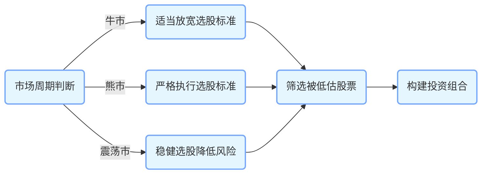

# 格雷厄姆特价股票策略在不同市场周期中的动态调整

> 关键词：格雷厄姆特价股票策略、市场周期、动态调整、价值投资、股票分析

> 摘要：本文深入探讨了格雷厄姆特价股票策略在不同市场周期中的动态调整方法。首先介绍了格雷厄姆特价股票策略的背景和核心概念，阐述了其与不同市场周期的联系。接着详细讲解了该策略的核心算法原理，并用 Python 代码进行了具体实现。通过数学模型和公式对策略进行了理论分析，并举例说明。在项目实战部分，给出了开发环境搭建的步骤，详细解读了源代码。还探讨了该策略在实际市场中的应用场景，推荐了相关的学习资源、开发工具和论文著作。最后总结了该策略未来的发展趋势与挑战，并对常见问题进行了解答，提供了扩展阅读和参考资料，旨在帮助投资者更好地运用格雷厄姆特价股票策略应对不同的市场环境。

## 1. 背景介绍 
### 1.1 目的和范围
本研究的主要目的是深入探究格雷厄姆特价股票策略在不同市场周期下的适应性和有效性，并提出相应的动态调整方法。格雷厄姆作为价值投资的先驱，其特价股票策略为投资者提供了一种筛选被低估股票的方法。然而，市场是动态变化的，不同的市场周期（如牛市、熊市、震荡市）具有不同的特征，原有的策略可能无法始终保持最佳效果。因此，我们的研究范围涵盖了对不同市场周期的识别、格雷厄姆特价股票策略的核心原理分析，以及如何根据市场周期对该策略进行动态调整，以提高投资的收益和降低风险。

### 1.2 预期读者
本文预期读者包括对价值投资感兴趣的个人投资者、专业投资机构的研究人员和投资经理、金融专业的学生以及从事金融领域研究的学者。对于个人投资者，本文可以帮助他们更好地理解和应用格雷厄姆特价股票策略，在不同市场环境下做出更明智的投资决策。专业投资人员可以从本文中获取新的研究思路和方法，进一步优化投资组合。金融专业学生和学者则可以将本文作为研究价值投资和市场周期的参考资料。

### 1.3 文档结构概述
本文将按照以下结构展开：首先介绍格雷厄姆特价股票策略的背景和相关概念，包括市场周期的定义和分类。然后阐述该策略的核心概念与不同市场周期之间的联系，并通过示意图和流程图进行直观展示。接着详细讲解核心算法原理，使用 Python 代码实现具体操作步骤。通过数学模型和公式对策略进行理论分析，并结合实际例子进行说明。在项目实战部分，介绍开发环境的搭建，给出源代码的详细实现和解读。探讨该策略在实际市场中的应用场景，推荐相关的学习资源、开发工具和论文著作。最后总结该策略未来的发展趋势与挑战，解答常见问题，并提供扩展阅读和参考资料。

### 1.4 术语表
#### 1.4.1 核心术语定义
- **格雷厄姆特价股票策略**：由本杰明·格雷厄姆提出的一种价值投资策略，主要通过分析股票的基本面指标，如市盈率、市净率等，筛选出被市场低估的股票进行投资。
- **市场周期**：指股票市场从一个极端状态（如牛市的高峰或熊市的低谷）到另一个极端状态的循环过程，通常包括牛市、熊市和震荡市三个阶段。
- **动态调整**：根据市场周期的变化，对投资策略的参数、选股标准等进行实时调整，以适应不同的市场环境。
- **价值投资**：一种投资理念，强调通过分析公司的内在价值，寻找被市场低估的股票进行长期投资，以获取超额收益。

#### 1.4.2 相关概念解释
- **牛市**：指股票市场整体呈现上涨趋势，投资者情绪乐观，交易量较大的市场状态。在牛市中，多数股票价格上涨，市场信心充足。
- **熊市**：与牛市相反，熊市是指股票市场整体呈现下跌趋势，投资者情绪悲观，交易量相对较小的市场状态。在熊市中，多数股票价格下跌，市场信心不足。
- **震荡市**：指股票市场价格在一定范围内波动，没有明显的上涨或下跌趋势的市场状态。在震荡市中，市场多空力量相对平衡，投资者操作难度较大。

#### 1.4.3 缩略词列表
- **PE**：市盈率（Price-to-Earnings Ratio），是指股票价格与每股盈利的比率，反映了市场对公司未来盈利的预期。
- **PB**：市净率（Price-to-Book Ratio），是指股票价格与每股净资产的比率，反映了股票的估值水平。
- **ROE**：净资产收益率（Return on Equity），是指公司净利润与股东权益的比率，反映了公司运用自有资本的效率。

## 2. 核心概念与联系 

### 2.1 格雷厄姆特价股票策略核心原理
格雷厄姆特价股票策略的核心思想是寻找被市场低估的股票，即股票的市场价格低于其内在价值。格雷厄姆认为，股票的内在价值可以通过分析公司的基本面指标来估算，其中最常用的指标包括市盈率（PE）、市净率（PB）等。

具体来说，格雷厄姆提出了以下选股标准：
- 低市盈率：一般认为，市盈率低于市场平均水平的股票更有可能被低估。
- 低市净率：市净率低于 1 通常被视为股票被低估的信号，因为这意味着股票价格低于公司的净资产。
- 稳定的盈利：公司应该具有稳定的盈利能力，过去几年的盈利表现良好。
- 适度的债务：公司的债务水平应该适度，避免过高的财务风险。

### 2.2 市场周期的分类与特征
市场周期通常可以分为牛市、熊市和震荡市三个阶段，每个阶段具有不同的特征：
- **牛市**：
    - 股票价格持续上涨，市场情绪乐观，投资者信心充足。
    - 交易量逐渐放大，资金大量流入股市。
    - 多数股票表现良好，市场呈现普涨格局。
- **熊市**：
    - 股票价格持续下跌，市场情绪悲观，投资者信心受挫。
    - 交易量逐渐萎缩，资金大量流出股市。
    - 多数股票表现不佳，市场呈现普跌格局。
- **震荡市**：
    - 股票价格在一定范围内波动，没有明显的上涨或下跌趋势。
    - 市场多空力量相对平衡，投资者操作难度较大。
    - 交易量相对稳定，没有明显的资金流入或流出。

### 2.3 格雷厄姆特价股票策略与市场周期的联系
格雷厄姆特价股票策略在不同市场周期中的表现和适用性有所不同：
- **牛市**：在牛市中，市场整体估值较高，被低估的股票相对较少。此时，严格按照格雷厄姆的选股标准可能难以选出足够数量的股票。因此，在牛市中可以适当放宽选股标准，如提高市盈率和市净率的上限，以扩大选股范围。
- **熊市**：在熊市中，市场整体估值较低，被低估的股票相对较多。此时，应该严格按照格雷厄姆的选股标准进行选股，以确保选出的股票具有较高的安全边际。
- **震荡市**：在震荡市中，市场缺乏明显的趋势，股票价格波动较大。此时，格雷厄姆特价股票策略可以作为一种稳健的投资策略，通过筛选被低估的股票，降低投资风险。

### 2.4 文本示意图和 Mermaid 流程图
#### 文本示意图
```plaintext
市场周期
├── 牛市
│   ├── 特征：价格上涨、情绪乐观、交易量放大
│   └── 策略调整：适当放宽选股标准
├── 熊市
│   ├── 特征：价格下跌、情绪悲观、交易量萎缩
│   └── 策略调整：严格执行选股标准
└── 震荡市
    ├── 特征：价格波动、多空平衡、交易量稳定
    └── 策略调整：稳健选股降低风险

格雷厄姆特价股票策略
├── 核心思想：寻找被低估股票
├── 选股标准：低市盈率、低市净率、稳定盈利、适度债务
└── 动态调整：根据市场周期调整选股标准
```

#### Mermaid 流程图


## 3. 核心算法原理 & 具体操作步骤 

### 3.1 核心算法原理
格雷厄姆特价股票策略的核心算法是通过计算股票的市盈率（PE）、市净率（PB）等指标，并与设定的阈值进行比较，筛选出符合条件的股票。具体步骤如下：
1. **数据收集**：收集股票的历史价格、财务报表等数据。
2. **指标计算**：计算每只股票的市盈率（PE）、市净率（PB）、净资产收益率（ROE）等指标。
3. **筛选股票**：根据设定的选股标准，筛选出符合条件的股票。
4. **构建投资组合**：将筛选出的股票按照一定的权重构建投资组合。

### 3.2 具体操作步骤及 Python 代码实现

#### 步骤 1：数据收集
我们可以使用 `pandas-datareader` 库来收集股票的历史价格和财务报表数据。以下是示例代码：
```python
import pandas as pd
import pandas_datareader.data as web
import yfinance as yf

# 设置数据收集的时间范围
start_date = '2020-01-01'
end_date = '2023-12-31'

# 定义股票代码列表
stock_symbols = ['AAPL', 'MSFT', 'GOOG', 'AMZN']

# 收集股票的历史价格数据
price_data = {}
for symbol in stock_symbols:
    data = yf.download(symbol, start=start_date, end=end_date)
    price_data[symbol] = data

# 收集股票的财务报表数据
financial_data = {}
for symbol in stock_symbols:
    ticker = yf.Ticker(symbol)
    financial_data[symbol] = ticker.financials
```

#### 步骤 2：指标计算
根据收集到的数据，计算每只股票的市盈率（PE）、市净率（PB）和净资产收益率（ROE）。以下是示例代码：
```python
# 计算市盈率（PE）
pe_ratios = {}
for symbol in stock_symbols:
    latest_price = price_data[symbol]['Close'].iloc[-1]
    latest_earnings = financial_data[symbol].loc['Net Income'].iloc[0]
    shares_outstanding = ticker.info['sharesOutstanding']
    eps = latest_earnings / shares_outstanding
    pe = latest_price / eps
    pe_ratios[symbol] = pe

# 计算市净率（PB）
pb_ratios = {}
for symbol in stock_symbols:
    latest_price = price_data[symbol]['Close'].iloc[-1]
    latest_book_value = financial_data[symbol].loc['Total Stockholder Equity'].iloc[0]
    shares_outstanding = ticker.info['sharesOutstanding']
    book_value_per_share = latest_book_value / shares_outstanding
    pb = latest_price / book_value_per_share
    pb_ratios[symbol] = pb

# 计算净资产收益率（ROE）
roe_ratios = {}
for symbol in stock_symbols:
    latest_earnings = financial_data[symbol].loc['Net Income'].iloc[0]
    latest_book_value = financial_data[symbol].loc['Total Stockholder Equity'].iloc[0]
    roe = latest_earnings / latest_book_value
    roe_ratios[symbol] = roe
```

#### 步骤 3：筛选股票
根据设定的选股标准，筛选出符合条件的股票。以下是示例代码：
```python
# 设定选股标准
pe_threshold = 15
pb_threshold = 1
roe_threshold = 0.1

# 筛选符合条件的股票
selected_stocks = []
for symbol in stock_symbols:
    if pe_ratios[symbol] < pe_threshold and pb_ratios[symbol] < pb_threshold and roe_ratios[symbol] > roe_threshold:
        selected_stocks.append(symbol)

print("筛选出的股票：", selected_stocks)
```

#### 步骤 4：构建投资组合
将筛选出的股票按照等权重的方式构建投资组合。以下是示例代码：
```python
# 构建等权重投资组合
portfolio_weights = {}
if len(selected_stocks) > 0:
    weight = 1 / len(selected_stocks)
    for symbol in selected_stocks:
        portfolio_weights[symbol] = weight

print("投资组合权重：", portfolio_weights)
```

## 4. 数学模型和公式 & 详细讲解 & 举例说明 

### 4.1 市盈率（PE）
#### 公式
市盈率（PE）的计算公式为：
$$PE = \frac{P}{EPS}$$
其中，$P$ 表示股票的当前价格，$EPS$ 表示每股盈利。

#### 详细讲解
市盈率反映了市场对公司未来盈利的预期。较低的市盈率通常意味着股票被低估，具有较高的投资价值；而较高的市盈率则可能意味着股票被高估，投资风险较大。

#### 举例说明
假设某股票的当前价格为 $50$ 美元，每股盈利为 $5$ 美元，则该股票的市盈率为：
$$PE = \frac{50}{5} = 10$$
如果市场平均市盈率为 $15$，则该股票的市盈率低于市场平均水平，可能被认为是被低估的股票。

### 4.2 市净率（PB）
#### 公式
市净率（PB）的计算公式为：
$$PB = \frac{P}{BVPS}$$
其中，$P$ 表示股票的当前价格，$BVPS$ 表示每股净资产。

#### 详细讲解
市净率反映了股票价格与公司净资产的关系。市净率低于 1 通常被视为股票被低估的信号，因为这意味着股票价格低于公司的净资产。

#### 举例说明
假设某股票的当前价格为 $20$ 美元，每股净资产为 $25$ 美元，则该股票的市净率为：
$$PB = \frac{20}{25} = 0.8$$
由于市净率低于 1，该股票可能被认为是被低估的股票。

### 4.3 净资产收益率（ROE）
#### 公式
净资产收益率（ROE）的计算公式为：
$$ROE = \frac{Net Income}{Shareholder Equity}$$
其中，$Net Income$ 表示公司的净利润，$Shareholder Equity$ 表示股东权益。

#### 详细讲解
净资产收益率反映了公司运用自有资本的效率。较高的净资产收益率意味着公司能够有效地利用股东的资金创造利润，具有较强的盈利能力。

#### 举例说明
假设某公司的净利润为 $100$ 万美元，股东权益为 $500$ 万美元，则该公司的净资产收益率为：
$$ROE = \frac{100}{500} = 0.2 = 20\%$$
较高的净资产收益率表明该公司具有较好的盈利能力。

### 4.4 动态调整的数学模型
在不同市场周期中，我们可以根据市场的整体估值水平对选股标准进行动态调整。例如，在牛市中，我们可以将市盈率和市净率的阈值适当提高，以扩大选股范围。假设市场平均市盈率为 $PE_{avg}$，市场平均市净率为 $PB_{avg}$，我们可以设定调整后的阈值为：
$$PE_{threshold} = k_1 \times PE_{avg}$$
$$PB_{threshold} = k_2 \times PB_{avg}$$
其中，$k_1$ 和 $k_2$ 是调整系数，在牛市中可以取值大于 1，在熊市中可以取值小于 1。

## 5. 项目实战：代码实际案例和详细解释说明 

### 5.1  开发环境搭建
#### 操作系统
本项目可以在 Windows、Linux 或 macOS 操作系统上进行开发。

#### Python 环境
建议使用 Python 3.7 及以上版本。可以从 Python 官方网站（https://www.python.org/downloads/）下载并安装 Python。

#### 安装必要的库
使用 `pip` 命令安装项目所需的库：
```sh
pip install pandas pandas-datareader yfinance
```

### 5.2  源代码详细实现和代码解读
以下是一个完整的 Python 代码示例，实现了格雷厄姆特价股票策略在不同市场周期中的动态调整：
```python
import pandas as pd
import pandas_datareader.data as web
import yfinance as yf

# 市场周期判断函数
def get_market_cycle(market_index_data):
    # 简单示例：根据市场指数的涨跌判断市场周期
    start_price = market_index_data['Close'].iloc[0]
    end_price = market_index_data['Close'].iloc[-1]
    if end_price > start_price:
        return 'bull'  # 牛市
    elif end_price < start_price:
        return 'bear'  # 熊市
    else:
        return 'sideways'  # 震荡市

# 动态调整选股标准函数
def adjust_selection_criteria(market_cycle):
    if market_cycle == 'bull':
        pe_threshold = 20
        pb_threshold = 1.5
    elif market_cycle == 'bear':
        pe_threshold = 10
        pb_threshold = 0.8
    else:
        pe_threshold = 15
        pb_threshold = 1
    return pe_threshold, pb_threshold

# 主函数
def main():
    # 设置数据收集的时间范围
    start_date = '2020-01-01'
    end_date = '2023-12-31'

    # 定义股票代码列表
    stock_symbols = ['AAPL', 'MSFT', 'GOOG', 'AMZN']

    # 收集市场指数数据（以 S&P 500 为例）
    market_index = '^GSPC'
    market_index_data = yf.download(market_index, start=start_date, end=end_date)

    # 判断市场周期
    market_cycle = get_market_cycle(market_index_data)
    print("当前市场周期：", market_cycle)

    # 动态调整选股标准
    pe_threshold, pb_threshold = adjust_selection_criteria(market_cycle)
    roe_threshold = 0.1

    # 收集股票的历史价格数据
    price_data = {}
    for symbol in stock_symbols:
        data = yf.download(symbol, start=start_date, end=end_date)
        price_data[symbol] = data

    # 收集股票的财务报表数据
    financial_data = {}
    for symbol in stock_symbols:
        ticker = yf.Ticker(symbol)
        financial_data[symbol] = ticker.financials

    # 计算市盈率（PE）
    pe_ratios = {}
    for symbol in stock_symbols:
        latest_price = price_data[symbol]['Close'].iloc[-1]
        latest_earnings = financial_data[symbol].loc['Net Income'].iloc[0]
        shares_outstanding = ticker.info['sharesOutstanding']
        eps = latest_earnings / shares_outstanding
        pe = latest_price / eps
        pe_ratios[symbol] = pe

    # 计算市净率（PB）
    pb_ratios = {}
    for symbol in stock_symbols:
        latest_price = price_data[symbol]['Close'].iloc[-1]
        latest_book_value = financial_data[symbol].loc['Total Stockholder Equity'].iloc[0]
        shares_outstanding = ticker.info['sharesOutstanding']
        book_value_per_share = latest_book_value / shares_outstanding
        pb = latest_price / book_value_per_share
        pb_ratios[symbol] = pb

    # 计算净资产收益率（ROE）
    roe_ratios = {}
    for symbol in stock_symbols:
        latest_earnings = financial_data[symbol].loc['Net Income'].iloc[0]
        latest_book_value = financial_data[symbol].loc['Total Stockholder Equity'].iloc[0]
        roe = latest_earnings / latest_book_value
        roe_ratios[symbol] = roe

    # 筛选符合条件的股票
    selected_stocks = []
    for symbol in stock_symbols:
        if pe_ratios[symbol] < pe_threshold and pb_ratios[symbol] < pb_threshold and roe_ratios[symbol] > roe_threshold:
            selected_stocks.append(symbol)

    print("筛选出的股票：", selected_stocks)

    # 构建等权重投资组合
    portfolio_weights = {}
    if len(selected_stocks) > 0:
        weight = 1 / len(selected_stocks)
        for symbol in selected_stocks:
            portfolio_weights[symbol] = weight

    print("投资组合权重：", portfolio_weights)

if __name__ == "__main__":
    main()
```

### 5.3  代码解读与分析
#### 市场周期判断函数 `get_market_cycle`
该函数根据市场指数的涨跌情况判断市场周期。如果市场指数的期末价格高于期初价格，则判断为牛市；如果期末价格低于期初价格，则判断为熊市；否则判断为震荡市。

#### 动态调整选股标准函数 `adjust_selection_criteria`
该函数根据市场周期动态调整选股标准。在牛市中，适当提高市盈率和市净率的阈值；在熊市中，降低市盈率和市净率的阈值；在震荡市中，使用默认的选股标准。

#### 主函数 `main`
主函数完成了整个策略的实现过程，包括数据收集、市场周期判断、选股标准调整、指标计算、股票筛选和投资组合构建等步骤。

通过以上代码，我们可以根据不同的市场周期动态调整格雷厄姆特价股票策略的选股标准，从而提高投资的收益和降低风险。

## 6. 实际应用场景 
### 6.1 个人投资者
对于个人投资者来说，格雷厄姆特价股票策略在不同市场周期中的动态调整可以帮助他们在投资过程中做出更明智的决策。在牛市中，投资者可以适当放宽选股标准，参与市场的上涨行情，获取更高的收益。在熊市中，严格执行选股标准，选择具有较高安全边际的股票，降低投资风险。在震荡市中，通过筛选被低估的股票，构建稳健的投资组合，避免市场波动带来的损失。

### 6.2 专业投资机构
专业投资机构可以将格雷厄姆特价股票策略作为一种重要的投资策略，结合市场周期进行动态调整。在资产配置方面，根据市场周期的变化，调整股票投资的比例和选股标准，优化投资组合的风险收益特征。在风险管理方面，通过严格的选股标准和动态调整，降低投资组合的系统性风险。

### 6.3 金融研究机构
金融研究机构可以利用格雷厄姆特价股票策略在不同市场周期中的动态调整方法，进行市场研究和投资策略分析。通过对历史数据的回测和分析，评估该策略在不同市场环境下的有效性和适应性，为投资者提供参考和建议。

## 7. 工具和资源推荐
### 7.1 学习资源推荐
#### 7.1.1 书籍推荐
- 《聪明的投资者》（The Intelligent Investor）：本杰明·格雷厄姆的经典著作，详细阐述了价值投资的理念和方法，是学习格雷厄姆特价股票策略的必读之书。
- 《证券分析》（Security Analysis）：同样是本杰明·格雷厄姆的著作，对证券分析的基本原理和方法进行了系统的介绍，为投资者提供了深入了解股票基本面分析的理论基础。
- 《漫步华尔街》（A Random Walk Down Wall Street）：该书介绍了各种投资策略和市场理论，帮助读者了解市场的运行规律和投资的风险与收益。

#### 7.1.2 在线课程
- Coursera 上的“Investment Management Specialization”：该课程由知名高校的教授授课，涵盖了投资管理的各个方面，包括价值投资策略的讲解和实践。
- Udemy 上的“Value Investing: The Complete Course”：课程详细介绍了价值投资的原理和方法，通过实际案例分析帮助学员掌握价值投资的技巧。

#### 7.1.3 技术博客和网站
- Seeking Alpha：提供了大量的股票分析和投资策略文章，包括对格雷厄姆特价股票策略的讨论和应用案例。
- ValueWalk：专注于价值投资领域，分享了许多价值投资者的观点和研究成果，对学习格雷厄姆特价股票策略有很大的帮助。

### 7.2 开发工具框架推荐
#### 7.2.1 IDE和编辑器
- PyCharm：一款专业的 Python 集成开发环境，提供了丰富的代码编辑、调试和项目管理功能，适合开发和调试股票投资策略相关的 Python 代码。
- Jupyter Notebook：一种交互式的开发环境，支持代码、文本和可视化的混合编写，非常适合进行数据分析和策略验证。

#### 7.2.2 调试和性能分析工具
- `pdb`：Python 内置的调试器，可以帮助开发者定位和解决代码中的问题。
- `cProfile`：Python 标准库中的性能分析工具，可以分析代码的运行时间和函数调用情况，帮助优化代码性能。

#### 7.2.3 相关框架和库
- `pandas`：强大的数据处理和分析库，提供了丰富的数据结构和函数，方便进行股票数据的处理和分析。
- `numpy`：用于科学计算的基础库，提供了高效的数组操作和数学函数，为股票策略的实现提供了数值计算支持。
- `yfinance`：用于获取股票历史价格和财务报表数据的库，简单易用，能够满足大部分数据收集的需求。

### 7.3 相关论文著作推荐
#### 7.3.1 经典论文
- Graham, B., & Dodd, D. L. (1934). Security Analysis. This classic paper laid the foundation for fundamental analysis and value investing.
- Fama, E. F., & French, K. R. (1992). The Cross-Section of Expected Stock Returns. This paper introduced the Fama-French three-factor model, which has had a significant impact on asset pricing and investment strategy research.

#### 7.3.2 最新研究成果
- Recent research papers on SSRN (Social Science Research Network) and arXiv can provide the latest findings on value investing strategies and their performance in different market cycles.

#### 7.3.3 应用案例分析
- Case studies in financial journals and investment magazines can provide practical examples of how the Graham special situation stock strategy has been applied in real-world investment scenarios.

## 8. 总结：未来发展趋势与挑战
### 8.1 未来发展趋势
- **智能化和自动化**：随着人工智能和机器学习技术的不断发展，未来格雷厄姆特价股票策略可能会与这些技术相结合，实现智能化和自动化的选股和投资决策。通过对大量历史数据的学习和分析，模型可以更准确地判断市场周期和筛选被低估的股票。
- **多因素融合**：单一的格雷厄姆特价股票策略可能无法完全适应复杂多变的市场环境。未来，该策略可能会与其他投资策略和因素（如技术分析、宏观经济指标等）进行融合，构建更加综合和有效的投资模型。
- **全球化投资**：随着全球金融市场的一体化，投资者可以更加方便地进行跨国投资。格雷厄姆特价股票策略也将在全球范围内得到更广泛的应用，投资者可以在不同国家和地区的市场中寻找被低估的股票。

### 8.2 挑战
- **数据质量和准确性**：格雷厄姆特价股票策略的实施依赖于大量的股票数据和财务报表数据。然而，数据的质量和准确性可能会受到多种因素的影响，如数据来源的可靠性、数据更新的及时性等。如果数据存在误差或不完整，可能会导致选股结果的偏差。
- **市场变化的不确定性**：市场是复杂多变的，不同市场周期的特征和持续时间可能会有所不同。准确判断市场周期并及时调整选股标准是一项具有挑战性的任务。此外，市场中还可能出现一些突发事件和异常情况，对股票价格和投资策略产生影响。
- **竞争加剧**：随着价值投资理念的普及，越来越多的投资者开始关注格雷厄姆特价股票策略。这可能会导致市场上被低估的股票数量减少，选股难度增加。同时，投资者之间的竞争也会加剧，可能会影响投资收益。

## 9. 附录：常见问题与解答
### 9.1 如何准确判断市场周期？
市场周期的判断是一个复杂的问题，没有一种绝对准确的方法。可以结合多种指标和方法进行综合判断，如市场指数的涨跌情况、成交量的变化、宏观经济数据等。此外，还可以参考专业机构和分析师的观点，但需要注意对其观点进行独立思考和分析。

### 9.2 动态调整选股标准的依据是什么？
动态调整选股标准的依据是不同市场周期的特征和股票的估值水平。在牛市中，市场整体估值较高，被低估的股票相对较少，因此可以适当放宽选股标准；在熊市中，市场整体估值较低，被低估的股票相对较多，应该严格执行选股标准；在震荡市中，为了降低投资风险，可以采用稳健的选股标准。

### 9.3 格雷厄姆特价股票策略在新兴市场的适用性如何？
格雷厄姆特价股票策略在新兴市场具有一定的适用性，但也需要考虑新兴市场的特点。新兴市场通常具有较高的波动性和不确定性，公司的财务数据质量可能相对较低。因此，在应用该策略时，需要对选股标准进行适当调整，并结合新兴市场的特点进行分析和判断。

### 9.4 如何评估投资组合的绩效？
可以使用多种指标来评估投资组合的绩效，如收益率、夏普比率、最大回撤等。收益率反映了投资组合的盈利情况；夏普比率衡量了投资组合在承担单位风险时所能获得的超额收益；最大回撤则反映了投资组合在一段时间内的最大亏损情况。通过综合分析这些指标，可以全面评估投资组合的绩效。

## 10. 扩展阅读 & 参考资料
### 扩展阅读
- Buffett, W. E. (1984). The Superinvestors of Graham-and-Doddsville. This article provides insights into the success of value investors who follow the principles of Benjamin Graham.
- Greenblatt, J. (2005). The Little Book That Beats the Market. This book introduces a simple and effective value investing strategy.

### 参考资料
- Graham, B. (1949). The Intelligent Investor. Fourth revised edition, HarperBusiness.
- Fama, E. F., & French, K. R. (1993). Common risk factors in the returns on stocks and bonds. Journal of Financial Economics, 33(1), 3-56.
- Ibbotson, R. G., & Sinquefield, R. A. (1976). Stocks, bonds, bills, and inflation. Financial Analysts Journal, 32(1), 11-47.