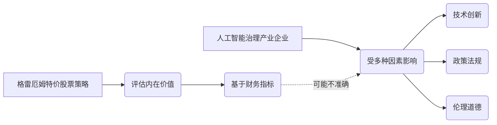

# 格雷厄姆特价股票策略在人工智能治理产业的应用挑战

> 关键词：格雷厄姆特价股票策略、人工智能治理产业、应用挑战、价值投资、金融市场

> 摘要：本文聚焦于格雷厄姆特价股票策略在人工智能治理产业中的应用挑战。首先介绍了该策略及人工智能治理产业的背景信息，深入剖析核心概念与联系，阐述其核心算法原理与操作步骤，运用数学模型和公式进行理论支撑。通过项目实战案例展示该策略在实际应用中的情况，探讨其在不同场景下的应用。同时推荐相关学习资源、开发工具和论文著作。最后总结该策略在人工智能治理产业应用的未来发展趋势与挑战，并对常见问题进行解答，提供扩展阅读与参考资料，旨在为相关领域的投资者和研究者提供全面深入的参考。

## 1. 背景介绍 
### 1.1 目的和范围
格雷厄姆特价股票策略作为经典的价值投资策略，旨在寻找被市场低估的股票以获取长期投资回报。而人工智能治理产业作为新兴且具有重要战略意义的领域，发展迅速且前景广阔。本研究的目的在于探讨将格雷厄姆特价股票策略应用于人工智能治理产业时所面临的挑战，范围涵盖该策略在产业中的理论适用性、实际操作问题、市场环境影响等多个方面。

### 1.2 预期读者
本文预期读者包括金融领域的投资者、人工智能治理产业的从业者、对价值投资和新兴产业投资感兴趣的研究者以及相关领域的学生等。希望通过本文的分析，能为他们在投资决策、产业研究等方面提供有价值的参考。

### 1.3 文档结构概述
本文首先介绍研究的背景信息，包括目的、预期读者和文档结构。接着阐述格雷厄姆特价股票策略和人工智能治理产业的核心概念与联系，分析其核心算法原理及操作步骤。通过数学模型和公式对策略进行理论分析，并举例说明。然后通过项目实战案例详细展示该策略在实际中的应用和代码实现。探讨其在不同场景下的实际应用，推荐相关的学习资源、开发工具和论文著作。最后总结未来发展趋势与挑战，解答常见问题并提供扩展阅读与参考资料。

### 1.4 术语表
#### 1.4.1 核心术语定义
- **格雷厄姆特价股票策略**：由本杰明·格雷厄姆提出的价值投资策略，通过分析股票的内在价值和市场价格，寻找被低估的股票进行投资。
- **人工智能治理产业**：指围绕人工智能技术的发展、应用和管理，进行相关政策制定、标准规范、伦理审查、安全保障等活动的产业领域。

#### 1.4.2 相关概念解释
- **价值投资**：一种投资理念，强调通过对企业基本面的分析，寻找被市场低估的股票，长期持有以获取企业价值增长带来的收益。
- **股票内在价值**：指股票所代表的企业的真实价值，通常通过对企业的财务状况、盈利能力、行业前景等因素进行综合分析来评估。

#### 1.4.3 缩略词列表
- **AI**：Artificial Intelligence，人工智能

## 2. 核心概念与联系 

### 格雷厄姆特价股票策略原理
格雷厄姆特价股票策略的核心思想是寻找价格低于其内在价值的股票。内在价值的评估主要基于企业的财务报表和一些基本的财务指标，如市盈率（P/E）、市净率（P/B）等。当股票的市场价格低于其内在价值时，认为该股票被低估，具有投资价值。

### 人工智能治理产业特点
人工智能治理产业具有技术更新快、政策法规影响大、伦理道德问题突出等特点。该产业的企业往往处于快速发展阶段，其价值不仅仅取决于当前的财务状况，还与未来的技术创新能力、市场竞争力以及政策环境等因素密切相关。

### 两者联系
从理论上讲，格雷厄姆特价股票策略可以应用于人工智能治理产业，通过评估产业内企业的内在价值，寻找被低估的股票进行投资。然而，由于人工智能治理产业的特殊性，该策略在应用过程中面临诸多挑战。例如，产业内企业的未来发展具有较大的不确定性，传统的财务指标可能无法准确反映企业的真实价值。

### 文本示意图
格雷厄姆特价股票策略与人工智能治理产业的联系可以用以下方式表示：

格雷厄姆特价股票策略通过对企业财务指标的分析评估内在价值，而人工智能治理产业内企业的价值受到技术创新、政策法规、伦理道德等多种因素影响。这些因素可能导致传统财务指标不能准确反映企业的真实价值，从而给格雷厄姆特价股票策略的应用带来挑战。

### Mermaid 流程图


## 3. 核心算法原理 & 具体操作步骤 

### 核心算法原理
格雷厄姆特价股票策略的核心算法主要基于对股票内在价值的评估。常见的方法是使用市盈率（P/E）和市净率（P/B）等指标。

市盈率（P/E）计算公式为：$P/E = \frac{股票价格}{每股收益}$

市净率（P/B）计算公式为：$P/B = \frac{股票价格}{每股净资产}$

一般来说，当市盈率和市净率较低时，认为股票可能被低估。

### 具体操作步骤

#### 步骤 1：数据收集
收集人工智能治理产业内企业的财务报表数据，包括每股收益、每股净资产、股票价格等信息。

#### 步骤 2：计算财务指标
根据收集到的数据，计算市盈率（P/E）和市净率（P/B）等指标。

#### 步骤 3：筛选股票
设定市盈率和市净率的阈值，筛选出低于阈值的股票，认为这些股票可能被低估。

#### 步骤 4：进一步分析
对筛选出的股票进行进一步的分析，包括企业的基本面、行业前景、技术创新能力等，以确定是否具有投资价值。

### Python 源代码实现
```python
import pandas as pd

# 模拟收集到的财务数据
data = {
    '股票代码': ['000001', '000002', '000003'],
    '股票价格': [10, 20, 30],
    '每股收益': [1, 2, 3],
    '每股净资产': [5, 10, 15]
}

df = pd.DataFrame(data)

# 计算市盈率和市净率
df['市盈率'] = df['股票价格'] / df['每股收益']
df['市净率'] = df['股票价格'] / df['每股净资产']

# 设定阈值
pe_threshold = 10
pb_threshold = 2

# 筛选股票
undervalued_stocks = df[(df['市盈率'] < pe_threshold) & (df['市净率'] < pb_threshold)]

print(undervalued_stocks)
```

## 4. 数学模型和公式 & 详细讲解 & 举例说明 

### 数学模型和公式
格雷厄姆特价股票策略主要基于以下两个重要的财务指标：

- **市盈率（P/E）**：$P/E = \frac{股票价格}{每股收益}$
市盈率反映了投资者为获取每单位收益所愿意支付的价格。较低的市盈率可能表示股票被低估，但也可能反映了市场对企业未来发展的悲观预期。

- **市净率（P/B）**：$P/B = \frac{股票价格}{每股净资产}$
市净率反映了股票价格与每股净资产的关系。较低的市净率可能表示股票被低估，但同样需要结合企业的具体情况进行分析。

### 详细讲解
市盈率和市净率是评估股票价值的重要指标，但在应用时需要注意以下几点：

- **行业差异**：不同行业的市盈率和市净率水平可能存在较大差异。例如，新兴的高科技行业通常具有较高的市盈率，而传统的制造业行业市盈率相对较低。因此，在使用这些指标时，需要与同行业的其他企业进行比较。

- **企业发展阶段**：企业的发展阶段也会影响市盈率和市净率的合理性。处于快速发展阶段的企业，可能由于未来的增长潜力，其市盈率和市净率会相对较高。而成熟企业的市盈率和市净率可能相对稳定。

### 举例说明
假设人工智能治理产业内有两家企业 A 和 B。企业 A 的股票价格为 50 元，每股收益为 5 元，每股净资产为 20 元；企业 B 的股票价格为 100 元，每股收益为 10 元，每股净资产为 50 元。

计算两家企业的市盈率和市净率：

- 企业 A：
  - 市盈率：$P/E_A = \frac{50}{5} = 10$
  - 市净率：$P/B_A = \frac{50}{20} = 2.5$

- 企业 B：
  - 市盈率：$P/E_B = \frac{100}{10} = 10$
  - 市净率：$P/B_B = \frac{100}{50} = 2$

从市盈率来看，两家企业相同，但从市净率来看，企业 B 相对较低。如果仅根据这两个指标判断，企业 B 可能更具有投资价值。但还需要进一步分析两家企业的基本面、行业前景等因素。

## 5. 项目实战：代码实际案例和详细解释说明 

### 5.1  开发环境搭建
- **Python 环境**：建议使用 Python 3.7 及以上版本。可以从 Python 官方网站（https://www.python.org/downloads/）下载安装。
- **开发工具**：推荐使用 PyCharm 或 Jupyter Notebook 作为开发工具。
- **相关库安装**：需要安装 pandas、numpy 等库，用于数据处理和分析。可以使用以下命令进行安装：
```sh
pip install pandas numpy
```

### 5.2  源代码详细实现和代码解读
```python
import pandas as pd

# 模拟收集到的人工智能治理产业企业财务数据
data = {
    '股票代码': ['AI001', 'AI002', 'AI003', 'AI004', 'AI005'],
    '股票价格': [20, 30, 40, 50, 60],
    '每股收益': [2, 3, 4, 5, 6],
    '每股净资产': [10, 15, 20, 25, 30]
}

df = pd.DataFrame(data)

# 计算市盈率和市净率
df['市盈率'] = df['股票价格'] / df['每股收益']
df['市净率'] = df['股票价格'] / df['每股净资产']

# 设定阈值
pe_threshold = 10
pb_threshold = 2

# 筛选股票
undervalued_stocks = df[(df['市盈率'] < pe_threshold) & (df['市净率'] < pb_threshold)]

print("筛选出的可能被低估的股票：")
print(undervalued_stocks)
```

### 代码解读与分析
1. **数据模拟**：使用字典 `data` 模拟收集到的人工智能治理产业企业的财务数据，包括股票代码、股票价格、每股收益和每股净资产。
2. **数据处理**：使用 `pandas` 库的 `DataFrame` 函数将数据转换为数据框，方便后续的计算和处理。
3. **指标计算**：通过除法运算计算市盈率和市净率，并将结果添加到数据框中。
4. **筛选股票**：根据设定的市盈率和市净率阈值，使用布尔索引筛选出可能被低估的股票。
5. **结果输出**：打印筛选出的股票信息。

需要注意的是，这只是一个简单的示例，实际应用中需要收集真实的财务数据，并结合更多的因素进行分析。

## 6. 实际应用场景 
### 投资决策参考
对于投资者来说，格雷厄姆特价股票策略可以作为在人工智能治理产业进行投资决策的参考。通过筛选出可能被低估的股票，投资者可以进一步研究这些企业的基本面和发展前景，决定是否进行投资。

### 产业研究分析
对于产业研究者来说，该策略可以用于分析人工智能治理产业内企业的价值分布情况。通过比较不同企业的市盈率和市净率等指标，可以了解产业内企业的估值水平，为产业研究提供数据支持。

### 风险管理
在投资过程中，使用该策略可以帮助投资者识别潜在的风险。如果某只股票的市盈率和市净率过高，可能表示该股票被高估，存在投资风险。投资者可以根据这些指标进行风险控制。

## 7. 工具和资源推荐
### 7.1 学习资源推荐
#### 7.1.1 书籍推荐
- 《聪明的投资者》（本杰明·格雷厄姆著）：价值投资的经典著作，详细介绍了格雷厄姆的投资理念和方法。
- 《人工智能：现代方法》（斯图尔特·罗素、彼得·诺维格著）：全面介绍了人工智能的基本概念、算法和应用，有助于了解人工智能治理产业的技术背景。

#### 7.1.2 在线课程
- Coursera 上的“人工智能基础”课程：由知名高校教授授课，系统讲解人工智能的基础知识和应用。
- edX 上的“价值投资原理”课程：深入介绍价值投资的理论和实践。

#### 7.1.3 技术博客和网站
- 机器之心（https://www.alldatasheet.com/）：专注于人工智能领域的技术资讯和研究成果分享。
- 雪球网（https://xueqiu.com/）：提供股票投资的分析和讨论，有很多关于价值投资的经验分享。

### 7.2 开发工具框架推荐
#### 7.2.1 IDE和编辑器
- PyCharm：功能强大的 Python 集成开发环境，适合进行数据处理和分析的开发。
- Jupyter Notebook：交互式的开发环境，方便进行代码的编写、调试和展示。

#### 7.2.2 调试和性能分析工具
- Py-Spy：用于分析 Python 程序的性能瓶颈，帮助优化代码。
- PDB：Python 内置的调试工具，可用于调试代码中的错误。

#### 7.2.3 相关框架和库
- Pandas：用于数据处理和分析的强大库，提供了丰富的数据结构和函数。
- Numpy：用于科学计算的基础库，提供了高效的数组操作和数学函数。

### 7.3 相关论文著作推荐
#### 7.3.1 经典论文
- “Security Analysis”（Benjamin Graham and David Dodd）：格雷厄姆和多德的经典论文，奠定了价值投资的理论基础。
- “Artificial Intelligence and the Future of Governance”（Various Authors）：探讨人工智能与治理关系的论文集，对理解人工智能治理产业有重要参考价值。

#### 7.3.2 最新研究成果
- 关注顶级学术期刊如《Journal of Artificial Intelligence Research》《Management Science》等，获取人工智能和金融领域的最新研究成果。

#### 7.3.3 应用案例分析
- 可以参考一些知名投资机构的研究报告，了解格雷厄姆特价股票策略在不同产业的应用案例和分析。

## 8. 总结：未来发展趋势与挑战
### 未来发展趋势
- **融合创新**：随着人工智能技术的不断发展，格雷厄姆特价股票策略可能会与人工智能技术相结合，开发出更加智能、高效的投资决策模型。例如，利用机器学习算法对大量的财务数据和市场信息进行分析，提高对股票内在价值的评估准确性。
- **跨产业应用**：人工智能治理产业与其他产业的融合趋势将不断加强，格雷厄姆特价股票策略可能会在更广泛的跨产业投资中得到应用。投资者可以通过该策略寻找不同产业中被低估的优质企业，实现多元化投资。
- **政策支持**：政府对人工智能治理产业的重视和支持将不断增加，相关政策的出台将有助于规范产业发展，提高产业内企业的透明度和规范性。这将为格雷厄姆特价股票策略的应用提供更好的市场环境。

### 挑战
- **技术不确定性**：人工智能治理产业的技术更新换代速度极快，企业的技术创新能力和市场竞争力难以准确评估。传统的财务指标可能无法及时反映企业的技术价值，给格雷厄姆特价股票策略的应用带来困难。
- **政策法规变化**：人工智能治理产业受到政策法规的影响较大，政策的变化可能导致企业的经营环境发生重大变化。投资者需要及时了解政策法规的动态，调整投资策略，否则可能面临投资风险。
- **伦理道德问题**：人工智能技术的应用涉及到诸多伦理道德问题，如隐私保护、算法偏见等。这些问题可能影响企业的声誉和市场形象，进而影响企业的价值。在应用格雷厄姆特价股票策略时，需要考虑这些伦理道德因素。

## 9. 附录：常见问题与解答
### 问题 1：格雷厄姆特价股票策略在人工智能治理产业中是否一定有效？
解答：不一定。由于人工智能治理产业的特殊性，如技术不确定性、政策法规变化等，传统的格雷厄姆特价股票策略可能无法完全适应。该策略只能作为投资决策的参考，需要结合其他因素进行综合分析。

### 问题 2：如何确定市盈率和市净率的阈值？
解答：市盈率和市净率的阈值没有固定的标准，需要根据不同的行业和市场环境进行调整。一般来说，可以参考同行业其他企业的平均水平，并结合企业的发展阶段和市场预期进行判断。

### 问题 3：在应用该策略时，除了财务指标，还需要考虑哪些因素？
解答：除了财务指标，还需要考虑企业的技术创新能力、市场竞争力、政策法规环境、伦理道德问题等因素。这些因素可能对企业的未来发展产生重要影响，从而影响股票的价值。

## 10. 扩展阅读 & 参考资料
### 扩展阅读
- 《金融炼金术》（乔治·索罗斯著）：探讨金融市场的运行规律和投资哲学，对理解股票投资有一定的启发。
- 《人工智能时代的社会伦理与法律挑战》（相关学者著作）：深入探讨人工智能技术带来的伦理和法律问题，有助于了解人工智能治理产业的背景。

### 参考资料
- 相关企业的财务报表和公告。
- 金融市场的统计数据和研究报告。
- 学术期刊上的相关论文。