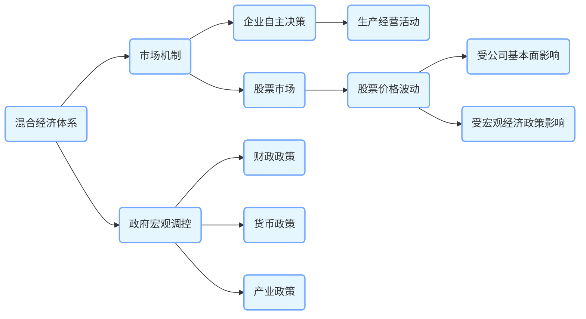

# 格雷厄姆特价股票策略在混合经济体系下的表现

> 关键词：格雷厄姆特价股票策略、混合经济体系、价值投资、股票表现、市场分析

> 摘要：本文深入探讨了格雷厄姆特价股票策略在混合经济体系下的表现。首先介绍了研究的背景、目的、预期读者等信息，阐述了核心概念及联系。接着详细讲解了该策略的核心算法原理，给出了Python源代码示例。同时，介绍了相关的数学模型和公式，并结合实例进行说明。通过项目实战，展示了代码的实际应用和详细解读。分析了该策略在不同实际应用场景中的表现，推荐了相关的学习资源、开发工具和论文著作。最后总结了未来发展趋势与挑战，并解答了常见问题，提供了扩展阅读和参考资料。旨在为投资者和研究者提供全面的视角，以更好地理解和应用格雷厄姆特价股票策略在混合经济体系中的价值。

## 1. 背景介绍 
### 1.1 目的和范围
本研究的主要目的是深入分析格雷厄姆特价股票策略在混合经济体系下的表现。混合经济体系结合了市场经济和计划经济的特点，这种经济环境下的股票市场具有独特的运行规律。格雷厄姆特价股票策略作为价值投资的经典策略，其在混合经济体系中的有效性和适应性是值得探讨的问题。本研究的范围涵盖了对该策略的理论分析、算法实现、实际案例验证以及在不同行业和市场环境下的表现评估。

### 1.2 预期读者
本文的预期读者包括对价值投资感兴趣的投资者、金融分析师、学术研究人员以及相关专业的学生。对于投资者而言，希望通过本文了解该策略在混合经济体系下的实际应用效果，为投资决策提供参考。金融分析师可以借助本文的研究方法和结论，对市场进行更深入的分析和预测。学术研究人员可以将本文作为进一步研究的基础，拓展相关领域的研究。学生则可以通过阅读本文，加深对价值投资理论和实践的理解。

### 1.3 文档结构概述
本文将按照以下结构进行组织：首先介绍核心概念与联系，包括格雷厄姆特价股票策略和混合经济体系的定义、原理和相互关系，并给出相应的示意图和流程图。接着详细阐述核心算法原理和具体操作步骤，使用Python代码进行说明。然后介绍相关的数学模型和公式，并结合实际例子进行讲解。通过项目实战，展示该策略在实际应用中的代码实现和详细解读。分析该策略在不同实际应用场景中的表现。推荐相关的学习资源、开发工具和论文著作。最后总结未来发展趋势与挑战，解答常见问题，并提供扩展阅读和参考资料。

### 1.4 术语表
#### 1.4.1 核心术语定义
- **格雷厄姆特价股票策略**：由本杰明·格雷厄姆提出的一种价值投资策略，主要通过寻找被市场低估的股票进行投资，以获取长期的资本增值。该策略强调股票的内在价值，通常通过分析公司的财务报表、资产负债情况等指标来筛选股票。
- **混合经济体系**：一种经济体制，结合了市场经济和计划经济的特点。在混合经济体系中，市场机制在资源配置中起基础性作用，同时政府也会通过宏观调控手段对经济进行干预，以实现经济的稳定增长和社会公平。
- **价值投资**：一种投资理念，强调通过分析公司的基本面，寻找被市场低估的股票进行投资，以长期持有为主要投资方式，追求股票的内在价值回归所带来的收益。

#### 1.4.2 相关概念解释
- **内在价值**：指股票所代表的公司的真实价值，通常通过对公司的财务状况、盈利能力、行业前景等因素进行分析和评估得出。内在价值是价值投资的核心概念之一，投资者通过寻找内在价值被低估的股票来获取投资机会。
- **市场效率**：指市场价格反映所有可用信息的程度。在有效市场中，股票价格能够及时、准确地反映公司的基本面信息，投资者很难通过分析基本面来获取超额收益。而在非有效市场中，股票价格可能会偏离其内在价值，为价值投资者提供了投资机会。
- **财务报表分析**：指对公司的财务报表进行分析和解读，以了解公司的财务状况、经营成果和现金流量等情况。财务报表分析是价值投资的重要工具之一，通过分析财务报表中的各项指标，如市盈率、市净率、净资产收益率等，可以评估公司的投资价值。

#### 1.4.3 缩略词列表
- **PE**：市盈率（Price-to-Earnings Ratio），指股票价格与每股收益的比率，反映了市场对公司盈利能力的预期。
- **PB**：市净率（Price-to-Book Ratio），指股票价格与每股净资产的比率，反映了市场对公司净资产的估值。
- **ROE**：净资产收益率（Return on Equity），指公司净利润与净资产的比率，反映了公司运用自有资本的效率。

## 2. 核心概念与联系 

### 2.1 格雷厄姆特价股票策略原理
格雷厄姆特价股票策略的核心思想是寻找被市场低估的股票，即股票的市场价格低于其内在价值。格雷厄姆认为，市场有时会出现非理性行为，导致股票价格偏离其内在价值。投资者可以通过分析公司的财务报表和基本面信息，寻找那些具有安全边际的股票进行投资。

安全边际是格雷厄姆特价股票策略的重要概念之一，它是指股票的内在价值与市场价格之间的差额。安全边际越大，投资者的投资风险就越小。格雷厄姆通常会选择那些市盈率、市净率较低，股息收益率较高的股票进行投资，这些股票往往具有较高的安全边际。

### 2.2 混合经济体系的特点
混合经济体系结合了市场经济和计划经济的特点。在混合经济体系中，市场机制在资源配置中起基础性作用，企业可以根据市场需求自主决策生产和经营活动。同时，政府也会通过宏观调控手段对经济进行干预，以实现经济的稳定增长、社会公平和资源的合理配置。

混合经济体系下的股票市场受到多种因素的影响，包括宏观经济政策、行业发展趋势、公司基本面等。政府的宏观调控政策可能会对某些行业或企业产生积极或消极的影响，从而影响股票的价格。此外，混合经济体系下的市场效率可能相对较低，存在信息不对称和市场失灵的情况，这为价值投资者提供了更多的投资机会。

### 2.3 核心概念的联系
格雷厄姆特价股票策略在混合经济体系下具有一定的适用性。由于混合经济体系下的市场效率相对较低，股票价格可能会偏离其内在价值，为价值投资者提供了寻找被低估股票的机会。同时，政府的宏观调控政策也可能会导致某些行业或企业的股票价格出现波动，投资者可以通过分析宏观经济政策和公司基本面，寻找那些具有安全边际的股票进行投资。

然而，混合经济体系下的股票市场也存在一些挑战。政府的宏观调控政策可能会对市场产生较大的影响，导致股票价格的波动更加复杂和难以预测。此外，混合经济体系下的市场环境可能更加复杂，投资者需要考虑更多的因素，如政策风险、行业竞争等。

### 2.4 文本示意图
```plaintext
混合经济体系
|
|-- 市场机制（资源配置基础作用）
|   |
|   |-- 企业自主决策
|   |   |
|   |   |-- 生产经营活动
|   |
|   |-- 股票市场
|       |
|       |-- 股票价格波动
|       |   |
|       |   |-- 受公司基本面影响
|       |   |-- 受宏观经济政策影响
|
|-- 政府宏观调控（实现经济目标）
    |
    |-- 财政政策
    |-- 货币政策
    |-- 产业政策
```

### 2.5 Mermaid 流程图


## 3. 核心算法原理 & 具体操作步骤 

### 3.1 核心算法原理
格雷厄姆特价股票策略的核心算法主要基于对公司财务指标的分析，以筛选出被低估的股票。以下是一些常用的财务指标和筛选标准：

- **市盈率（PE）**：市盈率是股票价格与每股收益的比率，反映了市场对公司盈利能力的预期。一般来说，较低的市盈率意味着股票被低估。格雷厄姆通常会选择市盈率低于一定阈值（如15）的股票。
- **市净率（PB）**：市净率是股票价格与每股净资产的比率，反映了市场对公司净资产的估值。较低的市净率意味着股票的价格相对其净资产较低，具有一定的安全边际。格雷厄姆通常会选择市净率低于一定阈值（如1.5）的股票。
- **股息收益率**：股息收益率是股息与股票价格的比率，反映了股票的分红情况。较高的股息收益率意味着股票具有较高的现金回报。格雷厄姆通常会选择股息收益率高于一定阈值（如3%）的股票。

### 3.2 具体操作步骤
以下是使用Python实现格雷厄姆特价股票策略的具体操作步骤：

```python
import pandas as pd

# 假设我们有一个包含股票信息的DataFrame，列名为 'stock_code', 'price', 'eps', 'book_value', 'dividend'
# 读取股票数据
data = pd.read_csv('stock_data.csv')

# 计算市盈率
data['pe'] = data['price'] / data['eps']

# 计算市净率
data['pb'] = data['price'] / data['book_value']

# 计算股息收益率
data['dividend_yield'] = data['dividend'] / data['price']

# 筛选符合条件的股票
selected_stocks = data[(data['pe'] < 15) & (data['pb'] < 1.5) & (data['dividend_yield'] > 0.03)]

# 输出筛选结果
print(selected_stocks[['stock_code', 'price', 'pe', 'pb', 'dividend_yield']])
```

### 3.3 代码解释
- **读取数据**：使用`pandas`库的`read_csv`函数读取包含股票信息的CSV文件，并将其存储在`DataFrame`对象中。
- **计算财务指标**：根据公式计算市盈率、市净率和股息收益率，并将结果存储在新的列中。
- **筛选股票**：使用布尔索引筛选出符合条件的股票，即市盈率低于15、市净率低于1.5且股息收益率高于3%的股票。
- **输出结果**：输出筛选结果，包括股票代码、价格、市盈率、市净率和股息收益率。

## 4. 数学模型和公式 & 详细讲解 & 举例说明 

### 4.1 市盈率（PE）
#### 4.1.1 公式
市盈率（PE）的计算公式为：
$$PE = \frac{P}{EPS}$$
其中，$P$ 表示股票价格，$EPS$ 表示每股收益。

#### 4.1.2 详细讲解
市盈率反映了市场对公司盈利能力的预期。较低的市盈率意味着投资者可以以较低的价格购买到公司的每股收益，即股票被低估。然而，市盈率也受到多种因素的影响，如行业特点、公司的成长前景等。不同行业的市盈率水平可能存在较大差异，因此在使用市盈率进行选股时，需要结合行业平均水平进行分析。

#### 4.1.3 举例说明
假设某股票的价格为20元，每股收益为2元，则该股票的市盈率为：
$$PE = \frac{20}{2} = 10$$
如果该行业的平均市盈率为15，则该股票的市盈率低于行业平均水平，可能被认为是被低估的股票。

### 4.2 市净率（PB）
#### 4.2.1 公式
市净率（PB）的计算公式为：
$$PB = \frac{P}{BVPS}$$
其中，$P$ 表示股票价格，$BVPS$ 表示每股净资产。

#### 4.2.2 详细讲解
市净率反映了市场对公司净资产的估值。较低的市净率意味着股票的价格相对其净资产较低，具有一定的安全边际。市净率通常用于评估那些资产规模较大、净资产较为稳定的公司。然而，市净率也存在一定的局限性，如某些轻资产行业的公司，其净资产可能不能准确反映公司的真实价值。

#### 4.2.3 举例说明
假设某股票的价格为15元，每股净资产为10元，则该股票的市净率为：
$$PB = \frac{15}{10} = 1.5$$
如果该行业的平均市净率为2，则该股票的市净率低于行业平均水平，可能被认为是被低估的股票。

### 4.3 股息收益率
#### 4.3.1 公式
股息收益率的计算公式为：
$$Dividend\ Yield = \frac{D}{P}$$
其中，$D$ 表示每股股息，$P$ 表示股票价格。

#### 4.3.2 详细讲解
股息收益率反映了股票的分红情况。较高的股息收益率意味着股票具有较高的现金回报，对于那些追求稳定收益的投资者来说具有一定的吸引力。股息收益率也受到公司盈利状况、分红政策等因素的影响。

#### 4.3.3 举例说明
假设某股票的价格为30元，每股股息为1元，则该股票的股息收益率为：
$$Dividend\ Yield = \frac{1}{30} \approx 0.0333 = 3.33\%$$
如果投资者要求的股息收益率为3%，则该股票的股息收益率满足要求。

## 5. 项目实战：代码实际案例和详细解释说明 

### 5.1  开发环境搭建
#### 5.1.1 安装Python
首先，需要安装Python开发环境。可以从Python官方网站（https://www.python.org/downloads/）下载适合自己操作系统的Python版本，并按照安装向导进行安装。

#### 5.1.2 安装必要的库
本项目需要使用`pandas`库进行数据处理和分析。可以使用以下命令安装`pandas`库：
```sh
pip install pandas
```

#### 5.1.3 准备数据
准备一个包含股票信息的CSV文件，文件中应包含以下列：`stock_code`（股票代码）、`price`（股票价格）、`eps`（每股收益）、`book_value`（每股净资产）、`dividend`（每股股息）。

### 5.2  源代码详细实现和代码解读
以下是完整的源代码：

```python
import pandas as pd

# 读取股票数据
data = pd.read_csv('stock_data.csv')

# 计算市盈率
data['pe'] = data['price'] / data['eps']

# 计算市净率
data['pb'] = data['price'] / data['book_value']

# 计算股息收益率
data['dividend_yield'] = data['dividend'] / data['price']

# 筛选符合条件的股票
selected_stocks = data[(data['pe'] < 15) & (data['pb'] < 1.5) & (data['dividend_yield'] > 0.03)]

# 输出筛选结果
print(selected_stocks[['stock_code', 'price', 'pe', 'pb', 'dividend_yield']])
```

#### 5.2.1 代码解读
- **导入库**：使用`import pandas as pd`导入`pandas`库，并将其别名设置为`pd`，方便后续使用。
- **读取数据**：使用`pd.read_csv('stock_data.csv')`读取包含股票信息的CSV文件，并将其存储在`DataFrame`对象`data`中。
- **计算财务指标**：
  - `data['pe'] = data['price'] / data['eps']`：计算市盈率，并将结果存储在新的列`pe`中。
  - `data['pb'] = data['price'] / data['book_value']`：计算市净率，并将结果存储在新的列`pb`中。
  - `data['dividend_yield'] = data['dividend'] / data['price']`：计算股息收益率，并将结果存储在新的列`dividend_yield`中。
- **筛选股票**：使用布尔索引`data[(data['pe'] < 15) & (data['pb'] < 1.5) & (data['dividend_yield'] > 0.03)]`筛选出符合条件的股票，即市盈率低于15、市净率低于1.5且股息收益率高于3%的股票，并将结果存储在`selected_stocks`中。
- **输出结果**：使用`print(selected_stocks[['stock_code', 'price', 'pe', 'pb', 'dividend_yield']])`输出筛选结果，包括股票代码、价格、市盈率、市净率和股息收益率。

### 5.3  代码解读与分析
#### 5.3.1 优点
- **简单易懂**：代码结构清晰，使用了`pandas`库的基本功能，易于理解和实现。
- **可扩展性**：可以根据需要调整筛选条件，如改变市盈率、市净率和股息收益率的阈值，以适应不同的投资策略。
- **数据处理方便**：`pandas`库提供了强大的数据处理和分析功能，可以方便地处理和分析大量的股票数据。

#### 5.3.2 局限性
- **数据质量要求高**：代码依赖于输入数据的质量，如果数据存在错误或缺失值，可能会影响筛选结果的准确性。
- **缺乏动态调整**：代码是静态的，不能实时跟踪股票市场的变化。在实际应用中，需要定期更新数据并重新运行代码。
- **未考虑其他因素**：代码仅考虑了市盈率、市净率和股息收益率等财务指标，未考虑其他因素，如公司的行业前景、管理层能力等。在实际投资中，需要综合考虑多种因素。

## 6. 实际应用场景 
### 6.1 长期投资
格雷厄姆特价股票策略适合长期投资。通过筛选出被低估的股票，并长期持有，可以享受股票价值回归所带来的收益。在混合经济体系下，由于市场效率相对较低，股票价格可能会偏离其内在价值，为长期投资者提供了更多的投资机会。长期投资者可以根据该策略筛选出具有安全边际的股票，构建投资组合，并耐心等待股票价值的提升。

### 6.2 资产配置
该策略可以作为资产配置的一部分。投资者可以将一部分资金分配到符合格雷厄姆特价股票策略的股票中，以降低投资组合的风险。在混合经济体系下，不同行业和企业受到宏观经济政策的影响程度不同，通过分散投资可以降低单一行业或企业的风险。同时，被低估的股票通常具有一定的安全边际，可以在市场下跌时提供一定的保护。

### 6.3 价值发现
格雷厄姆特价股票策略有助于发现被市场忽视的价值。在混合经济体系下，政府的宏观调控政策可能会导致某些行业或企业的股票价格出现波动，投资者可以通过分析宏观经济政策和公司基本面，寻找那些具有潜在价值的股票。通过该策略筛选出的股票可能是市场上被低估的“黑马”，具有较大的上涨潜力。

### 6.4 风险控制
该策略强调安全边际，有助于控制投资风险。在混合经济体系下，市场环境复杂多变，股票价格波动较大。通过选择市盈率、市净率较低，股息收益率较高的股票，可以降低投资风险。即使市场出现不利变化，这些股票的下跌空间也相对较小，为投资者提供了一定的安全保障。

## 7. 工具和资源推荐
### 7.1 学习资源推荐
#### 7.1.1 书籍推荐
- 《聪明的投资者》（The Intelligent Investor）：本杰明·格雷厄姆的经典著作，被誉为价值投资的圣经。书中详细阐述了格雷厄姆的投资理念和方法，对投资者具有很高的指导价值。
- 《证券分析》（Security Analysis）：同样是本杰明·格雷厄姆的著作，是价值投资领域的权威书籍。该书系统地介绍了证券分析的方法和技巧，包括财务报表分析、估值方法等。
- 《巴菲特致股东的信：股份公司教程》（The Essays of Warren Buffett: Lessons for Corporate America）：沃伦·巴菲特的书信集，收录了他多年来写给股东的信件。这些信件包含了巴菲特的投资理念、经营哲学和对市场的看法，对投资者具有很大的启发。

#### 7.1.2 在线课程
- Coursera上的“投资学原理”（Principles of Investing）：该课程由知名教授授课，涵盖了投资学的基本原理和方法，包括价值投资、资产配置等内容。
- edX上的“金融市场”（Financial Markets）：由耶鲁大学教授罗伯特·席勒（Robert Shiller）授课，深入探讨了金融市场的运行机制和投资策略。
- 中国大学MOOC上的“证券投资学”：国内多所高校联合开设的课程，系统地介绍了证券投资的理论和实践，适合初学者学习。

#### 7.1.3 技术博客和网站
- 雪球网（https://xueqiu.com/）：国内知名的投资社区，提供股票、基金等金融产品的行情信息、分析报告和投资者交流平台。
- 东方财富网（https://www.eastmoney.com/）：提供全面的金融信息服务，包括股票行情、财经新闻、研究报告等。
- Seeking Alpha（https://seekingalpha.com/）：国外知名的投资分析网站，汇聚了众多专业投资者和分析师的观点和研究报告。

### 7.2 开发工具框架推荐
#### 7.2.1 IDE和编辑器
- PyCharm：一款专业的Python集成开发环境，提供了丰富的功能和插件，适合Python开发。
- Jupyter Notebook：一个交互式的开发环境，支持Python、R等多种编程语言，适合数据分析和机器学习。
- Visual Studio Code：一款轻量级的代码编辑器，支持多种编程语言和插件，具有良好的扩展性。

#### 7.2.2 调试和性能分析工具
- PySnooper：一个简单易用的Python调试工具，可以自动记录函数的执行过程和变量的值，方便调试代码。
- cProfile：Python内置的性能分析工具，可以分析代码的运行时间和函数调用情况，帮助优化代码性能。
- Memory Profiler：一个用于分析Python代码内存使用情况的工具，可以帮助发现内存泄漏和优化内存使用。

#### 7.2.3 相关框架和库
- Pandas：一个强大的数据处理和分析库，提供了高效的数据结构和数据操作方法，适合处理和分析股票数据。
- NumPy：一个用于科学计算的Python库，提供了高效的数组操作和数学函数，是许多数据分析和机器学习库的基础。
- Matplotlib：一个用于数据可视化的Python库，可以绘制各种类型的图表，帮助分析和展示股票数据。

### 7.3 相关论文著作推荐
#### 7.3.1 经典论文
- Graham, B., & Dodd, D. L. (1934). Security Analysis. This classic book laid the foundation for value investing and introduced many of the concepts and techniques still used today.
- Fama, E. F., & French, K. R. (1992). The Cross-Section of Expected Stock Returns. This paper proposed the Fama-French three-factor model, which has had a significant impact on the field of finance.

#### 7.3.2 最新研究成果
- Asness, C. S., Frazzini, A., & Pedersen, L. H. (2019). Quality Minus Junk. This paper introduced the concept of quality investing and provided empirical evidence for its effectiveness.
- Greenblatt, J. (2005). The Little Book That Beats the Market. This book proposed the "Magic Formula" for investing, which combines value and quality factors.

#### 7.3.3 应用案例分析
- Buffett, W. E. (1984). The Superinvestors of Graham-and-Doddsville. This article analyzed the investment performance of several value investors who were influenced by Benjamin Graham and demonstrated the effectiveness of value investing.
- Crotty, J. (2003). Neo-liberalism and the Social Structure of Accumulation Theory of Long-Run Capital Accumulation. This paper analyzed the impact of neo-liberalism on the economy and financial markets and provided insights into the current economic environment.

## 8. 总结：未来发展趋势与挑战
### 8.1 未来发展趋势
#### 8.1.1 与大数据和人工智能的结合
随着大数据和人工智能技术的发展，格雷厄姆特价股票策略可以与这些技术相结合，提高选股的准确性和效率。通过分析大量的财务数据、新闻资讯和社交媒体数据，可以挖掘出更多的投资信息和潜在的投资机会。同时，利用机器学习和深度学习算法，可以对股票的未来表现进行预测，为投资者提供更科学的投资决策依据。

#### 8.1.2 适应新的经济环境
混合经济体系在不断发展和变化，未来可能会出现新的经济模式和市场特征。格雷厄姆特价股票策略需要不断适应这些变化，调整选股标准和投资策略。例如，随着科技行业的快速发展，传统的财务指标可能无法准确评估科技公司的价值，需要引入新的指标和分析方法。

#### 8.1.3 国际化发展
随着全球经济一体化的推进，股票市场的国际化程度越来越高。格雷厄姆特价股票策略可以在全球范围内寻找投资机会，通过投资不同国家和地区的股票，实现资产的多元化配置。同时，需要考虑不同国家和地区的经济政策、法律法规和文化差异，以降低投资风险。

### 8.2 挑战
#### 8.2.1 市场效率的提高
随着市场信息的传播速度加快和投资者教育水平的提高，市场效率可能会逐渐提高。这意味着股票价格可能会更快地反映公司的基本面信息，寻找被低估股票的难度可能会增加。投资者需要更加深入地分析公司的基本面和市场情况，以发现真正的投资机会。

#### 8.2.2 宏观经济政策的不确定性
混合经济体系下，政府的宏观经济政策对股票市场的影响较大。宏观经济政策的不确定性增加了投资的风险，投资者需要密切关注政策的变化，并及时调整投资策略。例如，货币政策的收紧可能会导致股票市场的下跌，投资者需要提前做好风险防范措施。

#### 8.2.3 数据质量和可靠性
格雷厄姆特价股票策略依赖于大量的财务数据和市场信息。数据的质量和可靠性直接影响到选股的准确性和投资决策的科学性。然而，数据可能存在错误、缺失或虚假的情况，投资者需要对数据进行严格的审核和验证，以确保数据的质量。

## 9. 附录：常见问题与解答
### 9.1 格雷厄姆特价股票策略是否适用于所有类型的股票市场？
格雷厄姆特价股票策略主要适用于具有一定市场效率的股票市场。在市场效率较低的市场中，股票价格可能会偏离其内在价值，为价值投资者提供了更多的投资机会。然而，在市场效率较高的市场中，股票价格可能会迅速反映公司的基本面信息，寻找被低估股票的难度会增加。此外，该策略也更适用于成熟的股票市场，对于新兴市场，由于市场环境和公司治理等方面的差异，可能需要进行适当的调整。

### 9.2 如何确定市盈率、市净率和股息收益率的合理阈值？
市盈率、市净率和股息收益率的合理阈值没有固定的标准，需要根据不同的行业、市场环境和投资目标进行确定。一般来说，可以参考行业平均水平和历史数据来确定合理的阈值。例如，对于一些稳定增长的行业，市盈率可以适当放宽；对于一些周期性行业，市净率可能更具参考价值。同时，投资者也可以根据自己的风险偏好和投资目标来调整阈值。

### 9.3 格雷厄姆特价股票策略是否需要考虑公司的行业前景和管理层能力？
虽然格雷厄姆特价股票策略主要基于财务指标进行选股，但在实际投资中，也需要考虑公司的行业前景和管理层能力。公司的行业前景决定了其未来的发展空间和盈利能力，而管理层能力则影响着公司的运营效率和决策质量。投资者可以在筛选出符合财务指标的股票后，进一步分析公司的行业前景和管理层能力，以提高投资的成功率。

### 9.4 如何处理财务数据中的异常值和缺失值？
对于财务数据中的异常值，可以采用以下方法进行处理：一是删除异常值，但需要确保删除的异常值不会影响数据的整体特征；二是对异常值进行修正，例如使用均值、中位数等统计量进行替代。对于缺失值，可以采用以下方法进行处理：一是删除包含缺失值的记录，但需要注意删除记录可能会导致样本量减少；二是使用插值法进行填充，例如线性插值、多项式插值等；三是使用机器学习算法进行预测填充。

## 10. 扩展阅读 & 参考资料
### 10.1 扩展阅读
- 《怎样选择成长股》（Common Stocks and Uncommon Profits）：菲利普·费雪（Philip Fisher）的著作，介绍了寻找成长股的方法和技巧，与格雷厄姆的价值投资理念相互补充。
- 《金融炼金术》（The Alchemy of Finance）：乔治·索罗斯（George Soros）的著作，阐述了他的反身性理论和投资哲学，对投资者的思维方式有很大的启发。
- 《黑天鹅》（The Black Swan）：纳西姆·尼古拉斯·塔勒布（Nassim Nicholas Taleb）的著作，探讨了不确定性和稀有事件对金融市场的影响，提醒投资者要注意风险防范。

### 10.2 参考资料
- Graham, B., & Dodd, D. L. (1934). Security Analysis. McGraw-Hill.
- Buffett, W. E. (1984). The Superinvestors of Graham-and-Doddsville. Hermes.
- Fama, E. F., & French, K. R. (1992). The Cross-Section of Expected Stock Returns. The Journal of Finance, 47(2), 427-465.
- Asness, C. S., Frazzini, A., & Pedersen, L. H. (2019). Quality Minus Junk. The Journal of Financial Economics, 131(2), 272-299.
- Greenblatt, J. (2005). The Little Book That Beats the Market. Wiley.

以上就是关于“格雷厄姆特价股票策略在混合经济体系下的表现”的详细文章，希望对读者有所帮助。在实际应用中，投资者需要根据自己的情况进行合理的分析和决策，同时不断学习和积累经验，以提高投资的成功率。