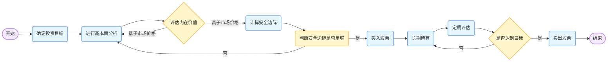

# 格雷厄姆的价值投资者修炼之道

> 关键词：格雷厄姆、价值投资、基本面分析、安全边际、内在价值、投资策略、财务报表分析

> 摘要：本文深入探讨了格雷厄姆的价值投资理念及其修炼之道。从背景介绍入手，阐述价值投资的起源和发展，明确预期读者和文档结构。详细讲解价值投资的核心概念，包括内在价值、安全边际等，并用示意图和流程图展示其联系。通过Python代码阐述核心算法原理和操作步骤，介绍相关数学模型和公式。结合项目实战，给出代码案例并详细解读。分析价值投资的实际应用场景，推荐学习资源、开发工具框架以及相关论文著作。最后总结未来发展趋势与挑战，解答常见问题并提供参考资料，帮助读者全面理解和掌握格雷厄姆的价值投资修炼方法。

## 1. 背景介绍 
### 1.1 目的和范围
价值投资作为一种历经时间考验的投资理念，由本杰明·格雷厄姆（Benjamin Graham）开创。本文的目的在于深入剖析格雷厄姆的价值投资思想，为投资者提供系统的价值投资修炼指导。范围涵盖价值投资的核心概念、算法原理、数学模型、实战案例以及实际应用场景等方面，旨在帮助读者全面理解和运用价值投资策略。

### 1.2 预期读者
本文预期读者包括对投资领域感兴趣的初学者，希望通过学习价值投资理念来构建投资知识体系；有一定投资经验但希望优化投资策略的投资者，借鉴格雷厄姆的方法提升投资绩效；金融专业的学生和研究人员，深入研究价值投资理论和实践。

### 1.3 文档结构概述
本文首先介绍背景信息，包括目的、读者和文档结构。接着阐述价值投资的核心概念与联系，用示意图和流程图展示其架构。然后讲解核心算法原理和具体操作步骤，结合Python代码进行说明。再介绍相关数学模型和公式，并举例说明。通过项目实战给出代码案例并详细解读。分析价值投资的实际应用场景，推荐学习资源、开发工具框架和相关论文著作。最后总结未来发展趋势与挑战，解答常见问题并提供参考资料。

### 1.4 术语表
#### 1.4.1 核心术语定义
- **价值投资**：一种基于对股票内在价值的分析，以低于内在价值的价格买入股票，并长期持有的投资策略。
- **内在价值**：股票所代表的企业的真实价值，由企业的资产、盈利能力、现金流等基本面因素决定。
- **安全边际**：股票的市场价格低于其内在价值的幅度，是价值投资的重要原则，用于降低投资风险。
- **基本面分析**：通过研究企业的财务报表、行业前景、管理团队等基本面因素，评估企业的内在价值和投资价值。

#### 1.4.2 相关概念解释
- **财务报表**：企业定期公布的反映其财务状况和经营成果的文件，包括资产负债表、利润表和现金流量表。
- **市盈率（PE）**：股票价格与每股收益的比率，用于衡量股票的估值水平。
- **市净率（PB）**：股票价格与每股净资产的比率，反映股票的市场价格相对于净资产的溢价程度。

#### 1.4.3 缩略词列表
- **PE**：市盈率（Price-to-Earnings Ratio）
- **PB**：市净率（Price-to-Book Ratio）

## 2. 核心概念与联系 
### 核心概念原理
价值投资的核心在于寻找被市场低估的股票，通过对企业基本面的深入分析，确定其内在价值，并在市场价格低于内在价值时买入。格雷厄姆认为，股票的市场价格会受到投资者情绪和短期市场波动的影响，但从长期来看，股票价格会回归其内在价值。

- **内在价值**：内在价值是企业基本面的综合体现，包括企业的资产、盈利能力、现金流等因素。评估内在价值需要对企业的财务报表进行深入分析，同时考虑行业前景、竞争优势等因素。
- **安全边际**：安全边际是价值投资的重要原则，它为投资者提供了一定的缓冲空间，降低了投资风险。当股票的市场价格低于其内在价值时，投资者可以获得安全边际，即使企业的未来发展出现一定的偏差，也能保证投资的安全性。
- **基本面分析**：基本面分析是确定内在价值的关键方法，通过对企业的财务报表、行业前景、管理团队等基本面因素的研究，评估企业的投资价值。基本面分析包括定量分析和定性分析，定量分析主要关注企业的财务数据，定性分析则关注企业的竞争优势、行业地位等非财务因素。

### 架构的文本示意图
```plaintext
价值投资
|-- 内在价值
|   |-- 资产
|   |-- 盈利能力
|   |-- 现金流
|   |-- 行业前景
|   |-- 竞争优势
|-- 安全边际
|   |-- 市场价格低于内在价值
|-- 基本面分析
|   |-- 财务报表分析
|   |   |-- 资产负债表
|   |   |-- 利润表
|   |   |-- 现金流量表
|   |-- 行业分析
|   |-- 管理团队分析
```

### Mermaid 流程图


## 3. 核心算法原理 & 具体操作步骤 
### 核心算法原理
价值投资的核心算法在于确定股票的内在价值，并计算安全边际。以下是一个简化的计算内在价值的方法，基于股息折现模型（Dividend Discount Model，DDM）：

股息折现模型假设股票的价值等于其未来股息的现值之和。对于一个稳定增长的企业，其内在价值可以用以下公式计算：

$V = \frac{D_1}{r - g}$

其中：
- $V$ 是股票的内在价值
- $D_1$ 是下一期预计股息
- $r$ 是投资者要求的回报率
- $g$ 是股息的增长率

### 具体操作步骤
1. **收集数据**：收集企业的财务报表、股息历史数据、行业数据等信息。
2. **分析财务报表**：计算企业的盈利能力、资产状况、现金流等指标，评估企业的基本面。
3. **预测股息**：根据企业的历史股息数据和盈利预测，预测下一期的股息 $D_1$。
4. **确定投资者要求的回报率 $r$**：考虑市场利率、风险溢价等因素，确定投资者要求的回报率。
5. **预测股息增长率 $g$**：根据企业的历史增长率、行业前景等因素，预测股息的增长率。
6. **计算内在价值 $V$**：使用股息折现模型计算股票的内在价值。
7. **计算安全边际**：比较股票的市场价格和内在价值，计算安全边际。
8. **做出投资决策**：如果安全边际足够，且符合投资目标，则买入股票；否则，继续寻找其他投资机会。

### Python 源代码实现
```python
def calculate_intrinsic_value(D1, r, g):
    """
    计算股票的内在价值
    :param D1: 下一期预计股息
    :param r: 投资者要求的回报率
    :param g: 股息的增长率
    :return: 股票的内在价值
    """
    if r <= g:
        raise ValueError("投资者要求的回报率必须大于股息增长率")
    return D1 / (r - g)

# 示例数据
D1 = 2.0  # 下一期预计股息
r = 0.1  # 投资者要求的回报率
g = 0.05  # 股息的增长率

try:
    intrinsic_value = calculate_intrinsic_value(D1, r, g)
    print(f"股票的内在价值为: {intrinsic_value}")
except ValueError as e:
    print(f"计算错误: {e}")
```

## 4. 数学模型和公式 & 详细讲解 & 举例说明 
### 股息折现模型（DDM）
#### 公式
$V = \frac{D_1}{r - g}$

#### 详细讲解
- **$V$（内在价值）**：表示股票的真实价值，是投资者应该支付的合理价格。
- **$D_1$（下一期预计股息）**：是企业预计在下一期支付的股息。通常可以根据企业的历史股息数据和盈利预测来估算。
- **$r$（投资者要求的回报率）**：反映了投资者对投资的风险偏好和预期收益。一般来说，投资者要求的回报率会高于无风险利率，以补偿投资的风险。
- **$g$（股息的增长率）**：表示股息的年增长率。对于稳定增长的企业，股息增长率通常与企业的盈利增长率相近。

#### 举例说明
假设某公司下一期预计股息 $D_1$ 为 2 元，投资者要求的回报率 $r$ 为 10%，股息的增长率 $g$ 为 5%。则该股票的内在价值为：

$V = \frac{2}{0.1 - 0.05} = \frac{2}{0.05} = 40$（元）

如果该股票的市场价格为 30 元，则安全边际为：

$\text{安全边际} = \frac{40 - 30}{40} \times 100\% = 25\%$

这意味着股票的市场价格低于其内在价值 25%，投资者可以以较低的价格买入该股票，获得一定的安全边际。

### 修正的股息折现模型
在实际应用中，股息折现模型可能需要进行修正，以考虑企业的不同发展阶段。例如，对于高速增长的企业，股息增长率可能在未来会逐渐下降，这时可以采用两阶段或多阶段股息折现模型。

两阶段股息折现模型的公式为：

$V = \sum_{t=1}^{n} \frac{D_0(1 + g_1)^t}{(1 + r)^t} + \frac{D_n(1 + g_2)}{(r - g_2)(1 + r)^n}$

其中：
- $D_0$ 是当前股息
- $g_1$ 是高速增长阶段的股息增长率
- $g_2$ 是稳定增长阶段的股息增长率
- $n$ 是高速增长阶段的年数
- $D_n$ 是第 $n$ 年的股息

### 举例说明两阶段股息折现模型
假设某公司当前股息 $D_0$ 为 1 元，预计未来 5 年的股息增长率 $g_1$ 为 20%，5 年后进入稳定增长阶段，股息增长率 $g_2$ 为 5%，投资者要求的回报率 $r$ 为 10%。

首先，计算前 5 年的股息现值：

| 年份 | 股息 | 现值 |
| ---- | ---- | ---- |
| 1 | $1\times(1 + 0.2) = 1.2$ | $\frac{1.2}{(1 + 0.1)^1} \approx 1.09$ |
| 2 | $1.2\times(1 + 0.2) = 1.44$ | $\frac{1.44}{(1 + 0.1)^2} \approx 1.19$ |
| 3 | $1.44\times(1 + 0.2) = 1.728$ | $\frac{1.728}{(1 + 0.1)^3} \approx 1.30$ |
| 4 | $1.728\times(1 + 0.2) = 2.0736$ | $\frac{2.0736}{(1 + 0.1)^4} \approx 1.42$ |
| 5 | $2.0736\times(1 + 0.2) = 2.48832$ | $\frac{2.48832}{(1 + 0.1)^5} \approx 1.55$ |

前 5 年股息现值之和为：$1.09 + 1.19 + 1.30 + 1.42 + 1.55 = 6.55$（元）

然后，计算第 5 年后的股息现值：

$D_5 = 2.48832$

$D_6 = D_5\times(1 + g_2) = 2.48832\times(1 + 0.05) = 2.612736$

第 5 年后的股息现值为：

$\frac{D_6}{(r - g_2)(1 + r)^5} = \frac{2.612736}{(0.1 - 0.05)(1 + 0.1)^5} \approx 32.65$（元）

该股票的内在价值为：$6.55 + 32.65 = 39.2$（元）

## 5. 项目实战：代码实际案例和详细解释说明 
### 5.1  开发环境搭建
#### 安装 Python
首先，需要安装 Python 开发环境。可以从 Python 官方网站（https://www.python.org/downloads/） 下载适合自己操作系统的 Python 安装包，并按照安装向导进行安装。

#### 安装必要的库
在本项目中，需要使用 `pandas` 库进行数据处理，`yfinance` 库获取股票数据。可以使用以下命令安装这些库：

```sh
pip install pandas yfinance
```

### 5.2  源代码详细实现和代码解读
```python
import yfinance as yf
import pandas as pd

def get_stock_data(ticker, start_date, end_date):
    """
    获取股票数据
    :param ticker: 股票代码
    :param start_date: 开始日期
    :param end_date: 结束日期
    :return: 股票数据 DataFrame
    """
    stock_data = yf.download(ticker, start=start_date, end=end_date)
    return stock_data

def calculate_dividend_growth_rate(dividends):
    """
    计算股息增长率
    :param dividends: 股息数据 Series
    :return: 股息增长率
    """
    if len(dividends) < 2:
        raise ValueError("股息数据不足，无法计算增长率")
    first_dividend = dividends.iloc[0]
    last_dividend = dividends.iloc[-1]
    years = len(dividends)
    growth_rate = (last_dividend / first_dividend) ** (1 / years) - 1
    return growth_rate

def calculate_intrinsic_value(D1, r, g):
    """
    计算股票的内在价值
    :param D1: 下一期预计股息
    :param r: 投资者要求的回报率
    :param g: 股息的增长率
    :return: 股票的内在价值
    """
    if r <= g:
        raise ValueError("投资者要求的回报率必须大于股息增长率")
    return D1 / (r - g)

# 示例参数
ticker = "AAPL"  # 股票代码
start_date = "2010-01-01"
end_date = "2023-12-31"
r = 0.1  # 投资者要求的回报率

# 获取股票数据
stock_data = get_stock_data(ticker, start_date, end_date)

# 获取股息数据
dividends = stock_data['Dividends']

# 计算股息增长率
try:
    g = calculate_dividend_growth_rate(dividends)
    print(f"股息增长率: {g * 100:.2f}%")
except ValueError as e:
    print(f"计算股息增长率错误: {e}")
    g = 0

# 预测下一期股息
if len(dividends) > 0:
    D1 = dividends.iloc[-1] * (1 + g)
else:
    D1 = 0

# 计算内在价值
try:
    intrinsic_value = calculate_intrinsic_value(D1, r, g)
    print(f"股票的内在价值为: {intrinsic_value:.2f}")
except ValueError as e:
    print(f"计算内在价值错误: {e}")
```

### 5.3  代码解读与分析
- **`get_stock_data` 函数**：使用 `yfinance` 库下载指定股票在指定日期范围内的数据，并返回一个 `DataFrame` 对象。
- **`calculate_dividend_growth_rate` 函数**：根据股息数据计算股息增长率。首先检查股息数据的长度是否足够，如果不足则抛出异常。然后计算初始股息和最后股息，根据公式计算增长率。
- **`calculate_intrinsic_value` 函数**：根据股息折现模型计算股票的内在价值。检查投资者要求的回报率是否大于股息增长率，如果不满足条件则抛出异常。
- **主程序**：设置示例参数，包括股票代码、日期范围和投资者要求的回报率。调用 `get_stock_data` 函数获取股票数据，提取股息数据。调用 `calculate_dividend_growth_rate` 函数计算股息增长率，预测下一期股息。最后调用 `calculate_intrinsic_value` 函数计算股票的内在价值。

## 6. 实际应用场景 
### 股票投资
价值投资在股票投资中应用广泛。投资者通过分析企业的基本面，寻找被市场低估的股票，以低于内在价值的价格买入，并长期持有。例如，巴菲特通过价值投资理念，长期持有可口可乐、富国银行等优质企业的股票，获得了丰厚的回报。

### 基金投资
价值投资也可以应用于基金投资。投资者可以选择遵循价值投资策略的基金，由专业的基金经理进行股票筛选和投资组合管理。这些基金通常会关注企业的基本面和估值，寻找具有投资价值的股票。

### 资产配置
在资产配置中，价值投资可以作为一种重要的投资策略。投资者可以将一部分资金配置到价值型股票或基金中，以平衡投资组合的风险和收益。价值型股票通常具有较低的估值和较高的股息率，可以为投资组合提供稳定的收益和一定的安全边际。

### 长期投资规划
对于长期投资规划，价值投资理念具有重要的指导意义。投资者可以根据自己的投资目标和风险承受能力，选择具有长期投资价值的企业进行投资。通过长期持有，分享企业的成长和盈利，实现资产的增值。

## 7. 工具和资源推荐
### 7.1 学习资源推荐
#### 7.1.1 书籍推荐
- 《聪明的投资者》（The Intelligent Investor）：本杰明·格雷厄姆的经典著作，被誉为价值投资的“圣经”，详细阐述了价值投资的理念和方法。
- 《证券分析》（Security Analysis）：同样是格雷厄姆的著作，是价值投资领域的权威教材，对企业的基本面分析和估值方法进行了深入探讨。
- 《巴菲特致股东的信》（Letters to Shareholders of Berkshire Hathaway）：沃伦·巴菲特每年写给股东的信，包含了他的投资理念、策略和对市场的看法，是学习价值投资的宝贵资料。

#### 7.1.2 在线课程
- Coursera 平台上的“投资学原理”（Principles of Investing）课程，由知名教授授课，系统介绍了投资学的基本原理和方法，包括价值投资。
- edX 平台上的“金融市场”（Financial Markets）课程，由耶鲁大学教授罗伯特·席勒（Robert Shiller）主讲，对金融市场和投资策略进行了深入讲解。

#### 7.1.3 技术博客和网站
- 雪球网（https://xueqiu.com/）：国内知名的投资社区，提供股票、基金等投资品种的信息和分析，有很多价值投资者分享自己的投资经验和观点。
- Seeking Alpha（https://seekingalpha.com/）：国外知名的投资分析网站，提供全球范围内的股票、债券等投资品种的分析报告和评论。

### 7.2 开发工具框架推荐
#### 7.2.1 IDE和编辑器
- PyCharm：一款专业的 Python 集成开发环境，具有强大的代码编辑、调试和分析功能，适合进行价值投资相关的数据分析和算法实现。
- Jupyter Notebook：一个交互式的开发环境，支持 Python、R 等多种编程语言，方便进行数据探索和可视化，适合进行价值投资的研究和实验。

#### 7.2.2 调试和性能分析工具
- `pdb`：Python 自带的调试工具，可以帮助开发者定位代码中的问题和错误。
- `cProfile`：Python 标准库中的性能分析工具，可以分析代码的运行时间和函数调用情况，帮助开发者优化代码性能。

#### 7.2.3 相关框架和库
- `pandas`：用于数据处理和分析的 Python 库，提供了高效的数据结构和数据操作方法，适合处理股票数据和财务报表数据。
- `yfinance`：用于获取股票数据的 Python 库，可以方便地下载股票的历史价格、股息等数据。

### 7.3 相关论文著作推荐
#### 7.3.1 经典论文
- Benjamin Graham and David Dodd, "Security Analysis" (1934)：价值投资领域的经典论文，奠定了价值投资的理论基础。
- Eugene F. Fama and Kenneth R. French, "The Cross-Section of Expected Stock Returns" (1992)：提出了著名的三因子模型，对股票的预期收益率进行了深入研究。

#### 7.3.2 最新研究成果
- 关注顶级金融学术期刊，如 The Journal of Finance、The Review of Financial Studies 等，了解价值投资领域的最新研究进展。

#### 7.3.3 应用案例分析
- 可以参考一些专业的投资研究机构发布的报告，了解价值投资在实际案例中的应用和效果。

## 8. 总结：未来发展趋势与挑战
### 未来发展趋势
- **量化价值投资**：随着信息技术的发展和大数据的应用，量化价值投资将成为未来的发展趋势。通过建立量化模型，利用大量的财务数据和市场数据进行股票筛选和投资决策，可以提高投资效率和准确性。
- **全球价值投资**：随着全球经济一体化的发展，价值投资将不再局限于国内市场，投资者将更加关注全球范围内的投资机会。通过跨市场、跨行业的投资，实现资产的多元化配置，降低投资风险。
- **社会责任投资与价值投资的融合**：越来越多的投资者开始关注企业的社会责任和可持续发展，社会责任投资与价值投资的融合将成为未来的发展方向。投资者在选择投资标的时，不仅会考虑企业的财务指标，还会关注企业的环境、社会和治理（ESG）表现。

### 挑战
- **市场有效性挑战**：有效市场假说认为，市场价格已经反映了所有可用的信息，因此很难通过基本面分析找到被低估的股票。然而，价值投资的前提是市场存在无效性，投资者可以通过分析基本面找到被低估的股票。如何在市场有效性的背景下，寻找价值投资的机会，是价值投资者面临的挑战之一。
- **数据质量和可靠性挑战**：价值投资依赖于大量的财务数据和市场数据，数据的质量和可靠性直接影响投资决策的准确性。然而，财务数据可能存在造假和粉饰的情况，市场数据也可能存在误差和滞后性。如何保证数据的质量和可靠性，是价值投资者需要解决的问题。
- **投资者情绪和行为偏差挑战**：投资者的情绪和行为偏差会影响市场价格的波动，导致股票价格偏离其内在价值。例如，投资者的过度乐观或过度悲观情绪会导致股票价格的高估或低估。如何克服投资者情绪和行为偏差的影响，是价值投资者面临的挑战之一。

## 9. 附录：常见问题与解答
### 价值投资适合所有投资者吗？
价值投资并不适合所有投资者。价值投资需要投资者具备一定的财务知识和分析能力，能够对企业的基本面进行深入分析。同时，价值投资通常需要长期持有股票，投资者需要有足够的耐心和定力。对于缺乏投资经验和风险承受能力较低的投资者来说，可能更适合选择一些稳健的投资方式，如基金定投等。

### 如何确定股票的内在价值？
确定股票的内在价值是价值投资的核心问题。常用的方法包括股息折现模型、现金流折现模型、市盈率法、市净率法等。这些方法各有优缺点，需要根据企业的具体情况选择合适的方法。同时，内在价值的计算还需要考虑企业的行业前景、竞争优势、管理团队等非财务因素，因此内在价值的确定是一个复杂的过程，需要投资者进行综合分析。

### 安全边际的大小如何确定？
安全边际的大小没有固定的标准，需要根据投资者的风险偏好和市场情况来确定。一般来说，安全边际越大，投资风险越低，但同时可能也会错过一些投资机会。投资者可以根据自己的风险承受能力和投资目标，设定一个合理的安全边际范围。例如，一些投资者可能认为安全边际达到 20% - 30% 是比较合适的。

### 价值投资需要关注短期市场波动吗？
价值投资强调长期投资，不建议投资者过于关注短期市场波动。短期市场波动受到投资者情绪、宏观经济数据等多种因素的影响，很难预测。而价值投资关注的是企业的内在价值，只要企业的基本面没有发生重大变化，短期市场波动不会影响股票的长期投资价值。因此，价值投资者应该保持冷静，不受短期市场波动的干扰，坚持长期投资策略。

## 10. 扩展阅读 & 参考资料
### 扩展阅读
- 《怎样选择成长股》（Common Stocks and Uncommon Profits）：菲利普·费雪（Philip Fisher）的著作，介绍了寻找成长股的方法和技巧，与价值投资理念相互补充。
- 《漫步华尔街》（A Random Walk Down Wall Street）：伯顿·马尔基尔（Burton Malkiel）的著作，对有效市场假说和投资策略进行了深入探讨，有助于投资者理解市场的运行机制。

### 参考资料
- Benjamin Graham, "The Intelligent Investor", HarperBusiness, 2003.
- Benjamin Graham and David Dodd, "Security Analysis", McGraw-Hill, 1934.
- Warren Buffett, "Letters to Shareholders of Berkshire Hathaway", Berkshire Hathaway Inc.
- Eugene F. Fama and Kenneth R. French, "The Cross-Section of Expected Stock Returns", The Journal of Finance, 1992.