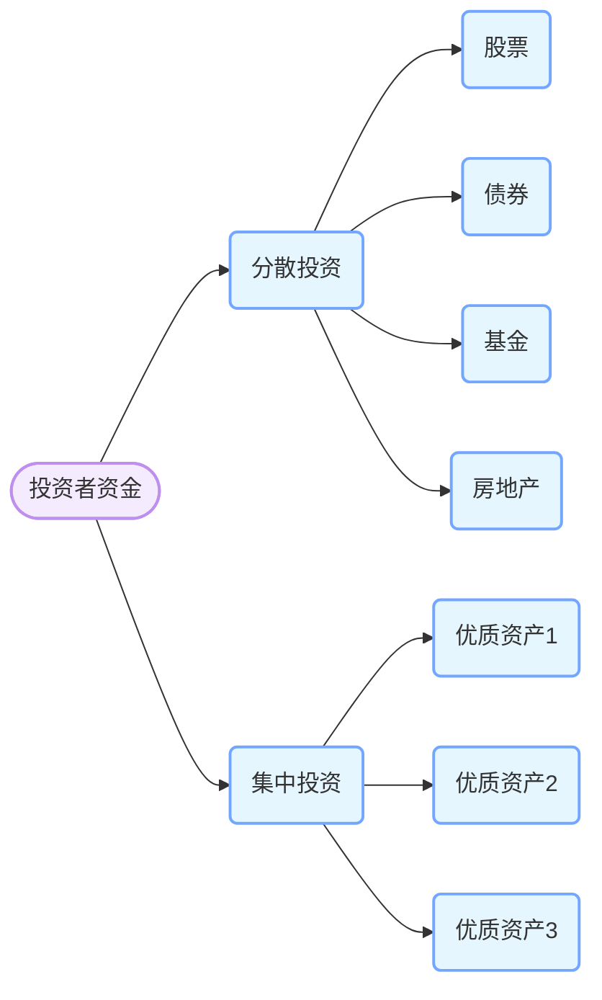

# 格雷厄姆的分散投资vs集中投资

> 关键词：格雷厄姆、分散投资、集中投资、投资策略、风险管理

> 摘要：本文围绕格雷厄姆提出的分散投资和集中投资两种策略展开深入探讨。首先介绍了两种投资策略的背景知识，包括其目的、适用读者和文档结构等。接着详细阐述了核心概念，通过文本示意图和Mermaid流程图展示其原理和架构。对核心算法原理及具体操作步骤进行了分析，并运用Python代码进行说明。同时给出了相关的数学模型和公式，并举例讲解。在项目实战部分，通过实际代码案例进行详细解释。还探讨了两种策略的实际应用场景，推荐了相关的学习工具和资源。最后总结了未来发展趋势与挑战，解答常见问题并提供扩展阅读和参考资料，旨在帮助投资者全面了解这两种策略，做出更合理的投资决策。

## 1. 背景介绍 
### 1.1 目的和范围
投资是金融领域的核心活动之一，而选择合适的投资策略对于投资者实现资产的保值增值至关重要。格雷厄姆作为投资领域的大师，提出了分散投资和集中投资两种经典的投资策略。本文的目的在于深入剖析这两种策略的原理、优缺点以及适用场景，为投资者提供全面的参考。范围涵盖了从理论基础到实际应用的各个方面，包括核心概念的解释、算法原理的分析、数学模型的构建、实际案例的展示以及未来趋势的探讨等。

### 1.2 预期读者
本文预期读者主要包括对投资领域感兴趣的初学者，他们希望通过了解不同的投资策略来建立自己的投资理念；也适合有一定投资经验的投资者，他们可以通过本文对格雷厄姆的投资策略进行更深入的研究和反思，从而优化自己的投资组合；同时，对于金融专业的学生和研究人员来说，本文也可以作为研究投资策略的参考资料。

### 1.3 文档结构概述
本文将按照以下结构展开：首先介绍两种投资策略的核心概念和它们之间的联系，通过文本示意图和Mermaid流程图进行清晰展示；接着详细阐述核心算法原理和具体操作步骤，并使用Python代码进行说明；然后构建数学模型和公式，结合实际例子进行详细讲解；在项目实战部分，展示代码实际案例并进行详细解释；之后探讨两种策略的实际应用场景；推荐相关的学习工具和资源；最后总结未来发展趋势与挑战，解答常见问题并提供扩展阅读和参考资料。

### 1.4 术语表
#### 1.4.1 核心术语定义
- **分散投资**：是指将资金分散投资于多个不同的资产或投资项目中，以降低单一资产波动对整体投资组合的影响，从而达到分散风险的目的。
- **集中投资**：是指将大部分资金集中投资于少数几个被认为具有高潜力的资产或投资项目中，通过深入研究和精准选择，期望获得更高的回报。

#### 1.4.2 相关概念解释
- **风险分散化**：通过分散投资，将资金分配到不同的资产类别、行业、地区等，使得各种资产的风险相互抵消，从而降低整个投资组合的风险水平。
- **超额收益**：集中投资追求的是通过对少数优质资产的深入研究和集中投入，获得超过市场平均水平的收益。

#### 1.4.3 缩略词列表
- **ROI**：Return on Investment，投资回报率。
- **VAR**：Value at Risk，风险价值，用于衡量投资组合在一定置信水平下可能面临的最大损失。

## 2. 核心概念与联系 
### 核心概念原理
#### 分散投资原理
分散投资的核心原理基于资产之间的相关性。不同资产在不同的市场环境下表现不同，如果将资金分散投资于多个相关性较低的资产，当其中某个资产表现不佳时，其他资产可能表现较好，从而抵消部分损失，降低整个投资组合的波动性。例如，股票市场和债券市场在某些情况下呈现负相关关系，当股票市场下跌时，债券市场可能上涨，通过同时投资股票和债券可以降低投资组合的风险。

#### 集中投资原理
集中投资的原理是基于对少数优质资产的深入研究和精准判断。投资者通过对企业的基本面、行业前景、管理层能力等进行全面分析，选择具有高成长潜力和竞争优势的企业进行集中投资。由于集中投资的资产数量较少，投资者可以更深入地了解这些资产，及时把握其发展动态，从而在这些资产实现价值增长时获得高额回报。

### 架构的文本示意图
#### 分散投资架构
投资者的资金被分配到多个不同的资产类别中，如股票、债券、基金、房地产等。每个资产类别又包含多个具体的投资项目，例如股票可以分为不同行业、不同规模的企业股票。通过这种多层次的分散，降低了单一资产对整体投资组合的影响。

#### 集中投资架构
投资者将大部分资金集中投入到少数几个精心挑选的资产中。这些资产通常是投资者经过深入研究和分析后认为具有独特竞争优势和高成长潜力的企业股票或其他投资项目。投资者密切关注这些资产的发展情况，及时调整投资策略。

### Mermaid 流程图


## 3. 核心算法原理 & 具体操作步骤 
### 分散投资核心算法原理及操作步骤
#### 原理
分散投资的核心算法是基于资产的风险和收益特征，通过优化资金分配比例，使得投资组合在给定风险水平下获得最大收益，或者在给定收益水平下承担最小风险。常用的方法是现代投资组合理论中的均值 - 方差模型。

#### 操作步骤
1. **确定投资范围**：选择要投资的资产类别，如股票、债券、基金等。
2. **收集数据**：收集每个资产的历史收益率、波动率等数据。
3. **计算协方差矩阵**：协方差矩阵反映了不同资产之间的相关性。
4. **设定目标**：可以是最小化风险、最大化收益或在一定风险约束下最大化收益。
5. **求解优化问题**：使用优化算法求解最优的资金分配比例。

#### Python代码实现
```python
import numpy as np
import pandas as pd
from scipy.optimize import minimize

# 假设我们有3种资产，收集它们的历史收益率数据
returns = pd.DataFrame({
    'Asset1': [0.05, 0.03, 0.02, 0.06, 0.04],
    'Asset2': [0.03, 0.02, 0.01, 0.04, 0.03],
    'Asset3': [0.04, 0.02, 0.03, 0.05, 0.03]
})

# 计算每种资产的平均收益率和协方差矩阵
mean_returns = returns.mean()
cov_matrix = returns.cov()

# 定义目标函数：最小化投资组合的方差
def portfolio_variance(weights, cov_matrix):
    return np.dot(weights.T, np.dot(cov_matrix, weights))

# 约束条件：权重之和为1
constraints = ({'type': 'eq', 'fun': lambda x: np.sum(x) - 1})

# 权重范围：0到1之间
bounds = [(0, 1) for _ in range(len(mean_returns))]

# 初始权重猜测
initial_weights = np.ones(len(mean_returns)) / len(mean_returns)

# 求解优化问题
result = minimize(portfolio_variance, initial_weights, args=(cov_matrix),
                  method='SLSQP', bounds=bounds, constraints=constraints)

optimal_weights = result.x
print("最优权重:", optimal_weights)
```

### 集中投资核心算法原理及操作步骤
#### 原理
集中投资的核心算法是基于对资产的内在价值评估。投资者通过分析企业的财务报表、行业前景、竞争优势等因素，估算企业的内在价值，并与当前市场价格进行比较。如果内在价值高于市场价格，则认为该资产被低估，具有投资价值。

#### 操作步骤
1. **筛选资产**：根据自己的投资标准，如行业、规模、财务指标等，筛选出潜在的投资目标。
2. **深入研究**：对筛选出的资产进行深入研究，包括企业的基本面分析、竞争优势评估、管理层能力考察等。
3. **估值计算**：使用合适的估值方法，如现金流折现法、市盈率法等，计算企业的内在价值。
4. **比较判断**：将内在价值与市场价格进行比较，判断资产是否被低估。
5. **决策投资**：如果资产被低估且符合投资要求，则进行投资。

#### Python代码实现
```python
# 假设我们使用市盈率法对一家公司进行估值
# 收集相关数据
earnings_per_share = 2.0  # 每股收益
industry_pe_ratio = 15  # 行业平均市盈率

# 计算内在价值
intrinsic_value = earnings_per_share * industry_pe_ratio

# 假设当前市场价格为20元
market_price = 20

# 判断是否被低估
if intrinsic_value > market_price:
    print("该资产被低估，具有投资价值。")
else:
    print("该资产未被低估，谨慎投资。")
```

## 4. 数学模型和公式 & 详细讲解 & 举例说明 
### 分散投资数学模型和公式
#### 均值 - 方差模型
均值 - 方差模型是现代投资组合理论的核心模型，用于构建最优投资组合。

**数学公式**：
设投资组合中包含 $n$ 种资产，第 $i$ 种资产的权重为 $w_i$，平均收益率为 $\mu_i$，协方差矩阵为 $\Sigma$。投资组合的预期收益率 $E(R_p)$ 和方差 $\sigma_p^2$ 分别为：
$$E(R_p)=\sum_{i=1}^{n}w_i\mu_i$$
$$\sigma_p^2=\sum_{i=1}^{n}\sum_{j=1}^{n}w_iw_j\sigma_{ij}$$
其中，$\sigma_{ij}$ 是资产 $i$ 和资产 $j$ 的协方差。

**详细讲解**：
预期收益率 $E(R_p)$ 表示投资组合在未来可能获得的平均收益，它是每种资产的预期收益率乘以其权重的加权平均值。方差 $\sigma_p^2$ 衡量了投资组合的风险，它考虑了资产之间的相关性。通过调整权重 $w_i$，可以在预期收益率和风险之间进行权衡。

**举例说明**：
假设投资组合包含两种资产，资产 A 的预期收益率为 10%，权重为 0.6；资产 B 的预期收益率为 8%，权重为 0.4。资产 A 和资产 B 的协方差为 0.005。则投资组合的预期收益率为：
$$E(R_p)=0.6\times0.1 + 0.4\times0.08 = 0.092 = 9.2\%$$
投资组合的方差为：
$$\sigma_p^2 = 0.6^2\times\sigma_A^2 + 0.4^2\times\sigma_B^2 + 2\times0.6\times0.4\times0.005$$
假设 $\sigma_A^2 = 0.01$，$\sigma_B^2 = 0.008$，则：
$$\sigma_p^2 = 0.6^2\times0.01 + 0.4^2\times0.008 + 2\times0.6\times0.4\times0.005 = 0.0072 + 0.00128 + 0.0024 = 0.01088$$

### 集中投资数学模型和公式
#### 现金流折现法
现金流折现法是一种常用的估值方法，用于估算企业的内在价值。

**数学公式**：
假设企业在未来 $n$ 期的自由现金流为 $FCF_t$，折现率为 $r$，则企业的内在价值 $V$ 为：
$$V=\sum_{t=1}^{n}\frac{FCF_t}{(1 + r)^t}+\frac{TV}{(1 + r)^n}$$
其中，$TV$ 是企业的终值。

**详细讲解**：
该公式的核心思想是将企业未来的自由现金流折现到当前时刻，得到企业的内在价值。自由现金流 $FCF_t$ 表示企业在第 $t$ 期可以自由支配的现金流量，折现率 $r$ 反映了资金的时间价值和投资的风险。终值 $TV$ 是企业在第 $n$ 期之后的持续经营价值。

**举例说明**：
假设一家企业未来 3 年的自由现金流分别为 100 万元、120 万元、150 万元，折现率为 10%，第 3 年末的终值为 1000 万元。则企业的内在价值为：
$$V=\frac{100}{(1 + 0.1)^1}+\frac{120}{(1 + 0.1)^2}+\frac{150}{(1 + 0.1)^3}+\frac{1000}{(1 + 0.1)^3}$$
$$V=\frac{100}{1.1}+\frac{120}{1.21}+\frac{150}{1.331}+\frac{1000}{1.331}$$
$$V\approx90.91 + 99.17 + 112.69 + 751.31 = 1054.08 \text{（万元）}$$

## 5. 项目实战：代码实际案例和详细解释说明 
### 5.1  开发环境搭建
#### 安装Python
首先，需要安装 Python 编程语言。可以从 Python 官方网站（https://www.python.org/downloads/）下载适合自己操作系统的 Python 安装包，并按照安装向导进行安装。

#### 安装必要的库
在本项目中，需要使用一些 Python 库，如 `numpy`、`pandas`、`scipy` 等。可以使用 `pip` 命令进行安装：
```sh
pip install numpy pandas scipy
```

### 5.2  源代码详细实现和代码解读
#### 分散投资项目实战
```python
import numpy as np
import pandas as pd
from scipy.optimize import minimize

# 生成模拟的资产收益率数据
np.random.seed(0)
num_assets = 5
num_periods = 100
returns = pd.DataFrame(np.random.randn(num_periods, num_assets) * 0.01)

# 计算每种资产的平均收益率和协方差矩阵
mean_returns = returns.mean()
cov_matrix = returns.cov()

# 定义目标函数：最小化投资组合的方差
def portfolio_variance(weights, cov_matrix):
    return np.dot(weights.T, np.dot(cov_matrix, weights))

# 约束条件：权重之和为1
constraints = ({'type': 'eq', 'fun': lambda x: np.sum(x) - 1})

# 权重范围：0到1之间
bounds = [(0, 1) for _ in range(num_assets)]

# 初始权重猜测
initial_weights = np.ones(num_assets) / num_assets

# 求解优化问题
result = minimize(portfolio_variance, initial_weights, args=(cov_matrix),
                  method='SLSQP', bounds=bounds, constraints=constraints)

optimal_weights = result.x
print("最优权重:", optimal_weights)

# 计算最优投资组合的预期收益率和方差
portfolio_return = np.dot(optimal_weights, mean_returns)
portfolio_variance = np.dot(optimal_weights.T, np.dot(cov_matrix, optimal_weights))
print("最优投资组合的预期收益率:", portfolio_return)
print("最优投资组合的方差:", portfolio_variance)
```
**代码解读**：
1. **数据生成**：使用 `numpy` 生成模拟的资产收益率数据。
2. **计算统计量**：计算每种资产的平均收益率和协方差矩阵。
3. **定义目标函数**：定义最小化投资组合方差的目标函数。
4. **设置约束条件和权重范围**：确保权重之和为 1，且权重在 0 到 1 之间。
5. **求解优化问题**：使用 `scipy.optimize.minimize` 函数求解最优权重。
6. **计算结果**：计算最优投资组合的预期收益率和方差。

#### 集中投资项目实战
```python
# 假设我们要对一家公司进行估值
# 收集相关数据
earnings_per_share = 3.0  # 每股收益
industry_pe_ratio = 18  # 行业平均市盈率
market_price = 40  # 当前市场价格

# 计算内在价值
intrinsic_value = earnings_per_share * industry_pe_ratio

# 判断是否被低估
if intrinsic_value > market_price:
    print("该资产被低估，具有投资价值。")
else:
    print("该资产未被低估，谨慎投资。")
```
**代码解读**：
1. **数据收集**：收集每股收益、行业平均市盈率和当前市场价格等数据。
2. **计算内在价值**：使用市盈率法计算企业的内在价值。
3. **判断投资价值**：将内在价值与市场价格进行比较，判断资产是否被低估。

### 5.3  代码解读与分析
#### 分散投资代码分析
- **优点**：通过优化算法求解最优权重，可以在给定风险水平下获得最大收益，或者在给定收益水平下承担最小风险。代码具有一定的通用性，可以应用于不同数量的资产和不同的收益率数据。
- **缺点**：需要收集大量的历史数据，且假设资产的收益率和协方差在未来保持不变，这在实际市场中可能不成立。此外，优化算法的求解结果可能受到初始权重猜测的影响。

#### 集中投资代码分析
- **优点**：代码简单易懂，使用市盈率法进行估值可以快速判断资产是否被低估。适用于对单个企业进行投资决策。
- **缺点**：市盈率法的局限性较大，没有考虑企业的未来增长潜力和现金流情况。且行业平均市盈率的选择可能存在主观性。

## 6. 实际应用场景 
### 分散投资实际应用场景
#### 风险厌恶型投资者
对于风险厌恶型投资者来说，分散投资是一种理想的策略。他们更注重资产的安全性，希望通过分散投资降低投资组合的风险。例如，一位退休老人将自己的养老资金分散投资于股票、债券、基金等不同资产，以确保资金的稳定增值。

#### 市场不确定性较高时
当市场处于不确定性较高的时期，如经济衰退、政策变动等，各种资产的价格波动较大。此时，分散投资可以降低单一资产波动对整体投资组合的影响。例如，在金融危机期间，投资者将资金分散投资于不同行业的股票和债券，避免了因某个行业的崩溃而导致的巨大损失。

#### 长期投资
对于长期投资者来说，分散投资可以平滑投资组合的收益曲线。由于不同资产在不同时期的表现不同，通过分散投资可以在长期内获得较为稳定的收益。例如，一位投资者计划为子女的教育储备资金，他可以将资金分散投资于股票、债券和基金等，在较长的投资期限内实现资金的增值。

### 集中投资实际应用场景
#### 专业投资者
专业投资者通常具有较强的研究能力和信息获取能力，他们可以通过深入研究和分析，选择少数具有高潜力的资产进行集中投资。例如，一些知名的基金经理会通过对企业的基本面、行业前景等进行深入研究，选择少数优质股票进行集中投资，以获取超额收益。

#### 发现低估资产时
当投资者通过深入研究发现某个资产被市场低估时，可以采用集中投资策略。例如，一位投资者通过对某家新兴科技企业的研究，发现该企业具有独特的技术和市场前景，但当前股价被低估。他可以将大部分资金集中投资于该企业股票，等待其价值回归。

#### 短期投资机会
在某些情况下，投资者可能会发现短期的投资机会，如某个行业即将迎来政策利好或某个企业即将发布重大利好消息。此时，投资者可以采用集中投资策略，在短期内获取较高的收益。例如，投资者预测某家新能源汽车企业即将获得政府的大额补贴，他可以集中投资该企业股票，在补贴消息公布后获得收益。

## 7. 工具和资源推荐
### 7.1 学习资源推荐
#### 7.1.1 书籍推荐
- 《聪明的投资者》：作者是格雷厄姆，这本书是投资领域的经典之作，详细介绍了格雷厄姆的投资理念和方法，包括分散投资和集中投资的策略。
- 《证券分析》：同样是格雷厄姆的著作，被誉为投资领域的“圣经”，对证券分析的基本原理和方法进行了系统阐述，为投资者提供了深入研究企业和资产的理论基础。
- 《漫步华尔街》：作者是伯顿·马尔基尔，这本书以通俗易懂的语言介绍了各种投资策略和市场理论，对分散投资和集中投资的优缺点进行了分析和比较。

#### 7.1.2 在线课程
- Coursera 上的“投资学原理”：该课程由知名大学的教授授课，系统介绍了投资学的基本原理和方法，包括投资组合理论、资产定价模型等，对理解分散投资和集中投资的理论基础有很大帮助。
- Udemy 上的“价值投资实战课程”：该课程结合实际案例，介绍了价值投资的方法和技巧，包括如何进行企业估值、如何选择投资标的等，对集中投资策略的应用有很大的指导意义。

#### 7.1.3 技术博客和网站
- 雪球网：是国内知名的投资社区，汇聚了众多投资者和投资专家。在雪球网上可以找到关于分散投资和集中投资的讨论和案例分析，还可以关注一些知名投资者的投资思路和策略。
- Seeking Alpha：是国外知名的投资研究网站，提供了大量的投资分析文章和研究报告，对全球市场的各种投资策略进行了深入探讨。

### 7.2 开发工具框架推荐
#### 7.2.1 IDE和编辑器
- PyCharm：是一款专业的 Python 集成开发环境，具有强大的代码编辑、调试和分析功能，适合开发投资相关的 Python 代码。
- Jupyter Notebook：是一种交互式的开发环境，适合进行数据探索和分析。可以方便地展示代码和运行结果，对于学习和实践投资算法非常有用。

#### 7.2.2 调试和性能分析工具
- `pdb`：是 Python 自带的调试工具，可以帮助开发者定位代码中的错误。通过设置断点、单步执行等功能，逐步排查代码中的问题。
- `cProfile`：是 Python 的性能分析工具，可以分析代码的运行时间和函数调用次数，帮助开发者找出代码中的性能瓶颈。

#### 7.2.3 相关框架和库
- `numpy`：是 Python 中用于科学计算的基础库，提供了高效的数组操作和数学函数，在投资组合优化和数据分析中经常使用。
- `pandas`：是 Python 中用于数据处理和分析的库，提供了丰富的数据结构和数据处理方法，方便进行资产收益率数据的处理和分析。
- `scipy`：是 Python 中用于科学计算和优化的库，提供了各种优化算法，如最小化函数、线性规划等，在投资组合优化中非常有用。

### 7.3 相关论文著作推荐
#### 7.3.1 经典论文
- Markowitz, H. M. (1952). Portfolio Selection. The Journal of Finance, 7(1), 77 - 91. 这篇论文提出了现代投资组合理论的均值 - 方差模型，为分散投资策略提供了理论基础。
- Graham, B., & Dodd, D. L. (1934). Security Analysis. McGraw - Hill. 这本书是格雷厄姆和多德的经典著作，对证券分析的基本原理和方法进行了系统阐述，是集中投资策略的重要理论来源。

#### 7.3.2 最新研究成果
- Fama, E. F., & French, K. R. (2015). A Five - Factor Asset Pricing Model. Journal of Financial Economics, 116(1), 1 - 22. 这篇论文提出了五因子资产定价模型，对投资组合的风险和收益进行了更深入的研究，为投资策略的优化提供了新的思路。

#### 7.3.3 应用案例分析
- Buffett, W. E. (1984). The Superinvestors of Graham - and - Doddsville. Hermes, Columbia Business School. 这篇文章介绍了巴菲特等投资者运用格雷厄姆投资策略取得成功的案例，对理解分散投资和集中投资的实际应用具有重要的参考价值。

## 8. 总结：未来发展趋势与挑战
### 未来发展趋势
#### 融合趋势
未来，分散投资和集中投资可能会出现融合的趋势。投资者可能会根据市场情况和自身投资目标，将两种策略结合使用。例如，在市场不确定性较高时，采用分散投资降低风险；在发现优质投资机会时，采用集中投资获取超额收益。

#### 智能化趋势
随着人工智能和大数据技术的发展，投资决策将越来越智能化。通过对大量数据的分析和挖掘，投资者可以更准确地评估资产的风险和收益，优化投资组合。例如，使用机器学习算法对企业的财务数据、市场数据等进行分析，预测企业的未来发展趋势，从而做出更合理的投资决策。

#### 全球化趋势
随着全球经济一体化的发展，投资者的投资范围将越来越全球化。他们可以将资金分散投资于不同国家和地区的资产，进一步降低投资组合的风险。同时，也可以通过集中投资一些具有全球竞争力的企业，获取更高的回报。

### 挑战
#### 市场不确定性增加
随着全球政治、经济环境的不断变化，市场不确定性将不断增加。这使得投资者难以准确预测资产的价格走势，增加了投资决策的难度。无论是分散投资还是集中投资，都需要面对市场不确定性带来的挑战。

#### 信息过载
在信息时代，投资者面临着大量的信息。如何从海量信息中筛选出有价值的信息，并做出正确的投资决策，是一个巨大的挑战。过多的信息可能会导致投资者的决策偏差，影响投资收益。

#### 技术风险
随着投资决策的智能化和数字化，技术风险也日益凸显。例如，人工智能算法的失效、数据安全问题等，都可能对投资决策产生不利影响。投资者需要加强对技术风险的管理和防范。

## 9. 附录：常见问题与解答
### 1. 分散投资是否意味着投资的资产越多越好？
不是的。虽然分散投资可以降低风险，但并不是投资的资产越多越好。当投资的资产数量过多时，管理成本会增加，而且可能会导致投资组合过于分散，无法获得较高的收益。一般来说，投资的资产数量应该根据投资者的资金规模、投资能力和市场情况等因素进行合理确定。

### 2. 集中投资的风险是否很高？
集中投资的风险相对较高，因为将大部分资金集中在少数几个资产上，如果这些资产出现问题，可能会导致投资组合的大幅亏损。但是，如果投资者能够通过深入研究和分析，选择具有高潜力和低风险的资产进行集中投资，也可以在控制风险的前提下获得较高的收益。

### 3. 如何判断应该采用分散投资还是集中投资策略？
投资者应该根据自己的投资目标、风险承受能力、投资经验和市场情况等因素来判断应该采用哪种策略。如果投资者风险承受能力较低，追求稳定的收益，那么分散投资可能更适合；如果投资者风险承受能力较高，追求超额收益，并且具有较强的研究能力和信息获取能力，那么集中投资可能更适合。

### 4. 分散投资和集中投资策略是否可以同时使用？
可以。投资者可以根据市场情况和自身投资目标，将两种策略结合使用。例如，将一部分资金进行分散投资，以降低风险；将另一部分资金进行集中投资，以获取超额收益。

## 10. 扩展阅读 & 参考资料
### 扩展阅读
- 《金融炼金术》：作者是乔治·索罗斯，这本书介绍了索罗斯的投资哲学和交易策略，对投资者的思维方式和投资决策有很大的启发。
- 《财务自由之路》：作者是博多·舍费尔，这本书以通俗易懂的语言介绍了实现财务自由的方法和步骤，包括投资策略的选择和应用。

### 参考资料
- Graham, B. (2003). The Intelligent Investor. HarperBusiness.
- Malkiel, B. G. (2019). A Random Walk Down Wall Street. W. W. Norton & Company.
- Fama, E. F., & French, K. R. (2004). The Capital Asset Pricing Model: Theory and Evidence. Journal of Economic Perspectives, 18(3), 25 - 46.