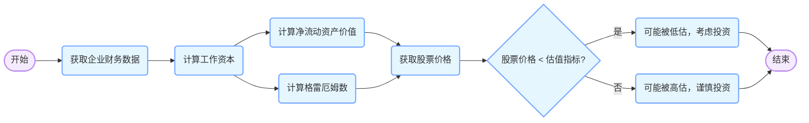

# 格雷厄姆的工作资本分析在现代企业估值中的应用

> 关键词：格雷厄姆、工作资本分析、企业估值、现代应用、财务指标

> 摘要：本文旨在深入探讨格雷厄姆的工作资本分析在现代企业估值中的应用。首先介绍了格雷厄姆工作资本分析的背景和相关概念，包括其目的、适用范围、预期读者等。接着详细阐述了核心概念、算法原理、数学模型等内容，并通过Python代码进行算法实现和案例分析。同时，结合实际应用场景，推荐了相关的学习资源、开发工具和研究论文。最后总结了该方法在未来企业估值中的发展趋势与挑战，并对常见问题进行了解答，为企业估值领域的研究和实践提供了全面而深入的参考。

## 1. 背景介绍 
### 1.1 目的和范围
格雷厄姆作为价值投资的先驱，其工作资本分析方法在企业估值领域具有重要的历史地位。本文的目的在于探讨该方法在现代企业估值中的应用，分析其在当前经济环境和企业经营模式下的有效性和局限性。研究范围涵盖了不同行业、不同规模的企业，旨在为投资者、分析师和企业管理者提供全面的视角，以便更好地运用该方法进行企业估值和投资决策。

### 1.2 预期读者
本文预期读者包括金融投资领域的专业人士，如股票分析师、基金经理、投资顾问等，他们需要通过准确的企业估值来做出投资决策；企业管理者也可以从本文中了解如何运用格雷厄姆的工作资本分析方法来评估自身企业的价值，从而制定合理的战略规划；此外，对金融投资和企业估值感兴趣的学生和研究者也可以从本文中获取有价值的知识和研究思路。

### 1.3 文档结构概述
本文将按照以下结构展开：首先介绍格雷厄姆工作资本分析的相关背景知识，包括术语定义和概念解释；接着阐述核心概念及其联系，通过文本示意图和Mermaid流程图进行直观展示；然后详细讲解核心算法原理和具体操作步骤，并使用Python代码进行实现；随后介绍相关的数学模型和公式，并通过举例说明其应用；再通过项目实战，展示代码的实际案例和详细解释；接着探讨该方法在实际应用中的场景；推荐相关的学习资源、开发工具和研究论文；最后总结该方法在未来的发展趋势与挑战，并对常见问题进行解答，同时提供扩展阅读和参考资料。

### 1.4 术语表
#### 1.4.1 核心术语定义
- **工作资本（Working Capital）**：也称为营运资金，是指企业流动资产减去流动负债后的余额。它反映了企业在短期内可用于经营活动的资金量，是衡量企业短期偿债能力和经营活力的重要指标。计算公式为：$工作资本 = 流动资产 - 流动负债$。
- **格雷厄姆数（Graham Number）**：是由本杰明·格雷厄姆提出的一种用于评估股票内在价值的指标。它基于企业的每股收益（EPS）和每股账面价值（BVPS），计算公式为：$格雷厄姆数=\sqrt{22.5\times EPS\times BVPS}$，其中22.5是格雷厄姆认为的一个合理的市盈率和市净率的乘积系数。
- **企业估值（Business Valuation）**：是指对企业的整体价值进行评估的过程，通常用于投资决策、并购重组、股权交易等场景。企业估值的方法有多种，包括市场法、收益法、成本法等。

#### 1.4.2 相关概念解释
- **流动资产（Current Assets）**：是指企业在一年内或一个营业周期内能够变现或耗用的资产，包括现金、应收账款、存货、短期投资等。流动资产的变现能力较强，能够为企业的短期经营活动提供资金支持。
- **流动负债（Current Liabilities）**：是指企业在一年内或一个营业周期内需要偿还的债务，包括应付账款、短期借款、应付职工薪酬等。流动负债的偿还期限较短，需要企业在短期内筹集资金进行偿还。
- **价值投资（Value Investing）**：是一种投资策略，强调通过分析企业的基本面，寻找被市场低估的股票进行投资。价值投资者认为，股票的价格会围绕其内在价值波动，当股票价格低于其内在价值时，就存在投资机会。

#### 1.4.3 缩略词列表
- **EPS**：Earnings Per Share，每股收益
- **BVPS**：Book Value Per Share，每股账面价值
- **P/E**：Price-to-Earnings Ratio，市盈率
- **P/B**：Price-to-Book Ratio，市净率

## 2. 核心概念与联系 
### 核心概念原理
格雷厄姆的工作资本分析基于这样一个基本原理：企业的价值不仅仅取决于其未来的盈利能力，还与其当前的财务状况密切相关。工作资本作为企业短期经营活动的资金保障，能够反映企业的短期偿债能力和经营活力。如果企业拥有充足的工作资本，说明其在短期内能够顺利开展经营活动，偿还债务，并且有一定的资金储备用于扩大生产或进行投资。

格雷厄姆认为，在评估企业价值时，应该关注企业的资产负债表，特别是流动资产和流动负债的情况。他提出了一些基于工作资本的估值指标，如净流动资产价值（Net Current Asset Value，NCAV），即企业的流动资产减去全部负债后的余额。如果股票价格低于企业的净流动资产价值，那么该股票可能被低估，具有投资价值。

### 架构的文本示意图
```plaintext
格雷厄姆工作资本分析
|-- 工作资本计算
|   |-- 流动资产
|   |   |-- 现金
|   |   |-- 应收账款
|   |   |-- 存货
|   |   |-- 短期投资
|   |-- 流动负债
|   |   |-- 应付账款
|   |   |-- 短期借款
|   |   |-- 应付职工薪酬
|-- 估值指标
|   |-- 净流动资产价值（NCAV）
|   |-- 格雷厄姆数
|-- 投资决策
|   |-- 股票价格与估值指标比较
|   |   |-- 股票价格 < 估值指标 -> 可能被低估，具有投资价值
|   |   |-- 股票价格 > 估值指标 -> 可能被高估，谨慎投资
```

### Mermaid流程图


## 3. 核心算法原理 & 具体操作步骤 
### 核心算法原理
#### 工作资本计算
工作资本的计算是格雷厄姆工作资本分析的基础，其算法原理基于企业资产负债表中的流动资产和流动负债数据。通过将流动资产减去流动负债，得到企业的工作资本。工作资本反映了企业在短期内可用于经营活动的资金量，计算公式为：
$工作资本 = 流动资产 - 流动负债$

#### 净流动资产价值计算
净流动资产价值是格雷厄姆提出的一个重要估值指标，它考虑了企业的全部负债。其算法原理是将企业的流动资产减去全部负债，得到净流动资产价值。如果股票价格低于净流动资产价值，说明该股票可能被低估。计算公式为：
$净流动资产价值 = 流动资产 - 全部负债$

#### 格雷厄姆数计算
格雷厄姆数是基于企业的每股收益和每股账面价值计算得出的一个估值指标。其算法原理是通过将每股收益和每股账面价值相乘，并乘以一个合理的系数（通常为22.5），然后取平方根得到格雷厄姆数。计算公式为：
$格雷厄姆数=\sqrt{22.5\times EPS\times BVPS}$

### 具体操作步骤
#### 步骤1：获取企业财务数据
通过企业的财务报表（如资产负债表、利润表）获取所需的数据，包括流动资产、流动负债、全部负债、每股收益和每股账面价值等。

#### 步骤2：计算工作资本
根据公式$工作资本 = 流动资产 - 流动负债$，计算企业的工作资本。

#### 步骤3：计算净流动资产价值
根据公式$净流动资产价值 = 流动资产 - 全部负债$，计算企业的净流动资产价值。

#### 步骤4：计算格雷厄姆数
根据公式$格雷厄姆数=\sqrt{22.5\times EPS\times BVPS}$，计算企业的格雷厄姆数。

#### 步骤5：获取股票价格
通过金融数据平台或证券交易所获取企业的股票价格。

#### 步骤6：比较股票价格与估值指标
将股票价格与净流动资产价值和格雷厄姆数进行比较，如果股票价格低于这些估值指标，说明该股票可能被低估，具有投资价值；反之，如果股票价格高于这些估值指标，说明该股票可能被高估，需要谨慎投资。

### Python源代码实现
```python
import math

# 定义函数计算工作资本
def calculate_working_capital(current_assets, current_liabilities):
    return current_assets - current_liabilities

# 定义函数计算净流动资产价值
def calculate_ncav(current_assets, total_liabilities):
    return current_assets - total_liabilities

# 定义函数计算格雷厄姆数
def calculate_graham_number(eps, bvps):
    return math.sqrt(22.5 * eps * bvps)

# 示例数据
current_assets = 1000000  # 流动资产
current_liabilities = 500000  # 流动负债
total_liabilities = 600000  # 全部负债
eps = 5  # 每股收益
bvps = 20  # 每股账面价值
stock_price = 80  # 股票价格

# 计算工作资本
working_capital = calculate_working_capital(current_assets, current_liabilities)
print(f"工作资本: {working_capital}")

# 计算净流动资产价值
ncav = calculate_ncav(current_assets, total_liabilities)
print(f"净流动资产价值: {ncav}")

# 计算格雷厄姆数
graham_number = calculate_graham_number(eps, bvps)
print(f"格雷厄姆数: {graham_number}")

# 比较股票价格与估值指标
if stock_price < ncav or stock_price < graham_number:
    print("股票可能被低估，具有投资价值")
else:
    print("股票可能被高估，谨慎投资")
```

## 4. 数学模型和公式 & 详细讲解 & 举例说明 
### 工作资本公式
$工作资本 = 流动资产 - 流动负债$
详细讲解：工作资本反映了企业在短期内可用于经营活动的资金量。流动资产包括现金、应收账款、存货等，这些资产能够在短期内变现或耗用；流动负债包括应付账款、短期借款等，这些负债需要在短期内偿还。工作资本为正数，表示企业有足够的资金用于短期经营活动；工作资本为负数，表示企业可能面临短期资金短缺的问题。

举例说明：假设某企业的流动资产为100万元，流动负债为80万元，则该企业的工作资本为：$100 - 80 = 20$（万元）。这意味着该企业在短期内有20万元的资金可用于经营活动。

### 净流动资产价值公式
$净流动资产价值 = 流动资产 - 全部负债$
详细讲解：净流动资产价值考虑了企业的全部负债，是一个更全面的估值指标。如果股票价格低于净流动资产价值，说明投资者可以以低于企业实际资产价值的价格购买该股票，具有一定的安全边际。

举例说明：假设某企业的流动资产为200万元，全部负债为150万元，则该企业的净流动资产价值为：$200 - 150 = 50$（万元）。如果该企业的股票总市值为40万元，说明股票价格低于净流动资产价值，该股票可能被低估。

### 格雷厄姆数公式
$格雷厄姆数=\sqrt{22.5\times EPS\times BVPS}$
详细讲解：格雷厄姆数是基于企业的每股收益和每股账面价值计算得出的。每股收益反映了企业的盈利能力，每股账面价值反映了企业的净资产状况。系数22.5是格雷厄姆认为的一个合理的市盈率和市净率的乘积系数。如果股票价格低于格雷厄姆数，说明该股票可能被低估。

举例说明：假设某企业的每股收益为3元，每股账面价值为10元，则该企业的格雷厄姆数为：$\sqrt{22.5\times 3\times 10}=\sqrt{675}\approx 26$（元）。如果该企业的股票价格为20元，说明股票价格低于格雷厄姆数，该股票可能被低估。

## 5. 项目实战：代码实际案例和详细解释说明 
### 5.1 开发环境搭建
#### 安装Python
首先需要安装Python编程语言，建议安装Python 3.x版本。可以从Python官方网站（https://www.python.org/downloads/）下载适合自己操作系统的安装包，并按照安装向导进行安装。

#### 安装必要的库
在本项目中，只使用了Python的内置库，无需额外安装其他库。如果需要从网络获取财务数据，可能需要安装`requests`、`pandas`等库，可以使用`pip`命令进行安装：
```sh
pip install requests pandas
```

### 5.2 源代码详细实现和代码解读
```python
import math

# 定义函数计算工作资本
def calculate_working_capital(current_assets, current_liabilities):
    """
    计算工作资本
    :param current_assets: 流动资产
    :param current_liabilities: 流动负债
    :return: 工作资本
    """
    return current_assets - current_liabilities

# 定义函数计算净流动资产价值
def calculate_ncav(current_assets, total_liabilities):
    """
    计算净流动资产价值
    :param current_assets: 流动资产
    :param total_liabilities: 全部负债
    :return: 净流动资产价值
    """
    return current_assets - total_liabilities

# 定义函数计算格雷厄姆数
def calculate_graham_number(eps, bvps):
    """
    计算格雷厄姆数
    :param eps: 每股收益
    :param bvps: 每股账面价值
    :return: 格雷厄姆数
    """
    return math.sqrt(22.5 * eps * bvps)

# 示例数据
current_assets = 1500000  # 流动资产
current_liabilities = 800000  # 流动负债
total_liabilities = 1000000  # 全部负债
eps = 6  # 每股收益
bvps = 25  # 每股账面价值
stock_price = 120  # 股票价格

# 计算工作资本
working_capital = calculate_working_capital(current_assets, current_liabilities)
print(f"工作资本: {working_capital}")

# 计算净流动资产价值
ncav = calculate_ncav(current_assets, total_liabilities)
print(f"净流动资产价值: {ncav}")

# 计算格雷厄姆数
graham_number = calculate_graham_number(eps, bvps)
print(f"格雷厄姆数: {graham_number}")

# 比较股票价格与估值指标
if stock_price < ncav or stock_price < graham_number:
    print("股票可能被低估，具有投资价值")
else:
    print("股票可能被高估，谨慎投资")
```

### 代码解读与分析
#### 函数定义部分
- `calculate_working_capital`函数：该函数接受流动资产和流动负债作为参数，返回工作资本。通过简单的减法运算，实现了工作资本的计算。
- `calculate_ncav`函数：该函数接受流动资产和全部负债作为参数，返回净流动资产价值。同样通过减法运算，计算出净流动资产价值。
- `calculate_graham_number`函数：该函数接受每股收益和每股账面价值作为参数，返回格雷厄姆数。使用`math.sqrt`函数计算平方根，实现了格雷厄姆数的计算。

#### 数据输入部分
定义了示例数据，包括流动资产、流动负债、全部负债、每股收益、每股账面价值和股票价格。这些数据可以根据实际情况进行修改。

#### 计算和比较部分
- 调用`calculate_working_capital`函数计算工作资本，并打印结果。
- 调用`calculate_ncav`函数计算净流动资产价值，并打印结果。
- 调用`calculate_graham_number`函数计算格雷厄姆数，并打印结果。
- 通过`if-else`语句比较股票价格与净流动资产价值和格雷厄姆数，如果股票价格低于这些估值指标，输出“股票可能被低估，具有投资价值”；否则输出“股票可能被高估，谨慎投资”。

## 6. 实际应用场景 
### 股票投资
在股票投资领域，格雷厄姆的工作资本分析方法可以帮助投资者筛选出被低估的股票。投资者可以通过计算企业的净流动资产价值和格雷厄姆数，与股票价格进行比较，选择那些股票价格低于估值指标的股票进行投资。这种方法强调了股票的安全边际，能够降低投资风险。

### 企业并购
在企业并购过程中，收购方需要对目标企业进行估值。格雷厄姆的工作资本分析方法可以作为一种辅助工具，帮助收购方评估目标企业的价值。通过分析目标企业的工作资本状况，收购方可以了解其短期偿债能力和经营活力，从而更准确地评估目标企业的价值和潜在风险。

### 企业财务分析
企业管理者可以运用格雷厄姆的工作资本分析方法对自身企业的财务状况进行评估。通过计算工作资本、净流动资产价值等指标，管理者可以了解企业的短期资金状况和资产负债结构，及时发现潜在的财务风险，并采取相应的措施进行调整。

## 7. 工具和资源推荐
### 7.1 学习资源推荐
#### 7.1.1 书籍推荐
- 《聪明的投资者》（The Intelligent Investor）：本杰明·格雷厄姆的经典著作，被誉为价值投资的“圣经”。书中详细阐述了格雷厄姆的投资理念和方法，包括工作资本分析等内容。
- 《证券分析》（Security Analysis）：同样是本杰明·格雷厄姆的著作，是价值投资领域的另一部经典之作。该书对证券分析的理论和方法进行了系统的阐述，对企业估值和财务分析具有重要的指导意义。
- 《财务报表分析》（Financial Statement Analysis）：作者是马丁·弗里德森（Martin S. Fridson）和费尔南多·阿尔瓦雷斯（Fernando Alvarez）。该书详细介绍了财务报表分析的方法和技巧，对于理解和运用格雷厄姆的工作资本分析方法具有很大的帮助。

#### 7.1.2 在线课程
- Coursera平台上的“Financial Markets”课程：由耶鲁大学的罗伯特·席勒（Robert J. Shiller）教授授课，课程涵盖了金融市场的各个方面，包括企业估值和投资分析等内容。
- edX平台上的“Introduction to Financial Accounting”课程：由麻省理工学院（MIT）的教授授课，课程主要介绍了财务会计的基本原理和方法，对于理解企业的财务报表和工作资本分析具有重要的基础作用。

#### 7.1.3 技术博客和网站
- Seeking Alpha（https://seekingalpha.com/）：是一个专业的金融投资网站，提供了大量的股票分析、企业估值和投资策略等方面的文章和研究报告。
- ValueWalk（https://www.valuewalk.com/）：专注于价值投资领域，分享了许多关于格雷厄姆价值投资理念和方法的文章和案例分析。

### 7.2 开发工具框架推荐
#### 7.2.1 IDE和编辑器
- PyCharm：是一款专业的Python集成开发环境（IDE），具有强大的代码编辑、调试和项目管理功能，适合用于开发和调试Python代码。
- Visual Studio Code：是一款轻量级的代码编辑器，支持多种编程语言，包括Python。它具有丰富的插件生态系统，可以根据需要安装各种插件来扩展功能。

#### 7.2.2 调试和性能分析工具
- PDB：是Python的内置调试器，可以帮助开发者在代码中设置断点、单步执行代码、查看变量值等，方便进行代码调试。
- cProfile：是Python的性能分析工具，可以帮助开发者分析代码的执行时间和性能瓶颈，优化代码性能。

#### 7.2.3 相关框架和库
- Pandas：是一个强大的数据分析库，提供了高效的数据结构和数据分析工具，适合用于处理和分析企业的财务数据。
- NumPy：是Python的科学计算库，提供了高效的多维数组对象和数学函数，可用于进行数值计算和统计分析。

### 7.3 相关论文著作推荐
#### 7.3.1 经典论文
- “The Theory of Investment Value” by John Burr Williams：该论文提出了现金流折现模型（DCF），是企业估值领域的经典理论之一，与格雷厄姆的工作资本分析方法相互补充。
- “Security Analysis” by Benjamin Graham and David Dodd：这是格雷厄姆和多德的经典著作《证券分析》的相关论文，详细阐述了价值投资的理论和方法，对工作资本分析等内容进行了深入探讨。

#### 7.3.2 最新研究成果
- “The Evolution of Value Investing: From Graham and Dodd to Modern Practice” by Aswath Damodaran：该论文探讨了价值投资理念从格雷厄姆和多德时代到现代的演变，分析了工作资本分析等方法在现代投资实践中的应用和发展。
- “Working Capital Management and Firm Performance: Evidence from U.S. Firms” by Jose M. Garcia-Teruel and Pedro Martinez-Solano：该论文研究了工作资本管理与企业绩效之间的关系，为理解工作资本分析在企业估值中的应用提供了实证依据。

#### 7.3.3 应用案例分析
- “Value Investing in Practice: A Case Study of Berkshire Hathaway” by Lawrence A. Cunningham：该案例分析了伯克希尔·哈撒韦公司的投资实践，探讨了格雷厄姆价值投资理念在实际投资中的应用，包括工作资本分析等方法的运用。

## 8. 总结：未来发展趋势与挑战
### 未来发展趋势
- **与现代技术融合**：随着大数据、人工智能等现代技术的发展，格雷厄姆的工作资本分析方法将与这些技术相结合。例如，利用大数据技术可以获取更全面、更及时的企业财务数据，提高估值的准确性；利用人工智能算法可以对数据进行更深入的分析和挖掘，发现潜在的投资机会。
- **跨行业应用拓展**：该方法将不仅局限于传统的金融投资领域，还将在更多行业得到应用。例如，在制造业、零售业等行业，企业管理者可以运用该方法评估自身企业的价值，制定合理的战略规划；在创业投资领域，投资者可以利用该方法筛选有潜力的创业项目。
- **国际化应用加强**：随着全球经济一体化的发展，格雷厄姆的工作资本分析方法将在国际市场得到更广泛的应用。投资者可以运用该方法对不同国家和地区的企业进行估值和投资分析，实现全球资产配置。

### 挑战
- **数据质量和可靠性**：工作资本分析依赖于准确的企业财务数据。然而，在实际应用中，财务数据可能存在造假、不准确等问题，这将影响估值的准确性。因此，如何获取高质量、可靠的财务数据是一个挑战。
- **经济环境变化**：现代经济环境复杂多变，企业的经营模式和财务状况也在不断变化。格雷厄姆的工作资本分析方法是基于传统的财务指标和估值理念，可能无法完全适应现代经济环境的变化。例如，一些新兴行业的企业可能具有较高的研发投入和无形资产，传统的工作资本分析方法可能无法准确评估其价值。
- **市场有效性**：随着市场的发展和投资者的成熟，市场的有效性逐渐提高。这意味着被低估的股票可能越来越难被发现，格雷厄姆的工作资本分析方法的应用难度可能会增加。

## 9. 附录：常见问题与解答
### 问题1：格雷厄姆的工作资本分析方法适用于所有行业吗？
解答：不是的。该方法更适用于传统行业，如制造业、零售业等，这些行业的资产负债结构相对稳定，流动资产和流动负债的比例较为合理。对于一些新兴行业，如互联网、科技等行业，由于其资产主要为无形资产，如研发投入、品牌价值等，传统的工作资本分析方法可能无法准确评估其价值。

### 问题2：如何获取准确的企业财务数据？
解答：可以通过以下途径获取企业财务数据：
- 企业官方网站：大多数企业会在其官方网站上公布年度报告、季度报告等财务信息。
- 证券交易所网站：上市公司的财务报表会在证券交易所网站上披露，可以通过该网站获取相关数据。
- 金融数据平台：如Wind、东方财富等金融数据平台，提供了丰富的企业财务数据和分析工具。

### 问题3：格雷厄姆数中的系数22.5是如何确定的？
解答：系数22.5是本杰明·格雷厄姆根据经验和历史数据确定的。他认为，一个合理的市盈率和市净率的乘积应该在22.5左右。这个系数并不是绝对的，在实际应用中，可以根据不同的行业和市场情况进行适当调整。

### 问题4：工作资本为负数一定意味着企业存在问题吗？
解答：不一定。工作资本为负数可能意味着企业在短期内面临资金短缺的问题，但也可能是企业的经营策略导致的。例如，一些企业可能采用了快速扩张的策略，通过大量采购原材料和扩大生产规模来抢占市场份额，导致流动负债增加，工作资本为负数。在这种情况下，需要结合企业的具体情况进行分析。

## 10. 扩展阅读 & 参考资料
### 扩展阅读
- 《价值投资实战手册》：唐朝著，该书结合中国资本市场的实际情况，详细阐述了价值投资的理念和方法，对格雷厄姆的工作资本分析方法进行了进一步的解读和应用。
- 《财务自由之路》：博多·舍费尔著，书中介绍了个人投资理财的方法和策略，其中涉及到企业估值和投资分析等内容，与格雷厄姆的工作资本分析方法有一定的关联。

### 参考资料
- Graham, Benjamin, and David Dodd. Security Analysis. McGraw-Hill, 1934.
- Graham, Benjamin. The Intelligent Investor. HarperBusiness, 1949.
- Damodaran, Aswath. Investment Valuation: Tools and Techniques for Determining the Value of Any Asset. Wiley, 2012.
- Fridson, Martin S., and Fernando Alvarez. Financial Statement Analysis: A Practitioner's Guide. Wiley, 2011.