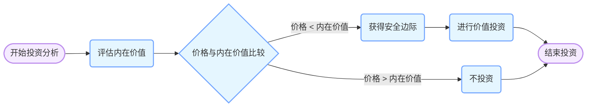

# 格雷厄姆的投资者教育理念

> 关键词：格雷厄姆、投资者教育理念、价值投资、安全边际、内在价值

> 摘要：本文深入探讨了格雷厄姆的投资者教育理念。首先介绍了该理念提出的背景，包括目的、预期读者等信息。接着阐述了格雷厄姆投资理念中的核心概念，如内在价值、安全边际等，并通过示意图和流程图展示其联系。详细讲解了相关核心算法原理和具体操作步骤，运用数学模型和公式进行分析，还给出了实际案例。之后探讨了这些理念在实际投资场景中的应用，推荐了学习该理念所需的工具和资源。最后总结了格雷厄姆投资者教育理念的未来发展趋势与挑战，解答常见问题，并提供扩展阅读和参考资料，旨在帮助投资者全面理解和运用格雷厄姆的投资智慧。

## 1. 背景介绍 
### 1.1 目的和范围
格雷厄姆的投资者教育理念旨在向广大投资者传授正确的投资方法和理念，帮助他们在复杂多变的金融市场中做出理性、明智的投资决策。其范围涵盖了股票、债券等多种投资领域，核心是引导投资者以价值为导向进行投资，避免盲目跟风和投机行为。通过教育投资者，格雷厄姆希望降低投资者因缺乏专业知识和理性思维而遭受损失的风险，提高整个投资群体的投资素养和收益水平。

### 1.2 预期读者
格雷厄姆的投资者教育理念适用于各类投资者，无论是初涉投资领域的新手，还是有一定投资经验但希望进一步提升投资能力的专业人士。对于新手投资者来说，该理念可以帮助他们建立正确的投资思维和方法，避免在投资初期就陷入误区；对于有经验的投资者，格雷厄姆的理念可以为他们提供新的视角和思路，进一步优化投资策略。此外，金融从业者、学者等对投资领域感兴趣的人群也可以从格雷厄姆的投资者教育理念中获得有价值的信息。

### 1.3 文档结构概述
本文将按照以下结构展开：首先介绍格雷厄姆投资者教育理念的核心概念，包括内在价值、安全边际等，并通过示意图和流程图展示这些概念之间的联系；接着详细讲解核心算法原理和具体操作步骤，运用 Python 代码进行阐述；然后通过数学模型和公式对相关理念进行深入分析，并举例说明；之后通过实际项目案例展示该理念在实际投资中的应用；再探讨该理念在不同场景下的实际应用；推荐学习该理念所需的工具和资源；最后总结格雷厄姆投资者教育理念的未来发展趋势与挑战，解答常见问题，并提供扩展阅读和参考资料。

### 1.4 术语表
#### 1.4.1 核心术语定义
- **内在价值**：指股票、债券等金融资产所具有的真实价值，它基于资产的基本面因素，如公司的盈利能力、资产状况、现金流等，而不受市场短期波动的影响。内在价值是格雷厄姆投资理念的核心概念之一，投资者通过评估资产的内在价值来判断其是否被低估或高估。
- **安全边际**：是指投资者购买资产的价格与其内在价值之间的差额。安全边际为投资者提供了一定的缓冲空间，当市场出现不利变化时，投资者可以减少损失。格雷厄姆认为，投资者应该在有足够安全边际的情况下进行投资，以降低投资风险。
- **价值投资**：是一种基于资产内在价值进行投资的策略。价值投资者通过分析公司的基本面，寻找被市场低估的资产，并在价格低于内在价值时买入，等待市场价格回归内在价值时卖出，从而获得投资收益。

#### 1.4.2 相关概念解释
- **市场先生**：这是格雷厄姆提出的一个形象比喻，将股票市场比作一个情绪不稳定的“市场先生”。市场先生每天都会报出一个价格，有时这个价格过高，有时过低。投资者应该利用市场先生的情绪波动，而不是被其左右。当市场先生报出低价时，投资者可以买入；当市场先生报出高价时，投资者可以卖出。
- **分散投资**：是指投资者将资金分散投资于不同的资产或行业，以降低单一资产或行业波动对投资组合的影响。格雷厄姆认为，分散投资可以在一定程度上降低投资风险，但并不是分散得越广越好，投资者应该在合理分散的基础上，选择具有投资价值的资产。

#### 1.4.3 缩略词列表
- **PE**：市盈率（Price - Earnings Ratio），是指股票价格与每股收益的比率，用于衡量股票的估值水平。
- **PB**：市净率（Price - to - Book Ratio），是指股票价格与每股净资产的比率，用于评估股票的价值相对于其账面价值的高低。

## 2. 核心概念与联系 
### 核心概念原理
#### 内在价值
内在价值是格雷厄姆投资理念的基石。它反映了资产的真实经济价值，是由公司的基本面因素决定的。对于股票来说，内在价值可以通过对公司的盈利能力、资产质量、现金流状况等进行分析来估算。例如，一家公司的盈利能力越强，资产质量越好，现金流越稳定，其内在价值就越高。

#### 安全边际
安全边际是在内在价值的基础上提出的概念。它是投资者为了应对市场不确定性和可能的错误估值而预留的空间。当投资者以低于内在价值的价格买入资产时，就获得了安全边际。安全边际越大，投资者面临的风险就越小，获得收益的可能性就越大。

#### 价值投资
价值投资是基于内在价值和安全边际的投资策略。价值投资者通过深入研究公司的基本面，寻找被市场低估的资产。他们相信，市场有时会出现错误定价，当资产价格低于其内在价值时，就是买入的时机；当资产价格回归或超过内在价值时，就是卖出的时机。

### 架构的文本示意图
```plaintext
               价值投资
             /           \
       内在价值       安全边际
    /  |  |  \          |
盈利 资产 现金 其他   价格与价值差
```

### Mermaid 流程图


## 3. 核心算法原理 & 具体操作步骤 
### 核心算法原理
在评估股票的内在价值时，一种常用的方法是股息折现模型（Dividend Discount Model，DDM）。该模型的基本思想是，股票的内在价值等于其未来所有股息的现值之和。

### Python 代码实现
```python
def ddm(dividend, growth_rate, discount_rate):
    """
    股息折现模型计算股票内在价值
    :param dividend: 当前股息
    :param growth_rate: 股息增长率
    :param discount_rate: 折现率
    :return: 股票内在价值
    """
    if discount_rate <= growth_rate:
        raise ValueError("折现率必须大于股息增长率")
    value = dividend * (1 + growth_rate) / (discount_rate - growth_rate)
    return value

# 示例参数
dividend = 2.0  # 当前股息为 2 元
growth_rate = 0.05  # 股息增长率为 5%
discount_rate = 0.1  # 折现率为 10%

try:
    intrinsic_value = ddm(dividend, growth_rate, discount_rate)
    print(f"股票的内在价值为: {intrinsic_value} 元")
except ValueError as e:
    print(f"错误: {e}")
```
### 具体操作步骤
1. **收集数据**：收集公司的股息数据、股息增长率和合适的折现率。股息增长率可以通过分析公司过去的股息增长情况来估算，折现率可以根据市场利率、公司风险等因素确定。
2. **计算内在价值**：使用股息折现模型（如上述 Python 代码中的 `ddm` 函数）计算股票的内在价值。
3. **比较价格与内在价值**：将计算得到的内在价值与当前股票市场价格进行比较。如果市场价格低于内在价值，且存在足够的安全边际，则可以考虑买入该股票；如果市场价格高于内在价值，则不建议投资。

## 4. 数学模型和公式 & 详细讲解 & 举例说明 
### 股息折现模型公式
股息折现模型的基本公式为：
$$V = \frac{D_1}{r - g}$$
其中：
- $V$ 表示股票的内在价值；
- $D_1$ 表示下一期预计股息，$D_1 = D_0(1 + g)$，$D_0$ 为当前股息，$g$ 为股息增长率；
- $r$ 为折现率；
- $g$ 为股息增长率。

### 详细讲解
该公式的推导基于以下假设：公司的股息以固定的增长率 $g$ 持续增长，并且投资者要求的回报率为 $r$。股票的内在价值就是未来所有股息的现值之和。通过数学推导，可以得到上述简化公式。

### 举例说明
假设一家公司当前股息 $D_0 = 2$ 元，股息增长率 $g = 5\%$，投资者要求的折现率 $r = 10\%$。

首先计算下一期预计股息 $D_1$：
$D_1 = D_0(1 + g)=2\times(1 + 0.05)=2.1$（元）

然后根据股息折现模型计算股票的内在价值 $V$：
$$V=\frac{D_1}{r - g}=\frac{2.1}{0.1 - 0.05}=\frac{2.1}{0.05}=42$$（元）

如果当前该股票的市场价格为 35 元，那么市场价格低于内在价值，存在一定的安全边际，投资者可以考虑买入该股票。

## 5. 项目实战：代码实际案例和详细解释说明 
### 5.1  开发环境搭建
- **Python 安装**：从 Python 官方网站（https://www.python.org/downloads/）下载并安装 Python 3.x 版本。
- **开发工具**：推荐使用 PyCharm 作为集成开发环境（IDE），可以从 JetBrains 官方网站（https://www.jetbrains.com/pycharm/download/）下载社区版免费使用。
- **所需库安装**：在命令行中使用以下命令安装所需的库：
```sh
pip install pandas numpy matplotlib
```
### 5.2  源代码详细实现和代码解读
```python
import pandas as pd
import numpy as np
import matplotlib.pyplot as plt

# 模拟股票数据
data = {
    '年份': [2015, 2016, 2017, 2018, 2019, 2020, 2021, 2022],
    '股息': [1.0, 1.1, 1.2, 1.3, 1.4, 1.5, 1.6, 1.7]
}
df = pd.DataFrame(data)

# 计算股息增长率
df['股息增长率'] = df['股息'].pct_change()
# 去除第一行的 NaN 值
df = df.dropna()

# 计算平均股息增长率
average_growth_rate = df['股息增长率'].mean()

# 假设折现率
discount_rate = 0.1

# 计算当前股息
current_dividend = df['股息'].iloc[-1]

# 计算内在价值
def ddm(dividend, growth_rate, discount_rate):
    if discount_rate <= growth_rate:
        raise ValueError("折现率必须大于股息增长率")
    value = dividend * (1 + growth_rate) / (discount_rate - growth_rate)
    return value

try:
    intrinsic_value = ddm(current_dividend, average_growth_rate, discount_rate)
    print(f"股票的内在价值为: {intrinsic_value} 元")

    # 绘制股息增长趋势图
    plt.plot(df['年份'], df['股息'])
    plt.xlabel('年份')
    plt.ylabel('股息')
    plt.title('股息增长趋势')
    plt.show()
except ValueError as e:
    print(f"错误: {e}")
```
### 代码解读与分析
1. **数据模拟与处理**：使用 `pandas` 库模拟了一家公司多年的股息数据，并计算了每年的股息增长率。通过 `dropna()` 方法去除了第一行的 `NaN` 值。
2. **计算平均股息增长率**：使用 `mean()` 方法计算了平均股息增长率，用于后续的内在价值计算。
3. **假设折现率**：假设了一个折现率 `discount_rate`，该值可以根据市场情况和投资者的风险偏好进行调整。
4. **计算内在价值**：调用之前定义的 `ddm` 函数计算股票的内在价值，并打印结果。
5. **绘制股息增长趋势图**：使用 `matplotlib` 库绘制了股息随年份的增长趋势图，帮助投资者直观地了解公司股息的变化情况。

## 6. 实际应用场景 
### 股票投资
在股票投资中，格雷厄姆的投资者教育理念可以帮助投资者筛选出具有投资价值的股票。投资者可以通过评估公司的内在价值，寻找被市场低估的股票，并在有足够安全边际的情况下买入。例如，在市场低迷时，一些优质公司的股票价格可能会大幅下跌，但公司的基本面并没有发生实质性变化，此时投资者可以根据内在价值和安全边际的原则进行投资。

### 债券投资
对于债券投资，投资者也可以运用格雷厄姆的理念。通过分析债券的票面利率、到期收益率、信用评级等因素，评估债券的内在价值。当债券价格低于其内在价值时，投资者可以考虑买入。此外，分散投资不同类型、不同期限的债券可以降低投资风险。

### 基金投资
在选择基金时，投资者可以关注基金的投资策略是否符合价值投资理念。价值型基金通常会投资于被市场低估的股票或债券，投资者可以根据基金的历史业绩、持仓情况等因素，选择具有价值投资理念的基金进行投资。

### 资产配置
格雷厄姆的投资者教育理念还可以应用于资产配置。投资者可以根据不同资产的内在价值和风险水平，合理分配资金到股票、债券、基金等不同资产类别中，以实现风险和收益的平衡。例如，在市场不稳定时，适当增加债券的配置比例，以降低投资组合的风险。

## 7. 工具和资源推荐
### 7.1 学习资源推荐
#### 7.1.1 书籍推荐
- 《聪明的投资者》（*The Intelligent Investor*）：这是格雷厄姆的经典著作，被誉为投资领域的“圣经”。书中详细阐述了格雷厄姆的投资理念和方法，包括价值投资、安全边际等核心概念，对于投资者来说是一本必读的书籍。
- 《证券分析》（*Security Analysis*）：也是格雷厄姆的重要著作，与《聪明的投资者》相比，该书更加专业和深入，对证券的分析方法、估值模型等进行了系统的介绍，适合有一定投资基础的读者深入学习。
#### 7.1.2 在线课程
- Coursera 平台上的“投资学原理”课程：该课程由知名高校的教授授课，涵盖了投资领域的基本原理和方法，其中包括价值投资的相关内容，通过视频讲解、案例分析等方式帮助学习者掌握投资知识。
- 网易云课堂上的“价值投资实战课程”：该课程由投资领域的实战专家授课，结合实际案例，详细讲解了价值投资的理念和操作方法，适合想要将格雷厄姆的投资理念应用到实际投资中的学习者。
#### 7.1.3 技术博客和网站
- 雪球网：是一个知名的投资社区，汇聚了众多投资者和投资专家。在雪球网上，投资者可以分享自己的投资经验和观点，学习其他投资者的投资策略，同时还可以获取最新的市场信息和公司动态。
- 价值投资网：专注于价值投资领域的网站，提供了丰富的价值投资理论、案例分析、研究报告等资源，对于学习格雷厄姆的投资者教育理念有很大的帮助。

### 7.2 开发工具框架推荐
#### 7.2.1 IDE和编辑器
- PyCharm：是一款功能强大的 Python 集成开发环境，具有代码编辑、调试、代码分析等功能，适合进行投资数据分析和算法实现。
- Jupyter Notebook：是一个交互式的开发环境，支持 Python、R 等多种编程语言。在 Jupyter Notebook 中，用户可以编写代码、运行代码、查看结果，并添加文本说明，非常适合进行数据分析和模型验证。
#### 7.2.2 调试和性能分析工具
- Py-Spy：是一个用于分析 Python 代码性能的工具，可以帮助开发者找出代码中的性能瓶颈，提高代码的运行效率。
- PDB：是 Python 自带的调试器，通过在代码中设置断点，可以逐步执行代码，查看变量的值和程序的执行流程，方便调试代码。
#### 7.2.3 相关框架和库
- Pandas：是一个用于数据处理和分析的 Python 库，提供了高效的数据结构和数据操作方法，适合处理和分析金融数据。
- NumPy：是 Python 的一个基础科学计算库，提供了高效的数组操作和数学函数，在金融数据计算和模型实现中经常使用。
- Matplotlib：是一个用于数据可视化的 Python 库，可以绘制各种类型的图表，如折线图、柱状图、散点图等，帮助投资者直观地展示和分析数据。

### 7.3 相关论文著作推荐
#### 7.3.1 经典论文
- 《The Theory of Investment Value》：由约翰·伯尔·威廉姆斯（John Burr Williams）撰写，该论文提出了股息折现模型，为价值投资提供了重要的理论基础。
- 《The Behavior of Stock - Market Prices》：由保罗·萨缪尔森（Paul Samuelson）撰写，该论文对股票市场价格的行为进行了深入研究，探讨了市场效率和价格波动的原因。
#### 7.3.2 最新研究成果
- 一些顶级学术期刊如《Journal of Finance》《Review of Financial Studies》等经常发表关于投资理论和实践的最新研究成果，投资者可以关注这些期刊，了解价值投资领域的最新动态。
#### 7.3.3 应用案例分析
- 一些金融研究机构和投资公司会发布关于价值投资的应用案例分析报告，通过实际案例展示如何运用格雷厄姆的投资理念进行投资决策，投资者可以参考这些报告，学习实际应用经验。

## 8. 总结：未来发展趋势与挑战
### 未来发展趋势
#### 数字化和智能化
随着科技的不断发展，投资领域也将越来越数字化和智能化。投资者可以利用大数据、人工智能等技术更高效地收集和分析信息，评估资产的内在价值。例如，通过机器学习算法对公司的财务数据、市场数据等进行分析，预测公司的未来业绩和股票价格走势，从而更好地应用格雷厄姆的投资理念。

#### 全球化投资
全球经济的一体化使得投资者有更多的机会进行全球化投资。格雷厄姆的投资理念具有普遍性，适用于不同国家和地区的市场。未来，投资者可以在全球范围内寻找被低估的资产，实现资产的多元化配置，降低投资风险。

#### 社会责任投资
越来越多的投资者开始关注企业的社会责任和可持续发展。未来，格雷厄姆的投资理念可能会与社会责任投资相结合，投资者在评估资产内在价值时，不仅会考虑财务因素，还会考虑企业的环境、社会和治理（ESG）表现。

### 挑战
#### 市场有效性增强
随着市场的发展和信息传播的加速，市场的有效性可能会不断增强。这意味着资产价格更能及时反映其内在价值，寻找被低估资产的难度可能会增加。投资者需要不断提高自己的分析能力和信息获取能力，才能在市场中发现投资机会。

#### 新兴技术带来的不确定性
虽然数字化和智能化技术为投资带来了便利，但也带来了一些不确定性。例如，人工智能算法的复杂性和不透明性可能会导致投资决策的失误。此外，新兴技术的发展也可能会改变企业的商业模式和竞争格局，增加了评估资产内在价值的难度。

#### 宏观经济环境的复杂性
全球宏观经济环境日益复杂，包括货币政策、财政政策、地缘政治等因素都会对市场产生影响。投资者需要密切关注宏观经济环境的变化，及时调整投资策略。同时，宏观经济环境的不确定性也增加了预测股息增长率、折现率等参数的难度，从而影响对资产内在价值的评估。

## 9. 附录：常见问题与解答
### 问题 1：如何准确评估资产的内在价值？
解答：评估资产的内在价值是一个复杂的过程，需要综合考虑多个因素。对于股票来说，可以通过分析公司的财务报表，如利润表、资产负债表、现金流量表等，了解公司的盈利能力、资产状况和现金流情况。同时，还可以参考行业平均水平、公司的竞争优势等因素。常用的评估方法包括股息折现模型、市盈率法、市净率法等，但这些方法都有一定的局限性，需要结合实际情况进行综合分析。

### 问题 2：安全边际的大小如何确定？
解答：安全边际的大小没有固定的标准，它取决于投资者的风险偏好和市场情况。一般来说，安全边际越大，投资者面临的风险就越小。在市场不稳定或不确定性较高时，投资者可以要求更大的安全边际。可以通过比较资产的市场价格和内在价值来确定安全边际的大小，当市场价格显著低于内在价值时，安全边际较大。

### 问题 3：价值投资是否适用于所有市场和行业？
解答：价值投资的基本理念适用于大多数市场和行业，但在不同的市场和行业中，其应用方式可能会有所不同。在一些新兴行业，由于公司的发展前景和盈利模式具有较大的不确定性，评估内在价值的难度可能会增加。此外，不同行业的估值水平也存在差异，投资者需要根据行业特点进行合理的估值和投资决策。

### 问题 4：如何在实际投资中应用格雷厄姆的投资者教育理念？
解答：在实际投资中，首先要学习和理解格雷厄姆的投资理念，包括内在价值、安全边际等核心概念。然后，通过研究公司的基本面，评估资产的内在价值。在选择投资标的时，要寻找具有足够安全边际的资产。同时，要保持理性和耐心，避免被市场情绪左右。可以采用分散投资的策略，降低单一资产的风险。最后，要不断学习和实践，根据市场变化调整投资策略。

## 10. 扩展阅读 & 参考资料
### 扩展阅读
- 《漫步华尔街》（*A Random Walk Down Wall Street*）：该书对有效市场假说、投资策略等进行了深入探讨，与格雷厄姆的投资理念相互补充，可以帮助投资者更全面地了解投资领域。
- 《金融炼金术》（*The Alchemy of Finance*）：乔治·索罗斯（George Soros）的著作，提出了反身性理论，对市场的运行机制和投资者的行为进行了独特的分析，为投资者提供了新的思考视角。
### 参考资料
- Graham, Benjamin. *The Intelligent Investor*. HarperBusiness, 2003.
- Graham, Benjamin, and David Dodd. *Security Analysis*. McGraw - Hill, 1934.
- Williams, John Burr. *The Theory of Investment Value*. Harvard University Press, 1938.