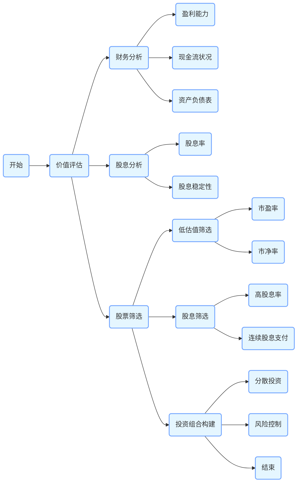

# 格雷厄姆的股息投资策略：稳定收益的来源

> 关键词：格雷厄姆、股息投资策略、稳定收益、价值投资、股票分析

> 摘要：本文深入探讨了格雷厄姆的股息投资策略，旨在揭示其作为稳定收益来源的原理和应用。首先介绍了格雷厄姆股息投资策略的背景，包括目的、预期读者和文档结构。接着阐述了核心概念及联系，详细讲解了核心算法原理和具体操作步骤，并结合数学模型和公式进行分析。通过项目实战案例展示了该策略在实际中的应用，分析了其在不同场景下的作用。同时推荐了相关的学习资源、开发工具和论文著作。最后总结了该策略的未来发展趋势与挑战，并提供了常见问题解答和扩展阅读资料，帮助投资者更好地理解和运用这一策略获取稳定收益。

## 1. 背景介绍 
### 1.1 目的和范围
格雷厄姆作为价值投资的先驱，其股息投资策略一直是投资者关注的焦点。本文的目的在于深入剖析格雷厄姆的股息投资策略，探讨其如何成为稳定收益的来源。范围涵盖了该策略的核心概念、算法原理、数学模型、实际应用案例以及相关的学习资源和未来发展趋势等方面，旨在为投资者提供全面而深入的了解。

### 1.2 预期读者
本文预期读者包括对价值投资感兴趣的个人投资者、金融从业者、投资研究人员以及相关专业的学生。无论是初涉投资领域的新手，还是经验丰富的专业人士，都能从本文中获取有价值的信息和见解。

### 1.3 文档结构概述
本文将按照以下结构进行阐述：首先介绍格雷厄姆股息投资策略的核心概念与联系，包括相关的原理和架构；接着详细讲解核心算法原理和具体操作步骤，并结合 Python 代码进行说明；然后介绍该策略涉及的数学模型和公式，并举例说明其应用；通过项目实战展示代码实际案例并进行详细解释；分析该策略的实际应用场景；推荐相关的工具和资源；总结未来发展趋势与挑战；提供常见问题解答和扩展阅读资料。

### 1.4 术语表
#### 1.4.1 核心术语定义
- **股息**：是指股份公司从提取了公积金、公益金的税后利润中按照股息率派发给股东的收益。简单来说，就是股东因持有公司股票而获得的公司盈利分配。
- **股息率**：是股息与股票价格之间的比率，通常以百分比表示。计算公式为：股息率 = （年度股息 / 股票价格）× 100% ，它反映了投资者以当前股价购买股票所能获得的股息收益水平。
- **价值投资**：是一种投资策略，由格雷厄姆创立。该策略强调通过分析公司的基本面，如财务状况、盈利能力、资产价值等，寻找被市场低估的股票，并长期持有，以获取股票价值回归和公司成长带来的收益。

#### 1.4.2 相关概念解释
- **安全边际**：这是格雷厄姆价值投资理论中的重要概念。它是指股票的内在价值与市场价格之间的差值。当股票的市场价格低于其内在价值时，就存在安全边际。安全边际越大，投资的风险就越低，因为即使公司的未来发展出现一定的偏差，投资者也有一定的缓冲空间。
- **留存收益**：公司在缴纳所得税和分配股息后留存于公司的利润。留存收益可以用于公司的再投资，如扩大生产规模、研发新产品等，以促进公司的长期发展。

#### 1.4.3 缩略词列表
- **PE**：市盈率（Price - Earnings Ratio），是指股票价格除以每股收益（EPS）的比率。它反映了市场对公司盈利的预期和估值水平。计算公式为：PE = 股票价格 / 每股收益 。
- **PB**：市净率（Price - Book Ratio），是指股票价格与每股净资产的比率。它反映了市场对公司净资产的估值情况。计算公式为：PB = 股票价格 / 每股净资产 。

## 2. 核心概念与联系 

### 核心概念原理
格雷厄姆的股息投资策略基于价值投资的理念。其核心原理在于，通过分析公司的股息政策和财务状况，寻找那些具有稳定股息支付能力且股价被低估的股票。

公司的股息是股东分享公司盈利的一种方式。稳定的股息支付通常意味着公司具有稳定的盈利能力和良好的现金流状况。格雷厄姆认为，投资者不仅可以从股息中获得稳定的现金收入，还可以通过购买被低估的股票，等待股票价值回归，获得资本增值收益。

### 架构的文本示意图
```plaintext
格雷厄姆股息投资策略
|-- 价值评估
|   |-- 财务分析
|   |   |-- 盈利能力
|   |   |-- 现金流状况
|   |   |-- 资产负债表
|   |-- 股息分析
|   |   |-- 股息率
|   |   |-- 股息稳定性
|-- 股票筛选
|   |-- 低估值筛选
|   |   |-- 市盈率
|   |   |-- 市净率
|   |-- 股息筛选
|   |   |-- 高股息率
|   |   |-- 连续股息支付
|-- 投资组合构建
|   |-- 分散投资
|   |-- 风险控制
```

### Mermaid 流程图


从流程图可以看出，格雷厄姆的股息投资策略首先进行价值评估，包括财务分析和股息分析。然后根据评估结果进行股票筛选，筛选出低估值且具有高股息率和稳定股息支付的股票。最后构建投资组合，通过分散投资和风险控制来降低投资风险，实现稳定收益。

## 3. 核心算法原理 & 具体操作步骤 

### 核心算法原理
格雷厄姆的股息投资策略主要涉及两个核心算法：价值评估算法和股票筛选算法。

#### 价值评估算法
价值评估的目的是确定股票的内在价值。格雷厄姆提出了一种简单的内在价值计算公式：

$$V = EPS \times (8.5 + 2g)$$

其中，$V$ 表示股票的内在价值，$EPS$ 是每股收益，$g$ 是预期的未来长期增长率。$8.5$ 是格雷厄姆认为的对于零增长公司的合理市盈率倍数。

#### 股票筛选算法
股票筛选主要基于两个指标：股息率和估值指标（如市盈率和市净率）。筛选条件如下：
1. 股息率：选择股息率高于市场平均水平的股票。
2. 市盈率：选择市盈率低于一定阈值（如 15）的股票。
3. 市净率：选择市净率低于一定阈值（如 1.5）的股票。

### 具体操作步骤
#### 步骤 1：数据收集
收集股票的相关数据，包括每股收益、股息、股价、净资产等。可以通过金融数据提供商（如 Bloomberg、Wind 等）或财经网站（如新浪财经、东方财富等）获取这些数据。

#### 步骤 2：计算内在价值
根据价值评估算法，计算每只股票的内在价值。

#### 步骤 3：计算股息率、市盈率和市净率
根据收集的数据，计算每只股票的股息率、市盈率和市净率。计算公式如下：
- 股息率 = （年度股息 / 股票价格）× 100%
- 市盈率 = 股票价格 / 每股收益
- 市净率 = 股票价格 / 每股净资产

#### 步骤 4：股票筛选
根据股票筛选算法，筛选出符合条件的股票。

#### 步骤 5：构建投资组合
将筛选出的股票按照一定的比例构建投资组合。可以采用分散投资的原则，将资金分配到不同行业、不同规模的股票上，以降低投资风险。

### Python 代码实现
```python
import pandas as pd

# 模拟数据收集
data = {
    '股票代码': ['000001', '000002', '000003'],
    '每股收益': [2.0, 1.5, 1.0],
    '年度股息': [0.5, 0.3, 0.2],
    '股票价格': [20, 15, 10],
    '每股净资产': [10, 8, 5],
    '预期增长率': [0.1, 0.05, 0.02]
}

df = pd.DataFrame(data)

# 步骤 2：计算内在价值
def calculate_intrinsic_value(eps, growth_rate):
    return eps * (8.5 + 2 * growth_rate)

df['内在价值'] = df.apply(lambda row: calculate_intrinsic_value(row['每股收益'], row['预期增长率']), axis=1)

# 步骤 3：计算股息率、市盈率和市净率
df['股息率'] = (df['年度股息'] / df['股票价格']) * 100
df['市盈率'] = df['股票价格'] / df['每股收益']
df['市净率'] = df['股票价格'] / df['每股净资产']

# 步骤 4：股票筛选
dividend_yield_threshold = 2  # 股息率阈值
pe_threshold = 15  # 市盈率阈值
pb_threshold = 1.5  # 市净率阈值

filtered_df = df[(df['股息率'] > dividend_yield_threshold) & (df['市盈率'] < pe_threshold) & (df['市净率'] < pb_threshold)]

# 步骤 5：构建投资组合
# 简单平均分配资金
portfolio = filtered_df[['股票代码']]
portfolio['权重'] = 1 / len(portfolio)

print("筛选后的股票：")
print(filtered_df)
print("投资组合：")
print(portfolio)
```

### 代码解释
1. **数据收集**：使用 `pandas` 库创建一个包含股票相关数据的 DataFrame。
2. **计算内在价值**：定义 `calculate_intrinsic_value` 函数，根据公式计算每只股票的内在价值，并将结果添加到 DataFrame 中。
3. **计算股息率、市盈率和市净率**：根据公式计算每只股票的股息率、市盈率和市净率，并将结果添加到 DataFrame 中。
4. **股票筛选**：根据设定的阈值筛选出符合条件的股票。
5. **构建投资组合**：将筛选出的股票按照简单平均分配的原则构建投资组合。

## 4. 数学模型和公式 & 详细讲解 & 举例说明 

### 内在价值计算公式
$$V = EPS \times (8.5 + 2g)$$

#### 详细讲解
- $V$ 表示股票的内在价值，即股票的真实价值。
- $EPS$ 是每股收益，反映了公司每股股票的盈利水平。
- $8.5$ 是格雷厄姆认为的对于零增长公司的合理市盈率倍数。
- $g$ 是预期的未来长期增长率，反映了公司的成长潜力。

#### 举例说明
假设某公司的每股收益为 $2$ 元，预期未来长期增长率为 $10\%$。则该公司股票的内在价值为：

$$V = 2 \times (8.5 + 2 \times 0.1) = 2 \times (8.5 + 0.2) = 2 \times 8.7 = 17.4$$（元）

### 股息率计算公式
$$股息率 = \frac{年度股息}{股票价格} \times 100\%$$

#### 详细讲解
- 股息率反映了投资者以当前股价购买股票所能获得的股息收益水平。股息率越高，说明投资者获得的股息收益越多。

#### 举例说明
假设某股票的年度股息为 $0.5$ 元，股票价格为 $20$ 元。则该股票的股息率为：

$$股息率 = \frac{0.5}{20} \times 100\% = 2.5\%$$

### 市盈率计算公式
$$市盈率 = \frac{股票价格}{每股收益}$$

#### 详细讲解
- 市盈率反映了市场对公司盈利的预期和估值水平。市盈率越高，说明市场对公司的未来盈利预期越高，但也可能意味着股票被高估；市盈率越低，说明市场对公司的未来盈利预期较低，但也可能意味着股票被低估。

#### 举例说明
假设某股票的价格为 $20$ 元，每股收益为 $2$ 元。则该股票的市盈率为：

$$市盈率 = \frac{20}{2} = 10$$

### 市净率计算公式
$$市净率 = \frac{股票价格}{每股净资产}$$

#### 详细讲解
- 市净率反映了市场对公司净资产的估值情况。市净率越低，说明股票价格相对于每股净资产越低，股票可能被低估；市净率越高，说明股票价格相对于每股净资产越高，股票可能被高估。

#### 举例说明
假设某股票的价格为 $20$ 元，每股净资产为 $10$ 元。则该股票的市净率为：

$$市净率 = \frac{20}{10} = 2$$

## 5. 项目实战：代码实际案例和详细解释说明 

### 5.1  开发环境搭建
#### 安装 Python
首先需要安装 Python 环境。可以从 Python 官方网站（https://www.python.org/downloads/）下载适合自己操作系统的 Python 版本，并按照安装向导进行安装。

#### 安装必要的库
在项目中，我们使用了 `pandas` 库进行数据处理。可以使用以下命令安装 `pandas` 库：

```sh
pip install pandas
```

### 5.2  源代码详细实现和代码解读
```python
import pandas as pd

# 模拟数据收集
data = {
    '股票代码': ['000001', '000002', '000003', '000004', '000005'],
    '每股收益': [2.0, 1.5, 1.0, 0.8, 1.2],
    '年度股息': [0.5, 0.3, 0.2, 0.1, 0.4],
    '股票价格': [20, 15, 10, 8, 18],
    '每股净资产': [10, 8, 5, 4, 9],
    '预期增长率': [0.1, 0.05, 0.02, 0.01, 0.08]
}

df = pd.DataFrame(data)

# 步骤 2：计算内在价值
def calculate_intrinsic_value(eps, growth_rate):
    return eps * (8.5 + 2 * growth_rate)

df['内在价值'] = df.apply(lambda row: calculate_intrinsic_value(row['每股收益'], row['预期增长率']), axis=1)

# 步骤 3：计算股息率、市盈率和市净率
df['股息率'] = (df['年度股息'] / df['股票价格']) * 100
df['市盈率'] = df['股票价格'] / df['每股收益']
df['市净率'] = df['股票价格'] / df['每股净资产']

# 步骤 4：股票筛选
dividend_yield_threshold = 2  # 股息率阈值
pe_threshold = 15  # 市盈率阈值
pb_threshold = 1.5  # 市净率阈值

filtered_df = df[(df['股息率'] > dividend_yield_threshold) & (df['市盈率'] < pe_threshold) & (df['市净率'] < pb_threshold)]

# 步骤 5：构建投资组合
# 简单平均分配资金
portfolio = filtered_df[['股票代码']]
portfolio['权重'] = 1 / len(portfolio)

print("筛选后的股票：")
print(filtered_df)
print("投资组合：")
print(portfolio)
```

### 5.3  代码解读与分析
#### 数据收集
使用字典 `data` 模拟收集了 5 只股票的相关数据，包括股票代码、每股收益、年度股息、股票价格、每股净资产和预期增长率。然后使用 `pandas` 的 `DataFrame` 类将数据转换为表格形式，方便后续处理。

#### 计算内在价值
定义了 `calculate_intrinsic_value` 函数，根据公式 $V = EPS \times (8.5 + 2g)$ 计算每只股票的内在价值。使用 `apply` 方法将该函数应用到 DataFrame 的每一行，计算出每只股票的内在价值，并将结果添加到 DataFrame 中。

#### 计算股息率、市盈率和市净率
根据股息率、市盈率和市净率的计算公式，分别计算每只股票的相应指标，并将结果添加到 DataFrame 中。

#### 股票筛选
设定了股息率阈值、市盈率阈值和市净率阈值，使用布尔索引筛选出符合条件的股票，将筛选结果存储在 `filtered_df` 中。

#### 构建投资组合
从筛选后的股票中提取股票代码，并为每只股票分配相同的权重，构建投资组合。最后打印出筛选后的股票和投资组合的信息。

## 6. 实际应用场景 
### 个人投资者的长期投资
对于个人投资者来说，格雷厄姆的股息投资策略非常适合长期投资。个人投资者通常希望在保证资金安全的前提下获得稳定的收益。通过股息投资策略，投资者可以选择那些具有稳定股息支付能力的股票，不仅可以获得定期的股息收入，还可以通过长期持有等待股票价值回归，获得资本增值收益。例如，一位退休的投资者可以将一部分资金投入到符合股息投资策略的股票中，以获取稳定的现金流，满足日常生活的开支。

### 机构投资者的资产配置
机构投资者如养老基金、保险公司等，通常需要进行大规模的资产配置，以实现资产的保值增值。格雷厄姆的股息投资策略可以作为资产配置的一部分，为机构投资者提供稳定的收益来源。机构投资者可以通过筛选出符合条件的股票，构建投资组合，分散投资风险。同时，股息收入可以为机构投资者提供稳定的现金流，满足其资金的流动性需求。

### 价值投资基金的运作
价值投资基金通常遵循格雷厄姆的价值投资理念，股息投资策略是其重要的投资方法之一。基金经理可以通过分析公司的股息政策和财务状况，筛选出具有投资价值的股票，构建基金的投资组合。基金投资者可以通过购买价值投资基金，间接参与到股息投资中，分享股息收益和资本增值收益。

## 7. 工具和资源推荐
### 7.1 学习资源推荐
#### 7.1.1 书籍推荐
- 《聪明的投资者》（The Intelligent Investor）：由格雷厄姆所著，是价值投资领域的经典之作。书中详细阐述了格雷厄姆的投资理念和方法，包括股息投资策略，对投资者具有很高的指导价值。
- 《证券分析》（Security Analysis）：同样是格雷厄姆的著作，是价值投资的奠基之作。该书深入分析了证券的价值评估方法，为投资者提供了系统的投资分析框架。

#### 7.1.2 在线课程
- Coursera 平台上的“价值投资原理”课程：该课程由知名商学院教授授课，系统讲解了价值投资的原理和方法，包括股息投资策略的应用。
- 网易云课堂上的“股票投资实战课程”：课程结合实际案例，详细介绍了股票投资的各种策略，其中包括格雷厄姆的股息投资策略。

#### 7.1.3 技术博客和网站
- 雪球网：是国内知名的财经社区，有很多投资者分享自己的投资经验和见解，其中不乏关于格雷厄姆股息投资策略的讨论和案例分析。
- Seeking Alpha：是国外的财经网站，提供了大量的投资分析文章和研究报告，对投资者了解股息投资策略有很大的帮助。

### 7.2 开发工具框架推荐
#### 7.2.1 IDE和编辑器
- PyCharm：是一款专业的 Python 集成开发环境，具有强大的代码编辑、调试和自动补全功能，适合用于开发股息投资策略的 Python 代码。
- Jupyter Notebook：是一个交互式的开发环境，支持 Python 代码的编写和运行，同时可以将代码、文本和可视化结果整合在一起，方便进行数据分析和展示。

#### 7.2.2 调试和性能分析工具
- `pdb`：是 Python 自带的调试工具，可以帮助开发者在代码运行过程中进行调试，定位问题所在。
- `cProfile`：是 Python 的性能分析工具，可以分析代码的运行时间和函数调用情况，帮助开发者优化代码性能。

#### 7.2.3 相关框架和库
- `pandas`：是 Python 中用于数据处理和分析的强大库，提供了 DataFrame 等数据结构，方便进行数据的读取、清洗、计算和分析。
- `numpy`：是 Python 的数值计算库，提供了高效的数组操作和数学函数，可用于股息投资策略中的数值计算。

### 7.3 相关论文著作推荐
#### 7.3.1 经典论文
- “The Theory of Investment Value” by John Burr Williams：该论文提出了现金流折现模型，为价值投资提供了重要的理论基础，与格雷厄姆的股息投资策略有密切的联系。
- “Security Analysis and Portfolio Management” by Benjamin Graham and David Dodd：这是格雷厄姆和多德的经典论文，系统阐述了价值投资的理论和方法，对股息投资策略进行了深入探讨。

#### 7.3.2 最新研究成果
- 一些学术期刊如《Journal of Financial Economics》《Review of Financial Studies》等会发表关于股息投资策略的最新研究成果，投资者可以关注这些期刊，了解该领域的最新动态。

#### 7.3.3 应用案例分析
- 一些金融研究机构会发布关于股息投资策略的应用案例分析报告，投资者可以通过阅读这些报告，了解该策略在实际应用中的效果和注意事项。

## 8. 总结：未来发展趋势与挑战
### 未来发展趋势
#### 数字化和智能化应用
随着科技的不断发展，数字化和智能化技术将在股息投资策略中得到更广泛的应用。例如，利用大数据分析和人工智能算法，可以更准确地筛选出具有投资价值的股票，提高投资决策的效率和准确性。同时，智能投顾平台也可以根据投资者的风险偏好和投资目标，为其提供个性化的股息投资组合建议。

#### 全球市场融合
随着全球经济的一体化，全球金融市场的融合程度越来越高。投资者可以更加方便地投资于全球范围内的股票，扩大股息投资的选择范围。同时，不同国家和地区的股息政策和市场环境也存在差异，投资者可以通过全球配置，分散投资风险，获取更稳定的收益。

#### 社会责任投资的兴起
近年来，社会责任投资（SRI）越来越受到投资者的关注。投资者不仅关注公司的财务业绩，还关注公司的社会责任表现，如环境保护、员工福利、企业治理等。未来，股息投资策略可能会与社会责任投资相结合，投资者会更倾向于选择那些具有良好社会责任表现的公司进行投资。

### 挑战
#### 市场波动和不确定性
股票市场存在着较大的波动和不确定性，股息投资策略也无法完全避免市场风险。例如，宏观经济环境的变化、行业竞争的加剧、公司经营业绩的下滑等因素都可能导致股票价格下跌和股息减少。投资者需要具备较强的风险承受能力和市场分析能力，才能在市场波动中做出正确的投资决策。

#### 数据质量和可靠性
股息投资策略的实施依赖于准确的财务数据和市场信息。然而，数据的质量和可靠性可能存在问题，如财务报表造假、数据更新不及时等。投资者需要对数据进行严格的审核和验证，以确保投资决策的准确性。

#### 投资者情绪和行为偏差
投资者的情绪和行为偏差也会对股息投资策略的实施产生影响。例如，投资者可能会受到市场热点的影响，盲目跟风投资，而忽视了公司的基本面和股息政策。此外，投资者在面对市场波动时，可能会产生恐慌情绪，做出错误的投资决策。投资者需要保持理性和冷静，克服情绪和行为偏差的影响。

## 9. 附录：常见问题与解答
### 问题 1：股息率越高的股票是否就一定越好？
不一定。虽然高股息率通常意味着投资者可以获得较高的股息收益，但股息率高也可能是由于股票价格下跌导致的。此外，公司的股息政策可能不稳定，高股息率可能无法持续。投资者在选择股票时，除了关注股息率外，还需要综合考虑公司的财务状况、盈利能力、发展前景等因素。

### 问题 2：如何判断公司的股息是否稳定？
可以从以下几个方面判断公司的股息是否稳定：
1. 股息历史：查看公司过去几年的股息支付情况，是否有连续稳定的股息支付记录。
2. 盈利能力：公司的盈利能力是股息支付的基础，稳定的盈利能力有助于保证股息的稳定支付。
3. 现金流状况：良好的现金流状况可以确保公司有足够的资金用于股息支付。
4. 股息政策：了解公司的股息政策，是否有明确的股息分配计划和目标。

### 问题 3：格雷厄姆的股息投资策略适合短期投资吗？
格雷厄姆的股息投资策略更适合长期投资。该策略强调通过分析公司的基本面，寻找被低估的股票，并长期持有，以获取股息收益和资本增值收益。短期投资可能会受到市场波动的影响，难以实现稳定的收益。而且，公司的价值回归通常需要一定的时间，短期投资可能无法等到股票价值充分体现。

### 问题 4：在构建投资组合时，应该如何确定每只股票的权重？
确定每只股票的权重可以根据投资者的风险偏好和投资目标来进行。一般来说，可以采用分散投资的原则，将资金分配到不同行业、不同规模的股票上，以降低投资风险。对于风险承受能力较高的投资者，可以适当增加一些高风险、高收益股票的权重；对于风险承受能力较低的投资者，可以增加一些低风险、稳定收益股票的权重。此外，还可以根据股票的估值情况、股息率等因素来调整权重。

## 10. 扩展阅读 & 参考资料
### 扩展阅读
- 《巴菲特致股东的信：股份公司教程》（The Essays of Warren Buffett: Lessons for Corporate America）：这本书收录了巴菲特历年致股东的信，其中包含了很多关于价值投资和股息投资的观点和经验，对投资者有很大的启发。
- 《财务自由之路》（Rich Dad's Guide to Investing）：作者罗伯特·清崎通过生动的案例和通俗易懂的语言，介绍了投资的基本原理和方法，包括股息投资策略，适合初学者阅读。

### 参考资料
- Graham, Benjamin. The Intelligent Investor. HarperBusiness, 2003.
- Graham, Benjamin, and David Dodd. Security Analysis. McGraw-Hill, 1934.
- Williams, John Burr. The Theory of Investment Value. Harvard University Press, 1938.