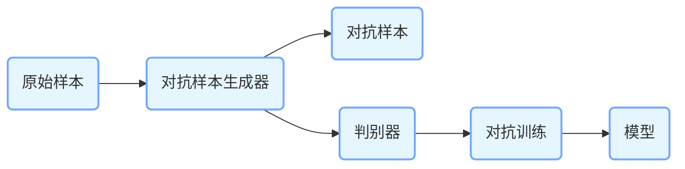

# 模型训练中的对抗学习技术在网络安全防御中的前沿应用

> 关键词：对抗学习技术、模型训练、网络安全防御、前沿应用、对抗样本、生成对抗网络

> 摘要：本文聚焦于模型训练中的对抗学习技术在网络安全防御领域的前沿应用。首先介绍了对抗学习技术的背景知识，包括其目的、预期读者、文档结构等。接着阐述了对抗学习的核心概念与联系，通过文本示意图和 Mermaid 流程图进行详细说明。深入讲解了核心算法原理，并结合 Python 源代码展示具体操作步骤。同时给出了相关的数学模型和公式，并举例说明。通过项目实战，展示了对抗学习技术在网络安全防御中的具体代码实现和解读。分析了该技术在不同场景下的实际应用，推荐了学习该技术的工具和资源，包括书籍、在线课程、开发工具等。最后总结了对抗学习技术在网络安全防御中的未来发展趋势与挑战，并提供了常见问题的解答和扩展阅读参考资料。

## 1. 背景介绍 
### 1.1 目的和范围
随着信息技术的飞速发展，网络安全问题日益严峻。传统的网络安全防御技术在面对日益复杂和多样化的攻击手段时，逐渐暴露出一定的局限性。对抗学习技术作为一种新兴的技术手段，为网络安全防御带来了新的思路和方法。本文的目的在于深入探讨模型训练中的对抗学习技术在网络安全防御中的前沿应用，详细介绍其原理、算法、实际应用案例等内容，帮助读者全面了解该技术在网络安全领域的应用现状和发展趋势。

本文的范围涵盖了对抗学习技术的基本概念、核心算法原理、数学模型、项目实战以及在不同网络安全场景下的应用，同时还推荐了相关的学习资源和开发工具，旨在为对该领域感兴趣的读者提供一个全面而深入的学习和研究参考。

### 1.2 预期读者
本文预期读者包括但不限于网络安全专业人员、人工智能和机器学习领域的研究人员和开发者、计算机科学专业的学生以及对网络安全和对抗学习技术感兴趣的技术爱好者。通过阅读本文，读者可以了解对抗学习技术在网络安全防御中的应用原理和方法，为进一步的研究和实践提供理论和技术支持。

### 1.3 文档结构概述
本文共分为十个部分，具体结构如下：
1. **背景介绍**：介绍本文的目的、预期读者、文档结构概述以及相关术语表。
2. **核心概念与联系**：阐述对抗学习技术的核心概念，包括对抗样本、生成对抗网络等，并通过文本示意图和 Mermaid 流程图展示其原理和架构。
3. **核心算法原理 & 具体操作步骤**：详细讲解对抗学习的核心算法原理，并使用 Python 源代码展示具体操作步骤。
4. **数学模型和公式 & 详细讲解 & 举例说明**：给出对抗学习技术的数学模型和公式，并通过具体例子进行详细讲解。
5. **项目实战：代码实际案例和详细解释说明**：通过项目实战，展示对抗学习技术在网络安全防御中的具体代码实现和解读。
6. **实际应用场景**：分析对抗学习技术在不同网络安全场景下的实际应用。
7. **工具和资源推荐**：推荐学习对抗学习技术的相关工具和资源，包括书籍、在线课程、开发工具等。
8. **总结：未来发展趋势与挑战**：总结对抗学习技术在网络安全防御中的未来发展趋势与挑战。
9. **附录：常见问题与解答**：提供关于对抗学习技术在网络安全防御中常见问题的解答。
10. **扩展阅读 & 参考资料**：提供相关的扩展阅读资料和参考文献。

### 1.4 术语表
#### 1.4.1 核心术语定义
- **对抗学习技术**：一种机器学习技术，通过生成对抗样本或使用生成对抗网络等方法，让模型在对抗性环境中进行训练，以提高模型的鲁棒性和安全性。
- **对抗样本**：通过对原始样本进行微小的、精心设计的扰动，使得模型对其产生错误分类的样本。
- **生成对抗网络（GAN）**：由生成器和判别器组成的神经网络模型，生成器负责生成样本，判别器负责判断样本的真伪，两者通过对抗训练不断提高性能。
- **鲁棒性**：模型在面对各种干扰和攻击时，仍能保持其性能和准确性的能力。
- **网络安全防御**：采取一系列措施来保护计算机网络免受未经授权的访问、攻击、破坏或数据泄露等威胁的过程。

#### 1.4.2 相关概念解释
- **机器学习**：一门多领域交叉学科，涉及概率论、统计学、逼近论、凸分析、算法复杂度理论等多门学科。它专门研究计算机怎样模拟或实现人类的学习行为，以获取新的知识或技能，重新组织已有的知识结构使之不断改善自身的性能。
- **深度学习**：机器学习的一个分支领域，它试图使用包含复杂结构或由多重非线性变换构成的多个处理层对数据进行高层抽象的算法。深度学习通过构建具有很多层的神经网络模型，自动从大量数据中学习特征和模式。
- **神经网络**：一种模仿人类神经系统的计算模型，由大量的神经元组成，通过神经元之间的连接和信号传递来进行信息处理和学习。神经网络可以自动从数据中学习特征和模式，广泛应用于图像识别、语音识别、自然语言处理等领域。

#### 1.4.3 缩略词列表
- **GAN**：Generative Adversarial Networks（生成对抗网络）
- **ML**：Machine Learning（机器学习）
- **DL**：Deep Learning（深度学习）
- **NN**：Neural Network（神经网络）

## 2. 核心概念与联系 

### 核心概念原理
对抗学习技术的核心思想是引入对抗机制，让模型在对抗性环境中进行训练，从而提高模型的鲁棒性和安全性。其中，对抗样本和生成对抗网络是对抗学习技术中的两个重要概念。

#### 对抗样本
对抗样本是通过对原始样本进行微小的、精心设计的扰动得到的。这些扰动通常肉眼无法察觉，但却能使模型对对抗样本产生错误的分类结果。例如，在图像分类任务中，对一张猫的图片添加微小的噪声，可能会使模型将其错误地分类为狗。对抗样本的存在揭示了机器学习模型的脆弱性，同时也为提高模型的鲁棒性提供了思路。

#### 生成对抗网络（GAN）
生成对抗网络由生成器和判别器组成。生成器的任务是生成样本，判别器的任务是判断样本是真实的还是生成的。在训练过程中，生成器和判别器进行对抗训练，生成器不断学习生成更逼真的样本，以欺骗判别器；判别器则不断学习提高自己的判别能力，以区分真实样本和生成样本。通过这种对抗训练，生成器和判别器的性能都得到不断提高。

### 架构的文本示意图
```plaintext
对抗学习技术架构

原始样本  -->  对抗样本生成器  -->  对抗样本
                         |
                         v
模型  <--  对抗训练  <--  判别器
```

### Mermaid 流程图


## 3. 核心算法原理 & 具体操作步骤 

### 核心算法原理
对抗学习技术的核心算法主要包括对抗样本生成算法和生成对抗网络训练算法。

#### 对抗样本生成算法
常见的对抗样本生成算法有快速梯度符号法（FGSM）。FGSM 是一种基于梯度的对抗样本生成算法，其基本思想是利用模型的梯度信息，在原始样本上添加一个与梯度符号相同的扰动，从而生成对抗样本。

#### 生成对抗网络训练算法
生成对抗网络的训练过程是一个交替优化的过程，具体步骤如下：
1. 固定生成器，训练判别器：使用真实样本和生成器生成的假样本训练判别器，使其能够准确区分真实样本和假样本。
2. 固定判别器，训练生成器：使用判别器的反馈信息训练生成器，使其生成的样本能够更好地欺骗判别器。

### 具体操作步骤及 Python 源代码

#### 快速梯度符号法（FGSM）生成对抗样本的 Python 代码示例
```python
import torch
import torch.nn as nn
import torch.optim as optim
import torchvision
import torchvision.transforms as transforms

# 定义一个简单的卷积神经网络模型
class SimpleCNN(nn.Module):
    def __init__(self):
        super(SimpleCNN, self).__init__()
        self.conv1 = nn.Conv2d(3, 6, 5)
        self.pool = nn.MaxPool2d(2, 2)
        self.conv2 = nn.Conv2d(6, 16, 5)
        self.fc1 = nn.Linear(16 * 5 * 5, 120)
        self.fc2 = nn.Linear(120, 84)
        self.fc3 = nn.Linear(84, 10)

    def forward(self, x):
        x = self.pool(torch.relu(self.conv1(x)))
        x = self.pool(torch.relu(self.conv2(x)))
        x = x.view(-1, 16 * 5 * 5)
        x = torch.relu(self.fc1(x))
        x = torch.relu(self.fc2(x))
        x = self.fc3(x)
        return x

# 加载数据集
transform = transforms.Compose(
    [transforms.ToTensor(),
     transforms.Normalize((0.5, 0.5, 0.5), (0.5, 0.5, 0.5))])

trainset = torchvision.datasets.CIFAR10(root='./data', train=True,
                                        download=True, transform=transform)
trainloader = torch.utils.data.DataLoader(trainset, batch_size=4,
                                          shuffle=True, num_workers=2)

testset = torchvision.datasets.CIFAR10(root='./data', train=False,
                                       download=True, transform=transform)
testloader = torch.utils.data.DataLoader(testset, batch_size=4,
                                         shuffle=False, num_workers=2)

# 初始化模型、损失函数和优化器
net = SimpleCNN()
criterion = nn.CrossEntropyLoss()
optimizer = optim.SGD(net.parameters(), lr=0.001, momentum=0.9)

# 训练模型
for epoch in range(2):  # 训练 2 个 epoch
    running_loss = 0.0
    for i, data in enumerate(trainloader, 0):
        inputs, labels = data
        optimizer.zero_grad()
        outputs = net(inputs)
        loss = criterion(outputs, labels)
        loss.backward()
        optimizer.step()
        running_loss += loss.item()
        if i % 2000 == 1999:
            print(f'[{epoch + 1}, {i + 1:5d}] loss: {running_loss / 2000:.3f}')
            running_loss = 0.0

print('Finished Training')

# FGSM 算法生成对抗样本
def fgsm_attack(image, epsilon, data_grad):
    sign_data_grad = data_grad.sign()
    perturbed_image = image + epsilon * sign_data_grad
    perturbed_image = torch.clamp(perturbed_image, 0, 1)
    return perturbed_image

# 测试 FGSM 攻击
epsilon = 0.01
correct = 0
total = 0
for data in testloader:
    images, labels = data
    images.requires_grad = True
    outputs = net(images)
    _, predicted = torch.max(outputs.data, 1)
    loss = criterion(outputs, labels)
    net.zero_grad()
    loss.backward()
    data_grad = images.grad.data
    perturbed_images = fgsm_attack(images, epsilon, data_grad)
    outputs = net(perturbed_images)
    _, predicted = torch.max(outputs.data, 1)
    total += labels.size(0)
    correct += (predicted == labels).sum().item()

print(f'Accuracy after FGSM attack: {100 * correct / total}%')
```

#### 生成对抗网络（GAN）训练的 Python 代码示例
```python
import torch
import torch.nn as nn
import torch.optim as optim
import numpy as np
import matplotlib.pyplot as plt

# 定义生成器
class Generator(nn.Module):
    def __init__(self, latent_dim, img_shape):
        super(Generator, self).__init__()
        self.img_shape = img_shape
        self.model = nn.Sequential(
            nn.Linear(latent_dim, 128),
            nn.LeakyReLU(0.2),
            nn.Linear(128, 256),
            nn.BatchNorm1d(256),
            nn.LeakyReLU(0.2),
            nn.Linear(256, 512),
            nn.BatchNorm1d(512),
            nn.LeakyReLU(0.2),
            nn.Linear(512, int(np.prod(img_shape))),
            nn.Tanh()
        )

    def forward(self, z):
        img = self.model(z)
        img = img.view(img.size(0), *self.img_shape)
        return img

# 定义判别器
class Discriminator(nn.Module):
    def __init__(self, img_shape):
        super(Discriminator, self).__init__()
        self.model = nn.Sequential(
            nn.Linear(int(np.prod(img_shape)), 512),
            nn.LeakyReLU(0.2),
            nn.Linear(512, 256),
            nn.LeakyReLU(0.2),
            nn.Linear(256, 1),
            nn.Sigmoid()
        )

    def forward(self, img):
        img_flat = img.view(img.size(0), -1)
        validity = self.model(img_flat)
        return validity

# 超参数设置
latent_dim = 100
img_shape = (1, 28, 28)
batch_size = 32
epochs = 100
lr = 0.0002

# 初始化生成器和判别器
generator = Generator(latent_dim, img_shape)
discriminator = Discriminator(img_shape)

# 定义损失函数和优化器
criterion = nn.BCELoss()
optimizer_G = optim.Adam(generator.parameters(), lr=lr)
optimizer_D = optim.Adam(discriminator.parameters(), lr=lr)

# 训练 GAN
for epoch in range(epochs):
    for i in range(batch_size):
        # 训练判别器
        optimizer_D.zero_grad()

        # 真实样本
        real_images = torch.randn(batch_size, *img_shape)
        real_labels = torch.ones(batch_size, 1)
        real_output = discriminator(real_images)
        d_real_loss = criterion(real_output, real_labels)

        # 生成样本
        z = torch.randn(batch_size, latent_dim)
        fake_images = generator(z)
        fake_labels = torch.zeros(batch_size, 1)
        fake_output = discriminator(fake_images.detach())
        d_fake_loss = criterion(fake_output, fake_labels)

        # 判别器总损失
        d_loss = d_real_loss + d_fake_loss
        d_loss.backward()
        optimizer_D.step()

        # 训练生成器
        optimizer_G.zero_grad()
        z = torch.randn(batch_size, latent_dim)
        fake_images = generator(z)
        real_labels = torch.ones(batch_size, 1)
        output = discriminator(fake_images)
        g_loss = criterion(output, real_labels)
        g_loss.backward()
        optimizer_G.step()

    print(f'Epoch [{epoch + 1}/{epochs}], D_loss: {d_loss.item():.4f}, G_loss: {g_loss.item():.4f}')
```

## 4. 数学模型和公式 & 详细讲解 & 举例说明 

### 快速梯度符号法（FGSM）的数学模型和公式
FGSM 的目标是找到一个微小的扰动 $\delta$，使得原始样本 $x$ 经过扰动后得到的对抗样本 $x' = x + \delta$ 能够使模型的损失函数 $J(\theta, x, y)$ 增大，其中 $\theta$ 是模型的参数，$y$ 是样本的真实标签。

FGSM 生成的扰动 $\delta$ 可以表示为：
$$\delta = \epsilon \cdot \text{sign}(\nabla_x J(\theta, x, y))$$
其中，$\epsilon$ 是一个控制扰动大小的超参数，$\text{sign}$ 是符号函数，$\nabla_x J(\theta, x, y)$ 是损失函数 $J(\theta, x, y)$ 关于输入样本 $x$ 的梯度。

#### 详细讲解
FGSM 的基本思想是利用损失函数的梯度信息，在梯度的方向上添加一个微小的扰动，从而使模型的输出发生变化。由于梯度表示了损失函数在当前点的变化率，因此在梯度的方向上添加扰动可以使损失函数增大，从而导致模型对对抗样本产生错误的分类结果。

#### 举例说明
假设我们有一个简单的线性分类器 $f(x) = w^T x + b$，其中 $w$ 是权重向量，$b$ 是偏置项。损失函数为交叉熵损失 $J(\theta, x, y) = -y \log(f(x)) - (1 - y) \log(1 - f(x))$。

给定一个输入样本 $x$，我们可以计算出损失函数关于 $x$ 的梯度 $\nabla_x J(\theta, x, y)$。然后，根据 FGSM 公式，我们可以生成对抗样本 $x' = x + \epsilon \cdot \text{sign}(\nabla_x J(\theta, x, y))$。

例如，假设 $\epsilon = 0.1$，$\nabla_x J(\theta, x, y) = [0.2, -0.3, 0.1]$，则 $\text{sign}(\nabla_x J(\theta, x, y)) = [1, -1, 1]$，对抗样本 $x'$ 的计算如下：
$$x' = x + 0.1 \cdot [1, -1, 1]$$

### 生成对抗网络（GAN）的数学模型和公式
生成对抗网络的目标是通过对抗训练，使生成器生成的样本能够尽可能地接近真实样本的分布。GAN 的训练过程可以用一个最小 - 最大博弈来描述：
$$\min_G \max_D V(D, G) = \mathbb{E}_{x \sim p_{data}(x)}[\log D(x)] + \mathbb{E}_{z \sim p_z(z)}[\log(1 - D(G(z)))]$$
其中，$G$ 是生成器，$D$ 是判别器，$p_{data}(x)$ 是真实样本的分布，$p_z(z)$ 是噪声分布，$G(z)$ 是生成器根据噪声 $z$ 生成的样本。

#### 详细讲解
生成对抗网络的训练过程可以分为两个阶段：
1. **训练判别器**：固定生成器 $G$，最大化 $V(D, G)$。判别器的目标是尽可能准确地判断样本是真实的还是生成的，因此需要最大化 $\mathbb{E}_{x \sim p_{data}(x)}[\log D(x)]$ 和 $\mathbb{E}_{z \sim p_z(z)}[\log(1 - D(G(z)))]$。
2. **训练生成器**：固定判别器 $D$，最小化 $V(D, G)$。生成器的目标是生成能够欺骗判别器的样本，因此需要最小化 $\mathbb{E}_{z \sim p_z(z)}[\log(1 - D(G(z)))]$。

#### 举例说明
假设真实样本的分布 $p_{data}(x)$ 是一个二维高斯分布，噪声分布 $p_z(z)$ 是一个均匀分布。生成器 $G$ 是一个简单的神经网络，它将噪声 $z$ 映射到二维空间中。判别器 $D$ 也是一个神经网络，它接受一个二维向量作为输入，并输出一个标量，表示该向量是真实样本的概率。

在训练过程中，判别器会不断学习区分真实样本和生成样本，而生成器会不断学习生成更逼真的样本，以欺骗判别器。通过不断的对抗训练，生成器生成的样本会越来越接近真实样本的分布。

## 5. 项目实战：代码实际案例和详细解释说明 

### 5.1  开发环境搭建
#### 硬件环境
- **CPU**：Intel Core i7 及以上处理器
- **GPU**：NVIDIA GPU（可选，用于加速训练过程）
- **内存**：16GB 及以上

#### 软件环境
- **操作系统**：Windows 10、Ubuntu 18.04 及以上
- **Python 版本**：Python 3.6 及以上
- **深度学习框架**：PyTorch 1.7 及以上

#### 安装依赖库
```bash
pip install torch torchvision numpy matplotlib
```

### 5.2  源代码详细实现和代码解读
#### 基于 FGSM 的网络安全防御示例
```python
import torch
import torch.nn as nn
import torch.optim as optim
import torchvision
import torchvision.transforms as transforms

# 定义一个简单的卷积神经网络模型
class SimpleCNN(nn.Module):
    def __init__(self):
        super(SimpleCNN, self).__init__()
        self.conv1 = nn.Conv2d(3, 6, 5)
        self.pool = nn.MaxPool2d(2, 2)
        self.conv2 = nn.Conv2d(6, 16, 5)
        self.fc1 = nn.Linear(16 * 5 * 5, 120)
        self.fc2 = nn.Linear(120, 84)
        self.fc3 = nn.Linear(84, 10)

    def forward(self, x):
        x = self.pool(torch.relu(self.conv1(x)))
        x = self.pool(torch.relu(self.conv2(x)))
        x = x.view(-1, 16 * 5 * 5)
        x = torch.relu(self.fc1(x))
        x = torch.relu(self.fc2(x))
        x = self.fc3(x)
        return x

# 加载数据集
transform = transforms.Compose(
    [transforms.ToTensor(),
     transforms.Normalize((0.5, 0.5, 0.5), (0.5, 0.5, 0.5))])

trainset = torchvision.datasets.CIFAR10(root='./data', train=True,
                                        download=True, transform=transform)
trainloader = torch.utils.data.DataLoader(trainset, batch_size=4,
                                          shuffle=True, num_workers=2)

testset = torchvision.datasets.CIFAR10(root='./data', train=False,
                                       download=True, transform=transform)
testloader = torch.utils.data.DataLoader(testset, batch_size=4,
                                         shuffle=False, num_workers=2)

# 初始化模型、损失函数和优化器
net = SimpleCNN()
criterion = nn.CrossEntropyLoss()
optimizer = optim.SGD(net.parameters(), lr=0.001, momentum=0.9)

# 训练模型
for epoch in range(2):  # 训练 2 个 epoch
    running_loss = 0.0
    for i, data in enumerate(trainloader, 0):
        inputs, labels = data
        optimizer.zero_grad()
        outputs = net(inputs)
        loss = criterion(outputs, labels)
        loss.backward()
        optimizer.step()
        running_loss += loss.item()
        if i % 2000 == 1999:
            print(f'[{epoch + 1}, {i + 1:5d}] loss: {running_loss / 2000:.3f}')
            running_loss = 0.0

print('Finished Training')

# FGSM 算法生成对抗样本
def fgsm_attack(image, epsilon, data_grad):
    sign_data_grad = data_grad.sign()
    perturbed_image = image + epsilon * sign_data_grad
    perturbed_image = torch.clamp(perturbed_image, 0, 1)
    return perturbed_image

# 测试 FGSM 攻击
epsilon = 0.01
correct = 0
total = 0
for data in testloader:
    images, labels = data
    images.requires_grad = True
    outputs = net(images)
    _, predicted = torch.max(outputs.data, 1)
    loss = criterion(outputs, labels)
    net.zero_grad()
    loss.backward()
    data_grad = images.grad.data
    perturbed_images = fgsm_attack(images, epsilon, data_grad)
    outputs = net(perturbed_images)
    _, predicted = torch.max(outputs.data, 1)
    total += labels.size(0)
    correct += (predicted == labels).sum().item()

print(f'Accuracy after FGSM attack: {100 * correct / total}%')
```

#### 代码解读
1. **模型定义**：定义了一个简单的卷积神经网络 `SimpleCNN`，包含两个卷积层和三个全连接层。
2. **数据集加载**：使用 `torchvision` 加载 CIFAR - 10 数据集，并进行预处理。
3. **模型训练**：使用交叉熵损失函数和随机梯度下降优化器对模型进行训练。
4. **FGSM 攻击**：定义了 `fgsm_attack` 函数，用于生成对抗样本。在测试阶段，对测试集中的样本进行 FGSM 攻击，并计算攻击后的准确率。

#### 基于 GAN 的网络安全防御示例
```python
import torch
import torch.nn as nn
import torch.optim as optim
import numpy as np
import matplotlib.pyplot as plt

# 定义生成器
class Generator(nn.Module):
    def __init__(self, latent_dim, img_shape):
        super(Generator, self).__init__()
        self.img_shape = img_shape
        self.model = nn.Sequential(
            nn.Linear(latent_dim, 128),
            nn.LeakyReLU(0.2),
            nn.Linear(128, 256),
            nn.BatchNorm1d(256),
            nn.LeakyReLU(0.2),
            nn.Linear(256, 512),
            nn.BatchNorm1d(512),
            nn.LeakyReLU(0.2),
            nn.Linear(512, int(np.prod(img_shape))),
            nn.Tanh()
        )

    def forward(self, z):
        img = self.model(z)
        img = img.view(img.size(0), *self.img_shape)
        return img

# 定义判别器
class Discriminator(nn.Module):
    def __init__(self, img_shape):
        super(Discriminator, self).__init__()
        self.model = nn.Sequential(
            nn.Linear(int(np.prod(img_shape)), 512),
            nn.LeakyReLU(0.2),
            nn.Linear(512, 256),
            nn.LeakyReLU(0.2),
            nn.Linear(256, 1),
            nn.Sigmoid()
        )

    def forward(self, img):
        img_flat = img.view(img.size(0), -1)
        validity = self.model(img_flat)
        return validity

# 超参数设置
latent_dim = 100
img_shape = (1, 28, 28)
batch_size = 32
epochs = 100
lr = 0.0002

# 初始化生成器和判别器
generator = Generator(latent_dim, img_shape)
discriminator = Discriminator(img_shape)

# 定义损失函数和优化器
criterion = nn.BCELoss()
optimizer_G = optim.Adam(generator.parameters(), lr=lr)
optimizer_D = optim.Adam(discriminator.parameters(), lr=lr)

# 训练 GAN
for epoch in range(epochs):
    for i in range(batch_size):
        # 训练判别器
        optimizer_D.zero_grad()

        # 真实样本
        real_images = torch.randn(batch_size, *img_shape)
        real_labels = torch.ones(batch_size, 1)
        real_output = discriminator(real_images)
        d_real_loss = criterion(real_output, real_labels)

        # 生成样本
        z = torch.randn(batch_size, latent_dim)
        fake_images = generator(z)
        fake_labels = torch.zeros(batch_size, 1)
        fake_output = discriminator(fake_images.detach())
        d_fake_loss = criterion(fake_output, fake_labels)

        # 判别器总损失
        d_loss = d_real_loss + d_fake_loss
        d_loss.backward()
        optimizer_D.step()

        # 训练生成器
        optimizer_G.zero_grad()
        z = torch.randn(batch_size, latent_dim)
        fake_images = generator(z)
        real_labels = torch.ones(batch_size, 1)
        output = discriminator(fake_images)
        g_loss = criterion(output, real_labels)
        g_loss.backward()
        optimizer_G.step()

    print(f'Epoch [{epoch + 1}/{epochs}], D_loss: {d_loss.item():.4f}, G_loss: {g_loss.item():.4f}')
```

#### 代码解读
1. **生成器和判别器定义**：定义了生成器 `Generator` 和判别器 `Discriminator` 两个神经网络模型。
2. **超参数设置**：设置了潜在维度、图像形状、批量大小、训练轮数和学习率等超参数。
3. **损失函数和优化器**：使用二元交叉熵损失函数 `BCELoss` 和 Adam 优化器对生成器和判别器进行训练。
4. **训练过程**：在每个训练轮次中，交替训练判别器和生成器，直到达到指定的训练轮数。

### 5.3  代码解读与分析
#### FGSM 代码分析
- **优点**：FGSM 算法简单高效，计算速度快，可以快速生成对抗样本。
- **缺点**：FGSM 生成的对抗样本是基于一阶梯度信息，可能不够鲁棒，容易被防御机制检测到。

#### GAN 代码分析
- **优点**：GAN 可以生成非常逼真的样本，能够学习到真实样本的分布，在数据增强、异常检测等方面有广泛的应用。
- **缺点**：GAN 的训练过程不稳定，容易出现梯度消失或梯度爆炸的问题，需要进行仔细的调参和优化。

## 6. 实际应用场景 
### 入侵检测
在网络安全领域，入侵检测是一项重要的任务。传统的入侵检测方法主要基于规则和特征匹配，对于新型的攻击手段往往难以检测。对抗学习技术可以用于生成对抗样本，模拟各种潜在的攻击行为，从而训练入侵检测模型，提高其对未知攻击的检测能力。

例如，通过生成对抗样本模拟恶意软件的行为，让入侵检测模型学习这些异常行为的特征，从而在实际检测中能够更准确地识别恶意软件的入侵。

### 恶意软件检测
恶意软件的种类和数量不断增加，传统的恶意软件检测方法主要基于特征码匹配，对于变异的恶意软件往往无法检测。对抗学习技术可以用于生成对抗样本，模拟恶意软件的变异行为，从而训练恶意软件检测模型，提高其对变异恶意软件的检测能力。

例如，使用生成对抗网络生成与已知恶意软件特征相似但又有所不同的样本，让恶意软件检测模型学习这些样本的特征，从而在实际检测中能够更准确地识别变异的恶意软件。

### 数据保护
在数据传输和存储过程中，数据的安全性至关重要。对抗学习技术可以用于生成对抗样本，对数据进行加密和保护。例如，通过生成对抗样本对原始数据进行扰动，使得攻击者无法轻易获取真实的数据信息。同时，在数据恢复过程中，可以使用训练好的模型对扰动后的数据进行还原，从而保证数据的完整性和安全性。

### 异常检测
在网络系统中，异常行为往往意味着潜在的安全威胁。对抗学习技术可以用于异常检测，通过生成对抗样本模拟各种异常行为，训练异常检测模型，提高其对异常行为的识别能力。

例如，在网络流量监测中，使用生成对抗网络生成异常的网络流量样本，让异常检测模型学习这些样本的特征，从而在实际监测中能够更准确地识别异常的网络流量，及时发现潜在的安全威胁。

## 7. 工具和资源推荐
### 7.1 学习资源推荐
#### 7.1.1 书籍推荐
- 《深度学习》（Deep Learning）：由 Ian Goodfellow、Yoshua Bengio 和 Aaron Courville 所著，是深度学习领域的经典教材，涵盖了深度学习的基本概念、算法和应用。
- 《Python 深度学习》（Deep Learning with Python）：由 Francois Chollet 所著，介绍了如何使用 Python 和 Keras 框架进行深度学习的开发，适合初学者入门。
- 《生成对抗网络实战》（GANs in Action）：由 Jakub Langr 和 Vladimir Bok 所著，详细介绍了生成对抗网络的原理、算法和应用，是学习生成对抗网络的优秀书籍。

#### 7.1.2 在线课程
- Coursera 上的“深度学习专项课程”（Deep Learning Specialization）：由 Andrew Ng 教授授课，包括神经网络和深度学习、改善深层神经网络、结构化机器学习项目、卷积神经网络和序列模型等课程，全面介绍了深度学习的理论和实践。
- edX 上的“人工智能基础”（Introduction to Artificial Intelligence）：由 MIT 教授授课，介绍了人工智能的基本概念、算法和应用，是学习人工智能的入门课程。
- Udemy 上的“生成对抗网络实战”（Generative Adversarial Networks (GANs) in Python）：介绍了如何使用 Python 和 PyTorch 框架实现生成对抗网络，适合有一定编程基础的学习者。

#### 7.1.3 技术博客和网站
- Medium 上的 Towards Data Science：是一个专注于数据科学和机器学习的技术博客平台，上面有很多关于对抗学习技术的文章和教程。
- arXiv.org：是一个预印本服务器，上面有很多关于对抗学习技术的最新研究成果和论文。
- Kaggle：是一个数据科学竞赛平台，上面有很多关于对抗学习技术的竞赛和数据集，可以通过参与竞赛来学习和实践对抗学习技术。

### 7.2 开发工具框架推荐
#### 7.2.1 IDE和编辑器
- PyCharm：是一款专门为 Python 开发设计的集成开发环境，提供了丰富的代码编辑、调试和分析功能，适合 Python 开发者使用。
- Jupyter Notebook：是一个交互式的开发环境，支持 Python、R 等多种编程语言，可以方便地进行代码编写、数据分析和可视化，适合数据科学家和机器学习开发者使用。
- Visual Studio Code：是一款轻量级的代码编辑器，支持多种编程语言和插件扩展，具有丰富的代码编辑和调试功能，适合初学者和开发者使用。

#### 7.2.2 调试和性能分析工具
- TensorBoard：是 TensorFlow 框架提供的一个可视化工具，可以用于可视化训练过程中的损失函数、准确率等指标，帮助开发者调试和优化模型。
- PyTorch Profiler：是 PyTorch 框架提供的一个性能分析工具，可以用于分析模型的计算性能、内存使用情况等，帮助开发者优化模型的性能。
- NVIDIA Nsight Systems：是 NVIDIA 提供的一个性能分析工具，可以用于分析 GPU 加速的深度学习模型的性能，帮助开发者优化模型的 GPU 利用率。

#### 7.2.3 相关框架和库
- PyTorch：是一个开源的深度学习框架，提供了丰富的神经网络模型和优化算法，支持 GPU 加速，适合深度学习开发者使用。
- TensorFlow：是一个开源的深度学习框架，由 Google 开发和维护，提供了丰富的神经网络模型和工具，支持分布式训练，适合大规模深度学习项目的开发。
- Scikit - learn：是一个开源的机器学习库，提供了丰富的机器学习算法和工具，适合机器学习初学者和开发者使用。

### 7.3 相关论文著作推荐
#### 7.3.1 经典论文
- “Explaining and Harnessing Adversarial Examples”：由 Ian J. Goodfellow、Jonathon Shlens 和 Christian Szegedy 所著，首次提出了对抗样本的概念，并介绍了快速梯度符号法（FGSM）生成对抗样本的方法。
- “Generative Adversarial Nets”：由 Ian J. Goodfellow 等人所著，首次提出了生成对抗网络（GAN）的概念，开创了生成式模型的新纪元。
- “Adversarial Machine Learning at Scale”：由 Alexey Kurakin、Ian J. Goodfellow 和 Samy Bengio 所著，介绍了在大规模数据集上进行对抗学习的方法和技术。

#### 7.3.2 最新研究成果
- 关注 arXiv.org 上关于对抗学习技术的最新研究论文，了解该领域的最新研究动态和成果。
- 参加相关的学术会议，如 NeurIPS（神经信息处理系统大会）、ICML（国际机器学习会议）等，了解该领域的最新研究进展和趋势。

#### 7.3.3 应用案例分析
- 关注各大科技公司的技术博客和开源项目，了解对抗学习技术在实际应用中的案例和经验分享。
- 分析 Kaggle 上关于对抗学习技术的竞赛和数据集，学习其他开发者的实践经验和技巧。

## 8. 总结：未来发展趋势与挑战
### 未来发展趋势
- **多模态对抗学习**：未来的对抗学习技术将不仅仅局限于图像、文本等单一模态的数据，而是会向多模态数据的方向发展，如结合图像、文本、音频等多种模态的数据进行对抗学习，以提高模型的性能和鲁棒性。
- **自适应对抗学习**：随着攻击手段的不断变化和发展，未来的对抗学习技术将更加注重自适应能力，能够自动适应不同的攻击场景和数据分布，实时调整防御策略，提高网络安全防御的效果。
- **对抗学习与其他技术的融合**：对抗学习技术将与区块链、物联网、量子计算等其他新兴技术进行融合，为网络安全防御提供更加全面和有效的解决方案。

### 挑战
- **对抗样本的可迁移性**：对抗样本的可迁移性是指在一个模型上生成的对抗样本可以在其他模型上也产生攻击效果。这种可迁移性使得攻击者可以利用一个模型生成的对抗样本攻击多个模型，增加了网络安全防御的难度。
- **对抗学习模型的训练稳定性**：对抗学习模型的训练过程往往不稳定，容易出现梯度消失、梯度爆炸等问题，导致模型无法收敛或性能下降。如何提高对抗学习模型的训练稳定性是当前研究的一个重要挑战。
- **对抗学习技术的可解释性**：对抗学习技术的决策过程往往是黑盒的，难以解释模型为什么会做出这样的决策。在一些对安全性要求较高的应用场景中，如金融、医疗等，模型的可解释性至关重要。如何提高对抗学习技术的可解释性是未来需要解决的一个重要问题。

## 9. 附录：常见问题与解答
### 1. 什么是对抗样本？
对抗样本是通过对原始样本进行微小的、精心设计的扰动得到的。这些扰动通常肉眼无法察觉，但却能使模型对对抗样本产生错误的分类结果。

### 2. 对抗学习技术有哪些应用场景？
对抗学习技术在网络安全领域有广泛的应用，包括入侵检测、恶意软件检测、数据保护、异常检测等。

### 3. 如何生成对抗样本？
常见的对抗样本生成算法有快速梯度符号法（FGSM）、基本迭代法（BIM）等。这些算法都是基于模型的梯度信息，在原始样本上添加微小的扰动来生成对抗样本。

### 4. 生成对抗网络（GAN）的训练过程是怎样的？
生成对抗网络的训练过程是一个交替优化的过程，具体步骤如下：
1. 固定生成器，训练判别器：使用真实样本和生成器生成的假样本训练判别器，使其能够准确区分真实样本和假样本。
2. 固定判别器，训练生成器：使用判别器的反馈信息训练生成器，使其生成的样本能够更好地欺骗判别器。

### 5. 对抗学习技术存在哪些挑战？
对抗学习技术存在对抗样本的可迁移性、对抗学习模型的训练稳定性、对抗学习技术的可解释性等挑战。

## 10. 扩展阅读 & 参考资料
### 扩展阅读
- Goodfellow, I. J., Bengio, Y., & Courville, A. (2016). Deep Learning. MIT Press.
- Chollet, F. (2018). Deep Learning with Python. Manning Publications.
- Langr, J., & Bok, V. (2019). GANs in Action. Manning Publications.

### 参考资料
- Goodfellow, I. J., Shlens, J., & Szegedy, C. (2014). Explaining and Harnessing Adversarial Examples. arXiv preprint arXiv:1412.6572.
- Goodfellow, I. J., et al. (2014). Generative Adversarial Nets. Advances in neural information processing systems.
- Kurakin, A., Goodfellow, I. J., & Bengio, S. (2016). Adversarial Machine Learning at Scale. arXiv preprint arXiv:1611.01236.