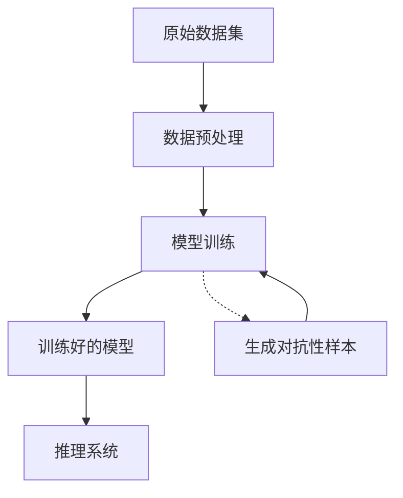

# 模型训练中的对抗训练在提高推理系统安全性方面的创新

> 关键词：模型训练、对抗训练、推理系统、安全性、创新

> 摘要：本文聚焦于模型训练中的对抗训练在提高推理系统安全性方面的创新。首先介绍了研究的背景，包括目的、预期读者等内容。详细阐述了对抗训练等核心概念及其联系，通过Python代码讲解了核心算法原理与具体操作步骤，运用数学模型和公式对其进行理论剖析并举例说明。结合项目实战给出代码实际案例及详细解释，探讨了对抗训练在不同场景下的实际应用。推荐了相关的学习资源、开发工具框架以及论文著作。最后总结了未来发展趋势与挑战，并对常见问题进行解答，同时提供了扩展阅读与参考资料，旨在全面深入地探讨对抗训练在推理系统安全领域的创新价值。

## 1. 背景介绍 
### 1.1 目的和范围
在当今数字化时代，推理系统被广泛应用于各个领域，如金融、医疗、交通等。然而，推理系统面临着诸多安全威胁，例如恶意攻击可能导致系统输出错误的结果，从而造成严重的损失。模型训练中的对抗训练作为一种新兴的技术手段，旨在提高推理系统的安全性和鲁棒性。本研究的目的在于深入探讨对抗训练在提高推理系统安全性方面的创新应用，分析其原理、方法和实际效果。范围涵盖了对抗训练的基本概念、核心算法、数学模型，以及在不同实际场景中的应用案例等方面。

### 1.2 预期读者
本文预期读者包括从事人工智能、机器学习、信息安全等领域的研究人员、工程师和开发者。对于对推理系统安全性感兴趣的学生和爱好者，也可以通过本文了解对抗训练的相关知识和创新应用。

### 1.3 文档结构概述
本文将按照以下结构进行阐述：首先介绍相关背景知识，包括目的、读者和文档结构等。接着详细讲解对抗训练等核心概念及其联系，通过流程图和文本示意图进行说明。然后给出核心算法原理和具体操作步骤，并用Python代码进行详细阐述。再运用数学模型和公式对其进行理论分析并举例。结合项目实战给出代码实际案例和详细解释。探讨对抗训练在不同实际场景中的应用。推荐相关的学习资源、开发工具框架和论文著作。最后总结未来发展趋势与挑战，解答常见问题，并提供扩展阅读与参考资料。

### 1.4 术语表
#### 1.4.1 核心术语定义
- **模型训练**：指通过使用大量的数据对机器学习或深度学习模型进行优化，使其能够学习到数据中的模式和规律，从而提高模型的性能和准确性。
- **对抗训练**：一种特殊的训练方法，通过引入对抗性样本，让模型在训练过程中学习到如何抵御这些攻击，从而提高模型的鲁棒性和安全性。
- **推理系统**：指利用已训练好的模型对新的数据进行预测和推断的系统。
- **对抗性样本**：指经过精心构造的输入样本，这些样本在人类看来与正常样本相似，但却能使模型产生错误的输出。

#### 1.4.2 相关概念解释
- **鲁棒性**：指模型在面对各种干扰和不确定性时，仍能保持较好的性能和准确性的能力。
- **安全性**：指推理系统在面对恶意攻击和威胁时，能够保护其数据和输出结果的正确性和完整性的能力。

#### 1.4.3 缩略词列表
- **ML**：Machine Learning，机器学习
- **DL**：Deep Learning，深度学习
- **AI**：Artificial Intelligence，人工智能

## 2. 核心概念与联系 

### 核心概念原理
#### 模型训练
模型训练是机器学习和深度学习中的核心环节。其基本原理是通过定义一个目标函数（通常称为损失函数），来衡量模型的预测结果与真实标签之间的差异。然后使用优化算法（如梯度下降法）来不断调整模型的参数，使得损失函数的值最小化。例如，在一个简单的线性回归模型 $y = wx + b$ 中，我们的目标是找到合适的 $w$ 和 $b$ 值，使得模型对输入数据 $x$ 的预测值 $y$ 尽可能接近真实值。

#### 对抗训练
对抗训练的核心思想是引入对抗性样本，让模型在训练过程中学习到如何抵御这些攻击。具体来说，对抗性样本是通过对原始输入样本添加微小的扰动而生成的，这些扰动在人类看来几乎不可察觉，但却能使模型产生错误的输出。在对抗训练中，我们会同时使用原始样本和对抗性样本对模型进行训练，让模型学习到如何区分正常样本和对抗性样本，从而提高模型的鲁棒性和安全性。

#### 推理系统
推理系统是利用已训练好的模型对新的数据进行预测和推断的系统。在推理过程中，输入数据会被送入模型中，模型根据其内部的参数和结构对输入数据进行处理，最终输出预测结果。推理系统的安全性直接关系到其输出结果的正确性和可靠性。

### 架构的文本示意图
```plaintext
+-------------------+
|  原始数据集       |
+-------------------+
       |
       v
+-------------------+
|  数据预处理       |
+-------------------+
       |
       v
+-------------------+
|  模型训练         |
|  - 正常样本训练   |
|  - 对抗性样本训练 |
+-------------------+
       |
       v
+-------------------+
|  训练好的模型     |
+-------------------+
       |
       v
+-------------------+
|  推理系统         |
|  - 输入新数据     |
|  - 输出预测结果   |
+-------------------+
```

### Mermaid 流程图


## 3. 核心算法原理 & 具体操作步骤 

### 核心算法原理
对抗训练中常用的一种算法是快速梯度符号法（Fast Gradient Sign Method，FGSM）。其基本思想是通过计算损失函数关于输入数据的梯度，然后根据梯度的符号对输入数据添加微小的扰动，从而生成对抗性样本。

### Python源代码详细阐述
以下是一个使用PyTorch实现FGSM算法的示例代码：

```python
import torch
import torch.nn as nn
import torch.optim as optim
import torchvision
import torchvision.transforms as transforms

# 定义超参数
epsilon = 0.01
learning_rate = 0.001
num_epochs = 5

# 加载数据集
transform = transforms.Compose([
    transforms.ToTensor(),
    transforms.Normalize((0.5,), (0.5,))
])

trainset = torchvision.datasets.MNIST(root='./data', train=True,
                                      download=True, transform=transform)
trainloader = torch.utils.data.DataLoader(trainset, batch_size=64,
                                          shuffle=True)

testset = torchvision.datasets.MNIST(root='./data', train=False,
                                     download=True, transform=transform)
testloader = torch.utils.data.DataLoader(testset, batch_size=64,
                                         shuffle=False)

# 定义简单的神经网络模型
class Net(nn.Module):
    def __init__(self):
        super(Net, self).__init__()
        self.fc1 = nn.Linear(28 * 28, 128)
        self.fc2 = nn.Linear(128, 10)

    def forward(self, x):
        x = x.view(-1, 28 * 28)
        x = torch.relu(self.fc1(x))
        x = self.fc2(x)
        return x

net = Net()

# 定义损失函数和优化器
criterion = nn.CrossEntropyLoss()
optimizer = optim.Adam(net.parameters(), lr=learning_rate)

# FGSM算法实现
def fgsm_attack(image, epsilon, data_grad):
    sign_data_grad = data_grad.sign()
    perturbed_image = image + epsilon * sign_data_grad
    perturbed_image = torch.clamp(perturbed_image, 0, 1)
    return perturbed_image

# 对抗训练过程
for epoch in range(num_epochs):
    running_loss = 0.0
    for i, data in enumerate(trainloader, 0):
        inputs, labels = data
        inputs.requires_grad = True

        # 正常样本训练
        optimizer.zero_grad()
        outputs = net(inputs)
        loss = criterion(outputs, labels)
        loss.backward()
        optimizer.step()

        # 对抗性样本训练
        data_grad = inputs.grad.data
        perturbed_inputs = fgsm_attack(inputs, epsilon, data_grad)
        optimizer.zero_grad()
        outputs = net(perturbed_inputs)
        loss = criterion(outputs, labels)
        loss.backward()
        optimizer.step()

        running_loss += loss.item()
    print(f'Epoch {epoch + 1}, Loss: {running_loss / len(trainloader)}')

# 测试模型
correct = 0
total = 0
with torch.no_grad():
    for data in testloader:
        images, labels = data
        outputs = net(images)
        _, predicted = torch.max(outputs.data, 1)
        total += labels.size(0)
        correct += (predicted == labels).sum().item()

print(f'Accuracy of the network on the test images: {100 * correct / total}%')
```

### 具体操作步骤
1. **数据加载**：使用`torchvision`库加载MNIST数据集，并进行预处理。
2. **模型定义**：定义一个简单的全连接神经网络模型。
3. **损失函数和优化器定义**：使用交叉熵损失函数和Adam优化器。
4. **FGSM算法实现**：定义`fgsm_attack`函数，用于生成对抗性样本。
5. **对抗训练**：在每个训练周期中，先使用正常样本进行训练，然后使用FGSM算法生成对抗性样本并进行训练。
6. **模型测试**：使用测试集对训练好的模型进行测试，计算模型的准确率。

## 4. 数学模型和公式 & 详细讲解 & 举例说明 

### 数学模型和公式
#### 损失函数
在分类问题中，常用的损失函数是交叉熵损失函数，其定义如下：
$$
L(\hat{y}, y) = -\sum_{i=1}^{C} y_i \log(\hat{y}_i)
$$
其中，$\hat{y}$ 是模型的预测输出，$y$ 是真实标签，$C$ 是类别数。

#### FGSM算法
FGSM算法通过以下公式生成对抗性样本：
$$
x' = x + \epsilon \cdot \text{sign}(\nabla_x L(\theta, x, y))
$$
其中，$x$ 是原始输入样本，$x'$ 是对抗性样本，$\epsilon$ 是扰动的强度，$\nabla_x L(\theta, x, y)$ 是损失函数关于输入数据 $x$ 的梯度，$\text{sign}$ 是符号函数。

### 详细讲解
#### 损失函数
交叉熵损失函数衡量了模型的预测分布与真实分布之间的差异。当模型的预测结果与真实标签越接近时，损失函数的值越小。在训练过程中，我们的目标是通过调整模型的参数 $\theta$ 来最小化损失函数的值。

#### FGSM算法
FGSM算法的核心思想是在输入数据的梯度方向上添加一个微小的扰动，使得损失函数的值增大。由于梯度表示了损失函数在当前输入点的变化方向，因此在梯度方向上添加扰动可以使模型更容易产生错误的输出。通过使用对抗性样本进行训练，模型可以学习到如何抵御这种攻击，从而提高其鲁棒性和安全性。

### 举例说明
假设我们有一个简单的二分类问题，模型的预测输出为 $\hat{y} = [0.8, 0.2]$，真实标签为 $y = [1, 0]$。则交叉熵损失函数的值为：
$$
L(\hat{y}, y) = - (1 \cdot \log(0.8) + 0 \cdot \log(0.2)) \approx 0.223
$$

假设输入数据 $x$ 的梯度为 $\nabla_x L(\theta, x, y) = [0.1, -0.2]$，扰动强度 $\epsilon = 0.01$。则根据FGSM算法生成的对抗性样本为：
$$
x' = x + 0.01 \cdot \text{sign}([0.1, -0.2]) = x + [0.01, -0.01]
$$

## 5. 项目实战：代码实际案例和详细解释说明 

### 5.1  开发环境搭建
#### 安装Python
首先，需要安装Python 3.x版本。可以从Python官方网站（https://www.python.org/downloads/）下载并安装。

#### 安装PyTorch
使用以下命令安装PyTorch：
```sh
pip install torch torchvision
```

#### 安装其他依赖库
根据需要安装其他依赖库，如`numpy`、`matplotlib`等：
```sh
pip install numpy matplotlib
```

### 5.2  源代码详细实现和代码解读
以下是上述对抗训练代码的详细解读：

```python
import torch
import torch.nn as nn
import torch.optim as optim
import torchvision
import torchvision.transforms as transforms

# 定义超参数
epsilon = 0.01
learning_rate = 0.001
num_epochs = 5

# 加载数据集
transform = transforms.Compose([
    transforms.ToTensor(),
    transforms.Normalize((0.5,), (0.5,))
])

trainset = torchvision.datasets.MNIST(root='./data', train=True,
                                      download=True, transform=transform)
trainloader = torch.utils.data.DataLoader(trainset, batch_size=64,
                                          shuffle=True)

testset = torchvision.datasets.MNIST(root='./data', train=False,
                                     download=True, transform=transform)
testloader = torch.utils.data.DataLoader(testset, batch_size=64,
                                         shuffle=False)

# 定义简单的神经网络模型
class Net(nn.Module):
    def __init__(self):
        super(Net, self).__init__()
        self.fc1 = nn.Linear(28 * 28, 128)
        self.fc2 = nn.Linear(128, 10)

    def forward(self, x):
        x = x.view(-1, 28 * 28)
        x = torch.relu(self.fc1(x))
        x = self.fc2(x)
        return x

net = Net()

# 定义损失函数和优化器
criterion = nn.CrossEntropyLoss()
optimizer = optim.Adam(net.parameters(), lr=learning_rate)

# FGSM算法实现
def fgsm_attack(image, epsilon, data_grad):
    sign_data_grad = data_grad.sign()
    perturbed_image = image + epsilon * sign_data_grad
    perturbed_image = torch.clamp(perturbed_image, 0, 1)
    return perturbed_image

# 对抗训练过程
for epoch in range(num_epochs):
    running_loss = 0.0
    for i, data in enumerate(trainloader, 0):
        inputs, labels = data
        inputs.requires_grad = True

        # 正常样本训练
        optimizer.zero_grad()
        outputs = net(inputs)
        loss = criterion(outputs, labels)
        loss.backward()
        optimizer.step()

        # 对抗性样本训练
        data_grad = inputs.grad.data
        perturbed_inputs = fgsm_attack(inputs, epsilon, data_grad)
        optimizer.zero_grad()
        outputs = net(perturbed_inputs)
        loss = criterion(outputs, labels)
        loss.backward()
        optimizer.step()

        running_loss += loss.item()
    print(f'Epoch {epoch + 1}, Loss: {running_loss / len(trainloader)}')

# 测试模型
correct = 0
total = 0
with torch.no_grad():
    for data in testloader:
        images, labels = data
        outputs = net(images)
        _, predicted = torch.max(outputs.data, 1)
        total += labels.size(0)
        correct += (predicted == labels).sum().item()

print(f'Accuracy of the network on the test images: {100 * correct / total}%')
```

#### 代码解读
1. **导入库**：导入所需的PyTorch和`torchvision`库。
2. **定义超参数**：定义扰动强度`epsilon`、学习率`learning_rate`和训练周期数`num_epochs`。
3. **加载数据集**：使用`torchvision`加载MNIST数据集，并进行预处理。
4. **定义模型**：定义一个简单的全连接神经网络模型。
5. **定义损失函数和优化器**：使用交叉熵损失函数和Adam优化器。
6. **实现FGSM算法**：定义`fgsm_attack`函数，用于生成对抗性样本。
7. **对抗训练**：在每个训练周期中，先使用正常样本进行训练，然后使用FGSM算法生成对抗性样本并进行训练。
8. **测试模型**：使用测试集对训练好的模型进行测试，计算模型的准确率。

### 5.3  代码解读与分析
#### 优点
- **提高模型鲁棒性**：通过引入对抗性样本进行训练，模型可以学习到如何抵御攻击，从而提高其鲁棒性和安全性。
- **简单易实现**：FGSM算法的实现相对简单，只需要计算损失函数关于输入数据的梯度，并根据梯度的符号添加扰动即可。

#### 缺点
- **扰动强度的选择**：扰动强度`epsilon`的选择对模型的性能有很大影响。如果`epsilon`太小，对抗性样本的攻击效果不明显；如果`epsilon`太大，模型可能无法学习到有效的特征。
- **单一攻击方法**：FGSM算法只是一种简单的攻击方法，可能无法模拟所有类型的攻击。在实际应用中，可能需要使用更复杂的攻击方法来提高模型的安全性。

## 6. 实际应用场景 
### 金融领域
在金融领域，推理系统被广泛应用于风险评估、信用评分、欺诈检测等任务。然而，这些系统面临着恶意攻击的风险，例如攻击者可能会通过构造对抗性样本来欺骗系统，从而获取非法利益。对抗训练可以提高推理系统的安全性和鲁棒性，使其能够更好地抵御这些攻击。例如，在信用卡欺诈检测中，对抗训练可以帮助模型学习到如何区分正常交易和欺诈交易，即使攻击者试图通过构造对抗性样本来隐藏其欺诈行为。

### 医疗领域
在医疗领域，推理系统被用于疾病诊断、药物研发等任务。这些系统的安全性和准确性直接关系到患者的生命健康。对抗训练可以提高推理系统的鲁棒性，使其能够在面对各种干扰和噪声时，仍能保持较高的准确性。例如，在医学图像诊断中，对抗训练可以帮助模型学习到如何识别病变区域，即使图像受到噪声或恶意篡改的影响。

### 自动驾驶领域
在自动驾驶领域，推理系统被用于环境感知、决策规划等任务。这些系统的安全性直接关系到乘客和行人的生命安全。对抗训练可以提高推理系统的鲁棒性，使其能够在面对各种复杂环境和恶意攻击时，仍能做出正确的决策。例如，在自动驾驶汽车的目标检测系统中，对抗训练可以帮助模型学习到如何准确地识别各种交通标志和障碍物，即使这些目标受到光照变化、遮挡或恶意干扰的影响。

## 7. 工具和资源推荐
### 7.1 学习资源推荐
#### 7.1.1 书籍推荐
- 《深度学习》（Deep Learning）：由Ian Goodfellow、Yoshua Bengio和Aaron Courville所著，是深度学习领域的经典教材，涵盖了深度学习的基本概念、算法和应用。
- 《Python深度学习》（Deep Learning with Python）：由Francois Chollet所著，以Python和Keras为工具，介绍了深度学习的基本原理和实践应用。

#### 7.1.2 在线课程
- Coursera上的“深度学习专项课程”（Deep Learning Specialization）：由Andrew Ng教授授课，涵盖了深度学习的各个方面，包括神经网络、卷积神经网络、循环神经网络等。
- edX上的“人工智能基础”（Foundations of Artificial Intelligence）：介绍了人工智能的基本概念、算法和应用，包括机器学习、深度学习、自然语言处理等。

#### 7.1.3 技术博客和网站
- Medium上的“Towards Data Science”：是一个专注于数据科学和机器学习的技术博客，提供了大量的技术文章和教程。
- arXiv.org：是一个开放的学术预印本平台，提供了最新的机器学习和人工智能研究成果。

### 7.2 开发工具框架推荐
#### 7.2.1 IDE和编辑器
- PyCharm：是一款专业的Python集成开发环境，提供了丰富的代码编辑、调试和项目管理功能。
- Jupyter Notebook：是一个交互式的开发环境，适合用于数据分析、模型训练和实验验证。

#### 7.2.2 调试和性能分析工具
- TensorBoard：是TensorFlow的可视化工具，可用于查看模型的训练过程、损失函数曲线、准确率曲线等。
- PyTorch Profiler：是PyTorch的性能分析工具，可用于分析模型的运行时间、内存使用情况等。

#### 7.2.3 相关框架和库
- PyTorch：是一个开源的深度学习框架，提供了丰富的神经网络层、优化算法和数据处理工具。
- TensorFlow：是另一个广泛使用的深度学习框架，具有高效的分布式训练和部署能力。

### 7.3 相关论文著作推荐
#### 7.3.1 经典论文
- “Explaining and Harnessing Adversarial Examples”：由Ian Goodfellow等人发表，首次提出了对抗性样本的概念，并介绍了FGSM算法。
- “Adversarial Machine Learning at Scale”：由Alexey Kurakin等人发表，介绍了在大规模数据集上进行对抗训练的方法。

#### 7.3.2 最新研究成果
- 关注顶级学术会议（如NeurIPS、ICML、CVPR等）和期刊（如Journal of Artificial Intelligence Research、Artificial Intelligence等）上的最新研究成果。

#### 7.3.3 应用案例分析
- 查看相关领域的应用案例分析论文，了解对抗训练在实际场景中的应用效果和经验教训。

## 8. 总结：未来发展趋势与挑战
### 未来发展趋势
- **多模态对抗训练**：随着多模态数据（如图像、文本、音频等）的广泛应用，未来的对抗训练可能会扩展到多模态领域，以提高推理系统在多模态数据上的安全性和鲁棒性。
- **自适应对抗训练**：开发自适应的对抗训练方法，能够根据不同的攻击场景和数据分布，自动调整训练策略和参数，提高模型的适应性和安全性。
- **与其他安全技术的融合**：将对抗训练与其他安全技术（如加密技术、访问控制技术等）相结合，构建更加安全可靠的推理系统。

### 挑战
- **计算资源需求**：对抗训练通常需要大量的计算资源和时间，特别是在处理大规模数据集和复杂模型时。如何提高对抗训练的效率，降低计算成本，是一个亟待解决的问题。
- **攻击方法的多样性**：攻击者不断开发新的攻击方法，使得推理系统面临的安全威胁日益复杂。如何设计出能够抵御各种攻击的对抗训练方法，是一个挑战。
- **模型可解释性**：对抗训练后的模型通常具有较高的复杂性，其决策过程难以解释。如何提高模型的可解释性，使得用户能够理解模型的决策依据，是一个重要的问题。

## 9. 附录：常见问题与解答
### 问题1：对抗训练一定会提高模型的安全性吗？
解答：对抗训练可以在一定程度上提高模型的安全性，但并不是绝对的。如果对抗训练的方法选择不当，或者攻击方法的多样性考虑不足，模型可能仍然容易受到攻击。此外，对抗训练也可能会影响模型的正常性能，需要在安全性和性能之间进行权衡。

### 问题2：如何选择合适的扰动强度 $\epsilon$？
解答：扰动强度 $\epsilon$ 的选择需要根据具体的任务和数据集进行调整。一般来说，可以通过实验的方法，尝试不同的 $\epsilon$ 值，观察模型的性能和安全性，选择一个合适的值。通常，较小的 $\epsilon$ 值可以使对抗性样本的攻击效果不明显，但模型的鲁棒性提升有限；较大的 $\epsilon$ 值可以使对抗性样本的攻击效果更明显，但模型可能无法学习到有效的特征。

### 问题3：对抗训练会影响模型的训练时间吗？
解答：对抗训练通常会增加模型的训练时间。因为在对抗训练过程中，需要额外生成对抗性样本，并对模型进行多次训练。训练时间的增加程度取决于数据集的大小、模型的复杂度和对抗训练的方法。

## 10. 扩展阅读 & 参考资料
- Goodfellow, I. J., Shlens, J., & Szegedy, C. (2014). Explaining and Harnessing Adversarial Examples. arXiv preprint arXiv:1412.6572.
- Kurakin, A., Goodfellow, I. J., & Bengio, S. (2016). Adversarial Machine Learning at Scale. arXiv preprint arXiv:1611.01236.
- Chollet, F. (2018). Deep Learning with Python. Manning Publications.
- Goodfellow, I., Bengio, Y., & Courville, A. (2016). Deep Learning. MIT Press.
- PyTorch官方文档：https://pytorch.org/docs/stable/index.html
- TensorFlow官方文档：https://www.tensorflow.org/api_docs