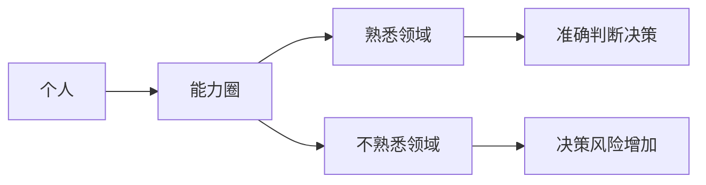

# 沃伦·巴菲特的Circle of Competence理论

> 关键词：沃伦·巴菲特、Circle of Competence理论、投资、能力圈、风险管理、决策、商业智慧

> 摘要：本文深入探讨沃伦·巴菲特的Circle of Competence（能力圈）理论。从该理论的背景出发，阐述其核心概念与原理，详细剖析其在投资及商业决策中的应用算法和数学逻辑。通过项目实战案例展示该理论在实际中的运用，介绍其实际应用场景，推荐相关的学习资源、开发工具和论文著作。最后总结该理论的未来发展趋势与挑战，解答常见问题并提供扩展阅读与参考资料，旨在帮助读者全面理解和运用这一具有深远影响的投资与决策理论。

## 1. 背景介绍 
### 1.1 目的和范围
沃伦·巴菲特作为全球著名的投资大师，其投资理念和方法对全球投资者产生了深远影响。Circle of Competence理论是巴菲特投资哲学的重要组成部分，理解和运用这一理论有助于投资者做出更明智的投资决策，降低风险，提高投资回报率。本文的目的在于全面、深入地解析这一理论，不仅探讨其在投资领域的应用，还将其拓展到更广泛的商业决策场景中，帮助读者掌握这一理论的核心要点和实际应用方法。

### 1.2 预期读者
本文预期读者包括投资者、金融从业者、商业决策者、创业者以及对投资和商业决策理论感兴趣的人士。无论是初学者希望了解基本的投资理念，还是有一定经验的专业人士寻求进一步优化决策方法，都能从本文中获得有价值的信息。

### 1.3 文档结构概述
本文首先介绍沃伦·巴菲特的Circle of Competence理论的背景，包括其目的、预期读者和文档结构概述，以及相关术语的定义和解释。接着阐述该理论的核心概念与联系，通过文本示意图和Mermaid流程图进行直观展示。然后详细讲解核心算法原理和具体操作步骤，结合Python源代码进行说明。再介绍该理论涉及的数学模型和公式，并举例说明。通过项目实战案例，介绍开发环境搭建、源代码实现和代码解读。之后探讨该理论的实际应用场景，推荐相关的工具和资源，包括学习资源、开发工具框架和论文著作。最后总结该理论的未来发展趋势与挑战，解答常见问题并提供扩展阅读与参考资料。

### 1.4 术语表
#### 1.4.1 核心术语定义
- **Circle of Competence（能力圈）**：指一个人在特定领域内所具备的知识、技能和经验的集合，在这个范围内，个人能够做出相对准确的判断和决策。
- **投资**：指为了获取未来收益而投入资金或其他资源的行为。
- **风险管理**：指识别、评估和应对风险的过程，旨在降低风险对目标实现的影响。
- **决策**：指在多个可选方案中选择一个最优方案的过程。

#### 1.4.2 相关概念解释
- **投资哲学**：指投资者在投资过程中所遵循的基本理念和原则，它指导投资者的投资行为和决策。
- **商业智慧**：指在商业活动中所运用的智慧和判断力，包括对市场、竞争、消费者等因素的理解和把握。

#### 1.4.3 缩略词列表
暂无

## 2. 核心概念与联系 

### 核心概念原理
Circle of Competence理论的核心原理是每个人都有自己的能力边界，在这个边界内，我们对事物有更深入的理解和认识，能够做出更准确的判断和决策。而超出这个边界，我们的认知和判断能力就会受到限制，决策失误的风险就会增加。巴菲特认为，投资者应该专注于自己的能力圈，只投资那些自己真正了解和熟悉的领域和公司，避免涉足自己不熟悉的领域，这样才能降低投资风险，提高投资成功率。

### 架构的文本示意图
我们可以将能力圈想象成一个以个人为中心的圆形区域。圆心代表个人，圆的半径代表个人在各个领域的知识、技能和经验的深度和广度。圆内的区域就是个人的能力圈，在这个区域内，个人对事物有清晰的认识和理解，能够做出明智的决策。圆外的区域则是个人不熟悉的领域，在这个区域内，个人的决策往往缺乏足够的依据，风险较大。

### Mermaid 流程图


## 3. 核心算法原理 & 具体操作步骤 

### 核心算法原理
Circle of Competence理论的核心算法可以理解为一个筛选和评估的过程。首先，个人需要确定自己的能力圈范围，这可以通过对自己的知识、技能和经验进行梳理和分析来实现。然后，对于每一个投资或决策机会，需要判断它是否在自己的能力圈范围内。如果在能力圈范围内，就可以进一步进行深入的分析和评估；如果不在能力圈范围内，就应该谨慎对待，甚至放弃。

### 具体操作步骤

#### 步骤1：确定能力圈范围
以下是一个简单的Python代码示例，用于帮助我们梳理自己在不同领域的知识和技能，从而确定能力圈范围。

```python
# 定义领域列表
domains = ["金融", "科技", "医疗", "消费", "能源"]

# 定义每个领域的知识和技能评估分数（0 - 10分）
knowledge_scores = {
    "金融": 8,
    "科技": 6,
    "医疗": 3,
    "消费": 7,
    "能源": 4
}

# 设定能力圈的阈值
threshold = 6

# 筛选出在能力圈范围内的领域
circle_of_competence = []
for domain, score in knowledge_scores.items():
    if score >= threshold:
        circle_of_competence.append(domain)

print("能力圈范围内的领域：", circle_of_competence)
```

#### 步骤2：评估投资或决策机会
对于一个具体的投资或决策机会，需要判断它所属的领域是否在自己的能力圈范围内。以下是一个简单的判断函数：

```python
def is_in_circle_of_competence(opportunity_domain, circle_of_competence):
    return opportunity_domain in circle_of_competence

# 示例：假设有一个投资机会，领域为“金融”
opportunity_domain = "金融"
result = is_in_circle_of_competence(opportunity_domain, circle_of_competence)
print(f"该投资机会是否在能力圈内：{result}")
```

#### 步骤3：深入分析和评估
如果投资或决策机会在能力圈范围内，就可以进行深入的分析和评估。这可能涉及到对相关公司的财务状况、市场前景、竞争优势等方面的分析。以下是一个简单的示例，用于评估一个公司的财务状况：

```python
# 定义一个公司类
class Company:
    def __init__(self, revenue, profit, debt):
        self.revenue = revenue
        self.profit = profit
        self.debt = debt

    def financial_health(self):
        # 简单的财务健康评估指标：利润率和资产负债率
        profit_margin = self.profit / self.revenue
        debt_ratio = self.debt / self.revenue
        if profit_margin > 0.1 and debt_ratio < 0.5:
            return "财务状况良好"
        else:
            return "财务状况有待改善"

# 示例：创建一个公司对象
company = Company(1000000, 200000, 300000)
print("公司财务状况：", company.financial_health())
```

## 4. 数学模型和公式 & 详细讲解 & 举例说明 

### 数学模型和公式
在Circle of Competence理论中，虽然没有严格意义上的数学模型和公式，但可以用一些简单的数学概念来辅助理解和决策。

#### 风险评估公式
我们可以用风险概率 $P$ 来评估一个投资或决策机会的风险程度。风险概率 $P$ 可以根据机会是否在能力圈范围内以及其他相关因素来确定。假设在能力圈范围内的机会风险概率为 $P_1$，不在能力圈范围内的机会风险概率为 $P_2$，且 $P_2 > P_1$。

$$P = 
\begin{cases}
P_1, & \text{机会在能力圈范围内} \\
P_2, & \text{机会不在能力圈范围内}
\end{cases}$$

#### 预期收益公式
预期收益 $E$ 可以通过投资金额 $A$、预期收益率 $r$ 和风险调整系数 $\alpha$ 来计算。风险调整系数 $\alpha$ 与风险概率 $P$ 相关，风险概率越高，风险调整系数越小。

$$E = A \times r \times \alpha$$

### 详细讲解
风险评估公式表明，在能力圈范围内的投资或决策机会风险相对较低，而超出能力圈范围的机会风险较高。预期收益公式则考虑了风险因素对预期收益的影响，风险越高，预期收益越低。

### 举例说明
假设我们有两个投资机会，投资金额均为 $A = 100000$ 元。机会1在我们的能力圈范围内，预期收益率 $r_1 = 0.1$，风险概率 $P_1 = 0.2$，对应的风险调整系数 $\alpha_1 = 0.9$；机会2不在我们的能力圈范围内，预期收益率 $r_2 = 0.15$，风险概率 $P_2 = 0.5$，对应的风险调整系数 $\alpha_2 = 0.6$。

对于机会1：
$$E_1 = A \times r_1 \times \alpha_1 = 100000 \times 0.1 \times 0.9 = 9000$$

对于机会2：
$$E_2 = A \times r_2 \times \alpha_2 = 100000 \times 0.15 \times 0.6 = 9000$$

虽然机会2的预期收益率较高，但由于其风险较高，经过风险调整后的预期收益与机会1相同。在这种情况下，我们应该更倾向于选择机会1，因为它在我们的能力圈范围内，风险相对可控。

## 5. 项目实战：代码实际案例和详细解释说明 

### 5.1  开发环境搭建
本项目实战使用Python进行开发，需要安装Python开发环境。可以从Python官方网站（https://www.python.org/downloads/） 下载并安装Python解释器。安装完成后，可以使用任何文本编辑器或集成开发环境（IDE）来编写和运行Python代码，例如PyCharm、VS Code等。

### 5.2  源代码详细实现和代码解读

#### 项目背景
假设我们是一名投资者，想要通过Circle of Competence理论来筛选股票投资机会。我们有一个股票列表，每个股票都有其所属的行业和一些基本的财务数据。我们需要先确定自己的能力圈范围，然后筛选出在能力圈范围内的股票，并对这些股票进行财务分析。

#### 源代码实现

```python
# 定义领域列表
domains = ["金融", "科技", "医疗", "消费", "能源"]

# 定义每个领域的知识和技能评估分数（0 - 10分）
knowledge_scores = {
    "金融": 8,
    "科技": 6,
    "医疗": 3,
    "消费": 7,
    "能源": 4
}

# 设定能力圈的阈值
threshold = 6

# 筛选出在能力圈范围内的领域
circle_of_competence = []
for domain, score in knowledge_scores.items():
    if score >= threshold:
        circle_of_competence.append(domain)

print("能力圈范围内的领域：", circle_of_competence)

# 定义股票类
class Stock:
    def __init__(self, name, industry, revenue, profit, debt):
        self.name = name
        self.industry = industry
        self.revenue = revenue
        self.profit = profit
        self.debt = debt

    def financial_health(self):
        # 简单的财务健康评估指标：利润率和资产负债率
        profit_margin = self.profit / self.revenue
        debt_ratio = self.debt / self.revenue
        if profit_margin > 0.1 and debt_ratio < 0.5:
            return "财务状况良好"
        else:
            return "财务状况有待改善"

# 定义股票列表
stocks = [
    Stock("股票A", "金融", 1000000, 200000, 300000),
    Stock("股票B", "科技", 800000, 150000, 200000),
    Stock("股票C", "医疗", 600000, 80000, 350000),
    Stock("股票D", "消费", 1200000, 250000, 400000),
    Stock("股票E", "能源", 900000, 120000, 450000)
]

# 筛选出在能力圈范围内的股票
selected_stocks = []
for stock in stocks:
    if stock.industry in circle_of_competence:
        selected_stocks.append(stock)

print("在能力圈范围内的股票：")
for stock in selected_stocks:
    print(f"股票名称：{stock.name}，行业：{stock.industry}，财务状况：{stock.financial_health()}")
```

#### 代码解读
1. **确定能力圈范围**：通过对各个领域的知识和技能评估分数进行筛选，确定能力圈范围内的领域。
2. **定义股票类**：定义一个 `Stock` 类，用于表示股票，包含股票名称、行业、收入、利润和债务等属性，以及一个 `financial_health` 方法，用于评估股票的财务状况。
3. **定义股票列表**：创建一个股票列表，包含多个股票对象。
4. **筛选股票**：遍历股票列表，筛选出所属行业在能力圈范围内的股票。
5. **输出结果**：输出在能力圈范围内的股票名称、行业和财务状况。

### 5.3  代码解读与分析
通过上述代码，我们可以看到如何运用Circle of Competence理论来筛选股票投资机会。首先确定自己的能力圈范围，然后只关注在能力圈范围内的股票，这样可以降低投资风险。同时，通过对股票的财务状况进行评估，可以进一步筛选出财务状况良好的股票，提高投资成功率。

## 6. 实际应用场景 
### 投资领域
在投资领域，Circle of Competence理论具有重要的应用价值。投资者可以根据自己的能力圈范围，选择投资那些自己熟悉的行业和公司，避免盲目跟风和投资自己不了解的领域。例如，一个对金融行业有深入了解的投资者，可以专注于投资银行、证券、保险等金融类股票，而对于一些新兴的科技行业，如果自己缺乏相关的知识和经验，就应该谨慎投资。

### 商业决策领域
在商业决策中，Circle of Competence理论同样适用。企业管理者在制定战略、选择业务方向和合作伙伴时，应该考虑自己的能力圈范围。例如，一个传统制造业企业，如果要进入互联网领域开展业务，就需要谨慎评估自己是否具备相关的技术、人才和市场资源。如果超出了自己的能力圈范围，可能会面临较大的风险。

### 创业领域
创业者在选择创业项目时，也应该遵循Circle of Competence理论。选择自己熟悉和擅长的领域创业，可以充分发挥自己的优势，提高创业成功的概率。例如，一个有多年餐饮行业经验的创业者，选择开一家餐厅可能比进入一个完全陌生的行业更容易取得成功。

## 7. 工具和资源推荐
### 7.1 学习资源推荐
#### 7.1.1 书籍推荐
- 《巴菲特致股东的信：股份公司教程》：这本书收录了巴菲特多年来致股东的信，全面阐述了他的投资理念和方法，其中包括Circle of Competence理论的相关内容。
- 《聪明的投资者》：本杰明·格雷厄姆的经典著作，是价值投资的奠基之作，对巴菲特的投资理念产生了深远影响，书中也涉及到能力圈等相关概念。

#### 7.1.2 在线课程
- Coursera上的“投资学原理”课程：该课程系统地介绍了投资学的基本原理和方法，其中包括一些关于投资决策和风险管理的内容，有助于理解Circle of Competence理论在投资中的应用。
- edX上的“商业决策分析”课程：该课程主要讲解商业决策的方法和技巧，涉及到如何在决策中考虑自身的能力和优势，与Circle of Competence理论相关。

#### 7.1.3 技术博客和网站
- 雪球网：一个专注于投资交流的社区，有很多投资者分享自己的投资经验和见解，其中不乏对巴菲特投资理念和Circle of Competence理论的讨论。
- 价值投资网：该网站提供了丰富的价值投资相关的文章和资料，对理解Circle of Competence理论和价值投资理念有很大帮助。

### 7.2 开发工具框架推荐
#### 7.2.1 IDE和编辑器
- PyCharm：一款专业的Python集成开发环境，提供了丰富的功能和插件，适合开发和调试Python代码。
- VS Code：一款轻量级的代码编辑器，支持多种编程语言，通过安装相关插件可以方便地进行Python开发。

#### 7.2.2 调试和性能分析工具
- pdb：Python自带的调试工具，可以帮助开发者逐步调试代码，查找问题。
- cProfile：Python的性能分析工具，可以分析代码的执行时间和性能瓶颈。

#### 7.2.3 相关框架和库
- Pandas：一个强大的数据处理和分析库，可用于处理和分析股票等金融数据。
- Numpy：一个用于科学计算的库，提供了高效的数组操作和数学函数。

### 7.3 相关论文著作推荐
#### 7.3.1 经典论文
- “The Superinvestors of Graham-and-Doddsville” by Warren Buffett：巴菲特的经典论文，介绍了格雷厄姆和多德的价值投资理念以及一些成功的投资者案例，体现了能力圈等投资思想。

#### 7.3.2 最新研究成果
- 一些关于行为金融学和投资决策的最新研究成果，探讨了投资者的认知偏差和能力圈对投资决策的影响。

#### 7.3.3 应用案例分析
- 一些关于企业战略决策和投资案例的分析报告，通过实际案例展示了Circle of Competence理论在不同场景下的应用和效果。

## 8. 总结：未来发展趋势与挑战
### 未来发展趋势
- **跨领域融合**：随着科技的发展和社会的进步，不同领域之间的界限越来越模糊，未来的能力圈可能不再局限于单一领域，而是需要跨领域的知识和技能。投资者和决策者需要不断拓展自己的能力圈，以适应这种变化。
- **数据驱动**：在大数据时代，数据将成为决策的重要依据。未来的能力圈理论可能会与数据分析和人工智能技术相结合，通过对大量数据的分析和挖掘，更准确地评估自己的能力圈范围和投资机会的风险与收益。
- **全球化**：全球化的发展使得投资和商业活动的范围越来越广泛，投资者和决策者需要考虑全球市场的因素。能力圈理论也需要在全球化的背景下进行拓展和应用，以适应不同国家和地区的市场环境。

### 挑战
- **知识更新速度快**：科技的快速发展使得知识更新换代的速度越来越快，投资者和决策者需要不断学习和更新自己的知识，以保持自己的能力圈优势。这对个人的学习能力和时间管理能力提出了更高的要求。
- **信息过载**：在信息爆炸的时代，大量的信息可能会干扰投资者和决策者的判断。如何从海量的信息中筛选出有价值的信息，准确判断自己的能力圈范围和投资机会，是一个面临的挑战。
- **心理因素影响**：投资者和决策者的心理因素，如贪婪、恐惧、过度自信等，可能会影响他们对能力圈的判断和决策。如何克服这些心理因素的影响，保持理性和冷静，是应用能力圈理论的关键。

## 9. 附录：常见问题与解答
### 问题1：如何准确确定自己的能力圈范围？
答：确定自己的能力圈范围需要对自己的知识、技能和经验进行全面的梳理和分析。可以通过回顾自己的学习和工作经历，评估自己在各个领域的专业水平和实践经验。也可以参考他人的意见和建议，如请教行业专家、同事和朋友等。同时，要不断学习和实践，拓展自己的能力圈范围。

### 问题2：如果遇到一个投资机会，虽然不在自己的能力圈范围内，但看起来很有吸引力，应该怎么办？
答：在这种情况下，应该谨慎对待。首先，可以尝试学习相关领域的知识，了解该投资机会的基本情况和风险。如果在学习过程中发现自己能够掌握相关知识和技能，并且对该投资机会有足够的了解和信心，可以考虑适当参与。但如果经过学习仍然觉得自己无法把握该投资机会，就应该果断放弃，避免盲目投资。

### 问题3：能力圈是固定不变的吗？
答：不是的。能力圈是一个动态的概念，会随着个人的学习和实践不断变化。随着知识和经验的积累，个人的能力圈范围会逐渐扩大；而如果长时间不学习和实践，能力圈范围可能会缩小。因此，要不断学习和提升自己，保持能力圈的动态优化。

## 10. 扩展阅读 & 参考资料
### 扩展阅读
- 《穷查理宝典：查理·芒格的智慧箴言录》：查理·芒格是巴菲特的长期合作伙伴，他的投资理念和智慧对巴菲特产生了重要影响，这本书可以帮助读者更深入地了解价值投资和能力圈理论。
- 《投资最重要的事》：霍华德·马克斯的著作，书中阐述了投资中的一些重要原则和方法，与巴菲特的投资理念有很多相似之处，对理解能力圈理论也有一定的帮助。

### 参考资料
- Warren Buffett's annual letters to shareholders.
- Benjamin Graham, “The Intelligent Investor”.
- Coursera and edX online courses related to investment and business decision - making.
- Articles and discussions on Xueqiu and Value Investment websites. 