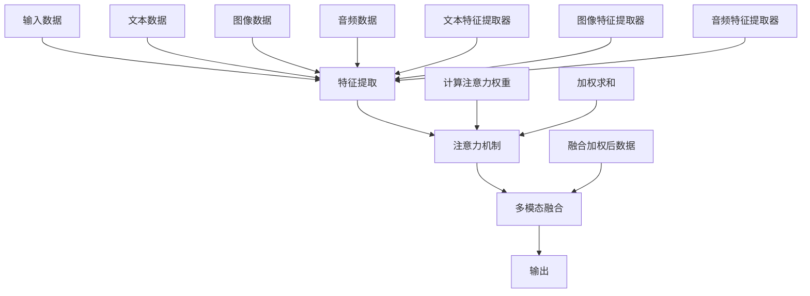

# 注意力机制在多模态融合中的创新

> 关键词：注意力机制、多模态融合、深度学习、特征提取、信息交互

> 摘要：本文围绕注意力机制在多模态融合中的创新展开深入探讨。首先介绍了多模态融合以及注意力机制的背景知识，明确研究的目的和范围、预期读者等。接着详细阐述了注意力机制与多模态融合的核心概念及联系，通过文本示意图和 Mermaid 流程图清晰展示其原理和架构。然后深入讲解了核心算法原理，结合 Python 源代码进行具体操作步骤的说明，并给出相关数学模型和公式及举例。通过项目实战，展示代码实际案例并进行详细解释说明。探讨了注意力机制在多模态融合中的实际应用场景，推荐了相关的工具和资源。最后总结未来发展趋势与挑战，列出常见问题与解答以及扩展阅读和参考资料，旨在为该领域的研究和实践提供全面而深入的技术指导。

## 1. 背景介绍 
### 1.1 目的和范围
在当今的信息时代，数据呈现出多样化的模态，如文本、图像、音频等。多模态融合旨在将不同模态的数据进行整合，以获取更全面、更准确的信息。然而，不同模态的数据具有不同的特征和表示方式，如何有效地融合这些数据成为了一个关键问题。注意力机制作为一种强大的技术，能够帮助模型自动地关注不同模态数据中的重要部分，从而提高多模态融合的效果。本文的目的在于深入探讨注意力机制在多模态融合中的创新应用，范围涵盖了注意力机制的原理、多模态融合的方法、相关算法和实际应用场景等方面。

### 1.2 预期读者
本文预期读者包括人工智能、机器学习、计算机视觉、自然语言处理等领域的研究人员、工程师和学生。对于希望深入了解注意力机制和多模态融合技术的专业人士，以及对相关领域感兴趣的初学者，本文都具有一定的参考价值。

### 1.3 文档结构概述
本文将按照以下结构进行组织：首先介绍背景知识，包括目的、预期读者和文档结构概述；接着阐述注意力机制与多模态融合的核心概念及联系，通过示意图和流程图进行直观展示；然后讲解核心算法原理和具体操作步骤，结合 Python 代码进行详细说明；再给出相关的数学模型和公式，并进行举例说明；通过项目实战展示代码实际案例并进行解释；探讨实际应用场景；推荐相关的工具和资源；最后总结未来发展趋势与挑战，列出常见问题与解答以及扩展阅读和参考资料。

### 1.4 术语表
#### 1.4.1 核心术语定义
- **注意力机制**：一种模仿人类注意力的机制，能够在处理数据时自动地关注重要部分，忽略不重要部分。
- **多模态融合**：将不同模态的数据（如文本、图像、音频等）进行整合，以获取更全面、更准确的信息。
- **特征提取**：从原始数据中提取出具有代表性的特征。
- **信息交互**：不同模态数据之间的信息交流和共享。

#### 1.4.2 相关概念解释
- **深度学习**：一种基于人工神经网络的机器学习方法，能够自动地从大量数据中学习特征和模式。
- **模态**：数据的不同表现形式，如文本、图像、音频等。
- **融合策略**：用于将不同模态数据进行融合的方法和规则。

#### 1.4.3 缩略词列表
- **CNN**：Convolutional Neural Network，卷积神经网络
- **RNN**：Recurrent Neural Network，循环神经网络
- **LSTM**：Long Short-Term Memory，长短期记忆网络
- **Transformer**：一种基于注意力机制的深度学习模型

## 2. 核心概念与联系 
### 核心概念原理
#### 注意力机制原理
注意力机制的核心思想是模仿人类的注意力，在处理数据时能够自动地关注重要部分，忽略不重要部分。具体来说，注意力机制通过计算输入数据的权重，将这些权重应用到输入数据上，从而突出重要部分。在深度学习中，注意力机制通常通过一个注意力函数来实现，该函数接受输入数据和查询向量作为输入，输出一个权重分布，然后将这个权重分布应用到输入数据上。

#### 多模态融合原理
多模态融合的目标是将不同模态的数据进行整合，以获取更全面、更准确的信息。多模态融合的方法可以分为早期融合、中期融合和晚期融合。早期融合是在特征提取之前将不同模态的数据进行拼接；中期融合是在特征提取过程中进行融合；晚期融合是在特征提取之后将不同模态的特征进行融合。

### 架构的文本示意图
```plaintext
输入数据：
|-- 文本数据
|-- 图像数据
|-- 音频数据

特征提取：
|-- 文本特征提取器（如 RNN、Transformer）
|-- 图像特征提取器（如 CNN）
|-- 音频特征提取器（如 LSTM）

注意力机制：
|-- 计算不同模态数据的注意力权重
|-- 根据注意力权重对不同模态数据进行加权求和

多模态融合：
|-- 将加权后的不同模态数据进行融合
|-- 得到融合后的特征

输出：
|-- 基于融合后的特征进行任务预测（如分类、回归等）
```

### Mermaid 流程图


## 3. 核心算法原理 & 具体操作步骤 
### 核心算法原理
#### 注意力机制算法原理
常见的注意力机制包括点积注意力和多头注意力。点积注意力的计算过程如下：
1. 计算查询向量 $Q$、键向量 $K$ 和值向量 $V$。
2. 计算注意力分数 $scores = \frac{QK^T}{\sqrt{d_k}}$，其中 $d_k$ 是键向量的维度。
3. 对注意力分数进行 softmax 操作，得到注意力权重 $weights = softmax(scores)$。
4. 将注意力权重应用到值向量上，得到加权和 $output = weightsV$。

多头注意力是在点积注意力的基础上，通过多个头并行地计算注意力，然后将结果拼接起来。

#### 多模态融合算法原理
多模态融合的算法可以根据融合的阶段分为早期融合、中期融合和晚期融合。早期融合是将不同模态的数据直接拼接在一起，然后进行特征提取和后续处理；中期融合是在特征提取过程中，通过一些特定的方法将不同模态的特征进行融合；晚期融合是在特征提取之后，将不同模态的特征进行拼接或加权求和。

### 具体操作步骤
#### 注意力机制的具体操作步骤
以下是使用 Python 和 PyTorch 实现点积注意力的代码：
```python
import torch
import torch.nn as nn
import torch.nn.functional as F

class DotProductAttention(nn.Module):
    def __init__(self, d_k):
        super(DotProductAttention, self).__init__()
        self.d_k = d_k

    def forward(self, Q, K, V):
        scores = torch.matmul(Q, K.transpose(-2, -1)) / torch.sqrt(torch.tensor(self.d_k, dtype=torch.float32))
        weights = F.softmax(scores, dim=-1)
        output = torch.matmul(weights, V)
        return output

# 示例使用
d_k = 64
Q = torch.randn(32, 10, d_k)  # 批次大小为 32，序列长度为 10，特征维度为 64
K = torch.randn(32, 10, d_k)
V = torch.randn(32, 10, d_k)

attention = DotProductAttention(d_k)
output = attention(Q, K, V)
print(output.shape)  # 输出形状为 (32, 10, 64)
```
#### 多模态融合的具体操作步骤
以下是一个简单的晚期融合示例，将文本特征和图像特征进行拼接：
```python
import torch
import torch.nn as nn

class LateFusion(nn.Module):
    def __init__(self, text_dim, image_dim, output_dim):
        super(LateFusion, self).__init__()
        self.fc = nn.Linear(text_dim + image_dim, output_dim)

    def forward(self, text_features, image_features):
        fused_features = torch.cat((text_features, image_features), dim=-1)
        output = self.fc(fused_features)
        return output

# 示例使用
text_dim = 128
image_dim = 256
output_dim = 512

text_features = torch.randn(32, text_dim)  # 批次大小为 32，文本特征维度为 128
image_features = torch.randn(32, image_dim)

late_fusion = LateFusion(text_dim, image_dim, output_dim)
output = late_fusion(text_features, image_features)
print(output.shape)  # 输出形状为 (32, 512)
```

## 4. 数学模型和公式 & 详细讲解 & 举例说明 
### 注意力机制的数学模型和公式
#### 点积注意力公式
点积注意力的计算公式如下：
$$Attention(Q, K, V) = softmax(\frac{QK^T}{\sqrt{d_k}})V$$
其中，$Q$ 是查询向量，$K$ 是键向量，$V$ 是值向量，$d_k$ 是键向量的维度。

#### 多头注意力公式
多头注意力的计算公式如下：
$$MultiHead(Q, K, V) = Concat(head_1, \cdots, head_h)W^O$$
其中，$head_i = Attention(QW_i^Q, KW_i^K, VW_i^V)$，$W_i^Q$、$W_i^K$、$W_i^V$ 是可学习的权重矩阵，$W^O$ 是输出的权重矩阵。

### 详细讲解
#### 点积注意力讲解
点积注意力通过计算查询向量和键向量的点积，得到注意力分数。然后对注意力分数进行 softmax 操作，得到注意力权重。最后将注意力权重应用到值向量上，得到加权和。$\frac{1}{\sqrt{d_k}}$ 是为了防止点积过大，导致 softmax 函数的梯度消失。

#### 多头注意力讲解
多头注意力通过多个头并行地计算注意力，每个头可以关注不同的信息。然后将多个头的结果拼接起来，再通过一个线性变换得到最终的输出。这样可以提高模型的表达能力。

### 举例说明
假设我们有一个文本序列，每个词的特征维度为 64，序列长度为 10。查询向量 $Q$、键向量 $K$ 和值向量 $V$ 的形状都是 $(10, 64)$。则注意力分数的形状为 $(10, 10)$，注意力权重的形状也为 $(10, 10)$，加权和的形状为 $(10, 64)$。

## 5. 项目实战：代码实际案例和详细解释说明 
### 5.1  开发环境搭建
#### 安装 Python
首先需要安装 Python，可以从 Python 官方网站（https://www.python.org/downloads/） 下载并安装适合自己操作系统的 Python 版本。建议使用 Python 3.6 及以上版本。

#### 安装 PyTorch
PyTorch 是一个广泛使用的深度学习框架，可以通过以下命令安装：
```bash
pip install torch torchvision
```

#### 安装其他依赖库
还需要安装一些其他的依赖库，如 numpy、matplotlib 等，可以使用以下命令安装：
```bash
pip install numpy matplotlib
```

### 5.2  源代码详细实现和代码解读
#### 项目概述
本项目的目标是实现一个基于注意力机制的多模态情感分类模型，使用文本和图像数据进行情感分类。

#### 数据准备
首先需要准备文本和图像数据，并进行预处理。以下是一个简单的数据加载和预处理的代码示例：
```python
import torch
from torch.utils.data import Dataset, DataLoader
from torchvision import transforms
from PIL import Image
import pandas as pd

class MultiModalDataset(Dataset):
    def __init__(self, csv_file, root_dir, transform=None):
        self.dataframe = pd.read_csv(csv_file)
        self.root_dir = root_dir
        self.transform = transform

    def __len__(self):
        return len(self.dataframe)

    def __getitem__(self, idx):
        if torch.is_tensor(idx):
            idx = idx.tolist()

        image_path = self.root_dir + self.dataframe.iloc[idx, 0]
        image = Image.open(image_path).convert('RGB')
        text = self.dataframe.iloc[idx, 1]
        label = self.dataframe.iloc[idx, 2]

        if self.transform:
            image = self.transform(image)

        return image, text, label

# 数据预处理
transform = transforms.Compose([
    transforms.Resize((224, 224)),
    transforms.ToTensor(),
    transforms.Normalize(mean=[0.485, 0.456, 0.406], std=[0.229, 0.224, 0.225])
])

# 加载数据集
dataset = MultiModalDataset(csv_file='data.csv', root_dir='images/', transform=transform)
dataloader = DataLoader(dataset, batch_size=32, shuffle=True)
```

#### 模型定义
以下是一个基于注意力机制的多模态情感分类模型的定义：
```python
import torch.nn as nn
import torch.nn.functional as F
from transformers import BertModel

class MultiModalModel(nn.Module):
    def __init__(self, text_dim, image_dim, hidden_dim, num_classes):
        super(MultiModalModel, self).__init__()
        self.bert = BertModel.from_pretrained('bert-base-uncased')
        self.image_fc = nn.Linear(image_dim, hidden_dim)
        self.text_fc = nn.Linear(text_dim, hidden_dim)
        self.attention = DotProductAttention(hidden_dim)
        self.fc = nn.Linear(hidden_dim, num_classes)

    def forward(self, image, text):
        text_output = self.bert(text)[1]
        text_features = self.text_fc(text_output)
        image_features = self.image_fc(image)

        Q = text_features.unsqueeze(1)
        K = image_features.unsqueeze(1)
        V = image_features.unsqueeze(1)

        attention_output = self.attention(Q, K, V).squeeze(1)
        fused_features = text_features + attention_output

        output = self.fc(fused_features)
        return output

# 初始化模型
text_dim = 768
image_dim = 2048
hidden_dim = 512
num_classes = 2

model = MultiModalModel(text_dim, image_dim, hidden_dim, num_classes)
```

#### 训练模型
以下是训练模型的代码：
```python
import torch.optim as optim

criterion = nn.CrossEntropyLoss()
optimizer = optim.Adam(model.parameters(), lr=0.001)

num_epochs = 10
for epoch in range(num_epochs):
    running_loss = 0.0
    for images, texts, labels in dataloader:
        optimizer.zero_grad()

        outputs = model(images, texts)
        loss = criterion(outputs, labels)
        loss.backward()
        optimizer.step()

        running_loss += loss.item()

    print(f'Epoch {epoch + 1}, Loss: {running_loss / len(dataloader)}')
```

### 5.3  代码解读与分析
#### 数据加载和预处理
`MultiModalDataset` 类用于加载文本和图像数据，并进行预处理。`transform` 用于对图像进行缩放、归一化等操作。

#### 模型定义
`MultiModalModel` 类定义了一个基于注意力机制的多模态情感分类模型。使用 BERT 模型提取文本特征，使用全连接层提取图像特征。然后使用注意力机制计算文本和图像特征之间的注意力权重，将加权后的图像特征和文本特征相加，得到融合后的特征。最后通过一个全连接层进行分类。

#### 训练模型
使用交叉熵损失函数和 Adam 优化器进行模型训练。在每个 epoch 中，遍历数据集，计算损失并进行反向传播和参数更新。

## 6. 实际应用场景 
### 智能安防
在智能安防领域，多模态融合可以结合视频监控（图像模态）和音频监控（音频模态）的数据。注意力机制可以帮助模型自动关注视频中的异常行为和音频中的异常声音，提高安防系统的准确性和可靠性。例如，在公共场所的监控中，通过对人员的动作、表情和声音的综合分析，及时发现潜在的安全隐患。

### 智能医疗
在智能医疗领域，多模态融合可以结合医学影像（如图像模态的 X 光、CT 等）和临床文本（文本模态的病历、诊断报告等）的数据。注意力机制可以帮助医生和模型更准确地关注影像中的病变部位和文本中的关键信息，提高疾病诊断的准确性。例如，在肺癌诊断中，结合肺部 CT 图像和患者的病历信息，通过注意力机制突出关键特征，辅助医生进行诊断。

### 智能交通
在智能交通领域，多模态融合可以结合摄像头图像（图像模态）和雷达数据（信号模态）。注意力机制可以帮助自动驾驶系统更好地关注道路上的交通标志、车辆和行人，提高自动驾驶的安全性和可靠性。例如，在自动驾驶汽车中，通过对图像和雷达数据的融合分析，及时做出决策，避免碰撞事故。

### 智能教育
在智能教育领域，多模态融合可以结合学生的学习记录（文本模态）、面部表情（图像模态）和语音（音频模态）等数据。注意力机制可以帮助教师和教育系统更好地关注学生的学习状态和需求，提供个性化的学习方案。例如，通过分析学生的面部表情和语音，判断学生的学习情绪和理解程度，及时调整教学策略。

## 7. 工具和资源推荐
### 7.1 学习资源推荐
#### 7.1.1 书籍推荐
- 《深度学习》（Deep Learning）：由 Ian Goodfellow、Yoshua Bengio 和 Aaron Courville 编写，是深度学习领域的经典教材，全面介绍了深度学习的理论和实践。
- 《Python 深度学习》（Deep Learning with Python）：由 Francois Chollet 编写，结合 Keras 框架，介绍了深度学习的基本概念和应用。
- 《动手学深度学习》（Dive into Deep Learning）：由 Aston Zhang、Zack C. Lipton、Mu Li 和 Alexander J. Smola 编写，提供了丰富的代码示例和实践项目，适合初学者学习。

#### 7.1.2 在线课程
- Coursera 上的《深度学习专项课程》（Deep Learning Specialization）：由 Andrew Ng 教授授课，包括深度学习的基础知识、卷积神经网络、循环神经网络等内容。
- edX 上的《使用 PyTorch 进行深度学习》（Introduction to Deep Learning with PyTorch）：介绍了 PyTorch 框架的使用和深度学习的基本概念。
- 哔哩哔哩上的一些深度学习教学视频：有很多优秀的博主分享深度学习的知识和实践经验。

#### 7.1.3 技术博客和网站
- Medium：有很多关于深度学习、注意力机制和多模态融合的技术文章。
- arXiv：提供了最新的学术论文，包括注意力机制和多模态融合的研究成果。
- 机器之心：专注于人工智能领域的技术和产业资讯，有很多关于注意力机制和多模态融合的报道和分析。

### 7.2 开发工具框架推荐
#### 7.2.1 IDE和编辑器
- PyCharm：一款专业的 Python 集成开发环境，提供了丰富的代码编辑、调试和部署功能。
- Jupyter Notebook：一种交互式的开发环境，适合进行数据分析和模型实验。
- Visual Studio Code：一款轻量级的代码编辑器，支持多种编程语言和插件，适合快速开发和调试。

#### 7.2.2 调试和性能分析工具
- PyTorch Profiler：PyTorch 提供的性能分析工具，可以帮助开发者分析模型的性能瓶颈。
- TensorBoard：TensorFlow 提供的可视化工具，也可以用于 PyTorch 模型的可视化和性能分析。
- cProfile：Python 内置的性能分析工具，可以帮助开发者分析代码的性能。

#### 7.2.3 相关框架和库
- PyTorch：一个广泛使用的深度学习框架，提供了丰富的深度学习模型和工具。
- Transformers：Hugging Face 开发的一个自然语言处理库，提供了预训练的语言模型，如 BERT、GPT 等。
- torchvision：PyTorch 提供的计算机视觉库，包含了常用的图像数据集和模型。

### 7.3 相关论文著作推荐
#### 7.3.1 经典论文
- 《Attention Is All You Need》：提出了 Transformer 模型，是注意力机制领域的经典论文。
- 《Fusion of Text, Audio, and Visual Information in Spoken Language Systems》：介绍了多模态融合在口语系统中的应用。
- 《Multimodal Machine Learning: A Survey and Taxonomy》：对多模态机器学习进行了全面的综述和分类。

#### 7.3.2 最新研究成果
- 可以在 arXiv、ACM Digital Library、IEEE Xplore 等学术数据库中搜索关于注意力机制和多模态融合的最新研究论文。

#### 7.3.3 应用案例分析
- 可以参考一些学术会议和期刊上的应用案例分析，如 CVPR、ICCV、ACL 等会议，以及 Journal of Artificial Intelligence Research、Artificial Intelligence 等期刊。

## 8. 总结：未来发展趋势与挑战
### 未来发展趋势
#### 更复杂的多模态融合模型
未来的多模态融合模型将更加复杂，能够处理更多种类的模态数据，如视频、传感器数据等。同时，模型将更加注重不同模态数据之间的深层次交互和融合，以提高模型的性能和泛化能力。

#### 注意力机制的改进和创新
注意力机制将不断改进和创新，如引入自适应注意力、层次化注意力等，以更好地适应不同的任务和数据。同时，注意力机制将与其他技术相结合，如强化学习、生成对抗网络等，以提高模型的学习能力和创造力。

#### 多模态融合的应用拓展
多模态融合将在更多领域得到应用，如智能家居、智能金融、智能农业等。通过多模态融合，可以实现更加智能化、个性化的服务和决策。

### 挑战
#### 数据获取和标注
多模态数据的获取和标注是一个挑战。不同模态的数据来源不同，数据格式和质量也不同，需要进行大量的预处理和标注工作。同时，多模态数据的标注需要专业知识和经验，成本较高。

#### 计算资源和效率
多模态融合模型通常比较复杂，需要大量的计算资源和时间。如何提高模型的计算效率，减少计算资源的消耗，是一个需要解决的问题。

#### 跨模态语义理解
不同模态的数据具有不同的语义表示，如何实现跨模态的语义理解和信息交互，是多模态融合的核心问题之一。目前，虽然已经取得了一些进展，但仍然存在很多挑战。

## 9. 附录：常见问题与解答
### 问题 1：注意力机制和多模态融合有什么关系？
注意力机制可以帮助多模态融合模型自动地关注不同模态数据中的重要部分，从而提高多模态融合的效果。通过计算不同模态数据的注意力权重，可以将重要的信息进行加权求和，忽略不重要的信息。

### 问题 2：如何选择合适的多模态融合方法？
选择合适的多模态融合方法需要考虑数据的特点、任务的需求和模型的复杂度等因素。早期融合适用于数据特征比较简单的情况；中期融合可以在特征提取过程中进行信息交互；晚期融合适用于不同模态数据之间的关系比较复杂的情况。

### 问题 3：注意力机制在多模态融合中的计算复杂度高吗？
注意力机制的计算复杂度与输入数据的维度和序列长度有关。在实际应用中，可以通过一些优化方法，如稀疏注意力、低秩分解等，来降低计算复杂度。

### 问题 4：如何评估多模态融合模型的性能？
可以使用一些常用的评估指标，如准确率、召回率、F1 值等，来评估多模态融合模型的性能。同时，还可以通过可视化和案例分析等方法，来直观地评估模型的效果。

## 10. 扩展阅读 & 参考资料
### 扩展阅读
- 《Neural Machine Translation by Jointly Learning to Align and Translate》：介绍了注意力机制在神经机器翻译中的应用。
- 《Show, Attend and Tell: Neural Image Caption Generation with Visual Attention》：介绍了注意力机制在图像描述生成中的应用。

### 参考资料
- 相关学术论文和期刊文章
- 开源代码库，如 GitHub 上的相关项目
- 官方文档和教程，如 PyTorch、Transformers 等框架的官方文档