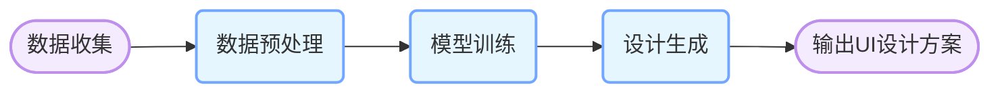

# 深度学习在自动化UI设计中的应用

> 关键词：深度学习、自动化UI设计、卷积神经网络、生成对抗网络、用户体验

> 摘要：本文深入探讨了深度学习在自动化UI设计中的应用。随着科技的飞速发展，UI设计的需求日益增长，传统的设计方式面临效率和创新性的挑战。深度学习技术的出现为自动化UI设计带来了新的机遇。文章详细介绍了深度学习的核心概念与相关算法原理，通过数学模型和公式进行理论阐述，并结合实际案例展示其在UI设计中的具体实现。同时，探讨了深度学习在不同实际应用场景中的表现，推荐了相关的学习资源、开发工具和论文著作。最后，对深度学习在自动化UI设计领域的未来发展趋势与挑战进行了总结和展望。

## 1. 背景介绍 
### 1.1 目的和范围
随着互联网和移动应用的快速发展，用户界面（UI）设计的重要性日益凸显。良好的UI设计不仅能够提升用户体验，还能增强产品的竞争力。然而，传统的UI设计方式往往需要设计师投入大量的时间和精力，且设计结果受到设计师个人经验和创意的限制。本文章的目的在于探讨深度学习技术如何应用于自动化UI设计，以提高设计效率、增强设计创新性，并扩大设计的可能性。范围涵盖深度学习在UI设计各个环节的应用，包括布局设计、色彩搭配、图标设计等。

### 1.2 预期读者
本文预期读者包括UI设计师、深度学习研究者、软件开发者以及对自动化设计和人工智能技术感兴趣的相关人员。对于UI设计师，希望能通过本文了解如何借助深度学习技术提升设计效率和质量；对于深度学习研究者，可从中探索深度学习在设计领域的新应用和研究方向；对于软件开发者，能获取在实际项目中实现自动化UI设计的技术思路和方法。

### 1.3 文档结构概述
本文将首先介绍深度学习和自动化UI设计的相关核心概念及其联系，包括原理和架构的文本示意图与Mermaid流程图。接着详细讲解深度学习的核心算法原理，并给出Python源代码示例及具体操作步骤。然后通过数学模型和公式对算法进行深入分析，并举例说明。之后通过项目实战展示深度学习在自动化UI设计中的实际应用，包括开发环境搭建、源代码实现和代码解读。再探讨深度学习在不同实际应用场景中的表现，推荐相关的学习资源、开发工具和论文著作。最后对深度学习在自动化UI设计领域的未来发展趋势与挑战进行总结，并提供常见问题与解答以及扩展阅读和参考资料。

### 1.4 术语表
#### 1.4.1 核心术语定义
- **深度学习（Deep Learning）**：是一类基于人工神经网络的机器学习技术，通过构建具有多个层次的神经网络模型，自动从大量数据中学习特征和模式。
- **自动化UI设计（Automated UI Design）**：利用计算机技术和算法自动生成用户界面设计的过程，减少人工干预，提高设计效率。
- **卷积神经网络（Convolutional Neural Network，CNN）**：一种专门用于处理具有网格结构数据（如图像）的深度学习模型，通过卷积层、池化层等操作提取数据特征。
- **生成对抗网络（Generative Adversarial Network，GAN）**：由生成器和判别器组成的深度学习模型，通过两者的对抗训练来生成新的数据。
- **用户体验（User Experience，UX）**：用户在使用产品或服务过程中的主观感受和体验，包括易用性、满意度等方面。

#### 1.4.2 相关概念解释
- **特征提取**：从原始数据中提取出具有代表性的特征，以便后续的分析和处理。在深度学习中，神经网络可以自动学习数据的特征。
- **训练（Training）**：通过将大量数据输入到神经网络模型中，调整模型的参数，使其能够准确地预测或生成所需的结果。
- **损失函数（Loss Function）**：用于衡量模型预测结果与真实结果之间的差异，训练过程中通过最小化损失函数来优化模型参数。

#### 1.4.3 缩略词列表
- **CNN**：Convolutional Neural Network（卷积神经网络）
- **GAN**：Generative Adversarial Network（生成对抗网络）
- **UX**：User Experience（用户体验）
- **UI**：User Interface（用户界面）

## 2. 核心概念与联系 
### 2.1 深度学习核心概念
深度学习是机器学习的一个分支，它基于人工神经网络，通过构建具有多个层次的神经网络模型，让计算机自动从大量数据中学习特征和模式。深度学习的核心在于神经网络的多层结构，每一层都对输入数据进行不同程度的抽象和转换，从而学习到数据的复杂特征。

常见的深度学习模型包括卷积神经网络（CNN）、循环神经网络（RNN）和生成对抗网络（GAN）等。其中，CNN主要用于处理具有网格结构的数据，如图像和音频；RNN适用于处理序列数据，如文本和时间序列数据；GAN则用于生成新的数据。

### 2.2 自动化UI设计核心概念
自动化UI设计是利用计算机技术和算法自动生成用户界面设计的过程。其目标是提高设计效率、降低设计成本，并提供多样化的设计方案。自动化UI设计可以涉及布局设计、色彩搭配、图标设计等多个方面。

在自动化UI设计中，通常需要考虑用户需求、用户体验和设计原则等因素。通过分析大量的设计数据和用户反馈，计算机可以学习到优秀的设计模式和规律，并应用这些知识来生成高质量的UI设计。

### 2.3 深度学习与自动化UI设计的联系
深度学习为自动化UI设计提供了强大的技术支持。通过深度学习模型，可以自动从大量的设计数据中学习到设计模式和规律，从而实现自动化的UI设计。例如，CNN可以用于图像识别和特征提取，帮助计算机理解设计元素的含义和布局；GAN可以用于生成新的设计方案，提供多样化的设计选择。

同时，自动化UI设计也为深度学习提供了丰富的应用场景和数据来源。通过实际的设计项目，深度学习模型可以不断地学习和优化，提高其在UI设计领域的性能和效果。

### 2.4 核心概念原理和架构的文本示意图
深度学习在自动化UI设计中的应用架构主要包括数据收集、数据预处理、模型训练和设计生成四个阶段。

1. **数据收集**：收集大量的UI设计数据，包括设计图片、布局信息、色彩搭配等。这些数据可以来自于公开的设计资源、用户反馈和实际项目。
2. **数据预处理**：对收集到的数据进行清洗、标注和特征提取等预处理操作，以便后续的模型训练。
3. **模型训练**：选择合适的深度学习模型，如CNN或GAN，将预处理后的数据输入到模型中进行训练。在训练过程中，通过调整模型的参数，使其能够准确地学习到设计模式和规律。
4. **设计生成**：使用训练好的模型生成新的UI设计方案。根据用户的需求和输入，模型可以自动生成布局、色彩搭配和图标等设计元素。

### 2.5 Mermaid流程图


## 3. 核心算法原理 & 具体操作步骤 
### 3.1 卷积神经网络（CNN）原理
卷积神经网络（CNN）是一种专门用于处理具有网格结构数据（如图像）的深度学习模型。其主要特点是通过卷积层、池化层和全连接层等操作，自动提取数据的特征。

#### 3.1.1 卷积层
卷积层是CNN的核心组成部分，它通过卷积核（滤波器）对输入数据进行卷积操作，提取数据的局部特征。卷积操作可以表示为：

$$y_{i,j}^k = \sum_{m=0}^{M-1} \sum_{n=0}^{N-1} x_{i+m,j+n} w_{m,n}^k + b^k$$

其中，$y_{i,j}^k$ 是卷积层输出特征图中第 $k$ 个通道在位置 $(i,j)$ 的值，$x$ 是输入数据，$w$ 是卷积核的权重，$b$ 是偏置项，$M$ 和 $N$ 是卷积核的大小。

#### 3.1.2 池化层
池化层用于降低特征图的维度，减少计算量，并增强模型的鲁棒性。常见的池化操作包括最大池化和平均池化。最大池化操作可以表示为：

$$y_{i,j}^k = \max_{m=0}^{M-1} \max_{n=0}^{N-1} x_{iM+m,jN+n}^k$$

其中，$y_{i,j}^k$ 是池化层输出特征图中第 $k$ 个通道在位置 $(i,j)$ 的值，$x$ 是输入特征图，$M$ 和 $N$ 是池化窗口的大小。

#### 3.1.3 全连接层
全连接层将卷积层和池化层提取的特征进行整合，输出最终的预测结果。全连接层的操作可以表示为：

$$y = \sigma(Wx + b)$$

其中，$y$ 是输出结果，$x$ 是输入特征，$W$ 是权重矩阵，$b$ 是偏置项，$\sigma$ 是激活函数。

### 3.2 生成对抗网络（GAN）原理
生成对抗网络（GAN）由生成器（Generator）和判别器（Discriminator）组成。生成器的任务是生成新的数据，而判别器的任务是判断输入的数据是真实数据还是生成器生成的假数据。

#### 3.2.1 生成器
生成器接收随机噪声作为输入，通过一系列的神经网络层将其转换为与真实数据相似的输出。生成器的目标是生成能够欺骗判别器的假数据。

#### 3.2.2 判别器
判别器接收真实数据和生成器生成的假数据作为输入，通过神经网络判断数据的真实性。判别器的目标是准确地区分真实数据和假数据。

#### 3.2.3 对抗训练
生成器和判别器通过对抗训练不断优化自己的性能。在训练过程中，生成器试图生成更逼真的假数据，而判别器试图提高自己的判别能力。最终，当生成器生成的假数据能够以较高的概率被判别器误认为是真实数据时，训练达到平衡。

### 3.3 具体操作步骤及Python源代码示例
#### 3.3.1 数据准备
首先，我们需要准备用于训练的UI设计数据。这里我们假设已经收集到了一些UI设计图片，并将其存储在一个文件夹中。

```python
import os
import numpy as np
from PIL import Image

# 定义数据路径
data_path = 'ui_design_images'

# 加载图片数据
images = []
for filename in os.listdir(data_path):
    if filename.endswith('.png') or filename.endswith('.jpg'):
        image = Image.open(os.path.join(data_path, filename))
        image = image.resize((256, 256))  # 调整图片大小
        image = np.array(image) / 255.0  # 归一化处理
        images.append(image)

images = np.array(images)
```

#### 3.3.2 构建CNN模型
接下来，我们使用Keras库构建一个简单的CNN模型。

```python
from tensorflow.keras.models import Sequential
from tensorflow.keras.layers import Conv2D, MaxPooling2D, Flatten, Dense

# 构建CNN模型
model = Sequential()
model.add(Conv2D(32, (3, 3), activation='relu', input_shape=(256, 256, 3)))
model.add(MaxPooling2D((2, 2)))
model.add(Conv2D(64, (3, 3), activation='relu'))
model.add(MaxPooling2D((2, 2)))
model.add(Conv2D(128, (3, 3), activation='relu'))
model.add(MaxPooling2D((2, 2)))
model.add(Flatten())
model.add(Dense(128, activation='relu'))
model.add(Dense(10, activation='softmax'))

# 编译模型
model.compile(optimizer='adam',
              loss='categorical_crossentropy',
              metrics=['accuracy'])
```

#### 3.3.3 训练CNN模型
现在，我们可以使用准备好的数据对CNN模型进行训练。

```python
# 假设我们有对应的标签数据
labels = np.random.randint(0, 10, size=len(images))

# 对标签进行one-hot编码
from tensorflow.keras.utils import to_categorical
labels = to_categorical(labels, num_classes=10)

# 训练模型
model.fit(images, labels, epochs=10, batch_size=32)
```

#### 3.3.4 构建GAN模型
最后，我们使用Keras库构建一个简单的GAN模型。

```python
from tensorflow.keras.layers import Input, Dense, Reshape, Flatten, Dropout
from tensorflow.keras.layers import BatchNormalization, Activation, ZeroPadding2D
from tensorflow.keras.layers import LeakyReLU
from tensorflow.keras.layers import UpSampling2D, Conv2D
from tensorflow.keras.models import Sequential, Model
from tensorflow.keras.optimizers import Adam

# 生成器
def build_generator():
    model = Sequential()

    model.add(Dense(256 * 64 * 64, activation="relu", input_dim=100))
    model.add(Reshape((64, 64, 256)))
    model.add(UpSampling2D())
    model.add(Conv2D(256, kernel_size=3, padding="same"))
    model.add(BatchNormalization(momentum=0.8))
    model.add(Activation("relu"))
    model.add(UpSampling2D())
    model.add(Conv2D(128, kernel_size=3, padding="same"))
    model.add(BatchNormalization(momentum=0.8))
    model.add(Activation("relu"))
    model.add(Conv2D(3, kernel_size=3, padding="same"))
    model.add(Activation("tanh"))

    noise = Input(shape=(100,))
    img = model(noise)

    return Model(noise, img)

# 判别器
def build_discriminator():
    model = Sequential()

    model.add(Conv2D(32, kernel_size=3, strides=2, input_shape=(256, 256, 3), padding="same"))
    model.add(LeakyReLU(alpha=0.2))
    model.add(Dropout(0.25))
    model.add(Conv2D(64, kernel_size=3, strides=2, padding="same"))
    model.add(ZeroPadding2D(padding=((0,1),(0,1))))
    model.add(BatchNormalization(momentum=0.8))
    model.add(LeakyReLU(alpha=0.2))
    model.add(Dropout(0.25))
    model.add(Conv2D(128, kernel_size=3, strides=2, padding="same"))
    model.add(BatchNormalization(momentum=0.8))
    model.add(LeakyReLU(alpha=0.2))
    model.add(Dropout(0.25))
    model.add(Conv2D(256, kernel_size=3, strides=1, padding="same"))
    model.add(BatchNormalization(momentum=0.8))
    model.add(LeakyReLU(alpha=0.2))
    model.add(Dropout(0.25))
    model.add(Flatten())
    model.add(Dense(1, activation='sigmoid'))

    img = Input(shape=(256, 256, 3))
    validity = model(img)

    return Model(img, validity)

# 编译判别器
optimizer = Adam(0.0002, 0.5)
discriminator = build_discriminator()
discriminator.compile(loss='binary_crossentropy',
                      optimizer=optimizer,
                      metrics=['accuracy'])

# 编译生成器
generator = build_generator()
z = Input(shape=(100,))
img = generator(z)

# 固定判别器的参数
discriminator.trainable = False
valid = discriminator(img)

# 编译GAN模型
combined = Model(z, valid)
combined.compile(loss='binary_crossentropy', optimizer=optimizer)

# 训练GAN模型
epochs = 10000
batch_size = 32
for epoch in range(epochs):
    # 训练判别器
    idx = np.random.randint(0, images.shape[0], batch_size)
    real_imgs = images[idx]

    noise = np.random.normal(0, 1, (batch_size, 100))
    fake_imgs = generator.predict(noise)

    d_loss_real = discriminator.train_on_batch(real_imgs, np.ones((batch_size, 1)))
    d_loss_fake = discriminator.train_on_batch(fake_imgs, np.zeros((batch_size, 1)))
    d_loss = 0.5 * np.add(d_loss_real, d_loss_fake)

    # 训练生成器
    noise = np.random.normal(0, 1, (batch_size, 100))
    g_loss = combined.train_on_batch(noise, np.ones((batch_size, 1)))

    # 打印训练信息
    if epoch % 100 == 0:
        print(f"Epoch {epoch}: [D loss: {d_loss[0]}, acc: {d_loss[1]}] [G loss: {g_loss}]")
```

## 4. 数学模型和公式 & 详细讲解 & 举例说明 
### 4.1 卷积神经网络（CNN）数学模型和公式
#### 4.1.1 卷积操作
卷积操作是CNN的核心操作，它通过卷积核（滤波器）对输入数据进行卷积，提取数据的局部特征。卷积操作的数学公式为：

$$y_{i,j}^k = \sum_{m=0}^{M-1} \sum_{n=0}^{N-1} x_{i+m,j+n} w_{m,n}^k + b^k$$

其中，$y_{i,j}^k$ 是卷积层输出特征图中第 $k$ 个通道在位置 $(i,j)$ 的值，$x$ 是输入数据，$w$ 是卷积核的权重，$b$ 是偏置项，$M$ 和 $N$ 是卷积核的大小。

**详细讲解**：卷积操作的本质是将卷积核在输入数据上滑动，每次滑动时将卷积核的权重与对应的输入数据元素相乘，然后将结果相加，并加上偏置项，得到输出特征图中的一个值。通过不断滑动卷积核，可以得到整个输出特征图。

**举例说明**：假设输入数据是一个 $3\times3$ 的矩阵：

$$
X = 
\begin{bmatrix}
1 & 2 & 3 \\
4 & 5 & 6 \\
7 & 8 & 9
\end{bmatrix}
$$

卷积核是一个 $2\times2$ 的矩阵：

$$
W = 
\begin{bmatrix}
1 & 2 \\
3 & 4
\end{bmatrix}
$$

偏置项 $b = 1$。则卷积操作的计算过程如下：

- 计算输出特征图中第一个元素：

$$
y_{0,0} = 1\times1 + 2\times2 + 3\times4 + 4\times5 + 1 = 36
$$

- 计算输出特征图中第二个元素：

$$
y_{0,1} = 1\times2 + 2\times3 + 3\times5 + 4\times6 + 1 = 48
$$

- 以此类推，可以计算出整个输出特征图。

#### 4.1.2 池化操作
池化操作用于降低特征图的维度，减少计算量，并增强模型的鲁棒性。常见的池化操作包括最大池化和平均池化。最大池化操作的数学公式为：

$$y_{i,j}^k = \max_{m=0}^{M-1} \max_{n=0}^{N-1} x_{iM+m,jN+n}^k$$

其中，$y_{i,j}^k$ 是池化层输出特征图中第 $k$ 个通道在位置 $(i,j)$ 的值，$x$ 是输入特征图，$M$ 和 $N$ 是池化窗口的大小。

**详细讲解**：最大池化操作的本质是将池化窗口在输入特征图上滑动，每次滑动时取池化窗口内的最大值作为输出特征图中的一个值。通过不断滑动池化窗口，可以得到整个输出特征图。

**举例说明**：假设输入特征图是一个 $4\times4$ 的矩阵：

$$
X = 
\begin{bmatrix}
1 & 2 & 3 & 4 \\
5 & 6 & 7 & 8 \\
9 & 10 & 11 & 12 \\
13 & 14 & 15 & 16
\end{bmatrix}
$$

池化窗口的大小为 $2\times2$。则最大池化操作的计算过程如下：

- 计算输出特征图中第一个元素：

$$
y_{0,0} = \max(1, 2, 5, 6) = 6
$$

- 计算输出特征图中第二个元素：

$$
y_{0,1} = \max(3, 4, 7, 8) = 8
$$

- 以此类推，可以计算出整个输出特征图。

### 4.2 生成对抗网络（GAN）数学模型和公式
#### 4.2.1 生成器和判别器的目标函数
生成对抗网络（GAN）由生成器（Generator）和判别器（Discriminator）组成。生成器的目标是生成能够欺骗判别器的假数据，而判别器的目标是准确地区分真实数据和假数据。生成器和判别器的目标函数可以表示为：

$$\min_G \max_D V(D, G) = \mathbb{E}_{x\sim p_{data}(x)}[\log D(x)] + \mathbb{E}_{z\sim p_z(z)}[\log(1 - D(G(z)))]$$

其中，$D(x)$ 表示判别器对真实数据 $x$ 的判断结果，$G(z)$ 表示生成器根据随机噪声 $z$ 生成的假数据，$p_{data}(x)$ 表示真实数据的分布，$p_z(z)$ 表示随机噪声的分布。

**详细讲解**：生成器的目标是最小化判别器对其生成的假数据的判断概率，即 $\min_G \mathbb{E}_{z\sim p_z(z)}[\log(1 - D(G(z)))]$。判别器的目标是最大化对真实数据的判断概率和最小化对假数据的判断概率，即 $\max_D \left(\mathbb{E}_{x\sim p_{data}(x)}[\log D(x)] + \mathbb{E}_{z\sim p_z(z)}[\log(1 - D(G(z)))]\right)$。

**举例说明**：假设真实数据 $x$ 服从正态分布 $N(0, 1)$，随机噪声 $z$ 也服从正态分布 $N(0, 1)$。生成器 $G(z)$ 是一个神经网络，它将随机噪声 $z$ 转换为假数据。判别器 $D(x)$ 也是一个神经网络，它输出一个概率值，表示输入数据是真实数据的概率。在训练过程中，生成器不断调整自己的参数，使得判别器对其生成的假数据的判断概率尽可能接近 1；判别器不断调整自己的参数，使得对真实数据的判断概率尽可能接近 1，对假数据的判断概率尽可能接近 0。

## 5. 项目实战：代码实际案例和详细解释说明 
### 5.1  开发环境搭建
#### 5.1.1 安装Python
首先，需要安装Python编程语言。建议使用Python 3.6及以上版本。可以从Python官方网站（https://www.python.org/downloads/）下载并安装Python。

#### 5.1.2 安装深度学习框架
本文使用TensorFlow和Keras作为深度学习框架。可以使用以下命令安装：

```bash
pip install tensorflow
pip install keras
```

#### 5.1.3 安装其他依赖库
还需要安装一些其他的依赖库，如NumPy、Pillow等。可以使用以下命令安装：

```bash
pip install numpy
pip install pillow
```

### 5.2  源代码详细实现和代码解读
#### 5.2.1 数据准备
```python
import os
import numpy as np
from PIL import Image

# 定义数据路径
data_path = 'ui_design_images'

# 加载图片数据
images = []
for filename in os.listdir(data_path):
    if filename.endswith('.png') or filename.endswith('.jpg'):
        image = Image.open(os.path.join(data_path, filename))
        image = image.resize((256, 256))  # 调整图片大小
        image = np.array(image) / 255.0  # 归一化处理
        images.append(image)

images = np.array(images)
```

**代码解读**：这段代码的主要功能是加载UI设计图片数据。首先，定义了数据路径 `data_path`。然后，使用 `os.listdir` 函数遍历数据路径下的所有文件，筛选出以 `.png` 或 `.jpg` 结尾的图片文件。对于每个图片文件，使用 `PIL` 库打开图片，并将其调整为 $256\times256$ 的大小。最后，将图片数据转换为NumPy数组，并进行归一化处理，将像素值缩放到 $[0, 1]$ 范围内。

#### 5.2.2 构建CNN模型
```python
from tensorflow.keras.models import Sequential
from tensorflow.keras.layers import Conv2D, MaxPooling2D, Flatten, Dense

# 构建CNN模型
model = Sequential()
model.add(Conv2D(32, (3, 3), activation='relu', input_shape=(256, 256, 3)))
model.add(MaxPooling2D((2, 2)))
model.add(Conv2D(64, (3, 3), activation='relu'))
model.add(MaxPooling2D((2, 2)))
model.add(Conv2D(128, (3, 3), activation='relu'))
model.add(MaxPooling2D((2, 2)))
model.add(Flatten())
model.add(Dense(128, activation='relu'))
model.add(Dense(10, activation='softmax'))

# 编译模型
model.compile(optimizer='adam',
              loss='categorical_crossentropy',
              metrics=['accuracy'])
```

**代码解读**：这段代码的主要功能是构建一个简单的CNN模型。首先，使用 `Sequential` 模型来构建神经网络。然后，依次添加卷积层、池化层、全连接层等。卷积层使用 `Conv2D` 函数，池化层使用 `MaxPooling2D` 函数，全连接层使用 `Dense` 函数。最后，使用 `compile` 函数编译模型，指定优化器为 `adam`，损失函数为 `categorical_crossentropy`，评估指标为 `accuracy`。

#### 5.2.3 训练CNN模型
```python
# 假设我们有对应的标签数据
labels = np.random.randint(0, 10, size=len(images))

# 对标签进行one-hot编码
from tensorflow.keras.utils import to_categorical
labels = to_categorical(labels, num_classes=10)

# 训练模型
model.fit(images, labels, epochs=10, batch_size=32)
```

**代码解读**：这段代码的主要功能是训练CNN模型。首先，假设我们有对应的标签数据 `labels`，并使用 `np.random.randint` 函数随机生成标签。然后，使用 `to_categorical` 函数对标签进行one-hot编码。最后，使用 `fit` 函数训练模型，指定训练数据为 `images` 和 `labels`，训练轮数为 10，批次大小为 32。

#### 5.2.4 构建GAN模型
```python
from tensorflow.keras.layers import Input, Dense, Reshape, Flatten, Dropout
from tensorflow.keras.layers import BatchNormalization, Activation, ZeroPadding2D
from tensorflow.keras.layers import LeakyReLU
from tensorflow.keras.layers import UpSampling2D, Conv2D
from tensorflow.keras.models import Sequential, Model
from tensorflow.keras.optimizers import Adam

# 生成器
def build_generator():
    model = Sequential()

    model.add(Dense(256 * 64 * 64, activation="relu", input_dim=100))
    model.add(Reshape((64, 64, 256)))
    model.add(UpSampling2D())
    model.add(Conv2D(256, kernel_size=3, padding="same"))
    model.add(BatchNormalization(momentum=0.8))
    model.add(Activation("relu"))
    model.add(UpSampling2D())
    model.add(Conv2D(128, kernel_size=3, padding="same"))
    model.add(BatchNormalization(momentum=0.8))
    model.add(Activation("relu"))
    model.add(Conv2D(3, kernel_size=3, padding="same"))
    model.add(Activation("tanh"))

    noise = Input(shape=(100,))
    img = model(noise)

    return Model(noise, img)

# 判别器
def build_discriminator():
    model = Sequential()

    model.add(Conv2D(32, kernel_size=3, strides=2, input_shape=(256, 256, 3), padding="same"))
    model.add(LeakyReLU(alpha=0.2))
    model.add(Dropout(0.25))
    model.add(Conv2D(64, kernel_size=3, strides=2, padding="same"))
    model.add(ZeroPadding2D(padding=((0,1),(0,1))))
    model.add(BatchNormalization(momentum=0.8))
    model.add(LeakyReLU(alpha=0.2))
    model.add(Dropout(0.25))
    model.add(Conv2D(128, kernel_size=3, strides=2, padding="same"))
    model.add(BatchNormalization(momentum=0.8))
    model.add(LeakyReLU(alpha=0.2))
    model.add(Dropout(0.25))
    model.add(Conv2D(256, kernel_size=3, strides=1, padding="same"))
    model.add(BatchNormalization(momentum=0.8))
    model.add(LeakyReLU(alpha=0.2))
    model.add(Dropout(0.25))
    model.add(Flatten())
    model.add(Dense(1, activation='sigmoid'))

    img = Input(shape=(256, 256, 3))
    validity = model(img)

    return Model(img, validity)

# 编译判别器
optimizer = Adam(0.0002, 0.5)
discriminator = build_discriminator()
discriminator.compile(loss='binary_crossentropy',
                      optimizer=optimizer,
                      metrics=['accuracy'])

# 编译生成器
generator = build_generator()
z = Input(shape=(100,))
img = generator(z)

# 固定判别器的参数
discriminator.trainable = False
valid = discriminator(img)

# 编译GAN模型
combined = Model(z, valid)
combined.compile(loss='binary_crossentropy', optimizer=optimizer)

# 训练GAN模型
epochs = 10000
batch_size = 32
for epoch in range(epochs):
    # 训练判别器
    idx = np.random.randint(0, images.shape[0], batch_size)
    real_imgs = images[idx]

    noise = np.random.normal(0, 1, (batch_size, 100))
    fake_imgs = generator.predict(noise)

    d_loss_real = discriminator.train_on_batch(real_imgs, np.ones((batch_size, 1)))
    d_loss_fake = discriminator.train_on_batch(fake_imgs, np.zeros((batch_size, 1)))
    d_loss = 0.5 * np.add(d_loss_real, d_loss_fake)

    # 训练生成器
    noise = np.random.normal(0, 1, (batch_size, 100))
    g_loss = combined.train_on_batch(noise, np.ones((batch_size, 1)))

    # 打印训练信息
    if epoch % 100 == 0:
        print(f"Epoch {epoch}: [D loss: {d_loss[0]}, acc: {d_loss[1]}] [G loss: {g_loss}]")
```

**代码解读**：这段代码的主要功能是构建和训练一个GAN模型。首先，定义了生成器和判别器的网络结构。生成器接收一个100维的随机噪声作为输入，通过一系列的全连接层、卷积层和上采样层生成一个 $256\times256\times3$ 的图像。判别器接收一个 $256\times256\times3$ 的图像作为输入，通过一系列的卷积层、池化层和全连接层输出一个概率值，表示输入图像是真实图像的概率。

然后，编译判别器和生成器，并固定判别器的参数，使得在训练生成器时判别器的参数不会更新。最后，使用一个循环来训练GAN模型，在每个训练步骤中，先训练判别器，使其能够准确地区分真实图像和生成图像，然后训练生成器，使其能够生成更逼真的图像。

### 5.3  代码解读与分析
#### 5.3.1 CNN模型分析
- **优点**：CNN模型能够自动提取图像的局部特征，对于图像分类、目标检测等任务具有很好的效果。在UI设计中，CNN可以用于识别设计元素，如按钮、图标等。
- **缺点**：CNN模型的训练时间较长，需要大量的计算资源。同时，CNN模型对于图像的平移、旋转等变换比较敏感，需要进行数据增强来提高模型的鲁棒性。

#### 5.3.2 GAN模型分析
- **优点**：GAN模型能够生成逼真的图像，对于图像生成、图像编辑等任务具有很好的效果。在UI设计中，GAN可以用于生成新的设计方案，提供多样化的设计选择。
- **缺点**：GAN模型的训练过程比较不稳定，容易出现模式崩溃等问题。同时，GAN模型的评估比较困难，需要使用一些专门的评估指标来评估生成图像的质量。

## 6. 实际应用场景 
### 6.1 布局设计
深度学习可以用于自动生成UI布局。通过分析大量的优秀设计案例，深度学习模型可以学习到不同类型应用的布局规律和用户习惯。例如，对于电商应用，模型可以学习到商品展示区、购物车、结算按钮等元素的常见布局方式。在实际应用中，根据用户输入的需求和约束条件，模型可以快速生成多种布局方案供设计师选择和参考。

### 6.2 色彩搭配
色彩搭配是UI设计中的重要环节，直接影响用户的视觉体验。深度学习模型可以通过学习大量的设计作品，分析不同色彩组合的搭配效果和情感表达。例如，模型可以学习到暖色调通常给人温暖、活泼的感觉，冷色调则给人冷静、专业的感觉。在实际应用中，模型可以根据设计主题和用户偏好，自动生成合适的色彩搭配方案，提高设计效率和色彩搭配的合理性。

### 6.3 图标设计
图标是UI设计中的重要元素，用于传达信息和功能。深度学习可以用于自动生成图标。通过对大量图标的特征提取和学习，模型可以理解不同类型图标的设计风格和特点。例如，对于社交应用的图标，模型可以学习到简洁、生动的设计风格。在实际应用中，根据设计需求，模型可以生成具有特定风格和功能的图标，为设计师提供创意灵感。

### 6.4 个性化设计
深度学习可以实现UI的个性化设计。通过分析用户的行为数据、偏好和历史记录，模型可以了解用户的个性化需求。例如，对于新闻应用，模型可以根据用户的阅读习惯和兴趣爱好，为用户定制个性化的界面布局和内容推荐。在实际应用中，个性化设计可以提高用户的满意度和忠诚度。

## 7. 工具和资源推荐
### 7.1 学习资源推荐
#### 7.1.1 书籍推荐
- 《深度学习》（Deep Learning）：由Ian Goodfellow、Yoshua Bengio和Aaron Courville合著，是深度学习领域的经典教材，全面介绍了深度学习的理论和实践。
- 《Python深度学习》（Deep Learning with Python）：由Francois Chollet编写，以Python和Keras为工具，详细介绍了深度学习的基本概念和应用。
- 《动手学深度学习》（Dive into Deep Learning）：由李沐等人编写，提供了丰富的代码示例和实践案例，适合初学者快速上手深度学习。

#### 7.1.2 在线课程
- Coursera上的“深度学习专项课程”（Deep Learning Specialization）：由Andrew Ng教授授课，系统介绍了深度学习的各个方面，包括神经网络、卷积神经网络、循环神经网络等。
- edX上的“强化学习”（Reinforcement Learning）：由Richard Sutton和Andrew Barto教授授课，深入讲解了强化学习的理论和算法。
- 哔哩哔哩上的“深度学习入门教程”：由一些知名博主制作，内容通俗易懂，适合初学者学习。

#### 7.1.3 技术博客和网站
- Medium：是一个技术博客平台，上面有很多深度学习领域的优秀文章和教程。
- arXiv：是一个预印本数据库，上面可以找到最新的深度学习研究论文。
- Kaggle：是一个数据科学竞赛平台，上面有很多深度学习的数据集和代码示例，可以用于学习和实践。

### 7.2 开发工具框架推荐
#### 7.2.1 IDE和编辑器
- PyCharm：是一款专门为Python开发设计的集成开发环境（IDE），具有代码自动补全、调试、版本控制等功能，适合深度学习开发。
- Jupyter Notebook：是一个交互式的开发环境，支持Python、R等多种编程语言，适合数据探索和模型实验。
- Visual Studio Code：是一款轻量级的代码编辑器，具有丰富的插件和扩展功能，适合快速开发和调试。

#### 7.2.2 调试和性能分析工具
- TensorBoard：是TensorFlow的可视化工具，可以用于查看模型的训练过程、损失函数曲线、模型结构等信息，帮助开发者调试和优化模型。
- PyTorch Profiler：是PyTorch的性能分析工具，可以用于分析模型的运行时间、内存使用情况等，帮助开发者找出性能瓶颈。
- NVIDIA Nsight Systems：是NVIDIA提供的性能分析工具，可以用于分析GPU加速的深度学习模型的性能，帮助开发者优化GPU资源的使用。

#### 7.2.3 相关框架和库
- TensorFlow：是Google开发的深度学习框架，具有丰富的工具和库，支持多种深度学习模型的开发和训练。
- PyTorch：是Facebook开发的深度学习框架，具有动态计算图的特点，适合快速开发和实验。
- Keras：是一个高级神经网络API，基于TensorFlow、Theano等后端，简单易用，适合初学者快速上手。

### 7.3 相关论文著作推荐
#### 7.3.1 经典论文
- “ImageNet Classification with Deep Convolutional Neural Networks”：由Alex Krizhevsky等人发表，提出了AlexNet模型，开启了深度学习在计算机视觉领域的热潮。
- “Generative Adversarial Nets”：由Ian Goodfellow等人发表，提出了生成对抗网络（GAN）的概念，为图像生成领域带来了新的突破。
- “Long Short-Term Memory”：由Sepp Hochreiter和Jürgen Schmidhuber发表，提出了长短期记忆网络（LSTM），解决了循环神经网络中的梯度消失问题。

#### 7.3.2 最新研究成果
- 关注顶级学术会议，如NeurIPS（神经信息处理系统大会）、ICML（国际机器学习会议）、CVPR（计算机视觉与模式识别会议）等，这些会议上会发表深度学习领域的最新研究成果。
- 关注知名学术期刊，如Journal of Machine Learning Research（机器学习研究杂志）、Artificial Intelligence（人工智能）等，这些期刊上会发表深度学习领域的高质量研究论文。

#### 7.3.3 应用案例分析
- 研究一些知名公司的深度学习应用案例，如Google的图像搜索、Facebook的图像识别、Amazon的推荐系统等，了解深度学习在实际应用中的具体实现和效果。
- 关注一些开源项目，如OpenAI的GPT系列、NVIDIA的StyleGAN系列等，学习他们的代码实现和技术思路。

## 8. 总结：未来发展趋势与挑战
### 8.1 未来发展趋势
#### 8.1.1 更智能化的设计
随着深度学习技术的不断发展，自动化UI设计将变得更加智能化。模型将能够更好地理解用户需求和设计意图，生成更加符合用户期望的设计方案。例如，模型可以根据用户的自然语言描述自动生成UI设计，实现真正的智能设计。

#### 8.1.2 跨领域融合
深度学习在自动化UI设计中的应用将与其他领域进行更深入的融合。例如，与虚拟现实（VR）、增强现实（AR）技术结合，为用户提供更加沉浸式的UI体验；与物联网（IoT）技术结合，实现智能设备的UI自动化设计。

#### 8.1.3 个性化定制
未来的自动化UI设计将更加注重个性化定制。通过分析用户的行为数据、偏好和历史记录，模型可以为每个用户生成个性化的UI设计方案，提高用户的满意度和忠诚度。

### 8.2 挑战
#### 8.2.1 数据质量和隐私问题
深度学习模型的训练需要大量的高质量数据。然而，获取和标注这些数据是一个具有挑战性的任务。同时，数据的隐私和安全问题也需要得到重视。在收集和使用用户数据时，需要遵守相关的法律法规，保护用户的隐私。

#### 8.2.2 模型可解释性
深度学习模型通常是黑盒模型，其决策过程难以解释。在UI设计中，设计师和用户需要了解模型生成设计方案的原因和依据。因此，提高模型的可解释性是一个重要的挑战。

#### 8.2.3 设计创意和用户体验
虽然深度学习可以生成多样化的设计方案，但设计创意和用户体验仍然是UI设计的核心。如何在自动化设计中融入创意和用户体验，是一个需要解决的问题。

## 9. 附录：常见问题与解答
### 9.1 深度学习在自动化UI设计中的应用是否会取代设计师？
不会。深度学习在自动化UI设计中的应用主要是辅助设计师提高设计效率和质量，提供多样化的设计方案。设计师的创意、审美和对用户需求的理解是无法被机器取代的。深度学习技术可以帮助设计师更快地实现他们的创意，提高设计的创新性和竞争力。

### 9.2 如何评估深度学习生成的UI设计方案的质量？
可以从多个方面评估深度学习生成的UI设计方案的质量。例如，从设计的美观性、易用性、一致性等方面进行评估。同时，可以使用一些用户体验评估方法，如用户测试、眼动追踪等，来了解用户对设计方案的满意度和使用体验。

### 9.3 深度学习模型的训练需要多长时间？
深度学习模型的训练时间取决于多个因素，如模型的复杂度、数据集的大小、计算资源的性能等。一般来说，简单的模型可能只需要几个小时的训练时间，而复杂的模型可能需要数天甚至数周的训练时间。

### 