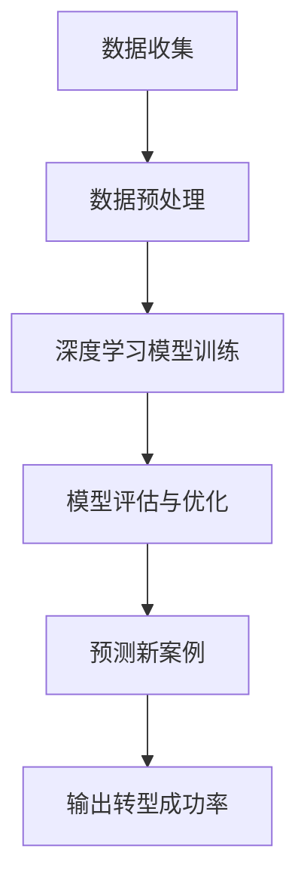

# 深度学习预测公司战略转型成功率

> 关键词：深度学习、公司战略转型、成功率预测、机器学习算法、数据挖掘

> 摘要：本文聚焦于利用深度学习技术来预测公司战略转型的成功率。首先介绍了研究此课题的背景和相关概念，阐述了深度学习在该领域应用的原理与架构。接着详细讲解了核心算法原理，给出了Python源代码示例，同时介绍了相关数学模型和公式。通过项目实战，展示了如何搭建开发环境、实现源代码并进行解读分析。还探讨了深度学习预测公司战略转型成功率的实际应用场景，推荐了学习资源、开发工具框架以及相关论文著作。最后总结了未来发展趋势与挑战，并提供了常见问题解答和扩展阅读参考资料，旨在为相关领域的研究和实践提供全面而深入的指导。

## 1. 背景介绍 
### 1.1 目的和范围
公司战略转型是企业为适应市场变化、提升竞争力而进行的重大决策。然而，战略转型存在诸多不确定性，转型失败可能给公司带来巨大损失。本研究的目的在于利用深度学习技术，对公司战略转型的成功率进行预测，为企业决策提供科学依据。研究范围涵盖了多种类型公司的战略转型案例，涉及不同行业、不同规模的企业，旨在通过对大量数据的分析和挖掘，构建准确有效的预测模型。

### 1.2 预期读者
本文预期读者包括企业战略规划人员、投资分析师、数据科学家、机器学习研究者以及对公司战略转型和深度学习应用感兴趣的相关人士。对于企业战略规划人员，可借助本文的研究成果更好地评估战略转型风险；投资分析师可将其作为评估企业投资价值的参考；数据科学家和机器学习研究者则可从中获取技术实现和应用的相关经验。

### 1.3 文档结构概述
本文首先介绍研究的背景信息，包括目的、预期读者和文档结构概述等。接着阐述深度学习预测公司战略转型成功率的核心概念与联系，包括相关原理和架构。然后详细讲解核心算法原理和具体操作步骤，给出Python代码示例。之后介绍相关的数学模型和公式，并进行详细讲解和举例说明。通过项目实战部分，展示实际案例的开发环境搭建、源代码实现和代码解读分析。再探讨该技术的实际应用场景，推荐相关的学习资源、开发工具框架和论文著作。最后总结未来发展趋势与挑战，提供常见问题解答和扩展阅读参考资料。

### 1.4 术语表
#### 1.4.1 核心术语定义
- **深度学习**：是一类基于人工神经网络的机器学习技术，通过构建具有多个层次的神经网络模型，自动从大量数据中学习特征和模式，以实现对数据的分类、预测等任务。
- **公司战略转型**：指企业为了适应外部环境变化、提升自身竞争力，对公司的发展战略、业务模式、组织架构等进行重大调整和变革的过程。
- **成功率预测**：利用数据分析和建模技术，对公司战略转型成功的可能性进行量化估计。

#### 1.4.2 相关概念解释
- **人工神经网络**：是一种模仿人类神经系统的计算模型，由大量的神经元组成，神经元之间通过连接传递信息。通过调整神经元之间的连接权重，神经网络可以学习数据中的复杂模式和关系。
- **特征工程**：在机器学习中，特征工程是指从原始数据中提取和选择有价值的特征，以提高模型的性能和准确性。对于公司战略转型成功率预测，需要从众多因素中提取与转型成功相关的特征。

#### 1.4.3 缩略词列表
- **ANN**：Artificial Neural Network，人工神经网络
- **CNN**：Convolutional Neural Network，卷积神经网络
- **RNN**：Recurrent Neural Network，循环神经网络
- **LSTM**：Long Short-Term Memory，长短期记忆网络

## 2. 核心概念与联系 
### 核心概念原理
深度学习预测公司战略转型成功率的核心原理是利用深度学习模型对与公司战略转型相关的数据进行学习和分析，挖掘数据中隐藏的模式和规律，从而预测转型的成功率。具体来说，首先需要收集大量与公司战略转型相关的数据，包括公司的财务数据、市场数据、行业数据、管理团队信息等。然后对这些数据进行预处理，包括数据清洗、特征提取和特征选择等操作，以得到适合模型输入的特征向量。接下来，选择合适的深度学习模型，如多层感知机（MLP）、卷积神经网络（CNN）、循环神经网络（RNN）或长短期记忆网络（LSTM）等，对预处理后的数据进行训练。在训练过程中，模型会不断调整自身的参数，以最小化预测结果与实际结果之间的误差。最后，使用训练好的模型对新的公司战略转型案例进行预测，得到转型成功的概率。

### 架构的文本示意图
1. **数据收集层**：收集与公司战略转型相关的各种数据，包括内部数据（如财务报表、业务流程数据）和外部数据（如市场趋势、行业动态）。
2. **数据预处理层**：对收集到的数据进行清洗、转换和特征提取，去除噪声和缺失值，将数据转换为适合模型输入的格式。
3. **深度学习模型层**：选择合适的深度学习模型，如MLP、CNN、RNN或LSTM等，对预处理后的数据进行训练和学习。
4. **预测输出层**：使用训练好的模型对新的公司战略转型案例进行预测，输出转型成功的概率。

### Mermaid流程图


## 3. 核心算法原理 & 具体操作步骤 
### 核心算法原理
本研究主要使用多层感知机（MLP）作为深度学习模型。MLP是一种前馈人工神经网络，由输入层、隐藏层和输出层组成。输入层接收原始数据，隐藏层对输入数据进行非线性变换，输出层输出预测结果。MLP的训练过程基于反向传播算法，通过不断调整神经元之间的连接权重，使得模型的预测结果与实际结果之间的误差最小化。

### Python源代码示例
```python
import numpy as np
import pandas as pd
from sklearn.model_selection import train_test_split
from sklearn.preprocessing import StandardScaler
from tensorflow.keras.models import Sequential
from tensorflow.keras.layers import Dense

# 加载数据
data = pd.read_csv('company_transformation_data.csv')

# 分离特征和标签
X = data.drop('success', axis=1).values
y = data['success'].values

# 划分训练集和测试集
X_train, X_test, y_train, y_test = train_test_split(X, y, test_size=0.2, random_state=42)

# 数据标准化
scaler = StandardScaler()
X_train = scaler.fit_transform(X_train)
X_test = scaler.transform(X_test)

# 构建MLP模型
model = Sequential()
model.add(Dense(64, activation='relu', input_shape=(X_train.shape[1],)))
model.add(Dense(32, activation='relu'))
model.add(Dense(1, activation='sigmoid'))

# 编译模型
model.compile(optimizer='adam', loss='binary_crossentropy', metrics=['accuracy'])

# 训练模型
model.fit(X_train, y_train, epochs=50, batch_size=32, validation_data=(X_test, y_test))

# 评估模型
loss, accuracy = model.evaluate(X_test, y_test)
print(f"Test Loss: {loss}, Test Accuracy: {accuracy}")

# 预测新案例
new_case = np.array([[1, 2, 3, 4, 5]])  # 示例新案例
new_case = scaler.transform(new_case)
prediction = model.predict(new_case)
print(f"Predicted Success Probability: {prediction[0][0]}")
```

### 具体操作步骤
1. **数据加载**：使用`pandas`库读取包含公司战略转型数据的CSV文件。
2. **数据分离**：将特征和标签分离，特征是与公司战略转型相关的各种因素，标签是转型是否成功的二进制值（0或1）。
3. **数据集划分**：使用`train_test_split`函数将数据集划分为训练集和测试集，其中测试集占总数据的20%。
4. **数据标准化**：使用`StandardScaler`对特征数据进行标准化处理，使得数据具有零均值和单位方差，有助于提高模型的训练效果。
5. **模型构建**：使用`Sequential`模型构建一个简单的MLP模型，包含一个输入层、两个隐藏层和一个输出层。输入层的神经元数量与特征的维度相同，隐藏层使用ReLU激活函数，输出层使用Sigmoid激活函数，以输出转型成功的概率。
6. **模型编译**：使用`adam`优化器和`binary_crossentropy`损失函数编译模型，同时使用`accuracy`作为评估指标。
7. **模型训练**：使用训练集对模型进行训练，设置训练的轮数为50，批次大小为32，并使用测试集进行验证。
8. **模型评估**：使用测试集对训练好的模型进行评估，输出测试集的损失和准确率。
9. **预测新案例**：对新的公司战略转型案例进行预测，输出转型成功的概率。

## 4. 数学模型和公式 & 详细讲解 & 举例说明 
### 数学模型
多层感知机（MLP）的数学模型可以表示为一系列的线性变换和非线性激活函数的组合。对于一个具有$L$层的MLP，第$l$层的输出$a^{(l)}$可以通过以下公式计算：

$$z^{(l)} = W^{(l)}a^{(l - 1)} + b^{(l)}$$
$$a^{(l)} = f(z^{(l)})$$

其中，$W^{(l)}$是第$l$层的权重矩阵，$b^{(l)}$是第$l$层的偏置向量，$f$是激活函数。在输入层，$a^{(0)}$是输入数据。

### 损失函数
对于二分类问题，常用的损失函数是二元交叉熵损失函数，其公式为：

$$L(y, \hat{y}) = - \frac{1}{N} \sum_{i = 1}^{N} [y_i \log(\hat{y}_i) + (1 - y_i) \log(1 - \hat{y}_i)]$$

其中，$y$是真实标签，$\hat{y}$是模型的预测值，$N$是样本数量。

### 反向传播算法
反向传播算法是用于训练MLP的核心算法，其基本思想是通过计算损失函数对模型参数（权重和偏置）的梯度，然后使用梯度下降法更新参数。梯度的计算公式如下：

$$\frac{\partial L}{\partial W^{(l)}} = \frac{\partial L}{\partial z^{(l)}} \cdot (a^{(l - 1)})^T$$
$$\frac{\partial L}{\partial b^{(l)}} = \frac{\partial L}{\partial z^{(l)}}$$

其中，$\frac{\partial L}{\partial z^{(l)}}$是损失函数对第$l$层的加权输入的梯度。

### 举例说明
假设我们有一个简单的MLP模型，包含一个输入层（2个神经元）、一个隐藏层（3个神经元）和一个输出层（1个神经元）。输入数据为$x = [1, 2]$，隐藏层的权重矩阵$W^{(1)}$和偏置向量$b^{(1)}$分别为：

$$W^{(1)} = \begin{bmatrix}
0.1 & 0.2 \\
0.3 & 0.4 \\
0.5 & 0.6
\end{bmatrix}$$
$$b^{(1)} = \begin{bmatrix}
0.1 \\
0.2 \\
0.3
\end{bmatrix}$$

隐藏层的激活函数为ReLU，输出层的权重矩阵$W^{(2)}$和偏置向量$b^{(2)}$分别为：

$$W^{(2)} = \begin{bmatrix}
0.7 & 0.8 & 0.9
\end{bmatrix}$$
$$b^{(2)} = [0.4]$$

输出层的激活函数为Sigmoid。

首先，计算隐藏层的加权输入$z^{(1)}$：

$$z^{(1)} = W^{(1)}x + b^{(1)} = \begin{bmatrix}
0.1 & 0.2 \\
0.3 & 0.4 \\
0.5 & 0.6
\end{bmatrix} \begin{bmatrix}
1 \\
2
\end{bmatrix} + \begin{bmatrix}
0.1 \\
0.2 \\
0.3
\end{bmatrix} = \begin{bmatrix}
0.6 \\
1.3 \\
2.0
\end{bmatrix}$$

然后，使用ReLU激活函数计算隐藏层的输出$a^{(1)}$：

$$a^{(1)} = f(z^{(1)}) = \begin{bmatrix}
\max(0, 0.6) \\
\max(0, 1.3) \\
\max(0, 2.0)
\end{bmatrix} = \begin{bmatrix}
0.6 \\
1.3 \\
2.0
\end{bmatrix}$$

接着，计算输出层的加权输入$z^{(2)}$：

$$z^{(2)} = W^{(2)}a^{(1)} + b^{(2)} = \begin{bmatrix}
0.7 & 0.8 & 0.9
\end{bmatrix} \begin{bmatrix}
0.6 \\
1.3 \\
2.0
\end{bmatrix} + 0.4 = 3.29$$

最后，使用Sigmoid激活函数计算输出层的输出$\hat{y}$：

$$\hat{y} = f(z^{(2)}) = \frac{1}{1 + e^{-3.29}} \approx 0.96$$

## 5. 项目实战：代码实际案例和详细解释说明 
### 5.1  开发环境搭建
1. **安装Python**：推荐使用Python 3.7及以上版本，可以从Python官方网站（https://www.python.org/downloads/）下载并安装。
2. **安装必要的库**：使用`pip`命令安装所需的库，包括`numpy`、`pandas`、`scikit-learn`、`tensorflow`等。

```sh
pip install numpy pandas scikit-learn tensorflow
```

3. **选择开发工具**：可以选择使用Jupyter Notebook、PyCharm等开发工具进行代码编写和调试。

### 5.2  源代码详细实现和代码解读
```python
import numpy as np
import pandas as pd
from sklearn.model_selection import train_test_split
from sklearn.preprocessing import StandardScaler
from tensorflow.keras.models import Sequential
from tensorflow.keras.layers import Dense

# 加载数据
data = pd.read_csv('company_transformation_data.csv')

# 分离特征和标签
X = data.drop('success', axis=1).values
y = data['success'].values

# 划分训练集和测试集
X_train, X_test, y_train, y_test = train_test_split(X, y, test_size=0.2, random_state=42)

# 数据标准化
scaler = StandardScaler()
X_train = scaler.fit_transform(X_train)
X_test = scaler.transform(X_test)

# 构建MLP模型
model = Sequential()
model.add(Dense(64, activation='relu', input_shape=(X_train.shape[1],)))
model.add(Dense(32, activation='relu'))
model.add(Dense(1, activation='sigmoid'))

# 编译模型
model.compile(optimizer='adam', loss='binary_crossentropy', metrics=['accuracy'])

# 训练模型
model.fit(X_train, y_train, epochs=50, batch_size=32, validation_data=(X_test, y_test))

# 评估模型
loss, accuracy = model.evaluate(X_test, y_test)
print(f"Test Loss: {loss}, Test Accuracy: {accuracy}")

# 预测新案例
new_case = np.array([[1, 2, 3, 4, 5]])  # 示例新案例
new_case = scaler.transform(new_case)
prediction = model.predict(new_case)
print(f"Predicted Success Probability: {prediction[0][0]}")
```

### 代码解读与分析
1. **数据加载**：使用`pandas`的`read_csv`函数读取包含公司战略转型数据的CSV文件。
2. **数据分离**：使用`drop`方法将`success`列从数据集中删除，得到特征矩阵$X$，将`success`列作为标签向量$y$。
3. **数据集划分**：使用`train_test_split`函数将数据集划分为训练集和测试集，其中测试集占总数据的20%。`random_state`参数用于确保每次划分的结果相同，方便复现实验。
4. **数据标准化**：使用`StandardScaler`对特征数据进行标准化处理，使得数据具有零均值和单位方差。`fit_transform`方法用于计算训练集的均值和标准差，并对训练集进行标准化，`transform`方法用于使用训练集的均值和标准差对测试集进行标准化。
5. **模型构建**：使用`Sequential`模型构建一个简单的MLP模型。`Dense`层是全连接层，第一个`Dense`层的`input_shape`参数指定输入数据的维度，`activation`参数指定激活函数。
6. **模型编译**：使用`adam`优化器和`binary_crossentropy`损失函数编译模型，同时使用`accuracy`作为评估指标。
7. **模型训练**：使用`fit`方法对模型进行训练，`epochs`参数指定训练的轮数，`batch_size`参数指定每次训练使用的样本数量，`validation_data`参数指定验证集。
8. **模型评估**：使用`evaluate`方法对训练好的模型进行评估，输出测试集的损失和准确率。
9. **预测新案例**：对新的公司战略转型案例进行预测，输出转型成功的概率。

## 6. 实际应用场景 
### 企业战略决策
企业在进行战略转型决策时，可以使用深度学习预测模型对转型的成功率进行评估。通过输入相关的企业数据和市场信息，模型可以输出转型成功的概率，帮助企业管理层更好地了解转型的风险和收益，从而做出更明智的决策。

### 投资决策
投资机构在评估企业的投资价值时，可以将公司战略转型的成功率作为一个重要的参考因素。通过分析企业的转型计划和相关数据，使用深度学习预测模型预测转型的成功率，从而评估企业未来的发展潜力和投资回报率，为投资决策提供依据。

### 风险管理
企业在进行战略转型过程中，面临着各种风险，如市场风险、技术风险、管理风险等。深度学习预测模型可以帮助企业识别转型过程中的潜在风险，提前采取措施进行防范和应对，降低转型失败的风险。

### 行业研究
研究机构可以使用深度学习预测模型对整个行业的战略转型趋势进行研究和分析。通过收集行业内企业的转型数据，构建预测模型，分析影响转型成功率的因素，为行业发展提供理论支持和决策建议。

## 7. 工具和资源推荐
### 7.1 学习资源推荐
#### 7.1.1 书籍推荐
- 《深度学习》（Deep Learning）：由Ian Goodfellow、Yoshua Bengio和Aaron Courville合著，是深度学习领域的经典教材，全面介绍了深度学习的基本概念、算法和应用。
- 《Python深度学习》（Deep Learning with Python）：由Francois Chollet编写，以Python和Keras为工具，详细介绍了深度学习的实践方法和技巧。
- 《机器学习》（Machine Learning）：由Tom Mitchell编写，是机器学习领域的经典教材，介绍了机器学习的基本概念、算法和应用。

#### 7.1.2 在线课程
- Coursera上的“深度学习专项课程”（Deep Learning Specialization）：由Andrew Ng教授授课，包括5门课程，全面介绍了深度学习的理论和实践。
- edX上的“强化学习基础”（Fundamentals of Reinforcement Learning）：介绍了强化学习的基本概念、算法和应用。
- 哔哩哔哩上的“李宏毅机器学习课程”：由台湾大学李宏毅教授授课，课程内容生动有趣，适合初学者学习。

#### 7.1.3 技术博客和网站
- Medium：是一个技术博客平台，上面有很多关于深度学习、机器学习的优秀文章。
- arXiv：是一个预印本数据库，收录了大量的学术论文，包括深度学习、机器学习领域的最新研究成果。
- Kaggle：是一个数据科学竞赛平台，上面有很多关于深度学习、机器学习的数据集和竞赛项目，可以通过参与竞赛来提高自己的实践能力。

### 7.2 开发工具框架推荐
#### 7.2.1 IDE和编辑器
- PyCharm：是一款专业的Python集成开发环境，提供了丰富的代码编辑、调试、版本控制等功能。
- Jupyter Notebook：是一个交互式的开发环境，支持Python、R等多种编程语言，适合进行数据分析和模型训练。
- Visual Studio Code：是一款轻量级的代码编辑器，支持多种编程语言和插件，具有强大的代码编辑和调试功能。

#### 7.2.2 调试和性能分析工具
- TensorBoard：是TensorFlow提供的可视化工具，可以用于查看模型的训练过程、损失曲线、准确率曲线等。
- PyTorch Profiler：是PyTorch提供的性能分析工具，可以用于分析模型的性能瓶颈，优化模型的运行效率。
- cProfile：是Python标准库中的性能分析工具，可以用于分析Python代码的性能瓶颈。

#### 7.2.3 相关框架和库
- TensorFlow：是一个开源的深度学习框架，由Google开发，提供了丰富的深度学习模型和工具。
- PyTorch：是一个开源的深度学习框架，由Facebook开发，具有动态图的特点，适合进行快速原型开发。
- Scikit-learn：是一个开源的机器学习库，提供了丰富的机器学习算法和工具，适合进行数据预处理、模型选择和评估等任务。

### 7.3 相关论文著作推荐
#### 7.3.1 经典论文
- “Gradient-Based Learning Applied to Document Recognition”：由Yann LeCun等人发表，介绍了卷积神经网络（CNN）的基本原理和应用，是深度学习领域的经典论文之一。
- “Long Short-Term Memory”：由Sepp Hochreiter和Jürgen Schmidhuber发表，介绍了长短期记忆网络（LSTM）的基本原理和应用，是循环神经网络领域的经典论文之一。
- “Attention Is All You Need”：由Ashish Vaswani等人发表，介绍了Transformer模型的基本原理和应用，是自然语言处理领域的经典论文之一。

#### 7.3.2 最新研究成果
- 关注顶级学术会议，如NeurIPS（神经信息处理系统大会）、ICML（国际机器学习会议）、CVPR（计算机视觉与模式识别会议）等，这些会议上会发表深度学习领域的最新研究成果。
- 关注知名学术期刊，如Journal of Machine Learning Research（机器学习研究杂志）、Artificial Intelligence（人工智能杂志）等，这些期刊上会发表深度学习领域的高质量研究论文。

#### 7.3.3 应用案例分析
- 可以关注一些知名企业的技术博客，如Google AI Blog、Facebook AI Research等，这些博客上会分享深度学习在实际应用中的案例和经验。
- 可以参考一些数据科学竞赛平台上的优秀解决方案，如Kaggle上的一些高分方案，这些方案通常会详细介绍深度学习模型的构建和优化过程。

## 8. 总结：未来发展趋势与挑战
### 未来发展趋势
1. **多模态数据融合**：未来的深度学习预测模型将不仅仅依赖于结构化数据，还会融合图像、文本、音频等多模态数据，以更全面地了解公司战略转型的情况，提高预测的准确性。
2. **强化学习的应用**：强化学习可以用于优化公司战略转型的决策过程，通过与环境的交互不断学习最优的转型策略，提高转型的成功率。
3. **可解释性深度学习**：随着深度学习模型的复杂度不断增加，模型的可解释性变得越来越重要。未来的研究将致力于开发可解释的深度学习模型，使得企业管理层能够更好地理解模型的预测结果，从而做出更合理的决策。
4. **跨行业应用**：深度学习预测公司战略转型成功率的技术将不仅仅应用于特定行业，还会推广到更多的行业，为不同行业的企业提供决策支持。

### 挑战
1. **数据质量和数量**：深度学习模型需要大量高质量的数据进行训练，然而，公司战略转型相关的数据往往难以获取，且数据质量参差不齐。如何收集、整理和清洗这些数据是一个挑战。
2. **模型复杂度和计算资源**：深度学习模型通常具有较高的复杂度，需要大量的计算资源进行训练和推理。如何在有限的计算资源下提高模型的性能是一个挑战。
3. **模型可解释性**：深度学习模型往往被视为“黑箱”，难以解释其预测结果。如何提高模型的可解释性，使得企业管理层能够理解模型的决策过程，是一个亟待解决的问题。
4. **不确定性和风险**：公司战略转型过程中存在很多不确定性和风险，如市场变化、政策调整等。如何在模型中考虑这些不确定性和风险，提高模型的鲁棒性，是一个挑战。

## 9. 附录：常见问题与解答
### 问题1：如何选择合适的深度学习模型？
解答：选择合适的深度学习模型需要考虑数据的特点和问题的类型。如果数据具有序列特征，如时间序列数据，可以选择循环神经网络（RNN）或长短期记忆网络（LSTM）；如果数据具有空间特征，如图像数据，可以选择卷积神经网络（CNN）；对于一般的分类和回归问题，可以选择多层感知机（MLP）。此外，还可以通过实验比较不同模型的性能，选择最优的模型。

### 问题2：如何处理数据中的缺失值和异常值？
解答：处理数据中的缺失值可以采用删除含有缺失值的样本、填充缺失值（如使用均值、中位数、众数等）、使用插值方法等。处理异常值可以采用删除异常值、将异常值替换为合理的值、使用鲁棒统计方法等。具体的处理方法需要根据数据的特点和问题的类型来选择。

### 问题3：如何评估深度学习模型的性能？
解答：评估深度学习模型的性能可以使用多种指标，如准确率、召回率、F1值、均方误差（MSE）、均方根误差（RMSE）等。对于分类问题，常用的指标是准确率、召回率和F1值；对于回归问题，常用的指标是均方误差和均方根误差。此外，还可以使用交叉验证、ROC曲线、AUC值等方法来评估模型的性能。

### 问题4：如何提高深度学习模型的泛化能力？
解答：提高深度学习模型的泛化能力可以采用以下方法：增加训练数据的数量和多样性、使用正则化方法（如L1和L2正则化）、使用Dropout层、进行数据增强、调整模型的复杂度等。

## 10. 扩展阅读 & 参考资料
### 扩展阅读
- 《人工智能：现代方法》（Artificial Intelligence: A Modern Approach）：全面介绍了人工智能的基本概念、算法和应用，是人工智能领域的经典教材。
- 《数据挖掘：概念与技术》（Data Mining: Concepts and Techniques）：介绍了数据挖掘的基本概念、算法和应用，是数据挖掘领域的经典教材。
- 《自然语言处理入门》（Natural Language Processing in Action）：介绍了自然语言处理的基本概念、算法和应用，适合初学者学习。

### 参考资料
1. Goodfellow, I., Bengio, Y., & Courville, A. (2016). Deep Learning. MIT Press.
2. Chollet, F. (2018). Deep Learning with Python. Manning Publications.
3. Mitchell, T. M. (1997). Machine Learning. McGraw-Hill.
4. LeCun, Y., Bottou, L., Bengio, Y., & Haffner, P. (1998). Gradient-Based Learning Applied to Document Recognition. Proceedings of the IEEE, 86(11), 2278-2324.
5. Hochreiter, S., & Schmidhuber, J. (1997). Long Short-Term Memory. Neural Computation, 9(8), 1735-1780.
6. Vaswani, A., Shazeer, N., Parmar, N., Uszkoreit, J., Jones, L., Gomez, A. N., ... & Polosukhin, I. (2017). Attention Is All You Need. Advances in Neural Information Processing Systems, 5998-6008.