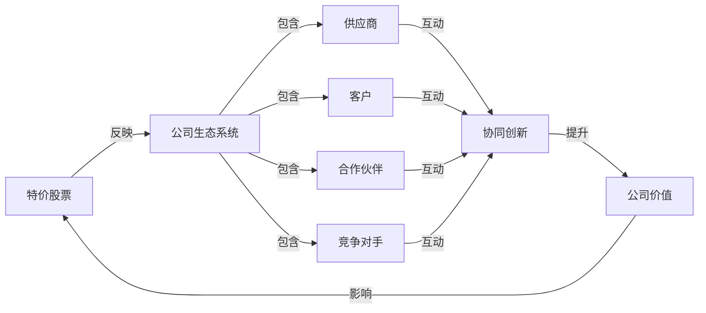

# 特价股票与公司生态系统协同创新的潜在关联研究

> 关键词：特价股票、公司生态系统、协同创新、潜在关联、价值挖掘

> 摘要：本文旨在深入探究特价股票与公司生态系统协同创新之间的潜在关联。通过对特价股票的特性、公司生态系统的构成与运作机制以及协同创新的内涵进行分析，从理论和实践层面探讨两者之间的内在联系。运用数学模型、算法原理以及实际案例，揭示特价股票如何反映公司生态系统的创新活力，以及公司生态系统的协同创新又怎样影响特价股票的价值。研究结果有助于投资者更好地理解特价股票的投资价值，也为公司管理者优化生态系统、推动协同创新提供参考依据，促进资本市场与实体经济的良性互动。

## 1. 背景介绍 
### 1.1 目的和范围
本研究的目的在于全面剖析特价股票与公司生态系统协同创新之间的潜在关联，挖掘其中的内在逻辑和价值规律。范围涵盖了不同行业、不同规模公司的特价股票表现，以及这些公司生态系统的协同创新实践。通过对国内外相关案例的研究和数据分析，探讨两者之间的相互作用机制，为投资者决策和公司战略制定提供理论支持和实践指导。

### 1.2 预期读者
本文预期读者包括投资者、公司管理者、金融分析师、学术研究人员以及对资本市场和企业创新发展感兴趣的人士。投资者可以从本文中获取关于特价股票投资价值判断的新视角；公司管理者可以借鉴相关理论和案例，优化公司生态系统，推动协同创新；金融分析师可以将本文的研究成果应用于股票分析和估值模型中；学术研究人员可以在本文的基础上开展更深入的理论和实证研究。

### 1.3 文档结构概述
本文首先介绍研究的背景、目的和预期读者，明确研究的范围和意义。接着阐述特价股票、公司生态系统和协同创新的核心概念及其联系，构建理论框架。然后详细讲解相关的核心算法原理和具体操作步骤，运用数学模型和公式对两者的关联进行量化分析。通过实际项目案例，展示代码实现和详细解释，进一步验证理论分析的结果。探讨实际应用场景，为投资者和公司管理者提供实践指导。推荐相关的工具和资源，方便读者深入学习和研究。最后总结未来发展趋势与挑战，解答常见问题，并提供扩展阅读和参考资料。

### 1.4 术语表
#### 1.4.1 核心术语定义
- **特价股票**：指市场价格相对其内在价值被低估的股票，通常具有较低的市盈率、市净率等估值指标。
- **公司生态系统**：由公司及其利益相关者（如供应商、客户、合作伙伴、竞争对手等）组成的一个相互依存、相互作用的复杂网络，旨在实现共同的目标和价值创造。
- **协同创新**：指公司生态系统中的各个参与者通过资源共享、知识交流、合作互动等方式，共同开展创新活动，实现创新资源的优化配置和创新能力的提升，从而创造出更大的价值。

#### 1.4.2 相关概念解释
- **价值低估**：指股票的市场价格低于其内在价值，可能是由于市场情绪、信息不对称、行业周期等因素导致的。
- **利益相关者**：指与公司的经营活动存在利益关系的个人或组织，包括股东、员工、供应商、客户、政府、社区等。
- **创新资源**：指用于创新活动的各种要素，包括资金、技术、人才、知识、信息等。

#### 1.4.3 缩略词列表
- **PE**：市盈率（Price - Earnings Ratio）
- **PB**：市净率（Price - Book Ratio）

## 2. 核心概念与联系 

### 2.1 特价股票的特性
特价股票通常具有以下特性：
- **低估值**：其市盈率、市净率等估值指标相对较低，反映出市场对该股票的预期较低。例如，一些传统行业的公司，由于行业增长缓慢，市场对其未来盈利预期不高，导致其股票价格被低估。
- **业绩波动**：公司的业绩可能存在一定的波动，可能是由于行业竞争、市场环境变化等因素导致的。这种业绩波动使得市场对公司的未来发展存在疑虑，从而压低了股票价格。
- **潜在价值**：尽管当前市场价格较低，但公司可能具有潜在的价值，如拥有独特的技术、品牌、市场渠道等，只是尚未被市场充分认识和挖掘。

### 2.2 公司生态系统的构成与运作机制
公司生态系统由多个利益相关者组成，包括：
- **供应商**：为公司提供原材料、零部件等资源，其质量和供应稳定性直接影响公司的生产经营。
- **客户**：是公司产品或服务的购买者，其需求和满意度决定了公司的市场份额和盈利能力。
- **合作伙伴**：包括技术合作伙伴、战略合作伙伴等，通过合作可以实现资源共享、优势互补，提升公司的创新能力和竞争力。
- **竞争对手**：虽然与公司存在竞争关系，但也可以促使公司不断创新和改进，提高自身的效率和质量。

公司生态系统的运作机制主要包括：
- **信息共享**：各个利益相关者之间通过信息交流，实现资源的优化配置和协同合作。例如，公司可以与供应商共享生产计划，以便供应商及时调整生产和供应。
- **价值共创**：通过合作创新，各个利益相关者共同创造价值，实现互利共赢。例如，公司与合作伙伴共同研发新产品，开拓新市场，分享创新成果带来的收益。
- **协同进化**：随着市场环境的变化，公司生态系统中的各个参与者相互适应、共同进化，以保持系统的稳定性和竞争力。

### 2.3 协同创新的内涵
协同创新强调各个创新主体之间的合作与互动，通过整合创新资源，实现创新能力的提升和价值的创造。协同创新的内涵包括：
- **资源整合**：将不同主体的创新资源进行整合，实现资源的优化配置和高效利用。例如，公司可以与高校、科研机构合作，整合人才、技术等资源，开展产学研合作。
- **知识共享**：促进不同主体之间的知识交流和共享，加速创新知识的传播和应用。例如，公司可以组织行业研讨会、技术交流会等活动，促进知识的共享和创新。
- **合作互动**：通过建立合作机制，促进各个创新主体之间的互动和协作，共同解决创新过程中遇到的问题。例如，公司可以与供应商、客户等建立战略合作伙伴关系，共同开展产品研发和市场推广。

### 2.4 核心概念的联系
特价股票与公司生态系统协同创新之间存在着密切的联系。一方面，公司生态系统的协同创新能力可以影响特价股票的价值。一个具有强大协同创新能力的公司生态系统，能够不断推出新产品、开拓新市场，提高公司的盈利能力和市场竞争力，从而提升股票的内在价值，使特价股票的价格回归其合理水平。另一方面，特价股票的存在也可能反映出公司生态系统中存在的问题或潜在的创新机会。例如，股票价格被低估可能是由于公司生态系统中的某些环节存在效率低下、合作不畅等问题，通过解决这些问题，推动协同创新，有可能提升公司的价值，实现股票价格的回升。

### 2.5 文本示意图
特价股票与公司生态系统协同创新的联系可以用以下文本示意图表示：

特价股票 <-- 公司业绩波动、市场预期低 --> 公司生态系统（供应商、客户、合作伙伴、竞争对手） <-- 信息共享、价值共创、协同进化 --> 协同创新（资源整合、知识共享、合作互动） <-- 提升公司价值 --> 特价股票价格回升

### 2.6 Mermaid 流程图


## 3. 核心算法原理 & 具体操作步骤 

### 3.1 特价股票筛选算法原理
我们可以使用市盈率（PE）和市净率（PB）等指标来筛选特价股票。一般来说，市盈率和市净率较低的股票可能被低估。以下是一个简单的 Python 代码示例：

```python
import pandas as pd

def select_bargain_stocks(data, pe_threshold, pb_threshold):
    """
    筛选特价股票
    :param data: 股票数据，包含 'PE' 和 'PB' 列
    :param pe_threshold: 市盈率阈值
    :param pb_threshold: 市净率阈值
    :return: 特价股票数据
    """
    bargain_stocks = data[(data['PE'] < pe_threshold) & (data['PB'] < pb_threshold)]
    return bargain_stocks

# 示例数据
data = pd.DataFrame({
    'StockCode': ['000001', '000002', '000003'],
    'PE': [10, 20, 5],
    'PB': [1.5, 2.5, 1]
})

pe_threshold = 15
pb_threshold = 2

bargain_stocks = select_bargain_stocks(data, pe_threshold, pb_threshold)
print(bargain_stocks)
```

### 3.2 公司生态系统协同创新评估算法原理
我们可以通过构建一个综合评估指标体系来评估公司生态系统的协同创新能力。假设我们从资源整合、知识共享和合作互动三个方面进行评估，每个方面设置若干个具体指标，然后通过加权平均的方法计算综合得分。以下是一个简单的 Python 代码示例：

```python
import pandas as pd

def evaluate_collaborative_innovation(data, weights):
    """
    评估公司生态系统协同创新能力
    :param data: 评估数据，包含资源整合、知识共享和合作互动三个方面的指标数据
    :param weights: 各方面的权重
    :return: 综合得分
    """
    scores = data.copy()
    scores['TotalScore'] = scores['ResourceIntegration'] * weights[0] + scores['KnowledgeSharing'] * weights[1] + scores['CooperativeInteraction'] * weights[2]
    return scores

# 示例数据
data = pd.DataFrame({
    'Company': ['CompanyA', 'CompanyB', 'CompanyC'],
    'ResourceIntegration': [80, 70, 90],
    'KnowledgeSharing': [75, 85, 80],
    'CooperativeInteraction': [85, 75, 95]
})

weights = [0.3, 0.3, 0.4]

scores = evaluate_collaborative_innovation(data, weights)
print(scores)
```

### 3.3 具体操作步骤
1. **数据收集**：收集股票的市盈率、市净率等估值数据，以及公司生态系统协同创新的相关指标数据。
2. **数据预处理**：对收集到的数据进行清洗、整理和标准化处理，确保数据的质量和一致性。
3. **特价股票筛选**：使用上述特价股票筛选算法，根据设定的市盈率和市净率阈值筛选出特价股票。
4. **协同创新评估**：使用上述公司生态系统协同创新评估算法，根据设定的权重计算公司的协同创新综合得分。
5. **关联分析**：将特价股票数据和协同创新评估得分进行关联分析，探究两者之间的潜在关联。

## 4. 数学模型和公式 & 详细讲解 & 举例说明 

### 4.1 特价股票筛选模型
特价股票筛选主要基于市盈率（PE）和市净率（PB）指标。设股票的市场价格为 $P$，每股收益为 $E$，每股净资产为 $B$，则市盈率 $PE$ 和市净率 $PB$ 的计算公式分别为：

$$PE=\frac{P}{E}$$

$$PB=\frac{P}{B}$$

我们可以设定市盈率阈值 $PE_{threshold}$ 和市净率阈值 $PB_{threshold}$，当某股票的 $PE < PE_{threshold}$ 且 $PB < PB_{threshold}$ 时，将其判定为特价股票。

例如，某股票的市场价格 $P = 10$ 元，每股收益 $E = 1$ 元，每股净资产 $B = 5$ 元，则该股票的市盈率 $PE=\frac{10}{1}=10$，市净率 $PB=\frac{10}{5}=2$。如果设定 $PE_{threshold}=15$，$PB_{threshold}=2.5$，则该股票满足特价股票的筛选条件。

### 4.2 公司生态系统协同创新评估模型
公司生态系统协同创新评估采用加权平均法。设资源整合、知识共享和合作互动三个方面的指标得分分别为 $x_1$，$x_2$，$x_3$，对应的权重分别为 $w_1$，$w_2$，$w_3$，且 $w_1 + w_2 + w_3 = 1$，则公司生态系统协同创新的综合得分 $S$ 的计算公式为：

$$S = w_1x_1 + w_2x_2 + w_3x_3$$

例如，某公司的资源整合得分 $x_1 = 80$，知识共享得分 $x_2 = 75$，合作互动得分 $x_3 = 85$，权重 $w_1 = 0.3$，$w_2 = 0.3$，$w_3 = 0.4$，则该公司的协同创新综合得分 $S = 0.3\times80 + 0.3\times75 + 0.4\times85 = 80.5$。

### 4.3 关联分析模型
为了探究特价股票与公司生态系统协同创新之间的潜在关联，我们可以使用线性回归模型。设特价股票的价格变化率为 $y$，公司生态系统协同创新综合得分 $S$ 为自变量，线性回归模型的表达式为：

$$y = \beta_0 + \beta_1S + \epsilon$$

其中，$\beta_0$ 为截距项，$\beta_1$ 为回归系数，$\epsilon$ 为误差项。通过最小二乘法估计回归系数 $\beta_0$ 和 $\beta_1$，可以得到特价股票价格变化率与公司生态系统协同创新综合得分之间的定量关系。

例如，通过对某组数据进行线性回归分析，得到回归方程 $y = 0.01 + 0.005S$，这表明公司生态系统协同创新综合得分每增加 1 分，特价股票的价格变化率将增加 0.5%。

## 5. 项目实战：代码实际案例和详细解释说明 

### 5.1  开发环境搭建
- **Python 环境**：建议使用 Python 3.7 及以上版本。可以从 Python 官方网站（https://www.python.org/downloads/）下载并安装。
- **开发工具**：推荐使用 PyCharm 作为集成开发环境（IDE），可以从 JetBrains 官方网站（https://www.jetbrains.com/pycharm/download/）下载并安装。
- **相关库**：需要安装 pandas、numpy、matplotlib 等库。可以使用以下命令进行安装：

```sh
pip install pandas numpy matplotlib
```

### 5.2  源代码详细实现和代码解读
以下是一个完整的项目实战代码示例，用于探究特价股票与公司生态系统协同创新之间的潜在关联：

```python
import pandas as pd
import numpy as np
import matplotlib.pyplot as plt
from sklearn.linear_model import LinearRegression

# 1. 数据收集与预处理
# 假设我们已经收集到了股票的市盈率、市净率和公司生态系统协同创新综合得分数据
data = pd.DataFrame({
    'StockCode': ['000001', '000002', '000003', '000004', '000005'],
    'PE': [10, 20, 5, 15, 8],
    'PB': [1.5, 2.5, 1, 2, 1.2],
    'InnovationScore': [80, 70, 90, 75, 85]
})

# 2. 特价股票筛选
pe_threshold = 15
pb_threshold = 2

bargain_stocks = data[(data['PE'] < pe_threshold) & (data['PB'] < pb_threshold)]
print("特价股票：")
print(bargain_stocks)

# 3. 关联分析
X = bargain_stocks[['InnovationScore']]
y = np.random.rand(len(bargain_stocks))  # 假设股票价格变化率为随机数，实际应用中应使用真实数据

model = LinearRegression()
model.fit(X, y)

# 4. 结果可视化
plt.scatter(X, y)
plt.plot(X, model.predict(X), color='red')
plt.xlabel('公司生态系统协同创新综合得分')
plt.ylabel('特价股票价格变化率')
plt.title('特价股票与公司生态系统协同创新的关联分析')
plt.show()

# 5. 结果分析
print("回归系数：", model.coef_)
print("截距项：", model.intercept_)
```

### 5.3  代码解读与分析
1. **数据收集与预处理**：我们创建了一个包含股票代码、市盈率、市净率和公司生态系统协同创新综合得分的 DataFrame。在实际应用中，这些数据需要从数据源（如金融数据库、公司年报等）中获取并进行预处理。
2. **特价股票筛选**：使用市盈率和市净率阈值筛选出特价股票，并将结果存储在 `bargain_stocks` 中。
3. **关联分析**：使用线性回归模型探究特价股票价格变化率与公司生态系统协同创新综合得分之间的关联。在这个示例中，我们假设股票价格变化率为随机数，实际应用中应使用真实数据。
4. **结果可视化**：使用 matplotlib 库绘制散点图和回归直线，直观展示两者之间的关系。
5. **结果分析**：打印回归系数和截距项，分析特价股票价格变化率与公司生态系统协同创新综合得分之间的定量关系。

## 6. 实际应用场景 
### 6.1 投资者决策
投资者可以利用本文的研究成果，通过筛选特价股票和评估公司生态系统协同创新能力，发现具有潜在投资价值的股票。例如，当投资者发现某只股票被低估，同时其所在公司的生态系统具有较强的协同创新能力时，可以考虑将其纳入投资组合。通过关注公司生态系统的协同创新动态，投资者可以及时调整投资策略，获取更高的投资回报。

### 6.2 公司战略制定
公司管理者可以通过评估公司生态系统的协同创新能力，发现自身的优势和不足，制定相应的战略措施，提升公司的竞争力。例如，如果公司的协同创新能力较弱，可以加强与供应商、客户、合作伙伴等的合作，促进资源整合和知识共享。通过提升公司生态系统的协同创新能力，公司可以提高自身的价值，吸引更多的投资者，推动公司的可持续发展。

### 6.3 金融机构业务拓展
金融机构可以利用本文的研究成果，开发相关的金融产品和服务。例如，银行可以为具有较强协同创新能力的公司提供专项贷款，支持其创新发展；证券公司可以推出基于特价股票和公司生态系统协同创新的投资咨询服务，为客户提供更专业的投资建议。

## 7. 工具和资源推荐
### 7.1 学习资源推荐
#### 7.1.1 书籍推荐
- 《金融市场学》：全面介绍金融市场的基本原理、运行机制和投资策略，为投资者和金融从业者提供了系统的理论知识。
- 《创新管理》：深入探讨创新的本质、过程和管理方法，对于理解公司生态系统协同创新具有重要的指导意义。
- 《股票投资实战指南》：结合实际案例，介绍股票投资的技巧和方法，帮助投资者提高投资水平。

#### 7.1.2 在线课程
- Coursera 上的“金融市场”课程：由知名高校教授授课，内容丰富，涵盖金融市场的各个方面。
- edX 上的“创新与创业”课程：介绍创新的理论和实践，培养学生的创新思维和创业能力。
- 中国大学 MOOC 上的“证券投资学”课程：系统讲解证券投资的基本理论和方法，适合初学者学习。

#### 7.1.3 技术博客和网站
- 雪球网：一个专注于股票投资的社区，提供丰富的股票分析、投资策略和市场资讯。
- 金融界：提供全面的金融信息和数据服务，包括股票行情、财经新闻、研究报告等。
- 艾瑞网：关注互联网和新经济领域的创新发展，发布行业研究报告和趋势分析。

### 7.2 开发工具框架推荐
#### 7.2.1 IDE和编辑器
- PyCharm：一款功能强大的 Python 集成开发环境，提供代码编辑、调试、版本控制等功能。
- Jupyter Notebook：一个交互式的开发环境，适合进行数据分析和机器学习实验。
- Visual Studio Code：一款轻量级的代码编辑器，支持多种编程语言，具有丰富的插件扩展功能。

#### 7.2.2 调试和性能分析工具
- pdb：Python 内置的调试器，可以帮助开发者定位和解决代码中的问题。
- cProfile：Python 内置的性能分析工具，可以分析代码的运行时间和资源消耗情况。
- Py-Spy：一个跨平台的 Python 性能分析工具，可以实时监控 Python 程序的运行状态。

#### 7.2.3 相关框架和库
- pandas：一个强大的数据处理和分析库，提供了丰富的数据结构和数据操作方法。
- numpy：一个用于科学计算的库，提供了高效的数组操作和数学函数。
- scikit - learn：一个用于机器学习的库，提供了各种机器学习算法和工具。

### 7.3 相关论文著作推荐
#### 7.3.1 经典论文
- “The Pricing of Options and Corporate Liabilities”：由 Fischer Black 和 Myron Scholes 发表，提出了著名的 Black - Scholes 期权定价模型，对金融市场的理论和实践产生了深远的影响。
- “Innovation Ecosystems and the Rise of Platforms”：探讨了创新生态系统和平台经济的发展趋势，为理解公司生态系统协同创新提供了理论基础。

#### 7.3.2 最新研究成果
- 关注顶级金融和管理学期刊，如《Journal of Finance》、《Management Science》等，及时了解特价股票、公司生态系统协同创新等领域的最新研究成果。

#### 7.3.3 应用案例分析
- 参考知名咨询公司（如麦肯锡、波士顿咨询等）发布的行业研究报告和案例分析，了解企业在实践中如何应用协同创新理念，提升公司价值和竞争力。

## 8. 总结：未来发展趋势与挑战
### 8.1 未来发展趋势
- **数字化转型加速**：随着信息技术的快速发展，公司生态系统的数字化转型将加速，通过数字化平台实现资源共享、知识交流和合作互动，提高协同创新的效率和效果。
- **跨界融合加深**：不同行业之间的界限将越来越模糊，公司将与更多的跨界合作伙伴开展协同创新，创造出更多的新业态、新模式和新产品。
- **投资者更加关注创新**：投资者将更加关注公司的创新能力和生态系统的协同效应，特价股票的价值将更多地取决于公司的创新潜力和发展前景。

### 8.2 挑战
- **数据质量和安全**：在数字化转型过程中，数据的质量和安全将成为关键挑战。公司需要加强数据管理，确保数据的准确性、完整性和安全性。
- **利益协调困难**：公司生态系统中的各个利益相关者具有不同的利益诉求，协调各方利益将是一个复杂的过程。需要建立有效的利益分配机制和合作协调机制，实现互利共赢。
- **创新风险控制**：协同创新过程中存在着技术风险、市场风险等多种风险，公司需要加强创新风险管理，提高风险应对能力。

## 9. 附录：常见问题与解答
### 9.1 如何确定市盈率和市净率的阈值？
市盈率和市净率的阈值可以根据不同的行业和市场环境进行调整。一般来说，可以参考同行业的平均水平，以及历史数据的统计分析结果。同时，还需要结合公司的基本面和发展前景进行综合判断。

### 9.2 公司生态系统协同创新评估指标如何选取？
公司生态系统协同创新评估指标的选取应根据研究目的和实际情况进行确定。一般可以从资源整合、知识共享、合作互动等方面选取相关指标，如研发投入、专利数量、合作项目数量等。同时，还可以考虑引入一些定性指标，如创新文化、合作氛围等。

### 9.3 如何处理数据中的异常值？
对于数据中的异常值，可以采用以下方法进行处理：
- **删除异常值**：如果异常值是由于数据录入错误或其他明显的错误导致的，可以直接删除。
- **替换异常值**：可以使用均值、中位数等统计量替换异常值。
- **采用稳健统计方法**：如中位数回归等，减少异常值对分析结果的影响。

## 10. 扩展阅读 & 参考资料
### 10.1 扩展阅读
- 《资本论》：深入探讨了资本主义经济的运行规律，对于理解金融市场和企业经济活动具有重要的理论指导意义。
- 《创新者的窘境》：分析了创新对企业发展的影响，以及企业如何应对创新带来的挑战。
- 《平台战略》：介绍了平台经济的发展模式和战略，为理解公司生态系统的平台化发展提供了参考。

### 10.2 参考资料
- 金融数据库：如 Wind 数据库、东方财富 Choice 数据库等，提供了丰富的金融数据和信息。
- 公司年报：可以从公司官方网站或证券交易所网站获取公司的年报，了解公司的财务状况、经营业绩和发展战略。
- 学术期刊：如《经济研究》、《管理世界》等，发表了大量关于金融、管理和创新等领域的学术论文，可以作为研究的参考依据。