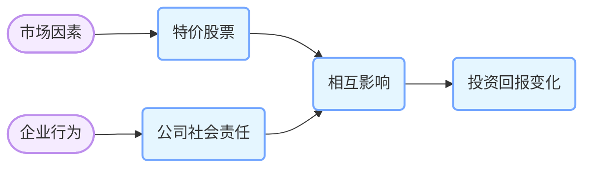

# 特价股票与公司社会责任投资回报的长期影响

> 关键词：特价股票、公司社会责任、投资回报、长期影响、资本市场、可持续发展、企业价值

> 摘要：本文深入探讨了特价股票与公司社会责任投资回报之间的长期影响关系。首先介绍了研究的背景、目的、预期读者和文档结构等内容。接着阐述了特价股票和公司社会责任的核心概念及两者之间的联系。详细讲解了相关的核心算法原理与操作步骤，借助数学模型和公式进行理论分析，并举例说明。通过项目实战给出代码实际案例并详细解释。分析了其在实际中的应用场景，推荐了学习、开发相关的工具和资源，以及相关论文著作。最后总结了未来发展趋势与挑战，列出常见问题与解答并提供扩展阅读和参考资料，旨在为投资者、企业管理者和相关研究人员提供全面且深入的理论和实践指导，以更好地理解和把握特价股票与公司社会责任投资回报的长期动态关系。

## 1. 背景介绍 
### 1.1 目的和范围
随着资本市场的不断发展和投资者理念的日益成熟，投资者不再仅仅关注股票的短期价格波动和财务指标，而是更加注重公司的长期价值和可持续发展能力。特价股票因其价格相对较低，往往吸引了众多投资者的关注。与此同时，公司社会责任也逐渐成为影响企业长期发展和市场价值的重要因素。本研究的目的在于深入探讨特价股票与公司社会责任投资回报之间的长期影响关系，分析这种关系在不同市场环境和行业中的表现，为投资者提供决策参考，为企业管理者提供战略指导。

研究范围涵盖了全球主要资本市场，选取了具有代表性的行业和企业进行分析。同时，考虑到不同国家和地区的经济、文化和制度差异，对相关数据进行了分类和比较，以确保研究结果的普遍性和适用性。

### 1.2 预期读者
本文的预期读者包括投资者、企业管理者、金融分析师、学者以及对资本市场和企业社会责任感兴趣的相关人士。投资者可以通过本文了解特价股票和公司社会责任对投资回报的长期影响，从而优化投资组合，提高投资收益。企业管理者可以从中认识到履行社会责任对企业长期价值的重要性，制定更加合理的企业战略。金融分析师可以将本文的研究成果作为分析和评估企业的参考依据。学者可以在此基础上进行进一步的研究和探讨。

### 1.3 文档结构概述
本文共分为十个部分。第一部分为背景介绍，阐述了研究的目的、范围、预期读者和文档结构等内容。第二部分介绍了特价股票和公司社会责任的核心概念及两者之间的联系，并给出了相应的文本示意图和 Mermaid 流程图。第三部分详细讲解了相关的核心算法原理与操作步骤，通过 Python 源代码进行了详细阐述。第四部分借助数学模型和公式进行理论分析，并举例说明。第五部分通过项目实战给出代码实际案例并详细解释。第六部分分析了其在实际中的应用场景。第七部分推荐了学习、开发相关的工具和资源，以及相关论文著作。第八部分总结了未来发展趋势与挑战。第九部分列出常见问题与解答。第十部分提供扩展阅读和参考资料。

### 1.4 术语表
#### 1.4.1 核心术语定义
- **特价股票**：指市场价格相对其内在价值或行业平均水平较低的股票。特价股票可能由于市场情绪、短期业绩波动、行业竞争等因素导致价格被低估。
- **公司社会责任**：企业在创造利润、对股东和员工承担法律责任的同时，还要承担对消费者、社区和环境的责任。公司社会责任包括遵守商业道德、生产安全、职业健康、保护劳动者的合法权益、保护环境、支持慈善事业、捐助社会公益、保护弱势群体等。
- **投资回报**：指投资者通过投资活动所获得的收益，通常以货币形式表示。投资回报可以包括股息、资本利得等。

#### 1.4.2 相关概念解释
- **股票内在价值**：指股票未来预期现金流的现值，是股票的真实价值。股票内在价值的评估通常需要考虑公司的财务状况、行业前景、竞争优势等因素。
- **企业长期价值**：指企业在长期发展过程中所创造的价值，包括经济价值、社会价值和环境价值。企业长期价值的实现需要企业在追求经济效益的同时，注重社会责任的履行。

#### 1.4.3 缩略词列表
- **CSR**：Corporate Social Responsibility，公司社会责任
- **ROI**：Return on Investment，投资回报

## 2. 核心概念与联系 
### 核心概念原理
#### 特价股票
特价股票的出现往往是由于市场的非理性行为或信息不对称导致的。市场参与者的情绪波动、短期业绩的变化、行业竞争的加剧等因素都可能导致股票价格偏离其内在价值。例如，当市场整体处于低迷状态时，投资者的恐慌情绪可能会导致大量抛售股票，从而使一些优质股票的价格被低估，成为特价股票。

#### 公司社会责任
公司社会责任的理论基础源于企业的社会属性。企业作为社会的一员，不仅要追求经济利益，还要对社会和环境负责。履行社会责任可以提升企业的声誉和形象，增强消费者的忠诚度，吸引优秀的人才，促进企业的可持续发展。例如，一家注重环境保护的企业可以减少对环境的污染，赢得社会的认可和尊重，从而提升企业的长期价值。

### 两者联系
特价股票和公司社会责任之间存在着密切的联系。一方面，履行社会责任的企业往往具有更好的长期发展前景和稳定性，其股票价格可能被市场低估的可能性较小。另一方面，一些特价股票所在的企业可能由于短期的经营困难或市场误解而被忽视，但如果这些企业能够积极履行社会责任，改善企业形象，提升市场认可度，其股票价格可能会逐渐回归其内在价值。

### 文本示意图
特价股票与公司社会责任的联系可以用以下文本示意图表示：

特价股票 <-- 市场因素（情绪、业绩、竞争等） --> 价格低估
公司社会责任 <-- 企业行为（道德、环保、公益等） --> 声誉提升
特价股票与公司社会责任 <-- 相互影响 --> 投资回报变化

### Mermaid 流程图


## 3. 核心算法原理 & 具体操作步骤 
### 核心算法原理
我们可以通过构建一个多因素模型来分析特价股票与公司社会责任对投资回报的长期影响。该模型考虑了股票的价格、公司的财务指标、社会责任指标等多个因素。具体来说，我们可以使用线性回归模型来拟合这些因素与投资回报之间的关系。

### Python 源代码实现
```python
import pandas as pd
import numpy as np
from sklearn.linear_model import LinearRegression
from sklearn.model_selection import train_test_split
from sklearn.metrics import mean_squared_error

# 读取数据
data = pd.read_csv('stock_data.csv')

# 提取特征和目标变量
X = data[['stock_price', 'financial_ratio_1', 'financial_ratio_2', 'csr_score']]
y = data['investment_return']

# 划分训练集和测试集
X_train, X_test, y_train, y_test = train_test_split(X, y, test_size=0.2, random_state=42)

# 创建线性回归模型
model = LinearRegression()

# 训练模型
model.fit(X_train, y_train)

# 预测
y_pred = model.predict(X_test)

# 评估模型
mse = mean_squared_error(y_test, y_pred)
rmse = np.sqrt(mse)

print(f"均方误差 (MSE): {mse}")
print(f"均方根误差 (RMSE): {rmse}")
```

### 具体操作步骤
1. **数据收集**：收集相关的股票数据、公司财务数据和社会责任数据。这些数据可以从金融数据库、企业年报、社会责任报告等渠道获取。
2. **数据预处理**：对收集到的数据进行清洗、整理和标准化处理，以确保数据的质量和一致性。
3. **特征选择**：选择与投资回报相关的特征，如股票价格、财务比率、社会责任得分等。
4. **模型训练**：使用训练集数据对线性回归模型进行训练，得到模型的参数。
5. **模型评估**：使用测试集数据对训练好的模型进行评估，计算均方误差和均方根误差等指标，评估模型的性能。
6. **结果分析**：分析模型的参数和评估结果，了解特价股票和公司社会责任对投资回报的影响程度和方向。

## 4. 数学模型和公式 & 详细讲解 & 举例说明 
### 数学模型
我们使用的线性回归模型可以表示为：

$$y = \beta_0 + \beta_1x_1 + \beta_2x_2 + \beta_3x_3 + \beta_4x_4 + \epsilon$$

其中，$y$ 表示投资回报，$x_1$ 表示股票价格，$x_2$ 和 $x_3$ 表示财务比率，$x_4$ 表示社会责任得分，$\beta_0$ 是截距，$\beta_1, \beta_2, \beta_3, \beta_4$ 是回归系数，$\epsilon$ 是误差项。

### 详细讲解
线性回归模型的目标是找到一组最优的回归系数 $\beta_0, \beta_1, \beta_2, \beta_3, \beta_4$，使得误差项 $\epsilon$ 的平方和最小。这可以通过最小二乘法来实现。最小二乘法的原理是通过求解以下方程组来得到回归系数：

$$\frac{\partial}{\partial \beta_i} \sum_{j=1}^{n} (y_j - \beta_0 - \beta_1x_{1j} - \beta_2x_{2j} - \beta_3x_{3j} - \beta_4x_{4j})^2 = 0, \quad i = 0, 1, 2, 3, 4$$

其中，$n$ 是样本数量，$y_j$ 是第 $j$ 个样本的投资回报，$x_{ij}$ 是第 $j$ 个样本的第 $i$ 个特征值。

### 举例说明
假设我们有以下数据：

| 股票价格 ($x_1$) | 财务比率 1 ($x_2$) | 财务比率 2 ($x_3$) | 社会责任得分 ($x_4$) | 投资回报 ($y$) |
|---|---|---|---|---|
| 10 | 0.5 | 0.3 | 80 | 15 |
| 12 | 0.6 | 0.4 | 85 | 18 |
| 15 | 0.7 | 0.5 | 90 | 20 |

将这些数据代入线性回归模型，通过最小二乘法求解回归系数，得到：

$\beta_0 = 5$，$\beta_1 = 1$，$\beta_2 = 10$，$\beta_3 = 20$，$\beta_4 = 0.1$

则线性回归模型为：

$$y = 5 + 1x_1 + 10x_2 + 20x_3 + 0.1x_4$$

当股票价格为 13，财务比率 1 为 0.65，财务比率 2 为 0.45，社会责任得分为 88 时，预测的投资回报为：

$$y = 5 + 1\times13 + 10\times0.65 + 20\times0.45 + 0.1\times88 = 21.3$$

## 5. 项目实战：代码实际案例和详细解释说明 
### 5.1  开发环境搭建
- **操作系统**：Windows、Linux 或 macOS
- **Python 版本**：Python 3.6 及以上
- **开发工具**：Jupyter Notebook 或 PyCharm
- **所需库**：pandas、numpy、scikit-learn

可以使用以下命令安装所需库：

```sh
pip install pandas numpy scikit-learn
```

### 5.2  源代码详细实现和代码解读
```python
import pandas as pd
import numpy as np
from sklearn.linear_model import LinearRegression
from sklearn.model_selection import train_test_split
from sklearn.metrics import mean_squared_error

# 读取数据
data = pd.read_csv('stock_data.csv')

# 提取特征和目标变量
X = data[['stock_price', 'financial_ratio_1', 'financial_ratio_2', 'csr_score']]
y = data['investment_return']

# 划分训练集和测试集
X_train, X_test, y_train, y_test = train_test_split(X, y, test_size=0.2, random_state=42)

# 创建线性回归模型
model = LinearRegression()

# 训练模型
model.fit(X_train, y_train)

# 预测
y_pred = model.predict(X_test)

# 评估模型
mse = mean_squared_error(y_test, y_pred)
rmse = np.sqrt(mse)

print(f"均方误差 (MSE): {mse}")
print(f"均方根误差 (RMSE): {rmse}")
```

### 代码解读与分析
1. **数据读取**：使用 `pandas` 库的 `read_csv` 函数读取存储在 `stock_data.csv` 文件中的数据。
2. **特征提取**：从数据中提取特征变量 `X` 和目标变量 `y`。特征变量包括股票价格、财务比率和社会责任得分，目标变量是投资回报。
3. **数据集划分**：使用 `sklearn` 库的 `train_test_split` 函数将数据集划分为训练集和测试集，测试集占总数据集的 20%。
4. **模型创建**：使用 `sklearn` 库的 `LinearRegression` 类创建线性回归模型。
5. **模型训练**：使用训练集数据对线性回归模型进行训练，得到模型的参数。
6. **模型预测**：使用训练好的模型对测试集数据进行预测，得到预测的投资回报。
7. **模型评估**：使用 `sklearn` 库的 `mean_squared_error` 函数计算预测值和真实值之间的均方误差，并计算均方根误差。

通过评估模型的均方误差和均方根误差，我们可以了解模型的性能。均方误差和均方根误差越小，说明模型的预测效果越好。

## 6. 实际应用场景 
### 投资者决策
投资者可以利用本文的研究成果来优化投资组合。通过分析特价股票和公司社会责任对投资回报的长期影响，投资者可以选择那些价格被低估且积极履行社会责任的企业股票进行投资。这样不仅可以获得潜在的资本利得，还可以降低投资风险，实现长期的投资回报。

### 企业战略制定
企业管理者可以认识到履行社会责任对企业长期价值的重要性。通过积极履行社会责任，企业可以提升声誉和形象，增强市场竞争力，吸引更多的投资者和客户。同时，企业可以通过改善财务状况和提升社会责任得分，提高股票的内在价值，从而获得更高的市场估值。

### 政策制定
政府和监管机构可以根据本文的研究结果制定相关政策，鼓励企业积极履行社会责任。例如，政府可以通过税收优惠、财政补贴等方式支持企业开展社会责任活动。监管机构可以加强对企业社会责任信息披露的监管，提高信息透明度，保护投资者的利益。

## 7. 工具和资源推荐
### 7.1 学习资源推荐
#### 7.1.1 书籍推荐
- 《聪明的投资者》：由本杰明·格雷厄姆所著，是价值投资领域的经典著作，介绍了如何分析股票的内在价值和投资策略。
- 《社会责任与企业战略》：探讨了企业社会责任与企业战略之间的关系，以及如何将社会责任融入企业的日常运营中。
- 《金融数据分析与挖掘》：介绍了金融数据的分析方法和挖掘技术，包括线性回归、机器学习等算法在金融领域的应用。

#### 7.1.2 在线课程
- Coursera 上的《投资学原理》：由知名大学教授授课，系统介绍了投资学的基本原理和方法。
- edX 上的《企业社会责任与可持续发展》：讲解了企业社会责任的理论和实践，以及如何实现企业的可持续发展。
- Udemy 上的《Python 金融数据分析》：通过实际案例介绍了如何使用 Python 进行金融数据分析和建模。

#### 7.1.3 技术博客和网站
- Seeking Alpha：提供了丰富的金融分析和投资观点，包括对特价股票和企业社会责任的讨论。
- Corporate Knights：专注于企业社会责任和可持续发展领域的新闻和研究，提供了大量的案例和数据。
- Towards Data Science：分享了各种数据分析和机器学习的技术文章，包括线性回归模型的实现和应用。

### 7.2 开发工具框架推荐
#### 7.2.1 IDE和编辑器
- Jupyter Notebook：一个交互式的开发环境，适合进行数据分析和模型训练。
- PyCharm：一款功能强大的 Python 集成开发环境，提供了代码编辑、调试、版本控制等功能。

#### 7.2.2 调试和性能分析工具
- `pdb`：Python 内置的调试工具，可以帮助开发者定位代码中的错误。
- `cProfile`：Python 标准库中的性能分析工具，可以分析代码的运行时间和函数调用情况。

#### 7.2.3 相关框架和库
- pandas：用于数据处理和分析的 Python 库，提供了高效的数据结构和数据操作方法。
- numpy：用于科学计算的 Python 库，提供了多维数组和矩阵运算的功能。
- scikit-learn：用于机器学习的 Python 库，提供了各种机器学习算法和工具，包括线性回归、决策树、支持向量机等。

### 7.3 相关论文著作推荐
#### 7.3.1 经典论文
- "The Social Responsibility of Business Is to Increase Its Profits" by Milton Friedman：这篇论文提出了企业的唯一社会责任是增加利润的观点，引发了关于企业社会责任的广泛讨论。
- "Stakeholder Theory of the Corporation" by R. Edward Freeman：阐述了利益相关者理论，强调企业应该考虑所有利益相关者的利益，而不仅仅是股东的利益。

#### 7.3.2 最新研究成果
- "The Impact of Corporate Social Responsibility on Stock Returns: Evidence from the US Market"：研究了美国市场上企业社会责任对股票回报的影响，发现积极履行社会责任的企业股票表现更好。
- "Value Investing and Corporate Social Responsibility"：探讨了价值投资与企业社会责任之间的关系，认为价值投资者应该关注企业的社会责任表现。

#### 7.3.3 应用案例分析
- "Case Studies in Corporate Social Responsibility"：收集了多个企业社会责任的实际案例，分析了企业在不同领域的社会责任实践和效果。
- "Investing in Socially Responsible Companies: A Case Study Approach"：通过案例分析的方式介绍了如何投资于社会责任良好的企业，并评估其投资回报。

## 8. 总结：未来发展趋势与挑战
### 未来发展趋势
- **社会责任投资的增长**：随着投资者对可持续发展和社会责任的关注度不断提高，社会责任投资将继续增长。越来越多的投资者将把企业的社会责任表现纳入投资决策的考虑因素中。
- **数据和技术的应用**：随着金融科技的发展，更多的数据和先进的技术将被应用于分析特价股票和公司社会责任对投资回报的影响。例如，人工智能和大数据分析可以帮助投资者更准确地评估企业的社会责任表现和股票的内在价值。
- **企业社会责任的标准化**：为了提高企业社会责任信息的可比性和透明度，未来可能会出现更多的企业社会责任标准和规范。这将有助于投资者更好地理解和评估企业的社会责任表现。

### 挑战
- **数据质量和可用性**：目前，企业社会责任数据的质量和可用性仍然存在问题。不同企业的社会责任报告标准和披露内容不一致，导致数据的可比性较差。此外，一些企业可能存在社会责任数据造假的问题。
- **社会责任的量化和评估**：企业社会责任的表现涉及多个方面，如环境、社会和治理等，如何对其进行量化和评估是一个挑战。目前，还没有一个统一的标准和方法来衡量企业的社会责任表现。
- **短期利益与长期价值的平衡**：对于企业来说，履行社会责任可能会增加短期成本，影响企业的利润。如何在短期利益和长期价值之间找到平衡，是企业面临的一个挑战。

## 9. 附录：常见问题与解答
### 问题 1：什么是特价股票？
特价股票是指市场价格相对其内在价值或行业平均水平较低的股票。特价股票可能由于市场情绪、短期业绩波动、行业竞争等因素导致价格被低估。

### 问题 2：公司社会责任包括哪些方面？
公司社会责任包括遵守商业道德、生产安全、职业健康、保护劳动者的合法权益、保护环境、支持慈善事业、捐助社会公益、保护弱势群体等。

### 问题 3：如何评估企业的社会责任表现？
评估企业的社会责任表现可以从多个方面入手，如企业的社会责任报告、第三方评级机构的评估、社会舆论等。目前，一些国际组织和机构已经开发了相关的评估指标和方法，如全球报告倡议组织（GRI）的可持续发展报告标准、道琼斯可持续发展指数等。

### 问题 4：特价股票和公司社会责任对投资回报的影响是长期的还是短期的？
特价股票和公司社会责任对投资回报的影响通常是长期的。特价股票的价格回归其内在价值需要一定的时间，而企业履行社会责任对企业声誉和形象的提升也需要长期的积累。因此，投资者应该从长期的角度来考虑特价股票和公司社会责任对投资回报的影响。

### 问题 5：如何选择适合投资的特价股票和社会责任良好的企业？
选择适合投资的特价股票和社会责任良好的企业需要综合考虑多个因素。投资者可以通过分析企业的财务报表、行业前景、竞争优势、社会责任报告等信息，评估企业的内在价值和社会责任表现。此外，投资者还可以参考专业机构的研究报告和评级结果，以及其他投资者的经验和建议。

## 10. 扩展阅读 & 参考资料
### 扩展阅读
- 《可持续金融与投资》：深入探讨了可持续金融的理论和实践，包括社会责任投资、绿色金融等领域。
- 《企业价值评估与分析》：介绍了企业价值评估的方法和技术，以及如何分析企业的财务状况和竞争优势。
- 《金融市场与金融机构》：系统介绍了金融市场和金融机构的运作机制，以及金融市场对企业和投资者的影响。

### 参考资料
- 相关金融数据库，如 Bloomberg、Wind 等。
- 企业年报和社会责任报告。
- 学术期刊和研究报告，如《金融研究》、《管理世界》等。
- 国际组织和机构的报告和标准，如联合国全球契约、全球报告倡议组织（GRI）等。