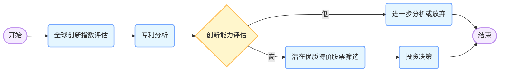

# 特价股票投资中的全球创新指数与专利分析方法

> 关键词：特价股票投资、全球创新指数、专利分析、投资决策、创新能力评估

> 摘要：本文聚焦于特价股票投资领域，深入探讨全球创新指数与专利分析方法在其中的应用。通过对全球创新指数和专利相关概念的介绍，阐述其原理和联系，详细讲解相关算法原理及操作步骤，借助数学模型和公式进行分析并举例说明。同时，结合项目实战给出代码案例及详细解释，探讨其实际应用场景，推荐相关工具和资源，最后总结未来发展趋势与挑战，解答常见问题并提供参考资料，旨在为投资者在特价股票投资中利用创新指数和专利分析做出更明智的决策提供全面的指导。

## 1. 背景介绍 
### 1.1 目的和范围
在当今复杂多变的金融市场中，特价股票投资因其潜在的高回报吸引着众多投资者。然而，如何准确评估特价股票背后公司的价值和潜力是投资者面临的关键问题。全球创新指数反映了一个国家或地区的创新生态系统的综合实力，而专利则是企业创新成果的重要体现。本文章的目的在于深入研究如何将全球创新指数和专利分析方法应用于特价股票投资中，为投资者提供一套科学、有效的分析框架和方法。文章的范围涵盖了全球创新指数和专利分析的基本概念、原理、算法、数学模型，以及在实际投资中的应用案例和工具资源推荐等方面。

### 1.2 预期读者
本文预期读者包括对特价股票投资感兴趣的个人投资者、金融机构的投资分析师、基金经理、相关领域的研究人员以及希望了解创新指数和专利分析在投资领域应用的专业人士。

### 1.3 文档结构概述
本文将按照以下结构进行阐述：首先介绍全球创新指数与专利分析在特价股票投资中的背景信息，包括目的、预期读者和文档结构概述等；接着讲解核心概念与联系，包括全球创新指数和专利的原理及架构，并给出相应的流程图；然后详细阐述核心算法原理和具体操作步骤，结合 Python 源代码进行说明；之后介绍数学模型和公式，并举例说明；再通过项目实战给出代码实际案例和详细解释；探讨实际应用场景；推荐相关的工具和资源；最后总结未来发展趋势与挑战，解答常见问题并提供扩展阅读和参考资料。

### 1.4 术语表
#### 1.4.1 核心术语定义
- **特价股票**：指市场价格相对其内在价值被低估的股票，通常具有较低的市盈率、市净率等估值指标。
- **全球创新指数（Global Innovation Index, GII）**：是一个衡量全球各个国家和地区创新能力的综合指标体系，由世界知识产权组织（WIPO）等机构发布，涵盖了制度、人力资本与研究、基础设施、市场成熟度、商业成熟度、知识与技术产出、创意产出等多个维度。
- **专利**：是专利权的简称，是国家按专利法授予申请人在一定时间内对其发明创造成果所享有的独占、使用和处分的权利，是一种重要的知识产权。

#### 1.4.2 相关概念解释
- **创新生态系统**：是由政府、企业、高校、科研机构、中介服务机构等创新主体，以及创新制度、创新文化、创新资源等要素相互作用、相互影响而形成的复杂系统，全球创新指数反映了这个系统的整体运行效率和创新能力。
- **专利质量**：不仅仅取决于专利的数量，还包括专利的技术含量、市场价值、法律稳定性等多个方面。高质量的专利通常具有更强的技术创新性、更广泛的市场应用前景和更高的法律保护力度。

#### 1.4.3 缩略词列表
- **GII**：Global Innovation Index，全球创新指数
- **WIPO**：World Intellectual Property Organization，世界知识产权组织

## 2. 核心概念与联系 

### 2.1 全球创新指数原理和架构
全球创新指数是通过对多个指标进行综合评估来衡量一个国家或地区的创新能力。其指标体系主要包括以下几个方面：
- **制度**：包括政治环境、监管环境和商业环境等因素，良好的制度环境有利于激发创新活力。
- **人力资本与研究**：涉及教育水平、研发投入、科研人员数量等，是创新的人才和知识基础。
- **基础设施**：如信息通信技术基础设施、交通基础设施等，为创新活动提供物质保障。
- **市场成熟度**：包括市场规模、竞争程度等，成熟的市场有助于创新成果的商业化。
- **商业成熟度**：涵盖企业的创新战略、合作网络等，反映企业的创新能力和活力。
- **知识与技术产出**：如专利申请数量、科技论文发表数量等，是创新成果的直接体现。
- **创意产出**：包括文化产品、设计等方面，体现了创新的多样性和创造性。

全球创新指数的计算是通过对各个指标进行加权平均得到的，不同指标的权重根据其对创新能力的重要性进行设定。

其架构可以用以下文本示意图表示：

全球创新指数
|-- 制度
|   |-- 政治环境
|   |-- 监管环境
|   |-- 商业环境
|-- 人力资本与研究
|   |-- 教育水平
|   |-- 研发投入
|   |-- 科研人员数量
|-- 基础设施
|   |-- 信息通信技术基础设施
|   |-- 交通基础设施
|-- 市场成熟度
|   |-- 市场规模
|   |-- 竞争程度
|-- 商业成熟度
|   |-- 企业创新战略
|   |-- 合作网络
|-- 知识与技术产出
|   |-- 专利申请数量
|   |-- 科技论文发表数量
|-- 创意产出
|   |-- 文化产品
|   |-- 设计

### 2.2 专利分析原理和架构
专利分析是对专利文献进行收集、整理、分析和解读的过程，旨在揭示专利背后的技术趋势、市场动态和竞争态势。专利分析的主要内容包括：
- **专利数量分析**：统计一定时期内的专利申请数量、授权数量等，了解企业或地区的创新活跃度。
- **专利质量分析**：评估专利的技术创新性、市场价值、法律稳定性等，判断专利的质量高低。
- **专利技术领域分析**：确定专利所涉及的技术领域，了解技术分布和发展趋势。
- **专利申请人分析**：分析专利的申请人，包括企业、高校、科研机构等，了解创新主体的情况。
- **专利引文分析**：研究专利之间的引用关系，揭示技术的传承和发展脉络。

专利分析的架构可以用以下文本示意图表示：

专利分析
|-- 专利数量分析
|   |-- 专利申请数量
|   |-- 专利授权数量
|-- 专利质量分析
|   |-- 技术创新性
|   |-- 市场价值
|   |-- 法律稳定性
|-- 专利技术领域分析
|   |-- 技术领域分类
|   |-- 技术发展趋势
|-- 专利申请人分析
|   |-- 企业申请人
|   |-- 高校申请人
|   |-- 科研机构申请人
|-- 专利引文分析
|   |-- 引用关系
|   |-- 技术传承脉络

### 2.3 全球创新指数与专利分析的联系
全球创新指数中的知识与技术产出维度与专利分析密切相关。专利申请数量和授权数量是衡量一个国家或地区创新能力的重要指标之一，在全球创新指数的计算中占有一定的权重。同时，专利分析可以为全球创新指数的评估提供更深入的技术细节和市场信息，有助于更准确地评估创新能力。此外，对于特价股票投资而言，全球创新指数可以反映一个国家或地区的宏观创新环境，而专利分析则可以从微观层面了解企业的创新实力和潜力，两者结合可以为投资者提供更全面的信息，帮助其做出更明智的投资决策。

### 2.4 Mermaid 流程图


## 3. 核心算法原理 & 具体操作步骤 

### 3.1 全球创新指数数据处理算法
全球创新指数数据通常以多个指标的形式呈现，需要进行数据清洗、标准化和加权计算等处理。以下是一个简单的 Python 示例代码，演示如何对全球创新指数数据进行处理：

```python
import pandas as pd
import numpy as np

# 假设这是全球创新指数的原始数据，包含多个指标
data = {
    '国家': ['A', 'B', 'C'],
    '制度': [80, 70, 60],
    '人力资本与研究': [75, 85, 70],
    '基础设施': [85, 75, 65],
    '市场成熟度': [70, 80, 75],
    '商业成熟度': [80, 75, 70],
    '知识与技术产出': [90, 80, 75],
    '创意产出': [75, 85, 70]
}

df = pd.DataFrame(data)

# 提取指标列
columns = ['制度', '人力资本与研究', '基础设施', '市场成熟度', '商业成熟度', '知识与技术产出', '创意产出']

# 数据标准化（使用最小 - 最大标准化）
def min_max_scaling(column):
    return (column - column.min()) / (column.max() - column.min())

for col in columns:
    df[col] = min_max_scaling(df[col])

# 定义指标权重
weights = {
    '制度': 0.1,
    '人力资本与研究': 0.2,
    '基础设施': 0.15,
    '市场成熟度': 0.1,
    '商业成熟度': 0.15,
    '知识与技术产出': 0.2,
    '创意产出': 0.1
}

# 计算全球创新指数得分
df['全球创新指数得分'] = 0
for col in columns:
    df['全球创新指数得分'] += df[col] * weights[col]

print(df)
```

### 3.2 专利分析算法
专利分析涉及多个方面的算法，以下是一个简单的专利数量分析和专利技术领域分析的 Python 示例代码：

```python
import pandas as pd

# 假设这是专利数据，包含专利申请人、技术领域和申请日期
patent_data = {
    '申请人': ['公司 A', '公司 B', '公司 A', '公司 C'],
    '技术领域': ['人工智能', '生物医药', '人工智能', '新能源'],
    '申请日期': ['2020-01-01', '2020-02-01', '2020-03-01', '2020-04-01']
}

df_patent = pd.DataFrame(patent_data)

# 专利数量分析：按申请人统计专利数量
applicant_count = df_patent['申请人'].value_counts()
print('按申请人统计的专利数量：')
print(applicant_count)

# 专利技术领域分析：统计各技术领域的专利数量
technology_count = df_patent['技术领域'].value_counts()
print('按技术领域统计的专利数量：')
print(technology_count)
```

### 3.3 具体操作步骤
#### 3.3.1 全球创新指数数据处理步骤
1. **数据收集**：从官方渠道（如世界知识产权组织网站）获取全球创新指数的相关数据。
2. **数据清洗**：检查数据是否存在缺失值、异常值等，对缺失值进行填充或删除处理，对异常值进行修正或剔除。
3. **数据标准化**：由于不同指标的量纲和取值范围可能不同，需要对数据进行标准化处理，常用的方法有最小 - 最大标准化、Z - 分数标准化等。
4. **确定指标权重**：根据各指标对创新能力的重要性，确定相应的权重。
5. **计算全球创新指数得分**：将标准化后的数据乘以相应的权重，然后求和得到全球创新指数得分。

#### 3.3.2 专利分析操作步骤
1. **数据收集**：从专利数据库（如中国国家知识产权局专利数据库、美国专利商标局数据库等）获取专利数据。
2. **数据预处理**：对专利数据进行清洗、整理，提取关键信息，如专利申请人、技术领域、申请日期等。
3. **专利数量分析**：统计一定时期内的专利申请数量、授权数量等，按申请人、技术领域等进行分类统计。
4. **专利质量分析**：可以通过专利的引用次数、权利要求数量等指标评估专利的质量。
5. **专利技术领域分析**：确定专利所涉及的技术领域，分析技术领域的分布和发展趋势。
6. **专利申请人分析**：了解专利的申请人情况，分析不同申请人的创新能力和竞争态势。

## 4. 数学模型和公式 & 详细讲解 & 举例说明 

### 4.1 全球创新指数计算数学模型
全球创新指数的计算通常采用加权平均的方法，其数学模型可以表示为：

$$GII = \sum_{i=1}^{n} w_i \times x_i$$

其中，$GII$ 表示全球创新指数得分，$n$ 表示指标的数量，$w_i$ 表示第 $i$ 个指标的权重，且 $\sum_{i=1}^{n} w_i = 1$，$x_i$ 表示第 $i$ 个指标的标准化值。

### 4.2 详细讲解
在全球创新指数的计算中，首先需要对各个指标进行标准化处理，以消除量纲和取值范围的影响。常用的标准化方法有最小 - 最大标准化，其公式为：

$$x_{i}^{*} = \frac{x_i - \min(x)}{\max(x) - \min(x)}$$

其中，$x_{i}^{*}$ 表示标准化后的值，$x_i$ 表示原始值，$\min(x)$ 和 $\max(x)$ 分别表示该指标的最小值和最大值。

然后，根据各指标的权重 $w_i$，将标准化后的值 $x_{i}^{*}$ 进行加权求和，得到全球创新指数得分 $GII$。

### 4.3 举例说明
假设我们有三个国家的全球创新指数数据，包含三个指标：制度、人力资本与研究、知识与技术产出，其原始数据如下：

| 国家 | 制度 | 人力资本与研究 | 知识与技术产出 |
|------|------|----------------|----------------|
| A    | 80   | 75             | 90             |
| B    | 70   | 85             | 80             |
| C    | 60   | 70             | 75             |

各指标的权重分别为：制度 $w_1 = 0.3$，人力资本与研究 $w_2 = 0.3$，知识与技术产出 $w_3 = 0.4$。

首先进行最小 - 最大标准化：

对于制度指标：
$\min(x) = 60$，$\max(x) = 80$
$x_{A1}^{*} = \frac{80 - 60}{80 - 60} = 1$
$x_{B1}^{*} = \frac{70 - 60}{80 - 60} = 0.5$
$x_{C1}^{*} = \frac{60 - 60}{80 - 60} = 0$

对于人力资本与研究指标：
$\min(x) = 70$，$\max(x) = 85$
$x_{A2}^{*} = \frac{75 - 70}{85 - 70} = \frac{5}{15} \approx 0.33$
$x_{B2}^{*} = \frac{85 - 70}{85 - 70} = 1$
$x_{C2}^{*} = \frac{70 - 70}{85 - 70} = 0$

对于知识与技术产出指标：
$\min(x) = 75$，$\max(x) = 90$
$x_{A3}^{*} = \frac{90 - 75}{90 - 75} = 1$
$x_{B3}^{*} = \frac{80 - 75}{90 - 75} = \frac{5}{15} \approx 0.33$
$x_{C3}^{*} = \frac{75 - 75}{90 - 75} = 0$

然后计算全球创新指数得分：

对于国家 A：
$GII_A = 0.3 \times 1 + 0.3 \times 0.33 + 0.4 \times 1 = 0.3 + 0.099 + 0.4 = 0.799$

对于国家 B：
$GII_B = 0.3 \times 0.5 + 0.3 \times 1 + 0.4 \times 0.33 = 0.15 + 0.3 + 0.132 = 0.582$

对于国家 C：
$GII_C = 0.3 \times 0 + 0.3 \times 0 + 0.4 \times 0 = 0$


### 4.4 专利分析相关数学模型
#### 4.4.1 专利集中度指数
专利集中度指数可以用来衡量专利在不同申请人或技术领域的集中程度，常用的是赫芬达尔 - 赫希曼指数（Herfindahl - Hirschman Index, HHI），其公式为：

$$HHI = \sum_{i=1}^{n} s_i^2$$

其中，$n$ 表示申请人或技术领域的数量，$s_i$ 表示第 $i$ 个申请人或技术领域的专利数量占总专利数量的比例。

#### 4.4.2 详细讲解
赫芬达尔 - 赫希曼指数的值介于 $0$ 到 $1$ 之间，值越接近 $1$，表示专利越集中在少数申请人或技术领域；值越接近 $0$，表示专利分布越分散。

#### 4.4.3 举例说明
假设我们有一个专利数据集，总专利数量为 $100$ 件，涉及三个申请人，其专利数量分别为：申请人 A 有 $50$ 件，申请人 B 有 $30$ 件，申请人 C 有 $20$ 件。

则申请人 A 的专利比例 $s_1 = \frac{50}{100} = 0.5$，申请人 B 的专利比例 $s_2 = \frac{30}{100} = 0.3$，申请人 C 的专利比例 $s_3 = \frac{20}{100} = 0.2$。

计算赫芬达尔 - 赫希曼指数：
$HHI = 0.5^2 + 0.3^2 + 0.2^2 = 0.25 + 0.09 + 0.04 = 0.38$

这表明专利在这三个申请人之间的分布有一定的集中程度，但不是非常集中。

## 5. 项目实战：代码实际案例和详细解释说明 

### 5.1  开发环境搭建
#### 5.1.1 安装 Python
首先需要安装 Python 环境，建议使用 Python 3.7 及以上版本。可以从 Python 官方网站（https://www.python.org/downloads/）下载对应操作系统的安装包，按照安装向导进行安装。

#### 5.1.2 安装必要的库
在项目中需要使用到一些 Python 库，如 `pandas`、`numpy` 等。可以使用 `pip` 命令进行安装：

```sh
pip install pandas numpy
```

### 5.2  源代码详细实现和代码解读
以下是一个综合的项目实战代码，结合全球创新指数数据处理和专利分析，用于筛选潜在的优质特价股票：

```python
import pandas as pd
import numpy as np

# 全球创新指数数据处理
def process_gii_data(gii_data, weights):
    columns = list(weights.keys())
    # 数据标准化（使用最小 - 最大标准化）
    def min_max_scaling(column):
        return (column - column.min()) / (column.max() - column.min())
    for col in columns:
        gii_data[col] = min_max_scaling(gii_data[col])
    # 计算全球创新指数得分
    gii_data['全球创新指数得分'] = 0
    for col in columns:
        gii_data['全球创新指数得分'] += gii_data[col] * weights[col]
    return gii_data

# 专利分析
def patent_analysis(patent_data):
    # 专利数量分析：按申请人统计专利数量
    applicant_count = patent_data['申请人'].value_counts()
    # 专利技术领域分析：统计各技术领域的专利数量
    technology_count = patent_data['技术领域'].value_counts()
    return applicant_count, technology_count

# 筛选潜在优质特价股票
def select_potential_stocks(gii_data, patent_data, stock_data):
    # 假设全球创新指数得分高且专利数量多的国家或企业对应的股票为潜在优质特价股票
    high_gii_countries = gii_data[gii_data['全球创新指数得分'] > gii_data['全球创新指数得分'].mean()]['国家'].tolist()
    top_applicants = patent_data['申请人'].value_counts().nlargest(10).index.tolist()
    potential_stocks = []
    for index, row in stock_data.iterrows():
        if row['国家'] in high_gii_countries and row['公司'] in top_applicants:
            potential_stocks.append(row['股票代码'])
    return potential_stocks

# 示例数据
gii_data = {
    '国家': ['A', 'B', 'C'],
    '制度': [80, 70, 60],
    '人力资本与研究': [75, 85, 70],
    '基础设施': [85, 75, 65],
    '市场成熟度': [70, 80, 75],
    '商业成熟度': [80, 75, 70],
    '知识与技术产出': [90, 80, 75],
    '创意产出': [75, 85, 70]
}
gii_df = pd.DataFrame(gii_data)

weights = {
    '制度': 0.1,
    '人力资本与研究': 0.2,
    '基础设施': 0.15,
    '市场成熟度': 0.1,
    '商业成熟度': 0.15,
    '知识与技术产出': 0.2,
    '创意产出': 0.1
}

patent_data = {
    '申请人': ['公司 A', '公司 B', '公司 A', '公司 C'],
    '技术领域': ['人工智能', '生物医药', '人工智能', '新能源'],
    '申请日期': ['2020-01-01', '2020-02-01', '2020-03-01', '2020-04-01']
}
patent_df = pd.DataFrame(patent_data)

stock_data = {
    '股票代码': ['0001', '0002', '0003'],
    '国家': ['A', 'B', 'C'],
    '公司': ['公司 A', '公司 B', '公司 C']
}
stock_df = pd.DataFrame(stock_data)

# 处理全球创新指数数据
processed_gii_df = process_gii_data(gii_df, weights)
print('处理后的全球创新指数数据：')
print(processed_gii_df)

# 进行专利分析
applicant_count, technology_count = patent_analysis(patent_df)
print('按申请人统计的专利数量：')
print(applicant_count)
print('按技术领域统计的专利数量：')
print(technology_count)

# 筛选潜在优质特价股票
potential_stocks = select_potential_stocks(processed_gii_df, patent_df, stock_df)
print('潜在优质特价股票代码：')
print(potential_stocks)
```

### 5.3  代码解读与分析
#### 5.3.1 全球创新指数数据处理函数 `process_gii_data`
- 该函数接受全球创新指数数据和指标权重作为输入。
- 首先对数据进行最小 - 最大标准化处理，消除量纲和取值范围的影响。
- 然后根据指标权重计算全球创新指数得分，并将结果添加到数据框中返回。

#### 5.3.2 专利分析函数 `patent_analysis`
- 该函数接受专利数据作为输入。
- 分别统计按申请人和技术领域的专利数量，并返回这两个统计结果。

#### 5.3.3 筛选潜在优质特价股票函数 `select_potential_stocks`
- 该函数接受处理后的全球创新指数数据、专利数据和股票数据作为输入。
- 筛选出全球创新指数得分高于平均水平的国家和专利数量排名前 10 的申请人。
- 找出同时满足这两个条件的股票代码，并返回这些股票代码列表。

#### 5.3.4 主程序部分
- 定义了示例的全球创新指数数据、专利数据和股票数据。
- 调用 `process_gii_data` 函数处理全球创新指数数据。
- 调用 `patent_analysis` 函数进行专利分析。
- 调用 `select_potential_stocks` 函数筛选潜在优质特价股票，并打印结果。

## 6. 实际应用场景 
### 6.1 投资者决策参考
对于个人投资者和机构投资者来说，全球创新指数和专利分析可以作为投资决策的重要参考依据。投资者可以通过分析不同国家和企业的全球创新指数得分和专利情况，筛选出具有创新潜力的特价股票。例如，一个国家的全球创新指数得分较高，说明其创新生态系统较为完善，企业在这样的环境中更有可能开展创新活动，其股票可能具有较高的投资价值。同时，企业的专利数量和质量也可以反映其技术实力和市场竞争力，专利数量多且质量高的企业往往具有更强的盈利能力和发展潜力。

### 6.2 企业战略规划
企业可以利用全球创新指数和专利分析来制定战略规划。通过研究全球创新指数，企业可以了解不同国家和地区的创新环境，选择合适的投资和研发地点。例如，企业可以将研发中心设立在全球创新指数较高的国家或地区，以获取更好的创新资源和人才支持。同时，企业可以通过专利分析了解竞争对手的技术动态和创新方向，从而调整自身的研发策略，提高自身的创新能力和市场竞争力。

### 6.3 政府政策制定
政府部门可以根据全球创新指数和专利分析结果制定相关政策，促进创新和经济发展。全球创新指数可以反映一个国家或地区在创新方面的优势和不足，政府可以针对这些问题制定相应的政策措施，如加大对教育和研发的投入、改善创新基础设施、优化创新制度环境等。专利分析可以帮助政府了解不同产业的创新情况，从而有针对性地支持重点产业的发展，推动产业升级和转型。

### 6.4 学术研究
在学术研究领域，全球创新指数和专利分析也具有重要的应用价值。学者可以利用这些数据和方法研究创新的影响因素、创新与经济增长的关系、技术创新的扩散机制等问题。例如，通过分析全球创新指数的变化趋势和影响因素，学者可以探讨如何提高一个国家或地区的创新能力；通过专利分析，学者可以研究技术创新的演化规律和技术转移的模式。

## 7. 工具和资源推荐
### 7.1 学习资源推荐
#### 7.1.1 书籍推荐
- 《创新经济学》：这本书系统地介绍了创新经济学的基本理论和方法，包括创新的概念、创新的影响因素、创新与经济增长的关系等内容，对于理解全球创新指数的理论基础具有重要的参考价值。
- 《专利信息分析与利用》：详细讲解了专利分析的方法和技巧，包括专利数据的收集、整理、分析和解读等方面的内容，是学习专利分析的重要参考书籍。
- 《金融市场与金融机构》：涵盖了金融市场的基本原理和金融机构的运作机制，对于理解特价股票投资的背景和环境有很大帮助。

#### 7.1.2 在线课程
- Coursera 平台上的“创新管理与创业”课程：由知名高校的教授授课，介绍了创新管理的理论和实践，包括创新战略、创新团队管理、创新商业模式等内容。
- edX 平台上的“专利数据分析与应用”课程：提供了专利数据分析的基本方法和工具，通过实际案例让学习者掌握专利分析的技能。
- 中国大学 MOOC 平台上的“金融投资学”课程：系统地讲解了金融投资的基本理论和方法，包括股票投资、债券投资、基金投资等方面的内容。

#### 7.1.3 技术博客和网站
- 世界知识产权组织（WIPO）官网（https://www.wipo.int/）：提供全球创新指数的最新数据和报告，以及专利相关的政策、法规和研究成果。
- 中国国家知识产权局官网（https://www.cnipa.gov.cn/）：可以查询中国的专利数据，了解专利申请、审查和授权等方面的信息。
- 金融界网站（https://www.jrj.com.cn/）：提供丰富的金融市场信息和投资分析工具，对于特价股票投资有一定的参考价值。

### 7.2 开发工具框架推荐
#### 7.2.1 IDE和编辑器
- PyCharm：是一款专门为 Python 开发设计的集成开发环境（IDE），具有强大的代码编辑、调试和项目管理功能，适合进行 Python 数据分析和开发。
- Jupyter Notebook：是一个基于 Web 的交互式计算环境，支持多种编程语言，尤其适合进行数据探索和分析，方便用户编写和分享代码、文档和可视化结果。

#### 7.2.2 调试和性能分析工具
- PDB：Python 自带的调试工具，可以帮助开发者在代码中设置断点、查看变量值、单步执行代码等，用于调试 Python 程序。
- cProfile：Python 标准库中的性能分析工具，可以统计代码的运行时间和函数调用次数，帮助开发者找出性能瓶颈。

#### 7.2.3 相关框架和库
- Pandas：是一个强大的数据分析库，提供了高效的数据结构和数据处理功能，如数据读取、清洗、转换、分析等，在全球创新指数数据处理和专利数据分析中都有广泛的应用。
- Numpy：是 Python 的一个科学计算库，提供了高效的多维数组对象和数学函数，用于进行数值计算和数据处理。
- Matplotlib：是一个用于数据可视化的 Python 库，可以绘制各种类型的图表，如折线图、柱状图、散点图等，帮助用户直观地展示数据。

### 7.3 相关论文著作推荐
#### 7.3.1 经典论文
- “The Measurement of Technological Change” by Zvi Griliches：该论文探讨了技术变革的测量方法，对于理解全球创新指数中技术产出指标的计算和评估具有重要的启示作用。
- “Patent Statistics as Economic Indicators: A Survey” by Wesley M. Cohen, Richard R. Nelson, and John P. Walsh：对专利统计作为经济指标的相关研究进行了综述，分析了专利数据在经济分析中的应用和局限性。

#### 7.3.2 最新研究成果
- 关注《Research Policy》、《Journal of Economic Growth》等学术期刊上发表的关于创新、专利和经济增长的最新研究成果，了解该领域的前沿动态和研究趋势。

#### 7.3.3 应用案例分析
- 一些咨询公司和研究机构发布的关于创新指数和专利分析在投资、企业战略和政府政策制定中的应用案例报告，如麦肯锡公司、波士顿咨询公司等发布的相关报告，可以为实际应用提供参考和借鉴。

## 8. 总结：未来发展趋势与挑战
### 8.1 未来发展趋势
#### 8.1.1 数据来源和分析方法的不断丰富
随着信息技术的发展和数据资源的不断丰富，全球创新指数和专利分析的数据来源将更加多元化。除了传统的官方统计数据和专利数据库，社交媒体数据、企业财务数据、科研机构的研究成果等都可能成为创新分析的重要数据来源。同时，分析方法也将不断创新，如利用人工智能和机器学习算法进行数据挖掘和预测，提高分析的准确性和效率。

#### 8.1.2 与其他领域的融合发展
全球创新指数和专利分析将与金融科技、大数据、区块链等领域深度融合。例如，利用区块链技术保证专利数据的真实性和安全性，利用金融科技手段开发创新投资产品和服务。此外，创新分析还将与环境、健康、能源等领域相结合，为解决全球性问题提供创新解决方案。

#### 8.1.3 更加注重创新质量和可持续性
未来的全球创新指数和专利分析将不仅仅关注创新的数量，更将注重创新的质量和可持续性。例如，评估专利的技术影响力、市场价值和社会贡献，考虑创新对环境和社会的影响等。这将促使企业和国家更加注重创新的内涵和价值，推动创新向高质量、可持续的方向发展。

### 8.2 挑战
#### 8.2.1 数据质量和标准化问题
全球创新指数和专利分析需要大量的数据支持，但不同数据源的数据质量和格式可能存在差异，这给数据的整合和分析带来了挑战。此外，目前还缺乏统一的数据标准和规范，导致不同机构和研究人员的分析结果可能存在差异，影响了分析结果的可比性和可信度。

#### 8.2.2 技术复杂性和人才短缺
随着分析方法的不断创新和数据量的不断增加，全球创新指数和专利分析的技术复杂性也在不断提高。这需要具备专业知识和技能的人才来进行数据分析和解读，但目前相关领域的专业人才相对短缺，制约了创新分析的发展。

#### 8.2.3 法律和政策障碍
在全球创新指数和专利分析的应用过程中，可能会涉及到知识产权保护、数据隐私等法律和政策问题。例如，专利数据的获取和使用需要遵守相关的法律法规，数据隐私保护也对数据的收集、存储和分析提出了更高的要求。如何在遵守法律和政策的前提下，充分发挥创新分析的作用，是需要解决的重要问题。

## 9. 附录：常见问题与解答
### 9.1 全球创新指数的数据多久更新一次？
全球创新指数的数据通常每年更新一次，由世界知识产权组织等机构发布年度报告，报告中包含了最新的全球创新指数排名和相关数据。

### 9.2 专利分析中如何评估专利的质量？
评估专利质量可以从多个方面进行，如专利的技术创新性、市场价值、法律稳定性等。常用的指标包括专利的引用次数、权利要求数量、专利的家族规模等。引用次数越多、权利要求数量越多、家族规模越大的专利，通常质量越高。

### 9.3 全球创新指数和专利分析在特价股票投资中的准确性如何？
全球创新指数和专利分析只是投资决策的参考依据之一，不能完全保证投资的准确性。投资决策还需要考虑其他因素，如宏观经济环境、行业发展趋势、企业财务状况等。此外，全球创新指数和专利分析的数据和方法也存在一定的局限性，需要投资者进行综合分析和判断。

### 9.4 如何获取全球创新指数和专利数据？
全球创新指数数据可以从世界知识产权组织官网等官方渠道获取。专利数据可以从各国的专利数据库获取，如中国国家知识产权局专利数据库、美国专利商标局数据库等。此外，一些商业数据库也提供专利数据服务，如汤森路透的德温特专利数据库等。

### 9.5 专利分析是否只适用于高科技行业？
不是的，专利分析适用于各个行业。虽然高科技行业的专利活动相对较为活跃，但传统行业也有很多创新成果可以通过专利来保护。通过专利分析，传统行业的企业可以了解行业的技术发展趋势，发现潜在的创新机会，提高自身的竞争力。

## 10. 扩展阅读 & 参考资料
### 10.1 扩展阅读
- 《国家创新驱动发展战略纲要》：了解国家层面的创新发展战略和政策导向。
- 《知识产权强国建设纲要（2021－2035 年）》：关注知识产权保护和创新发展的长期规划和目标。

### 10.2 参考资料
- 世界知识产权组织（WIPO）发布的《全球创新指数报告》。
- 中国国家知识产权局发布的专利统计年报和相关政策文件。
- 相关学术期刊上发表的关于全球创新指数、专利分析和投资决策的研究论文。