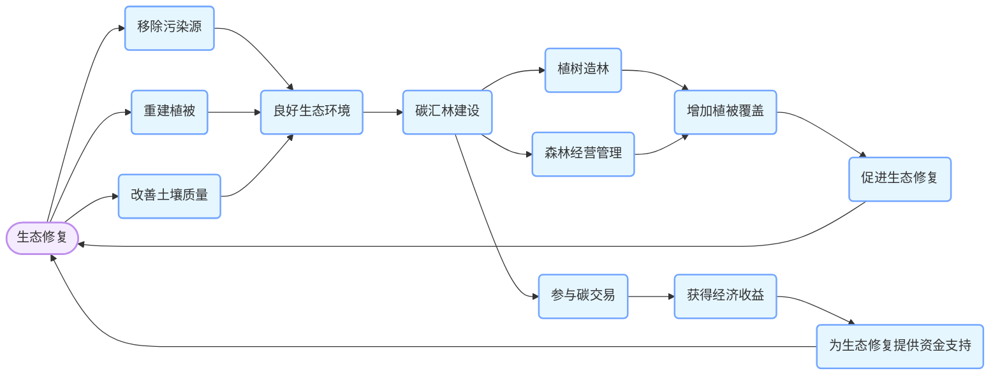

# 生态修复与碳汇林项目的投资回报分析

> 关键词：生态修复、碳汇林、投资回报、碳交易、生态效益

> 摘要：本文围绕生态修复与碳汇林项目的投资回报展开深入分析。首先介绍了项目的背景，包括目的、预期读者等内容。接着阐述了生态修复与碳汇林的核心概念及相互联系，详细讲解了相关的核心算法原理与操作步骤，同时给出数学模型和公式并举例说明。通过项目实战部分，展示了代码实现及解读。分析了该项目的实际应用场景，推荐了相关的工具和资源。最后总结了项目未来发展趋势与挑战，解答常见问题并提供扩展阅读和参考资料，旨在为投资者和相关从业者全面呈现生态修复与碳汇林项目的投资回报情况，为决策提供科学依据。

## 1. 背景介绍 
### 1.1 目的和范围
生态修复与碳汇林项目在当前全球应对气候变化和生态环境恶化的背景下具有重要意义。本项目的目的在于通过对生态系统的修复和碳汇林的建设，实现生态环境的改善、碳减排以及获取相应的经济回报。范围涵盖了从项目的规划、建设、运营到评估的全过程，包括生态修复工程的实施、碳汇林的种植与管理、碳交易市场的参与等方面。

### 1.2 预期读者
本文预期读者包括对生态修复与碳汇林项目有投资意向的投资者，如金融机构、企业和个人投资者；从事生态环境领域研究和实践的科研人员与从业者，如生态学家、林业专家等；以及关注气候变化和可持续发展政策制定的政府部门工作人员。

### 1.3 文档结构概述
本文首先介绍项目背景，让读者了解项目的目的和相关信息。接着阐述核心概念与联系，使读者对生态修复与碳汇林有清晰的认识。然后详细讲解核心算法原理、数学模型和公式，为项目的投资回报分析提供理论基础。通过项目实战部分，展示实际操作中的代码实现和解读。分析实际应用场景，让读者了解项目的可行性和应用价值。推荐相关的工具和资源，方便读者进一步学习和研究。最后总结未来发展趋势与挑战，解答常见问题并提供参考资料，使读者对整个项目有全面的了解。

### 1.4 术语表
#### 1.4.1 核心术语定义
- **生态修复**：指对生态系统停止人为干扰，以减轻负荷压力，依靠生态系统的自我调节能力与自组织能力使其向有序的方向进行演化，或者利用生态系统的这种自我恢复能力，辅以人工措施，使遭到破坏的生态系统逐步恢复或使生态系统向良性循环方向发展。
- **碳汇林**：是指通过植树造林、森林经营管理、植被恢复等活动，吸收和固定大气中的二氧化碳，并按照相关规则与碳汇交易相结合的林业项目。
- **碳交易**：是为促进全球温室气体减排，减少全球二氧化碳排放所采用的市场机制。

#### 1.4.2 相关概念解释
- **碳汇**：是指通过植树造林、植被恢复等措施，吸收大气中的二氧化碳，从而减少温室气体在大气中浓度的过程、活动或机制。
- **生态效益**：是指人们在生产中依据生态平衡规律，使自然界的生物系统对人类的生产、生活条件和环境条件产生的有益影响和有利效果，它关系到人类生存发展的根本利益和长远利益。

#### 1.4.3 缩略词列表
- **CDM**：清洁发展机制（Clean Development Mechanism），是《京都议定书》中引入的灵活履约机制之一。
- **CCER**：国家核证自愿减排量（China Certified Emission Reduction），是指依据国家发展和改革委员会发布的相关规定，经其备案并在国家注册登记系统中登记的温室气体自愿减排量。

## 2. 核心概念与联系 

### 生态修复与碳汇林的核心概念原理
生态修复的原理基于生态系统的自我调节和自我恢复能力。生态系统具有一定的弹性和稳定性，当受到外界干扰时，在一定程度上能够自行恢复。但当干扰超过其承受能力时，就需要人工干预来促进生态系统的恢复。人工干预措施包括移除污染源、重建植被、改善土壤质量等，以恢复生态系统的结构和功能。

碳汇林的原理是利用树木的光合作用。树木通过吸收二氧化碳，将其转化为有机物质并储存起来，从而减少大气中的二氧化碳浓度。不同树种的碳汇能力不同，一般来说，生长速度快、寿命长、生物量大的树种具有较高的碳汇潜力。

### 生态修复与碳汇林的架构关系
生态修复与碳汇林之间存在着紧密的联系。生态修复可以为碳汇林的建设提供良好的生态环境基础。例如，通过对退化土地的修复，改善土壤质量和水分条件，有利于树木的生长和存活，从而提高碳汇林的碳汇能力。

另一方面，碳汇林的建设也是生态修复的重要手段之一。树木的种植可以增加植被覆盖，防止水土流失，改善局部气候，促进生态系统的恢复和稳定。同时，碳汇林项目通过参与碳交易市场，可以获得经济收益，为生态修复项目提供资金支持，形成良性循环。

### 文本示意图
生态修复与碳汇林的关系可以用以下示意图表示：

生态修复（移除污染源、重建植被、改善土壤质量等） -> 创造良好生态环境 -> 有利于碳汇林建设（树木生长、存活）
碳汇林建设（植树造林、森林经营管理） -> 增加植被覆盖、改善气候等 -> 促进生态修复
碳汇林项目（参与碳交易） -> 获得经济收益 -> 为生态修复提供资金支持

### Mermaid 流程图


## 3. 核心算法原理 & 具体操作步骤 

### 碳汇量计算算法原理
碳汇量的计算是评估碳汇林项目投资回报的关键环节。其基本原理是根据树木的生长情况和相关参数，计算出树木吸收的二氧化碳量。

常见的碳汇量计算方法有生物量法和蓄积量法。这里以生物量法为例进行介绍。生物量法的基本思路是先计算出树木的生物量，然后根据生物量与碳含量的关系，计算出树木的碳储量，最后将碳储量转换为二氧化碳吸收量。

### Python 源代码实现
```python
# 定义树木生物量计算函数
def calculate_biomass(height, diameter):
    """
    根据树木的高度和直径计算生物量
    :param height: 树木高度（米）
    :param diameter: 树木直径（厘米）
    :return: 生物量（千克）
    """
    # 这里使用一个简化的经验公式，实际应用中需要根据不同树种进行调整
    biomass = 0.1 * height * diameter ** 2
    return biomass

# 定义碳储量计算函数
def calculate_carbon_storage(biomass):
    """
    根据生物量计算碳储量
    :param biomass: 生物量（千克）
    :return: 碳储量（千克）
    """
    # 一般树木的碳含量约为 0.5
    carbon_storage = biomass * 0.5
    return carbon_storage

# 定义二氧化碳吸收量计算函数
def calculate_co2_absorption(carbon_storage):
    """
    根据碳储量计算二氧化碳吸收量
    :param carbon_storage: 碳储量（千克）
    :return: 二氧化碳吸收量（千克）
    """
    # 碳转换为二氧化碳的系数为 44/12
    co2_absorption = carbon_storage * (44 / 12)
    return co2_absorption

# 示例：计算一棵高度为 10 米，直径为 20 厘米的树木的碳汇量
height = 10
diameter = 20
biomass = calculate_biomass(height, diameter)
carbon_storage = calculate_carbon_storage(biomass)
co2_absorption = calculate_co2_absorption(carbon_storage)

print(f"树木生物量: {biomass} 千克")
print(f"树木碳储量: {carbon_storage} 千克")
print(f"树木二氧化碳吸收量: {co2_absorption} 千克")
```

### 具体操作步骤
1. **数据收集**：收集树木的相关参数，如高度、直径、树种等。这些数据可以通过实地测量或查阅相关资料获得。
2. **生物量计算**：根据收集到的树木参数，使用生物量计算函数计算树木的生物量。
3. **碳储量计算**：根据生物量计算树木的碳储量。
4. **二氧化碳吸收量计算**：根据碳储量计算树木的二氧化碳吸收量。
5. **汇总和分析**：将所有树木的二氧化碳吸收量进行汇总，得到整个碳汇林的碳汇量。同时，对碳汇量进行分析，评估碳汇林项目的效益。

## 4. 数学模型和公式 & 详细讲解 & 举例说明 

### 生物量计算模型
生物量的计算通常使用经验公式，不同树种的经验公式可能不同。一般来说，生物量与树木的高度和直径有关。常见的经验公式为：

$$B = a \times H^b \times D^c$$

其中，$B$ 表示生物量（千克），$H$ 表示树木高度（米），$D$ 表示树木直径（厘米），$a$、$b$、$c$ 为经验系数，需要根据不同树种进行确定。

在上述 Python 代码中，我们使用了一个简化的经验公式：

$$B = 0.1 \times H \times D^2$$

### 碳储量计算模型
树木的碳储量可以通过生物量乘以碳含量来计算。一般来说，树木的碳含量约为 0.5，即：

$$C = B \times 0.5$$

其中，$C$ 表示碳储量（千克），$B$ 表示生物量（千克）。

### 二氧化碳吸收量计算模型
碳转换为二氧化碳的化学计量关系为：1 摩尔的碳（12 克）与 1 摩尔的氧气反应生成 1 摩尔的二氧化碳（44 克）。因此，碳转换为二氧化碳的系数为 $\frac{44}{12}$。二氧化碳吸收量的计算公式为：

$$CO_2 = C \times \frac{44}{12}$$

其中，$CO_2$ 表示二氧化碳吸收量（千克），$C$ 表示碳储量（千克）。

### 举例说明
假设有一棵树木，高度为 15 米，直径为 25 厘米。

1. **生物量计算**：
使用简化的经验公式 $B = 0.1 \times H \times D^2$，可得：
$B = 0.1 \times 15 \times 25^2 = 937.5$（千克）

2. **碳储量计算**：
使用公式 $C = B \times 0.5$，可得：
$C = 937.5 \times 0.5 = 468.75$（千克）

3. **二氧化碳吸收量计算**：
使用公式 $CO_2 = C \times \frac{44}{12}$，可得：
$CO_2 = 468.75 \times \frac{44}{12} = 1718.75$（千克）

因此，这棵树木的生物量为 937.5 千克，碳储量为 468.75 千克，二氧化碳吸收量为 1718.75 千克。

## 5. 项目实战：代码实际案例和详细解释说明 

### 5.1  开发环境搭建
- **操作系统**：建议使用 Linux 或 macOS 系统，也可以使用 Windows 系统。
- **Python 版本**：建议使用 Python 3.7 及以上版本。
- **开发工具**：可以使用 PyCharm、VS Code 等集成开发环境，也可以使用 Jupyter Notebook 进行交互式开发。
- **依赖库**：本项目主要使用 Python 的内置库，无需额外安装依赖库。

### 5.2  源代码详细实现和代码解读
```python
# 定义树木生物量计算函数
def calculate_biomass(height, diameter):
    """
    根据树木的高度和直径计算生物量
    :param height: 树木高度（米）
    :param diameter: 树木直径（厘米）
    :return: 生物量（千克）
    """
    # 这里使用一个简化的经验公式，实际应用中需要根据不同树种进行调整
    biomass = 0.1 * height * diameter ** 2
    return biomass

# 定义碳储量计算函数
def calculate_carbon_storage(biomass):
    """
    根据生物量计算碳储量
    :param biomass: 生物量（千克）
    :return: 碳储量（千克）
    """
    # 一般树木的碳含量约为 0.5
    carbon_storage = biomass * 0.5
    return carbon_storage

# 定义二氧化碳吸收量计算函数
def calculate_co2_absorption(carbon_storage):
    """
    根据碳储量计算二氧化碳吸收量
    :param carbon_storage: 碳储量（千克）
    :return: 二氧化碳吸收量（千克）
    """
    # 碳转换为二氧化碳的系数为 44/12
    co2_absorption = carbon_storage * (44 / 12)
    return co2_absorption

# 定义计算整个碳汇林碳汇量的函数
def calculate_total_co2_absorption(tree_data):
    """
    计算整个碳汇林的二氧化碳吸收量
    :param tree_data: 包含树木高度和直径的列表，每个元素为 (height, diameter) 元组
    :return: 整个碳汇林的二氧化碳吸收量（千克）
    """
    total_co2_absorption = 0
    for height, diameter in tree_data:
        biomass = calculate_biomass(height, diameter)
        carbon_storage = calculate_carbon_storage(biomass)
        co2_absorption = calculate_co2_absorption(carbon_storage)
        total_co2_absorption += co2_absorption
    return total_co2_absorption

# 示例数据：假设有三棵树
tree_data = [(10, 20), (12, 22), (15, 25)]

# 计算整个碳汇林的二氧化碳吸收量
total_co2_absorption = calculate_total_co2_absorption(tree_data)

print(f"整个碳汇林的二氧化碳吸收量: {total_co2_absorption} 千克")
```

### 代码解读与分析
- **`calculate_biomass` 函数**：该函数接受树木的高度和直径作为输入，使用简化的经验公式计算树木的生物量。
- **`calculate_carbon_storage` 函数**：该函数接受生物量作为输入，根据树木的碳含量（约为 0.5）计算树木的碳储量。
- **`calculate_co2_absorption` 函数**：该函数接受碳储量作为输入，根据碳转换为二氧化碳的系数（$\frac{44}{12}$）计算树木的二氧化碳吸收量。
- **`calculate_total_co2_absorption` 函数**：该函数接受一个包含树木高度和直径的列表作为输入，遍历列表中的每棵树，计算每棵树的二氧化碳吸收量，并将其累加，得到整个碳汇林的二氧化碳吸收量。

通过这个代码示例，我们可以计算出整个碳汇林的碳汇量，为评估碳汇林项目的投资回报提供数据支持。

## 6. 实际应用场景 
### 生态环境改善
生态修复与碳汇林项目可以有效地改善生态环境。通过植树造林和生态修复工程，可以增加植被覆盖，防止水土流失，改善土壤质量，提高生态系统的稳定性和服务功能。例如，在一些水土流失严重的地区，通过种植碳汇林，可以固定土壤，减少泥沙流失，保护水资源。

### 碳减排与碳交易
碳汇林项目可以吸收大气中的二氧化碳，减少温室气体排放，为应对气候变化做出贡献。同时，碳汇林项目可以参与碳交易市场，将其产生的碳汇量转化为经济收益。例如，企业可以通过购买碳汇林项目产生的碳减排量来抵消自身的碳排放，实现碳中和目标。

### 可持续发展与绿色金融
生态修复与碳汇林项目符合可持续发展的理念，可以促进经济、社会和环境的协调发展。同时，该项目也为绿色金融提供了新的投资领域。投资者可以通过投资碳汇林项目，获得经济回报的同时，也为环境保护做出贡献。例如，一些金融机构已经开始推出碳汇林投资基金，吸引投资者参与。

### 乡村振兴与产业发展
生态修复与碳汇林项目可以为乡村地区带来新的发展机遇。通过发展碳汇林产业，可以增加农民的收入，促进农村经济的发展。例如，农民可以参与碳汇林的种植和管理，获得劳务收入；同时，碳汇林项目产生的经济收益也可以用于农村基础设施建设和公共服务改善。

## 7. 工具和资源推荐
### 7.1 学习资源推荐
#### 7.1.1 书籍推荐
- 《生态修复工程学》：全面介绍了生态修复的基本理论、技术和方法，为生态修复项目的实施提供了理论支持。
- 《碳汇林业》：系统阐述了碳汇林的概念、原理、技术和管理，对碳汇林项目的规划和实施具有重要的指导意义。
- 《气候变化经济学》：探讨了气候变化对经济和社会的影响，以及应对气候变化的经济政策和措施，为碳汇林项目的投资回报分析提供了经济学视角。

#### 7.1.2 在线课程
- Coursera 上的“Climate Change and Business”：该课程介绍了气候变化对企业的影响，以及企业如何应对气候变化，包括碳减排和碳交易等内容。
- edX 上的“Ecosystem Restoration”：该课程讲解了生态系统修复的原理、技术和案例，有助于学习者深入了解生态修复的相关知识。
- 中国大学 MOOC 上的“森林碳汇与计量”：该课程系统介绍了森林碳汇的概念、计量方法和碳交易机制，为学习者提供了碳汇林项目的专业知识。

#### 7.1.3 技术博客和网站
- 中国碳交易网：提供了碳交易市场的最新动态、政策法规和交易信息，是了解碳交易市场的重要平台。
- 生态环境部官网：发布了生态环境保护的相关政策、法规和标准，为生态修复项目的实施提供了政策依据。
- 国际林业研究组织联盟（IUFRO）官网：提供了林业领域的最新研究成果和技术信息，对碳汇林项目的规划和管理具有参考价值。

### 7.2 开发工具框架推荐
#### 7.2.1 IDE和编辑器
- PyCharm：是一款专门为 Python 开发设计的集成开发环境，具有强大的代码编辑、调试和分析功能，适合开发碳汇林项目的相关代码。
- VS Code：是一款轻量级的代码编辑器，支持多种编程语言，具有丰富的插件扩展功能，可以满足不同开发需求。
- Jupyter Notebook：是一种交互式开发环境，适合进行数据分析和模型验证，方便对碳汇林项目的相关数据进行处理和分析。

#### 7.2.2 调试和性能分析工具
- PySnooper：是一个简单易用的 Python 调试工具，可以在不修改代码的情况下，实时输出函数的执行过程和变量的值，方便调试代码。
- cProfile：是 Python 内置的性能分析工具，可以分析代码的运行时间和函数调用情况，帮助优化代码性能。
- Memory Profiler：是一个 Python 内存分析工具，可以分析代码的内存使用情况，帮助发现内存泄漏问题。

#### 7.2.3 相关框架和库
- Pandas：是一个强大的数据分析库，提供了高效的数据结构和数据处理工具，适合对碳汇林项目的相关数据进行处理和分析。
- NumPy：是一个基础的科学计算库，提供了高效的数组操作和数学函数，为碳汇林项目的数学模型计算提供了支持。
- Matplotlib：是一个常用的绘图库，提供了丰富的绘图功能，适合对碳汇林项目的数据分析结果进行可视化展示。

### 7.3 相关论文著作推荐
#### 7.3.1 经典论文
- “The Economics of Ecosystems and Biodiversity (TEEB)”：该论文探讨了生态系统和生物多样性的经济价值，强调了保护生态系统和生物多样性的重要性。
- “Carbon Sequestration in Tropical Forest Ecosystems”：该论文研究了热带森林生态系统的碳汇功能和潜力，为碳汇林项目的规划和实施提供了科学依据。
- “The Role of Forest Carbon Sequestration in Climate Change Mitigation”：该论文分析了森林碳汇在气候变化减缓中的作用和地位，对碳汇林项目的政策制定具有重要的参考价值。

#### 7.3.2 最新研究成果
- 关注《Nature》《Science》等国际顶级学术期刊，这些期刊经常发表关于生态环境和气候变化的最新研究成果。
- 关注国内的《生态学报》《林业科学》等学术期刊，这些期刊也发表了很多关于生态修复和碳汇林的研究论文。

#### 7.3.3 应用案例分析
- 一些国际组织和机构发布的碳汇林项目案例报告，如世界银行、联合国环境规划署等发布的相关报告，这些案例报告可以为实际项目的实施提供参考和借鉴。
- 国内一些企业和科研机构开展的碳汇林项目案例，如中国绿色碳汇基金会开展的相关项目，这些案例可以了解国内碳汇林项目的实践经验和发展现状。

## 8. 总结：未来发展趋势与挑战
### 未来发展趋势
- **政策支持力度加大**：随着全球对气候变化问题的重视，各国政府将出台更多的政策支持生态修复与碳汇林项目的发展。例如，加大对碳汇林项目的补贴力度，完善碳交易市场机制等。
- **技术创新不断推进**：随着科技的不断进步，生态修复和碳汇林领域将涌现出更多的新技术和新方法。例如，利用无人机进行森林监测和管理，利用基因编辑技术培育高碳汇树种等。
- **市场需求不断增长**：随着企业和社会对碳减排和可持续发展的认识不断提高，对碳汇林项目的市场需求将不断增长。例如，越来越多的企业将通过购买碳汇来实现碳中和目标，为碳汇林项目带来更多的经济收益。
- **国际合作日益加强**：气候变化是全球性问题，需要各国共同应对。未来，国际间在生态修复与碳汇林项目方面的合作将日益加强。例如，开展跨国碳汇林项目合作，共享技术和经验等。

### 挑战
- **技术难题**：目前，生态修复和碳汇林领域还存在一些技术难题，如高碳汇树种的选育、森林病虫害的防治等。这些技术难题需要进一步的研究和创新来解决。
- **资金短缺**：生态修复与碳汇林项目需要大量的资金投入，包括土地购置、树苗种植、森林管理等费用。目前，资金短缺是制约项目发展的重要因素之一。
- **政策不确定性**：碳交易市场的政策和规则还不够完善，存在一定的不确定性。例如，碳价波动较大，碳减排标准和认证机制不够统一等。这些政策不确定性增加了碳汇林项目的投资风险。
- **社会认知不足**：部分社会公众对生态修复和碳汇林项目的重要性认识不足，对项目的支持和参与度不高。这需要加强宣传和教育，提高社会公众的认知水平和环保意识。

## 9. 附录：常见问题与解答
### 问题 1：碳汇林项目的投资回报周期是多久？
碳汇林项目的投资回报周期受到多种因素的影响，如树种选择、森林生长速度、碳交易市场价格等。一般来说，碳汇林项目的投资回报周期较长，可能需要 10 年以上的时间。在项目的前期，主要是投入阶段，需要进行土地购置、树苗种植、森林管理等工作；随着树木的生长，碳汇量逐渐增加，当达到一定规模后，可以参与碳交易市场，获得经济回报。

### 问题 2：如何选择适合的碳汇林树种？
选择适合的碳汇林树种需要考虑以下因素：
- **碳汇能力**：选择生长速度快、寿命长、生物量大的树种，以提高碳汇能力。
- **适应性**：选择适合当地气候、土壤条件的树种，以确保树木的生长和存活。
- **生态功能**：选择具有良好生态功能的树种，如保持水土、改善气候等。
- **经济效益**：选择具有一定经济价值的树种，如木材、果实等，以提高项目的经济效益。

### 问题 3：碳汇林项目如何参与碳交易市场？
碳汇林项目参与碳交易市场一般需要经过以下步骤：
- **项目开发**：按照相关标准和要求，开发碳汇林项目，包括项目设计、监测计划制定等。
- **项目审定**：聘请专业的审定机构对项目进行审定，确保项目符合碳交易市场的要求。
- **项目注册**：将审定通过的项目在相关的碳交易平台上进行注册。
- **监测与核证**：按照监测计划对项目的碳汇量进行监测，并聘请专业的核证机构对监测数据进行核证。
- **碳减排量签发与交易**：经核证的碳减排量将被签发为碳信用，项目业主可以将其在碳交易市场上进行交易，获得经济收益。

### 问题 4：生态修复与碳汇林项目对当地居民有哪些影响？
生态修复与碳汇林项目对当地居民有以下积极影响：
- **就业机会**：项目的实施需要大量的劳动力，如土地整理、树苗种植、森林管理等，为当地居民提供了就业机会，增加了居民的收入。
- **生态环境改善**：项目可以改善当地的生态环境，如减少水土流失、改善空气质量等，提高居民的生活质量。
- **产业发展**：项目可以带动相关产业的发展，如木材加工、生态旅游等，为当地经济发展带来新的机遇。

### 问题 5：如何评估碳汇林项目的生态效益？
评估碳汇林项目的生态效益可以从以下几个方面进行：
- **碳汇量**：计算项目的碳汇量，评估其对气候变化的减缓作用。
- **生物多样性**：调查项目区域内的生物多样性变化，评估项目对生物多样性的保护作用。
- **土壤质量**：监测项目区域内的土壤质量变化，评估项目对土壤改良的作用。
- **水源涵养**：分析项目对水源涵养的影响，评估项目对水资源保护的作用。

## 10. 扩展阅读 & 参考资料
### 扩展阅读
- 《生态经济学》：深入探讨了生态系统与经济系统之间的相互关系，为生态修复与碳汇林项目的投资回报分析提供了更广阔的视角。
- 《可持续发展概论》：介绍了可持续发展的理论和实践，有助于理解生态修复与碳汇林项目在可持续发展中的重要地位。
- 《绿色金融导论》：阐述了绿色金融的概念、理论和实践，为生态修复与碳汇林项目的融资和投资提供了参考。

### 参考资料
- 《中国生态修复行业发展报告》：提供了中国生态修复行业的发展现状、趋势和政策等方面的信息。
- 《中国碳市场年度报告》：发布了中国碳市场的运行情况、政策法规和交易数据等信息。
- 相关的行业标准和规范，如《森林生态系统服务功能评估规范》《温室气体自愿减排项目审定与核证指南》等，为生态修复与碳汇林项目的实施和评估提供了技术依据。