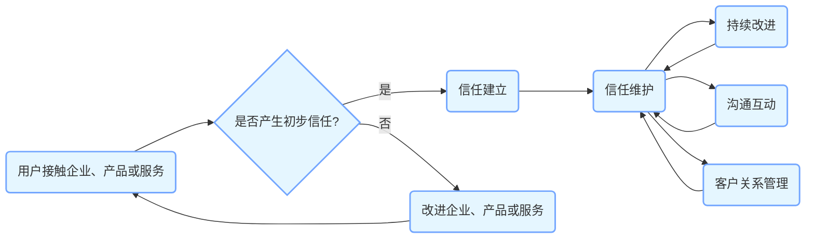

# 用户信任的建立与维护

> 关键词：用户信任、信任建立、信任维护、用户体验、品牌形象

> 摘要：本文围绕用户信任的建立与维护展开深入探讨。在当今竞争激烈的市场环境中，用户信任对于企业和产品的成功至关重要。文章首先介绍了用户信任相关的背景知识，包括目的、预期读者等。接着阐述了用户信任的核心概念及内在联系，分析了影响用户信任的因素。详细讲解了建立和维护用户信任的核心算法原理与具体操作步骤，并通过数学模型和公式进行理论支撑。通过项目实战案例展示了如何在实际中运用相关方法来建立和维护用户信任。探讨了用户信任在不同场景下的实际应用，推荐了学习、开发等相关的工具和资源。最后总结了用户信任未来的发展趋势与挑战，提供常见问题解答和扩展阅读参考资料，旨在为企业和相关从业者提供全面的用户信任管理思路和方法。

## 1. 背景介绍 
### 1.1 目的和范围
在数字化时代，企业面临着前所未有的竞争压力，用户的选择日益增多。用户信任成为企业吸引和留住用户的关键因素。本文的目的在于深入研究用户信任的建立与维护机制，为企业提供全面的理论和实践指导。范围涵盖了不同行业、不同类型的产品和服务，旨在探讨通用的用户信任管理方法和策略。

### 1.2 预期读者
本文的预期读者包括企业管理者、市场营销人员、产品经理、用户体验设计师以及对用户信任研究感兴趣的学者和研究人员。通过阅读本文，读者可以了解用户信任的重要性，掌握建立和维护用户信任的方法和技巧，提升企业的竞争力。

### 1.3 文档结构概述
本文共分为十个部分。第一部分为背景介绍，阐述了文章的目的、预期读者和文档结构概述。第二部分介绍了用户信任的核心概念与联系，分析了影响用户信任的因素。第三部分讲解了建立和维护用户信任的核心算法原理与具体操作步骤。第四部分通过数学模型和公式对用户信任进行理论分析。第五部分通过项目实战案例展示了如何在实际中运用相关方法来建立和维护用户信任。第六部分探讨了用户信任在不同场景下的实际应用。第七部分推荐了学习、开发等相关的工具和资源。第八部分总结了用户信任未来的发展趋势与挑战。第九部分提供常见问题解答。第十部分提供扩展阅读参考资料。

### 1.4 术语表
#### 1.4.1 核心术语定义
- **用户信任**：用户对企业、产品或服务的可靠性、安全性、专业性等方面的信心和认可。
- **信任建立**：企业通过各种手段和策略，使用户逐渐对其产生信任的过程。
- **信任维护**：企业在用户已经建立信任的基础上，采取措施保持和增强用户信任的过程。
- **用户体验**：用户在使用产品或服务过程中的感受和体验，包括易用性、功能性、情感性等方面。
- **品牌形象**：企业在用户心目中的形象和声誉，包括品牌知名度、美誉度、忠诚度等方面。

#### 1.4.2 相关概念解释
- **信任成本**：用户在建立和维护信任过程中所付出的时间、精力、金钱等成本。
- **信任风险**：用户在与企业、产品或服务交互过程中可能面临的风险，如信息泄露、产品质量问题等。
- **信任回报**：用户因为信任企业、产品或服务而获得的回报，如优质的产品和服务、良好的用户体验等。

#### 1.4.3 缩略词列表
- **UI**：User Interface，用户界面
- **UX**：User Experience，用户体验
- **CRM**：Customer Relationship Management，客户关系管理

## 2. 核心概念与联系 

### 2.1 用户信任的概念原理
用户信任是一个复杂的心理过程，它受到多种因素的影响。从本质上讲，用户信任是用户对企业、产品或服务的一种预期和信念。用户基于自己的经验、认知和价值观，对企业、产品或服务的可靠性、安全性、专业性等方面进行评估，从而形成信任或不信任的态度。

用户信任可以分为认知信任、情感信任和行为信任三个层次。认知信任是基于用户对企业、产品或服务的理性认知，如产品的功能、质量、价格等。情感信任是基于用户与企业、产品或服务之间的情感连接，如品牌形象、用户体验等。行为信任是基于用户的实际行为，如重复购买、推荐给他人等。

### 2.2 影响用户信任的因素
影响用户信任的因素可以分为内部因素和外部因素。内部因素包括企业的信誉、产品质量、服务水平、用户体验等。外部因素包括市场环境、社会文化、法律法规等。

- **企业信誉**：企业的信誉是用户信任的重要基础。一个信誉良好的企业更容易获得用户的信任。企业可以通过遵守法律法规、履行承诺、积极参与社会公益活动等方式来提升自己的信誉。
- **产品质量**：产品质量是用户信任的关键因素。一个质量可靠的产品可以让用户放心使用，从而增强用户的信任。企业可以通过加强质量管理、不断改进产品等方式来提高产品质量。
- **服务水平**：服务水平是用户信任的重要保障。一个服务周到的企业可以让用户感受到关怀和尊重，从而增强用户的信任。企业可以通过提高服务人员的素质、优化服务流程等方式来提升服务水平。
- **用户体验**：用户体验是用户信任的重要体现。一个易用、舒适、有趣的产品或服务可以让用户感受到愉悦和满足，从而增强用户的信任。企业可以通过优化产品设计、提升用户界面等方式来提高用户体验。

### 2.3 信任建立与维护的联系
信任建立和信任维护是一个连续的过程。信任建立是信任维护的前提和基础，只有建立了用户信任，才能进行信任维护。信任维护是信任建立的延续和深化，只有不断地维护用户信任，才能保持和增强用户信任。

在信任建立阶段，企业需要通过各种手段和策略，使用户逐渐对其产生信任。在信任维护阶段，企业需要采取措施保持和增强用户信任，如不断改进产品和服务、加强与用户的沟通和互动等。

### 2.4 文本示意图
用户信任的建立与维护是一个复杂的系统工程，涉及到多个方面的因素。以下是一个简单的文本示意图：

用户信任的建立与维护
|-- 信任建立
|   |-- 企业信誉
|   |-- 产品质量
|   |-- 服务水平
|   |-- 用户体验
|-- 信任维护
|   |-- 持续改进
|   |-- 沟通互动
|   |-- 客户关系管理

### 2.5 Mermaid 流程图


## 3. 核心算法原理 & 具体操作步骤 

### 3.1 核心算法原理
在建立和维护用户信任的过程中，可以运用机器学习中的分类算法来预测用户的信任程度。以逻辑回归算法为例，逻辑回归是一种用于二分类问题的统计模型，它可以根据输入的特征变量来预测用户是否信任企业、产品或服务。

逻辑回归的基本原理是通过一个逻辑函数（也称为 sigmoid 函数）将线性回归的输出映射到一个概率值，这个概率值表示用户信任的可能性。逻辑回归的数学表达式为：

$$P(y = 1|x) = \frac{1}{1 + e^{-(w_0 + w_1x_1 + w_2x_2 + \cdots + w_nx_n)}}$$

其中，$P(y = 1|x)$ 表示在给定特征向量 $x$ 的情况下，用户信任（$y = 1$）的概率；$w_0, w_1, w_2, \cdots, w_n$ 是模型的参数；$x_1, x_2, \cdots, x_n$ 是输入的特征变量。

### 3.2 具体操作步骤

#### 3.2.1 数据收集
收集与用户信任相关的数据，包括用户的基本信息、行为数据、反馈数据等。例如，用户的年龄、性别、购买频率、评价分数等。

#### 3.2.2 数据预处理
对收集到的数据进行预处理，包括数据清洗、特征选择、数据标准化等。例如，去除重复数据、处理缺失值、选择与用户信任相关性较高的特征等。

#### 3.2.3 模型训练
使用预处理后的数据对逻辑回归模型进行训练，得到模型的参数。可以使用 Python 中的 `scikit-learn` 库来实现逻辑回归模型的训练。以下是一个简单的 Python 代码示例：

```python
import numpy as np
from sklearn.linear_model import LogisticRegression
from sklearn.model_selection import train_test_split
from sklearn.preprocessing import StandardScaler

# 示例数据
X = np.array([[1, 2], [2, 3], [3, 4], [4, 5], [5, 6]])
y = np.array([0, 0, 1, 1, 1])

# 数据划分
X_train, X_test, y_train, y_test = train_test_split(X, y, test_size=0.2, random_state=42)

# 数据标准化
scaler = StandardScaler()
X_train = scaler.fit_transform(X_train)
X_test = scaler.transform(X_test)

# 模型训练
model = LogisticRegression()
model.fit(X_train, y_train)

# 模型评估
score = model.score(X_test, y_test)
print(f"模型准确率: {score}")
```

#### 3.2.4 模型预测
使用训练好的模型对新的用户数据进行预测，得到用户信任的概率。根据预测结果，企业可以采取相应的措施来建立和维护用户信任。例如，如果预测用户信任的概率较低，可以加强与用户的沟通和互动，了解用户的需求和意见，改进产品和服务。

#### 3.2.5 模型优化
不断地对模型进行优化，提高模型的准确性和稳定性。可以通过调整模型的参数、增加训练数据、选择更合适的特征等方式来优化模型。

## 4. 数学模型和公式 & 详细讲解 & 举例说明 

### 4.1 逻辑回归模型的数学原理
逻辑回归模型基于线性回归模型，通过逻辑函数将线性回归的输出映射到一个概率值。逻辑函数的表达式为：

$$\sigma(z) = \frac{1}{1 + e^{-z}}$$

其中，$z$ 是线性回归的输出，即 $z = w_0 + w_1x_1 + w_2x_2 + \cdots + w_nx_n$。逻辑函数的图像是一个 S 形曲线，其取值范围在 $[0, 1]$ 之间。当 $z$ 趋近于正无穷大时，$\sigma(z)$ 趋近于 1；当 $z$ 趋近于负无穷大时，$\sigma(z)$ 趋近于 0。

逻辑回归模型的目标是找到一组参数 $w_0, w_1, w_2, \cdots, w_n$，使得模型的预测结果与实际结果之间的误差最小。通常使用最大似然估计来求解模型的参数。最大似然估计的基本思想是找到一组参数，使得在这组参数下，观测到的数据出现的概率最大。

逻辑回归模型的似然函数为：

$$L(w) = \prod_{i=1}^{m} P(y^{(i)}|x^{(i)}; w)$$

其中，$m$ 是样本数量，$y^{(i)}$ 是第 $i$ 个样本的实际标签，$x^{(i)}$ 是第 $i$ 个样本的特征向量，$w$ 是模型的参数。

为了方便计算，通常对似然函数取对数，得到对数似然函数：

$$\ell(w) = \log L(w) = \sum_{i=1}^{m} \log P(y^{(i)}|x^{(i)}; w)$$

逻辑回归模型的目标是最大化对数似然函数 $\ell(w)$。可以使用梯度下降法等优化算法来求解对数似然函数的最大值。

### 4.2 举例说明
假设有一个电商平台，想要预测用户是否会再次购买商品。收集到了用户的一些特征数据，包括购买频率、平均消费金额、评价分数等。使用逻辑回归模型对这些数据进行分析。

首先，将数据进行预处理，包括数据清洗、特征选择、数据标准化等。然后，将数据划分为训练集和测试集。使用训练集对逻辑回归模型进行训练，得到模型的参数。最后，使用测试集对模型进行评估，计算模型的准确率。

以下是一个简单的 Python 代码示例：

```python
import numpy as np
from sklearn.linear_model import LogisticRegression
from sklearn.model_selection import train_test_split
from sklearn.preprocessing import StandardScaler

# 示例数据
X = np.array([[2, 100, 4], [3, 200, 5], [1, 50, 3], [4, 300, 4], [2, 150, 5]])
y = np.array([1, 1, 0, 1, 1])

# 数据划分
X_train, X_test, y_train, y_test = train_test_split(X, y, test_size=0.2, random_state=42)

# 数据标准化
scaler = StandardScaler()
X_train = scaler.fit_transform(X_train)
X_test = scaler.transform(X_test)

# 模型训练
model = LogisticRegression()
model.fit(X_train, y_train)

# 模型预测
y_pred = model.predict(X_test)

# 模型评估
score = model.score(X_test, y_test)
print(f"模型准确率: {score}")
```

在这个例子中，通过逻辑回归模型对用户是否会再次购买商品进行了预测，并计算了模型的准确率。根据模型的预测结果，电商平台可以采取相应的措施来提高用户的购买率，如向预测会再次购买的用户发送个性化的推荐信息，向预测不会再次购买的用户发送优惠券等。

## 5. 项目实战：代码实际案例和详细解释说明 

### 5.1  开发环境搭建
#### 5.1.1 安装 Python
首先，需要安装 Python 开发环境。可以从 Python 官方网站（https://www.python.org/downloads/） 下载适合自己操作系统的 Python 安装包，并按照安装向导进行安装。

#### 5.1.2 安装必要的库
在本项目中，需要使用 `scikit-learn`、`pandas`、`numpy` 等库。可以使用以下命令来安装这些库：

```bash
pip install scikit-learn pandas numpy
```

### 5.2  源代码详细实现和代码解读
以下是一个完整的 Python 代码示例，用于实现用户信任预测的逻辑回归模型：

```python
import pandas as pd
import numpy as np
from sklearn.linear_model import LogisticRegression
from sklearn.model_selection import train_test_split
from sklearn.preprocessing import StandardScaler
from sklearn.metrics import accuracy_score

# 数据加载
data = pd.read_csv('user_trust_data.csv')

# 特征选择和标签提取
X = data.drop('trust_label', axis=1).values
y = data['trust_label'].values

# 数据划分
X_train, X_test, y_train, y_test = train_test_split(X, y, test_size=0.2, random_state=42)

# 数据标准化
scaler = StandardScaler()
X_train = scaler.fit_transform(X_train)
X_test = scaler.transform(X_test)

# 模型训练
model = LogisticRegression()
model.fit(X_train, y_train)

# 模型预测
y_pred = model.predict(X_test)

# 模型评估
accuracy = accuracy_score(y_test, y_pred)
print(f"模型准确率: {accuracy}")
```

### 5.3  代码解读与分析
#### 5.3.1 数据加载
使用 `pandas` 库的 `read_csv` 函数从 CSV 文件中加载用户信任数据。假设 CSV 文件名为 `user_trust_data.csv`，其中包含用户的特征数据和信任标签。

#### 5.3.2 特征选择和标签提取
使用 `drop` 函数从数据中删除信任标签列，得到特征矩阵 `X`。使用 `values` 属性将数据转换为 `numpy` 数组。提取信任标签列，得到标签向量 `y`。

#### 5.3.3 数据划分
使用 `train_test_split` 函数将数据划分为训练集和测试集，测试集占总数据的 20%。设置随机种子为 42，以确保结果的可重复性。

#### 5.3.4 数据标准化
使用 `StandardScaler` 类对训练集和测试集进行数据标准化，将数据的均值调整为 0，标准差调整为 1。

#### 5.3.5 模型训练
使用 `LogisticRegression` 类创建逻辑回归模型，并使用训练集对模型进行训练。

#### 5.3.6 模型预测
使用训练好的模型对测试集进行预测，得到预测结果 `y_pred`。

#### 5.3.7 模型评估
使用 `accuracy_score` 函数计算模型的准确率，即预测正确的样本数占总样本数的比例。

## 6. 实际应用场景 
### 6.1 电子商务领域
在电子商务领域，用户信任对于企业的发展至关重要。用户在选择购物平台和商品时，往往会考虑平台的信誉、商品质量、售后服务等因素。企业可以通过建立和维护用户信任来提高用户的忠诚度和购买率。

- **信誉体系建设**：建立完善的信誉体系，对商家和用户进行信誉评级。展示商家的信誉信息，如好评率、交易记录等，让用户可以放心购物。
- **商品质量保障**：加强对商品质量的管理，严格筛选商家和商品。提供商品的详细信息和用户评价，让用户可以了解商品的真实情况。
- **售后服务优化**：提供优质的售后服务，如退换货政策、客服咨询等。及时处理用户的投诉和建议，让用户感受到企业的关怀和尊重。

### 6.2 金融服务领域
在金融服务领域，用户信任是企业生存和发展的基础。用户在选择金融机构和产品时，往往会考虑机构的信誉、资金安全、风险管理等因素。企业可以通过建立和维护用户信任来吸引和留住用户。

- **信誉评级与披露**：定期公布金融机构的信誉评级和财务状况，让用户可以了解机构的实力和风险。加强对金融产品的信息披露，让用户可以了解产品的收益和风险。
- **资金安全保障**：采取多种措施保障用户的资金安全，如加密技术、风险监控等。建立资金托管机制，确保用户的资金独立于机构的运营资金。
- **风险管理与预警**：加强对金融风险的管理和预警，及时发现和处理潜在的风险。向用户提供风险提示和投资建议，帮助用户做出合理的决策。

### 6.3 社交网络领域
在社交网络领域，用户信任是用户互动和交流的基础。用户在选择社交平台和朋友时，往往会考虑平台的安全性、隐私保护、用户口碑等因素。企业可以通过建立和维护用户信任来提高用户的活跃度和粘性。

- **安全保障措施**：加强对社交平台的安全保障，如防止黑客攻击、数据泄露等。采用多种安全技术，如加密算法、身份验证等，确保用户的信息安全。
- **隐私保护政策**：制定完善的隐私保护政策，明确用户信息的收集、使用和共享方式。尊重用户的隐私权利，未经用户同意，不泄露用户的个人信息。
- **社区管理与规范**：加强对社交社区的管理，制定明确的社区规则和行为准则。及时处理用户的违规行为，维护社区的良好秩序。

## 7. 工具和资源推荐
### 7.1 学习资源推荐
#### 7.1.1 书籍推荐
- 《信任的速度：一个可以改变一切的力量》：本书介绍了信任的重要性以及如何在个人和组织中建立和维护信任。
- 《用户体验要素：以用户为中心的产品设计》：本书介绍了用户体验的基本概念和方法，对于理解用户信任与用户体验的关系有很大帮助。
- 《机器学习》：周志华著，本书是机器学习领域的经典教材，对于理解逻辑回归等机器学习算法有很大帮助。

#### 7.1.2 在线课程
- Coursera 上的“机器学习”课程：由斯坦福大学教授 Andrew Ng 主讲，是机器学习领域的经典课程。
- edX 上的“数据科学与机器学习微硕士学位课程”：该课程涵盖了数据科学和机器学习的多个方面，对于提升数据分析和建模能力有很大帮助。
- 中国大学 MOOC 上的“用户体验设计”课程：该课程介绍了用户体验设计的基本概念和方法，对于理解用户信任与用户体验的关系有很大帮助。

#### 7.1.3 技术博客和网站
- 机器之心：提供人工智能、机器学习等领域的最新技术和研究成果。
- 36氪：提供互联网、科技等领域的最新资讯和深度报道。
- UX Booth：提供用户体验设计领域的最新文章和案例分析。

### 7.2 开发工具框架推荐
#### 7.2.1 IDE和编辑器
- PyCharm：是一款专门为 Python 开发设计的集成开发环境，具有代码编辑、调试、版本控制等功能。
- Visual Studio Code：是一款轻量级的代码编辑器，支持多种编程语言和插件扩展。
- Jupyter Notebook：是一款交互式的开发环境，适合进行数据分析和模型训练。

#### 7.2.2 调试和性能分析工具
- Py-Spy：是一款 Python 性能分析工具，可以帮助开发者找出代码中的性能瓶颈。
- PDB：是 Python 自带的调试工具，可以帮助开发者调试代码中的错误。
- TensorBoard：是 TensorFlow 提供的可视化工具，可以帮助开发者可视化模型的训练过程和性能指标。

#### 7.2.3 相关框架和库
- scikit-learn：是 Python 中常用的机器学习库，提供了多种机器学习算法和工具。
- pandas：是 Python 中常用的数据分析库，提供了数据处理、数据可视化等功能。
- numpy：是 Python 中常用的科学计算库，提供了数组操作、线性代数等功能。

### 7.3 相关论文著作推荐
#### 7.3.1 经典论文
- “The Mathematics of Diffusion”：由 Adolf Fick 发表，是扩散理论的经典论文，对于理解信息传播和信任扩散有一定的启示作用。
- “The Theory of Social and Economic Networks”：由 Matthew O. Jackson 发表，介绍了社会和经济网络的理论和模型，对于理解用户信任在社交网络中的传播有很大帮助。

#### 7.3.2 最新研究成果
- 每年的 ACM SIGKDD 会议、NeurIPS 会议等会发表关于数据挖掘、机器学习等领域的最新研究成果，可以关注这些会议的论文。
- 一些顶级学术期刊，如 Journal of Artificial Intelligence Research、Journal of Machine Learning Research 等会发表关于人工智能、机器学习等领域的最新研究成果。

#### 7.3.3 应用案例分析
- 可以关注一些知名企业的案例分析，如阿里巴巴、腾讯等企业在用户信任建立和维护方面的实践经验。
- 一些行业报告和研究机构的研究成果也会提供用户信任在不同行业的应用案例分析。

## 8. 总结：未来发展趋势与挑战
### 8.1 未来发展趋势
#### 8.1.1 智能化信任管理
随着人工智能技术的不断发展，未来的用户信任管理将更加智能化。企业可以利用机器学习、深度学习等技术对用户数据进行分析和挖掘，预测用户的信任程度，从而采取更加个性化的信任建立和维护策略。

#### 8.1.2 跨平台信任整合
在数字化时代，用户往往会在多个平台上进行活动。未来的用户信任管理将更加注重跨平台信任整合，实现用户信任在不同平台之间的共享和传递。

#### 8.1.3 信任生态系统建设
未来的用户信任管理将不仅仅局限于企业与用户之间的信任关系，还将涉及到整个信任生态系统的建设。企业需要与合作伙伴、监管机构等共同构建一个健康、稳定的信任生态系统。

### 8.2 挑战
#### 8.2.1 数据隐私和安全问题
在用户信任管理过程中，需要收集和处理大量的用户数据。如何保护用户的数据隐私和安全是一个重要的挑战。企业需要加强数据安全管理，采用先进的加密技术和安全措施，确保用户数据不被泄露和滥用。

#### 8.2.2 信任危机的应对
在数字化时代，信任危机的传播速度更快、影响范围更广。企业需要建立快速响应机制，及时应对信任危机，减少信任危机对企业的影响。

#### 8.2.3 信任标准的统一
不同行业、不同地区的信任标准存在差异，这给用户信任管理带来了一定的困难。未来需要建立统一的信任标准，促进用户信任在不同行业、不同地区之间的流通和共享。

## 9. 附录：常见问题与解答
### 9.1 如何衡量用户信任程度？
可以通过多种方式来衡量用户信任程度，如用户的行为数据（购买频率、推荐次数等）、用户的反馈数据（评价分数、投诉次数等）、用户的问卷调查数据等。也可以使用机器学习算法对用户数据进行分析和建模，预测用户的信任程度。

### 9.2 建立用户信任需要多长时间？
建立用户信任的时间因人而异，受到多种因素的影响，如企业的信誉、产品质量、服务水平、用户体验等。一般来说，建立用户信任需要一个长期的过程，需要企业持续不断地努力。

### 9.3 如何应对用户信任危机？
应对用户信任危机需要企业建立快速响应机制，及时采取措施。首先，企业需要诚恳地向用户道歉，承认错误。其次，企业需要积极采取措施解决问题，如改进产品和服务、加强管理等。最后，企业需要加强与用户的沟通和互动，重建用户信任。

### 9.4 如何提高用户信任的稳定性？
提高用户信任的稳定性需要企业持续不断地努力。企业可以通过不断改进产品和服务、加强与用户的沟通和互动、建立良好的品牌形象等方式来提高用户信任的稳定性。

## 10. 扩展阅读 & 参考资料
### 10.1 扩展阅读
- 《信任的进化：陌生人社会的博弈与合作》
- 《影响力：说服心理学》
- 《创新者的窘境》

### 10.2 参考资料
- [1] 周志华. 机器学习. 清华大学出版社, 2016.
- [2] 唐纳德·库珀, 帕梅拉·辛德勒. 商务与经济统计. 机械工业出版社, 2015.
- [3] 史蒂夫·克鲁格. 点石成金：访客至上的网页设计秘笈. 机械工业出版社, 2010.