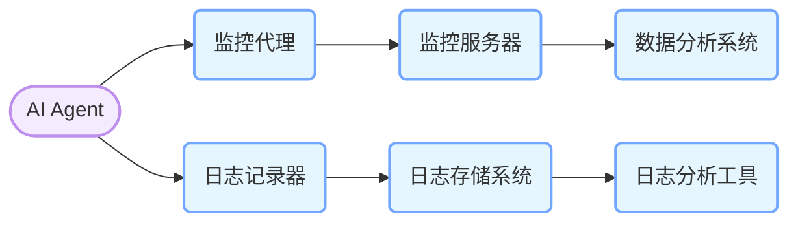

# 监控与日志：跟踪AI Agent的运行状态

> 关键词：监控、日志、AI Agent、运行状态、跟踪、性能分析、故障排查

> 摘要：本文围绕监控与日志在跟踪AI Agent运行状态方面的应用展开。首先介绍了相关背景知识，包括目的范围、预期读者等内容。接着阐述了监控与日志的核心概念及联系，通过详细的文本示意图和Mermaid流程图进行展示。然后深入讲解了核心算法原理，用Python源代码进行了详细阐述，同时给出了相关数学模型和公式，并举例说明。通过项目实战，展示了代码实际案例并进行详细解释。分析了实际应用场景，推荐了学习、开发等方面的工具和资源。最后总结了未来发展趋势与挑战，提供了常见问题解答及扩展阅读和参考资料，旨在帮助读者全面了解如何通过监控与日志有效跟踪AI Agent的运行状态。

## 1. 背景介绍 
### 1.1 目的和范围
随着人工智能技术的飞速发展，AI Agent在各个领域的应用越来越广泛。AI Agent作为一种能够自主执行任务的智能实体，其运行状态的稳定性和可靠性至关重要。监控与日志是跟踪AI Agent运行状态的重要手段，通过监控可以实时了解AI Agent的各项性能指标，如CPU使用率、内存占用、响应时间等；通过日志可以记录AI Agent的运行过程、事件和错误信息，为后续的分析和故障排查提供依据。

本文的范围涵盖了监控与日志的基本概念、核心算法原理、数学模型、项目实战以及实际应用场景等方面，旨在为读者提供一个全面、深入的关于跟踪AI Agent运行状态的技术指南。

### 1.2 预期读者
本文的预期读者包括但不限于以下几类人群：
- 人工智能开发者：希望深入了解如何监控和记录AI Agent的运行状态，以便优化AI Agent的性能和稳定性。
- 系统管理员：负责管理和维护AI Agent运行环境，需要掌握监控和日志相关技术，及时发现和解决问题。
- 数据分析人员：对AI Agent的运行数据感兴趣，希望通过分析监控数据和日志信息，挖掘有价值的信息。
- 技术爱好者：对人工智能和监控日志技术有浓厚兴趣，希望了解相关知识和技术原理。

### 1.3 文档结构概述
本文将按照以下结构进行组织：
- 核心概念与联系：介绍监控与日志的基本概念，以及它们与AI Agent运行状态跟踪的联系，并通过文本示意图和Mermaid流程图进行展示。
- 核心算法原理 & 具体操作步骤：详细讲解监控与日志的核心算法原理，并用Python源代码进行详细阐述。
- 数学模型和公式 & 详细讲解 & 举例说明：给出相关的数学模型和公式，并进行详细讲解和举例说明。
- 项目实战：通过一个实际项目案例，展示如何实现监控与日志功能，并对代码进行详细解释和分析。
- 实际应用场景：分析监控与日志在不同领域的实际应用场景。
- 工具和资源推荐：推荐学习、开发等方面的工具和资源。
- 总结：总结未来发展趋势与挑战。
- 附录：提供常见问题解答及扩展阅读和参考资料。

### 1.4 术语表
#### 1.4.1 核心术语定义
- **AI Agent**：人工智能代理，是一种能够感知环境、做出决策并执行动作的智能实体。
- **监控**：对AI Agent的运行状态进行实时监测，获取各项性能指标和状态信息。
- **日志**：记录AI Agent的运行过程、事件和错误信息，用于后续的分析和故障排查。
- **性能指标**：反映AI Agent运行状态的各种量化指标，如CPU使用率、内存占用、响应时间等。
- **故障排查**：通过分析监控数据和日志信息，找出AI Agent运行过程中出现的问题并进行解决。

#### 1.4.2 相关概念解释
- **实时监控**：在AI Agent运行过程中，实时获取其性能指标和状态信息，以便及时发现问题。
- **日志记录**：将AI Agent的运行过程、事件和错误信息按照一定的格式记录下来，形成日志文件。
- **日志分析**：对日志文件进行分析，提取有价值的信息，如故障原因、性能瓶颈等。
- **监控系统**：用于实现对AI Agent运行状态的监控和管理的系统。

#### 1.4.3 缩略词列表
- **CPU**：Central Processing Unit，中央处理器
- **RAM**：Random Access Memory，随机存取存储器
- **I/O**：Input/Output，输入/输出
- **API**：Application Programming Interface，应用程序编程接口

## 2. 核心概念与联系 

### 核心概念原理
监控与日志是跟踪AI Agent运行状态的两个重要方面，它们相互关联、相互补充。

#### 监控原理
监控的主要目的是实时获取AI Agent的运行状态信息，包括硬件资源使用情况（如CPU、内存、磁盘I/O等）、软件性能指标（如响应时间、吞吐量等）以及业务指标（如任务完成率、成功率等）。监控系统通常通过传感器或代理程序收集这些信息，并将其发送到监控服务器进行处理和分析。

#### 日志原理
日志是对AI Agent运行过程的详细记录，包括事件、操作、错误信息等。日志记录可以帮助开发者和运维人员了解AI Agent的行为和状态，及时发现问题并进行排查。日志通常按照时间顺序记录，并且可以根据不同的级别（如DEBUG、INFO、WARN、ERROR等）进行分类。

### 架构的文本示意图
以下是一个简单的监控与日志架构的文本示意图：

AI Agent --> 监控代理 --> 监控服务器 --> 数据分析系统
         |
         v
      日志记录器 --> 日志存储系统 --> 日志分析工具

### Mermaid流程图


## 3. 核心算法原理 & 具体操作步骤 

### 监控算法原理
监控算法的核心是如何准确、实时地获取AI Agent的运行状态信息。以下是一个简单的CPU使用率监控算法的Python示例：

```python
import psutil
import time

def monitor_cpu_usage(interval=1):
    while True:
        cpu_percent = psutil.cpu_percent(interval=interval)
        print(f"CPU使用率: {cpu_percent}%")
        time.sleep(interval)

if __name__ == "__main__":
    monitor_cpu_usage()
```

### 具体操作步骤
1. **安装依赖库**：在上述示例中，使用了`psutil`库来获取CPU使用率信息，需要先安装该库：
```sh
pip install psutil
```
2. **编写监控代码**：如上述Python代码所示，定义一个监控函数`monitor_cpu_usage`，在函数内部使用`psutil.cpu_percent`方法获取CPU使用率，并打印输出。
3. **运行监控程序**：在命令行中运行Python脚本：
```sh
python monitor_cpu.py
```

### 日志算法原理
日志算法的核心是如何记录和管理AI Agent的运行日志。以下是一个简单的日志记录示例：

```python
import logging

# 配置日志
logging.basicConfig(filename='ai_agent.log', level=logging.INFO,
                    format='%(asctime)s - %(levelname)s - %(message)s')

def ai_agent_task():
    try:
        # 模拟AI Agent任务
        logging.info('AI Agent任务开始')
        # 执行任务代码
        result = 1 / 0  # 模拟错误
        logging.info('AI Agent任务完成')
    except Exception as e:
        logging.error(f'AI Agent任务出错: {str(e)}')

if __name__ == "__main__":
    ai_agent_task()
```

### 具体操作步骤
1. **配置日志**：使用`logging.basicConfig`方法配置日志的输出文件、日志级别和日志格式。
2. **编写日志记录代码**：在AI Agent任务的关键位置，使用`logging`模块的不同级别方法（如`info`、`error`等）记录日志信息。
3. **查看日志文件**：任务执行完成后，可以查看生成的日志文件`ai_agent.log`，了解AI Agent的运行情况。

## 4. 数学模型和公式 & 详细讲解 & 举例说明 

### 监控指标的数学模型
#### CPU使用率
CPU使用率可以用以下公式表示：

$$CPU使用率 = \frac{CPU忙碌时间}{CPU总时间} \times 100\%$$

其中，CPU忙碌时间是指CPU在一段时间内处于工作状态的时间，CPU总时间是指这段时间的总时长。

例如，在10秒的时间内，CPU忙碌时间为8秒，则CPU使用率为：

$$CPU使用率 = \frac{8}{10} \times 100\% = 80\%$$

#### 内存使用率
内存使用率可以用以下公式表示：

$$内存使用率 = \frac{已使用内存}{总内存} \times 100\%$$

其中，已使用内存是指系统当前已经使用的内存大小，总内存是指系统的物理内存总量。

例如，系统总内存为8GB，已使用内存为4GB，则内存使用率为：

$$内存使用率 = \frac{4}{8} \times 100\% = 50\%$$

### 日志分析的数学模型
#### 错误率
错误率可以用以下公式表示：

$$错误率 = \frac{错误事件数量}{总事件数量} \times 100\%$$

其中，错误事件数量是指日志中记录的错误事件的数量，总事件数量是指日志中记录的所有事件的数量。

例如，在100个事件中，有10个错误事件，则错误率为：

$$错误率 = \frac{10}{100} \times 100\% = 10\%$$

### 举例说明
假设我们有一个AI Agent，在一天内共执行了1000个任务，其中有20个任务失败。同时，我们记录了该AI Agent的CPU使用率和内存使用率，平均CPU使用率为30%，平均内存使用率为40%。

- **错误率**：根据上述错误率公式，该AI Agent的错误率为：

$$错误率 = \frac{20}{1000} \times 100\% = 2\%$$

- **CPU使用率和内存使用率**：平均CPU使用率为30%，平均内存使用率为40%，这表明该AI Agent在运行过程中对CPU和内存的资源占用相对较低。

通过对这些指标的分析，我们可以了解该AI Agent的运行状态和性能表现，及时发现潜在的问题并进行优化。

## 5. 项目实战：代码实际案例和详细解释说明 

### 5.1  开发环境搭建
本项目使用Python作为开发语言，需要安装以下依赖库：
- `psutil`：用于获取系统资源信息，如CPU使用率、内存占用等。
- `logging`：Python内置的日志模块，用于记录AI Agent的运行日志。
- `Flask`：一个轻量级的Web框架，用于构建监控和日志管理的Web界面。

安装依赖库的命令如下：
```sh
pip install psutil flask
```

### 5.2  源代码详细实现和代码解读
以下是一个完整的项目示例，包括监控、日志记录和Web界面展示：

```python
import psutil
import logging
from flask import Flask, jsonify

# 配置日志
logging.basicConfig(filename='ai_agent.log', level=logging.INFO,
                    format='%(asctime)s - %(levelname)s - %(message)s')

app = Flask(__name__)

# 监控CPU使用率
def get_cpu_usage():
    cpu_percent = psutil.cpu_percent(interval=1)
    return cpu_percent

# 监控内存使用率
def get_memory_usage():
    memory = psutil.virtual_memory()
    memory_percent = memory.percent
    return memory_percent

# 记录日志
def log_message(message, level=logging.INFO):
    if level == logging.INFO:
        logging.info(message)
    elif level == logging.ERROR:
        logging.error(message)

# 定义API接口
@app.route('/monitor', methods=['GET'])
def monitor():
    cpu_usage = get_cpu_usage()
    memory_usage = get_memory_usage()
    log_message(f'CPU使用率: {cpu_usage}%, 内存使用率: {memory_usage}%')
    return jsonify({
        'cpu_usage': cpu_usage,
        'memory_usage': memory_usage
    })

if __name__ == '__main__':
    app.run(debug=True)
```

### 5.3  代码解读与分析
1. **日志配置**：使用`logging.basicConfig`方法配置日志的输出文件、日志级别和日志格式。
2. **监控函数**：定义了`get_cpu_usage`和`get_memory_usage`函数，分别用于获取CPU使用率和内存使用率。
3. **日志记录函数**：定义了`log_message`函数，用于记录不同级别的日志信息。
4. **Web接口**：使用Flask框架定义了一个`/monitor`接口，用于返回CPU使用率和内存使用率信息，并记录日志。
5. **运行应用**：使用`app.run`方法启动Flask应用，监听本地的5000端口。

通过访问`http://127.0.0.1:5000/monitor`，可以获取AI Agent的CPU使用率和内存使用率信息，同时日志文件`ai_agent.log`中会记录相应的日志信息。

## 6. 实际应用场景 
### 智能客服系统
在智能客服系统中，AI Agent作为自动回复用户问题的智能实体，其运行状态的稳定性和响应速度至关重要。通过监控AI Agent的CPU使用率、内存占用、响应时间等性能指标，可以及时发现系统的性能瓶颈，进行优化和调整。同时，通过日志记录用户的问题和AI Agent的回答，以及出现的错误信息，可以帮助开发者不断改进AI Agent的回答准确率和质量。

### 自动驾驶系统
在自动驾驶系统中，AI Agent负责感知环境、做出决策并控制车辆行驶。监控AI Agent的运行状态可以确保其在各种复杂环境下的安全性和可靠性。例如，监控传感器数据的处理速度、决策算法的执行时间、车辆控制指令的响应时间等。日志记录可以帮助开发者在出现事故或故障时进行追溯和分析，找出问题的根源。

### 金融风险评估系统
在金融风险评估系统中，AI Agent通过分析大量的金融数据来评估风险。监控AI Agent的运行状态可以确保其在处理大规模数据时的性能和稳定性。同时，日志记录可以帮助审计人员对AI Agent的决策过程进行审查，确保其合规性和公正性。

## 7. 工具和资源推荐
### 7.1 学习资源推荐
#### 7.1.1 书籍推荐
- 《Python数据分析实战》：介绍了Python在数据分析领域的应用，包括数据采集、清洗、分析和可视化等方面的内容。
- 《人工智能：现代方法》：经典的人工智能教材，涵盖了人工智能的各个领域，包括AI Agent、机器学习、自然语言处理等。
- 《监控与日志分析实战》：详细介绍了监控和日志分析的技术和方法，以及在实际项目中的应用。

#### 7.1.2 在线课程
- Coursera上的“人工智能基础”课程：由知名大学教授授课，系统介绍了人工智能的基本概念、算法和应用。
- edX上的“Python数据分析与可视化”课程：帮助学习者掌握Python在数据分析和可视化方面的技能。
- Udemy上的“监控与日志管理实战”课程：通过实际项目案例，讲解监控和日志管理的技术和工具。

#### 7.1.3 技术博客和网站
- Medium：有许多关于人工智能、监控和日志的技术博客文章，涵盖了最新的技术和研究成果。
- Stack Overflow：一个技术问答社区，开发者可以在这里提问和分享经验。
- 开源中国：提供了丰富的开源项目和技术文章，对于学习和实践有很大的帮助。

### 7.2 开发工具框架推荐
#### 7.2.1 IDE和编辑器
- PyCharm：专业的Python集成开发环境，提供了丰富的代码编辑、调试和部署功能。
- Visual Studio Code：轻量级的代码编辑器，支持多种编程语言和插件扩展，适合快速开发和调试。
- Jupyter Notebook：交互式的开发环境，适合数据探索和分析，方便展示代码和结果。

#### 7.2.2 调试和性能分析工具
- pdb：Python内置的调试器，可以帮助开发者逐步执行代码，查找问题。
- cProfile：Python的性能分析工具，可以分析代码的运行时间和函数调用情况，找出性能瓶颈。
- Grafana：开源的可视化监控工具，可以将监控数据以图表和报表的形式展示出来，方便用户进行分析和决策。

#### 7.2.3 相关框架和库
- TensorFlow：开源的机器学习框架，提供了丰富的工具和算法，用于构建和训练AI Agent。
- PyTorch：另一个流行的深度学习框架，具有动态图的优势，适合快速开发和实验。
- Elasticsearch：开源的分布式搜索和分析引擎，用于存储和分析大量的日志数据。

### 7.3 相关论文著作推荐
#### 7.3.1 经典论文
- “Artificial Intelligence as Computation: Structures and Strategies for Complex Problem Solving”：奠定了人工智能计算理论的基础。
- “The Design and Implementation of the 4.4BSD Operating System”：介绍了操作系统的设计和实现原理，对于理解监控和日志的底层机制有很大帮助。
- “MapReduce: Simplified Data Processing on Large Clusters”：提出了MapReduce编程模型，为大规模数据处理提供了一种简单有效的方法。

#### 7.3.2 最新研究成果
- 每年的顶级人工智能会议（如NeurIPS、ICML、AAAI等）上的相关论文，涵盖了AI Agent、监控和日志等领域的最新研究成果。
- 学术期刊（如Journal of Artificial Intelligence Research、Artificial Intelligence等）上的研究论文，具有较高的学术价值。

#### 7.3.3 应用案例分析
- 各大科技公司（如Google、Microsoft、Amazon等）发布的技术博客和案例分享，介绍了他们在实际项目中应用监控和日志技术的经验和成果。
- 行业报告和白皮书，分析了监控和日志技术在不同行业的应用现状和发展趋势。

## 8. 总结：未来发展趋势与挑战
### 未来发展趋势
- **智能化监控与日志分析**：随着人工智能技术的不断发展，监控和日志分析将越来越智能化。例如，利用机器学习算法自动识别异常模式和故障原因，实现智能预警和自动修复。
- **实时性和可视化**：对监控和日志数据的实时性要求越来越高，同时需要更加直观和可视化的展示方式，以便用户快速了解AI Agent的运行状态。
- **跨平台和多源数据融合**：AI Agent可能运行在不同的平台和环境中，需要实现跨平台的监控和日志管理。同时，需要融合来自不同数据源的数据，进行全面的分析和决策。
- **安全和隐私保护**：监控和日志数据包含了大量的敏感信息，需要加强安全和隐私保护措施，防止数据泄露和滥用。

### 挑战
- **数据量和复杂性**：随着AI Agent的功能和应用场景越来越复杂，产生的监控和日志数据量也越来越大，如何高效地存储、处理和分析这些数据是一个挑战。
- **算法和模型的准确性**：智能化监控和日志分析依赖于准确的算法和模型，如何提高算法和模型的准确性和可靠性是一个关键问题。
- **系统兼容性和集成性**：在不同的平台和环境中，实现监控和日志系统的兼容性和集成性是一个挑战，需要解决各种技术和标准的差异。
- **人才短缺**：监控和日志技术涉及到多个领域的知识和技能，目前相关的专业人才短缺，需要加强人才培养和技术普及。

## 9. 附录：常见问题与解答
### 1. 监控和日志有什么区别？
监控主要是实时获取AI Agent的运行状态信息，关注的是当前的性能指标和状态；日志则是对AI Agent运行过程的详细记录，包括事件、操作、错误信息等，用于后续的分析和故障排查。

### 2. 如何选择合适的监控指标？
选择监控指标需要根据AI Agent的具体应用场景和需求来确定。一般来说，可以关注CPU使用率、内存占用、响应时间、吞吐量等性能指标，以及任务完成率、成功率等业务指标。

### 3. 日志文件太大怎么办？
可以采用以下方法处理日志文件太大的问题：
- 定期清理过期的日志文件。
- 对日志文件进行压缩，减少存储空间。
- 采用分块存储的方式，将日志文件按照时间或大小进行分割。

### 4. 如何进行日志分析？
可以采用以下方法进行日志分析：
- 手动查看日志文件，查找关键信息和错误信息。
- 使用日志分析工具，如Elasticsearch、Kibana等，进行自动化分析和可视化展示。
- 利用机器学习算法，对日志数据进行分类、聚类和异常检测。

### 5. 监控和日志系统的性能会影响AI Agent的运行吗？
如果监控和日志系统的性能不佳，可能会对AI Agent的运行产生一定的影响。因此，需要优化监控和日志系统的性能，如采用轻量级的监控代理、合理设置日志级别和存储策略等。

## 10. 扩展阅读 & 参考资料
- 《Python Cookbook》
- 《Effective Python》
- 《人工智能算法（卷3）：深度学习与神经网络》
- https://www.python.org/
- https://www.tensorflow.org/
- https://pytorch.org/
- https://grafana.com/
- https://www.elastic.co/