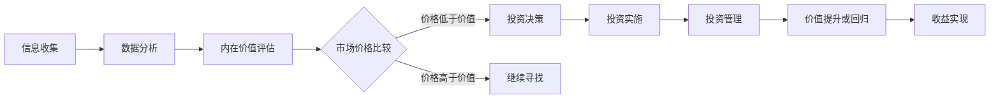

# 盖伊·斯皮尔的房地产价值投资：另一种形式的价值发现

> 关键词：盖伊·斯皮尔、房地产价值投资、价值发现、投资策略、风险管理

> 摘要：本文深入探讨盖伊·斯皮尔的房地产价值投资理念，将其视为一种独特的价值发现形式。通过对相关背景的介绍，剖析核心概念及其联系，阐述核心算法原理与具体操作步骤，借助数学模型和公式进行详细讲解与举例说明，结合项目实战展示代码案例及解读，分析实际应用场景，推荐相关工具和资源，最后总结未来发展趋势与挑战，解答常见问题并提供扩展阅读和参考资料，旨在全面展现房地产价值投资的内涵与应用，为投资者提供有价值的参考。

## 1. 背景介绍 
### 1.1 目的和范围
本文章的目的在于深入研究盖伊·斯皮尔所倡导的房地产价值投资理念，详细剖析其作为一种独特价值发现形式的原理、方法和应用。通过对房地产价值投资的多方面探讨，为投资者和相关研究人员提供全面、深入的知识体系和实践指导。范围涵盖房地产价值投资的理论基础、核心概念、操作步骤、数学模型、实际案例以及未来发展趋势等多个领域。

### 1.2 预期读者
预期读者包括房地产投资者、金融从业者、投资研究人员、对价值投资理念感兴趣的学者以及希望了解房地产投资领域知识的普通读者。这些读者可能具有不同的专业背景和投资经验，文章将以通俗易懂的语言和详细的讲解，满足不同层次读者的需求。

### 1.3 文档结构概述
本文将按照以下结构展开：首先介绍背景信息，包括目的、预期读者和文档结构概述以及相关术语表；接着阐述核心概念与联系，通过文本示意图和 Mermaid 流程图进行说明；然后讲解核心算法原理和具体操作步骤，并使用 Python 源代码详细阐述；之后介绍数学模型和公式，进行详细讲解并举例说明；再通过项目实战展示代码实际案例并进行详细解释；分析实际应用场景；推荐相关工具和资源；最后总结未来发展趋势与挑战，解答常见问题并提供扩展阅读和参考资料。

### 1.4 术语表
#### 1.4.1 核心术语定义
- **房地产价值投资**：基于对房地产内在价值的评估，以低于其内在价值的价格买入房地产资产，期望在未来资产价值回归或提升时获得收益的投资策略。
- **价值发现**：通过对资产的深入分析和研究，挖掘出其被市场低估的价值的过程。
- **内在价值**：房地产资产基于其地理位置、建筑质量、市场需求等多种因素所具有的真实价值，不依赖于市场价格波动。

#### 1.4.2 相关概念解释
- **市场效率**：指市场价格反映资产真实价值的程度。在有效市场中，资产价格能够迅速、准确地反映所有可用信息；而在非有效市场中，资产价格可能偏离其内在价值。
- **风险溢价**：投资者因承担额外风险而要求获得的额外收益。在房地产投资中，风险溢价通常与房地产的地理位置、市场环境、租赁情况等因素相关。

#### 1.4.3 缩略词列表
- **NPV**：净现值（Net Present Value），用于评估投资项目的盈利能力，考虑了资金的时间价值。
- **IRR**：内部收益率（Internal Rate of Return），使投资项目净现值为零的折现率，反映了投资项目的实际收益率。

## 2. 核心概念与联系 

### 2.1 核心概念原理
盖伊·斯皮尔的房地产价值投资理念基于价值投资的基本原理，即寻找被市场低估的资产并长期持有，等待其价值回归或提升。在房地产领域，价值投资的核心在于对房地产内在价值的准确评估。内在价值受到多种因素的影响，包括地理位置、建筑质量、土地稀缺性、市场需求、租金收益等。通过对这些因素的综合分析，投资者可以确定房地产的合理价值，并与市场价格进行比较。如果市场价格低于内在价值，就存在投资机会。

### 2.2 架构的文本示意图
房地产价值投资的架构可以分为以下几个层次：
1. **信息收集层**：收集与房地产相关的各种信息，包括市场数据、房地产自身特征、周边环境等。
2. **分析评估层**：对收集到的信息进行分析和评估，确定房地产的内在价值。
3. **投资决策层**：根据内在价值与市场价格的比较，做出投资决策。
4. **投资管理层**：在投资过程中，对房地产进行管理和监控，确保投资目标的实现。

### 2.3 Mermaid 流程图


## 3. 核心算法原理 & 具体操作步骤 

### 3.1 核心算法原理
在房地产价值投资中，常用的核心算法包括净现值（NPV）和内部收益率（IRR）的计算。净现值是指投资项目在未来各期现金流量的现值之和减去初始投资成本后的余额。其计算公式为：

$$NPV = \sum_{t=0}^{n} \frac{CF_t}{(1 + r)^t} - C_0$$

其中，$CF_t$ 表示第 $t$ 期的现金流量，$r$ 表示折现率，$C_0$ 表示初始投资成本，$n$ 表示投资期限。

内部收益率是使投资项目净现值为零的折现率，即满足以下方程的 $r$ 值：

$$\sum_{t=0}^{n} \frac{CF_t}{(1 + IRR)^t} - C_0 = 0$$

### 3.2 具体操作步骤
1. **信息收集**：收集房地产的相关信息，包括购买价格、租金收入、运营成本、维护费用、市场租金增长率、房地产增值率等。
2. **现金流量预测**：根据收集到的信息，预测未来各期的现金流量。现金流量包括租金收入、运营成本、维护费用、房地产出售收入等。
3. **折现率确定**：根据市场情况和投资风险，确定合适的折现率。折现率反映了投资者对资金时间价值和风险的要求。
4. **NPV 和 IRR 计算**：使用上述公式计算净现值和内部收益率。
5. **投资决策**：根据净现值和内部收益率的计算结果，做出投资决策。如果净现值大于零且内部收益率大于投资者要求的收益率，则该投资项目具有吸引力。

### 3.3 Python 源代码实现
```python
import numpy as np

def npv(initial_investment, cash_flows, discount_rate):
    """
    计算净现值
    :param initial_investment: 初始投资成本
    :param cash_flows: 未来各期现金流量列表
    :param discount_rate: 折现率
    :return: 净现值
    """
    npv_value = -initial_investment
    for t, cash_flow in enumerate(cash_flows):
        npv_value += cash_flow / (1 + discount_rate) ** (t + 1)
    return npv_value

def irr(initial_investment, cash_flows):
    """
    计算内部收益率
    :param initial_investment: 初始投资成本
    :param cash_flows: 未来各期现金流量列表
    :return: 内部收益率
    """
    cash_flows = [-initial_investment] + cash_flows
    return np.irr(cash_flows)

# 示例数据
initial_investment = 1000000  # 初始投资成本
cash_flows = [100000, 120000, 130000, 140000, 150000, 1200000]  # 未来各期现金流量
discount_rate = 0.1  # 折现率

# 计算净现值和内部收益率
npv_value = npv(initial_investment, cash_flows, discount_rate)
irr_value = irr(initial_investment, cash_flows)

print(f"净现值: {npv_value}")
print(f"内部收益率: {irr_value * 100}%")
```

## 4. 数学模型和公式 & 详细讲解 & 举例说明 

### 4.1 净现值（NPV）模型
净现值模型是基于资金时间价值的概念，将未来各期的现金流量折现到当前时刻，以评估投资项目的盈利能力。净现值的计算公式为：

$$NPV = \sum_{t=0}^{n} \frac{CF_t}{(1 + r)^t} - C_0$$

其中，$CF_t$ 表示第 $t$ 期的现金流量，$r$ 表示折现率，$C_0$ 表示初始投资成本，$n$ 表示投资期限。

### 4.2 详细讲解
- **现金流量（$CF_t$）**：包括租金收入、运营成本、维护费用、房地产出售收入等。租金收入是房地产投资的主要现金流入，运营成本和维护费用是现金流出。房地产出售收入是在投资期限结束时的一次性现金流入。
- **折现率（$r$）**：反映了投资者对资金时间价值和风险的要求。折现率越高，未来现金流量的现值越低，投资项目的净现值也越低。折现率的确定通常考虑市场利率、投资风险等因素。
- **初始投资成本（$C_0$）**：包括购买房地产的价格、交易费用等。

### 4.3 举例说明
假设投资者购买一套房产，初始投资成本为 $100$ 万元。预计未来每年的租金收入为 $10$ 万元，运营成本为 $2$ 万元，维护费用为 $1$ 万元。投资期限为 $5$ 年，第 $5$ 年末房产出售价格为 $120$ 万元。折现率为 $10\%$。

1. **计算每年的现金流量**：
    - 第 1 - 4 年：$CF_1 - CF_4 = 10 - 2 - 1 = 7$（万元）
    - 第 5 年：$CF_5 = 7 + 120 = 127$（万元）

2. **计算净现值**：
$$NPV = -100 + \frac{7}{(1 + 0.1)^1} + \frac{7}{(1 + 0.1)^2} + \frac{7}{(1 + 0.1)^3} + \frac{7}{(1 + 0.1)^4} + \frac{127}{(1 + 0.1)^5}$$
$$NPV \approx -100 + 6.36 + 5.78 + 5.26 + 4.78 + 78.79 = -3.03$$（万元）

由于净现值小于零，该投资项目在当前折现率下不具有吸引力。

### 4.4 内部收益率（IRR）模型
内部收益率是使投资项目净现值为零的折现率，即满足以下方程的 $r$ 值：

$$\sum_{t=0}^{n} \frac{CF_t}{(1 + IRR)^t} - C_0 = 0$$

### 4.5 详细讲解
内部收益率反映了投资项目的实际收益率。如果内部收益率大于投资者要求的收益率，则该投资项目具有吸引力。内部收益率的计算通常需要使用迭代法或数值计算方法。

### 4.6 举例说明
仍以上述房产投资为例，使用 Python 代码计算内部收益率：
```python
import numpy as np

initial_investment = 100
cash_flows = [7, 7, 7, 7, 127]

irr_value = np.irr([-initial_investment] + cash_flows)
print(f"内部收益率: {irr_value * 100}%")
```

假设计算得到的内部收益率为 $9\%$，如果投资者要求的收益率为 $10\%$，则该投资项目不满足要求。

## 5. 项目实战：代码实际案例和详细解释说明 

### 5.1  开发环境搭建
1. **安装 Python**：可以从 Python 官方网站（https://www.python.org/downloads/）下载并安装最新版本的 Python。
2. **安装必要的库**：使用 `pip` 命令安装 `numpy` 库，用于数值计算。
```sh
pip install numpy
```

### 5.2  源代码详细实现和代码解读
```python
import numpy as np

def npv(initial_investment, cash_flows, discount_rate):
    """
    计算净现值
    :param initial_investment: 初始投资成本
    :param cash_flows: 未来各期现金流量列表
    :param discount_rate: 折现率
    :return: 净现值
    """
    npv_value = -initial_investment
    for t, cash_flow in enumerate(cash_flows):
        npv_value += cash_flow / (1 + discount_rate) ** (t + 1)
    return npv_value

def irr(initial_investment, cash_flows):
    """
    计算内部收益率
    :param initial_investment: 初始投资成本
    :param cash_flows: 未来各期现金流量列表
    :return: 内部收益率
    """
    cash_flows = [-initial_investment] + cash_flows
    return np.irr(cash_flows)

# 示例数据
initial_investment = 2000000  # 初始投资成本
cash_flows = [150000, 160000, 170000, 180000, 190000, 2200000]  # 未来各期现金流量
discount_rate = 0.12  # 折现率

# 计算净现值和内部收益率
npv_value = npv(initial_investment, cash_flows, discount_rate)
irr_value = irr(initial_investment, cash_flows)

print(f"净现值: {npv_value}")
print(f"内部收益率: {irr_value * 100}%")
```

### 5.3  代码解读与分析
1. **`npv` 函数**：该函数用于计算净现值。首先将初始投资成本取负，然后遍历未来各期现金流量，将其折现到当前时刻并累加到净现值中。最后返回净现值。
2. **`irr` 函数**：该函数用于计算内部收益率。将初始投资成本取负并与未来各期现金流量合并成一个列表，然后使用 `numpy` 库的 `irr` 函数计算内部收益率。
3. **示例数据**：定义了初始投资成本、未来各期现金流量和折现率。
4. **计算结果**：调用 `npv` 和 `irr` 函数计算净现值和内部收益率，并打印结果。

通过分析净现值和内部收益率的结果，投资者可以判断该房地产投资项目是否具有吸引力。如果净现值大于零且内部收益率大于投资者要求的收益率，则该项目值得投资。

## 6. 实际应用场景 
### 6.1 个人房地产投资
对于个人投资者来说，房地产价值投资可以帮助他们寻找被市场低估的房产，通过长期持有获得资产增值和租金收益。例如，在一些新兴的城市区域，由于基础设施建设尚未完善，房价可能相对较低。但随着城市的发展和基础设施的改善，这些区域的房地产价值可能会大幅提升。个人投资者可以通过对这些区域的研究和分析，提前布局，获得投资收益。

### 6.2 房地产开发企业
房地产开发企业可以运用价值投资理念，在土地获取和项目开发过程中，寻找具有潜在价值的地块。通过对地块的地理位置、周边环境、市场需求等因素的分析，确定地块的内在价值，并与土地出让价格进行比较。如果土地出让价格低于内在价值，开发企业可以获取该地块进行开发，通过合理的规划和运营，实现项目的增值。

### 6.3 房地产投资基金
房地产投资基金可以通过价值投资策略，筛选出具有投资价值的房地产项目进行投资。基金管理人可以运用专业的分析工具和方法，对房地产项目的内在价值进行评估，选择净现值大于零、内部收益率较高的项目进行投资。通过分散投资和专业管理，降低投资风险，提高投资收益。

### 6.4 房地产资产证券化
在房地产资产证券化过程中，价值投资理念可以帮助投资者评估房地产资产的质量和价值。通过对房地产资产的现金流、市场价值等因素的分析，确定资产支持证券的合理定价。投资者可以根据自己的风险偏好和投资目标，选择合适的资产支持证券进行投资。

## 7. 工具和资源推荐
### 7.1 学习资源推荐
#### 7.1.1 书籍推荐
- 《聪明的投资者》（The Intelligent Investor）：本杰明·格雷厄姆（Benjamin Graham）著，价值投资领域的经典著作，介绍了价值投资的基本原理和方法。
- 《房地产投资实战手册》：详细介绍了房地产投资的各个方面，包括市场分析、项目评估、投资策略等。
- 《财务自由之路》：提供了个人投资理财的实用方法和建议，其中包括房地产投资的相关内容。

#### 7.1.2 在线课程
- Coursera 平台上的“房地产投资原理”课程：由知名大学教授授课，系统介绍房地产投资的理论和实践。
- Udemy 平台上的“房地产价值投资实战”课程：通过实际案例讲解房地产价值投资的方法和技巧。

#### 7.1.3 技术博客和网站
- 雪球网：提供房地产投资相关的资讯、分析和讨论，投资者可以在上面交流投资经验和心得。
- 房地产观察网：专注于房地产市场的研究和分析，提供最新的市场动态和数据。

### 7.2 开发工具框架推荐
#### 7.2.1 IDE和编辑器
- PyCharm：功能强大的 Python 集成开发环境，提供代码编辑、调试、版本控制等功能。
- Visual Studio Code：轻量级的代码编辑器，支持多种编程语言，可通过安装插件扩展功能。

#### 7.2.2 调试和性能分析工具
- IPython：交互式 Python 解释器，方便进行代码调试和测试。
- cProfile：Python 内置的性能分析工具，可用于分析代码的执行时间和性能瓶颈。

#### 7.2.3 相关框架和库
- NumPy：用于数值计算的 Python 库，提供高效的数组操作和数学函数。
- Pandas：用于数据处理和分析的 Python 库，提供数据结构和数据操作工具。

### 7.3 相关论文著作推荐
#### 7.3.1 经典论文
- 《有效资本市场：理论与实证研究回顾》（Efficient Capital Markets: A Review of Theory and Empirical Work）：尤金·法玛（Eugene F. Fama）著，对有效市场假说进行了系统的阐述。
- 《资本资产定价模型：理论与实证》（Capital Asset Pricing Model: Theory and Empirical Evidence）：威廉·夏普（William F. Sharpe）等著，介绍了资本资产定价模型的理论和应用。

#### 7.3.2 最新研究成果
- 国际房地产研究期刊（International Real Estate Review）：发表房地产领域的最新研究成果和学术论文。
- 房地产经济与金融期刊（Journal of Real Estate Economics and Finance）：专注于房地产经济和金融领域的研究。

#### 7.3.3 应用案例分析
- 《房地产投资经典案例分析》：通过实际案例分析，介绍房地产价值投资的成功经验和失败教训。
- 各大房地产咨询公司的研究报告：提供房地产市场的案例分析和趋势预测。

## 8. 总结：未来发展趋势与挑战
### 8.1 未来发展趋势
- **智能化和数字化**：随着科技的发展，房地产投资领域将越来越智能化和数字化。例如，利用大数据和人工智能技术进行市场分析、项目评估和风险预测；通过虚拟现实和增强现实技术进行房地产展示和销售。
- **绿色和可持续发展**：消费者对绿色、可持续房地产的需求将不断增加，房地产投资者也将更加关注房地产的环保性能和可持续性。绿色建筑、节能设施等将成为房地产投资的重要方向。
- **多元化投资**：房地产投资将不再局限于传统的住宅和商业地产，而是向多元化方向发展。例如，物流地产、养老地产、长租公寓等新兴领域将受到更多关注。
- **资产证券化加速**：房地产资产证券化将成为未来房地产投资的重要趋势。通过资产证券化，房地产资产可以更方便地进行融资和交易，提高资产的流动性和市场效率。

### 8.2 挑战
- **市场不确定性**：房地产市场受到宏观经济、政策调控、人口变化等多种因素的影响，市场不确定性较大。投资者需要准确把握市场趋势，及时调整投资策略。
- **风险管理**：房地产投资涉及资金量大、周期长，面临着多种风险，如市场风险、信用风险、流动性风险等。投资者需要建立完善的风险管理体系，有效控制风险。
- **技术应用挑战**：虽然科技的发展为房地产投资带来了机遇，但也带来了技术应用的挑战。例如，如何有效利用大数据和人工智能技术进行投资决策，如何保障数据的安全和隐私等。
- **法律法规变化**：房地产市场受到法律法规的严格监管，法律法规的变化可能对房地产投资产生重大影响。投资者需要及时了解法律法规的变化，确保投资行为的合法性。

## 9. 附录：常见问题与解答
### 9.1 如何准确评估房地产的内在价值？
评估房地产的内在价值需要综合考虑多种因素，包括地理位置、建筑质量、土地稀缺性、市场需求、租金收益等。可以采用市场比较法、收益法、成本法等方法进行评估。同时，需要收集大量的市场数据和信息，并结合专业的知识和经验进行分析。

### 9.2 净现值和内部收益率哪个更重要？
净现值和内部收益率都是评估投资项目盈利能力的重要指标，但它们的侧重点不同。净现值反映了投资项目在当前折现率下的实际收益，而内部收益率反映了投资项目的实际收益率。在实际应用中，建议同时考虑净现值和内部收益率，并结合其他因素进行综合判断。

### 9.3 房地产投资的风险有哪些？如何降低风险？
房地产投资的风险包括市场风险、信用风险、流动性风险、政策风险等。降低风险的方法包括分散投资、选择优质的房地产项目、进行充分的市场调研和分析、建立完善的风险管理体系等。

### 9.4 如何选择合适的折现率？
折现率的选择需要考虑市场利率、投资风险等因素。一般来说，可以参考市场上类似投资项目的收益率，并根据投资项目的风险程度进行调整。同时，也可以采用资本资产定价模型（CAPM）等方法来确定折现率。

## 10. 扩展阅读 & 参考资料
### 10.1 扩展阅读
- 《金融炼金术》（The Alchemy of Finance）：乔治·索罗斯（George Soros）著，介绍了反身性理论和金融市场的运作机制。
- 《黑天鹅》（The Black Swan）：纳西姆·尼古拉斯·塔勒布（Nassim Nicholas Taleb）著，探讨了不确定性和突发事件对金融市场的影响。

### 10.2 参考资料
- 相关房地产市场研究报告和统计数据，如国家统计局发布的房地产市场数据、各大房地产咨询公司的研究报告等。
- 相关法律法规和政策文件，如房地产税收政策、土地政策等。
- 学术期刊和会议论文，如《房地产研究》、《金融研究》等期刊发表的相关论文。