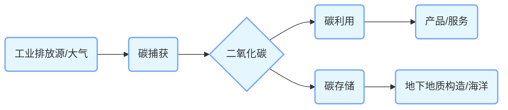

# 碳捕获与利用技术的经济可行性分析

> 关键词：碳捕获与利用技术、经济可行性、成本效益、市场潜力、政策支持

> 摘要：本文旨在全面深入地分析碳捕获与利用技术（CCUS）的经济可行性。首先介绍了碳捕获与利用技术的背景，包括其目的、预期读者、文档结构和相关术语。接着阐述了碳捕获与利用技术的核心概念与联系，展示了其原理和架构。详细讲解了相关核心算法原理和具体操作步骤，并通过数学模型和公式进行理论支撑与举例说明。通过项目实战案例，深入剖析了该技术在实际应用中的代码实现与分析。探讨了碳捕获与利用技术的实际应用场景，推荐了相关的工具和资源。最后总结了该技术的未来发展趋势与挑战，提供了常见问题解答和扩展阅读参考资料，为全面评估碳捕获与利用技术的经济可行性提供了系统而深入的参考。

## 1. 背景介绍 
### 1.1 目的和范围
随着全球气候变化问题日益严峻，减少温室气体排放已成为国际社会的共同目标。碳捕获与利用技术作为一种重要的减排手段，旨在捕获工业生产和能源利用过程中产生的二氧化碳（CO₂），并将其转化为有价值的产品或进行安全存储，从而实现二氧化碳的资源化利用和减排目标。本文的目的是对碳捕获与利用技术的经济可行性进行全面分析，评估其在不同应用场景下的成本效益、市场潜力以及对经济发展的影响。范围涵盖了碳捕获、运输、利用和存储等整个技术链条，以及相关的政策、市场和技术因素。

### 1.2 预期读者
本文预期读者包括从事能源、环境、化工等领域的科研人员、工程师和技术专家，他们可以从本文中获取碳捕获与利用技术的最新研究成果和经济分析方法，为技术研发和项目决策提供参考。此外，政府部门的政策制定者、金融机构的投资经理以及关注气候变化和可持续发展的企业管理人员也可以通过本文了解碳捕获与利用技术的经济可行性和发展前景，为政策制定、投资决策和企业战略规划提供依据。

### 1.3 文档结构概述
本文共分为十个部分。第一部分为背景介绍，阐述了研究的目的、范围、预期读者和文档结构概述，并给出了相关术语表。第二部分介绍碳捕获与利用技术的核心概念与联系，包括技术原理、架构和流程。第三部分讲解核心算法原理和具体操作步骤，通过Python源代码进行详细阐述。第四部分介绍数学模型和公式，并进行详细讲解和举例说明。第五部分通过项目实战案例，介绍开发环境搭建、源代码实现和代码解读。第六部分探讨碳捕获与利用技术的实际应用场景。第七部分推荐相关的工具和资源，包括学习资源、开发工具框架和相关论文著作。第八部分总结碳捕获与利用技术的未来发展趋势与挑战。第九部分为附录，提供常见问题与解答。第十部分为扩展阅读和参考资料，列出了本文引用的文献和相关的扩展阅读资源。

### 1.4 术语表
#### 1.4.1 核心术语定义
- **碳捕获与利用技术（CCUS）**：Carbon Capture, Utilization and Storage的缩写，是指将二氧化碳从工业生产、能源利用或大气中分离出来，进行资源化利用或安全存储的技术体系。
- **碳捕获（Carbon Capture）**：指从工业生产过程、能源燃烧过程或大气中分离和捕集二氧化碳的技术。
- **碳利用（Carbon Utilization）**：指将捕获的二氧化碳转化为有价值的产品，如化学品、燃料、建筑材料等的技术。
- **碳存储（Carbon Storage）**：指将捕获的二氧化碳安全地存储在地下地质构造或海洋中的技术。
- **二氧化碳减排（CO₂ Emission Reduction）**：指通过各种措施减少二氧化碳的排放量，以应对气候变化的过程。

#### 1.4.2 相关概念解释
- **温室气体（Greenhouse Gas）**：指能够吸收和重新辐射红外辐射的气体，包括二氧化碳、甲烷、氧化亚氮等。这些气体在大气中的浓度增加会导致地球表面温度升高，引发全球气候变化。
- **碳足迹（Carbon Footprint）**：指个人、组织、产品或活动在其生命周期内直接或间接产生的二氧化碳排放量。
- **低碳经济（Low - Carbon Economy）**：指以低能耗、低污染、低排放为基础的经济模式，旨在实现经济发展与环境保护的双赢。

#### 1.4.3 缩略词列表
- **CCUS**：Carbon Capture, Utilization and Storage（碳捕获、利用与存储）
- **CO₂**：Carbon Dioxide（二氧化碳）
- **CCS**：Carbon Capture and Storage（碳捕获与存储）
- **CCU**：Carbon Capture and Utilization（碳捕获与利用）

## 2. 核心概念与联系 

### 2.1 碳捕获与利用技术原理
碳捕获与利用技术主要包括三个关键环节：碳捕获、碳利用和碳存储。

碳捕获是整个技术链条的起点，其原理是利用物理、化学或生物方法将二氧化碳从工业废气或大气中分离出来。常见的碳捕获技术包括燃烧前捕获、燃烧后捕获和富氧燃烧捕获。燃烧前捕获是在化石燃料燃烧之前，将其中的碳转化为二氧化碳并分离出来；燃烧后捕获是在燃料燃烧后，从烟气中分离二氧化碳；富氧燃烧捕获是通过使用纯氧或富氧空气进行燃烧，产生高浓度的二氧化碳烟气，便于分离。

碳利用是将捕获的二氧化碳转化为有价值的产品或进行其他形式的利用。例如，二氧化碳可以通过化学反应转化为甲醇、甲酸、碳酸酯等化学品，也可以用于提高石油采收率（EOR）、生产建筑材料等。

碳存储是将无法利用的二氧化碳安全地存储在地下地质构造或海洋中，以实现长期的减排目标。常见的碳存储方式包括地质封存（如咸水层封存、枯竭油气田封存等）和海洋封存。

### 2.2 架构和流程示意图
下面是碳捕获与利用技术的架构和流程示意图（使用Mermaid绘制）：



这个流程图展示了碳捕获与利用技术的基本流程。首先，从工业排放源或大气中捕获二氧化碳，然后将捕获的二氧化碳进行分类处理，一部分用于碳利用，生产各种产品或提供服务；另一部分则进行碳存储，将二氧化碳安全地封存起来。

### 2.3 核心概念联系
碳捕获、碳利用和碳存储三个环节相互关联、相互影响。碳捕获是碳利用和碳存储的前提，只有捕获到足够的二氧化碳，才能进行后续的利用和存储。碳利用可以为碳捕获技术提供经济激励，因为将二氧化碳转化为有价值的产品可以获得经济收益，降低碳捕获的成本。碳存储则是在无法实现有效碳利用的情况下，确保二氧化碳长期减排的重要手段。同时，碳利用和碳存储技术的发展也会对碳捕获技术提出更高的要求，促进碳捕获技术的不断创新和改进。

## 3. 核心算法原理 & 具体操作步骤 

### 3.1 碳捕获算法原理
以燃烧后碳捕获中的化学吸收法为例，其基本原理是利用碱性吸收剂与二氧化碳发生化学反应，将二氧化碳从烟气中吸收下来。常见的吸收剂有醇胺类化合物，如单乙醇胺（MEA）。

下面是一个简单的Python代码示例，模拟化学吸收法中二氧化碳的吸收过程：

```python
# 定义吸收剂的初始浓度（mol/L）
absorbent_concentration = 2.0  

# 定义烟气中二氧化碳的初始浓度（mol/L）
co2_concentration_flue_gas = 0.1  

# 定义吸收反应的化学计量系数
stoichiometric_coefficient = 1  

# 定义吸收反应的平衡常数
equilibrium_constant = 100  

# 模拟吸收过程
def absorption_process():
    # 假设吸收达到平衡状态
    # 根据化学平衡原理计算吸收后二氧化碳的浓度
    co2_concentration_absorbed = co2_concentration_flue_gas / (1 + equilibrium_constant * absorbent_concentration * stoichiometric_coefficient)
    return co2_concentration_absorbed

# 计算吸收后二氧化碳的浓度
co2_concentration_after_absorption = absorption_process()
print(f"吸收后二氧化碳的浓度: {co2_concentration_after_absorption} mol/L")
```

### 3.2 具体操作步骤
#### 3.2.1 碳捕获操作步骤
1. **烟气预处理**：对工业排放的烟气进行预处理，去除其中的灰尘、二氧化硫、氮氧化物等杂质，以提高碳捕获的效率和吸收剂的使用寿命。
2. **吸收过程**：将预处理后的烟气通入吸收塔，与吸收剂接触，发生吸收反应，使二氧化碳被吸收剂吸收。
3. **解吸过程**：将吸收了二氧化碳的富液送入解吸塔，通过加热等方式使二氧化碳从吸收剂中解吸出来，实现吸收剂的再生和二氧化碳的富集。
4. **二氧化碳压缩和净化**：将解吸出的二氧化碳进行压缩和净化，使其达到后续利用或存储的要求。

#### 3.2.2 碳利用操作步骤
1. **原料准备**：将捕获的二氧化碳和其他原料进行预处理，使其满足反应的要求。
2. **反应过程**：根据不同的碳利用技术，选择合适的反应条件和催化剂，使二氧化碳与其他原料发生化学反应，生成目标产品。
3. **产品分离和提纯**：将反应产物进行分离和提纯，得到高纯度的产品。

#### 3.2.3 碳存储操作步骤
1. **选址评估**：对潜在的碳存储地点进行详细的地质调查和评估，选择合适的存储地点，如咸水层、枯竭油气田等。
2. **注入井建设**：在选定的存储地点建设注入井，用于将二氧化碳注入地下。
3. **二氧化碳注入**：将压缩和净化后的二氧化碳通过注入井注入地下地质构造中。
4. **监测和管理**：对碳存储过程进行长期监测和管理，确保二氧化碳的安全存储，防止泄漏。

## 4. 数学模型和公式 & 详细讲解 & 举例说明 

### 4.1 碳捕获成本模型
碳捕获成本主要包括设备投资成本、运行成本和维护成本等。可以用以下公式表示：

$$C_{capture}=C_{investment}+C_{operation}+C_{maintenance}$$

其中，$C_{capture}$ 表示碳捕获总成本，$C_{investment}$ 表示设备投资成本，$C_{operation}$ 表示运行成本，$C_{maintenance}$ 表示维护成本。

设备投资成本可以通过设备的购置价格、安装费用等进行估算：

$$C_{investment}=\sum_{i = 1}^{n}P_i+I$$

其中，$P_i$ 表示第 $i$ 种设备的购置价格，$I$ 表示设备的安装费用，$n$ 表示设备的种类数。

运行成本主要包括吸收剂的消耗成本、能源消耗成本等：

$$C_{operation}=C_{absorbent}+C_{energy}$$

吸收剂的消耗成本可以根据吸收剂的用量和价格进行计算：

$$C_{absorbent}=m_{absorbent}\times p_{absorbent}$$

其中，$m_{absorbent}$ 表示吸收剂的用量，$p_{absorbent}$ 表示吸收剂的价格。

能源消耗成本可以根据能源的用量和价格进行计算：

$$C_{energy}=E\times p_{energy}$$

其中，$E$ 表示能源的用量，$p_{energy}$ 表示能源的价格。

维护成本可以根据设备的维护周期和维护费用进行估算：

$$C_{maintenance}=\sum_{i = 1}^{n}M_i$$

其中，$M_i$ 表示第 $i$ 种设备的维护费用。

### 4.2 举例说明
假设一个碳捕获项目的设备投资成本为 1000 万元，其中设备购置价格为 800 万元，安装费用为 200 万元。运行成本中，吸收剂的年用量为 100 吨，价格为 5000 元/吨，能源的年用量为 100000 度，价格为 0.5 元/度。维护成本每年为 50 万元。

则该项目的碳捕获成本计算如下：

设备投资成本：$C_{investment}=800 + 200=1000$（万元）

吸收剂消耗成本：$C_{absorbent}=100\times5000\div10000 = 50$（万元）

能源消耗成本：$C_{energy}=100000\times0.5\div10000 = 5$（万元）

运行成本：$C_{operation}=50 + 5=55$（万元）

维护成本：$C_{maintenance}=50$（万元）

碳捕获总成本：$C_{capture}=1000+55 + 50=1105$（万元）

### 4.3 碳利用经济效益模型
碳利用的经济效益可以通过产品销售收入减去生产成本来计算：

$$E_{utilization}=R - C_{production}$$

其中，$E_{utilization}$ 表示碳利用的经济效益，$R$ 表示产品销售收入，$C_{production}$ 表示生产成本。

产品销售收入可以根据产品的产量和价格进行计算：

$$R = Q\times p_{product}$$

其中，$Q$ 表示产品的产量，$p_{product}$ 表示产品的价格。

生产成本主要包括原料成本、能源成本、设备投资成本、运行成本和维护成本等：

$$C_{production}=C_{raw\ material}+C_{energy}+C_{investment}+C_{operation}+C_{maintenance}$$

### 4.4 举例说明
假设一个碳利用项目生产甲醇，年生产甲醇 1000 吨，甲醇的市场价格为 3000 元/吨。生产成本中，原料成本（包括二氧化碳和其他原料）为 200 万元，能源成本为 50 万元，设备投资成本为 500 万元，运行成本为 100 万元，维护成本为 30 万元。

则该项目的碳利用经济效益计算如下：

产品销售收入：$R = 1000\times3000\div10000 = 300$（万元）

生产成本：$C_{production}=200 + 50+500+100 + 30=880$（万元）

碳利用经济效益：$E_{utilization}=300 - 880=-580$（万元）

在这个例子中，该碳利用项目目前处于亏损状态，需要进一步优化生产工艺、降低成本或提高产品价格，以提高经济效益。

## 5. 项目实战：代码实际案例和详细解释说明 

### 5.1  开发环境搭建
为了实现一个简单的碳捕获与利用项目的模拟，我们可以使用Python语言进行开发。以下是开发环境搭建的步骤：

1. **安装Python**：从Python官方网站（https://www.python.org/downloads/）下载并安装Python 3.x版本。
2. **安装必要的库**：在命令行中使用以下命令安装所需的库：
```sh
pip install numpy pandas matplotlib
```
`numpy` 用于数值计算，`pandas` 用于数据处理，`matplotlib` 用于数据可视化。

### 5.2  源代码详细实现和代码解读
以下是一个简单的碳捕获与利用项目的模拟代码：

```python
import numpy as np
import pandas as pd
import matplotlib.pyplot as plt

# 定义碳捕获相关参数
# 烟气流量（m³/h）
flue_gas_flow_rate = 1000  
# 烟气中二氧化碳浓度（体积分数）
co2_concentration_flue_gas = 0.1  
# 碳捕获效率（%）
capture_efficiency = 80  

# 定义碳利用相关参数
# 二氧化碳转化为产品的转化率（%）
conversion_rate = 70  
# 产品的市场价格（元/吨）
product_price = 3000  

# 定义成本相关参数
# 碳捕获设备投资成本（万元）
capture_investment_cost = 1000  
# 碳捕获运行成本（万元/年）
capture_operation_cost = 200  
# 碳利用设备投资成本（万元）
utilization_investment_cost = 500  
# 碳利用运行成本（万元/年）
utilization_operation_cost = 100  

# 计算每年捕获的二氧化碳量（吨）
def calculate_captured_co2():
    # 假设烟气密度为 1.2 kg/m³
    flue_gas_density = 1.2  
    # 每年工作小时数
    working_hours_per_year = 8000  
    # 二氧化碳的摩尔质量（kg/mol）
    co2_molar_mass = 44  
    # 计算每年的烟气总量（kg）
    total_flue_gas_mass = flue_gas_flow_rate * flue_gas_density * working_hours_per_year
    # 计算每年烟气中二氧化碳的质量（kg）
    total_co2_mass_flue_gas = total_flue_gas_mass * co2_concentration_flue_gas
    # 计算每年捕获的二氧化碳质量（kg）
    captured_co2_mass = total_co2_mass_flue_gas * (capture_efficiency / 100)
    # 转换为吨
    captured_co2_mass_ton = captured_co2_mass / 1000
    return captured_co2_mass_ton

# 计算每年生产的产品量（吨）
def calculate_product_amount(captured_co2_mass_ton):
    # 假设每摩尔二氧化碳生产 1 摩尔产品
    product_amount = captured_co2_mass_ton * (conversion_rate / 100)
    return product_amount

# 计算每年的收入（万元）
def calculate_revenue(product_amount):
    revenue = product_amount * product_price / 10000
    return revenue

# 计算每年的总成本（万元）
def calculate_total_cost():
    total_cost = capture_investment_cost + capture_operation_cost + utilization_investment_cost + utilization_operation_cost
    return total_cost

# 计算每年的利润（万元）
def calculate_profit(revenue, total_cost):
    profit = revenue - total_cost
    return profit

# 主函数
def main():
    # 计算每年捕获的二氧化碳量
    captured_co2_mass_ton = calculate_captured_co2()
    # 计算每年生产的产品量
    product_amount = calculate_product_amount(captured_co2_mass_ton)
    # 计算每年的收入
    revenue = calculate_revenue(product_amount)
    # 计算每年的总成本
    total_cost = calculate_total_cost()
    # 计算每年的利润
    profit = calculate_profit(revenue, total_cost)

    # 打印结果
    print(f"每年捕获的二氧化碳量: {captured_co2_mass_ton} 吨")
    print(f"每年生产的产品量: {product_amount} 吨")
    print(f"每年的收入: {revenue} 万元")
    print(f"每年的总成本: {total_cost} 万元")
    print(f"每年的利润: {profit} 万元")

    # 数据可视化
    data = {
        '项目': ['收入', '总成本', '利润'],
        '金额（万元）': [revenue, total_cost, profit]
    }
    df = pd.DataFrame(data)
    plt.bar(df['项目'], df['金额（万元）'])
    plt.xlabel('项目')
    plt.ylabel('金额（万元）')
    plt.title('碳捕获与利用项目经济效益分析')
    plt.show()

if __name__ == "__main__":
    main()
```

### 5.3  代码解读与分析
1. **参数定义**：在代码开头，我们定义了碳捕获、碳利用和成本相关的参数，如烟气流量、二氧化碳浓度、捕获效率、转化率、设备投资成本和运行成本等。
2. **函数实现**：
    - `calculate_captured_co2()` 函数用于计算每年捕获的二氧化碳量，通过烟气流量、密度、二氧化碳浓度和捕获效率等参数进行计算。
    - `calculate_product_amount()` 函数用于计算每年生产的产品量，根据捕获的二氧化碳量和转化率进行计算。
    - `calculate_revenue()` 函数用于计算每年的收入，根据产品量和产品价格进行计算。
    - `calculate_total_cost()` 函数用于计算每年的总成本，包括碳捕获和碳利用的设备投资成本和运行成本。
    - `calculate_profit()` 函数用于计算每年的利润，通过收入减去总成本得到。
3. **主函数**：`main()` 函数调用上述函数，计算并打印每年捕获的二氧化碳量、生产的产品量、收入、总成本和利润。同时，使用 `matplotlib` 库进行数据可视化，绘制柱状图展示收入、总成本和利润的关系。

通过这个代码示例，我们可以对碳捕获与利用项目的经济效益进行初步的模拟和分析。可以根据实际情况调整参数，评估不同条件下项目的经济可行性。

## 6. 实际应用场景 
### 6.1 能源领域
在火力发电厂中，碳捕获与利用技术可以用于捕获燃烧煤炭、天然气等化石燃料产生的二氧化碳。捕获的二氧化碳可以用于提高石油采收率（EOR），将二氧化碳注入油层，降低原油的粘度，提高原油的流动性，从而增加石油产量。此外，还可以将二氧化碳转化为合成气（一氧化碳和氢气），用于生产甲醇、二甲醚等清洁燃料，实现能源的高效利用和减排目标。

### 6.2 化工领域
化工行业是二氧化碳的主要排放源之一。碳捕获与利用技术可以应用于化工生产过程中，如合成氨、制碱等行业。捕获的二氧化碳可以作为原料，与氢气反应生产甲醇、甲酸等化学品，或者用于生产碳酸酯、聚碳酸酯等高分子材料。通过碳利用，不仅可以减少二氧化碳排放，还可以降低化工生产对传统化石原料的依赖，实现资源的循环利用。

### 6.3 建筑领域
在建筑领域，碳捕获与利用技术可以用于生产低碳建筑材料。例如，将二氧化碳与钙基材料反应，生成碳酸钙，用于生产混凝土、砖块等建筑材料。这种低碳建筑材料不仅具有良好的力学性能，还可以吸收和固定二氧化碳，降低建筑行业的碳排放。

### 6.4 农业领域
二氧化碳可以作为气肥用于农业生产。通过碳捕获与利用技术，将工业排放的二氧化碳收集起来，输送到温室大棚中，增加大棚内二氧化碳的浓度，促进植物的光合作用，提高农作物的产量和品质。此外，二氧化碳还可以用于土壤改良，提高土壤的肥力和保水性。

## 7. 工具和资源推荐
### 7.1 学习资源推荐
#### 7.1.1 书籍推荐
- 《碳捕获、利用与封存技术》：本书全面介绍了碳捕获、利用与封存技术的原理、方法和应用，是学习该领域知识的重要参考书籍。
- 《气候变化经济学》：从经济学的角度探讨了气候变化问题以及碳捕获与利用技术的经济可行性和政策影响。
- 《绿色化学与化工》：介绍了绿色化学的基本概念和方法，以及如何将碳捕获与利用技术应用于化工生产过程中，实现绿色可持续发展。

#### 7.1.2 在线课程
- Coursera平台上的“Carbon Capture, Utilization, and Storage”课程：由国际知名专家授课，系统介绍了碳捕获、利用与存储技术的最新研究成果和应用案例。
- edX平台上的“Climate Change and Energy”课程：涵盖了气候变化、能源转型和碳减排等相关知识，包括碳捕获与利用技术的经济分析和政策解读。

#### 7.1.3 技术博客和网站
- 国际能源署（IEA）官网（https://www.iea.org/）：提供了全球能源领域的最新数据、研究报告和政策信息，包括碳捕获与利用技术的发展动态和市场趋势。
- 全球碳捕集与封存研究院（GCCSI）官网（https://www.globalccsinstitute.com/）：专注于碳捕获、利用与封存技术的研究和推广，提供了大量的技术资料、案例分析和行业资讯。

### 7.2 开发工具框架推荐
#### 7.2.1 IDE和编辑器
- PyCharm：一款专业的Python集成开发环境，具有代码编辑、调试、自动完成等功能，适合开发碳捕获与利用技术相关的Python程序。
- Visual Studio Code：一款轻量级的代码编辑器，支持多种编程语言，具有丰富的插件库，可以方便地进行代码开发和调试。

#### 7.2.2 调试和性能分析工具
- Py-Spy：一个用于Python程序的性能分析工具，可以实时监测程序的运行状态，找出性能瓶颈。
- PDB：Python自带的调试工具，可以在程序运行过程中设置断点、查看变量值等，帮助调试程序。

#### 7.2.3 相关框架和库
- NumPy：用于数值计算的Python库，提供了高效的数组操作和数学函数，在碳捕获与利用技术的数值模拟和计算中非常有用。
- Pandas：用于数据处理和分析的Python库，可以方便地处理和分析碳捕获与利用项目中的数据。
- Matplotlib：用于数据可视化的Python库，可以绘制各种类型的图表，直观地展示碳捕获与利用项目的经济效益和性能指标。

### 7.3 相关论文著作推荐
#### 7.3.1 经典论文
- “Carbon Capture and Storage: How Green Can Black Be?”：该论文探讨了碳捕获与存储技术在应对气候变化中的作用和挑战，以及其对环境和经济的影响。
- “The Economics of Carbon Capture and Utilization”：从经济学的角度分析了碳捕获与利用技术的成本效益和市场潜力。

#### 7.3.2 最新研究成果
- 关注《Nature》、《Science》、《Energy & Environmental Science》等国际顶级学术期刊，这些期刊经常发表关于碳捕获与利用技术的最新研究成果。
- 参加国际学术会议，如国际碳捕获与封存会议（International Conference on Carbon Capture and Storage），了解该领域的最新研究动态和发展趋势。

#### 7.3.3 应用案例分析
- 国际能源署（IEA）发布的《Carbon Capture, Utilization and Storage Deployment Status Report》：报告中包含了全球碳捕获与利用技术的应用案例和项目经验，对实际项目的实施具有重要的参考价值。
- 全球碳捕集与封存研究院（GCCSI）的案例数据库：提供了大量的碳捕获、利用与封存项目的详细案例分析，包括项目背景、技术方案、经济效益和环境影响等方面的信息。

## 8. 总结：未来发展趋势与挑战
### 8.1 未来发展趋势
#### 8.1.1 技术创新与成本降低
未来，碳捕获与利用技术将不断创新和发展，新型的碳捕获材料和工艺将不断涌现，提高碳捕获的效率和降低成本。同时，碳利用技术也将不断拓展，开发出更多高附加值的产品和应用领域，提高碳利用的经济效益。

#### 8.1.2 规模化应用与产业发展
随着技术的成熟和成本的降低，碳捕获与利用技术将逐步实现规模化应用，形成完整的产业链。从碳捕获设备的制造、运输，到碳利用产品的生产和销售，将带动相关产业的发展，创造更多的就业机会和经济增长点。

#### 8.1.3 国际合作与政策支持
碳捕获与利用技术是应对全球气候变化的重要手段，需要国际社会的共同合作和努力。未来，各国将加强在碳捕获与利用技术领域的合作，共享技术和经验。同时，政府将出台更多的政策支持碳捕获与利用技术的发展，如补贴、税收优惠、碳排放交易等，促进该技术的广泛应用。

### 8.2 挑战
#### 8.2.1 技术挑战
目前，碳捕获与利用技术还存在一些技术难题，如碳捕获的能耗高、吸收剂的再生困难、碳利用的转化率低等。需要进一步加强技术研发，突破这些技术瓶颈，提高技术的可行性和经济性。

#### 8.2.2 经济挑战
碳捕获与利用技术的成本较高，在当前的市场条件下，经济效益不明显。需要进一步降低成本，提高产品的市场竞争力。同时，还需要建立合理的经济激励机制，如碳排放定价、碳税等，提高碳捕获与利用技术的经济可行性。

#### 8.2.3 社会挑战
碳捕获与利用技术的推广和应用还面临一些社会挑战，如公众对技术的认知度和接受度不高、对碳存储的安全性存在担忧等。需要加强宣传和教育，提高公众对碳捕获与利用技术的认识和理解，增强公众的信心和支持。

## 9. 附录：常见问题与解答
### 9.1 碳捕获与利用技术是否能够完全解决气候变化问题？
碳捕获与利用技术是应对气候变化的重要手段之一，但不能完全解决气候变化问题。该技术可以减少工业生产和能源利用过程中的二氧化碳排放，实现部分减排目标。但要实现全球的碳中和目标，还需要综合采取其他措施，如发展可再生能源、提高能源效率、改变消费模式等。

### 9.2 碳捕获与利用技术的成本是否会随着时间的推移而降低？
随着技术的不断进步和规模化应用，碳捕获与利用技术的成本有望逐渐降低。一方面，新型的碳捕获材料和工艺的研发将提高碳捕获的效率，降低能耗和吸收剂的成本；另一方面，规模化生产将降低设备的制造成本和运行成本。此外，政府的政策支持和经济激励机制也将有助于降低碳捕获与利用技术的成本。

### 9.3 碳存储的安全性如何保障？
为了保障碳存储的安全性，需要采取一系列的措施。在选址阶段，需要对潜在的存储地点进行详细的地质调查和评估，选择地质条件稳定、密封性好的地点。在注入过程中，需要严格控制注入压力和速度，确保二氧化碳的安全注入。同时，还需要建立长期的监测系统，对碳存储地点进行实时监测，及时发现和处理可能出现的泄漏问题。

### 9.4 碳利用产品的市场前景如何？
碳利用产品的市场前景广阔。随着人们对环境保护和可持续发展的重视，对低碳、环保产品的需求将不断增加。例如，二氧化碳转化的甲醇、甲酸等化学品可以作为清洁燃料和化工原料，具有很大的市场潜力。此外，低碳建筑材料、气肥等碳利用产品也将在建筑、农业等领域得到广泛应用。

## 10. 扩展阅读 & 参考资料
### 10.1 扩展阅读
- 《可持续能源——选择与挑战》：本书介绍了可持续能源的发展现状和未来趋势，包括碳捕获与利用技术在能源领域的应用和发展。
- 《循环经济与绿色发展》：探讨了循环经济的理念和实践，以及如何将碳捕获与利用技术纳入循环经济体系，实现资源的高效利用和环境的可持续发展。

### 10.2 参考资料
- 国际能源署（IEA）相关报告和数据。
- 全球碳捕集与封存研究院（GCCSI）的技术资料和案例分析。
- 相关学术期刊上发表的研究论文，如《Energy》、《Journal of Cleaner Production》等。