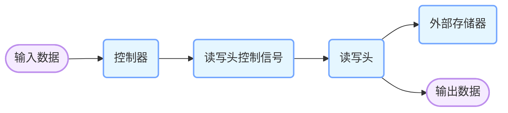

# 神经图灵机在程序合成任务中的应用研究

> 关键词：神经图灵机、程序合成、深度学习、人工智能、计算模型、算法原理、应用场景

> 摘要：本文围绕神经图灵机在程序合成任务中的应用展开深入研究。首先介绍了神经图灵机和程序合成的背景知识，为后续的探讨奠定基础。接着详细阐述了神经图灵机的核心概念、架构以及工作原理，通过Mermaid流程图清晰展示其运行逻辑。深入剖析了神经图灵机的核心算法原理，并结合Python源代码进行详细说明。同时，给出了相关的数学模型和公式，通过具体例子加深理解。在项目实战部分，搭建开发环境，给出实际代码案例并进行详细解读。分析了神经图灵机在程序合成任务中的实际应用场景，推荐了相关的学习资源、开发工具框架以及论文著作。最后总结了神经图灵机在程序合成领域的未来发展趋势与挑战，并对常见问题进行解答，提供扩展阅读和参考资料，旨在为相关领域的研究和实践提供全面且深入的指导。

## 1. 背景介绍 
### 1.1 目的和范围
程序合成是人工智能领域中的一个重要研究方向，其目标是根据给定的规范（如输入输出示例、自然语言描述等）自动生成满足要求的程序。传统的程序合成方法往往依赖于复杂的搜索算法和形式化推理，在处理复杂任务时效率较低且难以扩展。神经图灵机（Neural Turing Machine，NTM）作为一种新型的深度学习模型，结合了神经网络的强大学习能力和图灵机的计算能力，为程序合成任务带来了新的思路和方法。

本文的目的在于深入研究神经图灵机在程序合成任务中的应用，探讨其原理、算法、实现以及实际应用场景，分析其优势和局限性，为相关领域的研究和实践提供理论支持和技术指导。研究范围涵盖神经图灵机的基本概念、核心算法、数学模型，以及在程序合成任务中的具体实现和应用案例。

### 1.2 预期读者
本文预期读者包括人工智能、计算机科学领域的研究人员、学者、工程师和学生，对程序合成、深度学习、神经图灵机等相关技术感兴趣的专业人士，以及希望了解如何将新兴技术应用于实际问题解决的从业者。

### 1.3 文档结构概述
本文共分为十个部分。第一部分为背景介绍，阐述研究的目的和范围、预期读者、文档结构概述以及相关术语表。第二部分介绍神经图灵机和程序合成的核心概念与联系，通过文本示意图和Mermaid流程图展示其原理和架构。第三部分详细讲解神经图灵机的核心算法原理，并给出Python源代码进行说明。第四部分介绍相关的数学模型和公式，并通过具体例子进行详细讲解。第五部分是项目实战，包括开发环境搭建、源代码详细实现和代码解读。第六部分分析神经图灵机在程序合成任务中的实际应用场景。第七部分推荐相关的学习资源、开发工具框架以及论文著作。第八部分总结神经图灵机在程序合成领域的未来发展趋势与挑战。第九部分是附录，解答常见问题。第十部分提供扩展阅读和参考资料。

### 1.4 术语表
#### 1.4.1 核心术语定义
- **神经图灵机（Neural Turing Machine，NTM）**：一种结合了神经网络和图灵机思想的深度学习模型，通过可微分的读写操作与外部存储器进行交互，能够处理复杂的序列数据和计算任务。
- **程序合成（Program Synthesis）**：根据给定的规范（如输入输出示例、自然语言描述等）自动生成满足要求的程序的过程。
- **深度学习（Deep Learning）**：一类基于人工神经网络的机器学习技术，通过多层神经网络自动学习数据的特征和模式。
- **图灵机（Turing Machine）**：由阿兰·图灵提出的一种抽象计算模型，能够模拟任何可计算的算法。
- **外部存储器（External Memory）**：神经图灵机中用于存储信息的组件，通过读写头与神经网络进行交互。

#### 1.4.2 相关概念解释
- **可微分读写操作**：神经图灵机中的读写操作可以通过神经网络进行学习和调整，并且这些操作是可微分的，使得模型可以使用梯度下降等优化算法进行训练。
- **注意力机制（Attention Mechanism）**：在神经图灵机中，注意力机制用于控制读写头在外部存储器上的位置和权重，使得模型能够有选择地读取和写入信息。
- **强化学习（Reinforcement Learning）**：一种通过智能体与环境进行交互，根据环境反馈的奖励信号来学习最优策略的机器学习方法。在程序合成中，强化学习可以用于优化生成程序的质量。

#### 1.4.3 缩略词列表
- **NTM**：Neural Turing Machine（神经图灵机）
- **MLP**：Multi - Layer Perceptron（多层感知机）
- **LSTM**：Long Short - Term Memory（长短期记忆网络）
- **RNN**：Recurrent Neural Network（循环神经网络）

## 2. 核心概念与联系 
### 2.1 神经图灵机的核心概念
神经图灵机是由亚历克斯·格雷夫斯（Alex Graves）等人于2014年提出的一种深度学习模型，旨在将神经网络的学习能力与图灵机的计算能力相结合。传统的神经网络（如循环神经网络RNN、长短期记忆网络LSTM等）虽然在处理序列数据方面取得了一定的成功，但它们的记忆能力有限，难以处理复杂的计算任务。神经图灵机通过引入外部存储器和可微分的读写操作，使得模型能够在训练过程中动态地存储和检索信息，从而增强了模型的计算能力和记忆能力。

神经图灵机主要由三部分组成：控制器（Controller）、外部存储器（External Memory）和读写头（Read/Write Heads）。控制器通常是一个神经网络（如多层感知机MLP、LSTM等），用于处理输入数据并生成读写头的控制信号。外部存储器是一个二维矩阵，用于存储信息。读写头负责在外部存储器上进行读写操作，根据控制器生成的控制信号选择读取或写入的位置和内容。

### 2.2 程序合成的核心概念
程序合成是一个具有挑战性的人工智能任务，其目标是根据给定的规范自动生成满足要求的程序。规范可以是输入输出示例、自然语言描述、逻辑公式等。程序合成的过程通常包括以下几个步骤：
1. **规范理解**：对给定的规范进行分析和理解，提取关键信息。
2. **搜索空间定义**：定义可能的程序搜索空间，通常是一个程序语法树或程序模板的集合。
3. **搜索算法**：在搜索空间中搜索满足规范的程序，常用的搜索算法包括深度优先搜索、广度优先搜索、遗传算法等。
4. **程序验证**：对生成的程序进行验证，确保其满足给定的规范。

### 2.3 神经图灵机与程序合成的联系
神经图灵机在程序合成任务中具有重要的应用价值。一方面，神经图灵机的外部存储器可以用于存储中间计算结果和程序片段，使得模型能够处理复杂的计算任务。另一方面，神经图灵机的可微分读写操作和注意力机制可以帮助模型在搜索空间中更有效地搜索和生成程序。具体来说，神经图灵机可以将程序合成任务看作一个序列生成问题，通过学习输入规范和输出程序之间的映射关系，自动生成满足要求的程序。

### 2.4 文本示意图和Mermaid流程图
#### 2.4.1 文本示意图
神经图灵机的结构可以用以下文本示意图表示：

输入数据 -> 控制器（神经网络） -> 读写头控制信号 -> 读写头 -> 外部存储器
|
v
输出数据

#### 2.4.2 Mermaid流程图


## 3. 核心算法原理 & 具体操作步骤 
### 3.1 神经图灵机的核心算法原理
神经图灵机的核心算法包括控制器的计算、读写头的操作和外部存储器的更新。下面分别介绍这些步骤的具体原理。

#### 3.1.1 控制器的计算
控制器通常是一个神经网络，用于处理输入数据并生成读写头的控制信号。假设输入数据为 $x_t$，控制器的隐藏状态为 $h_t$，则控制器的计算可以表示为：

$h_t = f(h_{t - 1}, x_t)$

其中 $f$ 是控制器的计算函数，通常是一个非线性函数（如ReLU、tanh等）。

#### 3.1.2 读写头的操作
读写头包括读头和写头，分别用于从外部存储器中读取信息和向外部存储器中写入信息。读头的操作可以表示为：

$r_t = \sum_{i = 1}^{N} w_{t}^r(i) M_t(i)$

其中 $r_t$ 是读头在时间步 $t$ 读取的信息，$w_{t}^r(i)$ 是读头在时间步 $t$ 对存储器第 $i$ 行的注意力权重，$M_t(i)$ 是存储器在时间步 $t$ 的第 $i$ 行。

写头的操作包括擦除和写入两个步骤。擦除操作可以表示为：

$M_t'(i) = M_{t - 1}(i)(1 - w_{t}^w(i) e_t)$

其中 $M_t'(i)$ 是擦除后的存储器第 $i$ 行，$w_{t}^w(i)$ 是写头在时间步 $t$ 对存储器第 $i$ 行的注意力权重，$e_t$ 是擦除向量。

写入操作可以表示为：

$M_t(i) = M_t'(i) + w_{t}^w(i) a_t$

其中 $M_t(i)$ 是写入后的存储器第 $i$ 行，$a_t$ 是写入向量。

#### 3.1.3 外部存储器的更新
外部存储器的更新是通过读写头的操作实现的。在每个时间步，读写头根据控制器生成的控制信号对外部存储器进行读写操作，从而更新外部存储器的内容。

### 3.2 具体操作步骤
下面是神经图灵机的具体操作步骤：
1. **初始化**：初始化外部存储器 $M_0$、控制器的隐藏状态 $h_0$ 和读写头的注意力权重 $w_0^r$、$w_0^w$。
2. **输入数据**：接收输入数据 $x_t$。
3. **控制器计算**：根据输入数据 $x_t$ 和控制器的隐藏状态 $h_{t - 1}$ 计算新的隐藏状态 $h_t$。
4. **读写头操作**：根据控制器的隐藏状态 $h_t$ 生成读写头的控制信号，包括注意力权重 $w_{t}^r$、$w_{t}^w$、擦除向量 $e_t$ 和写入向量 $a_t$，并进行读写操作。
5. **外部存储器更新**：根据读写头的操作更新外部存储器的内容 $M_t$。
6. **输出数据**：根据读头读取的信息 $r_t$ 和控制器的隐藏状态 $h_t$ 生成输出数据 $y_t$。
7. **重复步骤2 - 6**：直到处理完所有的输入数据。

### 3.3 Python源代码详细阐述
```python
import torch
import torch.nn as nn
import torch.nn.functional as F

# 定义控制器（这里使用简单的MLP）
class Controller(nn.Module):
    def __init__(self, input_size, hidden_size, output_size):
        super(Controller, self).__init__()
        self.fc1 = nn.Linear(input_size, hidden_size)
        self.fc2 = nn.Linear(hidden_size, output_size)

    def forward(self, x):
        x = F.relu(self.fc1(x))
        x = self.fc2(x)
        return x

# 定义神经图灵机
class NeuralTuringMachine(nn.Module):
    def __init__(self, input_size, hidden_size, output_size, memory_size, memory_length):
        super(NeuralTuringMachine, self).__init__()
        self.controller = Controller(input_size, hidden_size, output_size)
        self.memory_size = memory_size
        self.memory_length = memory_length
        self.memory = torch.zeros(memory_size, memory_length)

    def forward(self, x):
        # 控制器计算
        control_signal = self.controller(x)

        # 读写头操作（简化示例）
        read_weight = F.softmax(control_signal[:self.memory_size], dim=0)
        read_vector = torch.sum(read_weight.unsqueeze(1) * self.memory, dim=0)

        # 写操作（简化示例）
        write_weight = F.softmax(control_signal[self.memory_size:2 * self.memory_size], dim=0)
        erase_vector = torch.sigmoid(control_signal[2 * self.memory_size:3 * self.memory_size])
        add_vector = control_signal[3 * self.memory_size:]
        self.memory = self.memory * (1 - write_weight.unsqueeze(1) * erase_vector.unsqueeze(1)) + write_weight.unsqueeze(1) * add_vector.unsqueeze(1)

        # 输出数据
        output = torch.cat((read_vector, control_signal), dim=0)
        return output
```

## 4. 数学模型和公式 & 详细讲解 & 举例说明 
### 4.1 神经图灵机的数学模型
神经图灵机的数学模型可以用以下公式表示：

#### 4.1.1 控制器的计算
$h_t = f(h_{t - 1}, x_t)$

其中 $h_t$ 是控制器在时间步 $t$ 的隐藏状态，$x_t$ 是输入数据，$f$ 是控制器的计算函数。

#### 4.1.2 读头的操作
$r_t = \sum_{i = 1}^{N} w_{t}^r(i) M_t(i)$

其中 $r_t$ 是读头在时间步 $t$ 读取的信息，$w_{t}^r(i)$ 是读头在时间步 $t$ 对存储器第 $i$ 行的注意力权重，$M_t(i)$ 是存储器在时间步 $t$ 的第 $i$ 行。

#### 4.1.3 写头的操作
擦除操作：

$M_t'(i) = M_{t - 1}(i)(1 - w_{t}^w(i) e_t)$

写入操作：

$M_t(i) = M_t'(i) + w_{t}^w(i) a_t$

其中 $M_t'(i)$ 是擦除后的存储器第 $i$ 行，$M_t(i)$ 是写入后的存储器第 $i$ 行，$w_{t}^w(i)$ 是写头在时间步 $t$ 对存储器第 $i$ 行的注意力权重，$e_t$ 是擦除向量，$a_t$ 是写入向量。

### 4.2 详细讲解
#### 4.2.1 控制器的计算
控制器的计算是神经图灵机的核心部分，它负责处理输入数据并生成读写头的控制信号。控制器通常是一个神经网络，通过学习输入数据和输出控制信号之间的映射关系，使得模型能够根据输入数据动态地调整读写头的操作。

#### 4.2.2 读头的操作
读头的操作是通过注意力机制实现的。注意力权重 $w_{t}^r(i)$ 表示读头在时间步 $t$ 对存储器第 $i$ 行的关注程度，通过加权求和的方式从存储器中读取信息。注意力机制使得读头能够有选择地读取存储器中的信息，提高了模型的效率和灵活性。

#### 4.2.3 写头的操作
写头的操作包括擦除和写入两个步骤。擦除操作通过擦除向量 $e_t$ 对存储器中的信息进行部分擦除，写入操作通过写入向量 $a_t$ 向存储器中写入新的信息。擦除和写入操作的结合使得模型能够动态地更新存储器中的信息，从而实现对复杂计算任务的处理。

### 4.3 举例说明
假设我们有一个简单的神经图灵机，存储器大小为 $N = 3$，存储器长度为 $M = 2$，输入数据为 $x_t = [1, 2]$，控制器的隐藏状态为 $h_{t - 1} = [0.1, 0.2]$。

#### 4.3.1 控制器的计算
假设控制器是一个简单的MLP，计算过程如下：

$h_t = f(h_{t - 1}, x_t) = \text{ReLU}(W_1[h_{t - 1}, x_t] + b_1)$

其中 $W_1$ 是权重矩阵，$b_1$ 是偏置向量。

#### 4.3.2 读头的操作
假设读头的注意力权重为 $w_{t}^r = [0.2, 0.3, 0.5]$，存储器内容为 $M_t = \begin{bmatrix}1 & 2\\3 & 4\\5 & 6\end{bmatrix}$，则读头读取的信息为：

$r_t = \sum_{i = 1}^{3} w_{t}^r(i) M_t(i) = 0.2\begin{bmatrix}1\\2\end{bmatrix} + 0.3\begin{bmatrix}3\\4\end{bmatrix} + 0.5\begin{bmatrix}5\\6\end{bmatrix} = \begin{bmatrix}3.6\\4.8\end{bmatrix}$

#### 4.3.3 写头的操作
假设写头的注意力权重为 $w_{t}^w = [0.1, 0.4, 0.5]$，擦除向量为 $e_t = [0.2, 0.3]$，写入向量为 $a_t = [0.5, 0.6]$，则擦除后的存储器内容为：

$M_t'(i) = M_{t - 1}(i)(1 - w_{t}^w(i) e_t)$

$M_t'(1) = \begin{bmatrix}1\\2\end{bmatrix}(1 - 0.1\begin{bmatrix}0.2\\0.3\end{bmatrix}) = \begin{bmatrix}0.98\\1.94\end{bmatrix}$

$M_t'(2) = \begin{bmatrix}3\\4\end{bmatrix}(1 - 0.4\begin{bmatrix}0.2\\0.3\end{bmatrix}) = \begin{bmatrix}2.76\\3.52\end{bmatrix}$

$M_t'(3) = \begin{bmatrix}5\\6\end{bmatrix}(1 - 0.5\begin{bmatrix}0.2\\0.3\end{bmatrix}) = \begin{bmatrix}4.5\\5.1\end{bmatrix}$

写入后的存储器内容为：

$M_t(i) = M_t'(i) + w_{t}^w(i) a_t$

$M_t(1) = \begin{bmatrix}0.98\\1.94\end{bmatrix} + 0.1\begin{bmatrix}0.5\\0.6\end{bmatrix} = \begin{bmatrix}1.03\\2\end{bmatrix}$

$M_t(2) = \begin{bmatrix}2.76\\3.52\end{bmatrix} + 0.4\begin{bmatrix}0.5\\0.6\end{bmatrix} = \begin{bmatrix}2.96\\3.76\end{bmatrix}$

$M_t(3) = \begin{bmatrix}4.5\\5.1\end{bmatrix} + 0.5\begin{bmatrix}0.5\\0.6\end{bmatrix} = \begin{bmatrix}4.75\\5.4\end{bmatrix}$

## 5. 项目实战：代码实际案例和详细解释说明 
### 5.1 开发环境搭建
#### 5.1.1 操作系统
本文推荐使用Ubuntu 18.04及以上版本的Linux操作系统，或者Windows 10及以上版本的Windows操作系统。

#### 5.1.2 编程语言和框架
使用Python 3.7及以上版本作为编程语言，使用PyTorch 1.7及以上版本作为深度学习框架。可以使用以下命令安装PyTorch：

```bash
pip install torch torchvision
```

#### 5.1.3 开发工具
推荐使用PyCharm或Jupyter Notebook作为开发工具。PyCharm是一个功能强大的Python集成开发环境，提供了代码编辑、调试、版本控制等功能。Jupyter Notebook是一个交互式的开发环境，适合进行实验和数据分析。

### 5.2 源代码详细实现和代码解读
#### 5.2.1 数据准备
假设我们要解决一个简单的程序合成任务，输入是一个长度为 $n$ 的整数序列，输出是该序列的逆序序列。我们可以生成一些训练数据，代码如下：

```python
import random

# 生成训练数据
def generate_data(num_samples, sequence_length):
    data = []
    for _ in range(num_samples):
        sequence = [random.randint(0, 9) for _ in range(sequence_length)]
        target = sequence[::-1]
        data.append((sequence, target))
    return data

# 示例
num_samples = 1000
sequence_length = 5
train_data = generate_data(num_samples, sequence_length)
```

#### 5.2.2 神经图灵机模型定义
我们使用之前定义的神经图灵机模型，代码如下：

```python
import torch
import torch.nn as nn
import torch.nn.functional as F

# 定义控制器（这里使用简单的MLP）
class Controller(nn.Module):
    def __init__(self, input_size, hidden_size, output_size):
        super(Controller, self).__init__()
        self.fc1 = nn.Linear(input_size, hidden_size)
        self.fc2 = nn.Linear(hidden_size, output_size)

    def forward(self, x):
        x = F.relu(self.fc1(x))
        x = self.fc2(x)
        return x

# 定义神经图灵机
class NeuralTuringMachine(nn.Module):
    def __init__(self, input_size, hidden_size, output_size, memory_size, memory_length):
        super(NeuralTuringMachine, self).__init__()
        self.controller = Controller(input_size, hidden_size, output_size)
        self.memory_size = memory_size
        self.memory_length = memory_length
        self.memory = torch.zeros(memory_size, memory_length)

    def forward(self, x):
        # 控制器计算
        control_signal = self.controller(x)

        # 读写头操作（简化示例）
        read_weight = F.softmax(control_signal[:self.memory_size], dim=0)
        read_vector = torch.sum(read_weight.unsqueeze(1) * self.memory, dim=0)

        # 写操作（简化示例）
        write_weight = F.softmax(control_signal[self.memory_size:2 * self.memory_size], dim=0)
        erase_vector = torch.sigmoid(control_signal[2 * self.memory_size:3 * self.memory_size])
        add_vector = control_signal[3 * self.memory_size:]
        self.memory = self.memory * (1 - write_weight.unsqueeze(1) * erase_vector.unsqueeze(1)) + write_weight.unsqueeze(1) * add_vector.unsqueeze(1)

        # 输出数据
        output = torch.cat((read_vector, control_signal), dim=0)
        return output
```

#### 5.2.3 训练过程
定义损失函数和优化器，进行训练，代码如下：

```python
# 初始化模型
input_size = sequence_length
hidden_size = 10
output_size = 4 * memory_size + memory_length
memory_size = 3
memory_length = 2
model = NeuralTuringMachine(input_size, hidden_size, output_size, memory_size, memory_length)

# 定义损失函数和优化器
criterion = nn.MSELoss()
optimizer = torch.optim.Adam(model.parameters(), lr=0.001)

# 训练模型
num_epochs = 100
for epoch in range(num_epochs):
    total_loss = 0
    for sequence, target in train_data:
        sequence = torch.tensor(sequence, dtype=torch.float32)
        target = torch.tensor(target, dtype=torch.float32)

        # 前向传播
        output = model(sequence)
        loss = criterion(output[:sequence_length], target)

        # 反向传播和优化
        optimizer.zero_grad()
        loss.backward()
        optimizer.step()

        total_loss += loss.item()

    if (epoch + 1) % 10 == 0:
        print(f'Epoch [{epoch + 1}/{num_epochs}], Loss: {total_loss / num_samples:.4f}')
```

### 5.3 代码解读与分析
#### 5.3.1 数据准备
`generate_data` 函数用于生成训练数据，通过随机生成整数序列并计算其逆序序列作为目标输出。

#### 5.3.2 神经图灵机模型定义
`Controller` 类定义了控制器，使用简单的MLP进行计算。`NeuralTuringMachine` 类定义了神经图灵机，包括控制器、外部存储器和读写头的操作。

#### 5.3.3 训练过程
在训练过程中，我们使用均方误差损失函数（MSE）和Adam优化器进行训练。对于每个训练样本，我们将输入序列输入到模型中，得到输出，计算输出与目标输出之间的损失，然后进行反向传播和参数更新。

## 6. 实际应用场景 
### 6.1 自动化编程
神经图灵机在自动化编程领域具有重要的应用价值。通过学习大量的代码示例和程序规范，神经图灵机可以自动生成满足要求的程序。例如，在软件开发中，开发者可以提供程序的功能描述和输入输出示例，神经图灵机可以自动生成相应的代码，提高开发效率。

### 6.2 智能教育
在智能教育领域，神经图灵机可以用于辅助学生编程学习。例如，当学生遇到编程难题时，神经图灵机可以根据学生提供的问题描述和测试用例，自动生成解决方案，帮助学生理解编程思路和方法。

### 6.3 软件维护和优化
神经图灵机可以用于软件维护和优化。通过分析软件的代码结构和运行数据，神经图灵机可以自动检测软件中的漏洞和性能瓶颈，并生成相应的修复和优化方案，提高软件的质量和性能。

### 6.4 自然语言处理
在自然语言处理领域，神经图灵机可以用于文本生成、机器翻译等任务。例如，在文本生成任务中，神经图灵机可以根据输入的文本上下文和主题信息，自动生成连贯的文本内容。

## 7. 工具和资源推荐
### 7.1 学习资源推荐
#### 7.1.1 书籍推荐
- 《深度学习》（Deep Learning），作者：Ian Goodfellow、Yoshua Bengio和Aaron Courville。这本书是深度学习领域的经典教材，系统地介绍了深度学习的基本概念、算法和应用。
- 《Python深度学习》（Deep Learning with Python），作者：Francois Chollet。这本书以Python和Keras为工具，详细介绍了深度学习的实践方法和应用案例。
- 《神经网络与深度学习》（Neural Networks and Deep Learning），作者：Michael Nielsen。这本书以通俗易懂的方式介绍了神经网络和深度学习的基本原理和算法。

#### 7.1.2 在线课程
- Coursera上的“深度学习专项课程”（Deep Learning Specialization），由吴恩达（Andrew Ng）教授授课。该课程系统地介绍了深度学习的各个方面，包括神经网络基础、卷积神经网络、循环神经网络等。
- edX上的“强化学习基础”（Foundations of Reinforcement Learning），由伯克利大学的Pieter Abbeel教授授课。该课程介绍了强化学习的基本概念、算法和应用。
- 哔哩哔哩（Bilibili）上的“李宏毅机器学习”课程，由台湾大学的李宏毅教授授课。该课程以生动有趣的方式介绍了机器学习和深度学习的基本原理和应用。

#### 7.1.3 技术博客和网站
- Medium上的“Towards Data Science”，这是一个专注于数据科学和机器学习的技术博客，提供了大量的高质量文章和教程。
- arXiv.org，这是一个开放获取的学术预印本平台，提供了大量的计算机科学、数学、物理学等领域的研究论文。
- GitHub，这是一个全球最大的开源代码托管平台，提供了大量的深度学习相关的开源项目和代码示例。

### 7.2 开发工具框架推荐
#### 7.2.1 IDE和编辑器
- PyCharm，这是一个功能强大的Python集成开发环境，提供了代码编辑、调试、版本控制等功能。
- Jupyter Notebook，这是一个交互式的开发环境，适合进行实验和数据分析。
- Visual Studio Code，这是一个轻量级的代码编辑器，支持多种编程语言和插件扩展。

#### 7.2.2 调试和性能分析工具
- PyTorch Profiler，这是PyTorch官方提供的性能分析工具，可以帮助开发者分析模型的运行时间、内存使用等情况。
- TensorBoard，这是TensorFlow官方提供的可视化工具，也可以用于PyTorch模型的可视化和调试。
- cProfile，这是Python标准库中的性能分析工具，可以帮助开发者分析Python代码的运行时间和函数调用情况。

#### 7.2.3 相关框架和库
- PyTorch，这是一个开源的深度学习框架，提供了丰富的神经网络模块和优化算法，支持GPU加速。
- TensorFlow，这是另一个广泛使用的开源深度学习框架，提供了高级的神经网络构建接口和分布式训练功能。
- NumPy，这是Python中用于科学计算的基础库，提供了高效的多维数组操作和数学函数。

### 7.3 相关论文著作推荐
#### 7.3.1 经典论文
- “Neural Turing Machines”，作者：Alex Graves、Greg Wayne和Ivo Danihelka。这是神经图灵机的开创性论文，介绍了神经图灵机的基本概念、架构和算法。
- “Show, Attend and Tell: Neural Image Caption Generation with Visual Attention”，作者：Kelvin Xu、Jimmy Ba等。这篇论文介绍了注意力机制在图像描述生成任务中的应用，为神经图灵机中的注意力机制提供了重要的参考。
- “Generating Programs from Noisy Data”，作者：Rishabh Singh、Armando Solar - Lezama等。这篇论文介绍了程序合成的基本概念和方法，为神经图灵机在程序合成任务中的应用提供了理论基础。

#### 7.3.2 最新研究成果
- 关注arXiv.org上关于神经图灵机、程序合成和深度学习的最新研究论文，了解该领域的最新发展动态。
- 参加相关的学术会议，如NeurIPS（神经信息处理系统大会）、ICML（国际机器学习会议）等，听取最新的研究报告和学术交流。

#### 7.3.3 应用案例分析
- 分析GitHub上的开源项目，了解神经图灵机在实际应用中的实现和优化方法。
- 阅读相关的技术博客和论文，了解神经图灵机在不同领域的应用案例和经验分享。

## 8. 总结：未来发展趋势与挑战
### 8.1 未来发展趋势
#### 8.1.1 模型改进
未来的研究可能会致力于改进神经图灵机的模型结构和算法，提高模型的性能和效率。例如，引入更复杂的注意力机制、优化读写头的操作、改进控制器的设计等。

#### 8.1.2 多模态融合
神经图灵机可能会与其他模态的信息（如图像、语音等）进行融合，实现多模态的程序合成任务。例如，根据图像和自然语言描述生成相应的程序。

#### 8.1.3 强化学习与程序合成的结合
强化学习可以用于优化神经图灵机在程序合成任务中的性能。未来的研究可能会进一步探索强化学习与程序合成的结合，提高生成程序的质量和效率。

#### 8.1.4 实际应用拓展
神经图灵机在自动化编程、智能教育、软件维护等领域的应用将会得到进一步拓展。随着技术的不断发展，神经图灵机将在更多的实际场景中发挥作用。

### 8.2 挑战
#### 8.2.1 计算资源需求
神经图灵机的训练和推理需要大量的计算资源，尤其是在处理大规模数据和复杂任务时。如何降低计算资源需求，提高模型的训练和推理效率是一个重要的挑战。

#### 8.2.2 数据获取和标注
程序合成任务需要大量的训练数据，并且这些数据需要进行标注。如何获取高质量的训练数据并进行有效的标注是一个具有挑战性的问题。

#### 8.2.3 模型解释性
神经图灵机作为一种深度学习模型，其决策过程往往是黑盒的，缺乏可解释性。如何提高神经图灵机的可解释性，让用户更好地理解模型的决策过程是一个重要的研究方向。

#### 8.2.4 泛化能力
神经图灵机在训练数据上可能表现良好，但在面对未见过的任务和数据时，其泛化能力可能会受到挑战。如何提高神经图灵机的泛化能力，使其能够处理更广泛的程序合成任务是一个亟待解决的问题。

## 9. 附录：常见问题与解答
### 9.1 神经图灵机与传统神经网络有什么区别？
神经图灵机与传统神经网络的主要区别在于引入了外部存储器和可微分的读写操作。传统神经网络的记忆能力有限，难以处理复杂的计算任务。而神经图灵机通过外部存储器可以动态地存储和检索信息，增强了模型的计算能力和记忆能力。

### 9.2 神经图灵机在程序合成任务中的优势是什么？
神经图灵机在程序合成任务中的优势包括：
1. **强大的记忆能力**：通过外部存储器可以存储中间计算结果和程序片段，处理复杂的计算任务。
2. **可微分的读写操作**：使得模型可以使用梯度下降等优化算法进行训练，提高了模型的学习能力。
3. **注意力机制**：可以帮助模型在搜索空间中更有效地搜索和生成程序，提高了生成程序的质量和效率。

### 9.3 如何训练神经图灵机？
训练神经图灵机通常使用监督学习或强化学习的方法。在监督学习中，我们可以根据输入输出示例来训练模型，使得模型能够学习输入规范和输出程序之间的映射关系。在强化学习中，我们可以根据生成程序的质量和效率来给予奖励信号，优化模型的策略。

### 9.4 神经图灵机的计算复杂度如何？
神经图灵机的计算复杂度主要取决于控制器的计算复杂度、读写头的操作复杂度和外部存储器的大小。一般来说，神经图灵机的计算复杂度较高，尤其是在处理大规模数据和复杂任务时。

### 9.5 神经图灵机的可解释性如何？
神经图灵机的可解释性较差，其决策过程往往是黑盒的。为了提高神经图灵机的可解释性，可以采用一些方法，如可视化注意力权重、分析存储器的使用情况等。

## 10. 扩展阅读 & 参考资料
### 10.1 扩展阅读
- “The Unreasonable Effectiveness of Recurrent Neural Networks”，作者：Andrej Karpathy。这篇博客文章介绍了循环神经网络的强大能力和应用案例。
- “Attention Is All You Need”，作者：Ashish Vaswani、Noam Shazeer等。这篇论文介绍了Transformer模型和注意力机制的应用。
- “Program Synthesis”，作者：Sumit Gulwani、Oleksandr Polozov等。这篇综述文章介绍了程序合成的基本概念、方法和应用。

### 10.2 参考资料
- Graves, A., Wayne, G., & Danihelka, I. (2014). Neural Turing Machines. arXiv preprint arXiv:1410.5401.
- Xu, K., Ba, J., Kiros, R., Cho, K., Courville, A., Salakhutdinov, R., ... & Bengio, Y. (2015). Show, attend and tell: Neural image caption generation with visual attention. In Proceedings of the IEEE international conference on computer vision (pp. 2048 - 2057).
- Singh, R., & Solar - Lezama, A. (2016). Generating programs from noisy data. ACM SIGPLAN Notices, 51(6), 655 - 669.