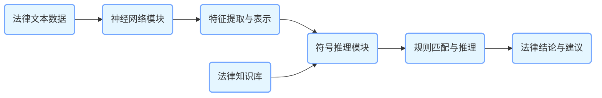

# 神经符号整合的可解释法律推理与建议系统设计

> 关键词：神经符号整合、可解释性、法律推理、建议系统、人工智能

> 摘要：本文聚焦于神经符号整合的可解释法律推理与建议系统设计。在法律领域，传统的法律推理系统存在可解释性不足等问题，而神经符号整合为解决这些问题提供了新的思路。通过将神经网络的强大学习能力与符号推理的逻辑严谨性相结合，能够构建出既具有高效推理能力又具备良好可解释性的法律推理与建议系统。文章深入探讨了该系统的核心概念、算法原理、数学模型，并通过项目实战展示其实现过程，分析其实际应用场景，最后对相关工具和资源进行推荐，总结未来发展趋势与挑战。

## 1. 背景介绍 
### 1.1 目的和范围
在当今数字化时代，法律领域面临着大量的法律文本和复杂的案件信息，如何高效准确地进行法律推理并提供合理的建议成为亟待解决的问题。本系统设计的目的在于构建一个基于神经符号整合的可解释法律推理与建议系统，以提高法律推理的效率和准确性，同时为用户提供清晰的推理过程解释。本系统的范围涵盖了民事、刑事等多个法律领域，能够处理常见的法律案件推理和建议任务。

### 1.2 预期读者
本文预期读者包括法律专业人士，如律师、法官等，他们可以借助该系统辅助法律推理和决策；计算机科学领域的研究人员和开发者，他们可以从技术实现角度深入了解神经符号整合在法律领域的应用；以及对人工智能与法律交叉领域感兴趣的学生和爱好者。

### 1.3 文档结构概述
本文首先介绍神经符号整合的可解释法律推理与建议系统的背景，包括目的、预期读者和文档结构概述等内容。接着阐述系统的核心概念与联系，包括相关原理和架构。然后详细讲解核心算法原理和具体操作步骤，通过Python源代码进行阐述。之后介绍数学模型和公式，并举例说明。再通过项目实战展示系统的开发环境搭建、源代码实现和代码解读。随后分析系统的实际应用场景。接着推荐相关的工具和资源。最后总结未来发展趋势与挑战，给出常见问题与解答以及扩展阅读和参考资料。

### 1.4 术语表
#### 1.4.1 核心术语定义
- **神经符号整合**：将神经网络的学习能力与符号推理的逻辑表达和推理能力相结合的一种技术方法。
- **可解释性**：系统能够以人类可理解的方式解释其推理过程和决策结果的能力。
- **法律推理**：根据法律规定和案件事实，运用逻辑方法推导出法律结论的过程。
- **建议系统**：为用户提供相关法律建议和决策参考的系统。

#### 1.4.2 相关概念解释
- **神经网络**：一种模仿人类神经系统的计算模型，由大量的神经元组成，能够自动从数据中学习特征和模式。
- **符号推理**：基于符号逻辑和规则进行推理的方法，具有明确的逻辑结构和可解释性。

#### 1.4.3 缩略词列表
- **AI**：Artificial Intelligence，人工智能
- **ML**：Machine Learning，机器学习
- **NLP**：Natural Language Processing，自然语言处理

## 2. 核心概念与联系 
### 核心概念原理
神经符号整合的可解释法律推理与建议系统的核心原理在于将神经网络和符号推理有机结合。神经网络具有强大的模式识别和学习能力，能够从大量的法律文本数据中自动提取特征和模式，例如对法律条文和案件事实的语义理解。而符号推理则基于明确的逻辑规则和法律知识表示，能够进行严谨的逻辑推理和决策。通过神经符号整合，系统可以利用神经网络的学习能力来处理不确定和复杂的法律文本信息，同时利用符号推理的可解释性来提供清晰的推理过程和结论。

### 架构示意图

该架构图展示了系统的主要流程。首先，法律文本数据进入神经网络模块进行特征提取和表示，将非结构化的文本数据转换为结构化的特征向量。然后，这些特征向量进入符号推理模块，结合法律知识库中的规则进行匹配和推理，最终得出法律结论和建议。

## 3. 核心算法原理 & 具体操作步骤 
### 核心算法原理
本系统主要使用的核心算法包括神经网络算法和符号推理算法。以下以Python代码为例，详细阐述这些算法的实现。

#### 神经网络部分：使用深度学习框架PyTorch进行文本分类示例
```python
import torch
import torch.nn as nn
import torch.optim as optim
from torch.utils.data import Dataset, DataLoader

# 定义数据集类
class LegalTextDataset(Dataset):
    def __init__(self, texts, labels):
        self.texts = texts
        self.labels = labels

    def __len__(self):
        return len(self.texts)

    def __getitem__(self, idx):
        text = self.texts[idx]
        label = self.labels[idx]
        return text, label

# 定义简单的文本分类神经网络模型
class TextClassifier(nn.Module):
    def __init__(self, vocab_size, embedding_dim, hidden_dim, output_dim):
        super(TextClassifier, self).__init__()
        self.embedding = nn.Embedding(vocab_size, embedding_dim)
        self.fc1 = nn.Linear(embedding_dim, hidden_dim)
        self.relu = nn.ReLU()
        self.fc2 = nn.Linear(hidden_dim, output_dim)

    def forward(self, x):
        embedded = self.embedding(x)
        pooled = torch.mean(embedded, dim=1)
        out = self.fc1(pooled)
        out = self.relu(out)
        out = self.fc2(out)
        return out

# 训练模型
def train_model(model, train_loader, criterion, optimizer, epochs):
    model.train()
    for epoch in range(epochs):
        running_loss = 0.0
        for texts, labels in train_loader:
            optimizer.zero_grad()
            outputs = model(texts)
            loss = criterion(outputs, labels)
            loss.backward()
            optimizer.step()
            running_loss += loss.item()
        print(f'Epoch {epoch + 1}, Loss: {running_loss / len(train_loader)}')

# 示例数据
texts = ["这是一个民事案件", "这是一个刑事案件"]
labels = [0, 1]
vocab_size = 1000
embedding_dim = 100
hidden_dim = 64
output_dim = 2

# 创建数据集和数据加载器
dataset = LegalTextDataset(texts, labels)
train_loader = DataLoader(dataset, batch_size=1, shuffle=True)

# 初始化模型、损失函数和优化器
model = TextClassifier(vocab_size, embedding_dim, hidden_dim, output_dim)
criterion = nn.CrossEntropyLoss()
optimizer = optim.Adam(model.parameters(), lr=0.001)

# 训练模型
train_model(model, train_loader, criterion, optimizer, epochs=5)
```
#### 符号推理部分：简单的规则匹配推理示例
```python
# 定义法律规则库
rules = {
    "规则1": {
        "条件": "案件类型 == '民事' and 涉及金额 < 10000",
        "结论": "适用简易程序"
    },
    "规则2": {
        "条件": "案件类型 == '刑事' and 犯罪情节较轻",
        "结论": "可能从轻处罚"
    }
}

# 定义推理函数
def symbolic_reasoning(case_info):
    for rule_name, rule in rules.items():
        condition = rule["条件"]
        # 简单的条件评估
        if eval(condition, case_info):
            return rule["结论"]
    return "未找到匹配规则"

# 示例案件信息
case_info = {
    "案件类型": "民事",
    "涉及金额": 5000
}

# 进行符号推理
result = symbolic_reasoning(case_info)
print(f"推理结果: {result}")
```
### 具体操作步骤
1. **数据预处理**：对法律文本数据进行清洗、分词、标注等预处理操作，将其转换为适合神经网络处理的格式。
2. **神经网络训练**：使用预处理后的数据训练神经网络模型，使其能够准确地提取法律文本的特征和模式。
3. **符号推理规则构建**：根据法律知识和专家经验，构建符号推理规则库，明确规则的条件和结论。
4. **神经符号整合**：将神经网络提取的特征与符号推理规则相结合，进行综合推理。
5. **系统评估与优化**：使用测试数据对系统进行评估，根据评估结果对系统进行优化和调整。

## 4. 数学模型和公式 & 详细讲解 & 举例说明 
### 神经网络部分数学模型
#### 嵌入层
在神经网络的嵌入层，将输入的文本中的每个词映射到一个低维的向量空间中。假设输入的文本包含 $n$ 个词，词汇表大小为 $V$，嵌入维度为 $d$，则嵌入层的数学模型可以表示为：
$$
\mathbf{E} \in \mathbb{R}^{V \times d}
$$
其中 $\mathbf{E}$ 是嵌入矩阵，对于输入文本中的第 $i$ 个词 $w_i$，其对应的嵌入向量为 $\mathbf{e}_i = \mathbf{E}[w_i]$。

#### 全连接层
全连接层将输入的特征向量进行线性变换和非线性激活。假设输入特征向量为 $\mathbf{x} \in \mathbb{R}^m$，隐藏层神经元数量为 $h$，输出层神经元数量为 $k$，则全连接层的数学模型可以表示为：
$$
\mathbf{h} = \sigma(\mathbf{W}_1\mathbf{x} + \mathbf{b}_1)
$$
$$
\mathbf{y} = \mathbf{W}_2\mathbf{h} + \mathbf{b}_2
$$
其中 $\mathbf{W}_1 \in \mathbb{R}^{h \times m}$ 和 $\mathbf{W}_2 \in \mathbb{R}^{k \times h}$ 是权重矩阵，$\mathbf{b}_1 \in \mathbb{R}^h$ 和 $\mathbf{b}_2 \in \mathbb{R}^k$ 是偏置向量，$\sigma$ 是激活函数，如ReLU函数：
$$
\sigma(x) = \max(0, x)
$$

#### 损失函数
在训练神经网络时，通常使用交叉熵损失函数来衡量模型预测结果与真实标签之间的差异。假设模型的预测概率分布为 $\mathbf{p} = [p_1, p_2, \cdots, p_k]$，真实标签的概率分布为 $\mathbf{q} = [q_1, q_2, \cdots, q_k]$，则交叉熵损失函数可以表示为：
$$
L(\mathbf{p}, \mathbf{q}) = -\sum_{i=1}^{k} q_i \log(p_i)
$$

### 符号推理部分数学模型
符号推理基于逻辑规则进行，规则可以表示为条件-结论的形式。假设规则 $r$ 的条件为 $C_r$，结论为 $R_r$，则规则可以表示为：
$$
C_r \Rightarrow R_r
$$
在推理过程中，根据案件信息 $I$ 对条件 $C_r$ 进行评估，如果 $C_r(I)$ 为真，则得出结论 $R_r$。

### 举例说明
#### 神经网络部分
假设输入的文本为 "这是一个民事案件"，经过分词后得到 ["这", "是", "一个", "民事", "案件"]。词汇表大小 $V = 1000$，嵌入维度 $d = 100$，则每个词对应的嵌入向量可以从嵌入矩阵 $\mathbf{E}$ 中获取。假设输入特征向量 $\mathbf{x}$ 的维度为 $m = 100$，隐藏层神经元数量 $h = 64$，输出层神经元数量 $k = 2$，则通过全连接层的计算可以得到预测结果。

#### 符号推理部分
假设规则为 "案件类型 == '民事' and 涉及金额 < 10000 => 适用简易程序"，案件信息 $I$ 为 { "案件类型": "民事", "涉及金额": 5000 }，对条件 "案件类型 == '民事' and 涉及金额 < 10000" 进行评估，结果为真，则得出结论 "适用简易程序"。

## 5. 项目实战：代码实际案例和详细解释说明 
### 5.1  开发环境搭建
#### 安装Python
首先，确保系统中已经安装了Python，建议使用Python 3.7及以上版本。可以从Python官方网站（https://www.python.org/downloads/）下载并安装。

#### 安装依赖库
本项目主要使用的依赖库包括PyTorch、NLTK（自然语言处理工具包）等。可以使用以下命令进行安装：
```sh
pip install torch nltk
```

#### 配置开发环境
可以使用集成开发环境（IDE）如PyCharm或VS Code进行开发，也可以使用Jupyter Notebook进行交互式开发。

### 5.2  源代码详细实现和代码解读
#### 数据预处理
```python
import nltk
from nltk.tokenize import word_tokenize
from sklearn.preprocessing import LabelEncoder

nltk.download('punkt')

# 示例法律文本数据和标签
texts = ["这是一个民事案件", "这是一个刑事案件"]
labels = ["民事", "刑事"]

# 分词
tokenized_texts = []
for text in texts:
    tokens = word_tokenize(text)
    tokenized_texts.append(tokens)

# 标签编码
label_encoder = LabelEncoder()
encoded_labels = label_encoder.fit_transform(labels)

print("分词结果:", tokenized_texts)
print("编码后的标签:", encoded_labels)
```
代码解读：首先使用NLTK的`word_tokenize`函数对法律文本进行分词，将文本拆分为单个的词。然后使用`LabelEncoder`对标签进行编码，将文本标签转换为数值标签，方便后续的神经网络训练。

#### 神经网络模型构建与训练
```python
import torch
import torch.nn as nn
import torch.optim as optim
from torch.utils.data import Dataset, DataLoader

# 定义数据集类
class LegalTextDataset(Dataset):
    def __init__(self, texts, labels):
        self.texts = texts
        self.labels = labels

    def __len__(self):
        return len(self.texts)

    def __getitem__(self, idx):
        text = self.texts[idx]
        label = self.labels[idx]
        return text, label

# 定义简单的文本分类神经网络模型
class TextClassifier(nn.Module):
    def __init__(self, vocab_size, embedding_dim, hidden_dim, output_dim):
        super(TextClassifier, self).__init__()
        self.embedding = nn.Embedding(vocab_size, embedding_dim)
        self.fc1 = nn.Linear(embedding_dim, hidden_dim)
        self.relu = nn.ReLU()
        self.fc2 = nn.Linear(hidden_dim, output_dim)

    def forward(self, x):
        embedded = self.embedding(x)
        pooled = torch.mean(embedded, dim=1)
        out = self.fc1(pooled)
        out = self.relu(out)
        out = self.fc2(out)
        return out

# 示例数据
vocab_size = 1000
embedding_dim = 100
hidden_dim = 64
output_dim = 2

# 创建数据集和数据加载器
dataset = LegalTextDataset(tokenized_texts, encoded_labels)
train_loader = DataLoader(dataset, batch_size=1, shuffle=True)

# 初始化模型、损失函数和优化器
model = TextClassifier(vocab_size, embedding_dim, hidden_dim, output_dim)
criterion = nn.CrossEntropyLoss()
optimizer = optim.Adam(model.parameters(), lr=0.001)

# 训练模型
def train_model(model, train_loader, criterion, optimizer, epochs):
    model.train()
    for epoch in range(epochs):
        running_loss = 0.0
        for texts, labels in train_loader:
            optimizer.zero_grad()
            # 这里需要将文本转换为合适的输入格式
            # 简化处理，假设已经转换为合适的张量
            outputs = model(texts)
            loss = criterion(outputs, labels)
            loss.backward()
            optimizer.step()
            running_loss += loss.item()
        print(f'Epoch {epoch + 1}, Loss: {running_loss / len(train_loader)}')

# 训练模型
train_model(model, train_loader, criterion, optimizer, epochs=5)
```
代码解读：定义了`LegalTextDataset`类来封装数据集，方便数据的加载和处理。`TextClassifier`类是一个简单的文本分类神经网络模型，包含嵌入层、全连接层和激活函数。在训练过程中，使用交叉熵损失函数和Adam优化器进行模型训练。

#### 符号推理部分实现
```python
# 定义法律规则库
rules = {
    "规则1": {
        "条件": "案件类型 == '民事' and 涉及金额 < 10000",
        "结论": "适用简易程序"
    },
    "规则2": {
        "条件": "案件类型 == '刑事' and 犯罪情节较轻",
        "结论": "可能从轻处罚"
    }
}

# 定义推理函数
def symbolic_reasoning(case_info):
    for rule_name, rule in rules.items():
        condition = rule["条件"]
        # 简单的条件评估
        if eval(condition, case_info):
            return rule["结论"]
    return "未找到匹配规则"

# 示例案件信息
case_info = {
    "案件类型": "民事",
    "涉及金额": 5000
}

# 进行符号推理
result = symbolic_reasoning(case_info)
print(f"推理结果: {result}")
```
代码解读：定义了法律规则库，每个规则包含条件和结论。`symbolic_reasoning`函数根据案件信息对规则的条件进行评估，如果条件满足则返回相应的结论，否则返回未找到匹配规则的提示。

### 5.3  代码解读与分析
#### 数据预处理
数据预处理是整个系统的基础，通过分词和标签编码将原始的法律文本数据转换为适合神经网络处理的格式。分词可以帮助模型更好地理解文本的语义，标签编码则方便模型进行分类任务。

#### 神经网络模型
神经网络模型通过嵌入层将文本中的词映射到低维向量空间，然后通过全连接层进行特征提取和分类。激活函数如ReLU可以增加模型的非线性表达能力，提高模型的性能。

#### 符号推理
符号推理基于规则库进行，通过对规则条件的评估得出结论。这种方法具有明确的逻辑结构和可解释性，能够为用户提供清晰的推理过程。

## 6. 实际应用场景 
### 律师辅助
律师在处理案件时，需要查阅大量的法律条文和相关案例，进行复杂的法律推理。本系统可以帮助律师快速分析案件事实，匹配相关的法律规则，提供合理的法律建议和辩护策略，提高工作效率和准确性。

### 法官决策辅助
法官在审判过程中需要依据法律规定和案件事实做出公正的判决。本系统可以为法官提供法律推理的参考，辅助法官进行决策，确保判决的合理性和公正性。

### 法律教育
在法律教育领域，本系统可以作为教学工具，帮助学生更好地理解法律推理的过程和方法。通过系统的演示和讲解，学生可以更直观地学习法律知识和推理技巧。

### 公众法律咨询
普通公众在遇到法律问题时，可能对法律条文和程序不太了解。本系统可以为公众提供简单的法律咨询和建议，帮助他们初步了解自己的权利和义务，引导他们正确处理法律问题。

## 7. 工具和资源推荐
### 7.1 学习资源推荐
#### 7.1.1 书籍推荐
- 《人工智能：一种现代的方法》：全面介绍了人工智能的基本概念、算法和应用，是学习人工智能的经典教材。
- 《Python自然语言处理》：详细介绍了Python在自然语言处理领域的应用，包括文本处理、机器学习等方面的内容。
- 《法律人工智能：文本、图像与案例推理》：专门探讨了人工智能在法律领域的应用，包括法律文本处理、案例推理等方面的内容。

#### 7.1.2 在线课程
- Coursera上的“人工智能基础”课程：由知名高校的教授授课，系统地介绍了人工智能的基础知识和算法。
- edX上的“自然语言处理”课程：深入讲解了自然语言处理的理论和技术，包括文本分类、命名实体识别等内容。
- 中国大学MOOC上的“法律人工智能”课程：结合法律领域的实际需求，介绍了人工智能在法律领域的应用和发展。

#### 7.1.3 技术博客和网站
- 机器之心（https://www.alternativeroots.com/）：提供了丰富的人工智能领域的技术文章和资讯，包括最新的研究成果和应用案例。
- 开源中国（https://www.oschina.net/）：有大量的技术博客和开源项目，涵盖了人工智能、机器学习等多个领域。
- 中国法律大数据网（https://www.lawdata.org.cn/）：提供了丰富的法律数据和案例资源，有助于深入了解法律领域的实际情况。

### 7.2 开发工具框架推荐
#### 7.2.1 IDE和编辑器
- PyCharm：功能强大的Python集成开发环境，提供了代码编辑、调试、版本控制等一系列功能，适合开发大型的Python项目。
- VS Code：轻量级的代码编辑器，支持多种编程语言，具有丰富的插件扩展功能，可以方便地进行Python开发。
- Jupyter Notebook：交互式的开发环境，适合进行数据探索、模型训练和代码演示，方便快速验证和调试代码。

#### 7.2.2 调试和性能分析工具
- PySnooper：简单易用的Python调试工具，可以自动记录函数的执行过程和变量的值，方便查找代码中的问题。
- TensorBoard：TensorFlow提供的可视化工具，可以用于可视化模型的训练过程、性能指标等，帮助优化模型。
- cProfile：Python标准库中的性能分析工具，可以分析代码的运行时间和函数调用次数，找出性能瓶颈。

#### 7.2.3 相关框架和库
- PyTorch：开源的深度学习框架，具有动态图的特点，方便快速开发和调试深度学习模型。
- NLTK：自然语言处理工具包，提供了丰富的文本处理功能，如分词、词性标注、命名实体识别等。
- scikit-learn：机器学习工具包，提供了多种机器学习算法和模型评估方法，适合进行文本分类、聚类等任务。

### 7.3 相关论文著作推荐
#### 7.3.1 经典论文
- "A Logical Framework for Default Reasoning" by Raymond Reiter：提出了默认推理的逻辑框架，为符号推理提供了重要的理论基础。
- "Neural Machine Translation by Jointly Learning to Align and Translate" by Dzmitry Bahdanau, Kyunghyun Cho, and Yoshua Bengio：介绍了神经机器翻译中的注意力机制，为神经网络的发展做出了重要贡献。
- "Legal Case-Based Reasoning as Practical Reasoning" by Kevin D. Ashley：探讨了基于案例的法律推理方法，为法律推理的研究提供了新的思路。

#### 7.3.2 最新研究成果
- 关注顶级学术会议如AAAI（Association for the Advancement of Artificial Intelligence）、IJCAI（International Joint Conference on Artificial Intelligence）等发表的关于神经符号整合、法律人工智能的最新研究论文。
- 查阅相关学术期刊如Artificial Intelligence and Law、Journal of Artificial Intelligence Research等上的最新研究成果。

#### 7.3.3 应用案例分析
- 研究国内外一些成功的法律人工智能应用案例，如英国的CaseCruncher Alpha系统、中国的智审系统等，分析其技术实现和应用效果。

## 8. 总结：未来发展趋势与挑战
### 未来发展趋势
#### 更强大的学习能力
随着深度学习技术的不断发展，神经网络将能够更好地处理复杂的法律文本数据，提取更丰富的特征和模式，提高法律推理的准确性和效率。

#### 更深入的符号推理
符号推理将不断完善和扩展，能够处理更复杂的法律逻辑和规则，结合更多的法律知识和背景信息，提供更合理的法律建议和决策。

#### 多模态融合
未来的法律推理与建议系统将不仅仅局限于文本数据，还将融合图像、语音等多模态数据，更全面地获取案件信息，提高系统的智能水平。

#### 跨领域应用
法律人工智能将与其他领域如金融、医疗等进行更深入的融合，为跨领域的法律问题提供解决方案，拓展法律人工智能的应用范围。

### 挑战
#### 数据质量和标注
法律数据通常具有专业性强、复杂性高的特点，数据的质量和标注的准确性对系统的性能影响很大。如何获取高质量的法律数据并进行准确的标注是一个挑战。

#### 可解释性的提升
虽然神经符号整合在一定程度上提高了系统的可解释性，但仍然需要进一步研究和改进，以满足法律领域对可解释性的严格要求。

#### 法律知识的表示和更新
法律知识不断更新和变化，如何有效地表示和更新法律知识，使系统能够及时适应法律的变化是一个重要的挑战。

#### 伦理和法律问题
法律人工智能的应用涉及到伦理和法律问题，如数据隐私、算法偏见、责任认定等，需要制定相应的法律法规和伦理准则来规范其发展。

## 9. 附录：常见问题与解答
### 1. 神经符号整合的可解释法律推理与建议系统与传统的法律推理系统有什么区别？
传统的法律推理系统可能主要基于规则或案例进行推理，可解释性较强但处理复杂数据的能力有限。而神经符号整合的系统结合了神经网络的学习能力和符号推理的可解释性，能够更好地处理复杂的法律文本数据，同时提供清晰的推理过程解释。

### 2. 如何保证系统的推理结果准确可靠？
系统的准确性和可靠性依赖于数据质量、模型训练和规则的合理性。通过使用高质量的法律数据进行训练，不断优化模型和规则，以及进行严格的测试和验证，可以提高系统的准确性和可靠性。

### 3. 系统能否处理不同法律领域的案件？
通过对不同法律领域的数据进行训练和规则的定制，系统可以处理民事、刑事等多个法律领域的案件。但需要注意的是，不同法律领域的规则和特点可能存在差异，需要进行针对性的优化和调整。

### 4. 系统的可解释性是如何实现的？
系统的可解释性主要通过符号推理部分实现。符号推理基于明确的逻辑规则和法律知识表示，能够清晰地展示推理过程和依据，为用户提供可理解的解释。

## 10. 扩展阅读 & 参考资料
### 扩展阅读
- 《人工智能与法律的对话》：深入探讨了人工智能在法律领域的应用和发展，以及相关的哲学和伦理问题。
- 《法律大数据与人工智能》：介绍了法律大数据的采集、分析和应用，以及人工智能在法律领域的最新进展。

### 参考资料
- 相关的学术论文和研究报告，如在ACM Digital Library、IEEE Xplore等数据库中搜索到的关于神经符号整合、法律人工智能的论文。
- 法律条文和案例数据库，如北大法宝、威科先行等，为系统的开发和测试提供了真实的法律数据。