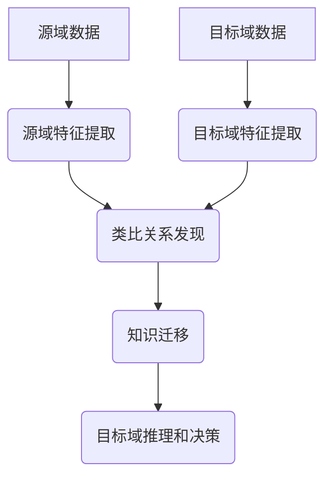

# 神经类比转移学习在跨域推理中的新突破

> 关键词：神经类比转移学习、跨域推理、人工智能、知识迁移、深度学习

> 摘要：本文聚焦于神经类比转移学习在跨域推理中的新突破。首先介绍了相关背景，包括目的、预期读者、文档结构和术语表。接着深入探讨了神经类比转移学习的核心概念与联系，阐述其原理和架构，并通过Mermaid流程图进行直观展示。详细讲解了核心算法原理，结合Python源代码说明具体操作步骤，同时给出数学模型和公式并举例分析。通过项目实战展示代码实际案例及详细解释，分析代码解读与应用场景。还推荐了学习资源、开发工具框架和相关论文著作。最后总结未来发展趋势与挑战，提供常见问题解答和扩展阅读参考资料，旨在全面深入地介绍神经类比转移学习在跨域推理领域的最新进展和应用。

## 1. 背景介绍 
### 1.1 目的和范围
在当今人工智能快速发展的时代，不同领域的数据和任务呈现出多样性和复杂性。传统的机器学习方法往往在单一领域内进行训练和应用，难以有效处理跨领域的问题。神经类比转移学习作为一种新兴的技术，旨在通过在不同领域之间进行知识迁移，实现跨域推理，提高模型的泛化能力和适应性。本文的目的在于深入探讨神经类比转移学习在跨域推理中的新突破，包括其原理、算法、应用场景等方面，为相关研究和实践提供全面的参考。

本文的范围涵盖了神经类比转移学习的基本概念、核心算法、数学模型、项目实战以及实际应用场景等多个方面。同时，还对相关的学习资源、开发工具框架和论文著作进行了推荐，为读者提供了一个系统的学习和研究路径。

### 1.2 预期读者
本文预期读者包括人工智能、机器学习、深度学习等领域的研究人员、工程师和学生。对于对跨域推理和知识迁移感兴趣的专业人士，本文将提供深入的技术讲解和实践案例；对于初学者，本文将从基本概念出发，逐步引导读者理解神经类比转移学习的核心原理和应用方法。

### 1.3 文档结构概述
本文共分为十个部分，具体结构如下：
1. 背景介绍：介绍文章的目的、范围、预期读者、文档结构和术语表。
2. 核心概念与联系：阐述神经类比转移学习的核心概念、原理和架构，并通过Mermaid流程图进行直观展示。
3. 核心算法原理 & 具体操作步骤：详细讲解神经类比转移学习的核心算法原理，结合Python源代码说明具体操作步骤。
4. 数学模型和公式 & 详细讲解 & 举例说明：给出神经类比转移学习的数学模型和公式，并进行详细讲解和举例分析。
5. 项目实战：代码实际案例和详细解释说明：通过项目实战展示神经类比转移学习的代码实际案例，并进行详细解释和分析。
6. 实际应用场景：介绍神经类比转移学习在不同领域的实际应用场景。
7. 工具和资源推荐：推荐相关的学习资源、开发工具框架和论文著作。
8. 总结：未来发展趋势与挑战：总结神经类比转移学习在跨域推理中的未来发展趋势和面临的挑战。
9. 附录：常见问题与解答：提供常见问题的解答，帮助读者更好地理解和应用神经类比转移学习。
10. 扩展阅读 & 参考资料：提供扩展阅读的建议和相关参考资料，方便读者进一步深入研究。

### 1.4 术语表
#### 1.4.1 核心术语定义
- **神经类比转移学习（Neural Analogical Transfer Learning）**：一种基于神经网络的迁移学习方法，通过在不同领域之间寻找类比关系，实现知识的迁移和跨域推理。
- **跨域推理（Cross - Domain Reasoning）**：在不同领域之间进行推理和决策的过程，需要利用不同领域的知识和信息。
- **知识迁移（Knowledge Transfer）**：将在一个领域中学习到的知识和技能应用到另一个领域中的过程。
- **源域（Source Domain）**：知识和信息的来源领域，通常是已经有大量数据和成熟模型的领域。
- **目标域（Target Domain）**：需要应用知识和信息的领域，通常是数据较少或模型不够完善的领域。

#### 1.4.2 相关概念解释
- **类比（Analogy）**：指不同事物之间在某些方面具有相似性，可以通过类比关系来进行知识的迁移和推理。
- **迁移学习（Transfer Learning）**：一种机器学习方法，旨在利用已有的知识和经验来提高在新任务上的学习效率和性能。
- **神经网络（Neural Network）**：一种模仿人类神经系统的计算模型，由大量的神经元组成，可以自动学习数据中的特征和模式。

#### 1.4.3 缩略词列表
- **ML（Machine Learning）**：机器学习
- **DL（Deep Learning）**：深度学习
- **TL（Transfer Learning）**：迁移学习
- **NATL（Neural Analogical Transfer Learning）**：神经类比转移学习

## 2. 核心概念与联系 
神经类比转移学习的核心思想是通过在不同领域之间寻找类比关系，将源域中的知识和信息迁移到目标域中，从而实现跨域推理。其基本原理是基于神经网络的表示学习能力，通过学习源域和目标域中数据的特征表示，找到它们之间的相似性和差异性，进而实现知识的迁移。

### 核心概念原理
神经类比转移学习主要包括以下几个关键步骤：
1. **特征提取**：利用神经网络从源域和目标域的数据中提取特征表示。这些特征表示应该能够捕捉到数据的本质特征和模式。
2. **类比关系发现**：通过比较源域和目标域的特征表示，发现它们之间的类比关系。类比关系可以是结构上的相似性、功能上的相似性等。
3. **知识迁移**：根据发现的类比关系，将源域中的知识和信息迁移到目标域中。知识迁移的方式可以是直接复制、调整参数等。
4. **跨域推理**：在目标域中利用迁移过来的知识和信息进行推理和决策。

### 架构的文本示意图
神经类比转移学习的架构可以分为三个主要部分：源域模块、目标域模块和类比迁移模块。

- **源域模块**：负责从源域数据中提取特征表示，并学习源域的知识和模型。
- **目标域模块**：负责从目标域数据中提取特征表示，并利用迁移过来的知识进行推理和决策。
- **类比迁移模块**：负责发现源域和目标域之间的类比关系，并将源域中的知识迁移到目标域中。

### Mermaid流程图


## 3. 核心算法原理 & 具体操作步骤 
### 核心算法原理
神经类比转移学习的核心算法主要基于神经网络的优化和训练。其中，关键的算法包括特征提取算法、类比关系发现算法和知识迁移算法。

#### 特征提取算法
特征提取算法通常采用卷积神经网络（CNN）或循环神经网络（RNN）等深度学习模型。以CNN为例，其基本原理是通过卷积层、池化层和全连接层等操作，从输入数据中提取特征表示。

#### 类比关系发现算法
类比关系发现算法可以采用度量学习的方法，通过计算源域和目标域特征表示之间的相似度，找到它们之间的类比关系。常用的相似度度量方法包括欧几里得距离、余弦相似度等。

#### 知识迁移算法
知识迁移算法可以采用参数共享、微调等方法。参数共享是指在源域和目标域的模型中共享部分参数，从而实现知识的迁移；微调是指在目标域数据上对源域模型进行微调，以适应目标域的特点。

### 具体操作步骤
以下是神经类比转移学习的具体操作步骤，结合Python源代码进行说明：

```python
import torch
import torch.nn as nn
import torch.optim as optim
from torch.utils.data import DataLoader, Dataset

# 定义源域和目标域的数据集类
class SourceDataset(Dataset):
    def __init__(self, data, labels):
        self.data = data
        self.labels = labels

    def __len__(self):
        return len(self.data)

    def __getitem__(self, idx):
        return self.data[idx], self.labels[idx]

class TargetDataset(Dataset):
    def __init__(self, data):
        self.data = data

    def __len__(self):
        return len(self.data)

    def __getitem__(self, idx):
        return self.data[idx]

# 定义特征提取网络
class FeatureExtractor(nn.Module):
    def __init__(self):
        super(FeatureExtractor, self).__init__()
        self.conv1 = nn.Conv2d(3, 64, kernel_size=3, padding=1)
        self.relu1 = nn.ReLU()
        self.pool1 = nn.MaxPool2d(kernel_size=2, stride=2)
        self.conv2 = nn.Conv2d(64, 128, kernel_size=3, padding=1)
        self.relu2 = nn.ReLU()
        self.pool2 = nn.MaxPool2d(kernel_size=2, stride=2)
        self.fc1 = nn.Linear(128 * 8 * 8, 256)
        self.relu3 = nn.ReLU()

    def forward(self, x):
        x = self.pool1(self.relu1(self.conv1(x)))
        x = self.pool2(self.relu2(self.conv2(x)))
        x = x.view(-1, 128 * 8 * 8)
        x = self.relu3(self.fc1(x))
        return x

# 定义分类器
class Classifier(nn.Module):
    def __init__(self):
        super(Classifier, self).__init__()
        self.fc2 = nn.Linear(256, 10)

    def forward(self, x):
        x = self.fc2(x)
        return x

# 训练源域模型
def train_source_model(source_data, source_labels, num_epochs=10, batch_size=32, lr=0.001):
    source_dataset = SourceDataset(source_data, source_labels)
    source_dataloader = DataLoader(source_dataset, batch_size=batch_size, shuffle=True)

    feature_extractor = FeatureExtractor()
    classifier = Classifier()

    criterion = nn.CrossEntropyLoss()
    optimizer = optim.Adam(list(feature_extractor.parameters()) + list(classifier.parameters()), lr=lr)

    for epoch in range(num_epochs):
        running_loss = 0.0
        for i, (images, labels) in enumerate(source_dataloader):
            optimizer.zero_grad()
            features = feature_extractor(images)
            outputs = classifier(features)
            loss = criterion(outputs, labels)
            loss.backward()
            optimizer.step()
            running_loss += loss.item()
        print(f'Epoch {epoch + 1}, Loss: {running_loss / len(source_dataloader)}')

    return feature_extractor, classifier

# 迁移学习到目标域
def transfer_learning(target_data, feature_extractor, classifier, num_epochs=10, batch_size=32, lr=0.001):
    target_dataset = TargetDataset(target_data)
    target_dataloader = DataLoader(target_dataset, batch_size=batch_size, shuffle=True)

    # 冻结特征提取器的参数
    for param in feature_extractor.parameters():
        param.requires_grad = False

    optimizer = optim.Adam(classifier.parameters(), lr=lr)

    for epoch in range(num_epochs):
        running_loss = 0.0
        for i, images in enumerate(target_dataloader):
            optimizer.zero_grad()
            features = feature_extractor(images)
            outputs = classifier(features)
            # 这里可以根据具体情况定义目标域的损失函数
            # 例如，使用无监督学习的损失函数
            loss = torch.mean(torch.sum(outputs ** 2, dim=1))
            loss.backward()
            optimizer.step()
            running_loss += loss.item()
        print(f'Epoch {epoch + 1}, Loss: {running_loss / len(target_dataloader)}')

    return classifier
```

## 4. 数学模型和公式 & 详细讲解 & 举例说明 
### 数学模型
神经类比转移学习的数学模型可以基于机器学习中的优化问题来描述。假设我们有一个源域数据集 $D_s = \{(x_{s1}, y_{s1}), (x_{s2}, y_{s2}), \cdots, (x_{sn}, y_{sn})\}$ 和一个目标域数据集 $D_t = \{x_{t1}, x_{t2}, \cdots, x_{tm}\}$，其中 $x_{si}$ 表示源域的输入样本，$y_{si}$ 表示源域的标签，$x_{tj}$ 表示目标域的输入样本。

我们的目标是学习一个特征提取函数 $f_{\theta}$ 和一个分类器 $g_{\phi}$，使得在源域上的分类误差最小，同时在目标域上能够实现有效的知识迁移和推理。

### 数学公式
#### 源域损失函数
源域的损失函数通常采用交叉熵损失函数，定义如下：
$$L_s(\theta, \phi) = \frac{1}{n} \sum_{i = 1}^{n} \ell(g_{\phi}(f_{\theta}(x_{si})), y_{si})$$
其中，$\ell$ 表示交叉熵损失函数。

#### 目标域损失函数
目标域的损失函数可以根据具体情况进行定义。例如，在无监督学习的情况下，可以采用重构损失函数：
$$L_t(\theta, \phi) = \frac{1}{m} \sum_{j = 1}^{m} \|x_{tj} - g_{\phi}(f_{\theta}(x_{tj}))\|^2$$

#### 总损失函数
总损失函数可以将源域损失函数和目标域损失函数结合起来，通过一个权重参数 $\lambda$ 进行平衡：
$$L(\theta, \phi) = L_s(\theta, \phi) + \lambda L_t(\theta, \phi)$$

### 详细讲解
- **源域损失函数**：源域损失函数的作用是在源域数据上训练特征提取函数和分类器，使得分类器能够准确地对源域数据进行分类。
- **目标域损失函数**：目标域损失函数的作用是在目标域数据上进行知识迁移和推理，使得特征提取函数和分类器能够适应目标域的特点。
- **总损失函数**：总损失函数的作用是在源域和目标域之间进行平衡，既要保证在源域上的分类性能，又要实现有效的知识迁移到目标域。

### 举例说明
假设我们有一个源域是手写数字识别任务，目标域是字母识别任务。源域数据集中包含手写数字 0 - 9 的图像和对应的标签，目标域数据集中包含字母 A - Z 的图像。

我们可以使用上述的数学模型和公式进行训练。首先，在源域数据上训练特征提取函数和分类器，使得分类器能够准确地识别手写数字。然后，在目标域数据上进行迁移学习，通过调整分类器的参数，使得分类器能够适应字母识别任务。

## 5. 项目实战：代码实际案例和详细解释说明 
### 5.1  开发环境搭建
#### 硬件环境
- 计算机：建议使用具有较强计算能力的计算机，如配备NVIDIA GPU的台式机或笔记本电脑。
- GPU：建议使用NVIDIA GeForce RTX系列或Tesla系列的GPU，以加速深度学习模型的训练。

#### 软件环境
- 操作系统：建议使用Linux或Windows操作系统。
- Python：建议使用Python 3.6及以上版本。
- 深度学习框架：建议使用PyTorch深度学习框架，可通过以下命令进行安装：
```sh
pip install torch torchvision
```

### 5.2  源代码详细实现和代码解读
以下是一个完整的神经类比转移学习的项目实战代码示例，结合MNIST手写数字数据集和USPS手写数字数据集进行跨域推理。

```python
import torch
import torch.nn as nn
import torch.optim as optim
from torchvision import datasets, transforms
from torch.utils.data import DataLoader

# 定义特征提取网络
class FeatureExtractor(nn.Module):
    def __init__(self):
        super(FeatureExtractor, self).__init__()
        self.conv1 = nn.Conv2d(1, 64, kernel_size=5)
        self.relu1 = nn.ReLU()
        self.pool1 = nn.MaxPool2d(kernel_size=2)
        self.conv2 = nn.Conv2d(64, 50, kernel_size=5)
        self.relu2 = nn.ReLU()
        self.pool2 = nn.MaxPool2d(kernel_size=2)

    def forward(self, x):
        x = self.pool1(self.relu1(self.conv1(x)))
        x = self.pool2(self.relu2(self.conv2(x)))
        x = x.view(-1, 50 * 4 * 4)
        return x

# 定义分类器
class Classifier(nn.Module):
    def __init__(self):
        super(Classifier, self).__init__()
        self.fc1 = nn.Linear(50 * 4 * 4, 100)
        self.relu3 = nn.ReLU()
        self.fc2 = nn.Linear(100, 10)

    def forward(self, x):
        x = self.relu3(self.fc1(x))
        x = self.fc2(x)
        return x

# 训练源域模型
def train_source_model(source_dataloader, num_epochs=10, lr=0.001):
    feature_extractor = FeatureExtractor()
    classifier = Classifier()

    criterion = nn.CrossEntropyLoss()
    optimizer = optim.Adam(list(feature_extractor.parameters()) + list(classifier.parameters()), lr=lr)

    for epoch in range(num_epochs):
        running_loss = 0.0
        for i, (images, labels) in enumerate(source_dataloader):
            optimizer.zero_grad()
            features = feature_extractor(images)
            outputs = classifier(features)
            loss = criterion(outputs, labels)
            loss.backward()
            optimizer.step()
            running_loss += loss.item()
        print(f'Epoch {epoch + 1}, Loss: {running_loss / len(source_dataloader)}')

    return feature_extractor, classifier

# 迁移学习到目标域
def transfer_learning(target_dataloader, feature_extractor, classifier, num_epochs=10, lr=0.001):
    # 冻结特征提取器的参数
    for param in feature_extractor.parameters():
        param.requires_grad = False

    optimizer = optim.Adam(classifier.parameters(), lr=lr)
    criterion = nn.CrossEntropyLoss()

    for epoch in range(num_epochs):
        running_loss = 0.0
        for i, (images, labels) in enumerate(target_dataloader):
            optimizer.zero_grad()
            features = feature_extractor(images)
            outputs = classifier(features)
            loss = criterion(outputs, labels)
            loss.backward()
            optimizer.step()
            running_loss += loss.item()
        print(f'Epoch {epoch + 1}, Loss: {running_loss / len(target_dataloader)}')

    return classifier

# 数据预处理
transform = transforms.Compose([
    transforms.ToTensor(),
    transforms.Normalize((0.1307,), (0.3081,))
])

# 加载源域数据集（MNIST）
source_dataset = datasets.MNIST(root='./data', train=True, transform=transform, download=True)
source_dataloader = DataLoader(source_dataset, batch_size=64, shuffle=True)

# 加载目标域数据集（USPS）
target_dataset = datasets.USPS(root='./data', train=True, transform=transform, download=True)
target_dataloader = DataLoader(target_dataset, batch_size=64, shuffle=True)

# 训练源域模型
feature_extractor, classifier = train_source_model(source_dataloader)

# 迁移学习到目标域
classifier = transfer_learning(target_dataloader, feature_extractor, classifier)
```

### 5.3  代码解读与分析
#### 特征提取网络
`FeatureExtractor` 类定义了一个简单的卷积神经网络，用于从输入图像中提取特征表示。该网络包含两个卷积层和两个池化层，最后将特征表示展平为一维向量。

#### 分类器
`Classifier` 类定义了一个全连接神经网络，用于对提取的特征表示进行分类。该网络包含两个全连接层，最后输出10个类别的概率分布。

#### 训练源域模型
`train_source_model` 函数用于在源域数据集（MNIST）上训练特征提取网络和分类器。使用交叉熵损失函数和Adam优化器进行训练。

#### 迁移学习到目标域
`transfer_learning` 函数用于将在源域上训练好的特征提取网络的参数冻结，只对分类器的参数进行微调，以适应目标域数据集（USPS）。同样使用交叉熵损失函数和Adam优化器进行训练。

通过这个项目实战，我们可以看到神经类比转移学习的具体实现过程，以及如何通过迁移学习提高模型在目标域上的性能。

## 6. 实际应用场景 
神经类比转移学习在多个领域都有广泛的应用，以下是一些具体的实际应用场景：

### 图像识别领域
在图像识别任务中，不同的图像数据集可能具有不同的分布和特征。例如，医学图像和自然图像的特征差异很大。通过神经类比转移学习，可以将在自然图像数据集上训练好的模型迁移到医学图像数据集上，提高医学图像识别的准确率。

### 语音识别领域
在语音识别任务中，不同的语音数据集可能来自不同的语言、口音和环境。通过神经类比转移学习，可以将在一种语言或口音的语音数据集上训练好的模型迁移到另一种语言或口音的语音数据集上，提高语音识别的泛化能力。

### 自然语言处理领域
在自然语言处理任务中，不同的文本数据集可能具有不同的主题和风格。例如，新闻文本和社交媒体文本的风格差异很大。通过神经类比转移学习，可以将在新闻文本数据集上训练好的模型迁移到社交媒体文本数据集上，提高文本分类、情感分析等任务的性能。

### 机器人领域
在机器人领域，不同的任务和环境可能需要不同的技能和知识。通过神经类比转移学习，可以将机器人在一个任务或环境中学习到的技能和知识迁移到另一个任务或环境中，提高机器人的适应性和灵活性。

## 7. 工具和资源推荐
### 7.1 学习资源推荐
#### 7.1.1 书籍推荐
- 《深度学习》（Deep Learning）：由Ian Goodfellow、Yoshua Bengio和Aaron Courville所著，是深度学习领域的经典教材，全面介绍了深度学习的基本原理和方法。
- 《机器学习》（Machine Learning）：由Tom M. Mitchell所著，是机器学习领域的经典教材，系统介绍了机器学习的基本概念、算法和应用。
- 《迁移学习简明教程》（A Concise Introduction to Transfer Learning）：由Sinno Jialin Pan和Qiang Yang所著，专门介绍了迁移学习的基本原理、算法和应用。

#### 7.1.2 在线课程
- Coursera上的“深度学习专项课程”（Deep Learning Specialization）：由Andrew Ng教授授课，全面介绍了深度学习的基本原理和方法，包括神经网络、卷积神经网络、循环神经网络等。
- edX上的“人工智能基础”（Introduction to Artificial Intelligence）：由麻省理工学院（MIT）的教授授课，介绍了人工智能的基本概念、算法和应用。
- B站（哔哩哔哩）上的一些关于迁移学习和深度学习的视频教程，如“李宏毅机器学习”等，内容生动有趣，适合初学者学习。

#### 7.1.3 技术博客和网站
- Medium上的一些技术博客，如Towards Data Science，经常发布关于机器学习、深度学习和迁移学习的最新研究成果和实践经验。
- arXiv.org：一个开放的预印本平台，包含了大量的机器学习、深度学习和迁移学习的研究论文。
- 开源中国（OSChina）：一个国内的开源技术社区，提供了丰富的技术文章和开源项目资源。

### 7.2 开发工具框架推荐
#### 7.2.1 IDE和编辑器
- PyCharm：一款专业的Python集成开发环境（IDE），提供了丰富的代码编辑、调试和项目管理功能。
- Visual Studio Code：一款轻量级的代码编辑器，支持多种编程语言和插件扩展，适合快速开发和调试。
- Jupyter Notebook：一个交互式的笔记本环境，适合进行数据探索、模型训练和结果展示。

#### 7.2.2 调试和性能分析工具
- PyTorch Profiler：PyTorch提供的性能分析工具，可以帮助开发者分析模型的运行时间、内存使用等情况，优化模型性能。
- TensorBoard：TensorFlow提供的可视化工具，也可以与PyTorch结合使用，用于可视化模型的训练过程和结果。
- cProfile：Python内置的性能分析工具，可以帮助开发者分析代码的运行时间和函数调用情况。

#### 7.2.3 相关框架和库
- PyTorch：一个开源的深度学习框架，提供了丰富的深度学习模型和工具，支持GPU加速和分布式训练。
- TensorFlow：一个开源的深度学习框架，由Google开发，广泛应用于工业界和学术界。
- Scikit - learn：一个开源的机器学习库，提供了丰富的机器学习算法和工具，适合快速实现和实验机器学习模型。

### 7.3 相关论文著作推荐
#### 7.3.1 经典论文
- “A Survey on Transfer Learning”：由Sinno Jialin Pan和Qiang Yang发表，是迁移学习领域的经典综述论文，全面介绍了迁移学习的基本概念、算法和应用。
- “Deep Neural Networks for Acoustic Modeling in Speech Recognition: The Shared Views of Four Research Groups”：由Geoffrey Hinton等人发表，介绍了深度学习在语音识别中的应用，推动了深度学习在语音识别领域的发展。
- “ImageNet Classification with Deep Convolutional Neural Networks”：由Alex Krizhevsky等人发表，介绍了AlexNet卷积神经网络在ImageNet图像分类任务中的应用，开创了深度学习在图像识别领域的先河。

#### 7.3.2 最新研究成果
- 在arXiv.org上可以搜索到关于神经类比转移学习的最新研究论文，关注相关领域的研究动态。
- 参加国际机器学习会议（ICML）、神经信息处理系统大会（NeurIPS）等学术会议，了解最新的研究成果和趋势。

#### 7.3.3 应用案例分析
- Kaggle平台上有许多关于迁移学习和跨域推理的竞赛和项目案例，可以参考这些案例学习实际应用中的经验和技巧。
- 一些开源项目的文档和代码中也包含了迁移学习的应用案例，如GitHub上的相关项目。

## 8. 总结：未来发展趋势与挑战
### 未来发展趋势
#### 更强大的模型和算法
随着深度学习技术的不断发展，未来将出现更强大的神经类比转移学习模型和算法。这些模型和算法将能够更好地处理复杂的跨域推理任务，提高知识迁移的效率和准确性。

#### 多模态融合
未来的神经类比转移学习将不仅仅局限于单一模态的数据，如图像、语音或文本。而是将多种模态的数据进行融合，如将图像和语音信息结合起来进行跨域推理，以获得更全面和准确的知识。

#### 强化学习与迁移学习的结合
强化学习是一种通过与环境交互来学习最优策略的方法。将强化学习与神经类比转移学习相结合，可以使智能体在不同的环境中更快地学习和适应，提高智能体的决策能力和性能。

#### 实际应用的拓展
神经类比转移学习将在更多的领域得到应用，如医疗保健、金融、交通等。通过将已有的知识和经验迁移到这些领域，可以提高这些领域的智能化水平和效率。

### 挑战
#### 领域差异的处理
不同领域的数据和任务具有不同的特点和分布，如何有效地处理这些领域差异，是神经类比转移学习面临的一个重要挑战。需要开发更加灵活和自适应的模型和算法，以适应不同领域的需求。

#### 知识的表示和迁移
如何将源域中的知识有效地表示和迁移到目标域中，是神经类比转移学习的核心问题。需要研究更加高效和准确的知识表示方法和迁移策略，以提高知识迁移的效果。

#### 数据隐私和安全
在跨域推理过程中，涉及到不同领域的数据和信息。如何保护数据的隐私和安全，防止数据泄露和滥用，是神经类比转移学习面临的一个重要挑战。需要研究相应的技术和机制，确保数据的隐私和安全。

#### 可解释性和可信度
神经类比转移学习模型通常是黑盒模型，难以解释其决策过程和结果。如何提高模型的可解释性和可信度，使人们能够理解和信任模型的决策，是神经类比转移学习面临的一个重要挑战。

## 9. 附录：常见问题与解答
### 1. 神经类比转移学习与传统迁移学习有什么区别？
神经类比转移学习是基于神经网络的迁移学习方法，通过寻找不同领域之间的类比关系来实现知识的迁移。与传统迁移学习相比，神经类比转移学习更注重利用神经网络的强大表示学习能力，能够更好地处理复杂的非线性关系和高维数据。

### 2. 如何选择合适的源域和目标域？
选择合适的源域和目标域需要考虑多个因素，如领域之间的相关性、数据的可用性和质量等。一般来说，源域和目标域应该具有一定的相似性，以便能够找到有效的类比关系。同时，源域应该有足够的数据和成熟的模型，目标域应该有明确的任务和需求。

### 3. 神经类比转移学习在实际应用中可能会遇到哪些问题？
在实际应用中，神经类比转移学习可能会遇到领域差异大、数据不足、模型过拟合等问题。为了解决这些问题，可以采用数据增强、模型正则化、自适应调整等方法。

### 4. 如何评估神经类比转移学习的性能？
评估神经类比转移学习的性能可以采用多种指标，如准确率、召回率、F1值等。同时，还可以通过对比实验，比较迁移学习前后模型的性能差异，来评估迁移学习的效果。

## 10. 扩展阅读 & 参考资料
### 扩展阅读
- 阅读更多关于深度学习、迁移学习和人工智能的书籍和论文，深入了解相关领域的理论和方法。
- 关注相关领域的学术会议和技术博客，了解最新的研究成果和应用案例。
- 参与开源项目和竞赛，实践和应用神经类比转移学习技术，提高自己的实践能力。

### 参考资料
- Goodfellow, I., Bengio, Y., & Courville, A. (2016). Deep Learning. MIT Press.
- Mitchell, T. M. (1997). Machine Learning. McGraw - Hill.
- Pan, S. J., & Yang, Q. (2010). A Survey on Transfer Learning. IEEE Transactions on Knowledge and Data Engineering, 22(10), 1345 - 1359.
- Krizhevsky, A., Sutskever, I., & Hinton, G. E. (2012). ImageNet Classification with Deep Convolutional Neural Networks. Advances in Neural Information Processing Systems.
- Hinton, G. E., Deng, L., Yu, D., Dahl, G. E., Mohamed, A. - r., Jaitly, N., ... & Kingsbury, B. (2012). Deep Neural Networks for Acoustic Modeling in Speech Recognition: The Shared Views of Four Research Groups. IEEE Signal Processing Magazine, 29(6), 82 - 97.