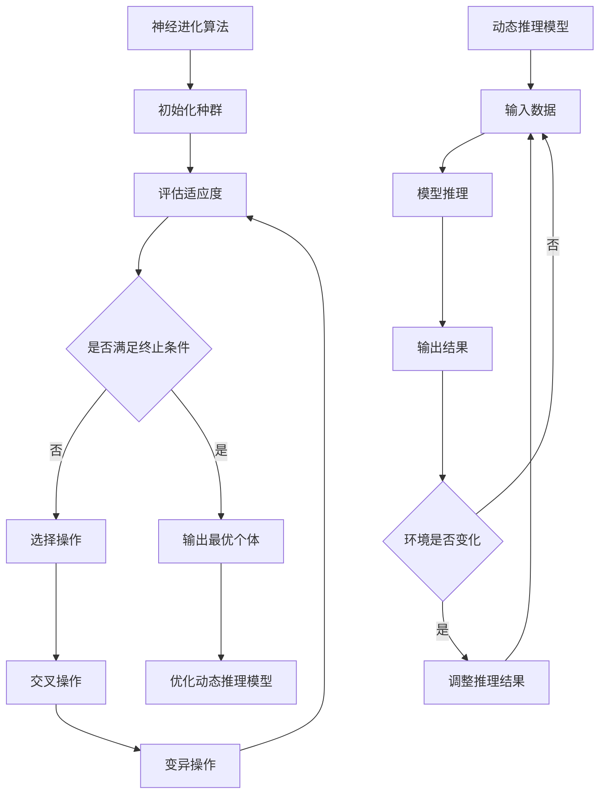

# 神经进化算法在动态推理模型优化中的应用

> 关键词：神经进化算法、动态推理模型、模型优化、进化计算、深度学习

> 摘要：本文深入探讨了神经进化算法在动态推理模型优化中的应用。首先介绍了神经进化算法和动态推理模型的背景知识，包括其目的、预期读者等内容。接着详细阐述了核心概念及它们之间的联系，通过示意图和流程图进行直观展示。然后讲解了核心算法原理，并用Python代码进行详细说明，同时给出了相关的数学模型和公式。通过项目实战，展示了如何在实际中应用神经进化算法优化动态推理模型，包括开发环境搭建、源代码实现和解读。还探讨了该技术的实际应用场景，推荐了学习资源、开发工具框架和相关论文著作。最后总结了未来发展趋势与挑战，提供了常见问题解答和扩展阅读参考资料，旨在为相关领域的研究者和开发者提供全面而深入的技术指导。

## 1. 背景介绍 
### 1.1 目的和范围
在当今的人工智能和机器学习领域，动态推理模型被广泛应用于各种复杂的任务中，如自动驾驶、智能机器人、自然语言处理等。然而，这些模型在实际应用中面临着诸多挑战，例如模型的性能、效率和适应性等问题。神经进化算法作为一种强大的优化技术，为解决这些问题提供了新的思路和方法。

本文的目的在于全面介绍神经进化算法在动态推理模型优化中的应用，涵盖从理论原理到实际应用的各个方面。具体范围包括神经进化算法和动态推理模型的基本概念、核心算法原理、数学模型、项目实战案例、实际应用场景以及相关的工具和资源推荐等。

### 1.2 预期读者
本文预期读者包括人工智能、机器学习、计算机科学等领域的研究者、开发者和学生。对于希望深入了解神经进化算法和动态推理模型优化技术的专业人士，本文提供了详细的技术讲解和实践指导；对于相关专业的学生，本文可以作为学习和研究的参考资料，帮助他们拓宽知识面和提高实践能力。

### 1.3 文档结构概述
本文按照以下结构进行组织：
1. 背景介绍：介绍本文的目的、预期读者和文档结构概述，以及相关术语的定义和解释。
2. 核心概念与联系：阐述神经进化算法和动态推理模型的核心概念，通过文本示意图和Mermaid流程图展示它们之间的联系。
3. 核心算法原理 & 具体操作步骤：详细讲解神经进化算法的核心原理，并用Python代码进行具体实现和说明。
4. 数学模型和公式 & 详细讲解 & 举例说明：给出神经进化算法和动态推理模型相关的数学模型和公式，并进行详细讲解和举例说明。
5. 项目实战：代码实际案例和详细解释说明：通过一个具体的项目实战案例，展示如何使用神经进化算法优化动态推理模型，包括开发环境搭建、源代码实现和解读。
6. 实际应用场景：探讨神经进化算法在动态推理模型优化中的实际应用场景。
7. 工具和资源推荐：推荐相关的学习资源、开发工具框架和论文著作。
8. 总结：未来发展趋势与挑战：总结神经进化算法在动态推理模型优化中的发展趋势和面临的挑战。
9. 附录：常见问题与解答：提供常见问题的解答，帮助读者更好地理解和应用本文的内容。
10. 扩展阅读 & 参考资料：提供扩展阅读的建议和相关的参考资料。

### 1.4 术语表
#### 1.4.1 核心术语定义
- **神经进化算法（Neuroevolution Algorithm）**：一种基于生物进化原理的优化算法，通过模拟生物进化过程中的遗传、变异和选择机制，对神经网络的结构和参数进行优化。
- **动态推理模型（Dynamic Inference Model）**：一种能够根据输入数据的动态变化实时调整推理结果的模型，通常用于处理具有动态特性的任务，如时间序列预测、实时决策等。
- **进化计算（Evolutionary Computation）**：一类基于生物进化原理的计算方法，包括遗传算法、进化策略、遗传编程等，用于解决优化问题。
- **神经网络（Neural Network）**：一种模仿人类神经系统的计算模型，由大量的神经元组成，能够自动学习数据中的模式和规律。

#### 1.4.2 相关概念解释
- **遗传操作（Genetic Operators）**：包括选择、交叉和变异等操作，是神经进化算法中用于产生新个体的基本操作。
- **适应度函数（Fitness Function）**：用于评估个体在优化问题中的适应程度，是神经进化算法中选择操作的依据。
- **种群（Population）**：由一组个体组成，是神经进化算法中进行进化操作的基本单位。

#### 1.4.3 缩略词列表
- **ANN**：Artificial Neural Network，人工神经网络
- **GA**：Genetic Algorithm，遗传算法
- **ES**：Evolution Strategy，进化策略

## 2. 核心概念与联系 
### 2.1 神经进化算法核心概念
神经进化算法是一种基于生物进化原理的优化算法，其核心思想是通过模拟生物进化过程中的遗传、变异和选择机制，对神经网络的结构和参数进行优化。在神经进化算法中，每个个体代表一个神经网络，种群由一组个体组成。通过不断地进行选择、交叉和变异等遗传操作，种群中的个体逐渐进化，最终找到最优的神经网络结构和参数。

### 2.2 动态推理模型核心概念
动态推理模型是一种能够根据输入数据的动态变化实时调整推理结果的模型。与传统的静态模型不同，动态推理模型能够适应环境的变化，具有更好的灵活性和适应性。动态推理模型通常用于处理具有动态特性的任务，如时间序列预测、实时决策等。

### 2.3 核心概念联系
神经进化算法和动态推理模型之间存在着密切的联系。神经进化算法可以用于优化动态推理模型的结构和参数，提高模型的性能和适应性。通过神经进化算法，可以自动搜索最优的神经网络结构和参数，从而使动态推理模型能够更好地适应不同的任务和环境。

### 2.4 文本示意图
神经进化算法和动态推理模型的关系可以用以下文本示意图表示：

神经进化算法
|
|-- 遗传操作（选择、交叉、变异）
|
|-- 适应度函数评估
|
|-- 种群进化
|
|-- 优化动态推理模型的结构和参数

动态推理模型
|
|-- 输入数据
|
|-- 模型推理
|
|-- 输出结果
|
|-- 根据环境变化调整推理结果

### 2.5 Mermaid流程图


## 3. 核心算法原理 & 具体操作步骤 
### 3.1 神经进化算法核心原理
神经进化算法的核心原理是基于生物进化的思想，通过模拟遗传、变异和选择等操作，不断优化神经网络的结构和参数。具体来说，神经进化算法的工作流程如下：
1. **初始化种群**：随机生成一组神经网络作为初始种群。
2. **评估适应度**：使用适应度函数评估每个个体的适应程度。
3. **选择操作**：根据适应度值选择优秀的个体作为父代。
4. **交叉操作**：对父代个体进行交叉操作，生成子代个体。
5. **变异操作**：对子代个体进行变异操作，引入新的基因。
6. **更新种群**：用子代个体替换部分父代个体，更新种群。
7. **重复步骤2 - 6**：直到满足终止条件。

### 3.2 具体操作步骤
下面是使用Python实现神经进化算法优化神经网络的具体步骤和代码示例：

```python
import numpy as np

# 定义神经网络类
class NeuralNetwork:
    def __init__(self, input_size, hidden_size, output_size):
        self.input_size = input_size
        self.hidden_size = hidden_size
        self.output_size = output_size
        self.weights1 = np.random.randn(self.input_size, self.hidden_size)
        self.weights2 = np.random.randn(self.hidden_size, self.output_size)

    def forward(self, X):
        self.z1 = np.dot(X, self.weights1)
        self.a1 = np.tanh(self.z1)
        self.z2 = np.dot(self.a1, self.weights2)
        self.a2 = np.tanh(self.z2)
        return self.a2

# 定义适应度函数
def fitness_function(individual, X, y):
    nn = NeuralNetwork(2, 3, 1)
    nn.weights1 = individual[:6].reshape(2, 3)
    nn.weights2 = individual[6:].reshape(3, 1)
    y_pred = nn.forward(X)
    error = np.mean((y - y_pred) ** 2)
    return 1 / (1 + error)

# 定义选择操作
def selection(population, fitness_scores, num_parents):
    parents = []
    for _ in range(num_parents):
        max_fitness_index = np.argmax(fitness_scores)
        parents.append(population[max_fitness_index])
        fitness_scores[max_fitness_index] = -np.inf
    return np.array(parents)

# 定义交叉操作
def crossover(parents, offspring_size):
    offspring = np.empty(offspring_size)
    crossover_point = np.uint8(offspring_size[1] / 2)
    for k in range(offspring_size[0]):
        parent1_index = k % parents.shape[0]
        parent2_index = (k + 1) % parents.shape[0]
        offspring[k, 0:crossover_point] = parents[parent1_index, 0:crossover_point]
        offspring[k, crossover_point:] = parents[parent2_index, crossover_point:]
    return offspring

# 定义变异操作
def mutation(offspring_crossover):
    for idx in range(offspring_crossover.shape[0]):
        random_value = np.random.uniform(-1, 1, 1)
        random_index = np.random.randint(0, offspring_crossover.shape[1])
        offspring_crossover[idx, random_index] += random_value
    return offspring_crossover

# 主函数
def neuroevolution(X, y, population_size, num_generations):
    input_size = X.shape[1]
    hidden_size = 3
    output_size = 1
    num_weights = input_size * hidden_size + hidden_size * output_size
    population = np.random.uniform(-1, 1, (population_size, num_weights))

    for generation in range(num_generations):
        fitness_scores = []
        for individual in population:
            fitness_scores.append(fitness_function(individual, X, y))
        fitness_scores = np.array(fitness_scores)

        num_parents = 2
        parents = selection(population, fitness_scores, num_parents)

        offspring_size = (population_size - parents.shape[0], num_weights)
        offspring_crossover = crossover(parents, offspring_size)

        offspring_mutation = mutation(offspring_crossover)

        population[0:parents.shape[0], :] = parents
        population[parents.shape[0]:, :] = offspring_mutation

    best_individual_index = np.argmax(fitness_scores)
    best_individual = population[best_individual_index]
    return best_individual

# 示例数据
X = np.array([[0, 0], [0, 1], [1, 0], [1, 1]])
y = np.array([[0], [1], [1], [0]])

# 运行神经进化算法
best_individual = neuroevolution(X, y, population_size=10, num_generations=100)
print("Best individual:", best_individual)
```

### 3.3 代码解释
1. **NeuralNetwork类**：定义了一个简单的神经网络，包括输入层、隐藏层和输出层。
2. **fitness_function函数**：计算个体的适应度值，使用均方误差的倒数作为适应度。
3. **selection函数**：根据适应度值选择优秀的个体作为父代。
4. **crossover函数**：对父代个体进行交叉操作，生成子代个体。
5. **mutation函数**：对子代个体进行变异操作，引入新的基因。
6. **neuroevolution函数**：主函数，实现了神经进化算法的整个流程。

## 4. 数学模型和公式 & 详细讲解 & 举例说明 
### 4.1 神经网络的数学模型
神经网络的数学模型可以用以下公式表示：

#### 前向传播
假设输入层有 $n$ 个神经元，隐藏层有 $m$ 个神经元，输出层有 $k$ 个神经元。输入向量为 $\mathbf{x} = [x_1, x_2, \cdots, x_n]^T$，隐藏层的加权输入为 $\mathbf{z}_1$，输出为 $\mathbf{a}_1$，输出层的加权输入为 $\mathbf{z}_2$，输出为 $\mathbf{a}_2$。则前向传播的计算公式如下：

$$\mathbf{z}_1 = \mathbf{W}_1 \mathbf{x} + \mathbf{b}_1$$

$$\mathbf{a}_1 = f(\mathbf{z}_1)$$

$$\mathbf{z}_2 = \mathbf{W}_2 \mathbf{a}_1 + \mathbf{b}_2$$

$$\mathbf{a}_2 = f(\mathbf{z}_2)$$

其中，$\mathbf{W}_1$ 是输入层到隐藏层的权重矩阵，$\mathbf{W}_2$ 是隐藏层到输出层的权重矩阵，$\mathbf{b}_1$ 和 $\mathbf{b}_2$ 分别是隐藏层和输出层的偏置向量，$f$ 是激活函数，常用的激活函数有 sigmoid 函数、tanh 函数和 ReLU 函数等。

#### 均方误差损失函数
均方误差损失函数用于衡量神经网络的输出与真实标签之间的误差，其计算公式如下：

$$J(\mathbf{W}, \mathbf{b}) = \frac{1}{N} \sum_{i=1}^{N} (\mathbf{y}_i - \mathbf{a}_2^{(i)})^2$$

其中，$N$ 是样本数量，$\mathbf{y}_i$ 是第 $i$ 个样本的真实标签，$\mathbf{a}_2^{(i)}$ 是第 $i$ 个样本的神经网络输出。

### 4.2 神经进化算法的数学模型
神经进化算法的数学模型主要包括遗传操作的数学表示。

#### 选择操作
选择操作通常使用轮盘赌选择法，每个个体被选中的概率与其适应度值成正比。个体 $i$ 被选中的概率 $P(i)$ 计算公式如下：

$$P(i) = \frac{F(i)}{\sum_{j=1}^{M} F(j)}$$

其中，$F(i)$ 是个体 $i$ 的适应度值，$M$ 是种群大小。

#### 交叉操作
交叉操作是将两个父代个体的部分基因进行交换，生成子代个体。常用的交叉操作有单点交叉、多点交叉和均匀交叉等。

#### 变异操作
变异操作是对个体的部分基因进行随机修改，引入新的基因。变异操作的概率通常比较小，以保证种群的稳定性。

### 4.3 举例说明
假设我们有一个简单的神经网络，输入层有 2 个神经元，隐藏层有 3 个神经元，输出层有 1 个神经元。输入向量为 $\mathbf{x} = [0, 1]^T$，权重矩阵 $\mathbf{W}_1$ 和 $\mathbf{W}_2$ 以及偏置向量 $\mathbf{b}_1$ 和 $\mathbf{b}_2$ 如下：

$$\mathbf{W}_1 = \begin{bmatrix} 0.1 & 0.2 & 0.3 \\ 0.4 & 0.5 & 0.6 \end{bmatrix}$$

$$\mathbf{b}_1 = \begin{bmatrix} 0.1 \\ 0.2 \\ 0.3 \end{bmatrix}$$

$$\mathbf{W}_2 = \begin{bmatrix} 0.7 \\ 0.8 \\ 0.9 \end{bmatrix}$$

$$\mathbf{b}_2 = [0.1]$$

激活函数使用 tanh 函数。则前向传播的计算过程如下：

$$\mathbf{z}_1 = \mathbf{W}_1 \mathbf{x} + \mathbf{b}_1 = \begin{bmatrix} 0.1 & 0.2 & 0.3 \\ 0.4 & 0.5 & 0.6 \end{bmatrix} \begin{bmatrix} 0 \\ 1 \end{bmatrix} + \begin{bmatrix} 0.1 \\ 0.2 \\ 0.3 \end{bmatrix} = \begin{bmatrix} 0.3 \\ 0.7 \\ 0.9 \end{bmatrix}$$

$$\mathbf{a}_1 = \tanh(\mathbf{z}_1) = \begin{bmatrix} \tanh(0.3) \\ \tanh(0.7) \\ \tanh(0.9) \end{bmatrix} \approx \begin{bmatrix} 0.291 \\ 0.604 \\ 0.716 \end{bmatrix}$$

$$\mathbf{z}_2 = \mathbf{W}_2 \mathbf{a}_1 + \mathbf{b}_2 = \begin{bmatrix} 0.7 \\ 0.8 \\ 0.9 \end{bmatrix} \begin{bmatrix} 0.291 \\ 0.604 \\ 0.716 \end{bmatrix} + [0.1] \approx [1.22]$$

$$\mathbf{a}_2 = \tanh(\mathbf{z}_2) \approx \tanh(1.22) \approx 0.84$$

## 5. 项目实战：代码实际案例和详细解释说明 
### 5.1  开发环境搭建
#### 5.1.1 安装Python
首先，需要安装Python开发环境。可以从Python官方网站（https://www.python.org/downloads/） 下载适合自己操作系统的Python版本，并按照安装向导进行安装。

#### 5.1.2 安装必要的库
在本项目中，需要使用一些Python库，如NumPy、Matplotlib等。可以使用以下命令安装这些库：

```sh
pip install numpy matplotlib
```

### 5.2  源代码详细实现和代码解读
以下是一个使用神经进化算法优化动态推理模型的完整代码示例：

```python
import numpy as np
import matplotlib.pyplot as plt

# 定义动态推理模型类
class DynamicInferenceModel:
    def __init__(self, input_size, hidden_size, output_size):
        self.input_size = input_size
        self.hidden_size = hidden_size
        self.output_size = output_size
        self.weights1 = np.random.randn(self.input_size, self.hidden_size)
        self.weights2 = np.random.randn(self.hidden_size, self.output_size)

    def forward(self, X):
        self.z1 = np.dot(X, self.weights1)
        self.a1 = np.tanh(self.z1)
        self.z2 = np.dot(self.a1, self.weights2)
        self.a2 = np.tanh(self.z2)
        return self.a2

    def update_weights(self, weights):
        self.weights1 = weights[:self.input_size * self.hidden_size].reshape(self.input_size, self.hidden_size)
        self.weights2 = weights[self.input_size * self.hidden_size:].reshape(self.hidden_size, self.output_size)

# 定义适应度函数
def fitness_function(individual, X, y, model):
    model.update_weights(individual)
    y_pred = model.forward(X)
    error = np.mean((y - y_pred) ** 2)
    return 1 / (1 + error)

# 定义选择操作
def selection(population, fitness_scores, num_parents):
    parents = []
    for _ in range(num_parents):
        max_fitness_index = np.argmax(fitness_scores)
        parents.append(population[max_fitness_index])
        fitness_scores[max_fitness_index] = -np.inf
    return np.array(parents)

# 定义交叉操作
def crossover(parents, offspring_size):
    offspring = np.empty(offspring_size)
    crossover_point = np.uint8(offspring_size[1] / 2)
    for k in range(offspring_size[0]):
        parent1_index = k % parents.shape[0]
        parent2_index = (k + 1) % parents.shape[0]
        offspring[k, 0:crossover_point] = parents[parent1_index, 0:crossover_point]
        offspring[k, crossover_point:] = parents[parent2_index, crossover_point:]
    return offspring

# 定义变异操作
def mutation(offspring_crossover):
    for idx in range(offspring_crossover.shape[0]):
        random_value = np.random.uniform(-1, 1, 1)
        random_index = np.random.randint(0, offspring_crossover.shape[1])
        offspring_crossover[idx, random_index] += random_value
    return offspring_crossover

# 主函数
def neuroevolution(X, y, population_size, num_generations):
    input_size = X.shape[1]
    hidden_size = 3
    output_size = 1
    num_weights = input_size * hidden_size + hidden_size * output_size
    population = np.random.uniform(-1, 1, (population_size, num_weights))
    model = DynamicInferenceModel(input_size, hidden_size, output_size)

    best_fitness_scores = []
    for generation in range(num_generations):
        fitness_scores = []
        for individual in population:
            fitness_scores.append(fitness_function(individual, X, y, model))
        fitness_scores = np.array(fitness_scores)

        best_fitness_scores.append(np.max(fitness_scores))

        num_parents = 2
        parents = selection(population, fitness_scores, num_parents)

        offspring_size = (population_size - parents.shape[0], num_weights)
        offspring_crossover = crossover(parents, offspring_size)

        offspring_mutation = mutation(offspring_crossover)

        population[0:parents.shape[0], :] = parents
        population[parents.shape[0]:, :] = offspring_mutation

    best_individual_index = np.argmax(fitness_scores)
    best_individual = population[best_individual_index]
    return best_individual, best_fitness_scores

# 示例数据
X = np.array([[0, 0], [0, 1], [1, 0], [1, 1]])
y = np.array([[0], [1], [1], [0]])

# 运行神经进化算法
best_individual, best_fitness_scores = neuroevolution(X, y, population_size=10, num_generations=100)

# 绘制适应度曲线
plt.plot(best_fitness_scores)
plt.xlabel('Generation')
plt.ylabel('Best Fitness Score')
plt.title('Evolution of Best Fitness Score')
plt.show()

# 使用最优个体更新模型
model = DynamicInferenceModel(2, 3, 1)
model.update_weights(best_individual)
y_pred = model.forward(X)
print("Predicted values:", y_pred)
```

### 5.3  代码解读与分析
1. **DynamicInferenceModel类**：定义了一个简单的动态推理模型，包括前向传播和更新权重的方法。
2. **fitness_function函数**：计算个体的适应度值，使用均方误差的倒数作为适应度。
3. **selection函数**：根据适应度值选择优秀的个体作为父代。
4. **crossover函数**：对父代个体进行交叉操作，生成子代个体。
5. **mutation函数**：对子代个体进行变异操作，引入新的基因。
6. **neuroevolution函数**：主函数，实现了神经进化算法的整个流程，并记录每一代的最优适应度值。
7. **绘制适应度曲线**：使用Matplotlib库绘制每一代的最优适应度值曲线，直观地展示神经进化算法的进化过程。
8. **使用最优个体更新模型**：使用最优个体的权重更新动态推理模型，并输出模型的预测结果。

## 6. 实际应用场景 
### 6.1 自动驾驶
在自动驾驶领域，动态推理模型需要根据实时的传感器数据（如摄像头、雷达等）进行决策，如车辆的加速、减速、转向等。神经进化算法可以用于优化动态推理模型的结构和参数，提高模型的决策准确性和实时性，从而提高自动驾驶系统的安全性和可靠性。

### 6.2 智能机器人
智能机器人需要根据环境的变化实时调整自己的行为，如避障、抓取物体等。动态推理模型可以用于预测环境的变化和机器人的行为效果，神经进化算法可以优化这些模型，使机器人能够更好地适应不同的环境和任务。

### 6.3 自然语言处理
在自然语言处理中，动态推理模型可以用于处理文本的语义理解、情感分析等任务。神经进化算法可以优化这些模型的结构和参数，提高模型的性能和适应性，从而更好地处理不同类型的文本数据。

### 6.4 金融预测
在金融领域，动态推理模型可以用于预测股票价格、汇率等金融指标的变化。神经进化算法可以优化这些模型，使模型能够更好地捕捉金融市场的动态变化，提高预测的准确性。

## 7. 工具和资源推荐
### 7.1 学习资源推荐
#### 7.1.1 书籍推荐
- 《人工智能：一种现代的方法》（Artificial Intelligence: A Modern Approach）：这是一本经典的人工智能教材，全面介绍了人工智能的各个领域，包括进化计算、神经网络等。
- 《深度学习》（Deep Learning）：由Ian Goodfellow、Yoshua Bengio和Aaron Courville合著，是深度学习领域的权威教材，详细介绍了深度学习的原理和应用。
- 《Python机器学习》（Python Machine Learning）：本书介绍了如何使用Python进行机器学习，包括神经进化算法等优化技术的实现。

#### 7.1.2 在线课程
- Coursera上的“机器学习”（Machine Learning）课程：由Andrew Ng教授主讲，是机器学习领域的经典课程，涵盖了机器学习的基本概念和算法。
- edX上的“深度学习”（Deep Learning）课程：由Google Brain团队的研究员主讲，深入介绍了深度学习的原理和应用。
- Udemy上的“Python深度学习实战”（Python Deep Learning实战）课程：通过实际项目介绍了如何使用Python进行深度学习开发，包括神经进化算法的应用。

#### 7.1.3 技术博客和网站
- Medium：这是一个技术博客平台，有很多关于人工智能、机器学习和神经进化算法的文章。
- arXiv：这是一个预印本服务器，提供了大量的学术论文，包括神经进化算法的最新研究成果。
- Kaggle：这是一个数据科学竞赛平台，有很多关于机器学习和深度学习的开源代码和项目，可以学习到实际应用中的经验和技巧。

### 7.2 开发工具框架推荐
#### 7.2.1 IDE和编辑器
- PyCharm：这是一个专业的Python集成开发环境，提供了丰富的功能，如代码编辑、调试、版本控制等。
- Jupyter Notebook：这是一个交互式的开发环境，适合进行数据探索和模型实验。
- Visual Studio Code：这是一个轻量级的代码编辑器，支持多种编程语言，有丰富的插件可以扩展功能。

#### 7.2.2 调试和性能分析工具
- PySnooper：这是一个简单易用的Python调试工具，可以自动记录函数的执行过程和变量的值。
- cProfile：这是Python标准库中的性能分析工具，可以分析代码的运行时间和函数调用次数。
- TensorBoard：这是TensorFlow的可视化工具，可以用于可视化模型的训练过程和性能指标。

#### 7.2.3 相关框架和库
- NumPy：这是Python中用于科学计算的基础库，提供了高效的数组操作和数学函数。
- Matplotlib：这是Python中用于数据可视化的库，可以绘制各种类型的图表。
- PyTorch：这是一个深度学习框架，提供了丰富的神经网络层和优化算法，支持GPU加速。
- DEAP：这是一个Python的进化计算框架，提供了各种进化算法的实现，包括神经进化算法。

### 7.3 相关论文著作推荐
#### 7.3.1 经典论文
- "Evolving Neural Networks through Augmenting Topologies"：这篇论文提出了一种进化神经网络拓扑结构的方法，是神经进化算法领域的经典论文。
- "Genetic Algorithms in Search, Optimization, and Machine Learning"：这是遗传算法领域的经典著作，详细介绍了遗传算法的原理和应用。

#### 7.3.2 最新研究成果
- 可以通过arXiv、IEEE Xplore等学术数据库搜索神经进化算法和动态推理模型的最新研究成果。

#### 7.3.3 应用案例分析
- 可以通过Kaggle、GitHub等平台搜索神经进化算法在实际应用中的案例分析，学习他人的经验和技巧。

## 8. 总结：未来发展趋势与挑战
### 8.1 未来发展趋势
- **与深度学习的深度融合**：神经进化算法将与深度学习技术更加紧密地结合，共同推动人工智能的发展。例如，使用神经进化算法优化深度学习模型的结构和参数，提高模型的性能和适应性。
- **多智能体系统中的应用**：在多智能体系统中，神经进化算法可以用于优化智能体的策略和行为，使智能体能够更好地协作和竞争。
- **量子计算与神经进化算法的结合**：随着量子计算技术的发展，量子计算与神经进化算法的结合将为优化问题带来新的解决方案，提高算法的效率和性能。

### 8.2 挑战
- **计算资源需求大**：神经进化算法通常需要大量的计算资源来进行种群的进化和评估，特别是在处理复杂的优化问题时，计算资源的需求会更加显著。
- **收敛速度慢**：由于神经进化算法是一种基于随机搜索的优化算法，其收敛速度通常比较慢，需要进行大量的迭代才能找到最优解。
- **难以解释模型**：神经进化算法优化的模型通常比较复杂，难以解释其决策过程和结果，这在一些对可解释性要求较高的领域（如医疗、金融等）中可能会受到限制。

## 9. 附录：常见问题与解答
### 9.1 神经进化算法和传统的优化算法有什么区别？
神经进化算法是一种基于生物进化原理的优化算法，通过模拟遗传、变异和选择等操作来搜索最优解。与传统的优化算法（如梯度下降法、牛顿法等）相比，神经进化算法不需要计算目标函数的导数，适用于处理非凸、不连续的优化问题。此外，神经进化算法可以同时搜索多个解，具有更好的全局搜索能力。

### 9.2 如何选择合适的适应度函数？
适应度函数的选择取决于具体的优化问题。一般来说，适应度函数应该能够准确地评估个体在优化问题中的适应程度。在选择适应度函数时，需要考虑以下几个因素：
- **与优化目标的一致性**：适应度函数应该与优化目标一致，即适应度值越高，个体越接近最优解。
- **可计算性**：适应度函数应该是可计算的，能够在合理的时间内得到结果。
- **稳定性**：适应度函数应该具有一定的稳定性，避免因噪声等因素导致适应度值的剧烈波动。

### 9.3 神经进化算法的收敛速度如何提高？
可以通过以下几种方法提高神经进化算法的收敛速度：
- **调整种群大小**：适当增加种群大小可以增加搜索的多样性，但也会增加计算量。需要根据具体问题选择合适的种群大小。
- **优化遗传操作**：选择合适的遗传操作（如交叉和变异操作）可以提高算法的搜索效率。例如，使用自适应的交叉和变异概率可以根据种群的进化情况动态调整操作的强度。
- **使用精英策略**：在进化过程中保留一定数量的优秀个体，避免优秀个体的丢失，从而加快算法的收敛速度。

## 10. 扩展阅读 & 参考资料
### 10.1 扩展阅读
- "Neuroevolution: A Modern Approach to Evolving Neural Networks"：这本书详细介绍了神经进化算法的原理和应用，是神经进化算法领域的重要著作。
- "Dynamic Inference in Neural Networks"：这篇论文探讨了动态推理模型的原理和应用，为神经进化算法在动态推理模型优化中的应用提供了理论基础。

### 10.2 参考资料
- [Python官方文档](https://docs.python.org/)
- [NumPy官方文档](https://numpy.org/doc/)
- [Matplotlib官方文档](https://matplotlib.org/stable/contents.html)
- [PyTorch官方文档](https://pytorch.org/docs/stable/index.html)
- [DEAP官方文档](https://deap.readthedocs.io/en/master/)