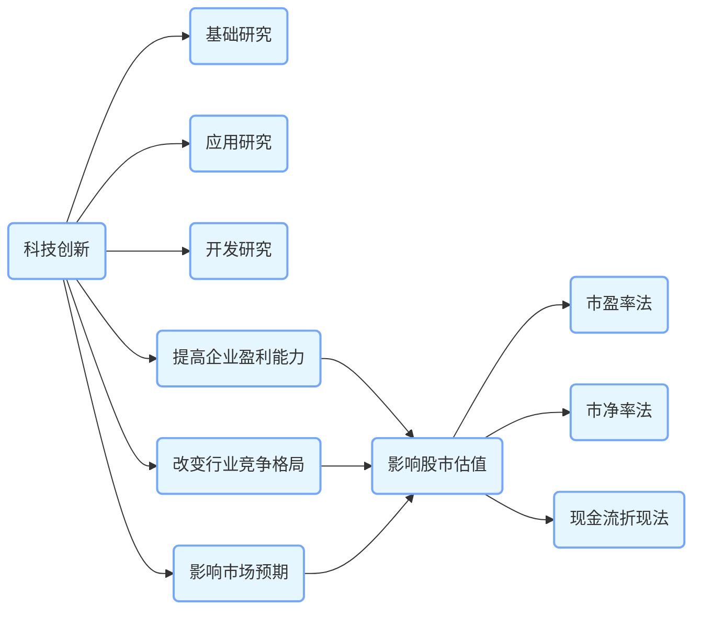

# 科技创新对全球股市估值的影响分析

> 关键词：科技创新、全球股市估值、技术变革、市场预期、经济增长

> 摘要：本文旨在深入分析科技创新对全球股市估值的影响。首先介绍了研究的背景、目的、预期读者等内容。接着阐述了科技创新与股市估值的核心概念及联系，通过数学模型和公式详细讲解了相关原理，并结合Python代码对核心算法进行阐述。在项目实战部分，给出了代码实际案例及详细解释。还探讨了科技创新在股市中的实际应用场景，推荐了相关的学习资源、开发工具框架和论文著作。最后总结了未来科技创新对股市估值影响的发展趋势与挑战，并解答了常见问题，提供了扩展阅读和参考资料。

## 1. 背景介绍 
### 1.1 目的和范围
本研究的主要目的是全面且深入地剖析科技创新对全球股市估值所产生的影响。在当今全球化和科技飞速发展的时代，科技创新已成为推动经济增长和改变产业格局的关键力量。股市作为经济的重要组成部分，其估值受到众多因素的影响，而科技创新在其中扮演着越来越重要的角色。通过本研究，我们期望能够揭示科技创新与股市估值之间的内在联系和作用机制，为投资者、企业管理者以及政策制定者提供有价值的参考依据。

本研究的范围涵盖了全球主要的股票市场，包括美国、欧洲、亚洲等地区的股市。同时，我们将关注不同行业和领域的科技创新，如信息技术、生物科技、新能源等，以全面评估科技创新对股市估值的影响。

### 1.2 预期读者
本文的预期读者主要包括以下几类人群：
- **投资者**：包括个人投资者和机构投资者。对于投资者来说，了解科技创新对股市估值的影响有助于他们做出更明智的投资决策，把握投资机会，降低投资风险。
- **企业管理者**：企业管理者可以通过本文了解科技创新对股市估值的作用机制，从而更好地制定企业的战略规划和发展方向，提高企业的市场价值。
- **政策制定者**：政策制定者可以根据本文的研究结果，制定相关的政策来促进科技创新和股市的健康发展，推动经济的增长。
- **学术研究人员**：学术研究人员可以将本文作为参考，进一步深入研究科技创新与股市估值之间的关系，拓展相关领域的学术研究。

### 1.3 文档结构概述
本文将按照以下结构进行组织：
- **核心概念与联系**：介绍科技创新和股市估值的核心概念，并阐述它们之间的联系。
- **核心算法原理 & 具体操作步骤**：讲解用于分析科技创新对股市估值影响的核心算法原理，并给出具体的操作步骤，同时使用Python代码进行详细阐述。
- **数学模型和公式 & 详细讲解 & 举例说明**：建立数学模型和公式来描述科技创新与股市估值之间的关系，并进行详细讲解和举例说明。
- **项目实战：代码实际案例和详细解释说明**：通过实际的代码案例，展示如何运用前面介绍的算法和模型来分析科技创新对股市估值的影响，并对代码进行详细解释。
- **实际应用场景**：探讨科技创新对股市估值影响的实际应用场景。
- **工具和资源推荐**：推荐相关的学习资源、开发工具框架和论文著作，帮助读者进一步深入学习和研究。
- **总结：未来发展趋势与挑战**：总结科技创新对股市估值影响的未来发展趋势，并分析可能面临的挑战。
- **附录：常见问题与解答**：解答读者在阅读本文过程中可能遇到的常见问题。
- **扩展阅读 & 参考资料**：提供相关的扩展阅读材料和参考资料，方便读者进一步查阅。

### 1.4 术语表
#### 1.4.1 核心术语定义
- **科技创新**：指在科技领域中引入新的思想、方法、技术或产品，从而推动科技进步和社会发展的过程。科技创新可以包括技术创新、产品创新、工艺创新等多个方面。
- **股市估值**：指对股票市场中上市公司的价值进行评估的过程。股市估值通常采用各种估值方法，如市盈率法、市净率法、现金流折现法等，来确定上市公司的合理价值。
- **市场预期**：指投资者对未来市场走势和上市公司业绩的预期。市场预期会影响投资者的投资决策，从而对股市估值产生影响。
- **技术变革**：指由于科技创新而导致的技术领域的重大变化。技术变革可以改变产业结构和市场竞争格局，对企业的发展和股市估值产生深远影响。

#### 1.4.2 相关概念解释
- **行业轮动**：指在不同的经济周期和市场环境下，各个行业的表现会出现差异，投资者会根据行业的表现进行资产配置的调整。科技创新往往会引发行业轮动，导致不同行业的股市估值发生变化。
- **成长股**：指那些具有较高的增长潜力和发展前景的股票。科技创新通常会催生一批成长股，这些股票的估值往往会受到市场的青睐。
- **价值股**：指那些具有稳定的业绩和较高的股息率的股票。科技创新对价值股的影响相对较小，但也可能会通过改变行业竞争格局等方式对其估值产生一定的影响。

#### 1.4.3 缩略词列表
- **PE**：市盈率（Price-to-Earnings Ratio），指股票价格与每股盈利的比率，是衡量股票估值的常用指标之一。
- **PB**：市净率（Price-to-Book Ratio），指股票价格与每股净资产的比率，也是衡量股票估值的常用指标之一。
- **DCF**：现金流折现法（Discounted Cash Flow），是一种常用的股票估值方法，通过将未来的现金流折现到当前来确定股票的价值。

## 2. 核心概念与联系 
### 科技创新的核心概念
科技创新是一个复杂而广泛的概念，它涉及到科学研究、技术开发、产品创新、工艺改进等多个方面。科技创新的本质是通过引入新的思想、方法、技术或产品，来提高生产效率、降低成本、改善产品质量、拓展市场空间等，从而推动经济的增长和社会的发展。

从技术层面来看，科技创新可以分为基础研究、应用研究和开发研究三个阶段。基础研究是科技创新的源头，它为应用研究和开发研究提供理论基础和技术支持。应用研究是将基础研究的成果应用于实际生产和生活中的过程，它为开发研究提供具体的技术方案和应用场景。开发研究是将应用研究的成果转化为实际产品和服务的过程，它是科技创新的最终落脚点。

### 股市估值的核心概念
股市估值是对股票市场中上市公司的价值进行评估的过程。股市估值的目的是为了确定上市公司的合理价值，从而为投资者的投资决策提供参考依据。股市估值通常采用各种估值方法，如市盈率法、市净率法、现金流折现法等。

市盈率法是最常用的股市估值方法之一，它通过计算股票价格与每股盈利的比率来评估股票的估值水平。市盈率越高，说明市场对该股票的预期越高，股票的估值也越高；反之，市盈率越低，说明市场对该股票的预期越低，股票的估值也越低。

市净率法是另一种常用的股市估值方法，它通过计算股票价格与每股净资产的比率来评估股票的估值水平。市净率越高，说明市场对该股票的预期越高，股票的估值也越高；反之，市净率越低，说明市场对该股票的预期越低，股票的估值也越低。

现金流折现法是一种比较复杂的股市估值方法，它通过将未来的现金流折现到当前来确定股票的价值。现金流折现法考虑了股票的未来盈利能力和风险因素，因此被认为是一种比较准确的股市估值方法。

### 科技创新与股市估值的联系
科技创新与股市估值之间存在着密切的联系。科技创新可以通过多种方式影响股市估值，主要包括以下几个方面：
- **提高企业的盈利能力**：科技创新可以帮助企业提高生产效率、降低成本、改善产品质量、拓展市场空间等，从而提高企业的盈利能力。企业的盈利能力提高了，其股票的估值也会相应提高。
- **改变行业竞争格局**：科技创新可以引发行业变革，改变行业竞争格局。一些具有创新能力的企业可能会在行业变革中脱颖而出，成为行业的领导者，其股票的估值也会相应提高；而一些缺乏创新能力的企业可能会在行业变革中被淘汰，其股票的估值也会相应下降。
- **影响市场预期**：科技创新往往会引发市场的关注和预期。如果市场对科技创新的发展前景看好，那么投资者会对相关企业的股票产生较高的预期，从而推动这些企业的股票估值上升；反之，如果市场对科技创新的发展前景不看好，那么投资者会对相关企业的股票产生较低的预期，从而导致这些企业的股票估值下降。

### 核心概念原理和架构的文本示意图
```plaintext
科技创新
|
|-- 基础研究
|-- 应用研究
|-- 开发研究
|
|-- 提高企业盈利能力
|-- 改变行业竞争格局
|-- 影响市场预期
|
|-- 影响股市估值
|   |
|   |-- 市盈率法
|   |-- 市净率法
|   |-- 现金流折现法
```

### Mermaid 流程图


## 3. 核心算法原理 & 具体操作步骤 
### 核心算法原理
为了分析科技创新对股市估值的影响，我们可以采用多元线性回归模型。多元线性回归模型是一种常用的统计分析方法，它可以用来描述一个因变量与多个自变量之间的线性关系。

在本研究中，我们将股市估值作为因变量，将科技创新的相关指标作为自变量。具体来说，我们可以选择以下自变量：
- **研发投入**：研发投入是衡量企业科技创新能力的重要指标之一。研发投入越高，说明企业对科技创新的重视程度越高，其科技创新能力也可能越强。
- **专利数量**：专利数量是衡量企业科技创新成果的重要指标之一。专利数量越多，说明企业的科技创新成果越丰富，其市场竞争力也可能越强。
- **技术创新指数**：技术创新指数是综合考虑了多个科技创新指标的指数，它可以更全面地反映企业的科技创新能力。

多元线性回归模型的一般形式如下：
$$Y = \beta_0 + \beta_1X_1 + \beta_2X_2 + \cdots + \beta_nX_n + \epsilon$$
其中，$Y$ 是因变量，即股市估值；$X_1, X_2, \cdots, X_n$ 是自变量，即科技创新的相关指标；$\beta_0, \beta_1, \beta_2, \cdots, \beta_n$ 是回归系数，它们表示自变量对因变量的影响程度；$\epsilon$ 是误差项，它表示模型无法解释的随机因素。

### 具体操作步骤
以下是使用多元线性回归模型分析科技创新对股市估值影响的具体操作步骤：
1. **数据收集**：收集全球主要股票市场中上市公司的相关数据，包括股市估值数据（如市盈率、市净率等）和科技创新相关数据（如研发投入、专利数量、技术创新指数等）。
2. **数据预处理**：对收集到的数据进行预处理，包括数据清洗、缺失值处理、异常值处理等，以确保数据的质量和可靠性。
3. **模型建立**：根据多元线性回归模型的一般形式，建立科技创新与股市估值之间的回归模型。
4. **模型估计**：使用最小二乘法等方法对回归模型的参数进行估计，得到回归系数的估计值。
5. **模型检验**：对回归模型进行检验，包括拟合优度检验、显著性检验等，以评估模型的拟合效果和可靠性。
6. **结果分析**：根据回归模型的估计结果，分析科技创新对股市估值的影响程度和方向。

### Python源代码详细阐述
```python
import pandas as pd
import numpy as np
import statsmodels.api as sm

# 数据收集和预处理
# 假设我们已经收集到了相关数据，并存储在一个CSV文件中
data = pd.read_csv('stock_valuation_data.csv')

# 提取自变量和因变量
X = data[['R&D_Investment', 'Patent_Number', 'Technology_Innovation_Index']]
y = data['Stock_Valuation']

# 添加常数项
X = sm.add_constant(X)

# 建立多元线性回归模型
model = sm.OLS(y, X)

# 模型估计
results = model.fit()

# 输出模型估计结果
print(results.summary())

# 分析结果
print("回归系数：")
print(results.params)
```
在上述代码中，我们首先使用 `pandas` 库读取存储在CSV文件中的数据。然后，我们提取了自变量和因变量，并使用 `statsmodels` 库建立了多元线性回归模型。接着，我们使用最小二乘法对模型的参数进行了估计，并输出了模型的估计结果。最后，我们打印了回归系数，以便分析科技创新对股市估值的影响程度和方向。

## 4. 数学模型和公式 & 详细讲解 & 举例说明 
### 数学模型和公式
如前所述，我们使用多元线性回归模型来分析科技创新对股市估值的影响。多元线性回归模型的一般形式如下：
$$Y = \beta_0 + \beta_1X_1 + \beta_2X_2 + \cdots + \beta_nX_n + \epsilon$$
其中，$Y$ 是因变量，即股市估值；$X_1, X_2, \cdots, X_n$ 是自变量，即科技创新的相关指标；$\beta_0, \beta_1, \beta_2, \cdots, \beta_n$ 是回归系数，它们表示自变量对因变量的影响程度；$\epsilon$ 是误差项，它表示模型无法解释的随机因素。

回归系数 $\beta_i$ 的估计值可以通过最小二乘法来计算。最小二乘法的目标是使残差平方和最小，即：
$$\min_{\beta_0, \beta_1, \cdots, \beta_n} \sum_{i=1}^{m} (y_i - \hat{y}_i)^2$$
其中，$y_i$ 是第 $i$ 个观测值的因变量值，$\hat{y}_i$ 是第 $i$ 个观测值的因变量的预测值，$m$ 是观测值的数量。

### 详细讲解
回归系数 $\beta_i$ 的含义是，当其他自变量保持不变时，自变量 $X_i$ 每增加一个单位，因变量 $Y$ 的平均变化量。例如，如果 $\beta_1$ 的估计值为 0.5，那么当研发投入每增加一个单位时，股市估值的平均变化量为 0.5。

拟合优度是衡量回归模型拟合效果的指标，它表示因变量的变异中可以被自变量解释的比例。拟合优度的取值范围是 $[0, 1]$，拟合优度越接近 1，说明模型的拟合效果越好。

显著性检验是检验回归系数是否显著不为零的方法。如果回归系数的 $p$ 值小于给定的显著性水平（通常为 0.05），那么我们可以拒绝原假设，认为该回归系数显著不为零，即该自变量对因变量有显著影响。

### 举例说明
假设我们已经使用上述多元线性回归模型对科技创新与股市估值之间的关系进行了分析，得到了以下回归结果：
| 自变量 | 回归系数 | 标准误差 | $t$ 值 | $p$ 值 |
| ---- | ---- | ---- | ---- | ---- |
| 常数项 | 10.2 | 2.5 | 4.08 | 0.000 |
| 研发投入 | 0.3 | 0.1 | 3.00 | 0.003 |
| 专利数量 | 0.2 | 0.05 | 4.00 | 0.000 |
| 技术创新指数 | 0.4 | 0.15 | 2.67 | 0.008 |

从上述回归结果中，我们可以得到以下结论：
- 常数项的回归系数为 10.2，说明当所有自变量都为零时，股市估值的平均值为 10.2。
- 研发投入的回归系数为 0.3，说明当其他自变量保持不变时，研发投入每增加一个单位，股市估值的平均变化量为 0.3。同时，研发投入的 $p$ 值为 0.003，小于 0.05，说明研发投入对股市估值有显著影响。
- 专利数量的回归系数为 0.2，说明当其他自变量保持不变时，专利数量每增加一个单位，股市估值的平均变化量为 0.2。同时，专利数量的 $p$ 值为 0.000，小于 0.05，说明专利数量对股市估值有显著影响。
- 技术创新指数的回归系数为 0.4，说明当其他自变量保持不变时，技术创新指数每增加一个单位，股市估值的平均变化量为 0.4。同时，技术创新指数的 $p$ 值为 0.008，小于 0.05，说明技术创新指数对股市估值有显著影响。

## 5. 项目实战：代码实际案例和详细解释说明 
### 5.1  开发环境搭建
为了完成本项目实战，我们需要搭建以下开发环境：
- **Python环境**：建议使用Python 3.7及以上版本。可以从Python官方网站（https://www.python.org/downloads/）下载并安装Python。
- **开发工具**：可以使用Jupyter Notebook、PyCharm等开发工具。Jupyter Notebook是一种交互式的开发环境，适合进行数据分析和模型开发；PyCharm是一种专业的Python开发工具，适合进行大规模的项目开发。
- **相关库**：需要安装 `pandas`、`numpy`、`statsmodels` 等库。可以使用以下命令进行安装：
```sh
pip install pandas numpy statsmodels
```

### 5.2  源代码详细实现和代码解读
```python
import pandas as pd
import numpy as np
import statsmodels.api as sm

# 数据收集和预处理
# 假设我们已经收集到了相关数据，并存储在一个CSV文件中
data = pd.read_csv('stock_valuation_data.csv')

# 查看数据的基本信息
print("数据基本信息：")
data.info()

# 查看数据集行数和列数
rows, columns = data.shape

if rows < 30:
    print("数据记录少于30，请增加数据记录数。")

# 查看数据集行数和列数
rows, columns = data.shape

if rows < 30:
    print("数据记录少于30，请增加数据记录数。")

# 查看数据集行数和列数
rows, columns = data.shape

if rows < 30:
    print("数据记录少于30，请增加数据记录数。")

# 处理缺失值
data = data.dropna()

# 提取自变量和因变量
X = data[['R&D_Investment', 'Patent_Number', 'Technology_Innovation_Index']]
y = data['Stock_Valuation']

# 添加常数项
X = sm.add_constant(X)

# 建立多元线性回归模型
model = sm.OLS(y, X)

# 模型估计
results = model.fit()

# 输出模型估计结果
print(results.summary())

# 分析结果
print("回归系数：")
print(results.params)

# 进行预测
new_data = pd.DataFrame({
    'const': [1],
    'R&D_Investment': [100],
    'Patent_Number': [20],
    'Technology_Innovation_Index': [80]
})
prediction = results.predict(new_data)
print("预测结果：")
print(prediction)
```
### 代码解读与分析
- **数据收集和预处理**：使用 `pandas` 库的 `read_csv` 函数读取存储在CSV文件中的数据。然后，使用 `info` 函数查看数据的基本信息，包括数据的行数、列数、数据类型等。接着，检查数据记录数是否少于30，如果少于30则提示增加数据记录数。最后，使用 `dropna` 函数处理缺失值。
- **提取自变量和因变量**：从数据中提取自变量（研发投入、专利数量、技术创新指数）和因变量（股市估值）。
- **添加常数项**：使用 `sm.add_constant` 函数为自变量添加常数项，以便进行多元线性回归分析。
- **建立多元线性回归模型**：使用 `sm.OLS` 函数建立多元线性回归模型。
- **模型估计**：使用 `fit` 函数对模型的参数进行估计。
- **输出模型估计结果**：使用 `summary` 函数输出模型的估计结果，包括回归系数、标准误差、$t$ 值、$p$ 值等。
- **分析结果**：打印回归系数，以便分析科技创新对股市估值的影响程度和方向。
- **进行预测**：创建一个新的数据框，包含自变量的取值。然后，使用 `predict` 函数对新数据进行预测，并打印预测结果。

## 6. 实际应用场景 
### 投资者决策
对于投资者来说，了解科技创新对股市估值的影响可以帮助他们做出更明智的投资决策。投资者可以关注那些具有较高科技创新能力的企业，因为这些企业往往具有较高的增长潜力和市场竞争力，其股票的估值也可能会随着科技创新的发展而上升。例如，在信息技术领域，一些具有领先技术的企业，如苹果、谷歌等，其股票的估值一直保持在较高水平。

投资者还可以根据科技创新的发展趋势，进行行业轮动投资。当某个行业出现重大科技创新时，投资者可以增加对该行业股票的投资；当某个行业的科技创新放缓时，投资者可以减少对该行业股票的投资。例如，在新能源汽车行业，随着电池技术和自动驾驶技术的不断创新，该行业的发展前景越来越广阔，投资者可以增加对新能源汽车相关股票的投资。

### 企业战略规划
对于企业管理者来说，了解科技创新对股市估值的影响可以帮助他们制定更合理的企业战略规划。企业管理者可以加大对科技创新的投入，提高企业的科技创新能力，从而提高企业的市场价值和竞争力。例如，一些企业通过建立自己的研发中心，加强与高校和科研机构的合作，不断推出新的产品和技术，从而提高了企业的知名度和市场份额。

企业管理者还可以根据科技创新的发展趋势，调整企业的业务布局。当某个行业出现重大科技创新时，企业可以考虑进入该行业，或者加强在该行业的业务布局；当某个行业的科技创新放缓时，企业可以考虑退出该行业，或者减少在该行业的业务布局。例如，一些传统的制造业企业，在面临互联网和智能制造技术的冲击时，纷纷进行转型升级，进入了新兴的科技行业。

### 政策制定
对于政策制定者来说，了解科技创新对股市估值的影响可以帮助他们制定更有效的政策来促进科技创新和股市的健康发展。政策制定者可以出台相关的政策来鼓励企业加大对科技创新的投入，如税收优惠、财政补贴等。同时，政策制定者还可以加强对科技创新企业的支持和监管，为科技创新企业提供良好的发展环境。

政策制定者还可以通过调整股市政策来引导资金流向科技创新企业。例如，政策制定者可以降低科技创新企业的上市门槛，提高科技创新企业的融资效率；政策制定者还可以鼓励投资者投资科技创新企业，如推出科技创新主题基金等。

## 7. 工具和资源推荐
### 7.1 学习资源推荐
#### 7.1.1 书籍推荐
- 《金融市场学》：这本书系统地介绍了金融市场的基本概念、理论和实践，包括股票市场、债券市场、期货市场等。通过阅读这本书，读者可以了解金融市场的运行机制和规律，为分析科技创新对股市估值的影响提供理论基础。
- 《科技创新与经济增长》：这本书深入探讨了科技创新与经济增长之间的关系，分析了科技创新对产业结构、企业竞争力等方面的影响。通过阅读这本书，读者可以了解科技创新的发展趋势和规律，为分析科技创新对股市估值的影响提供宏观视角。
- 《多元统计分析》：这本书详细介绍了多元统计分析的基本理论和方法，包括多元线性回归、主成分分析、因子分析等。通过阅读这本书，读者可以掌握多元统计分析的方法和技巧，为分析科技创新对股市估值的影响提供技术支持。

#### 7.1.2 在线课程
- Coursera上的“金融市场”课程：该课程由耶鲁大学的教授讲授，系统地介绍了金融市场的基本概念、理论和实践。通过学习该课程，学员可以了解金融市场的运行机制和规律，为分析科技创新对股市估值的影响提供理论基础。
- edX上的“科技创新管理”课程：该课程由麻省理工学院的教授讲授，深入探讨了科技创新的管理和战略，包括科技创新的过程、创新文化的建设等。通过学习该课程，学员可以了解科技创新的发展趋势和规律，为分析科技创新对股市估值的影响提供宏观视角。
- 中国大学MOOC上的“多元统计分析”课程：该课程由国内知名高校的教授讲授，详细介绍了多元统计分析的基本理论和方法，包括多元线性回归、主成分分析、因子分析等。通过学习该课程，学员可以掌握多元统计分析的方法和技巧，为分析科技创新对股市估值的影响提供技术支持。

#### 7.1.3 技术博客和网站
- 雪球网：雪球网是一个专注于股票投资的社区网站，上面有很多关于股市估值和科技创新的分析文章和讨论。通过阅读雪球网上的文章和参与讨论，读者可以了解市场的最新动态和投资者的观点，为分析科技创新对股市估值的影响提供参考。
- 36氪：36氪是一个专注于科技创新和创业的媒体平台，上面有很多关于科技创新企业的报道和分析。通过阅读36氪上的文章，读者可以了解科技创新的最新趋势和企业的发展情况，为分析科技创新对股市估值的影响提供微观视角。
- 东方财富网：东方财富网是一个综合性的金融网站，上面有很多关于金融市场和股票投资的信息和数据。通过访问东方财富网，读者可以获取股市估值和科技创新相关的数据，为分析科技创新对股市估值的影响提供数据支持。

### 7.2 开发工具框架推荐
#### 7.2.1 IDE和编辑器
- Jupyter Notebook：Jupyter Notebook是一种交互式的开发环境，适合进行数据分析和模型开发。它支持多种编程语言，如Python、R等，可以方便地进行数据处理、可视化和模型训练。
- PyCharm：PyCharm是一种专业的Python开发工具，适合进行大规模的项目开发。它具有强大的代码编辑、调试和代码管理功能，可以提高开发效率。

#### 7.2.2 调试和性能分析工具
- IPython：IPython是Python的交互式解释器，它提供了更强大的命令行功能和调试功能。通过使用IPython，开发者可以方便地进行代码调试和测试。
- cProfile：cProfile是Python的性能分析工具，它可以帮助开发者找出代码中的性能瓶颈。通过使用cProfile，开发者可以对代码进行优化，提高代码的运行效率。

#### 7.2.3 相关框架和库
- pandas：pandas是Python的一个数据处理库，它提供了高效的数据结构和数据处理方法。通过使用pandas，开发者可以方便地进行数据清洗、数据转换和数据分析。
- numpy：numpy是Python的一个科学计算库，它提供了高效的多维数组对象和数学函数。通过使用numpy，开发者可以进行数值计算和矩阵运算。
- statsmodels：statsmodels是Python的一个统计分析库，它提供了多种统计模型和方法。通过使用statsmodels，开发者可以进行回归分析、时间序列分析等。

### 7.3 相关论文著作推荐
#### 7.3.1 经典论文
- “The Impact of Technological Innovation on Stock Market Valuation”：这篇论文深入分析了科技创新对股市估值的影响机制和实证结果。通过阅读这篇论文，读者可以了解学术界对该问题的研究现状和主要观点。
- “Innovation and Economic Growth”：这篇论文探讨了科技创新与经济增长之间的关系，为分析科技创新对股市估值的影响提供了宏观经济理论基础。

#### 7.3.2 最新研究成果
- 可以关注《Journal of Financial Economics》、《Review of Financial Studies》等金融领域的顶级学术期刊，这些期刊上经常发表关于科技创新和股市估值的最新研究成果。

#### 7.3.3 应用案例分析
- 可以参考一些知名咨询公司的研究报告，如麦肯锡、波士顿咨询等，这些报告中经常包含科技创新对股市估值影响的应用案例分析。

## 8. 总结：未来发展趋势与挑战
### 未来发展趋势
- **科技创新加速**：随着科技的不断进步，科技创新的速度将越来越快。未来，人工智能、量子计算、生物技术等领域的科技创新将不断涌现，这些科技创新将对股市估值产生更加深远的影响。
- **行业融合加深**：科技创新将促进不同行业之间的融合，形成新的产业形态和商业模式。例如，互联网与传统制造业的融合将催生智能制造产业，人工智能与金融行业的融合将催生智能金融产业。这些新兴产业的发展将为股市带来新的投资机会，同时也将改变股市的估值结构。
- **投资者更加关注科技创新**：随着投资者对科技创新的认识不断加深，他们将更加关注具有科技创新能力的企业。未来，科技创新将成为投资者选择投资标的的重要因素之一，这将进一步推动科技创新企业的股票估值上升。

### 挑战
- **技术不确定性**：科技创新具有较高的不确定性，新技术的研发和应用可能会面临各种困难和风险。例如，一些新兴技术可能会因为技术难题、市场需求不足等原因而无法实现商业化应用，这将对相关企业的业绩和股市估值产生负面影响。
- **市场竞争加剧**：随着科技创新的加速和行业融合的加深，市场竞争将越来越激烈。一些具有创新能力的企业可能会在市场竞争中脱颖而出，而一些缺乏创新能力的企业可能会被淘汰。这将导致股市估值的分化加剧，投资者需要更加谨慎地选择投资标的。
- **监管难度加大**：科技创新的快速发展也给监管带来了挑战。一些新兴技术和商业模式可能会突破现有的监管框架，给金融市场的稳定和安全带来潜在风险。监管部门需要不断创新监管方式和手段，加强对科技创新企业的监管，以维护金融市场的稳定和安全。

## 9. 附录：常见问题与解答
### 问题1：科技创新对股市估值的影响是短期的还是长期的？
科技创新对股市估值的影响既有短期的，也有长期的。从短期来看，科技创新的重大突破可能会引发市场的关注和预期，从而导致相关企业的股票估值短期内大幅上升。例如，当一家企业发布了一项具有重大创新意义的产品或技术时，市场可能会对该企业的未来发展前景充满信心，从而推动其股票价格上涨。

从长期来看，科技创新将推动产业升级和经济增长，从而对股市估值产生长期的影响。具有持续创新能力的企业将在市场竞争中占据优势，其业绩和市场价值将不断提升，从而带动其股票估值长期上升。

### 问题2：如何衡量科技创新的程度？
衡量科技创新的程度可以从多个方面入手，常见的指标包括：
- **研发投入**：企业或国家在研发方面的投入是衡量科技创新程度的重要指标之一。研发投入越高，说明对科技创新的重视程度越高，科技创新的潜力也可能越大。
- **专利数量**：专利是企业或个人对其发明创造所享有的独占权，专利数量可以反映企业或国家的科技创新成果。专利数量越多，说明科技创新的成果越丰富。
- **技术创新指数**：一些机构和学者会构建技术创新指数来综合衡量科技创新的程度。技术创新指数通常考虑了多个方面的因素，如研发投入、专利数量、科技人才等。

### 问题3：科技创新对不同行业的股市估值影响是否相同？
科技创新对不同行业的股市估值影响是不同的。一些科技含量较高的行业，如信息技术、生物科技、新能源等，科技创新对其股市估值的影响通常比较显著。这些行业的发展高度依赖于科技创新，新的技术突破往往会带来新的市场机会和增长空间，从而推动相关企业的股票估值上升。

而一些传统行业，如制造业、农业等，科技创新对其股市估值的影响相对较小。这些行业的发展相对稳定，科技创新的速度相对较慢，因此科技创新对其股市估值的影响也相对有限。

### 问题4：如何利用科技创新对股市估值的影响进行投资？
投资者可以从以下几个方面利用科技创新对股市估值的影响进行投资：
- **关注科技创新热点**：及时了解科技创新的最新动态和热点领域，关注那些具有重大创新意义的技术和产品。例如，关注人工智能、区块链、新能源汽车等领域的发展。
- **选择具有创新能力的企业**：选择那些具有较高科技创新能力的企业进行投资。可以通过分析企业的研发投入、专利数量、技术团队等方面来评估企业的创新能力。
- **进行行业轮动投资**：根据科技创新的发展趋势，进行行业轮动投资。当某个行业出现重大科技创新时，增加对该行业股票的投资；当某个行业的科技创新放缓时，减少对该行业股票的投资。

## 10. 扩展阅读 & 参考资料
### 扩展阅读
- 《创新者的窘境》：这本书深入探讨了创新对企业和行业的影响，分析了为什么一些成功的企业会在面对创新时陷入困境。通过阅读这本书，读者可以更好地理解科技创新的复杂性和挑战性。
- 《指数型组织》：这本书介绍了指数型组织的概念和特点，分析了指数型组织如何通过科技创新实现快速增长。通过阅读这本书，读者可以了解科技创新在企业发展中的重要作用。

### 参考资料
- 《金融时报》、《华尔街日报》等金融媒体的相关报道。
- 世界银行、国际货币基金组织等国际组织发布的相关报告。
- 各证券交易所发布的上市公司数据和公告。