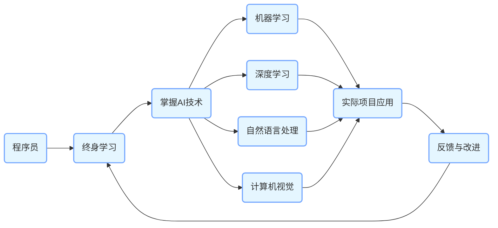

# 程序员在AI时代的终身学习策略

> 关键词：程序员、AI时代、终身学习策略、技术更新、职业发展

> 摘要：随着AI技术的飞速发展，程序员面临着前所未有的挑战和机遇。本文旨在探讨程序员在AI时代应采取的终身学习策略。通过对当前AI技术发展背景的介绍，阐述了核心概念如AI技术体系、终身学习理念等及其相互联系。详细讲解了与学习相关的核心算法原理，如知识图谱构建算法，并给出具体操作步骤。运用数学模型和公式对学习效果评估等方面进行了分析。通过项目实战案例，展示了如何将学习策略应用到实际工作中。同时，列举了AI时代程序员学习的实际应用场景，推荐了相关的工具和资源。最后，总结了未来发展趋势与挑战，解答了常见问题，并提供了扩展阅读和参考资料，帮助程序员制定有效的终身学习计划，以适应AI时代的快速变化。

## 1. 背景介绍 
### 1.1 目的和范围
在当今的AI时代，人工智能技术正以前所未有的速度改变着各个行业。对于程序员而言，这既是巨大的机遇，也是严峻的挑战。本文章的目的在于为程序员提供一套全面、系统的终身学习策略，帮助他们在快速发展的AI时代中保持竞争力，不断提升自己的技术水平和职业素养。

本文的范围涵盖了程序员在AI时代可能涉及的各个学习领域，包括但不限于AI基础理论、编程语言、算法设计、开发工具和框架等。同时，还将探讨如何将学习成果应用到实际项目中，以及如何应对AI时代带来的各种挑战。

### 1.2 预期读者
本文主要面向广大程序员群体，尤其是那些希望在AI时代不断提升自己、适应技术变革的程序员。无论是初入职场的新手程序员，还是经验丰富的资深开发者，都能从本文中获得有益的启示和实用的学习建议。

### 1.3 文档结构概述
本文将按照以下结构进行阐述：
- 核心概念与联系：介绍AI时代的核心概念以及它们之间的相互关系，帮助程序员建立起全面的知识体系。
- 核心算法原理 & 具体操作步骤：讲解与学习相关的核心算法原理，并给出具体的操作步骤，使程序员能够深入理解和应用这些算法。
- 数学模型和公式 & 详细讲解 & 举例说明：运用数学模型和公式对学习过程进行分析，通过具体的例子帮助程序员更好地理解和掌握。
- 项目实战：通过实际项目案例，展示如何将学习策略应用到实际工作中，提高程序员的实践能力。
- 实际应用场景：列举程序员在AI时代可能遇到的实际应用场景，为他们的学习和实践提供方向。
- 工具和资源推荐：推荐一些适合程序员在AI时代学习的工具和资源，包括书籍、在线课程、开发工具等。
- 总结：未来发展趋势与挑战：总结AI时代程序员终身学习的未来发展趋势和面临的挑战，为程序员的职业发展提供参考。
- 附录：常见问题与解答：解答程序员在学习过程中可能遇到的常见问题，帮助他们解决实际困难。
- 扩展阅读 & 参考资料：提供一些扩展阅读的资料和参考书目，供程序员进一步深入学习。

### 1.4 术语表
#### 1.4.1 核心术语定义
- **AI（Artificial Intelligence）**：人工智能，指机器模拟人类智能的能力，包括学习、推理、解决问题等。
- **机器学习（Machine Learning）**：AI的一个分支，让计算机通过数据学习模式和规律，从而进行预测和决策。
- **深度学习（Deep Learning）**：一种基于人工神经网络的机器学习方法，通过多层神经网络自动学习数据的特征表示。
- **终身学习（Lifelong Learning）**：个体在一生中持续不断地学习新知识、技能和态度的过程。

#### 1.4.2 相关概念解释
- **知识图谱（Knowledge Graph）**：一种语义网络，用于表示实体之间的关系，帮助计算机理解和处理知识。
- **强化学习（Reinforcement Learning）**：通过智能体与环境进行交互，根据环境反馈的奖励信号来学习最优策略的机器学习方法。
- **自然语言处理（Natural Language Processing）**：研究如何让计算机理解、处理和生成人类语言的技术。

#### 1.4.3 缩略词列表
- **AI**：Artificial Intelligence
- **ML**：Machine Learning
- **DL**：Deep Learning
- **RL**：Reinforcement Learning
- **NLP**：Natural Language Processing

## 2. 核心概念与联系 

### 核心概念原理

#### AI技术体系
AI技术体系是一个庞大而复杂的系统，主要包括机器学习、深度学习、自然语言处理、计算机视觉等多个领域。

- **机器学习**：是AI的基础，它通过算法让计算机从数据中学习模式和规律。常见的机器学习算法包括决策树、支持向量机、朴素贝叶斯等。例如，在垃圾邮件分类任务中，可以使用朴素贝叶斯算法根据邮件的特征将其分类为垃圾邮件或正常邮件。
- **深度学习**：是机器学习的一个子集，它基于人工神经网络，特别是深度神经网络。深度神经网络由多个层次的神经元组成，可以自动学习数据的高级特征表示。例如，在图像识别任务中，卷积神经网络（CNN）可以自动提取图像的特征，从而实现对图像内容的识别。
- **自然语言处理**：旨在让计算机理解和处理人类语言。它包括文本分类、情感分析、机器翻译等多个任务。例如，使用循环神经网络（RNN）及其变体（如LSTM、GRU）可以处理序列数据，在机器翻译中，将源语言的句子转换为目标语言的句子。
- **计算机视觉**：主要研究如何让计算机理解和处理图像和视频。它包括目标检测、图像分割、人脸识别等任务。例如，在安防领域，使用目标检测算法可以实时检测监控视频中的人员和物体。

#### 终身学习理念
终身学习是指个体在一生中持续不断地学习新知识、技能和态度的过程。在AI时代，技术更新换代非常快，程序员需要不断学习才能跟上技术的发展。终身学习不仅仅是为了获取新的知识和技能，更重要的是培养学习能力和适应能力，使程序员能够在不同的技术环境中快速学习和应用新的知识。

### 架构的文本示意图

AI技术与终身学习的关系可以用以下文本示意图表示：

AI技术是不断发展和演进的，包括机器学习、深度学习、自然语言处理、计算机视觉等多个领域。程序员需要通过终身学习来掌握这些技术，并将其应用到实际项目中。在学习过程中，程序员需要不断更新自己的知识体系，适应技术的变化。同时，AI技术也可以为终身学习提供支持，例如使用智能学习系统可以根据程序员的学习情况提供个性化的学习建议。

### Mermaid流程图



这个流程图展示了程序员在AI时代的学习和应用过程。程序员通过终身学习掌握AI技术，包括机器学习、深度学习、自然语言处理和计算机视觉等领域。然后将这些技术应用到实际项目中，在项目实施过程中获得反馈并进行改进，再将改进的经验反馈到终身学习中，形成一个闭环的学习和发展过程。

## 3. 核心算法原理 & 具体操作步骤 

### 知识图谱构建算法原理

知识图谱是一种用于表示实体之间关系的语义网络，在AI时代对于知识管理和推理非常重要。下面以基于图数据库的知识图谱构建为例，介绍其核心算法原理。

#### 实体识别与抽取
实体识别是指从文本中识别出具有特定意义的实体，如人名、地名、组织机构名等。常见的实体识别算法有基于规则的方法和基于机器学习的方法。基于机器学习的方法通常使用序列标注模型，如条件随机场（CRF）或双向长短时记忆网络（BiLSTM）与条件随机场（CRF）的结合（BiLSTM-CRF）。

以下是使用Python和`transformers`库实现基于预训练模型的实体识别代码示例：

```python
from transformers import AutoTokenizer, AutoModelForTokenClassification
import torch

# 加载预训练模型和分词器
tokenizer = AutoTokenizer.from_pretrained("dslim/bert-base-NER")
model = AutoModelForTokenClassification.from_pretrained("dslim/bert-base-NER")

# 输入文本
text = "Apple is a technology company based in California."

# 分词
inputs = tokenizer(text, return_tensors="pt")

# 模型预测
with torch.no_grad():
    outputs = model(**inputs)

# 获取预测结果
logits = outputs.logits
predictions = torch.argmax(logits, dim=2)

# 解码预测结果
tokens = tokenizer.convert_ids_to_tokens(inputs["input_ids"][0])
labels = model.config.id2label
for token, prediction in zip(tokens, predictions[0]):
    print(f"{token}: {labels[prediction.item()]}")
```

#### 关系抽取
关系抽取是指从文本中识别出实体之间的关系。常见的关系抽取方法有基于规则的方法、基于机器学习的方法和基于深度学习的方法。基于深度学习的方法通常使用卷积神经网络（CNN）或循环神经网络（RNN）来学习实体之间的关系表示。

以下是一个简单的基于深度学习的关系抽取代码示例：

```python
import torch
import torch.nn as nn
import torch.optim as optim

# 定义关系抽取模型
class RelationExtractionModel(nn.Module):
    def __init__(self, input_size, hidden_size, num_classes):
        super(RelationExtractionModel, self).__init__()
        self.fc1 = nn.Linear(input_size, hidden_size)
        self.relu = nn.ReLU()
        self.fc2 = nn.Linear(hidden_size, num_classes)

    def forward(self, x):
        out = self.fc1(x)
        out = self.relu(out)
        out = self.fc2(out)
        return out

# 初始化模型
input_size = 100
hidden_size = 50
num_classes = 5
model = RelationExtractionModel(input_size, hidden_size, num_classes)

# 定义损失函数和优化器
criterion = nn.CrossEntropyLoss()
optimizer = optim.Adam(model.parameters(), lr=0.001)

# 模拟训练数据
inputs = torch.randn(10, input_size)
labels = torch.randint(0, num_classes, (10,))

# 训练模型
for epoch in range(100):
    optimizer.zero_grad()
    outputs = model(inputs)
    loss = criterion(outputs, labels)
    loss.backward()
    optimizer.step()

    if (epoch + 1) % 10 == 0:
        print(f'Epoch [{epoch+1}/100], Loss: {loss.item():.4f}')
```

#### 知识图谱存储
将抽取的实体和关系存储到图数据库中，常见的图数据库有Neo4j、JanusGraph等。以下是使用Python和`py2neo`库将数据存储到Neo4j的示例代码：

```python
from py2neo import Graph, Node, Relationship

# 连接到Neo4j数据库
graph = Graph("bolt://localhost:7687", auth=("neo4j", "password"))

# 创建实体节点
apple = Node("Company", name="Apple")
california = Node("Location", name="California")

# 创建关系
relation = Relationship(apple, "BASED_IN", california)

# 将节点和关系添加到图数据库中
graph.create(apple)
graph.create(california)
graph.create(relation)
```

### 具体操作步骤

1. **数据收集**：收集与目标领域相关的文本数据，可以从新闻网站、学术论文、社交媒体等渠道获取。
2. **数据预处理**：对收集到的数据进行清洗、分词、标注等预处理操作，以便后续的实体识别和关系抽取。
3. **实体识别与抽取**：使用上述的实体识别算法从预处理后的数据中抽取实体。
4. **关系抽取**：使用关系抽取算法识别实体之间的关系。
5. **知识图谱存储**：将抽取的实体和关系存储到图数据库中，方便后续的查询和推理。

## 4. 数学模型和公式 & 详细讲解 & 举例说明 

### 学习效果评估模型

在终身学习过程中，评估学习效果是非常重要的。我们可以使用一些数学模型和公式来评估学习效果，例如基于准确率、召回率和F1值的评估模型。

#### 准确率（Accuracy）
准确率是指分类正确的样本数占总样本数的比例，其计算公式为：

$$Accuracy = \frac{TP + TN}{TP + TN + FP + FN}$$

其中，$TP$ 表示真正例（预测为正例且实际为正例）的数量，$TN$ 表示真反例（预测为反例且实际为反例）的数量，$FP$ 表示假正例（预测为正例但实际为反例）的数量，$FN$ 表示假反例（预测为反例但实际为正例）的数量。

例如，在一个二分类任务中，有100个样本，其中预测正确的正例有30个，预测正确的反例有60个，预测错误的正例有5个，预测错误的反例有5个。则准确率为：

$$Accuracy = \frac{30 + 60}{30 + 60 + 5 + 5} = 0.9$$

#### 召回率（Recall）
召回率是指真正例占所有实际正例的比例，其计算公式为：

$$Recall = \frac{TP}{TP + FN}$$

例如，在上述例子中，召回率为：

$$Recall = \frac{30}{30 + 5} \approx 0.857$$

#### F1值
F1值是准确率和召回率的调和平均数，其计算公式为：

$$F1 = 2 \times \frac{Accuracy \times Recall}{Accuracy + Recall}$$

在上述例子中，F1值为：

$$F1 = 2 \times \frac{0.9 \times 0.857}{0.9 + 0.857} \approx 0.878$$

### 学习进度预测模型

我们可以使用线性回归模型来预测程序员的学习进度。假设学习进度 $y$ 与学习时间 $x$ 之间存在线性关系，其数学模型可以表示为：

$$y = \beta_0 + \beta_1 x + \epsilon$$

其中，$\beta_0$ 是截距，$\beta_1$ 是斜率，$\epsilon$ 是误差项。

我们可以使用最小二乘法来估计 $\beta_0$ 和 $\beta_1$ 的值。最小二乘法的目标是使预测值与实际值之间的误差平方和最小，即：

$$\min_{\beta_0, \beta_1} \sum_{i=1}^{n} (y_i - (\beta_0 + \beta_1 x_i))^2$$

以下是使用Python和`scikit-learn`库实现线性回归模型的代码示例：

```python
import numpy as np
from sklearn.linear_model import LinearRegression

# 模拟学习时间和学习进度数据
X = np.array([1, 2, 3, 4, 5]).reshape(-1, 1)
y = np.array([2, 4, 6, 8, 10])

# 创建线性回归模型
model = LinearRegression()

# 训练模型
model.fit(X, y)

# 预测学习进度
new_X = np.array([6]).reshape(-1, 1)
predicted_y = model.predict(new_X)

print(f"预测的学习进度: {predicted_y[0]}")
```

### 学习资源推荐模型

我们可以使用协同过滤算法来推荐适合程序员的学习资源。协同过滤算法基于用户的历史行为和偏好来推荐相似的资源。

假设我们有一个用户-资源评分矩阵 $R$，其中 $R_{u,i}$ 表示用户 $u$ 对资源 $i$ 的评分。我们可以计算用户之间的相似度，然后根据相似度找到与目标用户最相似的 $k$ 个用户，最后推荐这 $k$ 个用户喜欢的资源给目标用户。

用户之间的相似度可以使用皮尔逊相关系数来计算，其计算公式为：

$$sim(u, v) = \frac{\sum_{i \in I_{u,v}} (R_{u,i} - \overline{R_u})(R_{v,i} - \overline{R_v})}{\sqrt{\sum_{i \in I_{u,v}} (R_{u,i} - \overline{R_u})^2} \sqrt{\sum_{i \in I_{u,v}} (R_{v,i} - \overline{R_v})^2}}$$

其中，$I_{u,v}$ 表示用户 $u$ 和用户 $v$ 都评分过的资源集合，$\overline{R_u}$ 和 $\overline{R_v}$ 分别表示用户 $u$ 和用户 $v$ 的平均评分。

以下是一个简单的协同过滤推荐代码示例：

```python
import numpy as np

# 用户-资源评分矩阵
R = np.array([
    [5, 3, 0, 1],
    [4, 0, 0, 1],
    [1, 1, 0, 5],
    [1, 0, 0, 4],
    [0, 1, 5, 4]
])

# 计算用户之间的相似度
def pearson_similarity(u, v):
    common_items = np.logical_and(R[u] > 0, R[v] > 0)
    if np.sum(common_items) == 0:
        return 0
    u_ratings = R[u][common_items]
    v_ratings = R[v][common_items]
    u_mean = np.mean(R[u][R[u] > 0])
    v_mean = np.mean(R[v][R[v] > 0])
    numerator = np.sum((u_ratings - u_mean) * (v_ratings - v_mean))
    denominator = np.sqrt(np.sum((u_ratings - u_mean) ** 2)) * np.sqrt(np.sum((v_ratings - v_mean) ** 2))
    return numerator / denominator

# 找到与目标用户最相似的k个用户
def find_similar_users(target_user, k):
    num_users = R.shape[0]
    similarities = []
    for i in range(num_users):
        if i != target_user:
            sim = pearson_similarity(target_user, i)
            similarities.append((i, sim))
    similarities.sort(key=lambda x: x[1], reverse=True)
    return [user for user, _ in similarities[:k]]

# 推荐资源
def recommend_resources(target_user, k):
    similar_users = find_similar_users(target_user, k)
    target_user_ratings = R[target_user]
    recommended_resources = []
    for i in range(R.shape[1]):
        if target_user_ratings[i] == 0:
            total_rating = 0
            total_similarity = 0
            for user in similar_users:
                if R[user][i] > 0:
                    sim = pearson_similarity(target_user, user)
                    total_rating += sim * R[user][i]
                    total_similarity += sim
            if total_similarity > 0:
                predicted_rating = total_rating / total_similarity
                recommended_resources.append((i, predicted_rating))
    recommended_resources.sort(key=lambda x: x[1], reverse=True)
    return [resource for resource, _ in recommended_resources]

# 示例：为用户0推荐资源
target_user = 0
k = 2
recommended = recommend_resources(target_user, k)
print(f"为用户{target_user}推荐的资源: {recommended}")
```

## 5. 项目实战：代码实际案例和详细解释说明 

### 5.1  开发环境搭建

在进行项目实战之前，我们需要搭建一个合适的开发环境。以下是一个基于Python的开发环境搭建步骤：

#### 安装Python
首先，从Python官方网站（https://www.python.org/downloads/）下载并安装Python 3.x版本。安装完成后，在命令行中输入以下命令验证Python是否安装成功：

```sh
python --version
```

#### 创建虚拟环境
为了避免不同项目之间的依赖冲突，我们可以使用虚拟环境。在命令行中输入以下命令创建一个虚拟环境：

```sh
python -m venv myenv
```

激活虚拟环境：

- 在Windows上：
```sh
myenv\Scripts\activate
```

- 在Linux或macOS上：
```sh
source myenv/bin/activate
```

#### 安装必要的库
在虚拟环境中，使用`pip`命令安装项目所需的库，例如`numpy`、`pandas`、`scikit-learn`、`torch`等：

```sh
pip install numpy pandas scikit-learn torch
```

### 5.2  源代码详细实现和代码解读

#### 项目需求
我们要实现一个简单的图像分类项目，使用深度学习模型对图像进行分类。我们将使用PyTorch框架和CIFAR-10数据集。

#### 代码实现

```python
import torch
import torch.nn as nn
import torch.optim as optim
import torchvision
import torchvision.transforms as transforms

# 数据预处理
transform = transforms.Compose(
    [transforms.ToTensor(),
     transforms.Normalize((0.5, 0.5, 0.5), (0.5, 0.5, 0.5))])

# 加载CIFAR-10数据集
trainset = torchvision.datasets.CIFAR10(root='./data', train=True,
                                        download=True, transform=transform)
trainloader = torch.utils.data.DataLoader(trainset, batch_size=4,
                                          shuffle=True, num_workers=2)

testset = torchvision.datasets.CIFAR10(root='./data', train=False,
                                       download=True, transform=transform)
testloader = torch.utils.data.DataLoader(testset, batch_size=4,
                                         shuffle=False, num_workers=2)

classes = ('plane', 'car', 'bird', 'cat',
           'deer', 'dog', 'frog', 'horse', 'ship', 'truck')

# 定义简单的卷积神经网络
class Net(nn.Module):
    def __init__(self):
        super(Net, self).__init__()
        self.conv1 = nn.Conv2d(3, 6, 5)
        self.pool = nn.MaxPool2d(2, 2)
        self.conv2 = nn.Conv2d(6, 16, 5)
        self.fc1 = nn.Linear(16 * 5 * 5, 120)
        self.fc2 = nn.Linear(120, 84)
        self.fc3 = nn.Linear(84, 10)

    def forward(self, x):
        x = self.pool(torch.relu(self.conv1(x)))
        x = self.pool(torch.relu(self.conv2(x)))
        x = x.view(-1, 16 * 5 * 5)
        x = torch.relu(self.fc1(x))
        x = torch.relu(self.fc2(x))
        x = self.fc3(x)
        return x

net = Net()

# 定义损失函数和优化器
criterion = nn.CrossEntropyLoss()
optimizer = optim.SGD(net.parameters(), lr=0.001, momentum=0.9)

# 训练模型
for epoch in range(2):  # 训练2个epoch
    running_loss = 0.0
    for i, data in enumerate(trainloader, 0):
        inputs, labels = data

        optimizer.zero_grad()

        outputs = net(inputs)
        loss = criterion(outputs, labels)
        loss.backward()
        optimizer.step()

        running_loss += loss.item()
        if i % 2000 == 1999:    # 每2000个batch打印一次损失值
            print(f'[{epoch + 1}, {i + 1:5d}] loss: {running_loss / 2000:.3f}')
            running_loss = 0.0

print('Finished Training')

# 测试模型
correct = 0
total = 0
with torch.no_grad():
    for data in testloader:
        images, labels = data
        outputs = net(images)
        _, predicted = torch.max(outputs.data, 1)
        total += labels.size(0)
        correct += (predicted == labels).sum().item()

print(f'Accuracy of the network on the 10000 test images: {100 * correct / total}%')
```

#### 代码解读

1. **数据预处理**：使用`transforms.Compose`函数定义了一系列的数据预处理操作，包括将图像转换为张量和归一化处理。
2. **数据集加载**：使用`torchvision.datasets.CIFAR10`加载CIFAR-10数据集，并使用`torch.utils.data.DataLoader`创建数据加载器，方便批量加载数据。
3. **模型定义**：定义了一个简单的卷积神经网络`Net`，包括两个卷积层、两个池化层和三个全连接层。
4. **损失函数和优化器**：使用交叉熵损失函数`nn.CrossEntropyLoss`和随机梯度下降优化器`optim.SGD`。
5. **模型训练**：通过循环遍历训练数据集，计算损失值并进行反向传播和参数更新。
6. **模型测试**：在测试数据集上评估模型的准确率。

### 5.3  代码解读与分析

#### 模型结构分析
我们定义的卷积神经网络`Net`是一个简单的多层神经网络。输入层接收3通道的图像数据，经过两个卷积层和池化层提取图像特征，然后通过三个全连接层将特征映射到10个类别上。

#### 训练过程分析
在训练过程中，我们使用随机梯度下降（SGD）优化器来更新模型的参数。每一个epoch表示对整个训练数据集的一次遍历。在每个batch中，我们计算模型的输出和损失值，然后通过反向传播算法计算梯度并更新参数。

#### 测试结果分析
通过在测试数据集上评估模型的准确率，我们可以了解模型的性能。在这个例子中，我们计算了模型在10000张测试图像上的分类准确率。如果准确率较低，我们可以考虑增加训练数据、调整模型结构或优化超参数。

## 6. 实际应用场景 

### 智能软件开发
在AI时代，智能软件开发是程序员的一个重要应用场景。程序员可以使用AI技术来实现代码自动补全、代码缺陷检测、智能编程助手等功能。例如，使用深度学习模型可以学习大量的代码模式，从而实现更智能的代码补全功能。

### 数据分析与挖掘
程序员可以使用AI技术进行数据分析和挖掘。例如，使用机器学习算法对海量数据进行分类、聚类和预测分析。在金融领域，程序员可以使用AI技术进行风险评估和欺诈检测；在医疗领域，可以使用AI技术进行疾病诊断和预测。

### 自然语言处理应用
自然语言处理是AI领域的一个重要方向，程序员可以开发各种自然语言处理应用，如聊天机器人、机器翻译、文本摘要等。例如，使用深度学习模型可以实现更准确的机器翻译，提高翻译的质量和效率。

### 计算机视觉应用
计算机视觉在安防、自动驾驶、医疗影像分析等领域有广泛的应用。程序员可以开发目标检测、图像识别、人脸识别等应用。例如，在安防领域，使用计算机视觉技术可以实时监控和检测异常行为。

### 智能硬件开发
随着物联网和智能家居的发展，智能硬件开发成为一个热门领域。程序员可以使用AI技术为智能硬件设备添加智能功能，如语音识别、图像识别等。例如，智能音箱可以通过语音识别技术实现人机交互。

## 7. 工具和资源推荐
### 7.1 学习资源推荐
#### 7.1.1 书籍推荐
- 《深度学习》（Deep Learning）：由Ian Goodfellow、Yoshua Bengio和Aaron Courville所著，是深度学习领域的经典教材，全面介绍了深度学习的理论和方法。
- 《Python机器学习》（Python Machine Learning）：由Sebastian Raschka所著，通过Python代码详细介绍了机器学习的各种算法和应用。
- 《人工智能：一种现代的方法》（Artificial Intelligence: A Modern Approach）：由Stuart Russell和Peter Norvig所著，是人工智能领域的权威教材，涵盖了人工智能的各个方面。

#### 7.1.2 在线课程
- Coursera上的“机器学习”课程：由Andrew Ng教授授课，是机器学习领域的经典课程，适合初学者入门。
- edX上的“深度学习微硕士项目”：提供了深度学习的系统学习课程，包括卷积神经网络、循环神经网络等内容。
- Udemy上的“Python数据科学和机器学习实战”课程：通过实际项目讲解Python在数据科学和机器学习中的应用。

#### 7.1.3 技术博客和网站
- Medium：有很多AI领域的优秀博客文章，涵盖了最新的研究成果和技术应用。
- Towards Data Science：专注于数据科学和机器学习领域的技术博客，提供了很多实用的教程和案例。
- arXiv：一个预印本服务器，包含了大量的AI领域的研究论文，方便了解最新的研究动态。

### 7.2 开发工具框架推荐
#### 7.2.1 IDE和编辑器
- PyCharm：一款专门为Python开发设计的集成开发环境，提供了丰富的功能和插件，方便代码开发和调试。
- Visual Studio Code：一款轻量级的代码编辑器，支持多种编程语言，有大量的扩展插件可供选择。
- Jupyter Notebook：一个交互式的开发环境，适合进行数据分析和机器学习实验，方便代码的编写和展示。

#### 7.2.2 调试和性能分析工具
- Py-Spy：一个用于Python代码性能分析的工具，可以实时查看代码的运行状态和性能瓶颈。
- TensorBoard：TensorFlow提供的可视化工具，可以用于查看模型的训练过程和性能指标。
- PDB：Python自带的调试器，可以帮助程序员调试代码，查找错误。

#### 7.2.3 相关框架和库
- TensorFlow：Google开发的开源机器学习框架，提供了丰富的工具和接口，方便开发各种机器学习模型。
- PyTorch：Facebook开发的开源深度学习框架，具有动态图的特点，易于使用和调试。
- Scikit-learn：一个简单易用的机器学习库，提供了各种机器学习算法和工具，适合初学者快速上手。

### 7.3 相关论文著作推荐
#### 7.3.1 经典论文
- “ImageNet Classification with Deep Convolutional Neural Networks”：介绍了AlexNet卷积神经网络，开启了深度学习在计算机视觉领域的应用热潮。
- “Long Short-Term Memory”：提出了长短期记忆网络（LSTM），解决了传统循环神经网络的梯度消失问题。
- “Attention Is All You Need”：提出了Transformer模型，在自然语言处理领域取得了巨大的成功。

#### 7.3.2 最新研究成果
- 关注顶级学术会议如NeurIPS、ICML、CVPR等的论文，了解AI领域的最新研究进展。
- 一些知名研究机构如OpenAI、DeepMind等发布的研究报告和论文，通常代表了行业的前沿技术。

#### 7.3.3 应用案例分析
- 研究一些实际应用案例，如谷歌的AlphaGo、百度的自动驾驶技术等，了解AI技术在实际场景中的应用和实现方法。

## 8. 总结：未来发展趋势与挑战

### 未来发展趋势
- **AI与其他技术的融合**：AI将与物联网、大数据、区块链等技术深度融合，创造出更多的应用场景和商业价值。例如，在智能家居领域，AI与物联网技术的结合可以实现更智能的家居控制和管理。
- **自动化和智能化开发**：随着AI技术的发展，软件开发将越来越自动化和智能化。代码自动生成、智能编程助手等工具将大大提高开发效率，降低开发成本。
- **跨领域应用**：AI技术将在更多的领域得到应用，如教育、艺术、娱乐等。例如，在教育领域，AI可以实现个性化学习和智能辅导。

### 挑战
- **技术更新换代快**：AI技术发展迅速，新的算法和模型不断涌现。程序员需要不断学习和更新自己的知识，才能跟上技术的发展。
- **数据隐私和安全问题**：AI应用需要大量的数据支持，但数据隐私和安全问题也日益突出。程序员需要在开发过程中重视数据的保护，确保用户的隐私和数据安全。
- **伦理和社会问题**：AI技术的应用可能会带来一些伦理和社会问题，如失业、算法偏见等。程序员需要在开发过程中考虑这些问题，确保AI技术的健康发展。

## 9. 附录：常见问题与解答

### 问题1：如何选择适合自己的学习资源？
解答：首先要明确自己的学习目标和水平。如果是初学者，可以选择一些基础的教材和在线课程，如《Python机器学习》和Coursera上的“机器学习”课程。如果已经有一定的基础，可以阅读一些经典论文和最新研究成果，关注行业的前沿动态。

### 问题2：如何提高学习效率？
解答：可以制定合理的学习计划，将学习任务分解成小的目标，逐步完成。同时，要多实践，通过实际项目来巩固所学的知识。此外，还可以参加一些技术交流活动，与其他程序员分享学习经验和心得。

### 问题3：如何应对技术更新换代快的问题？
解答：要保持学习的热情和好奇心，关注行业的最新动态。定期阅读技术博客和论文，参加技术培训和研讨会。同时，要培养自己的学习能力和适应能力，能够快速学习和掌握新的技术。

### 问题4：如何解决数据隐私和安全问题？
解答：在开发过程中，要遵循相关的法律法规和行业标准，采取数据加密、访问控制等措施来保护数据的安全。同时，要对数据进行合理的使用和管理，避免数据的滥用和泄露。

### 问题5：如何处理AI技术带来的伦理和社会问题？
解答：要树立正确的价值观，在开发过程中充分考虑AI技术可能带来的影响。与社会各界进行沟通和交流，共同探讨解决伦理和社会问题的方法。同时，要推动相关法律法规的制定和完善，确保AI技术的健康发展。

## 10. 扩展阅读 & 参考资料

### 扩展阅读
- 《AI未来进行式》：李开复和王咏刚所著，介绍了AI技术的发展现状和未来趋势，以及对社会和人类的影响。
- 《智能时代》：吴军所著，探讨了AI技术在各个领域的应用和发展，以及对人类社会的变革。

### 参考资料
- Goodfellow, I., Bengio, Y., & Courville, A. (2016). Deep Learning. MIT Press.
- Raschka, S. (2015). Python Machine Learning. Packt Publishing.
- Russell, S. J., & Norvig, P. (2009). Artificial Intelligence: A Modern Approach. Pearson.
- 相关学术会议和期刊的论文，如NeurIPS、ICML、CVPR、Journal of Artificial Intelligence Research等。