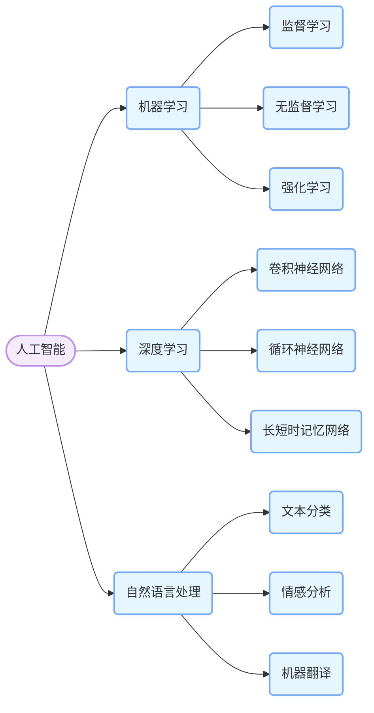

# 程序员在AI浪潮中的生存之道

> 关键词：程序员、AI浪潮、生存之道、技能提升、职业转型

> 摘要：随着人工智能（AI）浪潮的迅猛来袭，程序员这一群体面临着前所未有的机遇与挑战。本文旨在深入探讨程序员在AI浪潮中的生存之道，通过介绍相关背景知识，阐述核心概念与联系，分析核心算法原理和操作步骤，引入数学模型和公式，结合项目实战案例，探讨实际应用场景，推荐相关工具和资源，最后总结未来发展趋势与挑战，解答常见问题并提供扩展阅读和参考资料，帮助程序员在这一浪潮中找准定位，提升自身竞争力，实现职业的可持续发展。

## 1. 背景介绍 
### 1.1 目的和范围
本文章的主要目的是为广大程序员在AI浪潮下提供全面且具有指导性的生存策略。范围涵盖了从基础的AI核心概念理解，到核心算法原理的剖析，再到项目实战的操作，以及实际应用场景的分析等多个方面。通过系统性的阐述，帮助程序员了解AI对自身职业的影响，掌握应对AI浪潮的方法和技能，以更好地适应行业的发展变化。

### 1.2 预期读者
本文的预期读者主要是广大程序员群体，包括初级程序员、有一定经验的中级程序员以及高级程序员。无论你是刚刚踏入编程领域，还是已经在行业内深耕多年，都能从本文中获取有价值的信息，找到适合自己在AI浪潮中发展的方向。同时，对于那些对AI和编程感兴趣的相关从业者和爱好者，本文也具有一定的参考价值。

### 1.3 文档结构概述
本文将按照以下结构进行详细阐述：首先介绍背景知识，包括目的、预期读者和文档结构概述以及相关术语表；接着讲解AI的核心概念与联系，并通过文本示意图和Mermaid流程图进行直观展示；然后深入分析核心算法原理和具体操作步骤，结合Python源代码进行详细说明；之后引入数学模型和公式，并举例进行详细讲解；再通过项目实战案例，介绍开发环境搭建、源代码实现和代码解读；随后探讨AI的实际应用场景；推荐相关的学习资源、开发工具框架和论文著作；最后总结未来发展趋势与挑战，解答常见问题并提供扩展阅读和参考资料。

### 1.4 术语表
#### 1.4.1 核心术语定义
- **人工智能（AI）**：指机器所具有的人类智能相关的特征，包括学习、推理、问题解决等能力。AI系统能够通过数据进行训练，以实现特定的任务。
- **机器学习（ML）**：是AI的一个重要分支，专注于让计算机通过数据学习模式和规律，而无需明确的编程指令。常见的机器学习算法包括决策树、支持向量机、神经网络等。
- **深度学习（DL）**：是机器学习的一个子集，基于人工神经网络，特别是深度神经网络（DNN）。深度学习模型可以自动从大量数据中学习复杂的模式和特征，在图像识别、语音识别等领域取得了显著的成果。
- **自然语言处理（NLP）**：研究如何让计算机理解、处理和生成人类语言。NLP技术广泛应用于机器翻译、智能客服、文本分类等领域。

#### 1.4.2 相关概念解释
- **监督学习**：在监督学习中，模型通过已标记的数据进行训练，即每个输入数据都有对应的输出标签。模型的目标是学习输入和输出之间的映射关系，以便对新的未标记数据进行预测。
- **无监督学习**：无监督学习使用未标记的数据进行训练，模型的任务是发现数据中的内在结构和模式，如聚类分析、降维等。
- **强化学习**：强化学习是一种通过智能体与环境进行交互来学习最优行为策略的方法。智能体根据环境的反馈（奖励或惩罚）来调整自己的行为，以最大化累积奖励。

#### 1.4.3 缩略词列表
- **AI**：Artificial Intelligence（人工智能）
- **ML**：Machine Learning（机器学习）
- **DL**：Deep Learning（深度学习）
- **NLP**：Natural Language Processing（自然语言处理）
- **DNN**：Deep Neural Network（深度神经网络）
- **CNN**：Convolutional Neural Network（卷积神经网络）
- **RNN**：Recurrent Neural Network（循环神经网络）

## 2. 核心概念与联系 
### 核心概念原理
#### 人工智能
人工智能是一个广泛的领域，旨在使机器能够模拟人类的智能行为。它涵盖了多个子领域，如机器学习、自然语言处理、计算机视觉等。人工智能的核心思想是让机器能够感知环境、理解信息、做出决策并采取行动。

#### 机器学习
机器学习是实现人工智能的一种重要方法。它通过让计算机从数据中学习模式和规律，从而实现对未知数据的预测和分类。机器学习算法可以分为监督学习、无监督学习和强化学习等类型。

#### 深度学习
深度学习是机器学习的一个高级分支，基于人工神经网络。深度神经网络由多个神经元层组成，可以自动从大量数据中学习复杂的特征和模式。深度学习在图像识别、语音识别、自然语言处理等领域取得了巨大的成功。

#### 自然语言处理
自然语言处理是人工智能的一个重要应用领域，旨在让计算机能够理解和处理人类语言。自然语言处理技术包括文本分类、情感分析、机器翻译、问答系统等。

### 架构的文本示意图
```plaintext
人工智能
|-- 机器学习
|   |-- 监督学习
|   |-- 无监督学习
|   |-- 强化学习
|-- 深度学习
|   |-- 卷积神经网络（CNN）
|   |-- 循环神经网络（RNN）
|   |-- 长短时记忆网络（LSTM）
|-- 自然语言处理
|   |-- 文本分类
|   |-- 情感分析
|   |-- 机器翻译
```

### Mermaid流程图


## 3. 核心算法原理 & 具体操作步骤 
### 线性回归算法原理
线性回归是一种简单而常用的监督学习算法，用于预测连续值的输出。其基本思想是通过寻找一个线性函数来拟合输入特征和输出之间的关系。线性回归模型的一般形式可以表示为：

$$y = \theta_0 + \theta_1x_1 + \theta_2x_2 + \cdots + \theta_nx_n$$

其中，$y$ 是输出值，$x_1, x_2, \cdots, x_n$ 是输入特征，$\theta_0, \theta_1, \theta_2, \cdots, \theta_n$ 是模型的参数。

### 具体操作步骤
1. **数据准备**：收集和整理包含输入特征和对应输出值的数据集。
2. **模型训练**：使用训练数据来估计模型的参数 $\theta$。通常使用最小二乘法来最小化预测值和真实值之间的误差平方和。
3. **模型评估**：使用测试数据来评估模型的性能。常用的评估指标包括均方误差（MSE）、均方根误差（RMSE）等。
4. **预测**：使用训练好的模型对新的数据进行预测。

### Python源代码实现
```python
import numpy as np
from sklearn.linear_model import LinearRegression
from sklearn.metrics import mean_squared_error
from sklearn.model_selection import train_test_split

# 生成一些示例数据
np.random.seed(0)
X = 2 * np.random.rand(100, 1)
y = 4 + 3 * X + np.random.randn(100, 1)

# 划分训练集和测试集
X_train, X_test, y_train, y_test = train_test_split(X, y, test_size=0.2, random_state=42)

# 创建线性回归模型
model = LinearRegression()

# 训练模型
model.fit(X_train, y_train)

# 进行预测
y_pred = model.predict(X_test)

# 计算均方误差
mse = mean_squared_error(y_test, y_pred)
print(f"均方误差: {mse}")
```

### 代码解释
1. **数据生成**：使用 `np.random.rand` 生成输入特征 $X$，并根据线性关系生成对应的输出值 $y$，同时添加一些随机噪声。
2. **数据划分**：使用 `train_test_split` 函数将数据集划分为训练集和测试集，测试集占比为 20%。
3. **模型创建和训练**：创建 `LinearRegression` 模型，并使用训练数据进行训练。
4. **预测和评估**：使用训练好的模型对测试数据进行预测，并计算预测值和真实值之间的均方误差。

## 4. 数学模型和公式 & 详细讲解 & 举例说明 
### 线性回归的数学模型
线性回归的目标是找到一组参数 $\theta$，使得预测值 $\hat{y}$ 与真实值 $y$ 之间的误差最小。误差通常使用均方误差（MSE）来衡量，其公式为：

$$MSE = \frac{1}{m} \sum_{i=1}^{m} (y^{(i)} - \hat{y}^{(i)})^2$$

其中，$m$ 是样本数量，$y^{(i)}$ 是第 $i$ 个样本的真实值，$\hat{y}^{(i)}$ 是第 $i$ 个样本的预测值。

为了最小化均方误差，我们可以使用最小二乘法。最小二乘法的目标是找到一组参数 $\theta$，使得误差平方和最小。具体来说，我们需要求解以下优化问题：

$$\min_{\theta} \frac{1}{2m} \sum_{i=1}^{m} (y^{(i)} - \theta^T x^{(i)})^2$$

其中，$\theta^T$ 是参数向量 $\theta$ 的转置，$x^{(i)}$ 是第 $i$ 个样本的输入特征向量。

### 详细讲解
最小二乘法的求解可以通过对误差平方和求偏导数，并令其等于零来得到。具体来说，我们对误差平方和关于 $\theta$ 求偏导数：

$$\frac{\partial}{\partial \theta} \frac{1}{2m} \sum_{i=1}^{m} (y^{(i)} - \theta^T x^{(i)})^2 = 0$$

通过求解上述方程，可以得到参数 $\theta$ 的最优解：

$$\theta = (X^T X)^{-1} X^T y$$

其中，$X$ 是输入特征矩阵，$y$ 是输出值向量。

### 举例说明
假设我们有一个简单的数据集，包含两个输入特征 $x_1$ 和 $x_2$，以及对应的输出值 $y$：

| $x_1$ | $x_2$ | $y$ |
|-------|-------|-----|
| 1     | 2     | 5   |
| 2     | 3     | 8   |
| 3     | 4     | 11  |

我们可以将数据集表示为矩阵形式：

$$X = \begin{bmatrix} 1 & 2 \\ 2 & 3 \\ 3 & 4 \end{bmatrix}, y = \begin{bmatrix} 5 \\ 8 \\ 11 \end{bmatrix}$$

首先，计算 $X^T X$ 和 $X^T y$：

$$X^T X = \begin{bmatrix} 1 & 2 & 3 \\ 2 & 3 & 4 \end{bmatrix} \begin{bmatrix} 1 & 2 \\ 2 & 3 \\ 3 & 4 \end{bmatrix} = \begin{bmatrix} 14 & 20 \\ 20 & 29 \end{bmatrix}$$

$$X^T y = \begin{bmatrix} 1 & 2 & 3 \\ 2 & 3 & 4 \end{bmatrix} \begin{bmatrix} 5 \\ 8 \\ 11 \end{bmatrix} = \begin{bmatrix} 54 \\ 77 \end{bmatrix}$$

然后，计算 $(X^T X)^{-1}$：

$$(X^T X)^{-1} = \frac{1}{14 \times 29 - 20 \times 20} \begin{bmatrix} 29 & -20 \\ -20 & 14 \end{bmatrix} = \begin{bmatrix} 29 & -20 \\ -20 & 14 \end{bmatrix}$$

最后，计算参数 $\theta$：

$$\theta = (X^T X)^{-1} X^T y = \begin{bmatrix} 29 & -20 \\ -20 & 14 \end{bmatrix} \begin{bmatrix} 54 \\ 77 \end{bmatrix} = \begin{bmatrix} 1 \\ 2 \end{bmatrix}$$

因此，线性回归模型的参数为 $\theta_0 = 1$，$\theta_1 = 2$，$\theta_2 = 0$（因为我们只有两个输入特征），模型的表达式为 $y = 1 + 2x_1$。

## 5. 项目实战：代码实际案例和详细解释说明 
### 5.1  开发环境搭建
#### 安装Python
首先，确保你已经安装了Python。可以从Python官方网站（https://www.python.org/downloads/）下载并安装适合你操作系统的Python版本。建议安装Python 3.7及以上版本。

#### 创建虚拟环境
为了避免不同项目之间的依赖冲突，建议使用虚拟环境。可以使用 `venv` 模块来创建虚拟环境：

```bash
python -m venv myenv
```

激活虚拟环境：

- 在Windows上：
```bash
myenv\Scripts\activate
```
- 在Linux或Mac上：
```bash
source myenv/bin/activate
```

#### 安装必要的库
在虚拟环境中，安装必要的机器学习和数据处理库，如 `numpy`、`pandas`、`scikit-learn` 等：

```bash
pip install numpy pandas scikit-learn
```

### 5.2  源代码详细实现和代码解读
#### 项目背景
我们将使用一个简单的房价预测数据集来演示线性回归的应用。数据集包含房屋的面积和对应的价格信息，我们的目标是根据房屋面积来预测房屋价格。

#### 源代码实现
```python
import numpy as np
import pandas as pd
from sklearn.linear_model import LinearRegression
from sklearn.model_selection import train_test_split
from sklearn.metrics import mean_squared_error
import matplotlib.pyplot as plt

# 加载数据集
data = pd.read_csv('house_prices.csv')

# 提取特征和目标变量
X = data[['area']].values
y = data['price'].values

# 划分训练集和测试集
X_train, X_test, y_train, y_test = train_test_split(X, y, test_size=0.2, random_state=42)

# 创建线性回归模型
model = LinearRegression()

# 训练模型
model.fit(X_train, y_train)

# 进行预测
y_pred = model.predict(X_test)

# 计算均方误差
mse = mean_squared_error(y_test, y_pred)
print(f"均方误差: {mse}")

# 可视化结果
plt.scatter(X_test, y_test, color='blue', label='实际值')
plt.plot(X_test, y_pred, color='red', linewidth=2, label='预测值')
plt.xlabel('房屋面积')
plt.ylabel('房屋价格')
plt.title('房价预测')
plt.legend()
plt.show()
```

#### 代码解读
1. **数据加载**：使用 `pandas` 库的 `read_csv` 函数加载房价数据集。
2. **特征提取**：从数据集中提取房屋面积作为输入特征 $X$，房屋价格作为目标变量 $y$。
3. **数据划分**：使用 `train_test_split` 函数将数据集划分为训练集和测试集，测试集占比为 20%。
4. **模型创建和训练**：创建 `LinearRegression` 模型，并使用训练数据进行训练。
5. **预测和评估**：使用训练好的模型对测试数据进行预测，并计算预测值和真实值之间的均方误差。
6. **可视化**：使用 `matplotlib` 库绘制实际值和预测值的散点图和拟合直线，直观展示模型的预测效果。

### 5.3  代码解读与分析
#### 模型性能分析
均方误差（MSE）是衡量线性回归模型性能的一个重要指标。MSE 越小，说明模型的预测效果越好。在上述代码中，我们计算了模型在测试集上的均方误差，并将其打印输出。

#### 模型可视化分析
通过绘制实际值和预测值的散点图和拟合直线，我们可以直观地观察模型的预测效果。如果拟合直线能够较好地穿过散点图，说明模型的拟合效果较好；反之，如果拟合直线与散点图偏离较大，说明模型的拟合效果较差。

#### 可能的改进方向
- **特征工程**：可以尝试添加更多的特征，如房屋的卧室数量、卫生间数量等，以提高模型的预测能力。
- **模型选择**：可以尝试使用其他的机器学习模型，如决策树、随机森林等，以比较不同模型的性能。
- **超参数调优**：可以使用网格搜索、随机搜索等方法来调整模型的超参数，以找到最优的模型参数。

## 6. 实际应用场景 
### 金融领域
在金融领域，AI技术可以用于风险评估、信贷审批、投资决策等方面。例如，银行可以使用机器学习算法来分析客户的信用历史、收入情况等数据，以评估客户的信用风险，从而决定是否给予贷款。投资机构可以使用深度学习模型来预测股票价格的走势，以制定投资策略。

### 医疗领域
在医疗领域，AI技术可以用于疾病诊断、医学影像分析、药物研发等方面。例如，医生可以使用深度学习模型来分析X光、CT等医学影像，以辅助疾病的诊断。制药公司可以使用机器学习算法来筛选潜在的药物分子，以加速药物研发的进程。

### 交通领域
在交通领域，AI技术可以用于自动驾驶、智能交通管理等方面。例如，自动驾驶汽车可以使用传感器和机器学习算法来感知周围环境，做出决策并控制车辆的行驶。智能交通系统可以使用AI技术来分析交通流量数据，优化交通信号控制，提高交通效率。

### 教育领域
在教育领域，AI技术可以用于个性化学习、智能辅导等方面。例如，在线教育平台可以使用机器学习算法来分析学生的学习行为和成绩数据，为学生提供个性化的学习建议和推荐。智能辅导系统可以使用自然语言处理技术来与学生进行交互，解答学生的问题。

### 电商领域
在电商领域，AI技术可以用于商品推荐、客户服务等方面。例如，电商平台可以使用机器学习算法来分析用户的购买历史、浏览记录等数据，为用户提供个性化的商品推荐。智能客服系统可以使用自然语言处理技术来理解用户的问题，并提供相应的解答和服务。

## 7. 工具和资源推荐
### 7.1 学习资源推荐
#### 7.1.1 书籍推荐
- 《Python机器学习》（Sebastian Raschka著）：这本书详细介绍了Python在机器学习领域的应用，包括各种机器学习算法的原理和实现。
- 《深度学习》（Ian Goodfellow、Yoshua Bengio和Aaron Courville著）：这本书是深度学习领域的经典著作，全面介绍了深度学习的理论和实践。
- 《统计学习方法》（李航著）：这本书系统地介绍了统计学习的基本概念、方法和理论，是机器学习领域的重要参考书籍。

#### 7.1.2 在线课程
- Coursera上的“机器学习”课程（Andrew Ng教授）：这是一门非常经典的机器学习课程，由斯坦福大学的Andrew Ng教授授课，内容涵盖了机器学习的基本概念、算法和应用。
- edX上的“深度学习”课程（Geoffrey Hinton、Yoshua Bengio和Yann LeCun教授）：这是一门由深度学习领域的三位大佬授课的课程，深入介绍了深度学习的理论和实践。
- 中国大学MOOC上的“人工智能基础”课程：这是一门由国内高校教师授课的课程，适合初学者了解人工智能的基本概念和方法。

#### 7.1.3 技术博客和网站
- Medium：这是一个技术博客平台，上面有很多关于AI和机器学习的优秀文章。
- Towards Data Science：这是一个专注于数据科学和机器学习的博客网站，提供了很多实用的教程和案例。
- Kaggle：这是一个数据科学竞赛平台，上面有很多数据集和竞赛项目，可以帮助你提高实践能力。

### 7.2 开发工具框架推荐
#### 7.2.1 IDE和编辑器
- PyCharm：这是一款专门为Python开发设计的集成开发环境（IDE），具有强大的代码编辑、调试和项目管理功能。
- Jupyter Notebook：这是一个交互式的开发环境，适合进行数据分析和机器学习实验。可以在浏览器中直接编写和运行代码，并展示代码的运行结果。
- Visual Studio Code：这是一款轻量级的代码编辑器，支持多种编程语言，具有丰富的插件生态系统，可以方便地进行Python开发。

#### 7.2.2 调试和性能分析工具
- TensorBoard：这是TensorFlow提供的一个可视化工具，可以帮助你监控模型的训练过程、可视化模型的结构和性能指标。
- PyTorch Profiler：这是PyTorch提供的一个性能分析工具，可以帮助你分析模型的运行时间和内存使用情况，找出性能瓶颈。
- cProfile：这是Python内置的一个性能分析工具，可以帮助你分析Python代码的运行时间和函数调用情况。

#### 7.2.3 相关框架和库
- TensorFlow：这是一个开源的机器学习框架，由Google开发，广泛应用于深度学习领域。提供了丰富的工具和接口，支持分布式训练和模型部署。
- PyTorch：这是一个开源的深度学习框架，由Facebook开发，具有动态图和易于使用的特点，受到了很多研究人员和开发者的喜爱。
- Scikit-learn：这是一个开源的机器学习库，提供了丰富的机器学习算法和工具，适合初学者快速上手。

### 7.3 相关论文著作推荐
#### 7.3.1 经典论文
- 《Learning Representations by Back-propagating Errors》（David E. Rumelhart、Geoffrey E. Hinton和Ronald J. Williams著）：这篇论文是神经网络领域的经典论文，首次提出了反向传播算法。
- 《ImageNet Classification with Deep Convolutional Neural Networks》（Alex Krizhevsky、Ilya Sutskever和Geoffrey E. Hinton著）：这篇论文是深度学习在图像识别领域的开创性论文，提出了AlexNet模型，开启了深度学习在计算机视觉领域的热潮。
- 《Attention Is All You Need》（Ashish Vaswani、Noam Shazeer等著）：这篇论文提出了Transformer模型，是自然语言处理领域的重要突破，为后续的BERT、GPT等模型奠定了基础。

#### 7.3.2 最新研究成果
- OpenAI的GPT系列论文：如《Language Models are Unsupervised Multitask Learners》（GPT-2）、《Improving Language Understanding by Generative Pretraining》（GPT）等，展示了大规模预训练语言模型的强大能力。
- Google的BERT系列论文：如《BERT: Pre-training of Deep Bidirectional Transformers for Language Understanding》，提出了基于Transformer的双向预训练模型BERT，在自然语言处理任务中取得了显著的成果。

#### 7.3.3 应用案例分析
- 《DeepMind's AlphaGo: Mastering the Game of Go through Deep Neural Networks and Tree Search》：介绍了DeepMind的AlphaGo如何通过深度学习和蒙特卡罗树搜索技术战胜人类围棋冠军。
- 《IBM Watson: Cognitive Computing and the Future of Healthcare》：分析了IBM Watson在医疗领域的应用案例，展示了AI技术在医疗诊断和治疗方面的潜力。

## 8. 总结：未来发展趋势与挑战
### 未来发展趋势
#### AI与其他技术的融合
未来，AI将与物联网、大数据、云计算等技术深度融合，创造出更加智能的应用场景。例如，物联网设备可以收集大量的数据，通过云计算平台进行存储和处理，然后使用AI算法进行分析和决策，实现智能化的管理和控制。

#### 自动化和智能化的工作流程
随着AI技术的不断发展，越来越多的工作流程将实现自动化和智能化。例如，在制造业中，机器人可以使用AI技术进行自主操作和决策，提高生产效率和质量。在金融领域，智能客服系统可以使用自然语言处理技术来处理客户的咨询和投诉，提高客户服务的效率和质量。

#### 个性化和定制化的服务
AI技术可以根据用户的个性化需求和偏好，提供更加个性化和定制化的服务。例如，电商平台可以使用机器学习算法来分析用户的购买历史和浏览记录，为用户提供个性化的商品推荐。在线教育平台可以使用AI技术来分析学生的学习行为和成绩数据，为学生提供个性化的学习建议和课程推荐。

### 挑战
#### 数据隐私和安全问题
随着AI技术的广泛应用，数据隐私和安全问题变得越来越重要。AI系统需要大量的数据来进行训练和学习，这些数据可能包含用户的个人信息和敏感数据。如果这些数据被泄露或滥用，将会对用户的隐私和安全造成威胁。

#### 算法偏见和公平性问题
AI算法是基于数据进行训练和学习的，如果数据存在偏见，那么算法也会产生偏见。例如，在招聘过程中，如果使用AI算法来筛选简历，而训练数据中存在性别、种族等偏见，那么算法可能会对某些群体产生不公平的筛选结果。

#### 人才短缺问题
AI技术的发展需要大量的专业人才，包括机器学习工程师、深度学习工程师、数据科学家等。然而，目前全球范围内AI人才短缺的问题比较严重，这将限制AI技术的发展和应用。

## 9. 附录：常见问题与解答
### 问题1：程序员需要掌握哪些AI相关的技能？
答：程序员需要掌握的AI相关技能包括机器学习、深度学习、自然语言处理等方面的基础知识，以及Python编程、数据处理和分析等技能。此外，还需要了解一些常用的AI框架和工具，如TensorFlow、PyTorch、Scikit-learn等。

### 问题2：如何学习AI技术？
答：可以通过阅读相关的书籍和论文、参加在线课程、参与开源项目等方式来学习AI技术。同时，还可以通过实践项目来提高自己的实践能力，例如在Kaggle平台上参加数据科学竞赛。

### 问题3：AI会取代程序员吗？
答：虽然AI技术的发展可能会对一些重复性、规律性的编程工作产生影响，但并不会完全取代程序员。AI技术需要程序员来开发和维护，而且程序员可以利用AI技术来提高自己的工作效率和质量。此外，AI技术也需要人类的创造力和判断力来进行决策和创新。

### 问题4：如何将AI技术应用到实际项目中？
答：首先，需要明确项目的需求和目标，然后选择合适的AI算法和模型。接着，收集和整理相关的数据，并进行数据预处理。然后，使用训练数据对模型进行训练和优化。最后，使用测试数据对模型进行评估，并将训练好的模型部署到实际项目中。

### 问题5：AI技术的发展对程序员的职业发展有哪些影响？
答：AI技术的发展为程序员带来了新的机遇和挑战。一方面，程序员可以通过学习和掌握AI技术，进入新兴的领域，如人工智能研发、数据分析等，获得更高的薪资和职业发展机会。另一方面，程序员也需要不断学习和更新自己的知识和技能，以适应AI技术的发展变化。

## 10. 扩展阅读 & 参考资料
### 扩展阅读
- 《人工智能时代：人类将何去何从》（李开复、王咏刚著）：这本书探讨了AI技术对人类社会的影响和挑战，以及人类应该如何应对。
- 《智能时代：大数据与智能革命重新定义未来》（吴军著）：这本书介绍了大数据和AI技术的发展趋势，以及它们对各个领域的影响。
- 《AI未来进行式》（李开复、陈楸帆著）：这本书通过科幻小说的形式，展示了AI技术在未来的应用场景和可能带来的问题。

### 参考资料
- 相关的学术论文和研究报告，如IEEE、ACM等学术组织的出版物。
- 各大科技公司的官方博客和技术文档，如Google、Facebook、Microsoft等。
- 开源项目的文档和代码，如TensorFlow、PyTorch等。