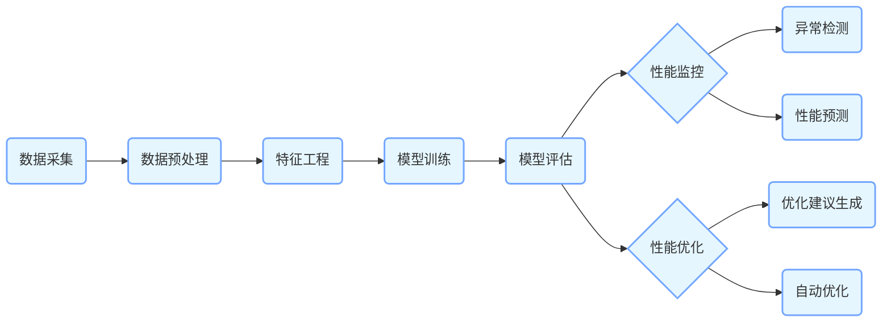

# 程序员如何利用AI进行性能监控与优化

> 关键词：程序员、AI、性能监控、性能优化、机器学习、数据分析、系统性能

> 摘要：本文旨在深入探讨程序员如何借助人工智能技术进行性能监控与优化。随着软件系统的复杂度不断增加，传统的性能监控和优化方法面临诸多挑战，而AI技术凭借其强大的数据处理和分析能力，为解决这些问题提供了新的思路和方法。文章将详细介绍AI在性能监控与优化中的核心概念、算法原理、数学模型，通过项目实战展示具体应用，并分析其实际应用场景，最后推荐相关的工具和资源，总结未来发展趋势与挑战。

## 1. 背景介绍 
### 1.1 目的和范围
随着信息技术的飞速发展，软件系统的规模和复杂度日益增加，性能问题成为影响系统稳定性、用户体验和业务效率的关键因素。传统的性能监控和优化方法往往依赖于人工经验和规则，难以应对复杂多变的系统环境和海量的数据。人工智能技术的出现为性能监控与优化带来了新的机遇，它可以自动分析系统运行数据，发现潜在的性能问题，并提供优化建议。本文的目的是帮助程序员了解如何利用AI技术进行性能监控与优化，涵盖了从核心概念到实际应用的各个方面，包括算法原理、数学模型、项目实战等内容。

### 1.2 预期读者
本文主要面向程序员、软件工程师、系统管理员以及对性能监控与优化和AI技术感兴趣的技术人员。无论是有一定编程基础的初学者，还是经验丰富的专业人士，都可以从本文中获取有用的信息和技术指导。

### 1.3 文档结构概述
本文将按照以下结构进行组织：首先介绍相关的背景知识和术语，然后阐述AI在性能监控与优化中的核心概念和联系，接着详细讲解核心算法原理和具体操作步骤，包括使用Python代码进行示例。之后介绍相关的数学模型和公式，并通过举例说明其应用。通过项目实战展示如何在实际开发中利用AI进行性能监控与优化，分析实际应用场景，推荐相关的工具和资源。最后总结未来发展趋势与挑战，并提供常见问题的解答和扩展阅读参考资料。

### 1.4 术语表
#### 1.4.1 核心术语定义
- **性能监控**：对系统或软件的各项性能指标进行实时或定期的测量和记录，以了解系统的运行状态和性能表现。
- **性能优化**：通过对系统或软件的性能分析，采取相应的措施来提高系统的性能，如减少响应时间、提高吞吐量等。
- **人工智能（AI）**：研究如何使计算机模拟人类的智能行为，包括学习、推理、决策等能力。
- **机器学习**：人工智能的一个分支，通过让计算机从数据中自动学习模式和规律，从而进行预测和决策。
- **深度学习**：一种基于人工神经网络的机器学习方法，具有强大的特征提取和模式识别能力。

#### 1.4.2 相关概念解释
- **数据采集**：从系统或软件中收集各种性能数据，如CPU使用率、内存使用率、网络带宽等。
- **数据预处理**：对采集到的数据进行清洗、转换和归一化等操作，以提高数据的质量和可用性。
- **特征工程**：从原始数据中提取有意义的特征，用于机器学习模型的训练和预测。
- **模型训练**：使用预处理后的数据对机器学习模型进行训练，使其学习数据中的模式和规律。
- **模型评估**：使用测试数据对训练好的模型进行评估，以衡量模型的性能和准确性。

#### 1.4.3 缩略词列表
- **CPU**：Central Processing Unit，中央处理器
- **GPU**：Graphics Processing Unit，图形处理器
- **RAM**：Random Access Memory，随机存取存储器
- **I/O**：Input/Output，输入/输出
- **ML**：Machine Learning，机器学习
- **DL**：Deep Learning，深度学习

## 2. 核心概念与联系 

### 2.1 性能监控与优化的基本概念
性能监控是指对系统或软件的各项性能指标进行实时或定期的测量和记录，以了解系统的运行状态和性能表现。常见的性能指标包括CPU使用率、内存使用率、磁盘I/O、网络带宽、响应时间等。通过对这些指标的监控，可以及时发现系统的性能瓶颈和潜在问题。

性能优化则是在性能监控的基础上，通过对系统或软件的性能分析，采取相应的措施来提高系统的性能。优化措施可以包括硬件升级、代码优化、算法改进、配置调整等。性能优化的目标是提高系统的响应速度、吞吐量、可靠性和可扩展性。

### 2.2 AI在性能监控与优化中的应用
AI技术在性能监控与优化中具有重要的应用价值。通过机器学习和深度学习算法，可以对海量的性能数据进行分析和挖掘，发现数据中的模式和规律，从而实现对系统性能的预测和优化。

在性能监控方面，AI可以自动识别系统的异常行为和性能瓶颈，及时发出警报。例如，通过对历史性能数据的学习，机器学习模型可以预测系统在未来某个时刻的性能指标，如果实际指标与预测值偏差较大，则可能表示系统出现了异常。

在性能优化方面，AI可以根据系统的性能数据和用户的需求，自动生成优化建议。例如，通过对不同配置下系统性能的分析，机器学习模型可以推荐最优的配置参数，以提高系统的性能。

### 2.3 核心概念的架构示意图


该架构示意图展示了利用AI进行性能监控与优化的主要步骤和流程。首先，从系统中采集性能数据，然后对数据进行预处理和特征工程，接着使用处理后的数据对机器学习模型进行训练和评估。训练好的模型可以用于性能监控和优化，包括异常检测、性能预测、优化建议生成和自动优化等功能。

## 3. 核心算法原理 & 具体操作步骤 

### 3.1 异常检测算法 - 基于孤立森林（Isolation Forest）
孤立森林是一种用于异常检测的无监督学习算法，它通过构建随机森林来识别数据中的异常点。其基本思想是，异常点在数据集中是孤立的，因此更容易被随机划分到较小的子树中。

#### 3.1.1 算法原理
孤立森林的核心是构建多棵孤立树（Isolation Tree），每棵孤立树都是通过随机选择一个特征和一个分割点，将数据集划分为两个子集，然后递归地对每个子集进行划分，直到每个子集只有一个样本或达到最大树深。在构建好孤立树后，对于一个新的样本，计算它在每棵孤立树中的路径长度，路径长度越短，说明该样本越可能是异常点。

#### 3.1.2 Python代码实现
```python
import numpy as np
from sklearn.ensemble import IsolationForest

# 生成示例数据
np.random.seed(42)
X = np.concatenate([np.random.normal(loc=0, scale=1, size=(100, 2)),
                    np.random.normal(loc=10, scale=1, size=(10, 2))])

# 创建孤立森林模型
clf = IsolationForest(contamination=0.1)

# 训练模型
clf.fit(X)

# 预测异常点
y_pred = clf.predict(X)

# 输出异常点的索引
anomaly_indices = np.where(y_pred == -1)[0]
print("异常点的索引:", anomaly_indices)
```
#### 3.1.3 具体操作步骤
1. **数据准备**：收集系统的性能数据，并将其转换为适合机器学习模型输入的格式。
2. **模型创建**：使用`sklearn.ensemble.IsolationForest`类创建孤立森林模型，并设置相关参数，如`contamination`表示异常点的比例。
3. **模型训练**：使用准备好的数据对模型进行训练。
4. **异常点预测**：使用训练好的模型对新的数据进行预测，输出异常点的索引。

### 3.2 性能预测算法 - 基于长短期记忆网络（LSTM）
长短期记忆网络（LSTM）是一种特殊的循环神经网络（RNN），它可以处理序列数据中的长期依赖关系，因此非常适合用于性能预测。

#### 3.2.1 算法原理
LSTM的核心是其特殊的细胞结构，包括输入门、遗忘门和输出门。输入门控制新的输入信息的进入，遗忘门控制之前的记忆信息的保留或丢弃，输出门控制当前细胞状态的输出。通过这些门的控制，LSTM可以有效地处理序列数据中的长期依赖关系。

#### 3.2.2 Python代码实现
```python
import numpy as np
import pandas as pd
from keras.models import Sequential
from keras.layers import LSTM, Dense

# 生成示例数据
data = pd.Series(np.sin(np.arange(0, 100, 0.1)))
X = []
y = []
for i in range(len(data) - 10):
    X.append(data[i:i+10].values)
    y.append(data[i+10])
X = np.array(X)
y = np.array(y)

# 调整数据形状以适应LSTM输入
X = np.reshape(X, (X.shape[0], X.shape[1], 1))

# 创建LSTM模型
model = Sequential()
model.add(LSTM(50, input_shape=(10, 1)))
model.add(Dense(1))
model.compile(loss='mean_squared_error', optimizer='adam')

# 训练模型
model.fit(X, y, epochs=100, batch_size=32)

# 预测未来值
last_sequence = data[-10:].values
last_sequence = np.reshape(last_sequence, (1, 10, 1))
predicted_value = model.predict(last_sequence)
print("预测值:", predicted_value)
```
#### 3.2.3 具体操作步骤
1. **数据准备**：收集系统的性能数据，并将其转换为适合LSTM模型输入的序列数据。
2. **数据预处理**：对序列数据进行归一化处理，以提高模型的训练效果。
3. **模型创建**：使用`keras.models.Sequential`类创建LSTM模型，并添加LSTM层和全连接层。
4. **模型编译**：设置模型的损失函数和优化器。
5. **模型训练**：使用准备好的数据对模型进行训练。
6. **性能预测**：使用训练好的模型对未来的性能指标进行预测。

## 4. 数学模型和公式 & 详细讲解 & 举例说明 

### 4.1 孤立森林的数学模型
#### 4.1.1 孤立树的构建
孤立树的构建过程可以用递归的方式表示。设数据集为 $D$，特征集为 $F$，在每一步中，随机选择一个特征 $f \in F$ 和一个分割点 $p$，将数据集 $D$ 划分为两个子集 $D_1$ 和 $D_2$，其中 $D_1 = \{x \in D | x[f] < p\}$，$D_2 = \{x \in D | x[f] \geq p\}$。然后递归地对 $D_1$ 和 $D_2$ 进行划分，直到每个子集只有一个样本或达到最大树深。

#### 4.1.2 路径长度的计算
对于一个样本 $x$，在孤立树 $T$ 中的路径长度 $h(x)$ 可以通过以下公式计算：
$$h(x) = e + c(T_{size})$$
其中 $e$ 是样本 $x$ 在树 $T$ 中从根节点到叶子节点的边数，$T_{size}$ 是叶子节点所在子树的样本数量，$c(T_{size})$ 是一个修正因子，定义为：
$$c(n) = 2H(n - 1) - \frac{2(n - 1)}{n}$$
其中 $H(n)$ 是调和数，$H(n) = \sum_{i = 1}^{n} \frac{1}{i}$。

#### 4.1.3 异常得分的计算
对于一个样本 $x$，其异常得分 $s(x, n)$ 可以通过以下公式计算：
$$s(x, n) = 2^{-\frac{E(h(x))}{c(n)}}$$
其中 $E(h(x))$ 是样本 $x$ 在所有孤立树中的平均路径长度，$n$ 是数据集的样本数量。异常得分越接近1，说明该样本越可能是异常点。

### 4.2 LSTM的数学模型
#### 4.2.1 输入门、遗忘门和输出门的计算
LSTM的输入门 $i_t$、遗忘门 $f_t$ 和输出门 $o_t$ 可以通过以下公式计算：
$$i_t = \sigma(W_{ii}x_t + W_{hi}h_{t - 1} + b_i)$$
$$f_t = \sigma(W_{if}x_t + W_{hf}h_{t - 1} + b_f)$$
$$o_t = \sigma(W_{io}x_t + W_{ho}h_{t - 1} + b_o)$$
其中 $x_t$ 是当前时刻的输入，$h_{t - 1}$ 是上一时刻的隐藏状态，$W_{ii}$、$W_{hi}$、$W_{if}$、$W_{hf}$、$W_{io}$、$W_{ho}$ 是权重矩阵，$b_i$、$b_f$、$b_o$ 是偏置向量，$\sigma$ 是 sigmoid 函数。

#### 4.2.2 细胞状态的更新
LSTM的细胞状态 $C_t$ 可以通过以下公式更新：
$$\tilde{C}_t = \tanh(W_{ic}x_t + W_{hc}h_{t - 1} + b_c)$$
$$C_t = f_t \odot C_{t - 1} + i_t \odot \tilde{C}_t$$
其中 $\tilde{C}_t$ 是候选细胞状态，$\tanh$ 是双曲正切函数，$\odot$ 是逐元素乘法。

#### 4.2.3 隐藏状态的更新
LSTM的隐藏状态 $h_t$ 可以通过以下公式更新：
$$h_t = o_t \odot \tanh(C_t)$$

### 4.3 举例说明
#### 4.3.1 孤立森林的应用
假设我们有一个数据集 $D = \{[1, 2], [2, 3], [10, 15], [11, 16]\}$，我们使用孤立森林算法来检测其中的异常点。首先，我们构建多棵孤立树，然后计算每个样本在所有孤立树中的平均路径长度。对于样本 $[10, 15]$ 和 $[11, 16]$，它们的平均路径长度较短，因此异常得分较高，被判定为异常点。

#### 4.3.2 LSTM的应用
假设我们要预测一个时间序列的未来值，如股票价格、系统性能指标等。我们可以使用LSTM模型来处理这个问题。首先，我们将时间序列数据转换为适合LSTM模型输入的序列数据，然后训练LSTM模型。训练好的模型可以根据历史数据预测未来的时间序列值。

## 5. 项目实战：代码实际案例和详细解释说明 

### 5.1  开发环境搭建
#### 5.1.1 安装Python
首先，确保你已经安装了Python 3.x版本。可以从Python官方网站（https://www.python.org/downloads/） 下载并安装Python。

#### 5.1.2 安装必要的库
使用以下命令安装必要的库：
```sh
pip install numpy pandas scikit-learn keras tensorflow
```
其中，`numpy` 用于数值计算，`pandas` 用于数据处理，`scikit-learn` 用于机器学习算法，`keras` 和 `tensorflow` 用于深度学习模型的构建和训练。

### 5.2  源代码详细实现和代码解读
#### 5.2.1 数据采集和预处理
```python
import pandas as pd
import numpy as np

# 读取性能数据文件
data = pd.read_csv('performance_data.csv')

# 数据清洗
data = data.dropna()

# 特征选择
features = ['cpu_usage', 'memory_usage', 'network_bandwidth']
X = data[features].values

# 数据归一化
from sklearn.preprocessing import MinMaxScaler
scaler = MinMaxScaler()
X = scaler.fit_transform(X)
```
代码解读：首先，使用`pandas`库读取性能数据文件。然后，对数据进行清洗，删除包含缺失值的行。接着，选择需要的特征，并将其转换为`numpy`数组。最后，使用`MinMaxScaler`对数据进行归一化处理，将数据缩放到0到1的范围内。

#### 5.2.2 异常检测
```python
from sklearn.ensemble import IsolationForest

# 创建孤立森林模型
clf = IsolationForest(contamination=0.1)

# 训练模型
clf.fit(X)

# 预测异常点
y_pred = clf.predict(X)

# 输出异常点的索引
anomaly_indices = np.where(y_pred == -1)[0]
print("异常点的索引:", anomaly_indices)
```
代码解读：使用`sklearn.ensemble.IsolationForest`类创建孤立森林模型，并设置异常点的比例为0.1。然后，使用预处理后的数据对模型进行训练。最后，使用训练好的模型对数据进行预测，输出异常点的索引。

#### 5.2.3 性能预测
```python
from keras.models import Sequential
from keras.layers import LSTM, Dense

# 准备时间序列数据
sequence_length = 10
X_sequence = []
y_sequence = []
for i in range(len(X) - sequence_length):
    X_sequence.append(X[i:i+sequence_length])
    y_sequence.append(X[i+sequence_length])
X_sequence = np.array(X_sequence)
y_sequence = np.array(y_sequence)

# 创建LSTM模型
model = Sequential()
model.add(LSTM(50, input_shape=(sequence_length, len(features))))
model.add(Dense(len(features)))
model.compile(loss='mean_squared_error', optimizer='adam')

# 训练模型
model.fit(X_sequence, y_sequence, epochs=100, batch_size=32)

# 预测未来性能
last_sequence = X[-sequence_length:].reshape(1, sequence_length, len(features))
predicted_performance = model.predict(last_sequence)
print("预测的性能:", scaler.inverse_transform(predicted_performance))
```
代码解读：首先，将预处理后的数据转换为适合LSTM模型输入的时间序列数据。然后，使用`keras.models.Sequential`类创建LSTM模型，并添加LSTM层和全连接层。接着，编译模型，设置损失函数和优化器。使用时间序列数据对模型进行训练。最后，使用训练好的模型对未来的性能指标进行预测，并将预测结果反归一化。

### 5.3  代码解读与分析
#### 5.3.1 数据采集和预处理
数据采集和预处理是性能监控与优化的重要步骤。通过数据清洗，可以去除数据中的噪声和缺失值，提高数据的质量。特征选择可以选择与性能相关的重要特征，减少数据的维度。数据归一化可以将不同范围的数据缩放到相同的范围内，提高模型的训练效果。

#### 5.3.2 异常检测
孤立森林算法是一种有效的异常检测算法，它可以在无监督的情况下识别数据中的异常点。通过设置异常点的比例，可以控制异常检测的灵敏度。异常检测可以帮助我们及时发现系统的异常行为，采取相应的措施进行处理。

#### 5.3.3 性能预测
LSTM模型可以处理序列数据中的长期依赖关系，因此非常适合用于性能预测。通过训练LSTM模型，可以根据历史性能数据预测未来的性能指标。性能预测可以帮助我们提前做好资源分配和优化，提高系统的性能和稳定性。

## 6. 实际应用场景 
### 6.1 云计算环境中的性能监控与优化
在云计算环境中，多个用户共享计算资源，系统的性能受到多种因素的影响，如用户负载、资源竞争等。利用AI技术进行性能监控与优化可以实时监测云服务器的性能指标，如CPU使用率、内存使用率、网络带宽等，及时发现性能瓶颈和异常行为，并自动调整资源分配，提高云计算环境的性能和效率。

### 6.2 大数据处理系统中的性能优化
大数据处理系统通常需要处理海量的数据，数据的存储、传输和计算效率对系统的性能至关重要。利用AI技术可以对大数据处理系统的性能进行监控和优化，如优化数据存储策略、调整计算资源分配、改进数据处理算法等，提高大数据处理系统的性能和吞吐量。

### 6.3 移动应用的性能优化
移动应用的性能直接影响用户体验，如响应时间、卡顿现象等。利用AI技术可以对移动应用的性能进行监控和优化，如分析用户行为数据、优化代码结构、减少内存占用等，提高移动应用的性能和稳定性。

### 6.4 工业控制系统中的性能监控与优化
在工业控制系统中，系统的性能和稳定性直接关系到生产安全和效率。利用AI技术可以对工业控制系统的性能进行实时监控和优化，如监测设备状态、预测设备故障、优化生产流程等，提高工业控制系统的性能和可靠性。

## 7. 工具和资源推荐
### 7.1 学习资源推荐
#### 7.1.1 书籍推荐
- 《Python机器学习》：介绍了Python在机器学习中的应用，包括各种机器学习算法的原理和实现。
- 《深度学习》：深度学习领域的经典著作，详细介绍了深度学习的基本原理和算法。
- 《高性能计算》：介绍了高性能计算的基本概念和技术，包括并行计算、分布式计算等。

#### 7.1.2 在线课程
- Coursera上的“机器学习”课程：由斯坦福大学教授Andrew Ng讲授，是机器学习领域的经典课程。
- edX上的“深度学习”课程：介绍了深度学习的基本原理和应用，包括神经网络、卷积神经网络、循环神经网络等。
- Udemy上的“Python数据分析”课程：介绍了Python在数据分析中的应用，包括数据处理、数据可视化、机器学习等。

#### 7.1.3 技术博客和网站
- Medium：一个技术博客平台，有很多关于AI、机器学习、性能优化等方面的文章。
- Towards Data Science：专注于数据科学和机器学习领域的技术博客，有很多高质量的文章和教程。
- Stack Overflow：一个技术问答社区，有很多关于编程和技术问题的解答。

### 7.2 开发工具框架推荐
#### 7.2.1 IDE和编辑器
- PyCharm：一款专门为Python开发设计的集成开发环境，具有代码编辑、调试、版本控制等功能。
- Jupyter Notebook：一个交互式的笔记本环境，适合进行数据探索、模型训练和可视化等工作。
- Visual Studio Code：一款轻量级的代码编辑器，支持多种编程语言和插件扩展。

#### 7.2.2 调试和性能分析工具
- TensorBoard：TensorFlow的可视化工具，可以用于可视化模型训练过程、性能指标等。
- Py-Spy：一个Python性能分析工具，可以实时监测Python程序的性能瓶颈。
- cProfile：Python内置的性能分析模块，可以用于分析Python程序的性能。

#### 7.2.3 相关框架和库
- TensorFlow：一个开源的深度学习框架，支持多种深度学习模型的构建和训练。
- PyTorch：另一个开源的深度学习框架，具有动态计算图和易于使用的特点。
- Scikit-learn：一个简单易用的机器学习库，提供了多种机器学习算法和工具。

### 7.3 相关论文著作推荐
#### 7.3.1 经典论文
- “Isolation Forest”：介绍了孤立森林算法的原理和应用。
- “Long Short-Term Memory”：介绍了长短期记忆网络（LSTM）的原理和应用。
- “Deep Learning”：深度学习领域的经典综述论文，介绍了深度学习的发展历程和主要方法。

#### 7.3.2 最新研究成果
- 关注顶级学术会议如NeurIPS、ICML、CVPR等，这些会议上会有很多关于AI和性能优化的最新研究成果。
- 查阅相关的学术期刊如Journal of Artificial Intelligence Research、IEEE Transactions on Neural Networks and Learning Systems等，了解最新的研究进展。

#### 7.3.3 应用案例分析
- 研究一些实际应用案例，如Google、Facebook等公司在性能监控与优化方面的实践经验，了解如何将AI技术应用到实际场景中。

## 8. 总结：未来发展趋势与挑战
### 8.1 未来发展趋势
- **智能化程度不断提高**：未来，AI技术在性能监控与优化中的应用将更加智能化，能够自动学习和适应不同的系统环境和业务需求，提供更加精准的性能预测和优化建议。
- **多模态数据融合**：随着传感器技术的发展，系统的性能数据将越来越多样化，包括文本、图像、视频等多模态数据。未来的性能监控与优化系统将能够融合多模态数据，提高性能分析的准确性和全面性。
- **与边缘计算和物联网的结合**：边缘计算和物联网的发展将使得数据的采集和处理更加分散化和实时化。未来的性能监控与优化系统将与边缘计算和物联网相结合，实现对分布式系统的实时性能监控和优化。
- **自动化运维**：利用AI技术实现自动化运维将成为未来的发展趋势。通过自动检测和诊断系统的性能问题，并自动采取相应的优化措施，提高系统的运维效率和可靠性。

### 8.2 挑战
- **数据质量和安全问题**：AI技术的应用依赖于大量的高质量数据。然而，在实际应用中，数据的质量和安全问题往往是一个挑战。数据可能存在噪声、缺失值、错误等问题，同时数据的安全和隐私也需要得到保障。
- **模型的可解释性**：深度学习模型通常是黑盒模型，其决策过程难以解释。在性能监控与优化中，模型的可解释性非常重要，因为我们需要了解模型为什么做出这样的决策，以便采取相应的措施。
- **计算资源和时间成本**：AI模型的训练和推理通常需要大量的计算资源和时间。在实际应用中，如何在有限的计算资源和时间内实现高效的性能监控与优化是一个挑战。
- **人才短缺**：AI技术的应用需要具备相关专业知识和技能的人才。目前，AI领域的人才短缺是一个普遍存在的问题，如何培养和吸引更多的AI人才是未来发展的关键。

## 9. 附录：常见问题与解答
### 9.1 如何选择合适的AI算法进行性能监控与优化？
选择合适的AI算法需要考虑多个因素，如数据的特点、问题的类型、性能要求等。如果是异常检测问题，可以选择孤立森林、One-Class SVM等无监督学习算法；如果是性能预测问题，可以选择LSTM、GRU等深度学习算法。同时，还可以通过实验和比较不同算法的性能，选择最适合的算法。

### 9.2 如何处理性能数据中的缺失值和噪声？
处理性能数据中的缺失值和噪声可以采用以下方法：对于缺失值，可以使用均值、中位数、插值等方法进行填充；对于噪声，可以使用滤波、平滑等方法进行处理。此外，还可以使用数据清洗和预处理技术，去除数据中的异常值和错误数据。

### 9.3 如何评估AI模型的性能？
评估AI模型的性能可以使用多种指标，如准确率、召回率、F1值、均方误差、平均绝对误差等。具体选择哪种指标需要根据问题的类型和性能要求来决定。同时，还可以使用交叉验证、留一法等方法对模型进行评估，提高评估结果的准确性。

### 9.4 如何提高AI模型的训练效率？
提高AI模型的训练效率可以采用以下方法：使用GPU加速训练过程；优化模型的结构和参数，减少模型的复杂度；使用数据增强技术，增加训练数据的多样性；采用分布式训练，利用多个计算节点并行训练模型。

## 10. 扩展阅读 & 参考资料
- 《人工智能：一种现代的方法》
- 《Python深度学习》
- 《机器学习实战》
- https://www.tensorflow.org/
- https://pytorch.org/
- https://scikit-learn.org/
- https://arxiv.org/
- https://ieeexplore.ieee.org/