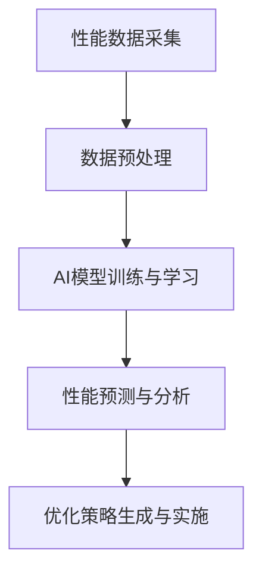

# 程序员如何利用AI进行智能性能优化

> 关键词：程序员、AI、智能性能优化、算法、机器学习、深度学习、性能分析

> 摘要：本文旨在探讨程序员如何利用AI技术进行智能性能优化。随着计算机系统和软件应用的日益复杂，传统的性能优化方法面临着诸多挑战。AI技术的发展为性能优化提供了新的思路和方法。文章将深入介绍AI在性能优化中的核心概念、算法原理、数学模型，通过项目实战案例展示具体实现过程，分析实际应用场景，推荐相关工具和资源，并对未来发展趋势与挑战进行总结，帮助程序员更好地掌握利用AI进行智能性能优化的技术。

## 1. 背景介绍 
### 1.1 目的和范围
随着软件系统规模的不断扩大和复杂度的增加，性能优化成为了软件开发过程中至关重要的环节。传统的性能优化方法往往依赖于程序员的经验和手动调优，效率较低且难以应对复杂多变的系统环境。AI技术的出现为性能优化带来了新的机遇，它可以自动分析系统性能数据，发现性能瓶颈，并提供优化建议。本文的目的是详细介绍程序员如何利用AI技术进行智能性能优化，范围涵盖从基本概念到实际应用的各个方面。

### 1.2 预期读者
本文主要面向广大程序员、软件工程师、系统架构师以及对AI和性能优化感兴趣的技术人员。无论是初学者还是有一定经验的专业人士，都可以从本文中获取有价值的信息和技术指导。

### 1.3 文档结构概述
本文将按照以下结构进行组织：首先介绍核心概念与联系，包括AI和性能优化的基本原理以及它们之间的关系；接着详细讲解核心算法原理和具体操作步骤，并用Python源代码进行阐述；然后介绍数学模型和公式，并通过举例说明；之后通过项目实战展示代码实际案例和详细解释；再分析实际应用场景；推荐相关工具和资源；最后总结未来发展趋势与挑战，并提供常见问题与解答以及扩展阅读和参考资料。

### 1.4 术语表
#### 1.4.1 核心术语定义
- **AI（Artificial Intelligence）**：人工智能，是一门研究如何使计算机能够模拟人类智能的学科，包括机器学习、深度学习、自然语言处理等多个领域。
- **性能优化**：通过对系统或软件的各个方面进行调整和改进，以提高其运行效率、响应速度、吞吐量等性能指标的过程。
- **机器学习（Machine Learning）**：AI的一个重要分支，它通过让计算机从数据中学习模式和规律，从而实现预测和决策等任务。
- **深度学习（Deep Learning）**：一种基于神经网络的机器学习方法，通过构建多层神经网络来学习数据的复杂特征和模式。
- **性能瓶颈**：系统或软件中导致性能下降的关键因素或环节。

#### 1.4.2 相关概念解释
- **监督学习**：机器学习的一种类型，在这种学习方式中，模型通过学习带有标签的训练数据来进行预测。例如，给定一组房屋的特征（面积、房间数等）和对应的价格，模型学习如何根据房屋特征预测价格。
- **无监督学习**：模型学习的是无标签的数据，目的是发现数据中的内在结构和模式。例如，对客户数据进行聚类分析，将具有相似特征的客户分为不同的群体。
- **强化学习**：智能体通过与环境进行交互，根据环境反馈的奖励信号来学习最优的行为策略。例如，训练机器人在迷宫中找到出口，每走一步都会得到相应的奖励或惩罚，机器人通过不断尝试来学习最佳的行走路径。

#### 1.4.3 缩略词列表
- **CPU（Central Processing Unit）**：中央处理器
- **GPU（Graphics Processing Unit）**：图形处理器
- **RAM（Random Access Memory）**：随机存取存储器
- **I/O（Input/Output）**：输入/输出

## 2. 核心概念与联系 

### 2.1 AI与性能优化的基本原理
AI的核心思想是让计算机能够模拟人类的智能行为，通过学习和推理来解决各种问题。在性能优化领域，AI可以通过分析系统的性能数据，如CPU使用率、内存占用、I/O吞吐量等，来发现性能瓶颈，并提供相应的优化策略。

性能优化的目标是提高系统的性能指标，如响应时间、吞吐量、资源利用率等。传统的性能优化方法通常基于经验和规则，而AI技术可以通过数据驱动的方式，自动发现潜在的性能问题，并提供更精准的优化方案。

### 2.2 核心概念的联系
AI技术在性能优化中的应用主要基于以下几个方面的联系：
- **数据采集与分析**：通过收集系统的性能数据，AI可以对这些数据进行分析，发现其中的模式和规律。例如，通过分析CPU使用率的时间序列数据，AI可以预测系统在未来某个时刻的CPU负载情况。
- **模型训练与预测**：利用机器学习和深度学习算法，对采集到的数据进行训练，构建性能预测模型。这些模型可以根据当前的系统状态，预测系统的性能指标，如响应时间、吞吐量等。
- **优化策略生成**：根据性能预测结果，AI可以生成相应的优化策略。例如，如果预测到系统的CPU负载将超过阈值，AI可以建议采取增加CPU资源、优化算法等措施来降低CPU负载。

### 2.3 文本示意图
```plaintext
           性能数据采集
                 |
                 v
            数据预处理
                 |
                 v
         AI模型训练与学习
                 |
                 v
       性能预测与分析
                 |
                 v
     优化策略生成与实施
```

### 2.4 Mermaid流程图


## 3. 核心算法原理 & 具体操作步骤 

### 3.1 机器学习算法在性能优化中的应用
机器学习算法可以用于性能预测和优化策略生成。常见的机器学习算法包括线性回归、决策树、随机森林、支持向量机等。下面以线性回归为例，介绍其在性能优化中的应用。

#### 3.1.1 线性回归原理
线性回归是一种用于建立自变量和因变量之间线性关系的机器学习算法。其基本模型可以表示为：

$$y = \theta_0 + \theta_1x_1 + \theta_2x_2 + \cdots + \theta_nx_n + \epsilon$$

其中，$y$ 是因变量，$x_1, x_2, \cdots, x_n$ 是自变量，$\theta_0, \theta_1, \theta_2, \cdots, \theta_n$ 是模型的参数，$\epsilon$ 是误差项。

线性回归的目标是通过最小化误差平方和来估计模型的参数 $\theta$。误差平方和的表达式为：

$$J(\theta) = \frac{1}{2m}\sum_{i=1}^{m}(h_{\theta}(x^{(i)}) - y^{(i)})^2$$

其中，$m$ 是样本数量，$h_{\theta}(x^{(i)})$ 是模型对第 $i$ 个样本的预测值，$y^{(i)}$ 是第 $i$ 个样本的真实值。

#### 3.1.2 Python代码实现
```python
import numpy as np
from sklearn.linear_model import LinearRegression

# 生成示例数据
X = np.array([[1], [2], [3], [4], [5]])
y = np.array([2, 4, 6, 8, 10])

# 创建线性回归模型
model = LinearRegression()

# 训练模型
model.fit(X, y)

# 进行预测
new_X = np.array([[6]])
prediction = model.predict(new_X)

print("预测结果:", prediction)
```

### 3.2 深度学习算法在性能优化中的应用
深度学习算法在处理复杂的性能数据和发现深层次的模式方面具有优势。常见的深度学习算法包括神经网络、卷积神经网络（CNN）、循环神经网络（RNN）等。下面以简单的神经网络为例，介绍其在性能优化中的应用。

#### 3.2.1 神经网络原理
神经网络由输入层、隐藏层和输出层组成。每个神经元接收输入信号，经过加权求和和激活函数处理后，输出结果。神经网络的训练过程是通过反向传播算法来调整神经元之间的权重，以最小化预测误差。

#### 3.2.2 Python代码实现
```python
import numpy as np
import tensorflow as tf
from tensorflow.keras.models import Sequential
from tensorflow.keras.layers import Dense

# 生成示例数据
X = np.array([[1], [2], [3], [4], [5]])
y = np.array([2, 4, 6, 8, 10])

# 创建神经网络模型
model = Sequential()
model.add(Dense(10, input_dim=1, activation='relu'))
model.add(Dense(1))

# 编译模型
model.compile(optimizer='adam', loss='mse')

# 训练模型
model.fit(X, y, epochs=100, batch_size=1)

# 进行预测
new_X = np.array([[6]])
prediction = model.predict(new_X)

print("预测结果:", prediction)
```

### 3.3 具体操作步骤
1. **数据采集**：收集系统的性能数据，包括CPU使用率、内存占用、I/O吞吐量等。可以使用系统监控工具、日志记录等方式进行数据采集。
2. **数据预处理**：对采集到的数据进行清洗、归一化、特征提取等处理，以提高数据的质量和可用性。
3. **模型选择与训练**：根据数据的特点和性能优化的目标，选择合适的AI模型，如线性回归、神经网络等。使用预处理后的数据对模型进行训练。
4. **性能预测**：使用训练好的模型对系统的性能指标进行预测。
5. **优化策略生成与实施**：根据性能预测结果，生成相应的优化策略，并实施这些策略。例如，如果预测到系统的CPU负载将超过阈值，可以采取增加CPU资源、优化算法等措施。

## 4. 数学模型和公式 & 详细讲解 & 举例说明 

### 4.1 线性回归的数学模型和公式
线性回归的数学模型可以表示为：

$$y = \theta_0 + \theta_1x_1 + \theta_2x_2 + \cdots + \theta_nx_n + \epsilon$$

其中，$y$ 是因变量，$x_1, x_2, \cdots, x_n$ 是自变量，$\theta_0, \theta_1, \theta_2, \cdots, \theta_n$ 是模型的参数，$\epsilon$ 是误差项。

线性回归的目标是通过最小化误差平方和来估计模型的参数 $\theta$。误差平方和的表达式为：

$$J(\theta) = \frac{1}{2m}\sum_{i=1}^{m}(h_{\theta}(x^{(i)}) - y^{(i)})^2$$

其中，$m$ 是样本数量，$h_{\theta}(x^{(i)})$ 是模型对第 $i$ 个样本的预测值，$y^{(i)}$ 是第 $i$ 个样本的真实值。

为了最小化 $J(\theta)$，可以使用梯度下降算法。梯度下降算法的更新公式为：

$$\theta_j := \theta_j - \alpha\frac{\partial J(\theta)}{\partial \theta_j}$$

其中，$\alpha$ 是学习率，$\frac{\partial J(\theta)}{\partial \theta_j}$ 是 $J(\theta)$ 关于 $\theta_j$ 的偏导数。

### 4.2 举例说明
假设我们有一个简单的线性回归问题，数据集如下：

| $x$ | $y$ |
|---|---|
| 1 | 2 |
| 2 | 4 |
| 3 | 6 |
| 4 | 8 |
| 5 | 10 |

我们的目标是建立一个线性回归模型来预测 $y$ 的值。

首先，我们可以将数据集表示为矩阵形式：

$$X = \begin{bmatrix} 1 & 1 \\ 1 & 2 \\ 1 & 3 \\ 1 & 4 \\ 1 & 5 \end{bmatrix}, y = \begin{bmatrix} 2 \\ 4 \\ 6 \\ 8 \\ 10 \end{bmatrix}$$

然后，我们可以使用正规方程来求解模型的参数 $\theta$：

$$\theta = (X^TX)^{-1}X^Ty$$

具体计算过程如下：

$$X^T = \begin{bmatrix} 1 & 1 & 1 & 1 & 1 \\ 1 & 2 & 3 & 4 & 5 \end{bmatrix}$$

$$X^TX = \begin{bmatrix} 5 & 15 \\ 15 & 55 \end{bmatrix}$$

$$(X^TX)^{-1} = \frac{1}{5\times55 - 15\times15}\begin{bmatrix} 55 & -15 \\ -15 & 5 \end{bmatrix} = \begin{bmatrix} 1.1 & -0.3 \\ -0.3 & 0.1 \end{bmatrix}$$

$$X^Ty = \begin{bmatrix} 30 \\ 110 \end{bmatrix}$$

$$\theta = (X^TX)^{-1}X^Ty = \begin{bmatrix} 1.1 & -0.3 \\ -0.3 & 0.1 \end{bmatrix}\begin{bmatrix} 30 \\ 110 \end{bmatrix} = \begin{bmatrix} 0 \\ 2 \end{bmatrix}$$

因此，我们得到的线性回归模型为：

$$y = 0 + 2x$$

### 4.3 神经网络的数学模型和公式
神经网络的基本单元是神经元，其数学模型可以表示为：

$$z = \sum_{i=1}^{n}w_ix_i + b$$

$$a = f(z)$$

其中，$z$ 是神经元的输入加权和，$w_i$ 是输入 $x_i$ 的权重，$b$ 是偏置，$a$ 是神经元的输出，$f$ 是激活函数。

常见的激活函数包括Sigmoid函数、ReLU函数等。

Sigmoid函数的表达式为：

$$f(z) = \frac{1}{1 + e^{-z}}$$

ReLU函数的表达式为：

$$f(z) = \max(0, z)$$

神经网络的训练过程是通过反向传播算法来调整神经元之间的权重，以最小化预测误差。反向传播算法的核心是计算误差的梯度，并根据梯度更新权重。

## 5. 项目实战：代码实际案例和详细解释说明 

### 5.1  开发环境搭建
本项目使用Python进行开发，需要安装以下库：
- **numpy**：用于数值计算
- **pandas**：用于数据处理
- **scikit-learn**：用于机器学习算法
- **tensorflow**：用于深度学习算法

可以使用以下命令进行安装：

```sh
pip install numpy pandas scikit-learn tensorflow
```

### 5.2  源代码详细实现和代码解读
#### 5.2.1 数据采集与预处理
```python
import pandas as pd
from sklearn.preprocessing import StandardScaler

# 读取性能数据
data = pd.read_csv('performance_data.csv')

# 分离特征和标签
X = data.drop('target', axis=1)
y = data['target']

# 数据归一化
scaler = StandardScaler()
X_scaled = scaler.fit_transform(X)
```
**代码解读**：首先使用 `pandas` 库读取性能数据文件。然后将特征和标签分离，将除 `target` 列以外的列作为特征，`target` 列作为标签。最后使用 `StandardScaler` 对特征数据进行归一化处理，以提高模型的训练效果。

#### 5.2.2 模型训练与预测
```python
from sklearn.linear_model import LinearRegression
from sklearn.model_selection import train_test_split
from sklearn.metrics import mean_squared_error

# 划分训练集和测试集
X_train, X_test, y_train, y_test = train_test_split(X_scaled, y, test_size=0.2, random_state=42)

# 创建线性回归模型
model = LinearRegression()

# 训练模型
model.fit(X_train, y_train)

# 进行预测
y_pred = model.predict(X_test)

# 计算均方误差
mse = mean_squared_error(y_test, y_pred)
print("均方误差:", mse)
```
**代码解读**：使用 `train_test_split` 函数将数据集划分为训练集和测试集，其中测试集占总数据集的20%。然后创建线性回归模型，并使用训练集数据对模型进行训练。接着使用训练好的模型对测试集数据进行预测，并计算预测结果与真实标签之间的均方误差。

#### 5.2.3 优化策略生成
```python
# 假设预测结果超过阈值需要进行优化
threshold = 10
if y_pred[0] > threshold:
    print("建议采取优化措施，如增加资源、优化算法等。")
else:
    print("系统性能正常，无需优化。")
```
**代码解读**：设定一个阈值，如果预测结果超过该阈值，则建议采取优化措施，如增加资源、优化算法等；否则，认为系统性能正常，无需优化。

### 5.3  代码解读与分析
通过上述代码，我们完成了一个简单的性能优化项目。首先进行数据采集与预处理，将原始数据转换为适合模型训练的格式。然后使用线性回归模型进行训练和预测，通过计算均方误差来评估模型的性能。最后根据预测结果生成优化策略。

在实际应用中，可以根据具体需求选择不同的AI模型，如神经网络、随机森林等，以提高性能预测的准确性。同时，还可以对优化策略进行细化和自动化，以实现智能性能优化的目标。

## 6. 实际应用场景 
### 6.1 云计算环境中的性能优化
在云计算环境中，资源的分配和管理是一个关键问题。AI可以通过分析云服务器的性能数据，如CPU使用率、内存占用、网络带宽等，预测服务器的负载情况，并根据预测结果进行资源的动态分配。例如，当预测到某个服务器的负载将超过阈值时，AI可以自动将部分任务迁移到其他空闲的服务器上，以提高整个云环境的性能和资源利用率。

### 6.2 数据库性能优化
数据库是企业信息系统的核心组成部分，其性能直接影响到系统的运行效率。AI可以通过分析数据库的查询日志、性能指标等数据，发现查询瓶颈和性能问题，并提供优化建议。例如，AI可以根据查询的执行时间、资源消耗等信息，自动生成优化的查询语句，或者建议对数据库表进行索引优化。

### 6.3 移动应用性能优化
移动应用的性能直接影响用户体验。AI可以通过分析移动设备的性能数据、用户行为数据等，优化应用的代码和资源管理。例如，AI可以根据用户的使用习惯，预测用户可能访问的页面和功能，提前加载相关的资源，以减少用户的等待时间。同时，AI还可以对应用的代码进行优化，减少内存占用和CPU消耗，提高应用的响应速度。

### 6.4 物联网设备性能优化
物联网设备通常资源有限，需要高效地运行。AI可以通过分析物联网设备的传感器数据、通信数据等，优化设备的能耗和性能。例如，AI可以根据环境条件和设备的工作状态，自动调整设备的工作模式，以降低能耗。同时，AI还可以对设备的通信协议进行优化，提高数据传输的效率和可靠性。

## 7. 工具和资源推荐
### 7.1 学习资源推荐
#### 7.1.1 书籍推荐
- 《机器学习》（周志华）：全面介绍了机器学习的基本概念、算法和应用，是学习机器学习的经典教材。
- 《深度学习》（Ian Goodfellow、Yoshua Bengio、Aaron Courville）：深入讲解了深度学习的原理、算法和实践，是深度学习领域的权威著作。
- 《Python数据分析实战》（Sebastian Raschka）：介绍了如何使用Python进行数据分析和机器学习，通过实际案例帮助读者掌握数据分析的方法和技巧。

#### 7.1.2 在线课程
- Coursera上的“机器学习”课程（Andrew Ng）：由机器学习领域的知名专家Andrew Ng授课，课程内容全面、深入浅出，是学习机器学习的优质课程。
- edX上的“深度学习基础”课程：介绍了深度学习的基本概念、算法和应用，通过实践项目帮助学生掌握深度学习的技能。
- 哔哩哔哩上的“Python人工智能实战教程”：由国内知名的AI专家授课，课程内容丰富、生动有趣，适合初学者学习。

#### 7.1.3 技术博客和网站
- Medium：一个汇集了众多技术专家和开发者的博客平台，上面有很多关于AI和性能优化的优秀文章。
- 机器之心：专注于AI领域的资讯和技术分享，提供了大量的AI技术文章和案例分析。
- 开源中国：国内知名的开源技术社区，上面有很多关于软件开发和性能优化的经验分享和技术文章。

### 7.2 开发工具框架推荐
#### 7.2.1 IDE和编辑器
- PyCharm：一款专业的Python集成开发环境，提供了丰富的代码编辑、调试、测试等功能，适合Python开发。
- Jupyter Notebook：一个交互式的开发环境，支持Python、R等多种编程语言，适合数据分析和机器学习的开发和实验。
- Visual Studio Code：一款轻量级的代码编辑器，支持多种编程语言和插件，具有丰富的扩展功能，适合快速开发和调试。

#### 7.2.2 调试和性能分析工具
- Py-Spy：一个用于Python程序的性能分析工具，可以实时监测Python程序的CPU使用率、函数调用时间等信息，帮助开发者发现性能瓶颈。
- TensorBoard：TensorFlow提供的一个可视化工具，可以用于查看模型的训练过程、性能指标等信息，帮助开发者优化模型。
- Chrome DevTools：一款强大的浏览器调试工具，可以用于分析网页的性能、调试JavaScript代码等，适合Web应用的性能优化。

#### 7.2.3 相关框架和库
- TensorFlow：一个开源的深度学习框架，提供了丰富的深度学习模型和工具，支持多种编程语言，适合大规模的深度学习开发。
- PyTorch：另一个流行的深度学习框架，具有简洁易用的API和高效的计算性能，适合学术研究和快速开发。
- Scikit-learn：一个用于机器学习的Python库，提供了丰富的机器学习算法和工具，适合机器学习的入门和实践。

### 7.3 相关论文著作推荐
#### 7.3.1 经典论文
- “Gradient-Based Learning Applied to Document Recognition”（Yann LeCun、Léon Bottou、Yoshua Bengio、Patrick Haffner）：介绍了卷积神经网络（CNN）在文档识别中的应用，是CNN领域的经典论文。
- “Playing Atari with Deep Reinforcement Learning”（Volodymyr Mnih、Koray Kavukcuoglu、David Silver等）：介绍了深度强化学习在Atari游戏中的应用，开创了深度强化学习的先河。
- “Attention Is All You Need”（Ashish Vaswani、Noam Shazeer、Niki Parmar等）：介绍了Transformer模型，是自然语言处理领域的重要突破。

#### 7.3.2 最新研究成果
- 关注顶级学术会议如NeurIPS、ICML、CVPR等的最新研究成果，了解AI和性能优化领域的最新技术和趋势。
- 查阅知名学术期刊如Journal of Artificial Intelligence Research（JAIR）、Artificial Intelligence等的最新论文，获取前沿的研究成果。

#### 7.3.3 应用案例分析
- 分析各大科技公司的技术博客和开源项目，了解他们在实际应用中如何利用AI进行性能优化。例如，Google的技术博客经常分享他们在搜索、广告等领域的性能优化经验和技术。
- 参考相关的行业报告和案例研究，了解不同行业在AI性能优化方面的实践和应用效果。

## 8. 总结：未来发展趋势与挑战
### 8.1 未来发展趋势
- **智能化程度不断提高**：随着AI技术的不断发展，智能性能优化将变得更加智能化和自动化。未来的系统将能够自动感知性能问题，并自主地采取优化措施，无需人工干预。
- **多领域融合**：AI性能优化将与其他领域如物联网、区块链、量子计算等进行深度融合，创造出更加复杂和高效的系统。例如，在物联网环境中，AI可以通过分析大量的传感器数据，实现对设备的智能管理和性能优化。
- **实时性能优化**：随着实时计算和边缘计算技术的发展，未来的性能优化将更加注重实时性。系统将能够在实时数据的驱动下，快速地进行性能分析和优化，以应对不断变化的环境和需求。
- **个性化优化**：不同的用户和应用场景对性能的需求各不相同。未来的AI性能优化将能够根据用户的个性化需求，提供定制化的优化方案，以提高用户体验和系统性能。

### 8.2 挑战
- **数据质量和隐私问题**：AI性能优化依赖于大量的性能数据，数据的质量和隐私问题是一个重要的挑战。低质量的数据可能导致模型的训练效果不佳，而数据隐私问题则可能导致用户信息泄露。
- **模型复杂度和可解释性**：随着AI模型的不断复杂，模型的可解释性成为了一个难题。在性能优化领域，用户需要了解模型的决策过程和优化策略的依据，以便更好地进行系统管理和维护。
- **计算资源和能耗问题**：AI模型的训练和推理需要大量的计算资源和能耗，这对于一些资源受限的设备和环境来说是一个挑战。如何在保证性能优化效果的前提下，降低计算资源和能耗是一个亟待解决的问题。
- **技术更新换代快**：AI技术发展迅速，新的算法和模型不断涌现。程序员需要不断学习和掌握新的技术，以跟上技术发展的步伐，这对于程序员的学习能力和技术更新速度提出了更高的要求。

## 9. 附录：常见问题与解答
### 9.1 如何选择合适的AI模型进行性能优化？
选择合适的AI模型需要考虑多个因素，如数据的特点、性能优化的目标、计算资源等。如果数据具有线性关系，可以选择线性回归模型；如果数据具有复杂的非线性关系，可以选择神经网络、随机森林等模型。同时，还需要考虑模型的复杂度和计算资源的限制，选择能够在可接受的时间和资源范围内达到较好性能的模型。

### 9.2 如何处理性能数据中的噪声和缺失值？
处理性能数据中的噪声和缺失值可以采用以下方法：
- **噪声处理**：可以使用滤波算法、平滑算法等对数据进行处理，去除噪声。例如，使用移动平均法对时间序列数据进行平滑处理。
- **缺失值处理**：可以采用删除缺失值、填充缺失值等方法。如果缺失值较少，可以直接删除包含缺失值的样本；如果缺失值较多，可以使用均值、中位数、众数等统计量填充缺失值，或者使用插值算法进行填充。

### 9.3 如何评估AI模型在性能优化中的效果？
评估AI模型在性能优化中的效果可以采用以下指标：
- **均方误差（MSE）**：用于衡量模型预测值与真实值之间的平均误差。MSE越小，模型的预测效果越好。
- **决定系数（R²）**：用于衡量模型对数据的拟合程度。R²越接近1，模型的拟合效果越好。
- **性能提升指标**：如响应时间缩短、吞吐量提高、资源利用率提高等。通过比较优化前后的性能指标，评估模型的优化效果。

### 9.4 如何确保AI性能优化的安全性？
确保AI性能优化的安全性可以从以下几个方面入手：
- **数据安全**：对性能数据进行加密存储和传输，防止数据泄露。同时，对数据的访问进行严格的权限管理，确保只有授权人员可以访问数据。
- **模型安全**：对AI模型进行安全审计和漏洞扫描，防止模型被攻击和篡改。同时，采用模型加密、水印等技术，保护模型的知识产权。
- **系统安全**：对性能优化系统进行安全加固，安装防火墙、入侵检测系统等安全设备，防止系统被攻击和破坏。

## 10. 扩展阅读 & 参考资料
### 10.1 扩展阅读
- 《人工智能：现代方法》（Stuart Russell、Peter Norvig）：全面介绍了人工智能的基本概念、算法和应用，是人工智能领域的经典著作。
- 《高性能计算机体系结构》（John L. Hennessy、David A. Patterson）：介绍了高性能计算机的体系结构和性能优化技术，适合对计算机体系结构和性能优化感兴趣的读者。
- 《Python机器学习实战》（Sebastian Raschka、Vahid Mirjalili）：通过实际案例介绍了如何使用Python进行机器学习，帮助读者掌握机器学习的实践技能。

### 10.2 参考资料
- 各大科技公司的技术博客和开源项目，如Google、Facebook、Microsoft等。
- 学术数据库，如IEEE Xplore、ACM Digital Library等。
- 相关的技术标准和规范，如ISO、IEEE等发布的标准。