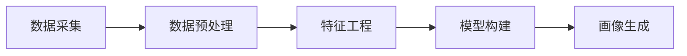

# 程序员如何利用AI进行用户画像分析

> 关键词：程序员、AI、用户画像分析、机器学习、数据挖掘、大数据、人工智能算法

> 摘要：本文旨在深入探讨程序员如何利用AI技术进行用户画像分析。用户画像分析在当今数字化时代具有重要意义，能够帮助企业更好地了解用户需求、行为和偏好，从而提供更精准的服务和个性化的体验。文章首先介绍了相关背景知识，包括目的、预期读者、文档结构和术语表。接着阐述了用户画像分析的核心概念与联系，展示了其原理和架构的示意图及流程图。详细讲解了核心算法原理，并通过Python源代码进行说明，同时介绍了相关的数学模型和公式。通过项目实战，展示了开发环境搭建、源代码实现和代码解读。分析了实际应用场景，推荐了学习资源、开发工具框架和相关论文著作。最后总结了未来发展趋势与挑战，提供了常见问题与解答以及扩展阅读和参考资料，帮助程序员全面掌握利用AI进行用户画像分析的技术。

## 1. 背景介绍 
### 1.1 目的和范围
在互联网和数字化的浪潮下，企业积累了海量的用户数据。利用这些数据进行用户画像分析，可以挖掘出有价值的信息，为企业的决策提供支持。本文的目的是帮助程序员了解如何利用AI技术进行用户画像分析，涵盖了从基本概念到算法原理，再到项目实战和实际应用场景的全面内容。范围包括常见的用户画像分析方法、相关的AI算法和技术，以及如何将这些技术应用到实际项目中。

### 1.2 预期读者
本文主要面向程序员群体，尤其是对数据分析、人工智能和用户画像分析感兴趣的开发者。同时，也适合对用户画像分析有一定了解，希望深入学习如何利用AI技术进行实践的专业人士。对于企业中从事市场调研、产品设计和运营的人员，也可以作为参考，以更好地理解用户画像分析背后的技术原理。

### 1.3 文档结构概述
本文将按照以下结构进行组织：首先介绍背景知识，包括目的、读者和文档结构等；接着阐述用户画像分析的核心概念与联系，通过示意图和流程图展示其原理和架构；详细讲解核心算法原理，并给出Python源代码示例；介绍相关的数学模型和公式，并举例说明；通过项目实战展示开发环境搭建、源代码实现和代码解读；分析实际应用场景；推荐学习资源、开发工具框架和相关论文著作；最后总结未来发展趋势与挑战，提供常见问题与解答以及扩展阅读和参考资料。

### 1.4 术语表
#### 1.4.1 核心术语定义
- **用户画像**：是根据用户的社会属性、生活习惯和消费行为等信息而抽象出来的一个标签化的用户模型。通过用户画像，可以快速、全面地了解用户的特征和需求。
- **AI（人工智能）**：是一门研究如何使计算机能够模拟人类智能的学科和技术领域，包括机器学习、深度学习、自然语言处理等多种技术。
- **机器学习**：是AI的一个重要分支，它通过让计算机从数据中学习模式和规律，从而实现预测和决策等任务。
- **数据挖掘**：是指从大量的数据中发现潜在的、有价值的信息和模式的过程。
- **大数据**：指的是海量、高增长和多样化的信息资产，具有大量（Volume）、高速（Velocity）、多样（Variety）、低价值密度（Value）和真实性（Veracity）等特点。

#### 1.4.2 相关概念解释
- **特征工程**：是指从原始数据中提取和选择有意义的特征，以提高模型的性能和效果。在用户画像分析中，特征工程包括对用户行为数据、属性数据等进行清洗、转换和选择。
- **聚类分析**：是一种无监督学习算法，它将数据集中的对象划分成不同的簇，使得同一簇内的对象具有较高的相似度，而不同簇之间的对象具有较大的差异。在用户画像分析中，聚类分析可以用于发现用户的群体特征。
- **分类算法**：是一种有监督学习算法，它根据已知的标签信息，对新的数据进行分类。在用户画像分析中，分类算法可以用于预测用户的行为和偏好。

#### 1.4.3 缩略词列表
- **AI**：Artificial Intelligence（人工智能）
- **ML**：Machine Learning（机器学习）
- **DL**：Deep Learning（深度学习）
- **NLP**：Natural Language Processing（自然语言处理）
- **KNN**：k-Nearest Neighbors（k近邻算法）
- **SVM**：Support Vector Machine（支持向量机）
- **PCA**：Principal Component Analysis（主成分分析）

## 2. 核心概念与联系 
用户画像分析的核心概念主要涉及数据采集、数据预处理、特征工程、模型构建和画像生成等环节。其原理是通过对用户的多源数据进行收集和处理，提取有价值的特征，利用AI算法构建用户模型，最终生成用户画像。

### 核心概念原理和架构的文本示意图
```plaintext
+---------------------+
|      数据采集       |
| （多源数据：行为、  |
|  属性、社交等）     |
+---------------------+
           |
           v
+---------------------+
|    数据预处理       |
| （清洗、转换、      |
|  归一化等）         |
+---------------------+
           |
           v
+---------------------+
|    特征工程         |
| （提取、选择、      |
|  组合特征）         |
+---------------------+
           |
           v
+---------------------+
|    模型构建         |
| （机器学习、        |
|  深度学习算法）    |
+---------------------+
           |
           v
+---------------------+
|    画像生成         |
| （标签化、可视化    |
|  展示）             |
+---------------------+
```

### Mermaid 流程图


在这个流程中，数据采集是基础，它收集了用户的各种信息。数据预处理对采集到的数据进行清洗和转换，以提高数据的质量。特征工程提取和选择有意义的特征，为模型构建提供输入。模型构建利用AI算法对特征进行学习和分析，挖掘用户的模式和规律。最后，画像生成将模型的结果进行标签化和可视化展示，形成用户画像。

## 3. 核心算法原理 & 具体操作步骤 
### 3.1 聚类算法 - K-Means
#### 算法原理
K-Means是一种常用的无监督聚类算法，其目标是将数据集划分为 $k$ 个簇，使得同一簇内的数据点具有较高的相似度，而不同簇之间的数据点具有较大的差异。算法的基本思想是通过迭代的方式，不断更新簇的中心，直到簇的中心不再发生变化或达到最大迭代次数。

具体步骤如下：
1. **初始化**：随机选择 $k$ 个数据点作为初始的簇中心。
2. **分配数据点**：计算每个数据点到各个簇中心的距离，将数据点分配到距离最近的簇中。
3. **更新簇中心**：计算每个簇中所有数据点的平均值，将该平均值作为新的簇中心。
4. **重复步骤2和3**：直到簇的中心不再发生变化或达到最大迭代次数。

#### Python源代码实现
```python
import numpy as np

def kmeans(data, k, max_iterations=100):
    # 随机初始化簇中心
    centers = data[np.random.choice(data.shape[0], k, replace=False)]
    
    for _ in range(max_iterations):
        # 分配数据点到最近的簇
        labels = np.argmin(np.linalg.norm(data[:, np.newaxis] - centers, axis=2), axis=1)
        
        # 更新簇中心
        new_centers = np.array([data[labels == i].mean(axis=0) for i in range(k)])
        
        # 判断是否收敛
        if np.allclose(centers, new_centers):
            break
        
        centers = new_centers
    
    return labels, centers
```

### 3.2 分类算法 - KNN
#### 算法原理
KNN（k-Nearest Neighbors）是一种简单而有效的有监督分类算法。其基本思想是对于一个新的数据点，找到训练数据集中距离它最近的 $k$ 个邻居，然后根据这 $k$ 个邻居的标签来决定新数据点的标签。通常采用多数表决的方法，即选择出现次数最多的标签作为新数据点的标签。

具体步骤如下：
1. **计算距离**：计算新数据点到训练数据集中每个数据点的距离。
2. **选择 $k$ 个邻居**：选择距离最近的 $k$ 个数据点作为邻居。
3. **进行投票**：统计这 $k$ 个邻居中各个标签的出现次数，选择出现次数最多的标签作为新数据点的标签。

#### Python源代码实现
```python
import numpy as np
from collections import Counter

def knn(X_train, y_train, X_test, k):
    y_pred = []
    
    for test_point in X_test:
        # 计算距离
        distances = np.linalg.norm(X_train - test_point, axis=1)
        
        # 选择 k 个邻居
        k_indices = np.argsort(distances)[:k]
        k_nearest_labels = [y_train[i] for i in k_indices]
        
        # 进行投票
        most_common = Counter(k_nearest_labels).most_common(1)
        y_pred.append(most_common[0][0])
    
    return np.array(y_pred)
```

## 4. 数学模型和公式 & 详细讲解 & 举例说明 
### 4.1 K-Means算法的数学模型和公式
#### 目标函数
K-Means算法的目标是最小化所有数据点到其所属簇中心的距离之和，即：
$$J = \sum_{i=1}^{n} \min_{j=1}^{k} \left\lVert x_i - c_j \right\rVert^2$$
其中，$n$ 是数据点的数量，$k$ 是簇的数量，$x_i$ 是第 $i$ 个数据点，$c_j$ 是第 $j$ 个簇的中心，$\left\lVert \cdot \right\rVert$ 表示欧几里得距离。

#### 距离计算
在K-Means算法中，通常使用欧几里得距离来计算数据点之间的距离。欧几里得距离的公式为：
$$d(x, y) = \sqrt{\sum_{i=1}^{m} (x_i - y_i)^2}$$
其中，$x$ 和 $y$ 是两个 $m$ 维的数据点，$x_i$ 和 $y_i$ 分别是它们的第 $i$ 个维度的取值。

#### 举例说明
假设有以下数据集：
```python
data = np.array([[1, 2], [2, 3], [8, 7], [9, 8]])
```
我们希望将这些数据点划分为 $k = 2$ 个簇。使用K-Means算法，首先随机初始化两个簇中心，然后不断迭代更新簇中心，直到收敛。最终得到的簇标签和簇中心可以帮助我们了解数据的分布情况。

### 4.2 KNN算法的数学模型和公式
#### 距离计算
KNN算法中同样使用欧几里得距离来计算新数据点到训练数据点的距离，公式与K-Means算法中的欧几里得距离公式相同。

#### 多数表决
在选择 $k$ 个邻居后，需要进行多数表决来确定新数据点的标签。假设 $k$ 个邻居的标签集合为 $L = \{l_1, l_2, \cdots, l_k\}$，则新数据点的标签 $y$ 为：
$$y = \arg\max_{l \in L} \text{count}(l)$$
其中，$\text{count}(l)$ 表示标签 $l$ 在 $L$ 中出现的次数。

#### 举例说明
假设有以下训练数据集：
```python
X_train = np.array([[1, 2], [2, 3], [8, 7], [9, 8]])
y_train = np.array([0, 0, 1, 1])
```
现在有一个新的数据点 $X_test = np.array([[3, 4]])$，我们希望使用KNN算法来预测它的标签。首先计算新数据点到训练数据点的距离，选择距离最近的 $k = 3$ 个邻居，然后进行多数表决。最终得到的预测标签可以帮助我们对新数据点进行分类。

## 5. 项目实战：代码实际案例和详细解释说明 
### 5.1  开发环境搭建
#### 安装Python
首先需要安装Python，可以从Python官方网站（https://www.python.org/downloads/）下载适合自己操作系统的Python版本。建议安装Python 3.6及以上版本。

#### 安装必要的库
在项目中，我们需要使用一些Python库，如NumPy、Pandas、Scikit-learn等。可以使用以下命令来安装这些库：
```sh
pip install numpy pandas scikit-learn matplotlib
```

### 5.2  源代码详细实现和代码解读
#### 数据准备
假设我们有一个用户行为数据集，包含用户的年龄、消费金额和购买次数等信息。我们的目标是对用户进行聚类分析，了解用户的群体特征。

```python
import numpy as np
import pandas as pd
from sklearn.cluster import KMeans
import matplotlib.pyplot as plt

# 读取数据
data = pd.read_csv('user_behavior.csv')

# 提取特征
X = data[['age', 'consumption_amount', 'purchase_frequency']].values
```

#### 模型训练
```python
# 使用K-Means算法进行聚类
kmeans = KMeans(n_clusters=3, random_state=42)
kmeans.fit(X)

# 获取聚类标签
labels = kmeans.labels_

# 获取簇中心
centers = kmeans.cluster_centers_
```

#### 可视化展示
```python
# 可视化聚类结果
plt.scatter(X[:, 0], X[:, 1], c=labels, cmap='viridis')
plt.scatter(centers[:, 0], centers[:, 1], marker='X', s=200, c='red')
plt.xlabel('Age')
plt.ylabel('Consumption Amount')
plt.title('User Clustering')
plt.show()
```

### 5.3  代码解读与分析
- **数据准备**：使用Pandas库读取用户行为数据集，并提取需要的特征。
- **模型训练**：使用Scikit-learn库中的KMeans算法进行聚类分析，设置簇的数量为3，并指定随机种子以保证结果的可重复性。
- **可视化展示**：使用Matplotlib库将聚类结果可视化，不同颜色的点表示不同的簇，红色的X表示簇中心。通过可视化可以直观地了解用户的群体特征。

## 6. 实际应用场景 
### 6.1 电商领域
在电商领域，用户画像分析可以帮助企业了解用户的购物偏好、消费能力和购买频率等信息。通过对用户进行聚类分析，可以将用户分为不同的群体，如高价值用户、普通用户和潜在用户等。针对不同的用户群体，企业可以制定个性化的营销策略，如推荐个性化的商品、发送定制化的促销信息等，从而提高用户的购买转化率和忠诚度。

### 6.2 金融领域
在金融领域，用户画像分析可以帮助银行和金融机构评估用户的信用风险、投资偏好和理财需求等。通过对用户的行为数据、资产信息和信用记录等进行分析，可以构建用户的信用画像和风险画像。金融机构可以根据用户画像为用户提供个性化的金融产品和服务，如定制化的贷款方案、投资组合建议等，同时也可以加强风险管控，降低不良贷款率。

### 6.3 社交媒体领域
在社交媒体领域，用户画像分析可以帮助平台了解用户的兴趣爱好、社交关系和行为习惯等信息。通过对用户的发布内容、关注对象和互动行为等进行分析，可以构建用户的兴趣画像和社交画像。社交媒体平台可以根据用户画像为用户推荐个性化的内容、好友和广告，提高用户的活跃度和参与度，同时也可以进行精准的广告投放，提高广告的效果和转化率。

## 7. 工具和资源推荐
### 7.1 学习资源推荐
#### 7.1.1 书籍推荐
- 《Python机器学习》（Sebastian Raschka著）：这本书详细介绍了Python在机器学习中的应用，包括各种机器学习算法的原理和实现，适合初学者入门。
- 《深度学习》（Ian Goodfellow、Yoshua Bengio和Aaron Courville著）：这是深度学习领域的经典著作，全面介绍了深度学习的理论和实践，适合有一定基础的读者深入学习。
- 《数据挖掘：概念与技术》（Jiawei Han、Jian Pei和Jianwen Yin著）：这本书系统地介绍了数据挖掘的基本概念、算法和应用，是数据挖掘领域的权威教材。

#### 7.1.2 在线课程
- Coursera上的“机器学习”课程（Andrew Ng教授）：这是一门非常经典的机器学习课程，讲解深入浅出，适合初学者学习。
- edX上的“深度学习”课程（Geoffrey Hinton教授）：这是深度学习领域的顶尖课程，由深度学习的先驱Geoffrey Hinton教授授课，适合有一定基础的读者深入学习。
- 中国大学MOOC上的“数据挖掘”课程：这门课程由国内知名高校的教授授课，内容丰富，适合对数据挖掘感兴趣的读者学习。

#### 7.1.3 技术博客和网站
- 博客园（https://www.cnblogs.com/）：这是一个技术博客平台，有很多关于机器学习、数据挖掘和人工智能的技术文章。
- 掘金（https://juejin.cn/）：这是一个技术社区，有很多开发者分享的技术经验和实践案例。
- Kaggle（https://www.kaggle.com/）：这是一个数据科学竞赛平台，有很多公开的数据集和优秀的解决方案，可以学习到很多实际应用中的技巧和方法。

### 7.2 开发工具框架推荐
#### 7.2.1 IDE和编辑器
- PyCharm：这是一款专门为Python开发设计的集成开发环境，功能强大，支持代码自动补全、调试和版本控制等功能。
- Jupyter Notebook：这是一个交互式的开发环境，适合进行数据分析和模型训练的实验和演示。
- Visual Studio Code：这是一款轻量级的代码编辑器，支持多种编程语言，有丰富的插件可以扩展功能。

#### 7.2.2 调试和性能分析工具
- PDB：这是Python自带的调试器，可以帮助开发者进行代码调试和问题排查。
- Py-Spy：这是一个性能分析工具，可以帮助开发者分析Python代码的性能瓶颈。
- TensorBoard：这是TensorFlow的可视化工具，可以帮助开发者可视化模型的训练过程和性能指标。

#### 7.2.3 相关框架和库
- NumPy：这是Python中用于科学计算的基础库，提供了高效的数组操作和数学函数。
- Pandas：这是Python中用于数据处理和分析的库，提供了方便的数据结构和数据操作方法。
- Scikit-learn：这是Python中用于机器学习的库，提供了各种机器学习算法和工具，如分类、聚类、回归等。
- TensorFlow：这是Google开发的深度学习框架，提供了高效的深度学习模型训练和部署工具。
- PyTorch：这是Facebook开发的深度学习框架，具有动态图的特点，适合快速迭代和实验。

### 7.3 相关论文著作推荐
#### 7.3.1 经典论文
- “A Survey on User Modeling for Personalized Recommendation”（作者：Jie Zhang等）：这篇论文对用户建模在个性化推荐中的应用进行了全面的综述，介绍了用户建模的方法和技术。
- “K-Means++: The Advantages of Careful Seeding”（作者：David Arthur和Sergei Vassilvitskii）：这篇论文提出了K-Means++算法，改进了K-Means算法的初始中心选择方法，提高了算法的性能。
- “Nearest Neighbor Pattern Classification”（作者：Thomas Cover和Peter Hart）：这篇论文是KNN算法的经典论文，介绍了KNN算法的原理和应用。

#### 7.3.2 最新研究成果
- 在ACM SIGKDD、IEEE ICML等顶级学术会议上，有很多关于用户画像分析和人工智能的最新研究成果。可以关注这些会议的论文，了解最新的技术和方法。
- 在arXiv（https://arxiv.org/）预印本平台上，也有很多关于用户画像分析和人工智能的最新研究论文。可以定期浏览这些论文，了解最新的研究动态。

#### 7.3.3 应用案例分析
- 《大数据时代的用户画像：方法与实践》（作者：林学民等）：这本书介绍了用户画像在不同领域的应用案例和实践经验，包括电商、金融、社交媒体等领域。
- 在一些行业报告和企业案例中，也可以找到很多关于用户画像分析的应用案例。可以通过阅读这些案例，了解用户画像分析在实际应用中的方法和效果。

## 8. 总结：未来发展趋势与挑战
### 8.1 未来发展趋势
- **多模态数据融合**：未来的用户画像分析将不仅仅依赖于单一类型的数据，而是会融合多种模态的数据，如文本、图像、音频等。通过多模态数据融合，可以更全面、准确地了解用户的特征和需求。
- **实时性和动态性**：随着互联网和移动设备的普及，用户行为数据的产生速度越来越快。未来的用户画像分析需要具备实时性和动态性，能够及时反映用户的最新行为和偏好。
- **个性化和精细化**：用户对个性化服务的需求越来越高，未来的用户画像分析将更加注重个性化和精细化。通过对用户进行更深入的分析和挖掘，可以为用户提供更加精准、个性化的服务和体验。
- **与其他技术的融合**：用户画像分析将与人工智能的其他技术，如自然语言处理、计算机视觉等进行更深入的融合。通过融合这些技术，可以提高用户画像分析的效率和准确性。

### 8.2 挑战
- **数据隐私和安全**：用户画像分析需要收集和处理大量的用户数据，这涉及到用户的隐私和安全问题。如何在保护用户隐私和安全的前提下，进行有效的用户画像分析是一个重要的挑战。
- **数据质量和多样性**：用户画像分析的效果很大程度上取决于数据的质量和多样性。如何收集到高质量、多样化的数据，并对数据进行有效的清洗和预处理是一个挑战。
- **算法复杂度和可解释性**：随着用户画像分析的深入，使用的算法越来越复杂。如何在保证算法性能的前提下，提高算法的可解释性，让用户和开发者能够理解算法的决策过程是一个挑战。
- **跨领域和跨文化的差异**：不同领域和不同文化背景下的用户行为和需求存在差异。如何在跨领域和跨文化的环境下，进行有效的用户画像分析是一个挑战。

## 9. 附录：常见问题与解答
### 9.1 如何选择合适的AI算法进行用户画像分析？
选择合适的AI算法需要考虑多个因素，如数据类型、数据规模、分析目标等。如果数据是无标签的，可以选择聚类算法，如K-Means、DBSCAN等；如果数据是有标签的，可以选择分类算法，如KNN、SVM等。此外，还可以根据数据的特点和分析目标选择合适的深度学习算法，如神经网络、卷积神经网络等。

### 9.2 如何处理用户画像分析中的缺失值和异常值？
处理缺失值的方法有很多种，如删除含有缺失值的记录、填充缺失值（如使用均值、中位数等）、使用插值方法等。处理异常值的方法也有很多种，如删除异常值、使用统计方法（如Z-score）进行检测和处理、使用机器学习算法进行异常检测等。具体选择哪种方法需要根据数据的特点和分析目标来决定。

### 9.3 如何评估用户画像分析的效果？
评估用户画像分析的效果可以从多个方面进行，如准确性、召回率、F1值等。对于聚类算法，可以使用轮廓系数、Calinski-Harabasz指数等指标来评估聚类的效果；对于分类算法，可以使用混淆矩阵、ROC曲线等指标来评估分类的效果。此外，还可以通过用户反馈和业务指标来评估用户画像分析的效果，如用户的满意度、购买转化率等。

### 9.4 如何保证用户画像分析的可解释性？
保证用户画像分析的可解释性可以从多个方面入手，如选择可解释的算法（如决策树、线性回归等）、对模型的结果进行可视化展示、对特征的重要性进行分析等。此外，还可以使用一些可解释性的工具和技术，如LIME、SHAP等，来解释模型的决策过程。

## 10. 扩展阅读 & 参考资料
- 《人工智能：一种现代的方法》（Stuart Russell和Peter Norvig著）
- 《Python数据科学手册》（Jake VanderPlas著）
- 《深度学习实战》（Antoine Géron著）
- 相关的学术期刊和会议论文，如ACM Transactions on Intelligent Systems and Technology、IEEE Transactions on Knowledge and Data Engineering等。
- 各大公司的技术博客和开源项目，如Google AI Blog、Facebook AI Research等。