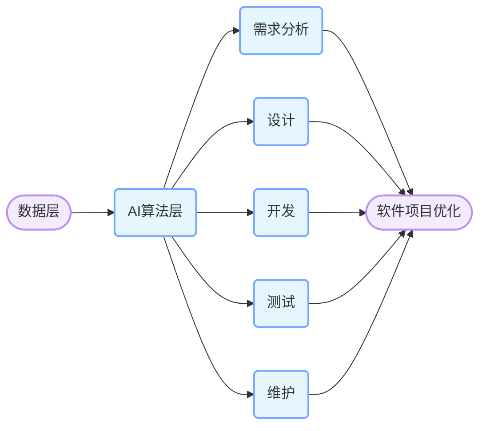

# 程序员如何利用AI进行软件项目优化

> 关键词：程序员、AI、软件项目优化、机器学习、深度学习、自动化测试、性能优化

> 摘要：本文围绕程序员如何利用AI进行软件项目优化展开，详细介绍了相关的核心概念、算法原理、数学模型，通过项目实战案例展示了具体的实现过程。探讨了AI在软件项目各个环节中的实际应用场景，推荐了学习、开发相关的工具和资源，最后对未来发展趋势与挑战进行了总结，并给出常见问题的解答和扩展阅读参考资料，旨在帮助程序员更好地借助AI技术提升软件项目的质量和效率。

## 1. 背景介绍 
### 1.1 目的和范围
在当今数字化时代，软件项目的规模和复杂度不断增加，对软件的质量、性能和开发效率提出了更高的要求。AI技术的快速发展为软件项目优化提供了新的思路和方法。本文的目的在于深入探讨程序员如何利用AI技术在软件项目的各个阶段进行优化，包括需求分析、设计、开发、测试和维护等。范围涵盖了常见的AI技术如机器学习、深度学习等在软件项目优化中的应用，以及相关的工具和资源推荐。

### 1.2 预期读者
本文主要面向广大程序员、软件开发者、软件项目管理人员以及对AI在软件领域应用感兴趣的技术爱好者。希望通过本文的介绍，能够帮助读者了解如何将AI技术融入到软件项目开发中，提升软件项目的质量和效率。

### 1.3 文档结构概述
本文首先介绍相关的背景信息，包括目的、预期读者和文档结构概述。接着阐述核心概念与联系，包括AI、机器学习、深度学习等概念及其在软件项目优化中的关系。然后详细讲解核心算法原理和具体操作步骤，通过Python代码进行说明。之后介绍数学模型和公式，并举例说明。通过项目实战展示代码实际案例和详细解释。探讨实际应用场景，推荐相关的工具和资源。最后总结未来发展趋势与挑战，给出常见问题的解答和扩展阅读参考资料。

### 1.4 术语表
#### 1.4.1 核心术语定义
- **AI（Artificial Intelligence）**：人工智能，是研究、开发用于模拟、延伸和扩展人的智能的理论、方法、技术及应用系统的一门新的技术科学。
- **机器学习（Machine Learning）**：一门多领域交叉学科，涉及概率论、统计学、逼近论、凸分析、算法复杂度理论等多门学科。它专门研究计算机怎样模拟或实现人类的学习行为，以获取新的知识或技能，重新组织已有的知识结构使之不断改善自身的性能。
- **深度学习（Deep Learning）**：机器学习的一个分支领域，它是一种基于对数据进行表征学习的方法。深度学习通过构建具有很多层的神经网络模型，自动从大量数据中学习特征和模式。
- **软件项目优化**：对软件项目的各个方面进行改进和提升，包括性能优化、代码优化、功能优化等，以提高软件的质量、效率和用户体验。

#### 1.4.2 相关概念解释
- **自动化测试**：使用自动化测试工具来执行测试用例，代替人工手动测试，提高测试效率和准确性。
- **性能优化**：通过对软件系统的性能进行分析和优化，提高软件的响应速度、吞吐量等性能指标。
- **代码优化**：对软件代码进行重构和优化，提高代码的可读性、可维护性和执行效率。

#### 1.4.3 缩略词列表
- **ML**：Machine Learning（机器学习）
- **DL**：Deep Learning（深度学习）
- **AI**：Artificial Intelligence（人工智能）

## 2. 核心概念与联系 

### 2.1 AI与软件项目优化的关系
AI技术可以在软件项目的各个阶段发挥重要作用。在需求分析阶段，AI可以通过自然语言处理技术理解用户需求，提取关键信息；在设计阶段，AI可以辅助进行架构设计和算法选择；在开发阶段，AI可以帮助进行代码生成和代码审查；在测试阶段，AI可以实现自动化测试用例生成和缺陷预测；在维护阶段，AI可以进行性能监测和故障诊断。

### 2.2 机器学习和深度学习在软件项目优化中的应用
机器学习和深度学习是AI技术的重要组成部分。机器学习算法可以用于数据分类、回归分析、聚类分析等，在软件项目中可以用于缺陷预测、用户行为分析等。深度学习通过构建深层神经网络，能够自动学习数据的特征和模式，在图像识别、语音识别、自然语言处理等领域有广泛应用，在软件项目中可以用于智能客服、代码生成等。

### 2.3 核心概念原理和架构的文本示意图
AI在软件项目优化中的应用可以看作是一个分层的架构，底层是数据层，包括软件项目的各种数据，如代码、测试用例、用户反馈等；中间层是AI算法层，包括机器学习和深度学习算法；上层是应用层，包括需求分析、设计、开发、测试和维护等软件项目的各个阶段。

### 2.4 Mermaid流程图


## 3. 核心算法原理 & 具体操作步骤 

### 3.1 机器学习算法原理及Python实现
#### 3.1.1 线性回归算法
线性回归是一种基本的机器学习算法，用于预测连续值。其原理是通过找到一条最佳拟合直线，使得数据点到直线的误差平方和最小。

Python代码实现：
```python
import numpy as np
from sklearn.linear_model import LinearRegression

# 生成一些示例数据
X = np.array([1, 2, 3, 4, 5]).reshape(-1, 1)
y = np.array([2, 4, 6, 8, 10])

# 创建线性回归模型
model = LinearRegression()

# 拟合模型
model.fit(X, y)

# 预测新数据
new_X = np.array([6]).reshape(-1, 1)
prediction = model.predict(new_X)
print("预测结果:", prediction)
```
#### 3.1.2 具体操作步骤
1. **数据准备**：收集和整理相关的数据，将其分为特征矩阵 `X` 和目标向量 `y`。
2. **模型选择**：选择合适的机器学习算法，如线性回归。
3. **模型训练**：使用训练数据对模型进行训练，即调用 `fit` 方法。
4. **模型评估**：使用测试数据对模型进行评估，计算评估指标，如均方误差、决定系数等。
5. **模型预测**：使用训练好的模型对新数据进行预测。

### 3.2 深度学习算法原理及Python实现
#### 3.2.1 神经网络算法
神经网络是一种模仿人类神经系统的计算模型，由输入层、隐藏层和输出层组成。每个神经元接收输入信号，经过激活函数处理后输出信号。

Python代码实现（使用Keras库）：
```python
import numpy as np
from keras.models import Sequential
from keras.layers import Dense

# 生成一些示例数据
X = np.array([[0, 0], [0, 1], [1, 0], [1, 1]])
y = np.array([0, 1, 1, 0])

# 创建神经网络模型
model = Sequential()
model.add(Dense(4, input_dim=2, activation='relu'))
model.add(Dense(1, activation='sigmoid'))

# 编译模型
model.compile(loss='binary_crossentropy', optimizer='adam', metrics=['accuracy'])

# 训练模型
model.fit(X, y, epochs=1000, verbose=0)

# 预测新数据
new_X = np.array([[0, 0]])
prediction = model.predict(new_X)
print("预测结果:", prediction)
```
#### 3.2.2 具体操作步骤
1. **数据准备**：收集和整理相关的数据，将其分为训练集、验证集和测试集。
2. **模型构建**：使用深度学习框架（如Keras、TensorFlow等）构建神经网络模型，定义模型的层数、神经元数量和激活函数等。
3. **模型编译**：选择合适的损失函数、优化器和评估指标，对模型进行编译。
4. **模型训练**：使用训练数据对模型进行训练，设置训练的轮数和批次大小等参数。
5. **模型评估**：使用验证集和测试集对模型进行评估，计算评估指标，如准确率、召回率等。
6. **模型预测**：使用训练好的模型对新数据进行预测。

## 4. 数学模型和公式 & 详细讲解 & 举例说明 

### 4.1 线性回归的数学模型和公式
线性回归的数学模型可以表示为：
$$y = \theta_0 + \theta_1x_1 + \theta_2x_2 + \cdots + \theta_nx_n + \epsilon$$
其中，$y$ 是目标变量，$x_1, x_2, \cdots, x_n$ 是特征变量，$\theta_0, \theta_1, \theta_2, \cdots, \theta_n$ 是模型的参数，$\epsilon$ 是误差项。

线性回归的目标是找到一组参数 $\theta$，使得误差平方和最小，误差平方和的计算公式为：
$$J(\theta) = \frac{1}{2m}\sum_{i=1}^{m}(h_{\theta}(x^{(i)}) - y^{(i)})^2$$
其中，$m$ 是样本数量，$h_{\theta}(x^{(i)})$ 是模型的预测值，$y^{(i)}$ 是真实值。

通过最小化误差平方和，可以得到最优的参数 $\theta$，常用的方法是梯度下降法。

### 4.2 神经网络的数学模型和公式
神经网络的神经元可以表示为：
$$z = \sum_{i=1}^{n}w_ix_i + b$$
$$a = f(z)$$
其中，$x_1, x_2, \cdots, x_n$ 是输入信号，$w_1, w_2, \cdots, w_n$ 是权重，$b$ 是偏置，$z$ 是加权和，$f$ 是激活函数，$a$ 是输出信号。

神经网络的训练过程是通过反向传播算法来更新权重和偏置，以最小化损失函数。常见的损失函数包括均方误差、交叉熵损失等。

### 4.3 举例说明
#### 4.3.1 线性回归举例
假设有一组数据，$x$ 表示房屋面积，$y$ 表示房屋价格。我们可以使用线性回归来预测房屋价格。
| 房屋面积 ($x$) | 房屋价格 ($y$) |
| ---- | ---- |
| 100 | 200000 |
| 150 | 300000 |
| 200 | 400000 |
| 250 | 500000 |

使用线性回归模型，我们可以得到预测公式：$y = 2000x$。当房屋面积为 300 时，预测房屋价格为 $y = 2000 \times 300 = 600000$。

#### 4.3.2 神经网络举例
假设有一个简单的二分类问题，输入是两个特征 $x_1$ 和 $x_2$，输出是类别标签 0 或 1。我们可以使用神经网络来进行分类。
输入数据：
| $x_1$ | $x_2$ | 类别标签 |
| ---- | ---- | ---- |
| 0 | 0 | 0 |
| 0 | 1 | 1 |
| 1 | 0 | 1 |
| 1 | 1 | 0 |

通过训练神经网络模型，我们可以得到一个能够准确分类的模型。当输入新的数据 $x_1 = 0$，$x_2 = 1$ 时，模型预测的类别标签为 1。

## 5. 项目实战：代码实际案例和详细解释说明 

### 5.1  开发环境搭建
#### 5.1.1 安装Python
首先需要安装Python，可以从Python官方网站（https://www.python.org/downloads/）下载适合自己操作系统的Python版本，并按照安装向导进行安装。

#### 5.1.2 安装必要的库
使用 `pip` 命令安装必要的库，如 `numpy`、`pandas`、`scikit-learn`、`keras`、`tensorflow` 等。
```sh
pip install numpy pandas scikit-learn keras tensorflow
```

### 5.2  源代码详细实现和代码解读
#### 5.2.1 缺陷预测案例
以下是一个使用机器学习算法进行软件缺陷预测的案例。

```python
import pandas as pd
from sklearn.model_selection import train_test_split
from sklearn.ensemble import RandomForestClassifier
from sklearn.metrics import accuracy_score

# 加载数据集
data = pd.read_csv('defect_dataset.csv')

# 分离特征和标签
X = data.drop('defect', axis=1)
y = data['defect']

# 划分训练集和测试集
X_train, X_test, y_train, y_test = train_test_split(X, y, test_size=0.2, random_state=42)

# 创建随机森林分类器
model = RandomForestClassifier()

# 训练模型
model.fit(X_train, y_train)

# 预测测试集
y_pred = model.predict(X_test)

# 计算准确率
accuracy = accuracy_score(y_test, y_pred)
print("准确率:", accuracy)
```
#### 5.2.2 代码解读
1. **数据加载**：使用 `pandas` 库的 `read_csv` 函数加载软件缺陷数据集。
2. **特征和标签分离**：将数据集中的特征和标签分离，`X` 表示特征矩阵，`y` 表示目标向量。
3. **数据集划分**：使用 `train_test_split` 函数将数据集划分为训练集和测试集，测试集占比为 20%。
4. **模型创建**：创建一个随机森林分类器模型。
5. **模型训练**：使用训练集对模型进行训练。
6. **模型预测**：使用训练好的模型对测试集进行预测。
7. **准确率计算**：使用 `accuracy_score` 函数计算模型的准确率。

### 5.3  代码解读与分析
#### 5.3.1 数据预处理
在实际应用中，数据预处理是非常重要的一步。可能需要对数据进行清洗、缺失值处理、特征选择等操作，以提高模型的性能。

#### 5.3.2 模型选择和调优
不同的机器学习算法适用于不同的问题，需要根据具体情况选择合适的模型。同时，可以通过调整模型的参数来提高模型的性能，如随机森林的树的数量、深度等。

#### 5.3.3 模型评估
除了准确率，还可以使用其他评估指标来评估模型的性能，如召回率、F1值、ROC曲线等。不同的评估指标适用于不同的场景，需要根据具体情况选择合适的评估指标。

## 6. 实际应用场景 
### 6.1 需求分析阶段
- **自然语言处理**：使用AI的自然语言处理技术对用户需求文档进行分析，提取关键信息，理解用户的需求和意图。例如，使用命名实体识别技术识别需求文档中的产品名称、功能要求等。
- **需求分类**：通过机器学习算法对需求进行分类，如功能需求、非功能需求等，便于后续的需求管理和开发。

### 6.2 设计阶段
- **架构推荐**：AI可以根据软件的需求和特点，推荐合适的软件架构，如分层架构、微服务架构等。
- **算法选择**：根据问题的类型和数据的特点，AI可以辅助选择合适的算法，如排序算法、搜索算法等。

### 6.3 开发阶段
- **代码生成**：使用深度学习技术，如基于Transformer的模型，根据需求描述生成代码片段，提高开发效率。
- **代码审查**：AI可以对代码进行静态分析，检查代码中的潜在问题，如代码风格问题、安全漏洞等。

### 6.4 测试阶段
- **自动化测试用例生成**：通过机器学习算法分析软件的功能和结构，自动生成测试用例，覆盖更多的测试场景。
- **缺陷预测**：使用机器学习和深度学习算法预测软件中可能存在的缺陷，帮助测试人员优先测试高风险的模块。

### 6.5 维护阶段
- **性能监测**：通过AI技术实时监测软件的性能指标，如响应时间、吞吐量等，及时发现性能问题。
- **故障诊断**：当软件出现故障时，AI可以分析日志数据，快速定位故障原因，提高故障修复的效率。

## 7. 工具和资源推荐
### 7.1 学习资源推荐
#### 7.1.1 书籍推荐
- 《机器学习》（周志华）：介绍了机器学习的基本概念、算法和应用，是机器学习领域的经典教材。
- 《深度学习》（Ian Goodfellow、Yoshua Bengio、Aaron Courville）：全面介绍了深度学习的理论和实践，是深度学习领域的权威著作。
- 《Python机器学习》（Sebastian Raschka、Vahid Mirjalili）：结合Python语言，介绍了机器学习的算法和实现，适合初学者。

#### 7.1.2 在线课程
- Coursera上的《机器学习》（Andrew Ng）：由机器学习领域的知名专家Andrew Ng教授授课，是机器学习领域的经典课程。
- edX上的《深度学习》（deeplearning.ai）：由深度学习领域的知名专家Geoffrey Hinton、Yoshua Bengio等授课，全面介绍了深度学习的理论和实践。
- 中国大学MOOC上的《人工智能》：由国内知名高校的教授授课，介绍了人工智能的基本概念、算法和应用。

#### 7.1.3 技术博客和网站
- Medium：有很多关于AI和机器学习的技术博客，作者来自世界各地的技术专家和研究者。
- Towards Data Science：专注于数据科学和机器学习领域的技术博客，提供了很多实用的教程和案例。
- Kaggle：是一个数据科学和机器学习竞赛平台，上面有很多优秀的数据集和开源代码，可以学习和参考。

### 7.2 开发工具框架推荐
#### 7.2.1 IDE和编辑器
- PyCharm：是一款专门为Python开发设计的集成开发环境，提供了丰富的功能和插件，适合Python开发者。
- Jupyter Notebook：是一个交互式的开发环境，适合数据探索和模型实验，支持Python、R等多种编程语言。
- Visual Studio Code：是一款轻量级的代码编辑器，支持多种编程语言和插件，适合快速开发和调试。

#### 7.2.2 调试和性能分析工具
- TensorBoard：是TensorFlow提供的可视化工具，可以用于可视化训练过程、模型结构等，帮助开发者调试和优化模型。
- Py-Spy：是一个Python性能分析工具，可以实时监测Python程序的性能，找出性能瓶颈。
- cProfile：是Python内置的性能分析模块，可以对Python程序进行性能分析，生成详细的性能报告。

#### 7.2.3 相关框架和库
- TensorFlow：是一个开源的机器学习框架，由Google开发，提供了丰富的工具和接口，支持深度学习模型的开发和训练。
- PyTorch：是一个开源的深度学习框架，由Facebook开发，具有动态计算图的特点，适合快速开发和实验。
- Scikit-learn：是一个开源的机器学习库，提供了丰富的机器学习算法和工具，适合初学者和快速开发。

### 7.3 相关论文著作推荐
#### 7.3.1 经典论文
- 《Gradient-based learning applied to document recognition》（Yann LeCun、Léon Bottou、Yoshua Bengio、Patrick Haffner）：介绍了卷积神经网络（CNN）在手写字符识别中的应用，是深度学习领域的经典论文。
- 《ImageNet Classification with Deep Convolutional Neural Networks》（Alex Krizhevsky、Ilya Sutskever、Geoffrey E. Hinton）：介绍了AlexNet网络，开启了深度学习在图像识别领域的热潮。
- 《Attention Is All You Need》（Ashish Vaswani、Noam Shazeer、Niki Parmar等）：介绍了Transformer架构，是自然语言处理领域的重要突破。

#### 7.3.2 最新研究成果
- 关注顶级学术会议，如NeurIPS（神经信息处理系统大会）、ICML（国际机器学习会议）、CVPR（计算机视觉与模式识别会议）等，了解AI领域的最新研究成果。
- 关注知名学术期刊，如Journal of Artificial Intelligence Research（JAIR）、Artificial Intelligence等，获取AI领域的前沿研究论文。

#### 7.3.3 应用案例分析
- 查看知名科技公司的技术博客，如Google AI Blog、Facebook AI Research等，了解AI技术在实际应用中的案例和经验分享。
- 阅读相关的行业报告和研究机构的分析，了解AI技术在不同行业的应用现状和发展趋势。

## 8. 总结：未来发展趋势与挑战
### 8.1 未来发展趋势
- **AI与软件项目的深度融合**：未来，AI将在软件项目的各个阶段发挥更加重要的作用，实现软件项目的智能化开发和管理。
- **自动化和智能化程度不断提高**：随着AI技术的发展，软件项目的自动化和智能化程度将不断提高，如自动化代码生成、自动化测试、智能缺陷修复等。
- **跨领域融合**：AI将与其他领域如物联网、大数据、云计算等深度融合，推动软件项目的创新和发展。

### 8.2 挑战
- **数据质量和安全问题**：AI技术的发展依赖于大量的数据，数据的质量和安全是关键问题。如何保证数据的准确性、完整性和安全性是需要解决的挑战。
- **算法可解释性**：深度学习等AI算法通常是黑盒模型，其决策过程难以解释。在一些对安全性和可靠性要求较高的领域，算法的可解释性是一个重要的挑战。
- **人才短缺**：AI技术的发展需要大量的专业人才，目前AI领域的人才短缺是一个普遍的问题。如何培养和吸引更多的AI人才是推动AI在软件项目中应用的关键。

## 9. 附录：常见问题与解答
### 9.1 如何选择合适的AI算法？
选择合适的AI算法需要考虑问题的类型、数据的特点、模型的复杂度等因素。例如，对于分类问题，可以选择逻辑回归、决策树、随机森林等算法；对于回归问题，可以选择线性回归、岭回归、支持向量回归等算法。同时，还可以通过实验和比较不同算法的性能来选择最优的算法。

### 9.2 AI技术对程序员的技能要求有哪些变化？
AI技术的发展对程序员的技能要求提出了更高的要求。程序员不仅需要掌握传统的编程技能，还需要了解AI的基本概念、算法和应用。同时，还需要具备数据处理、模型训练和调优等能力。

### 9.3 如何解决AI模型的过拟合和欠拟合问题？
过拟合是指模型在训练集上表现很好，但在测试集上表现很差；欠拟合是指模型在训练集和测试集上的表现都很差。解决过拟合问题可以采用增加数据量、正则化、早停等方法；解决欠拟合问题可以采用增加模型复杂度、选择更合适的特征等方法。

## 10. 扩展阅读 & 参考资料
- 《人工智能：现代方法》（Stuart Russell、Peter Norvig）
- 《统计学习方法》（李航）
- 官方文档：TensorFlow官方文档（https://www.tensorflow.org/）、PyTorch官方文档（https://pytorch.org/）、Scikit-learn官方文档（https://scikit-learn.org/）
- 相关研究论文和报告：可以通过学术数据库如IEEE Xplore、ACM Digital Library等获取。