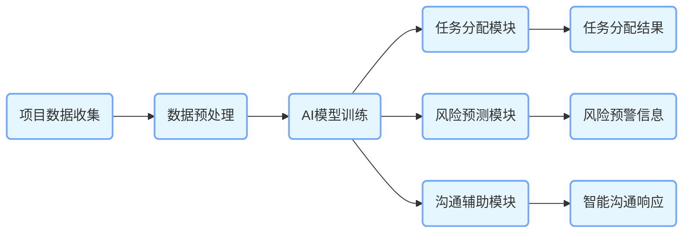

# 程序员如何利用AI进行软件项目协调

> 关键词：程序员、AI、软件项目协调、项目管理、人工智能应用

> 摘要：本文围绕程序员如何利用AI进行软件项目协调展开深入探讨。随着AI技术的飞速发展，其在软件项目管理领域的应用愈发广泛且重要。文章先介绍了相关背景，包括目的范围、预期读者等内容；接着阐述核心概念与联系，展示其原理和架构；详细讲解核心算法原理与操作步骤，并辅以Python代码示例；通过数学模型和公式进一步剖析；结合项目实战，介绍开发环境搭建、源代码实现与解读；探讨实际应用场景；推荐学习资源、开发工具框架以及相关论文著作；最后总结未来发展趋势与挑战，提供常见问题解答及参考资料，旨在帮助程序员更好地借助AI提升软件项目协调的效率和质量。

## 1. 背景介绍 
### 1.1 目的和范围
在当今数字化时代，软件项目的规模和复杂度不断增加，传统的项目协调方式面临着诸多挑战，如信息处理不及时、任务分配不合理、沟通效率低下等。本文章的目的在于深入探讨程序员如何利用AI技术来优化软件项目协调过程，提高项目的成功率和效率。范围涵盖了从AI在项目协调中的基本概念、核心算法，到实际项目中的应用案例，以及相关的工具和资源推荐等方面。

### 1.2 预期读者
本文主要面向广大程序员群体，包括初级、中级和高级程序员，以及对软件项目管理有兴趣的技术人员。同时，软件项目经理、项目协调员等相关人员也可以从本文中获取关于利用AI进行项目协调的有价值信息。

### 1.3 文档结构概述
本文将按照以下结构进行阐述：首先介绍背景知识，包括目的、读者和文档结构等；接着深入讲解核心概念与联系，通过示意图和流程图展示其原理和架构；详细说明核心算法原理和具体操作步骤，并给出Python代码示例；通过数学模型和公式进一步解释相关概念；结合实际项目案例，介绍开发环境搭建、源代码实现和代码解读；探讨AI在软件项目协调中的实际应用场景；推荐学习资源、开发工具框架和相关论文著作；最后总结未来发展趋势与挑战，提供常见问题解答和参考资料。

### 1.4 术语表
#### 1.4.1 核心术语定义
- **AI（Artificial Intelligence）**：即人工智能，是研究、开发用于模拟、延伸和扩展人的智能的理论、方法、技术及应用系统的一门新的技术科学。
- **软件项目协调**：指在软件项目的整个生命周期中，对人员、任务、资源等进行有效的组织、安排和沟通，以确保项目能够按照预定的计划顺利进行。
- **项目管理**：是对项目从启动到结束的全过程进行计划、组织、指挥、协调和控制，以实现项目的目标。

#### 1.4.2 相关概念解释
- **机器学习**：是AI的一个重要分支，它致力于研究如何让计算机从数据中自动学习模式和规律，从而实现预测和决策。
- **自然语言处理（NLP）**：是AI领域中处理人类语言的技术，包括文本分类、情感分析、机器翻译等任务。

#### 1.4.3 缩略词列表
- **AI**：Artificial Intelligence
- **NLP**：Natural Language Processing
- **ML**：Machine Learning

## 2. 核心概念与联系 

### 核心概念原理
在软件项目协调中，AI主要通过以下几个核心概念发挥作用：
- **智能任务分配**：AI可以根据程序员的技能、工作负荷、历史表现等因素，自动将任务分配给最合适的人员，提高任务执行的效率和质量。
- **风险预测与管理**：利用机器学习算法对项目历史数据进行分析，预测可能出现的风险，如进度延迟、成本超支等，并提前采取措施进行防范。
- **智能沟通辅助**：借助自然语言处理技术，实现智能聊天机器人，帮助程序员快速获取信息、解答疑问，促进团队成员之间的沟通和协作。

### 架构的文本示意图
以下是一个简单的利用AI进行软件项目协调的架构示意图：

```plaintext
              软件项目协调系统
                  ┌─────────────┐
                  │  数据层     │
                  │  （项目数据、人员数据等） │
                  └─────────────┘
                         │
                         ▼
                  ┌─────────────┐
                  │  AI处理层   │
                  │  （机器学习模型、NLP模型等） │
                  └─────────────┘
                         │
                         ▼
                  ┌─────────────┐
                  │  应用层     │
                  │  （任务分配、风险预测、沟通辅助等） │
                  └─────────────┘
```

### Mermaid流程图


## 3. 核心算法原理 & 具体操作步骤 

### 智能任务分配算法原理
智能任务分配的核心思想是根据任务的要求和程序员的技能、工作负荷等因素，计算出每个程序员对每个任务的适合度，然后将任务分配给适合度最高的程序员。以下是一个简单的Python代码示例：

```python
# 定义任务类
class Task:
    def __init__(self, id, skills_required, difficulty):
        self.id = id
        self.skills_required = skills_required
        self.difficulty = difficulty

# 定义程序员类
class Programmer:
    def __init__(self, id, skills, workload):
        self.id = id
        self.skills = skills
        self.workload = workload

# 计算适合度
def calculate_fitness(task, programmer):
    skill_match = sum([1 for skill in task.skills_required if skill in programmer.skills])
    workload_factor = 1 / (programmer.workload + 1)
    fitness = skill_match * workload_factor * task.difficulty
    return fitness

# 任务分配函数
def task_allocation(tasks, programmers):
    allocation = {}
    for task in tasks:
        max_fitness = -1
        best_programmer = None
        for programmer in programmers:
            fitness = calculate_fitness(task, programmer)
            if fitness > max_fitness:
                max_fitness = fitness
                best_programmer = programmer
        allocation[task.id] = best_programmer.id
        best_programmer.workload += 1
    return allocation

# 示例数据
tasks = [
    Task(1, ['python', 'database'], 3),
    Task(2, ['java', 'web'], 2)
]

programmers = [
    Programmer(1, ['python', 'database'], 1),
    Programmer(2, ['java', 'web'], 0)
]

# 执行任务分配
result = task_allocation(tasks, programmers)
print("任务分配结果:", result)
```

### 具体操作步骤
1. **数据收集**：收集项目中的任务信息，包括任务的技能要求、难度等；收集程序员的信息，包括技能、工作负荷等。
2. **数据预处理**：对收集到的数据进行清洗、整理和编码，以便后续的计算。
3. **计算适合度**：根据任务和程序员的信息，计算每个程序员对每个任务的适合度。
4. **任务分配**：将任务分配给适合度最高的程序员，并更新程序员的工作负荷。

## 4. 数学模型和公式 & 详细讲解 & 举例说明 

### 智能任务分配的数学模型
设任务集合为 $T = \{t_1, t_2, \cdots, t_n\}$，程序员集合为 $P = \{p_1, p_2, \cdots, p_m\}$。对于任务 $t_i$，其技能要求集合为 $S_{t_i}$，难度为 $d_i$；对于程序员 $p_j$，其技能集合为 $S_{p_j}$，工作负荷为 $w_j$。

适合度计算公式为：
$$
F_{ij} = \frac{\vert S_{t_i} \cap S_{p_j} \vert}{w_j + 1} \times d_i
$$
其中，$\vert S_{t_i} \cap S_{p_j} \vert$ 表示任务 $t_i$ 的技能要求集合和程序员 $p_j$ 的技能集合的交集的元素个数。

### 详细讲解
- $\vert S_{t_i} \cap S_{p_j} \vert$：表示程序员 $p_j$ 拥有的任务 $t_i$ 所需技能的数量，该值越大，说明程序员越适合该任务。
- $\frac{1}{w_j + 1}$：是工作负荷因子，工作负荷越小，该因子越大，意味着程序员有更多的精力来承担新的任务。
- $d_i$：任务的难度，难度越高，对适合度的影响越大。

### 举例说明
假设有一个任务 $t_1$，其技能要求为 $\{python, database\}$，难度 $d_1 = 3$；有一个程序员 $p_1$，其技能集合为 $\{python, database, java\}$，工作负荷 $w_1 = 1$。

则 $\vert S_{t_1} \cap S_{p_1} \vert = 2$，适合度 $F_{11} = \frac{2}{1 + 1} \times 3 = 3$。

## 5. 项目实战：代码实际案例和详细解释说明 

### 5.1  开发环境搭建
- **编程语言**：Python 3.x
- **开发工具**：PyCharm 或 VS Code
- **相关库**：pandas（用于数据处理）、scikit-learn（用于机器学习）

安装相关库的命令：
```sh
pip install pandas scikit-learn
```

### 5.2  源代码详细实现和代码解读
以下是一个更完整的利用AI进行软件项目协调的代码示例，包括任务分配和风险预测：

```python
import pandas as pd
from sklearn.linear_model import LinearRegression
from sklearn.model_selection import train_test_split
from sklearn.metrics import mean_squared_error

# 定义任务类
class Task:
    def __init__(self, id, skills_required, difficulty, estimated_time):
        self.id = id
        self.skills_required = skills_required
        self.difficulty = difficulty
        self.estimated_time = estimated_time

# 定义程序员类
class Programmer:
    def __init__(self, id, skills, workload):
        self.id = id
        self.skills = skills
        self.workload = workload

# 计算适合度
def calculate_fitness(task, programmer):
    skill_match = sum([1 for skill in task.skills_required if skill in programmer.skills])
    workload_factor = 1 / (programmer.workload + 1)
    fitness = skill_match * workload_factor * task.difficulty
    return fitness

# 任务分配函数
def task_allocation(tasks, programmers):
    allocation = {}
    for task in tasks:
        max_fitness = -1
        best_programmer = None
        for programmer in programmers:
            fitness = calculate_fitness(task, programmer)
            if fitness > max_fitness:
                max_fitness = fitness
                best_programmer = programmer
        allocation[task.id] = best_programmer.id
        best_programmer.workload += 1
    return allocation

# 风险预测函数
def risk_prediction(data):
    X = data.drop('actual_time', axis=1)
    y = data['actual_time']
    X_train, X_test, y_train, y_test = train_test_split(X, y, test_size=0.2, random_state=42)
    model = LinearRegression()
    model.fit(X_train, y_train)
    y_pred = model.predict(X_test)
    mse = mean_squared_error(y_test, y_pred)
    return mse

# 示例数据
tasks = [
    Task(1, ['python', 'database'], 3, 10),
    Task(2, ['java', 'web'], 2, 8)
]

programmers = [
    Programmer(1, ['python', 'database'], 1),
    Programmer(2, ['java', 'web'], 0)
]

# 任务分配
result = task_allocation(tasks, programmers)
print("任务分配结果:", result)

# 风险预测示例数据
data = pd.DataFrame({
    'estimated_time': [10, 8, 12, 6],
    'difficulty': [3, 2, 4, 1],
    'actual_time': [12, 9, 14, 7]
})

mse = risk_prediction(data)
print("风险预测均方误差:", mse)
```

### 5.3  代码解读与分析
- **任务分配部分**：通过 `calculate_fitness` 函数计算每个程序员对每个任务的适合度，然后在 `task_allocation` 函数中选择适合度最高的程序员进行任务分配。
- **风险预测部分**：使用线性回归模型对项目的实际时间进行预测，通过 `risk_prediction` 函数计算预测结果的均方误差，评估模型的性能。

## 6. 实际应用场景 
### 任务分配优化
在大型软件项目中，任务数量众多，程序员的技能和工作负荷各不相同。利用AI进行任务分配可以根据任务的要求和程序员的实际情况，实现任务的合理分配，提高项目的执行效率。例如，在一个电商平台的开发项目中，有前端页面开发、后端接口开发、数据库设计等多个任务，AI可以根据程序员的技能（如HTML、CSS、JavaScript、Python、数据库管理等）和工作负荷，将任务分配给最合适的人员。

### 风险预警
AI可以对项目的历史数据进行分析，预测可能出现的风险，如进度延迟、成本超支等。在项目执行过程中，及时发出预警信息，帮助项目团队采取措施进行防范。例如，通过分析以往项目中任务的估计时间和实际完成时间的差异，预测当前项目中任务可能的延迟情况，提前调整计划。

### 智能沟通
借助自然语言处理技术，实现智能聊天机器人，帮助程序员快速获取信息、解答疑问。在项目开发过程中，程序员可以通过聊天机器人查询项目文档、了解任务进度、获取技术支持等。例如，当程序员遇到技术难题时，可以向聊天机器人提问，机器人根据预设的知识图谱和机器学习模型进行回答。

## 7. 工具和资源推荐
### 7.1 学习资源推荐
#### 7.1.1 书籍推荐
- 《人工智能：一种现代的方法》：全面介绍了人工智能的基本概念、算法和应用，是人工智能领域的经典教材。
- 《Python机器学习》：详细讲解了Python在机器学习中的应用，包括数据处理、模型训练、评估等方面的内容。

#### 7.1.2 在线课程
- Coursera上的“人工智能基础”课程：由知名教授授课，系统地介绍了人工智能的基础知识和应用。
- edX上的“Python数据科学”课程：帮助学习者掌握Python在数据科学领域的应用，为利用AI进行项目协调提供技术支持。

#### 7.1.3 技术博客和网站
- Medium：上面有很多关于人工智能和项目管理的技术文章和案例分享。
- 开源中国：提供了丰富的技术资源和社区讨论，有助于程序员了解最新的技术动态和交流经验。

### 7.2 开发工具框架推荐
#### 7.2.1 IDE和编辑器
- PyCharm：是一款专门为Python开发设计的集成开发环境，具有强大的代码编辑、调试和项目管理功能。
- VS Code：轻量级的代码编辑器，支持多种编程语言，拥有丰富的插件扩展，方便进行开发和调试。

#### 7.2.2 调试和性能分析工具
- PDB：Python自带的调试器，可以帮助程序员定位和解决代码中的问题。
- cProfile：Python的性能分析工具，可以分析代码的运行时间和函数调用情况，帮助优化代码性能。

#### 7.2.3 相关框架和库
- TensorFlow：是一个开源的机器学习框架，广泛应用于深度学习领域，提供了丰富的工具和模型。
- scikit-learn：是一个简单易用的机器学习库，包含了多种机器学习算法和工具，适合初学者使用。

### 7.3 相关论文著作推荐
#### 7.3.1 经典论文
- “A Machine Learning Approach to Software Project Risk Prediction”：介绍了利用机器学习算法进行软件项目风险预测的方法和技术。
- “Intelligent Task Allocation in Software Development Projects”：探讨了智能任务分配在软件开发项目中的应用和优化策略。

#### 7.3.2 最新研究成果
- 关注顶级学术会议（如ICSE、FSE等）上发表的关于AI在软件项目管理中的最新研究成果。

#### 7.3.3 应用案例分析
- 一些知名企业（如谷歌、微软等）的技术博客上会分享他们在利用AI进行软件项目协调方面的实践经验和案例分析。

## 8. 总结：未来发展趋势与挑战
### 未来发展趋势
- **更智能的决策支持**：随着AI技术的不断发展，未来的软件项目协调系统将能够提供更智能的决策支持。例如，通过深度学习模型对大量项目数据进行分析，自动生成最优的项目计划和资源分配方案。
- **集成式项目管理平台**：AI将与项目管理工具深度集成，形成一站式的项目管理平台。该平台可以实现任务分配、进度跟踪、风险预测、沟通协作等功能的自动化和智能化。
- **跨领域融合**：AI在软件项目协调中的应用将与其他领域（如物联网、大数据、云计算等）进行深度融合。例如，通过物联网设备收集项目现场的数据，利用大数据分析和AI算法进行实时监控和决策。

### 挑战
- **数据质量和安全**：AI的应用依赖于大量的数据，数据的质量和安全是关键问题。如果数据存在误差、缺失或被泄露，将影响AI模型的准确性和项目的安全性。
- **技术人才短缺**：利用AI进行软件项目协调需要具备AI和项目管理知识的复合型人才。目前，这类人才相对短缺，制约了AI在项目管理中的推广和应用。
- **伦理和法律问题**：AI的决策过程可能存在不透明性和偏见，这可能导致伦理和法律问题。例如，任务分配的不公平性可能引发员工的不满和法律纠纷。

## 9. 附录：常见问题与解答
### 问题1：AI在软件项目协调中的应用是否会取代人类的决策？
解答：不会。AI在软件项目协调中主要起到辅助决策的作用。虽然AI可以处理大量的数据和复杂的计算，但人类的经验、判断力和创造力是不可替代的。在实际项目中，需要将AI的分析结果与人类的决策相结合。

### 问题2：如何确保AI模型的准确性和可靠性？
解答：可以从以下几个方面确保AI模型的准确性和可靠性：
- **数据质量**：收集高质量、准确的数据，并进行数据清洗和预处理。
- **模型选择和优化**：选择合适的AI模型，并进行参数调整和优化。
- **模型评估和验证**：使用交叉验证、测试集等方法对模型进行评估和验证，确保模型的泛化能力。

### 问题3：AI在软件项目协调中的应用成本高吗？
解答：AI的应用成本因具体情况而异。一方面，需要投入一定的资源进行数据收集、模型训练和系统开发；另一方面，随着AI技术的发展和开源工具的普及，应用成本逐渐降低。在长期来看，AI的应用可以提高项目的效率和质量，带来更大的收益。

## 10. 扩展阅读 & 参考资料
### 扩展阅读
- 《软件项目管理案例教程》：通过实际案例介绍软件项目管理的方法和技巧。
- 《人工智能伦理》：探讨人工智能应用中的伦理问题和解决方案。

### 参考资料
- 相关学术论文和研究报告。
- 开源项目的文档和代码。
- 各大技术论坛和社区的讨论帖子。