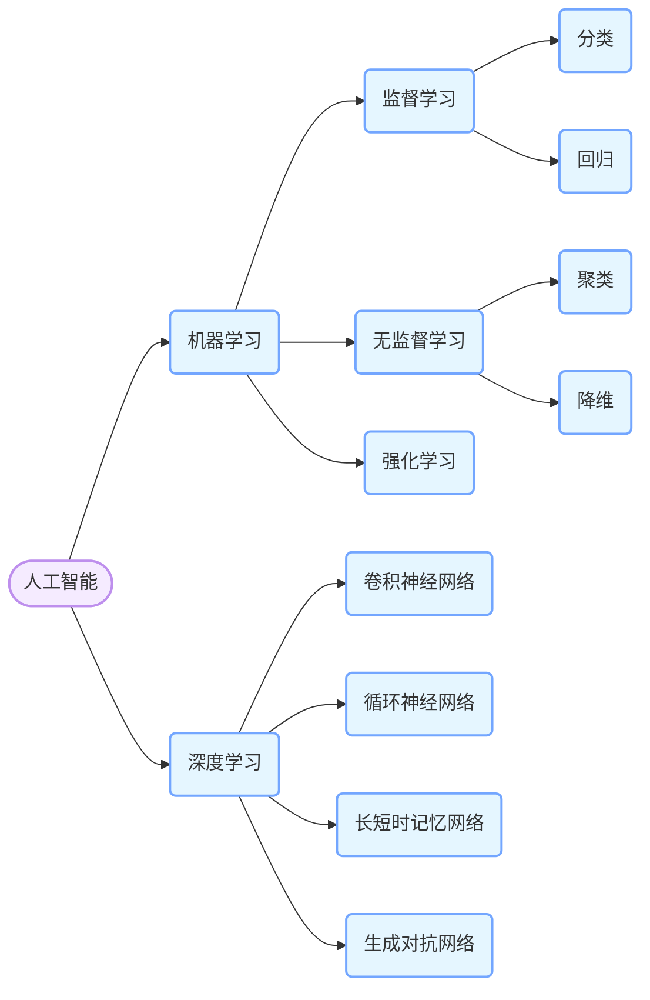

# 程序员如何在AI浪潮中找到新定位与发展机会探索

> 关键词：程序员、AI浪潮、新定位、发展机会、技术转型

> 摘要：随着人工智能（AI）浪潮的兴起，程序员面临着新的挑战与机遇。本文旨在深入探讨程序员如何在这一浪潮中找到新的定位和发展机会。首先介绍相关背景，包括目的、预期读者、文档结构和术语表；接着阐述核心概念与联系，分析AI与程序员工作的关联；详细讲解核心算法原理和操作步骤，结合Python代码进行说明；介绍相关数学模型和公式；通过项目实战展示具体应用；探讨实际应用场景；推荐学习资源、开发工具和相关论文；最后总结未来发展趋势与挑战，提供常见问题解答和扩展阅读参考资料，帮助程序员在AI时代实现职业转型和发展。

## 1. 背景介绍 
### 1.1 目的和范围
在当今科技飞速发展的时代，人工智能已经成为推动各行业变革的重要力量。对于程序员而言，AI浪潮既带来了巨大的冲击，也蕴含着前所未有的发展机遇。本文的目的在于帮助程序员理解AI技术的发展趋势，明确自身在AI浪潮中的新定位，并探索可能的发展机会。范围涵盖了AI的核心概念、算法原理、实际应用场景，以及程序员如何通过学习和实践来适应这一变化。

### 1.2 预期读者
本文主要面向广大程序员群体，无论是初入职场的新手程序员，还是具有一定经验的资深开发者，都能从本文中获得有价值的信息。同时，对于对AI技术感兴趣，希望了解程序员在AI时代发展方向的相关人士也具有一定的参考意义。

### 1.3 文档结构概述
本文将按照以下结构进行阐述：首先介绍背景信息，包括目的、读者和结构概述；接着深入探讨AI的核心概念与联系，通过示意图和流程图进行说明；详细讲解核心算法原理和具体操作步骤，结合Python代码示例；介绍相关数学模型和公式，并举例说明；通过项目实战展示AI技术的实际应用；分析AI的实际应用场景；推荐学习资源、开发工具和相关论文；总结未来发展趋势与挑战；提供常见问题解答和扩展阅读参考资料。

### 1.4 术语表
#### 1.4.1 核心术语定义
- **人工智能（Artificial Intelligence，AI）**：指机器或计算机系统表现出的智能行为，能够模拟人类的认知和决策能力。
- **机器学习（Machine Learning，ML）**：是AI的一个重要分支，通过让计算机从数据中学习模式和规律，从而实现预测和决策。
- **深度学习（Deep Learning，DL）**：是机器学习的一种特殊形式，基于神经网络模型，通过多层神经元的组合来学习数据的复杂特征。
- **神经网络（Neural Network，NN）**：是一种模仿人类神经系统的计算模型，由大量的神经元组成，用于处理和分析数据。
- **强化学习（Reinforcement Learning，RL）**：通过智能体与环境进行交互，根据环境反馈的奖励信号来学习最优行为策略。

#### 1.4.2 相关概念解释
- **数据挖掘（Data Mining）**：从大量数据中发现有价值的信息和知识的过程，与机器学习密切相关。
- **自然语言处理（Natural Language Processing，NLP）**：使计算机能够理解、处理和生成人类语言的技术。
- **计算机视觉（Computer Vision，CV）**：让计算机能够理解和解释图像和视频的技术。
- **大数据（Big Data）**：指海量、高增长率和多样化的数据集，为AI提供了丰富的训练数据。

#### 1.4.3 缩略词列表
| 缩略词 | 全称 | 中文解释 |
| ---- | ---- | ---- |
| AI | Artificial Intelligence | 人工智能 |
| ML | Machine Learning | 机器学习 |
| DL | Deep Learning | 深度学习 |
| NN | Neural Network | 神经网络 |
| RL | Reinforcement Learning | 强化学习 |
| NLP | Natural Language Processing | 自然语言处理 |
| CV | Computer Vision | 计算机视觉 |

## 2. 核心概念与联系 

### 核心概念原理
人工智能是一个广泛的领域，涵盖了多个子领域，其中机器学习和深度学习是最为核心的部分。

机器学习的基本原理是通过对大量数据的学习，构建一个模型，然后使用该模型对新的数据进行预测或分类。例如，在垃圾邮件分类任务中，我们可以收集大量的邮件数据，将其分为垃圾邮件和正常邮件两类，然后使用机器学习算法训练一个分类模型，该模型可以根据邮件的特征（如发件人、主题、内容等）来判断一封新邮件是否为垃圾邮件。

深度学习是机器学习的一种特殊形式，它基于神经网络模型。神经网络由大量的神经元组成，这些神经元按照层次结构排列，形成输入层、隐藏层和输出层。深度学习通过多层神经元的组合，能够自动学习数据的复杂特征，从而在图像识别、语音识别等领域取得了显著的成果。

### 架构的文本示意图
```plaintext
人工智能
├── 机器学习
│   ├── 监督学习
│   │   ├── 分类
│   │   ├── 回归
│   ├── 无监督学习
│   │   ├── 聚类
│   │   ├── 降维
│   ├── 强化学习
├── 深度学习
│   ├── 卷积神经网络（CNN）
│   ├── 循环神经网络（RNN）
│   ├── 长短时记忆网络（LSTM）
│   ├── 生成对抗网络（GAN）
```

### Mermaid流程图


## 3. 核心算法原理 & 具体操作步骤 

### 监督学习 - 线性回归算法原理
线性回归是一种简单而常用的监督学习算法，用于预测连续数值。其基本原理是通过寻找一条直线（在多维空间中是一个超平面），使得数据点到该直线的距离之和最小。

假设我们有一组数据点 $(x_1, y_1), (x_2, y_2), \cdots, (x_n, y_n)$，其中 $x_i$ 是输入特征，$y_i$ 是对应的目标值。线性回归模型可以表示为：

$y = \theta_0 + \theta_1x_1 + \theta_2x_2 + \cdots + \theta_nx_n$

其中 $\theta_0, \theta_1, \cdots, \theta_n$ 是模型的参数。我们的目标是找到一组最优的参数 $\theta$，使得预测值 $\hat{y}$ 与真实值 $y$ 之间的误差最小。通常使用均方误差（Mean Squared Error，MSE）作为损失函数：

$MSE = \frac{1}{n}\sum_{i=1}^{n}(y_i - \hat{y}_i)^2$

### Python代码实现
```python
import numpy as np
from sklearn.linear_model import LinearRegression
from sklearn.metrics import mean_squared_error
from sklearn.model_selection import train_test_split

# 生成一些示例数据
np.random.seed(0)
X = 2 * np.random.rand(100, 1)
y = 4 + 3 * X + np.random.randn(100, 1)

# 划分训练集和测试集
X_train, X_test, y_train, y_test = train_test_split(X, y, test_size=0.2, random_state=42)

# 创建线性回归模型
model = LinearRegression()

# 训练模型
model.fit(X_train, y_train)

# 进行预测
y_pred = model.predict(X_test)

# 计算均方误差
mse = mean_squared_error(y_test, y_pred)
print(f"均方误差: {mse}")
```

### 代码解释
1. **数据生成**：使用 `numpy` 生成一些随机数据，模拟输入特征 $X$ 和目标值 $y$。
2. **数据划分**：使用 `train_test_split` 函数将数据划分为训练集和测试集，比例为 8:2。
3. **模型创建**：创建一个 `LinearRegression` 模型对象。
4. **模型训练**：使用 `fit` 方法对模型进行训练，即找到最优的参数 $\theta$。
5. **模型预测**：使用训练好的模型对测试集进行预测，得到预测值 $\hat{y}$。
6. **误差计算**：使用 `mean_squared_error` 函数计算预测值与真实值之间的均方误差。

## 4. 数学模型和公式 & 详细讲解 & 举例说明 

### 线性回归的数学模型和公式
如前所述，线性回归模型可以表示为：

$y = \theta_0 + \theta_1x_1 + \theta_2x_2 + \cdots + \theta_nx_n$

可以将其写成矩阵形式：

$y = X\theta$

其中 $y$ 是目标值向量，$X$ 是输入特征矩阵，$\theta$ 是参数向量。

均方误差损失函数可以表示为：

$J(\theta) = \frac{1}{2m}(X\theta - y)^T(X\theta - y)$

其中 $m$ 是样本数量。

为了找到最优的参数 $\theta$，我们可以使用梯度下降法。梯度下降法的基本思想是通过不断迭代，沿着损失函数的负梯度方向更新参数，直到损失函数达到最小值。

参数更新公式为：

$\theta := \theta - \alpha\frac{\partial J(\theta)}{\partial \theta}$

其中 $\alpha$ 是学习率，控制每次迭代的步长。

### 详细讲解
梯度下降法的关键在于计算损失函数的梯度。对 $J(\theta)$ 求偏导数：

$\frac{\partial J(\theta)}{\partial \theta} = \frac{1}{m}X^T(X\theta - y)$

将其代入参数更新公式，得到：

$\theta := \theta - \frac{\alpha}{m}X^T(X\theta - y)$

### 举例说明
假设我们有以下数据：

| $x$ | $y$ |
| ---- | ---- |
| 1 | 3 |
| 2 | 5 |
| 3 | 7 |

我们可以使用线性回归模型 $y = \theta_0 + \theta_1x$ 来拟合这些数据。

首先，将数据转换为矩阵形式：

$X = \begin{bmatrix} 1 & 1 \\ 1 & 2 \\ 1 & 3 \end{bmatrix}$

$y = \begin{bmatrix} 3 \\ 5 \\ 7 \end{bmatrix}$

初始化参数 $\theta = \begin{bmatrix} 0 \\ 0 \end{bmatrix}$，学习率 $\alpha = 0.01$。

进行迭代更新：

第一次迭代：

$\frac{\partial J(\theta)}{\partial \theta} = \frac{1}{3}X^T(X\theta - y) = \frac{1}{3}\begin{bmatrix} 1 & 1 & 1 \\ 1 & 2 & 3 \end{bmatrix}\begin{bmatrix} -3 \\ -5 \\ -7 \end{bmatrix} = \begin{bmatrix} -5 \\ -11 \end{bmatrix}$

$\theta := \theta - \alpha\frac{\partial J(\theta)}{\partial \theta} = \begin{bmatrix} 0 \\ 0 \end{bmatrix} - 0.01\begin{bmatrix} -5 \\ -11 \end{bmatrix} = \begin{bmatrix} 0.05 \\ 0.11 \end{bmatrix}$

经过多次迭代，参数 $\theta$ 会逐渐收敛到最优值。

## 5. 项目实战：代码实际案例和详细解释说明 

### 5.1  开发环境搭建
#### 安装Python
首先，需要安装Python解释器。可以从Python官方网站（https://www.python.org/downloads/）下载适合自己操作系统的Python版本。建议安装Python 3.7及以上版本。

#### 安装必要的库
使用 `pip` 包管理工具安装必要的库，包括 `numpy`、`pandas`、`scikit-learn`、`tensorflow` 等。

```bash
pip install numpy pandas scikit-learn tensorflow
```

### 5.2  源代码详细实现和代码解读
#### 项目背景
我们将实现一个简单的手写数字识别项目，使用 `tensorflow` 库构建一个卷积神经网络（CNN）模型。

#### 代码实现
```python
import tensorflow as tf
from tensorflow.keras.datasets import mnist
from tensorflow.keras.models import Sequential
from tensorflow.keras.layers import Conv2D, MaxPooling2D, Flatten, Dense
from tensorflow.keras.utils import to_categorical

# 加载MNIST数据集
(train_images, train_labels), (test_images, test_labels) = mnist.load_data()

# 数据预处理
train_images = train_images.reshape((60000, 28, 28, 1)).astype('float32') / 255
test_images = test_images.reshape((10000, 28, 28, 1)).astype('float32') / 255

train_labels = to_categorical(train_labels)
test_labels = to_categorical(test_labels)

# 构建卷积神经网络模型
model = Sequential([
    Conv2D(32, (3, 3), activation='relu', input_shape=(28, 28, 1)),
    MaxPooling2D((2, 2)),
    Conv2D(64, (3, 3), activation='relu'),
    MaxPooling2D((2, 2)),
    Flatten(),
    Dense(64, activation='relu'),
    Dense(10, activation='softmax')
])

# 编译模型
model.compile(optimizer='adam',
              loss='categorical_crossentropy',
              metrics=['accuracy'])

# 训练模型
model.fit(train_images, train_labels, epochs=5, batch_size=64)

# 评估模型
test_loss, test_acc = model.evaluate(test_images, test_labels)
print(f"测试集准确率: {test_acc}")
```

#### 代码解读
1. **数据加载**：使用 `mnist.load_data()` 函数加载MNIST手写数字数据集，该数据集包含60000个训练样本和10000个测试样本。
2. **数据预处理**：将图像数据的形状调整为 `(样本数量, 高度, 宽度, 通道数)`，并将像素值归一化到0-1之间。将标签数据进行one-hot编码。
3. **模型构建**：使用 `Sequential` 模型构建一个卷积神经网络，包含卷积层、池化层、全连接层等。
4. **模型编译**：使用 `adam` 优化器、`categorical_crossentropy` 损失函数和 `accuracy` 指标编译模型。
5. **模型训练**：使用 `fit` 方法对模型进行训练，指定训练数据、训练轮数和批量大小。
6. **模型评估**：使用 `evaluate` 方法对模型在测试集上的性能进行评估，输出测试集的损失和准确率。

### 5.3  代码解读与分析
#### 卷积层
卷积层是卷积神经网络的核心层，用于提取图像的特征。在代码中，我们使用 `Conv2D` 层，指定卷积核的数量、大小和激活函数。卷积核在图像上滑动，进行卷积操作，提取图像的局部特征。

#### 池化层
池化层用于减少特征图的尺寸，降低计算量，同时增强模型的鲁棒性。在代码中，我们使用 `MaxPooling2D` 层，通过取最大值的方式进行池化操作。

#### 全连接层
全连接层将卷积层和池化层提取的特征进行整合，输出最终的分类结果。在代码中，我们使用 `Dense` 层，指定神经元的数量和激活函数。

#### 激活函数
激活函数用于引入非线性因素，增强模型的表达能力。在代码中，我们使用 `relu` 激活函数和 `softmax` 激活函数。`relu` 函数在卷积层和全连接层中使用，`softmax` 函数在输出层中使用，用于输出每个类别的概率。

## 6. 实际应用场景 
### 图像识别
AI技术在图像识别领域有着广泛的应用，如人脸识别、物体检测、医学图像分析等。程序员可以参与开发各种图像识别系统，如安防监控系统中的人脸识别模块、电商平台中的商品图像搜索功能等。

### 自然语言处理
自然语言处理是AI的另一个重要应用领域，包括机器翻译、语音识别、文本分类、情感分析等。程序员可以开发聊天机器人、智能客服系统、智能写作助手等应用，提高人们的沟通效率和信息处理能力。

### 智能推荐系统
智能推荐系统根据用户的历史行为和偏好，为用户推荐个性化的内容和商品。在电商、社交、新闻等领域都有广泛的应用。程序员可以参与开发推荐算法和系统，提高用户的满意度和平台的转化率。

### 自动驾驶
自动驾驶是AI技术的一个前沿应用领域，涉及计算机视觉、传感器技术、决策规划等多个方面。程序员可以参与开发自动驾驶系统的算法和软件，推动交通运输行业的变革。

### 金融科技
在金融领域，AI技术可以用于风险评估、欺诈检测、投资决策等。程序员可以开发金融数据分析系统、智能投资顾问等应用，提高金融行业的效率和安全性。

## 7. 工具和资源推荐
### 7.1 学习资源推荐
#### 7.1.1 书籍推荐
- 《Python机器学习》：介绍了Python在机器学习中的应用，包括各种机器学习算法的原理和实现。
- 《深度学习》：由深度学习领域的三位顶尖专家撰写，系统地介绍了深度学习的理论和实践。
- 《人工智能：一种现代的方法》：全面介绍了人工智能的各个领域，是人工智能领域的经典教材。

#### 7.1.2 在线课程
- Coursera上的《机器学习》课程：由斯坦福大学教授Andrew Ng主讲，是机器学习领域的经典课程。
- edX上的《深度学习》课程：由麻省理工学院等高校的教授主讲，深入介绍了深度学习的原理和应用。
- 阿里云天池的AI实战营：提供了丰富的AI实战项目和教程，帮助学习者快速掌握AI技术。

#### 7.1.3 技术博客和网站
- Medium：是一个技术博客平台，有很多AI领域的优秀文章和教程。
- Towards Data Science：专注于数据科学和机器学习领域，提供了大量的技术文章和案例分析。
- Kaggle：是一个数据科学竞赛平台，有很多公开的数据集和优秀的解决方案，可以学习到很多实际应用的技巧。

### 7.2 开发工具框架推荐
#### 7.2.1 IDE和编辑器
- PyCharm：是一款专门为Python开发设计的集成开发环境，具有丰富的功能和插件，提高开发效率。
- Jupyter Notebook：是一个交互式的开发环境，适合进行数据探索和模型实验。
- Visual Studio Code：是一款轻量级的代码编辑器，支持多种编程语言和插件，非常适合快速开发。

#### 7.2.2 调试和性能分析工具
- TensorBoard：是TensorFlow提供的一个可视化工具，用于监控模型的训练过程和性能。
- PyTorch Profiler：是PyTorch提供的性能分析工具，用于分析模型的运行时间和内存使用情况。
- cProfile：是Python自带的性能分析工具，用于分析Python代码的运行时间和函数调用情况。

#### 7.2.3 相关框架和库
- TensorFlow：是Google开发的一个开源深度学习框架，具有强大的计算能力和丰富的工具。
- PyTorch：是Facebook开发的一个开源深度学习框架，具有动态图机制，易于使用和调试。
- Scikit-learn：是一个简单易用的机器学习库，提供了各种机器学习算法和工具。
- NLTK：是一个自然语言处理库，提供了丰富的语料库和工具，用于处理和分析自然语言。

### 7.3 相关论文著作推荐
#### 7.3.1 经典论文
- 《ImageNet Classification with Deep Convolutional Neural Networks》：介绍了AlexNet卷积神经网络，开启了深度学习在图像识别领域的热潮。
- 《Long Short-Term Memory》：介绍了长短时记忆网络（LSTM），解决了传统循环神经网络的梯度消失问题。
- 《Generative Adversarial Networks》：介绍了生成对抗网络（GAN），开创了生成式模型的新领域。

#### 7.3.2 最新研究成果
- 关注顶级学术会议，如NeurIPS、ICML、CVPR等，这些会议上会发布很多最新的研究成果。
- 关注知名学术期刊，如Journal of Artificial Intelligence Research（JAIR）、Artificial Intelligence等，这些期刊上会发表很多高质量的研究论文。

#### 7.3.3 应用案例分析
- 《AI in Practice: How 50 Successful Companies Used Artificial Intelligence to Solve Problems》：介绍了50个成功的AI应用案例，分析了AI在不同行业的应用模式和经验。
- 《Deep Learning in Practice: A Hands-On Guide to Building Neural Network Models Using Python and TensorFlow》：通过实际案例介绍了如何使用Python和TensorFlow构建深度学习模型。

## 8. 总结：未来发展趋势与挑战
### 未来发展趋势
- **融合发展**：AI技术将与物联网、大数据、云计算等技术深度融合，形成更加智能的系统和解决方案。
- **行业应用深化**：AI将在更多行业得到广泛应用，如医疗、教育、农业等，推动各行业的数字化转型和升级。
- **模型小型化和边缘计算**：随着硬件技术的发展，模型小型化和边缘计算将成为趋势，使得AI应用可以在资源受限的设备上运行。
- **可解释性和可信AI**：人们对AI系统的可解释性和可信度要求越来越高，未来的研究将更加注重开发可解释的AI模型和方法。

### 挑战
- **数据隐私和安全**：AI系统需要大量的数据进行训练，数据隐私和安全问题成为了一个重要的挑战。
- **算法偏见**：AI算法可能存在偏见，导致不公平的结果，需要开发公平、无偏见的算法。
- **人才短缺**：AI领域的快速发展导致了人才短缺，程序员需要不断学习和提升自己的技能，以适应市场的需求。
- **伦理和法律问题**：AI的发展带来了一系列伦理和法律问题，如自动驾驶汽车的责任认定、AI系统的决策责任等，需要建立相应的伦理和法律框架。

## 9. 附录：常见问题与解答
### 问题1：程序员需要具备哪些基础知识才能进入AI领域？
答：程序员需要具备扎实的数学基础，包括线性代数、概率论、微积分等。同时，需要掌握一门编程语言，如Python，以及相关的机器学习和深度学习库，如Scikit-learn、TensorFlow、PyTorch等。

### 问题2：如何选择适合自己的AI学习路径？
答：可以根据自己的兴趣和职业规划选择学习路径。如果对图像识别感兴趣，可以学习计算机视觉相关的知识和技术；如果对自然语言处理感兴趣，可以学习自然语言处理相关的知识和技术。同时，可以通过参加在线课程、阅读相关书籍和论文、参与开源项目等方式进行学习。

### 问题3：AI技术会取代程序员吗？
答：AI技术不会取代程序员，而是会改变程序员的工作方式和职业定位。程序员可以利用AI技术提高开发效率，开发更加智能的软件系统。同时，程序员也需要不断学习和提升自己的技能，以适应AI时代的发展。

### 问题4：如何评估一个AI模型的性能？
答：可以使用不同的评估指标来评估AI模型的性能，如准确率、召回率、F1值、均方误差等。具体选择哪个评估指标取决于具体的应用场景。同时，还可以使用交叉验证等方法来评估模型的泛化能力。

## 10. 扩展阅读 & 参考资料
### 扩展阅读
- 《AI未来进行式》：探讨了AI技术对社会和人类的影响，以及未来的发展趋势。
- 《智能时代》：介绍了AI技术在各个领域的应用，以及如何在智能时代中取得成功。

### 参考资料
- 《Python机器学习实战》
- 《深度学习实战：基于TensorFlow和Keras》
- 相关学术论文和研究报告

通过以上内容，程序员可以全面了解在AI浪潮中如何找到新的定位和发展机会，通过学习和实践不断提升自己的能力，适应AI时代的发展。