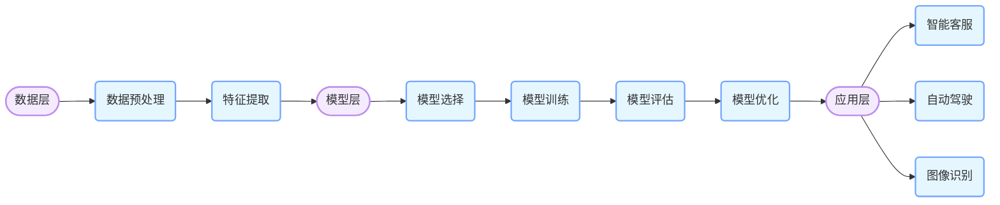

# 程序员如何在AI浪潮中找到机会

> 关键词：程序员、AI浪潮、机会、人工智能、技术转型、职业发展、创新应用

> 摘要：随着人工智能（AI）浪潮的汹涌来袭，整个科技行业正经历着前所未有的变革。对于程序员而言，这既是充满挑战的时代，也是蕴含无限机遇的时代。本文旨在深入剖析程序员在AI浪潮中可能遇到的各种机会，从核心概念与联系的阐述，到核心算法原理及具体操作步骤的讲解，再到结合数学模型和公式的深入分析，以及项目实战案例的详细解读，全方位探讨程序员如何在AI领域找到适合自己的发展路径。同时，介绍AI在实际应用中的场景，推荐相关的学习工具和资源，最后总结未来发展趋势与挑战，为程序员在AI浪潮中把握机会提供全面而深入的指导。

## 1. 背景介绍 
### 1.1 目的和范围
本文章的主要目的是为广大程序员提供在AI浪潮中寻找机会的全面指南。我们将探讨AI技术的各个方面，包括其核心概念、算法原理、数学模型等，以及如何将这些知识应用到实际项目中。范围涵盖了从基础理论到实际应用的各个层面，旨在帮助程序员了解AI技术的全貌，并找到适合自己的发展方向。

### 1.2 预期读者
本文预期读者主要是广大程序员群体，包括有一定编程基础但对AI技术了解有限的初级程序员，以及希望在AI领域拓展技能的中高级程序员。同时，对AI技术感兴趣的相关从业者和技术爱好者也可以从本文中获取有价值的信息。

### 1.3 文档结构概述
本文将按照以下结构进行阐述：首先介绍背景知识，包括目的、预期读者和文档结构概述等内容；接着深入探讨AI的核心概念与联系，通过文本示意图和Mermaid流程图进行详细说明；然后讲解核心算法原理和具体操作步骤，并结合Python源代码进行详细阐述；再介绍数学模型和公式，并通过举例进行详细讲解；之后通过项目实战案例，包括开发环境搭建、源代码实现和代码解读等，让读者更好地理解AI技术的实际应用；接着介绍AI的实际应用场景；随后推荐相关的学习工具和资源；最后总结未来发展趋势与挑战，并提供常见问题与解答以及扩展阅读和参考资料。

### 1.4 术语表
#### 1.4.1 核心术语定义
- **人工智能（AI）**：指计算机系统能够执行通常需要人类智能才能完成的任务，如学习、推理、解决问题等。
- **机器学习（ML）**：是AI的一个分支，它使计算机能够从数据中学习模式和规律，而无需明确的编程指令。
- **深度学习（DL）**：是机器学习的一个子领域，基于人工神经网络，尤其是深度神经网络，能够自动从大量数据中学习复杂的模式和特征。
- **神经网络（NN）**：是一种模仿人类神经系统的计算模型，由大量的神经元组成，用于处理和分析数据。
- **强化学习（RL）**：是一种机器学习方法，智能体通过与环境进行交互，根据环境反馈的奖励信号来学习最优行为策略。

#### 1.4.2 相关概念解释
- **数据挖掘**：从大量数据中发现有价值信息和知识的过程，通常使用机器学习和统计方法。
- **自然语言处理（NLP）**：使计算机能够理解、处理和生成人类语言的技术，是AI的重要应用领域之一。
- **计算机视觉（CV）**：让计算机能够理解和解释图像和视频内容的技术，广泛应用于图像识别、目标检测等领域。

#### 1.4.3 缩略词列表
- **AI**：Artificial Intelligence（人工智能）
- **ML**：Machine Learning（机器学习）
- **DL**：Deep Learning（深度学习）
- **NN**：Neural Network（神经网络）
- **RL**：Reinforcement Learning（强化学习）
- **NLP**：Natural Language Processing（自然语言处理）
- **CV**：Computer Vision（计算机视觉）

## 2. 核心概念与联系 

### 核心概念原理
人工智能是一个广泛的领域，它包含了多个子领域，其中机器学习、深度学习和强化学习是其核心组成部分。

- **机器学习**：机器学习的基本原理是通过对数据的学习来构建模型，从而对未知数据进行预测或分类。例如，在垃圾邮件分类中，我们可以使用机器学习算法对大量的邮件数据进行学习，构建一个分类模型，该模型可以根据邮件的特征判断其是否为垃圾邮件。
- **深度学习**：深度学习是基于人工神经网络的机器学习方法。深度神经网络由多个层次的神经元组成，能够自动从数据中学习复杂的特征表示。例如，在图像识别中，深度卷积神经网络可以自动学习图像的特征，从而实现对图像中物体的分类和识别。
- **强化学习**：强化学习是一种通过智能体与环境进行交互来学习最优行为策略的方法。智能体在环境中采取行动，环境会根据智能体的行动给予相应的奖励或惩罚，智能体通过不断地尝试和学习，逐渐找到能够获得最大奖励的行为策略。例如，在机器人控制中，强化学习可以用于训练机器人在复杂环境中完成任务。

### 架构的文本示意图
人工智能的架构可以分为数据层、模型层和应用层。

- **数据层**：是人工智能的基础，包含了各种类型的数据，如文本、图像、音频等。这些数据需要进行预处理，包括清洗、标注、特征提取等操作，以便为模型层提供高质量的输入数据。
- **模型层**：是人工智能的核心，包含了各种机器学习和深度学习模型，如决策树、支持向量机、神经网络等。这些模型通过对数据层提供的数据进行学习和训练，构建出能够解决特定问题的模型。
- **应用层**：是人工智能的最终目标，将模型层训练好的模型应用到实际场景中，如智能客服、自动驾驶、图像识别等。

### Mermaid流程图


## 3. 核心算法原理 & 具体操作步骤 

### 线性回归算法原理
线性回归是一种基本的机器学习算法，用于预测连续数值的输出。其基本原理是通过寻找一条直线（在多维空间中是一个超平面），使得所有数据点到该直线的距离之和最小。线性回归的数学模型可以表示为：

$$y = \theta_0 + \theta_1x_1 + \theta_2x_2 + \cdots + \theta_nx_n + \epsilon$$

其中，$y$ 是预测值，$x_1, x_2, \cdots, x_n$ 是输入特征，$\theta_0, \theta_1, \cdots, \theta_n$ 是模型的参数，$\epsilon$ 是误差项。

### 具体操作步骤
1. **数据准备**：收集和整理用于训练和测试的数据集，将数据集分为输入特征 $X$ 和目标值 $y$。
2. **模型初始化**：随机初始化模型的参数 $\theta$。
3. **损失函数定义**：定义损失函数，用于衡量模型预测值与真实值之间的误差。常用的损失函数是均方误差（MSE）：

$$MSE = \frac{1}{m}\sum_{i=1}^{m}(y^{(i)} - \hat{y}^{(i)})^2$$

其中，$m$ 是样本数量，$y^{(i)}$ 是第 $i$ 个样本的真实值，$\hat{y}^{(i)}$ 是第 $i$ 个样本的预测值。

4. **参数更新**：使用梯度下降算法更新模型的参数，使得损失函数的值逐渐减小。梯度下降算法的更新公式为：

$$\theta_j := \theta_j - \alpha\frac{\partial}{\partial\theta_j}MSE(\theta)$$

其中，$\alpha$ 是学习率，控制参数更新的步长。

5. **模型评估**：使用测试数据集对训练好的模型进行评估，计算模型的性能指标，如均方误差、决定系数等。

### Python源代码实现
```python
import numpy as np

class LinearRegression:
    def __init__(self, learning_rate=0.01, num_iterations=1000):
        self.learning_rate = learning_rate
        self.num_iterations = num_iterations
        self.weights = None
        self.bias = None

    def fit(self, X, y):
        num_samples, num_features = X.shape
        self.weights = np.zeros(num_features)
        self.bias = 0

        for _ in range(self.num_iterations):
            y_pred = np.dot(X, self.weights) + self.bias

            dw = (1 / num_samples) * np.dot(X.T, (y_pred - y))
            db = (1 / num_samples) * np.sum(y_pred - y)

            self.weights -= self.learning_rate * dw
            self.bias -= self.learning_rate * db

    def predict(self, X):
        return np.dot(X, self.weights) + self.bias
```

### 代码解释
- `__init__` 方法：初始化模型的学习率和迭代次数，以及模型的权重和偏置。
- `fit` 方法：使用梯度下降算法训练模型，更新模型的权重和偏置。
- `predict` 方法：根据训练好的模型，对输入数据进行预测。

## 4. 数学模型和公式 & 详细讲解 & 举例说明 

### 逻辑回归的数学模型
逻辑回归是一种用于分类问题的机器学习算法，它通过将线性回归的输出通过逻辑函数（也称为Sigmoid函数）进行转换，得到一个概率值，用于判断样本属于某个类别的概率。逻辑回归的数学模型可以表示为：

$$h_{\theta}(x) = \frac{1}{1 + e^{-\theta^Tx}}$$

其中，$h_{\theta}(x)$ 是模型的输出，表示样本属于正类的概率，$\theta$ 是模型的参数，$x$ 是输入特征。

### 损失函数
逻辑回归使用对数损失函数（也称为交叉熵损失函数）来衡量模型预测值与真实值之间的误差。对数损失函数的公式为：

$$J(\theta) = -\frac{1}{m}\sum_{i=1}^{m}[y^{(i)}\log(h_{\theta}(x^{(i)})) + (1 - y^{(i)})\log(1 - h_{\theta}(x^{(i)}))]$$

其中，$m$ 是样本数量，$y^{(i)}$ 是第 $i$ 个样本的真实标签（0或1），$h_{\theta}(x^{(i)})$ 是第 $i$ 个样本的预测概率。

### 梯度下降更新公式
为了最小化损失函数，我们使用梯度下降算法更新模型的参数。梯度下降的更新公式为：

$$\theta_j := \theta_j - \alpha\frac{\partial}{\partial\theta_j}J(\theta)$$

其中，$\alpha$ 是学习率，$\frac{\partial}{\partial\theta_j}J(\theta)$ 是损失函数关于参数 $\theta_j$ 的偏导数。

### 举例说明
假设我们有一个二分类问题，要判断一个人是否患有某种疾病。我们收集了一些人的特征数据，如年龄、血压、血糖等，以及他们是否患有疾病的标签（0表示未患病，1表示患病）。我们可以使用逻辑回归模型来对这些数据进行训练，然后根据训练好的模型对新的样本进行预测。

```python
import numpy as np

def sigmoid(z):
    return 1 / (1 + np.exp(-z))

def cost_function(X, y, theta):
    m = len(y)
    h = sigmoid(np.dot(X, theta))
    cost = (-1 / m) * np.sum(y * np.log(h) + (1 - y) * np.log(1 - h))
    return cost

def gradient_descent(X, y, theta, alpha, num_iterations):
    m = len(y)
    costs = []

    for _ in range(num_iterations):
        h = sigmoid(np.dot(X, theta))
        gradient = (1 / m) * np.dot(X.T, (h - y))
        theta -= alpha * gradient
        cost = cost_function(X, y, theta)
        costs.append(cost)

    return theta, costs
```

### 代码解释
- `sigmoid` 函数：实现了Sigmoid函数，用于将线性回归的输出转换为概率值。
- `cost_function` 函数：计算逻辑回归的损失函数值。
- `gradient_descent` 函数：使用梯度下降算法更新模型的参数，并记录每次迭代的损失函数值。

## 5. 项目实战：代码实际案例和详细解释说明 

### 5.1  开发环境搭建
本项目使用Python进行开发，需要安装以下库：
- **NumPy**：用于数值计算。
- **Pandas**：用于数据处理和分析。
- **Scikit-learn**：用于机器学习模型的构建和评估。
- **Matplotlib**：用于数据可视化。

可以使用以下命令安装这些库：
```sh
pip install numpy pandas scikit-learn matplotlib
```

### 5.2  源代码详细实现和代码解读
我们将使用鸢尾花数据集进行分类任务，该数据集包含了鸢尾花的四个特征（花萼长度、花萼宽度、花瓣长度、花瓣宽度）和三个类别（Setosa、Versicolour、Virginica）。

```python
import numpy as np
import pandas as pd
from sklearn.datasets import load_iris
from sklearn.model_selection import train_test_split
from sklearn.preprocessing import StandardScaler
from sklearn.linear_model import LogisticRegression
from sklearn.metrics import accuracy_score
import matplotlib.pyplot as plt

# 加载鸢尾花数据集
iris = load_iris()
X = iris.data
y = iris.target

# 划分训练集和测试集
X_train, X_test, y_train, y_test = train_test_split(X, y, test_size=0.2, random_state=42)

# 数据标准化
scaler = StandardScaler()
X_train = scaler.fit_transform(X_train)
X_test = scaler.transform(X_test)

# 构建逻辑回归模型
model = LogisticRegression()
model.fit(X_train, y_train)

# 预测
y_pred = model.predict(X_test)

# 计算准确率
accuracy = accuracy_score(y_test, y_pred)
print(f"Accuracy: {accuracy}")

# 可视化结果
plt.figure(figsize=(8, 6))
plt.scatter(X_test[:, 0], X_test[:, 1], c=y_pred, cmap='viridis')
plt.xlabel('Sepal Length')
plt.ylabel('Sepal Width')
plt.title('Iris Classification Results')
plt.show()
```

### 5.3  代码解读与分析
1. **数据加载**：使用 `load_iris` 函数加载鸢尾花数据集，并将特征数据和标签数据分别存储在 `X` 和 `y` 中。
2. **数据划分**：使用 `train_test_split` 函数将数据集划分为训练集和测试集，测试集占总数据集的20%。
3. **数据标准化**：使用 `StandardScaler` 对训练集和测试集进行标准化处理，使得数据具有零均值和单位方差。
4. **模型构建与训练**：使用 `LogisticRegression` 构建逻辑回归模型，并使用训练集对模型进行训练。
5. **模型预测**：使用训练好的模型对测试集进行预测，得到预测结果 `y_pred`。
6. **模型评估**：使用 `accuracy_score` 计算模型的准确率，并打印输出。
7. **结果可视化**：使用 `matplotlib` 绘制散点图，将测试集的样本根据预测结果进行着色，直观展示分类结果。

## 6. 实际应用场景 
### 自然语言处理领域
- **智能客服**：利用自然语言处理技术，实现智能客服系统，能够自动回答用户的问题，提高客户服务效率。例如，淘宝、京东等电商平台的智能客服，可以快速解答用户关于商品信息、订单状态等问题。
- **机器翻译**：通过深度学习模型，实现不同语言之间的自动翻译。如谷歌翻译、百度翻译等，能够提供多种语言的翻译服务。
- **文本摘要**：对长篇文本进行自动摘要，提取关键信息。例如，新闻网站可以使用文本摘要技术，快速生成新闻的摘要，方便用户快速了解新闻内容。

### 计算机视觉领域
- **图像识别**：用于识别图像中的物体、场景等。例如，安防监控系统可以使用图像识别技术，识别监控画面中的人物、车辆等目标。
- **目标检测**：在图像或视频中检测出特定目标的位置和类别。例如，自动驾驶汽车中的目标检测系统，可以检测出道路上的行人、车辆、交通标志等。
- **人脸识别**：用于识别和验证人的身份。例如，手机的人脸识别解锁功能、门禁系统的人脸识别功能等。

### 医疗领域
- **疾病诊断**：利用机器学习和深度学习技术，对医学影像（如X光、CT、MRI等）进行分析，辅助医生进行疾病诊断。例如，一些医疗公司开发的AI诊断系统，可以帮助医生快速准确地诊断肺癌、乳腺癌等疾病。
- **药物研发**：通过分析大量的生物数据和药物信息，加速药物研发过程。例如，利用AI技术可以预测药物的疗效和副作用，筛选出更有潜力的药物候选物。

### 金融领域
- **风险评估**：使用机器学习算法对客户的信用风险进行评估，帮助金融机构做出更准确的信贷决策。例如，银行可以根据客户的收入、资产、信用记录等信息，使用风险评估模型预测客户的违约概率。
- **股票预测**：通过分析历史股票数据和市场信息，预测股票价格的走势。虽然股票市场具有很高的不确定性，但一些AI模型可以提供一定的参考和决策支持。

## 7. 工具和资源推荐
### 7.1 学习资源推荐
#### 7.1.1 书籍推荐
- 《机器学习》（周志华著）：这本书是机器学习领域的经典教材，全面介绍了机器学习的基本概念、算法和应用。
- 《深度学习》（Ian Goodfellow、Yoshua Bengio和Aaron Courville著）：由深度学习领域的三位顶尖专家撰写，系统地介绍了深度学习的理论和实践。
- 《Python机器学习》（Sebastian Raschka著）：结合Python语言，详细介绍了机器学习的算法和实现，适合初学者入门。

#### 7.1.2 在线课程
- **Coursera上的“机器学习”课程**：由斯坦福大学的Andrew Ng教授授课，是机器学习领域最受欢迎的在线课程之一。
- **EdX上的“深度学习”系列课程**：由知名学者和专家授课，深入介绍了深度学习的各个方面。
- **Udemy上的“Python for Data Science and Machine Learning Bootcamp”**：通过实际项目，帮助学习者掌握Python在数据科学和机器学习中的应用。

#### 7.1.3 技术博客和网站
- **Medium**：上面有很多关于AI和机器学习的技术文章和教程，作者来自世界各地的专业人士。
- **Towards Data Science**：专注于数据科学和机器学习领域的技术博客，提供了很多有价值的文章和案例。
- **AI开源社区**：如GitHub上的各种AI项目和开源代码库，可以学习到最新的技术和实践经验。

### 7.2 开发工具框架推荐
#### 7.2.1 IDE和编辑器
- **PyCharm**：是一款专门为Python开发设计的集成开发环境，具有强大的代码编辑、调试和项目管理功能。
- **Jupyter Notebook**：是一个交互式的开发环境，适合进行数据探索、模型训练和结果展示。
- **VS Code**：是一款轻量级的代码编辑器，支持多种编程语言和插件扩展，非常适合快速开发和调试。

#### 7.2.2 调试和性能分析工具
- **TensorBoard**：是TensorFlow的可视化工具，用于监控模型训练过程中的各种指标，如损失函数值、准确率等。
- **PyTorch Profiler**：用于分析PyTorch模型的性能瓶颈，帮助开发者优化模型的训练和推理速度。
- **Scikit-learn的GridSearchCV**：用于超参数调优，通过网格搜索的方式找到最优的模型参数。

#### 7.2.3 相关框架和库
- **TensorFlow**：是谷歌开发的开源深度学习框架，具有广泛的应用和丰富的工具库。
- **PyTorch**：是Facebook开发的开源深度学习框架，以其简洁的API和动态图机制受到很多开发者的喜爱。
- **Scikit-learn**：是一个简单易用的机器学习库，提供了各种机器学习算法和工具，适合初学者和快速原型开发。

### 7.3 相关论文著作推荐
#### 7.3.1 经典论文
- **“Gradient-Based Learning Applied to Document Recognition”**：由Yann LeCun等人发表，介绍了卷积神经网络（CNN）在手写数字识别中的应用，开创了深度学习在计算机视觉领域的先河。
- **“ImageNet Classification with Deep Convolutional Neural Networks”**：由Alex Krizhevsky等人发表，提出了AlexNet模型，在ImageNet图像分类竞赛中取得了巨大成功，推动了深度学习的发展。
- **“Attention Is All You Need”**：由Vaswani等人发表，提出了Transformer模型，在自然语言处理领域引起了巨大的变革。

#### 7.3.2 最新研究成果
- 可以关注顶级学术会议如NeurIPS（神经信息处理系统大会）、ICML（国际机器学习会议）、CVPR（计算机视觉与模式识别会议）等的最新论文，了解AI领域的最新研究动态。
- 一些知名的研究机构和实验室，如OpenAI、DeepMind等，也会发布最新的研究成果和技术报告。

#### 7.3.3 应用案例分析
- 可以参考一些知名公司的AI应用案例，如谷歌的搜索引擎、亚马逊的推荐系统、特斯拉的自动驾驶技术等，学习他们在实际应用中的经验和技术实现。
- 一些行业报告和白皮书也会介绍AI在不同领域的应用案例和发展趋势，可以从中获取有价值的信息。

## 8. 总结：未来发展趋势与挑战
### 未来发展趋势
- **AI与其他技术的融合**：AI将与物联网、区块链、5G等技术深度融合，创造出更多的创新应用场景。例如，物联网设备产生的大量数据可以为AI模型提供更多的训练数据，而AI技术可以对这些数据进行分析和处理，实现智能决策和控制。
- **AI的民主化**：随着AI技术的不断发展和普及，越来越多的开发者和企业将能够使用AI技术。低代码和无代码的AI开发平台将使得非专业的开发者也能够轻松地构建和部署AI应用。
- **AI的伦理和法律问题**：随着AI技术的广泛应用，AI的伦理和法律问题将越来越受到关注。例如，AI算法的公平性、透明度和可解释性，以及AI系统的责任认定等问题，都需要建立相应的伦理和法律框架来规范。

### 挑战
- **数据隐私和安全**：AI模型的训练需要大量的数据，而这些数据往往包含了用户的个人隐私信息。如何保护数据的隐私和安全，防止数据泄露和滥用，是AI发展面临的重要挑战之一。
- **算法的可解释性**：很多深度学习模型是黑盒模型，其决策过程难以理解和解释。在一些关键领域，如医疗、金融等，算法的可解释性至关重要，需要开发更加可解释的AI算法。
- **人才短缺**：AI领域的快速发展导致了对专业人才的需求急剧增加，而目前AI领域的人才短缺问题较为严重。培养更多的AI专业人才，提高现有程序员的AI技能水平，是推动AI发展的关键。

## 9. 附录：常见问题与解答
### 问题1：我是一名没有AI经验的程序员，如何入门AI？
**解答**：可以从学习基础知识开始，如线性代数、概率论、统计学等数学知识，以及Python编程语言。然后选择一些在线课程或书籍进行系统学习，如Coursera上的“机器学习”课程、《机器学习》这本书。同时，可以通过实践项目来巩固所学知识，如使用Scikit-learn库进行简单的机器学习项目实践。

### 问题2：AI技术对我的现有编程技能有什么要求？
**解答**：AI技术通常需要掌握Python编程语言，因为Python有很多丰富的机器学习和深度学习库，如Scikit-learn、TensorFlow、PyTorch等。此外，还需要具备一定的算法和数据结构知识，以及良好的编程习惯和代码调试能力。

### 问题3：如何选择适合自己的AI框架？
**解答**：选择AI框架需要考虑多个因素，如项目需求、个人喜好、社区支持等。如果是初学者，建议选择Scikit-learn，它简单易用，适合快速原型开发。如果要进行深度学习项目，可以选择TensorFlow或PyTorch，TensorFlow具有广泛的应用和丰富的工具库，PyTorch则以其简洁的API和动态图机制受到很多开发者的喜爱。

### 问题4：AI技术在实际应用中会遇到哪些问题？
**解答**：AI技术在实际应用中可能会遇到数据质量问题、模型过拟合或欠拟合问题、计算资源不足问题、算法的可解释性问题等。需要针对不同的问题采取相应的解决措施，如数据预处理、模型调优、使用分布式计算等。

### 问题5：如何提高自己在AI领域的竞争力？
**解答**：可以通过不断学习和实践来提高自己在AI领域的竞争力。学习最新的AI技术和算法，关注行业动态和研究成果；参与开源项目和实际项目，积累实践经验；发表技术文章和研究成果，展示自己的能力和水平。

## 10. 扩展阅读 & 参考资料
### 扩展阅读
- 《AI未来进行式》（李开复、王咏刚著）：通过丰富的案例和深入的分析，探讨了AI对未来社会和人类生活的影响。
- 《生命3.0》（迈克斯·泰格马克著）：从科学和哲学的角度，探讨了AI与人类的未来发展。

### 参考资料
- 相关学术论文和研究报告，可以从IEEE Xplore、ACM Digital Library等学术数据库中获取。
- 官方文档和教程，如TensorFlow、PyTorch等框架的官方文档。
- 开源代码库和项目，如GitHub上的各种AI项目。