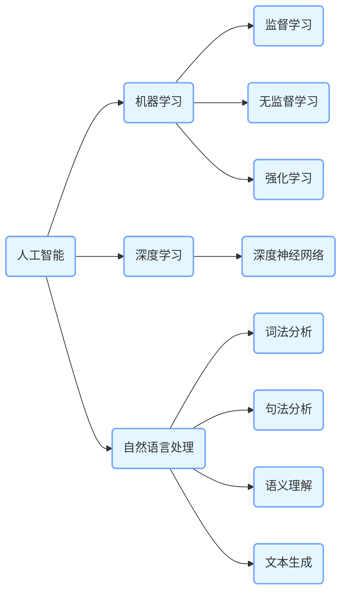

# 程序员如何在AI浪潮中生存与发展

> 关键词：程序员、AI浪潮、生存与发展、技能提升、职业转型

> 摘要：随着人工智能（AI）技术的飞速发展，AI浪潮正深刻地改变着整个IT行业。对于程序员而言，既面临着巨大的挑战，也迎来了前所未有的机遇。本文旨在深入探讨程序员在AI浪潮中如何实现生存与发展，通过对背景的介绍、核心概念的剖析、相关算法原理的阐述、数学模型的解读、项目实战案例的分析、实际应用场景的探讨、工具和资源的推荐，以及对未来发展趋势与挑战的总结等方面，为程序员提供全面而系统的指导，帮助他们在AI浪潮中找准定位，提升自身竞争力，实现职业的可持续发展。

## 1. 背景介绍 
### 1.1 目的和范围
在当今时代，AI技术已经渗透到各个领域，从医疗、金融到交通、娱乐等，无处不在。AI的发展不仅改变了人们的生活方式，也对程序员的职业发展产生了深远的影响。本文的目的在于为程序员提供在AI浪潮中生存与发展的策略和方法。范围涵盖了AI相关的核心概念、算法原理、数学模型、项目实战、应用场景、工具资源等多个方面，旨在帮助程序员全面了解AI技术，并掌握在这一浪潮中提升自己的关键技能和方法。

### 1.2 预期读者
本文主要面向广大程序员群体，包括初级、中级和高级程序员。无论是从事传统软件开发的程序员，还是对AI技术有兴趣的新手，都可以从本文中获取有价值的信息和指导。同时，对于想要了解AI技术对程序员职业影响的行业从业者、学生等也具有一定的参考意义。

### 1.3 文档结构概述
本文将按照以下结构进行阐述：首先介绍核心概念与联系，帮助程序员建立对AI的基本认知；接着详细讲解核心算法原理和具体操作步骤，通过Python代码进行示例；然后介绍数学模型和公式，并结合实际例子进行说明；之后通过项目实战，展示如何将理论知识应用到实际项目中；再探讨AI的实际应用场景；随后推荐相关的工具和资源，包括学习资源、开发工具框架和论文著作等；最后总结未来发展趋势与挑战，并提供常见问题的解答和扩展阅读及参考资料。

### 1.4 术语表
#### 1.4.1 核心术语定义
- **人工智能（Artificial Intelligence，AI）**：是一门研究如何使计算机系统能够模拟人类智能的学科，包括学习、推理、解决问题、感知和语言理解等能力。
- **机器学习（Machine Learning，ML）**：是AI的一个重要分支，它使计算机能够通过数据学习模式和规律，而无需明确的编程指令。
- **深度学习（Deep Learning，DL）**：是一种基于神经网络的机器学习技术，通过多层神经网络来学习数据的深层次特征。
- **神经网络（Neural Network，NN）**：是一种模仿人类神经系统的计算模型，由大量的神经元组成，用于处理和分析数据。
- **自然语言处理（Natural Language Processing，NLP）**：是AI的一个领域，旨在使计算机能够理解、处理和生成人类语言。

#### 1.4.2 相关概念解释
- **监督学习**：在监督学习中，训练数据包含输入和对应的输出标签，模型通过学习这些数据来预测新的输入对应的输出。
- **无监督学习**：无监督学习中，训练数据只有输入，没有输出标签，模型的任务是发现数据中的模式和结构。
- **强化学习**：强化学习是一种通过智能体与环境进行交互，根据环境反馈的奖励信号来学习最优策略的学习方法。

#### 1.4.3 缩略词列表
- **AI**：Artificial Intelligence
- **ML**：Machine Learning
- **DL**：Deep Learning
- **NN**：Neural Network
- **NLP**：Natural Language Processing

## 2. 核心概念与联系 
### 核心概念原理
#### 人工智能
人工智能的核心目标是使计算机系统能够表现出类似于人类的智能行为。它涉及多个领域的知识和技术，包括机器学习、深度学习、自然语言处理、计算机视觉等。人工智能系统可以通过感知环境、处理信息、做出决策和执行动作来完成各种任务。

#### 机器学习
机器学习是人工智能的一个重要实现方式。它基于数据驱动的方法，通过对大量数据的学习来发现数据中的模式和规律。机器学习算法可以分为监督学习、无监督学习和强化学习等类型。监督学习通过学习带有标签的数据来进行预测，无监督学习则用于发现数据中的隐藏结构，强化学习通过智能体与环境的交互来学习最优策略。

#### 深度学习
深度学习是机器学习的一个子领域，它基于深度神经网络。深度神经网络由多个神经元层组成，可以自动学习数据的深层次特征。深度学习在图像识别、语音识别、自然语言处理等领域取得了巨大的成功。

#### 自然语言处理
自然语言处理旨在使计算机能够理解、处理和生成人类语言。它涉及到词法分析、句法分析、语义理解、文本生成等多个方面。自然语言处理技术可以应用于机器翻译、智能客服、信息检索等领域。

### 架构的文本示意图
```plaintext
人工智能
├── 机器学习
│   ├── 监督学习
│   ├── 无监督学习
│   └── 强化学习
├── 深度学习
│   └── 深度神经网络
└── 自然语言处理
    ├── 词法分析
    ├── 句法分析
    ├── 语义理解
    └── 文本生成
```

### Mermaid流程图


## 3. 核心算法原理 & 具体操作步骤 
### 线性回归算法原理
线性回归是一种简单而常用的监督学习算法，用于预测连续值。它的基本思想是通过找到一条直线（在二维情况下）或超平面（在多维情况下），使得数据点到该直线或超平面的距离之和最小。

### Python代码实现
```python
import numpy as np
import matplotlib.pyplot as plt

# 生成一些示例数据
np.random.seed(0)
X = 2 * np.random.rand(100, 1)
y = 4 + 3 * X + np.random.randn(100, 1)

# 添加偏置项
X_b = np.c_[np.ones((100, 1)), X]

# 使用正规方程求解参数
theta_best = np.linalg.inv(X_b.T.dot(X_b)).dot(X_b.T).dot(y)

# 打印求解的参数
print("theta0:", theta_best[0][0])
print("theta1:", theta_best[1][0])

# 生成测试数据
X_new = np.array([[0], [2]])
X_new_b = np.c_[np.ones((2, 1)), X_new]

# 进行预测
y_predict = X_new_b.dot(theta_best)

# 绘制数据点和预测直线
plt.plot(X_new, y_predict, "r-")
plt.plot(X, y, "b.")
plt.axis([0, 2, 0, 15])
plt.show()
```

### 代码解释
1. **数据生成**：使用`np.random.rand`生成随机的输入数据`X`，并根据线性关系生成对应的输出数据`y`，同时添加一些随机噪声。
2. **添加偏置项**：为了求解截距项，需要在输入数据`X`的基础上添加一列全为1的向量。
3. **正规方程求解**：使用正规方程 $\theta = (X^T X)^{-1} X^T y$ 求解模型的参数 $\theta$。
4. **预测**：使用求解得到的参数对新的数据进行预测。
5. **可视化**：使用`matplotlib`库绘制数据点和预测直线。

### 具体操作步骤
1. **数据准备**：收集和整理需要分析的数据，将其分为输入特征和输出标签。
2. **数据预处理**：对数据进行清洗、归一化等预处理操作，以提高模型的性能。
3. **模型训练**：使用训练数据对模型进行训练，求解模型的参数。
4. **模型评估**：使用测试数据对训练好的模型进行评估，计算评估指标，如均方误差（MSE）等。
5. **模型应用**：使用训练好的模型对新的数据进行预测。

## 4. 数学模型和公式 & 详细讲解 & 举例说明 
### 线性回归的数学模型
线性回归的数学模型可以表示为：
$$y = \theta_0 + \theta_1 x_1 + \theta_2 x_2 + \cdots + \theta_n x_n + \epsilon$$
其中，$y$ 是输出变量，$x_1, x_2, \cdots, x_n$ 是输入特征，$\theta_0, \theta_1, \cdots, \theta_n$ 是模型的参数，$\epsilon$ 是误差项。

### 正规方程
为了求解模型的参数 $\theta$，可以使用正规方程：
$$\theta = (X^T X)^{-1} X^T y$$
其中，$X$ 是输入特征矩阵，$y$ 是输出标签向量。

### 详细讲解
正规方程的推导基于最小二乘法，即通过最小化误差平方和来求解模型的参数。误差平方和可以表示为：
$$J(\theta) = \frac{1}{2m} \sum_{i=1}^{m} (h_{\theta}(x^{(i)}) - y^{(i)})^2$$
其中，$m$ 是样本数量，$h_{\theta}(x^{(i)})$ 是模型的预测值，$y^{(i)}$ 是实际值。

为了找到使 $J(\theta)$ 最小的 $\theta$，可以对 $J(\theta)$ 求偏导数并令其为0，最终得到正规方程。

### 举例说明
假设我们有以下数据集：
| $x$ | $y$ |
| --- | --- |
| 1 | 3 |
| 2 | 5 |
| 3 | 7 |

我们可以将其表示为矩阵形式：
$$X = \begin{bmatrix} 1 & 1 \\ 1 & 2 \\ 1 & 3 \end{bmatrix}, y = \begin{bmatrix} 3 \\ 5 \\ 7 \end{bmatrix}$$

使用正规方程求解 $\theta$：
```python
import numpy as np

X = np.array([[1, 1], [1, 2], [1, 3]])
y = np.array([[3], [5], [7]])

theta = np.linalg.inv(X.T.dot(X)).dot(X.T).dot(y)
print("theta:", theta)
```

运行上述代码，我们可以得到 $\theta$ 的值：
```
theta: [[1.]
 [2.]]
```
这意味着模型的方程为 $y = 1 + 2x$。

## 5. 项目实战：代码实际案例和详细解释说明 
### 5.1  开发环境搭建
#### 安装Python
首先，需要安装Python环境。可以从Python官方网站（https://www.python.org/downloads/）下载适合自己操作系统的Python版本，并按照安装向导进行安装。

#### 安装相关库
使用`pip`命令安装项目所需的库，如`numpy`、`pandas`、`matplotlib`、`scikit-learn`等。
```bash
pip install numpy pandas matplotlib scikit-learn
```

### 5.2  源代码详细实现和代码解读
#### 项目描述
本项目使用线性回归算法对波士顿房价数据集进行预测。波士顿房价数据集包含了波士顿地区的房屋特征和对应的房价信息。

#### 代码实现
```python
import numpy as np
import pandas as pd
from sklearn.datasets import load_boston
from sklearn.model_selection import train_test_split
from sklearn.linear_model import LinearRegression
from sklearn.metrics import mean_squared_error

# 加载波士顿房价数据集
boston = load_boston()
X = boston.data
y = boston.target

# 划分训练集和测试集
X_train, X_test, y_train, y_test = train_test_split(X, y, test_size=0.2, random_state=42)

# 创建线性回归模型
model = LinearRegression()

# 训练模型
model.fit(X_train, y_train)

# 进行预测
y_pred = model.predict(X_test)

# 计算均方误差
mse = mean_squared_error(y_test, y_pred)
print("均方误差:", mse)
```

#### 代码解读
1. **数据加载**：使用`sklearn.datasets.load_boston`函数加载波士顿房价数据集，并将特征数据和标签数据分别存储在`X`和`y`中。
2. **数据划分**：使用`train_test_split`函数将数据集划分为训练集和测试集，测试集占比为20%。
3. **模型创建**：创建一个线性回归模型`LinearRegression`。
4. **模型训练**：使用训练集数据对模型进行训练，调用`fit`方法。
5. **模型预测**：使用训练好的模型对测试集数据进行预测，调用`predict`方法。
6. **模型评估**：使用`mean_squared_error`函数计算预测值和实际值之间的均方误差。

### 5.3  代码解读与分析
#### 模型性能分析
均方误差（MSE）是衡量回归模型性能的常用指标，它表示预测值和实际值之间的平均平方误差。MSE越小，说明模型的预测性能越好。

#### 模型优化
可以通过以下方法对模型进行优化：
- **特征工程**：对特征进行选择、变换和组合，以提高模型的性能。
- **正则化**：使用正则化方法，如岭回归、Lasso回归等，来防止模型过拟合。
- **模型选择**：尝试不同的模型，如决策树回归、随机森林回归等，选择性能最优的模型。

## 6. 实际应用场景 
### 金融领域
在金融领域，AI技术可以用于风险评估、信贷审批、投资决策等方面。例如，通过机器学习算法对客户的信用数据进行分析，预测客户的违约风险；使用深度学习模型对股票市场进行预测，辅助投资决策。

### 医疗领域
在医疗领域，AI技术可以用于疾病诊断、医学影像分析、药物研发等方面。例如，通过深度学习模型对X光、CT等医学影像进行分析，辅助医生进行疾病诊断；使用机器学习算法对药物研发数据进行分析，加速药物研发进程。

### 交通领域
在交通领域，AI技术可以用于自动驾驶、智能交通管理等方面。例如，通过计算机视觉和传感器技术实现自动驾驶汽车的环境感知和决策；使用机器学习算法对交通流量数据进行分析，优化交通信号控制。

### 教育领域
在教育领域，AI技术可以用于个性化学习、智能辅导等方面。例如，通过机器学习算法对学生的学习数据进行分析，为学生提供个性化的学习建议和辅导；使用自然语言处理技术实现智能答疑系统。

## 7. 工具和资源推荐
### 7.1 学习资源推荐
#### 7.1.1 书籍推荐
- 《Python机器学习》：介绍了Python在机器学习中的应用，包括各种机器学习算法的原理和实现。
- 《深度学习》：由深度学习领域的三位先驱Ian Goodfellow、Yoshua Bengio和Aaron Courville撰写，是深度学习领域的经典教材。
- 《统计学习方法》：全面介绍了统计学习的基本概念、方法和理论，是机器学习领域的重要参考书籍。

#### 7.1.2 在线课程
- Coursera上的《机器学习》课程：由Andrew Ng教授授课，是机器学习领域的经典课程，适合初学者。
- edX上的《深度学习》课程：由MIT教授授课，深入介绍了深度学习的原理和应用。
- 网易云课堂上的《Python数据分析与机器学习实战》课程：结合实际项目，介绍了Python在数据分析和机器学习中的应用。

#### 7.1.3 技术博客和网站
- 博客园：是国内知名的技术博客平台，有很多关于AI和机器学习的优秀博客文章。
- 知乎：是一个知识分享平台，有很多关于AI和机器学习的问题和解答。
- Kaggle：是一个数据科学竞赛平台，有很多优秀的数据集和开源代码，可以学习到其他数据科学家的经验和技巧。

### 7.2 开发工具框架推荐
#### 7.2.1 IDE和编辑器
- PyCharm：是一款专门为Python开发设计的集成开发环境（IDE），具有强大的代码编辑、调试和智能提示功能。
- Jupyter Notebook：是一个交互式的开发环境，适合进行数据探索和模型实验。
- Visual Studio Code：是一款轻量级的代码编辑器，支持多种编程语言，有丰富的插件可以扩展功能。

#### 7.2.2 调试和性能分析工具
- TensorBoard：是TensorFlow提供的可视化工具，可以用于查看模型的训练过程、网络结构等信息。
- PyTorch Profiler：是PyTorch提供的性能分析工具，可以帮助开发者找出代码中的性能瓶颈。
- cProfile：是Python内置的性能分析工具，可以分析代码的执行时间和函数调用情况。

#### 7.2.3 相关框架和库
- TensorFlow：是Google开发的开源深度学习框架，具有强大的计算能力和丰富的工具库。
- PyTorch：是Facebook开发的开源深度学习框架，具有动态图机制，易于使用和调试。
- Scikit-learn：是一个简单而高效的机器学习库，提供了各种机器学习算法和工具。

### 7.3 相关论文著作推荐
#### 7.3.1 经典论文
- 《Learning Representations by Back-propagating Errors》：介绍了反向传播算法，是神经网络领域的经典论文。
- 《ImageNet Classification with Deep Convolutional Neural Networks》：介绍了AlexNet卷积神经网络，开启了深度学习在图像识别领域的热潮。
- 《Attention Is All You Need》：介绍了Transformer模型，是自然语言处理领域的重要突破。

#### 7.3.2 最新研究成果
- arXiv：是一个预印本平台，有很多最新的AI和机器学习研究成果。
- NeurIPS、ICML、CVPR等顶级学术会议：这些会议收录了AI和机器学习领域的最新研究成果。

#### 7.3.3 应用案例分析
- 《AI Superpowers: China, Silicon Valley, and the New World Order》：介绍了AI技术在中美两国的发展现状和应用案例。
- 《Artificial Intelligence: A Modern Approach》：是AI领域的经典教材，包含了很多AI技术的应用案例。

## 8. 总结：未来发展趋势与挑战
### 未来发展趋势
- **AI与其他技术的融合**：AI将与物联网、大数据、区块链等技术深度融合，创造出更多的应用场景和商业价值。
- **AI的普及和应用**：AI技术将越来越普及，应用到各个行业和领域，改变人们的生活和工作方式。
- **AI的可解释性和可靠性**：随着AI技术的广泛应用，对AI的可解释性和可靠性的要求也越来越高，未来将有更多的研究致力于解决这些问题。

### 挑战
- **数据隐私和安全**：AI技术的发展需要大量的数据，如何保护数据的隐私和安全是一个重要的挑战。
- **人才短缺**：AI领域的发展需要大量的专业人才，目前人才短缺是制约AI发展的一个重要因素。
- **伦理和法律问题**：AI技术的发展带来了一些伦理和法律问题，如算法偏见、自动驾驶的责任认定等，需要制定相应的伦理和法律规范。

## 9. 附录：常见问题与解答
### 问题1：程序员需要掌握哪些AI基础知识？
解答：程序员需要掌握机器学习、深度学习、自然语言处理等方面的基础知识，包括算法原理、数学模型、编程实现等。同时，还需要掌握Python等编程语言和相关的开发工具和框架。

### 问题2：如何学习AI技术？
解答：可以通过阅读相关书籍、参加在线课程、实践项目等方式学习AI技术。同时，还可以关注AI领域的最新研究成果和应用案例，不断提升自己的能力。

### 问题3：AI技术对程序员的职业发展有哪些影响？
解答：AI技术为程序员带来了新的机遇和挑战。一方面，程序员可以通过学习和掌握AI技术，拓宽自己的职业发展道路，从事AI相关的开发工作；另一方面，AI技术的发展也可能会导致一些传统编程工作的减少，程序员需要不断提升自己的竞争力。

### 问题4：如何评估一个AI模型的性能？
解答：可以使用各种评估指标来评估AI模型的性能，如准确率、召回率、F1值、均方误差等。具体选择哪种评估指标取决于模型的类型和应用场景。

### 问题5：AI技术存在哪些风险和挑战？
解答：AI技术存在数据隐私和安全、人才短缺、伦理和法律等方面的风险和挑战。程序员在开发和应用AI技术时，需要充分考虑这些问题，并采取相应的措施来解决。

## 10. 扩展阅读 & 参考资料
### 扩展阅读
- 《AI未来进行式》：探讨了AI技术对未来社会的影响和挑战。
- 《智能时代》：介绍了AI技术在各个领域的应用和发展趋势。
- 《失控》：虽然这本书不是专门关于AI的，但它探讨了复杂系统的发展和演化，对理解AI的发展有一定的启示作用。

### 参考资料
- 《Python机器学习实战》，作者：Sebastian Raschka
- 《深度学习入门：基于Python的理论与实现》，作者：斋藤康毅
- 《统计学习方法（第2版）》，作者：李航
- TensorFlow官方文档：https://www.tensorflow.org/
- PyTorch官方文档：https://pytorch.org/
- Scikit-learn官方文档：https://scikit-learn.org/