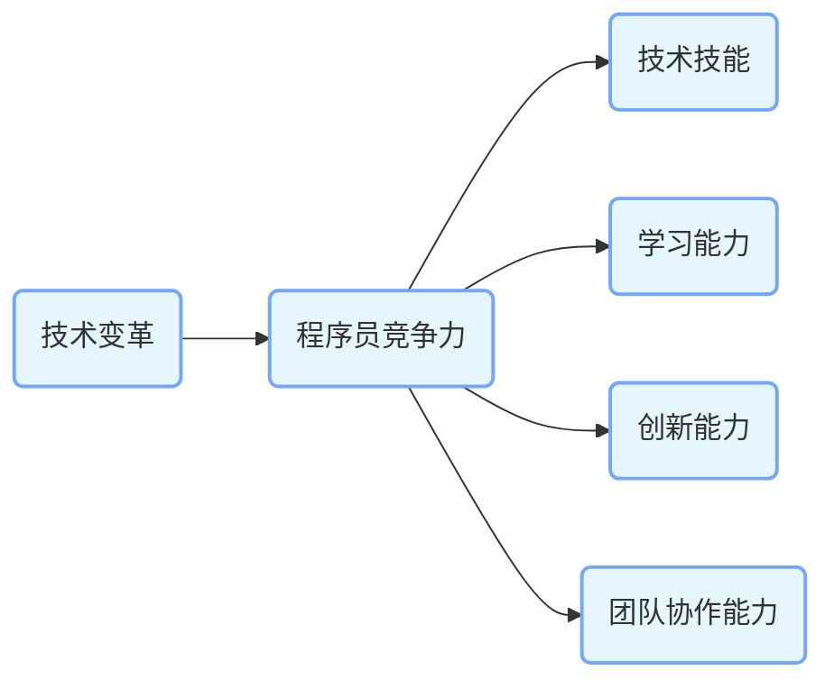

# 程序员如何在技术变革中保持竞争力

> 关键词：程序员、技术变革、竞争力、学习策略、职业发展

> 摘要：在当今快速发展的科技时代，技术变革日新月异，程序员面临着前所未有的挑战和机遇。本文旨在探讨程序员如何在技术变革中保持竞争力，通过分析背景、阐述核心概念、介绍核心算法（虽此处主要强调思维算法）、建立数学模型（思维模型）、给出项目实战案例、列举实际应用场景、推荐工具和资源，以及总结未来趋势与挑战等方面，为程序员提供全面、系统的指导，帮助他们在不断变化的技术环境中持续提升自己，实现职业的可持续发展。

## 1. 背景介绍 
### 1.1 目的和范围
随着信息技术的飞速发展，新的编程语言、框架、算法和技术不断涌现，如人工智能、大数据、区块链等。这些技术变革不仅改变了软件开发的方式和流程，也对程序员的技能和知识结构提出了更高的要求。本文的目的是为程序员提供一套全面的策略和方法，帮助他们在技术变革的浪潮中保持竞争力。范围涵盖了技术学习、职业规划、项目实践、资源利用等多个方面，旨在为程序员提供全方位的指导。

### 1.2 预期读者
本文的预期读者主要是广大程序员，包括初级、中级和高级程序员。无论是刚入行的新手，还是有一定经验的资深开发者，都可以从本文中获取有用的信息和建议，以应对技术变革带来的挑战。同时，对于技术管理者和人力资源从业者，也可以通过本文了解程序员在技术变革中的需求和发展方向，为团队建设和人才培养提供参考。

### 1.3 文档结构概述
本文将按照以下结构进行组织：首先介绍背景信息，包括目的、范围、预期读者和文档结构概述；接着阐述核心概念，如技术变革、竞争力等，并展示它们之间的联系；然后讲解核心算法原理和具体操作步骤，这里主要是思维算法和学习策略；之后建立数学模型和公式，帮助程序员更好地理解和应用这些策略；通过项目实战案例，详细介绍代码实现和分析；列举实际应用场景，说明这些策略在不同领域的应用；推荐相关的工具和资源，包括学习资源、开发工具框架和论文著作；最后总结未来发展趋势与挑战，提供常见问题解答和扩展阅读参考资料。

### 1.4 术语表
#### 1.4.1 核心术语定义
- **技术变革**：指在信息技术领域中，由于新的理论、方法、工具和技术的出现，导致软件开发方式、流程和应用场景发生重大变化的过程。
- **竞争力**：程序员在技术变革中所具备的能够在就业市场、项目开发和职业发展中脱颖而出的能力，包括技术技能、学习能力、创新能力、团队协作能力等。
- **学习策略**：为了在技术变革中持续提升自己的竞争力，程序员采用的一系列学习方法和计划，如持续学习、跨领域学习、实践学习等。

#### 1.4.2 相关概念解释
- **持续学习**：指程序员不断学习新的知识和技能，跟上技术发展的步伐，保持对新技术的敏感度和适应性。
- **跨领域学习**：打破传统的技术领域界限，学习不同领域的知识和技能，拓宽自己的视野和思维方式，提高解决复杂问题的能力。
- **实践学习**：通过实际项目的开发和实践，将所学的知识和技能应用到实际中，加深对知识的理解和掌握，提高实际操作能力。

#### 1.4.3 缩略词列表
- **AI**：Artificial Intelligence，人工智能
- **Big Data**：大数据
- **Blockchain**：区块链
- **IDE**：Integrated Development Environment，集成开发环境

## 2. 核心概念与联系 

### 核心概念原理
#### 技术变革
技术变革是信息技术发展的必然结果，它源于科学研究的新突破、市场需求的变化和竞争的压力。新的技术往往能够提高软件开发的效率和质量，创造出更多的商业价值。例如，人工智能技术的发展使得软件开发能够实现更智能的决策和自动化处理，大数据技术的应用则为企业提供了更精准的市场分析和用户洞察。

#### 竞争力
程序员的竞争力是一个综合性的概念，它包括技术技能、学习能力、创新能力、团队协作能力等多个方面。技术技能是程序员的核心竞争力，包括编程语言、算法设计、数据库管理等方面的知识和技能。学习能力则是在技术变革中不断提升自己的关键，只有具备快速学习新知识和技能的能力，才能跟上技术发展的步伐。创新能力能够帮助程序员在项目开发中提出新的思路和解决方案，提高项目的竞争力。团队协作能力则是在现代软件开发中不可或缺的能力，只有通过有效的团队协作，才能完成复杂的项目开发任务。

### 核心概念架构的文本示意图
```plaintext
技术变革
    |
    | 驱动
    |
程序员竞争力
    |
    | 包括
    |
技术技能 - 学习能力 - 创新能力 - 团队协作能力
```

### Mermaid 流程图


## 3. 核心算法原理 & 具体操作步骤 

### 核心算法原理
这里的核心算法可以理解为一种思维算法，旨在帮助程序员在技术变革中保持竞争力。其基本原理是通过持续学习、跨领域学习和实践学习，不断更新和完善自己的知识和技能体系，提高自己的学习能力、创新能力和团队协作能力。具体来说，可以将这个过程分为以下几个步骤：

#### 步骤1：自我评估
程序员需要对自己的技术技能、学习能力、创新能力和团队协作能力进行全面的评估，了解自己的优势和劣势。可以通过在线测试、项目经验总结、同行评价等方式进行评估。

#### 步骤2：设定目标
根据自我评估的结果，程序员需要设定明确的学习目标和职业发展目标。学习目标可以包括学习新的编程语言、框架、算法等，职业发展目标可以包括晋升为技术主管、成为行业专家等。

#### 步骤3：制定计划
根据设定的目标，程序员需要制定详细的学习计划和职业发展计划。学习计划可以包括学习时间安排、学习资源选择、学习方法等，职业发展计划可以包括项目参与计划、技能提升计划、人脉拓展计划等。

#### 步骤4：执行计划
按照制定的计划，程序员需要认真执行学习和职业发展计划。在学习过程中，要注重实践，将所学的知识和技能应用到实际项目中。在职业发展过程中，要积极参与项目开发，积累项目经验，拓展人脉资源。

#### 步骤5：评估和调整
定期对学习和职业发展计划的执行情况进行评估，根据评估结果调整计划。如果发现学习目标过高或过低，要及时调整学习计划；如果发现职业发展目标不切实际，要及时调整职业发展计划。

### 具体操作步骤（Python 代码示例）
```python
# 步骤1：自我评估
def self_assessment():
    # 假设这里通过在线测试和项目经验总结来评估自己的技术技能
    technical_skills = {
        "Python": 80,  # 假设 Python 技能评分为 80 分
        "Java": 60,    # 假设 Java 技能评分为 60 分
        "Database": 70 # 假设数据库技能评分为 70 分
    }
    # 学习能力、创新能力和团队协作能力可以通过主观评价来打分
    learning_ability = 75
    innovation_ability = 70
    teamwork_ability = 85
    return technical_skills, learning_ability, innovation_ability, teamwork_ability

# 步骤2：设定目标
def set_goals(technical_skills):
    # 根据自我评估的结果，设定学习目标和职业发展目标
    learning_goals = []
    if technical_skills["Python"] < 90:
        learning_goals.append("提高 Python 技能到 90 分")
    if technical_skills["Java"] < 80:
        learning_goals.append("提高 Java 技能到 80 分")
    career_goals = ["晋升为技术主管"]
    return learning_goals, career_goals

# 步骤3：制定计划
def make_plans(learning_goals, career_goals):
    learning_plans = []
    for goal in learning_goals:
        if "Python" in goal:
            learning_plans.append("学习 Python 高级编程和数据分析库")
        if "Java" in goal:
            learning_plans.append("学习 Java 企业级开发框架")
    career_plans = []
    for goal in career_goals:
        if "技术主管" in goal:
            career_plans.append("参与更多的项目管理工作，积累管理经验")
    return learning_plans, career_plans

# 步骤4：执行计划
def execute_plans(learning_plans, career_plans):
    for plan in learning_plans:
        print(f"正在执行学习计划：{plan}")
    for plan in career_plans:
        print(f"正在执行职业发展计划：{plan}")

# 步骤5：评估和调整
def evaluate_and_adjust(technical_skills, learning_goals, career_goals, learning_plans, career_plans):
    # 假设经过一段时间的学习和实践，技术技能有所提升
    technical_skills["Python"] = 85
    technical_skills["Java"] = 65
    # 重新评估学习目标和职业发展目标是否达成
    new_learning_goals = []
    for goal in learning_goals:
        if "Python" in goal and technical_skills["Python"] < 90:
            new_learning_goals.append(goal)
        if "Java" in goal and technical_skills["Java"] < 80:
            new_learning_goals.append(goal)
    new_career_goals = career_goals
    # 根据新的目标调整学习计划和职业发展计划
    new_learning_plans, new_career_plans = make_plans(new_learning_goals, new_career_goals)
    return new_learning_goals, new_career_goals, new_learning_plans, new_career_plans

# 主程序
if __name__ == "__main__":
    technical_skills, learning_ability, innovation_ability, teamwork_ability = self_assessment()
    learning_goals, career_goals = set_goals(technical_skills)
    learning_plans, career_plans = make_plans(learning_goals, career_goals)
    execute_plans(learning_plans, career_plans)
    new_learning_goals, new_career_goals, new_learning_plans, new_career_plans = evaluate_and_adjust(technical_skills, learning_goals, career_goals, learning_plans, career_plans)
    print("调整后的学习目标：", new_learning_goals)
    print("调整后的职业发展目标：", new_career_goals)
    print("调整后的学习计划：", new_learning_plans)
    print("调整后的职业发展计划：", new_career_plans)
```

## 4. 数学模型和公式 & 详细讲解 & 举例说明 

### 数学模型
我们可以建立一个简单的数学模型来描述程序员的竞争力。设程序员的竞争力为 $C$，技术技能为 $T$，学习能力为 $L$，创新能力为 $I$，团队协作能力为 $G$，则可以用以下公式表示：

$$C = w_1T + w_2L + w_3I + w_4G$$

其中，$w_1$、$w_2$、$w_3$、$w_4$ 分别为技术技能、学习能力、创新能力和团队协作能力的权重，且 $w_1 + w_2 + w_3 + w_4 = 1$。

### 详细讲解
这个数学模型表明，程序员的竞争力是由技术技能、学习能力、创新能力和团队协作能力共同决定的。权重 $w_1$、$w_2$、$w_3$、$w_4$ 反映了各个因素在竞争力中的重要程度，不同的行业和企业可能会有不同的权重分配。例如，在一些注重技术创新的企业中，创新能力的权重可能会比较高；而在一些大型项目开发的企业中，团队协作能力的权重可能会比较高。

### 举例说明
假设某程序员的技术技能评分为 80 分，学习能力评分为 75 分，创新能力评分为 70 分，团队协作能力评分为 85 分，且权重分配为 $w_1 = 0.4$，$w_2 = 0.2$，$w_3 = 0.2$，$w_4 = 0.2$，则该程序员的竞争力为：

$$C = 0.4\times80 + 0.2\times75 + 0.2\times70 + 0.2\times85$$
$$C = 32 + 15 + 14 + 17$$
$$C = 78$$

通过这个数学模型，程序员可以了解自己在各个方面的优势和劣势，有针对性地进行提升。例如，如果发现自己的创新能力评分较低，可以通过参加创新培训、阅读创新相关的书籍和文章等方式来提高自己的创新能力。

## 5. 项目实战：代码实际案例和详细解释说明 

### 5.1  开发环境搭建
假设我们要开发一个简单的 Python 项目，实现一个学生信息管理系统。开发环境搭建步骤如下：

#### 安装 Python
从 Python 官方网站（https://www.python.org/downloads/）下载并安装 Python 3.x 版本。安装完成后，在命令行中输入 `python --version` 验证 Python 是否安装成功。

#### 安装开发工具
推荐使用 PyCharm 作为开发工具，它是一款功能强大的 Python 集成开发环境。从 JetBrains 官方网站（https://www.jetbrains.com/pycharm/download/）下载并安装 PyCharm。

#### 创建项目
打开 PyCharm，选择 `File` -> `New Project`，选择 Python 解释器，创建一个新的 Python 项目。

### 5.2  源代码详细实现和代码解读
```python
# 定义学生类
class Student:
    def __init__(self, id, name, age):
        self.id = id
        self.name = name
        self.age = age

    def __str__(self):
        return f"ID: {self.id}, Name: {self.name}, Age: {self.age}"

# 定义学生信息管理系统类
class StudentManagementSystem:
    def __init__(self):
        self.students = []

    # 添加学生信息
    def add_student(self, student):
        self.students.append(student)
        print(f"成功添加学生：{student.name}")

    # 删除学生信息
    def delete_student(self, id):
        for student in self.students:
            if student.id == id:
                self.students.remove(student)
                print(f"成功删除学生：{student.name}")
                return
        print(f"未找到 ID 为 {id} 的学生")

    # 显示所有学生信息
    def display_students(self):
        if len(self.students) == 0:
            print("暂无学生信息")
        else:
            for student in self.students:
                print(student)

# 主程序
if __name__ == "__main__":
    sms = StudentManagementSystem()

    # 添加学生信息
    student1 = Student(1, "张三", 20)
    student2 = Student(2, "李四", 21)
    sms.add_student(student1)
    sms.add_student(student2)

    # 显示所有学生信息
    sms.display_students()

    # 删除学生信息
    sms.delete_student(1)

    # 再次显示所有学生信息
    sms.display_students()
```

### 代码解读与分析
#### 学生类（`Student`）
- `__init__` 方法：用于初始化学生对象的属性，包括学生的 ID、姓名和年龄。
- `__str__` 方法：用于返回学生对象的字符串表示形式，方便打印学生信息。

#### 学生信息管理系统类（`StudentManagementSystem`）
- `__init__` 方法：初始化一个空的学生列表，用于存储学生信息。
- `add_student` 方法：将一个学生对象添加到学生列表中，并打印添加成功的信息。
- `delete_student` 方法：根据学生的 ID 从学生列表中删除对应的学生对象，并打印删除成功的信息。如果未找到对应的学生对象，则打印未找到的信息。
- `display_students` 方法：显示所有学生的信息。如果学生列表为空，则打印暂无学生信息的提示。

#### 主程序
- 创建一个学生信息管理系统对象 `sms`。
- 创建两个学生对象 `student1` 和 `student2`，并将它们添加到学生信息管理系统中。
- 显示所有学生信息。
- 删除 ID 为 1 的学生信息。
- 再次显示所有学生信息。

通过这个项目实战，程序员可以将所学的 Python 知识应用到实际项目中，提高自己的编程能力和解决实际问题的能力。

## 6. 实际应用场景 
### 人工智能领域
在人工智能领域，技术变革非常迅速，新的算法和模型不断涌现。程序员需要不断学习和掌握新的人工智能技术，如深度学习、强化学习等，才能在这个领域保持竞争力。例如，在图像识别、自然语言处理等应用场景中，程序员需要使用深度学习框架如 TensorFlow、PyTorch 等进行模型的训练和部署。

### 大数据领域
大数据领域的数据量呈爆炸式增长，对数据处理和分析的需求也越来越高。程序员需要掌握大数据技术，如 Hadoop、Spark 等，以及数据分析工具和算法，如 SQL、Python 数据分析库等。在电商、金融等行业，大数据技术被广泛应用于用户行为分析、风险评估等方面。

### 区块链领域
区块链技术是近年来兴起的一种新兴技术，具有去中心化、不可篡改等特点。程序员需要学习区块链的基本原理和开发框架，如 Ethereum、Hyperledger 等，才能参与区块链项目的开发。区块链技术在金融、物流、医疗等领域有广泛的应用前景。

### 移动开发领域
移动开发领域的技术更新换代也非常快，新的操作系统和开发框架不断推出。程序员需要掌握移动开发技术，如 Android 开发、iOS 开发等，以及相关的开发工具和框架，如 React Native、Flutter 等。在社交、游戏等行业，移动应用的开发需求非常大。

## 7. 工具和资源推荐
### 7.1 学习资源推荐
#### 7.1.1 书籍推荐
- 《Python 核心编程》：全面介绍了 Python 编程语言的基础知识和高级应用，是学习 Python 的经典书籍。
- 《算法导论》：经典的算法书籍，介绍了各种算法的原理和实现，对于提高程序员的算法设计能力有很大帮助。
- 《深度学习》：由深度学习领域的三位顶尖专家撰写，系统地介绍了深度学习的基本原理、算法和应用。

#### 7.1.2 在线课程
- Coursera：提供了丰富的在线课程，包括人工智能、大数据、编程语言等多个领域的课程，由全球知名高校和机构的教授授课。
- edX：与全球多所顶尖高校合作，提供高质量的在线课程，课程内容涵盖了计算机科学、工程技术等多个领域。
- 慕课网：国内知名的在线学习平台，提供了大量的编程课程，适合初学者和有一定基础的程序员学习。

#### 7.1.3 技术博客和网站
- Medium：一个汇聚了众多技术专家和开发者的博客平台，提供了各种技术领域的文章和教程。
- GitHub：全球最大的开源代码托管平台，程序员可以在上面学习和参考其他开发者的代码，参与开源项目的开发。
- 开源中国：国内知名的开源技术社区，提供了丰富的技术文章、开源项目和技术交流平台。

### 7.2 开发工具框架推荐
#### 7.2.1 IDE和编辑器
- PyCharm：功能强大的 Python 集成开发环境，提供了代码编辑、调试、版本控制等一系列功能。
- Visual Studio Code：一款轻量级的代码编辑器，支持多种编程语言，具有丰富的插件和扩展功能。
- IntelliJ IDEA：优秀的 Java 集成开发环境，提供了智能代码提示、代码重构等功能，提高开发效率。

#### 7.2.2 调试和性能分析工具
- pdb：Python 自带的调试工具，可以帮助程序员调试 Python 代码。
- Chrome DevTools：Chrome 浏览器自带的调试工具，可用于调试网页前端代码，进行性能分析和优化。
- VisualVM：一款开源的 Java 性能分析工具，可以监控 Java 应用程序的性能指标，帮助程序员找出性能瓶颈。

#### 7.2.3 相关框架和库
- Django：Python 的一个高级 Web 开发框架，提供了快速开发 Web 应用的功能。
- Flask：轻量级的 Python Web 开发框架，适合初学者和小型项目的开发。
- React：Facebook 开发的 JavaScript 库，用于构建用户界面，提高前端开发效率。

### 7.3 相关论文著作推荐
#### 7.3.1 经典论文
- 《A Mathematical Theory of Communication》：信息论的经典论文，奠定了现代通信理论的基础。
- 《The Structure of Scientific Revolutions》：科学哲学领域的经典著作，提出了科学革命的概念和范式转换的理论。
- 《Learning Representations by Back-propagating Errors》：深度学习领域的经典论文，介绍了反向传播算法，推动了深度学习的发展。

#### 7.3.2 最新研究成果
- 关注顶级学术会议和期刊，如 NeurIPS（神经信息处理系统大会）、ICML（国际机器学习会议）、ACM SIGKDD（知识发现与数据挖掘会议）等，了解最新的研究成果和技术趋势。
- 关注知名研究机构和学者的研究动态，如斯坦福大学、麻省理工学院、谷歌研究院等。

#### 7.3.3 应用案例分析
- 《AI Superpowers: China, Silicon Valley, and the New World Order》：分析了中国和美国在人工智能领域的发展现状和竞争态势，提供了丰富的应用案例。
- 《Big Data: A Revolution That Will Transform How We Live, Work, and Think》：介绍了大数据的概念、技术和应用，通过实际案例展示了大数据在各个领域的应用价值。

## 8. 总结：未来发展趋势与挑战
### 未来发展趋势
- **人工智能与自动化**：人工智能技术将继续发展，自动化程度将不断提高。程序员需要掌握人工智能相关的技术，如机器学习、深度学习等，以适应未来的工作需求。
- **跨领域融合**：不同技术领域之间的融合将越来越明显，如人工智能与物联网、区块链与金融等。程序员需要具备跨领域的知识和技能，才能在未来的竞争中脱颖而出。
- **开源与社区合作**：开源项目将继续发展壮大，社区合作将变得更加重要。程序员需要积极参与开源项目，与其他开发者合作，共同推动技术的进步。

### 挑战
- **知识更新速度快**：技术变革日新月异，知识更新速度非常快。程序员需要不断学习和掌握新的知识和技能，才能跟上技术发展的步伐。
- **竞争压力大**：随着程序员数量的增加，就业市场的竞争压力也越来越大。程序员需要不断提升自己的竞争力，才能在激烈的竞争中获得更好的职业发展机会。
- **技术伦理和安全问题**：随着人工智能、大数据等技术的广泛应用，技术伦理和安全问题也越来越受到关注。程序员需要关注技术伦理和安全问题，遵守相关的法律法规和道德准则。

## 9. 附录：常见问题与解答
### 问题1：如何选择适合自己的学习资源？
解答：选择学习资源时，要根据自己的学习目标和水平来选择。如果是初学者，可以选择一些基础的书籍和在线课程；如果有一定基础，可以选择一些高级的书籍和研究论文。同时，要选择口碑好、质量高的学习资源，可以参考其他开发者的推荐和评价。

### 问题2：如何平衡工作和学习的时间？
解答：平衡工作和学习的时间需要制定合理的计划。可以利用业余时间进行学习，如晚上和周末。同时，要合理安排工作时间，提高工作效率，避免加班。在学习过程中，要注重学习方法和技巧，提高学习效率。

### 问题3：如何提高自己的创新能力？
解答：提高创新能力需要多方面的努力。可以多阅读创新相关的书籍和文章，了解创新的方法和技巧；参加创新培训和活动，与其他创新者交流和合作；在工作和学习中，要勇于尝试新的方法和思路，不断挑战自己。

## 10. 扩展阅读 & 参考资料
### 扩展阅读
- 《The Lean Startup: How Today's Entrepreneurs Use Continuous Innovation to Create Radically Successful Businesses》：介绍了精益创业的理念和方法，对于程序员了解创业和创新有很大帮助。
- 《The Phoenix Project: A Novel About IT, DevOps, and Helping Your Business Win》：以小说的形式介绍了 DevOps 的理念和实践，对于程序员了解软件开发的流程和管理有很大帮助。

### 参考资料
- 各技术领域的官方文档和教程，如 Python 官方文档、TensorFlow 官方文档等。
- 相关的学术论文和研究报告，如 IEEE 期刊、ACM 会议论文等。