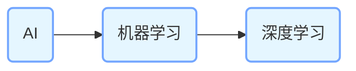

# 程序员如何应对AI带来的职业转型

> 关键词：程序员、AI、职业转型、技能提升、职业规划

> 摘要：随着AI技术的迅猛发展，程序员的职业环境正发生着深刻变化。本文旨在探讨程序员如何应对AI带来的职业转型。通过分析背景信息，阐述核心概念与联系，介绍核心算法原理及操作步骤，讲解数学模型和公式，结合项目实战案例，探讨实际应用场景，推荐相关工具和资源，最后总结未来发展趋势与挑战，解答常见问题并提供扩展阅读和参考资料，为程序员在AI时代的职业转型提供全面且深入的指导。

## 1. 背景介绍 
### 1.1 目的和范围
目的在于帮助程序员全面认识AI对自身职业的影响，并提供切实可行的应对策略，助力他们实现职业转型。范围涵盖了从AI技术的基础概念到其在各个领域的应用，以及程序员在转型过程中涉及的技能提升、职业规划等多个方面。

### 1.2 预期读者
主要面向广大程序员群体，包括新手程序员、有一定经验的开发者以及技术团队的管理者。同时，也可供对AI与编程职业发展感兴趣的相关人员参考。

### 1.3 文档结构概述
本文首先介绍背景信息，让读者了解AI对程序员职业影响的大环境。接着阐述核心概念与联系，帮助读者建立起对相关技术的整体认知。然后详细讲解核心算法原理及操作步骤，结合数学模型和公式加深理解。通过项目实战案例展示实际应用，探讨实际应用场景以拓展思路。推荐相关工具和资源，为读者提供学习和实践的途径。最后总结未来发展趋势与挑战，解答常见问题并提供扩展阅读和参考资料，形成一个完整的知识体系。

### 1.4 术语表
#### 1.4.1 核心术语定义
- **AI（Artificial Intelligence）**：即人工智能，是研究、开发用于模拟、延伸和扩展人的智能的理论、方法、技术及应用系统的一门新的技术科学。
- **机器学习（Machine Learning）**：是一门多领域交叉学科，涉及概率论、统计学、逼近论、凸分析、算法复杂度理论等多门学科。它专门研究计算机怎样模拟或实现人类的学习行为，以获取新的知识或技能，重新组织已有的知识结构使之不断改善自身的性能。
- **深度学习（Deep Learning）**：是机器学习的一个分支领域，它是一种基于对数据进行表征学习的方法。深度学习通过构建具有很多层的神经网络模型，自动从大量数据中学习复杂的模式和特征。

#### 1.4.2 相关概念解释
- **自动化编程**：利用AI技术自动生成代码的过程，它可以提高编程效率，但也对程序员的职业产生了一定的冲击。
- **智能辅助编程工具**：借助AI技术为程序员提供代码提示、错误检查、代码优化等辅助功能的工具。

#### 1.4.3 缩略词列表
- **AI**：Artificial Intelligence
- **ML**：Machine Learning
- **DL**：Deep Learning

## 2. 核心概念与联系 
### 2.1 AI对程序员职业的影响
AI技术的发展给程序员的职业带来了多方面的影响。一方面，AI的应用使得软件开发的流程更加自动化，一些重复性、规律性的编程任务可以由AI工具完成，这对传统程序员的工作构成了挑战。另一方面，AI也为程序员带来了新的机遇，如开发AI相关的应用、利用AI技术优化现有软件等。

### 2.2 程序员职业转型的方向
程序员可以向以下几个方向进行职业转型：
- **AI开发者**：专注于开发AI算法、模型和应用，如开发图像识别系统、自然语言处理应用等。
- **数据科学家**：负责收集、整理和分析大量的数据，为AI模型的训练提供支持。
- **AI与行业融合专家**：将AI技术应用到特定的行业中，如医疗、金融、交通等，解决行业中的实际问题。

### 2.3 核心概念原理和架构的文本示意图
AI、机器学习、深度学习等概念之间存在着紧密的联系。AI是一个广泛的领域，机器学习是实现AI的一种重要方法，而深度学习又是机器学习中的一个重要分支。可以用以下文本示意图表示：
AI
|-- 机器学习
    |-- 深度学习

### 2.4 Mermaid流程图


## 3. 核心算法原理 & 具体操作步骤 
### 3.1 机器学习算法原理
以简单的线性回归算法为例，线性回归是一种用于预测连续数值的机器学习算法。其基本原理是通过找到一条最佳的直线来拟合数据点，使得数据点到直线的误差最小。

#### 3.1.1 Python源代码实现
```python
import numpy as np
import matplotlib.pyplot as plt

# 生成一些示例数据
x = np.array([1, 2, 3, 4, 5])
y = np.array([2, 4, 6, 8, 10])

# 计算线性回归的参数
n = len(x)
mean_x = np.mean(x)
mean_y = np.mean(y)

# 计算斜率和截距
numerator = np.sum((x - mean_x) * (y - mean_y))
denominator = np.sum((x - mean_x) ** 2)
slope = numerator / denominator
intercept = mean_y - slope * mean_x

# 预测新的数据点
new_x = np.array([6, 7, 8])
predicted_y = slope * new_x + intercept

# 绘制数据点和拟合直线
plt.scatter(x, y, color='blue', label='Data Points')
plt.plot(new_x, predicted_y, color='red', label='Regression Line')
plt.xlabel('X')
plt.ylabel('Y')
plt.title('Linear Regression')
plt.legend()
plt.show()
```

#### 3.1.2 具体操作步骤
1. **数据准备**：收集和整理用于训练的数据集，将其分为输入特征和目标变量。
2. **模型选择**：选择合适的机器学习算法，如线性回归、逻辑回归、决策树等。
3. **模型训练**：使用训练数据对模型进行训练，调整模型的参数，使得模型能够最好地拟合数据。
4. **模型评估**：使用测试数据对训练好的模型进行评估，计算模型的性能指标，如准确率、召回率、均方误差等。
5. **模型预测**：使用训练好的模型对新的数据进行预测。

### 3.2 深度学习算法原理
以简单的全连接神经网络为例，全连接神经网络由输入层、隐藏层和输出层组成，各层之间的神经元相互连接。

#### 3.2.1 Python源代码实现
```python
import tensorflow as tf
from tensorflow.keras.datasets import mnist
from tensorflow.keras.models import Sequential
from tensorflow.keras.layers import Dense, Flatten
from tensorflow.keras.utils import to_categorical

# 加载MNIST数据集
(x_train, y_train), (x_test, y_test) = mnist.load_data()

# 数据预处理
x_train = x_train / 255.0
x_test = x_test / 255.0
y_train = to_categorical(y_train)
y_test = to_categorical(y_test)

# 构建全连接神经网络模型
model = Sequential([
    Flatten(input_shape=(28, 28)),
    Dense(128, activation='relu'),
    Dense(10, activation='softmax')
])

# 编译模型
model.compile(optimizer='adam',
              loss='categorical_crossentropy',
              metrics=['accuracy'])

# 训练模型
model.fit(x_train, y_train, epochs=5, batch_size=32)

# 评估模型
test_loss, test_acc = model.evaluate(x_test, y_test)
print(f'Test accuracy: {test_acc}')
```

#### 3.2.2 具体操作步骤
1. **数据准备**：收集和整理用于训练的数据集，将其分为输入特征和目标变量。对于图像数据，通常需要进行归一化处理。
2. **模型构建**：构建深度学习模型，选择合适的网络结构，如全连接神经网络、卷积神经网络、循环神经网络等。
3. **模型编译**：选择合适的优化器、损失函数和评估指标，对模型进行编译。
4. **模型训练**：使用训练数据对模型进行训练，设置合适的训练参数，如训练轮数、批次大小等。
5. **模型评估**：使用测试数据对训练好的模型进行评估，计算模型的性能指标。
6. **模型预测**：使用训练好的模型对新的数据进行预测。

## 4. 数学模型和公式 & 详细讲解 & 举例说明 
### 4.1 线性回归的数学模型和公式
线性回归的数学模型可以表示为：
$$y = \beta_0 + \beta_1x + \epsilon$$
其中，$y$ 是目标变量，$x$ 是输入特征，$\beta_0$ 是截距，$\beta_1$ 是斜率，$\epsilon$ 是误差项。

线性回归的目标是找到最佳的 $\beta_0$ 和 $\beta_1$，使得误差项的平方和最小，即最小化以下损失函数：
$$J(\beta_0, \beta_1) = \frac{1}{2m} \sum_{i=1}^{m} (y^{(i)} - (\beta_0 + \beta_1x^{(i)}))^2$$
其中，$m$ 是样本数量，$y^{(i)}$ 是第 $i$ 个样本的目标变量值，$x^{(i)}$ 是第 $i$ 个样本的输入特征值。

可以使用最小二乘法来求解 $\beta_0$ 和 $\beta_1$，具体公式如下：
$$\beta_1 = \frac{\sum_{i=1}^{m} (x^{(i)} - \bar{x})(y^{(i)} - \bar{y})}{\sum_{i=1}^{m} (x^{(i)} - \bar{x})^2}$$
$$\beta_0 = \bar{y} - \beta_1\bar{x}$$
其中，$\bar{x}$ 是输入特征的平均值，$\bar{y}$ 是目标变量的平均值。

#### 4.1.1 举例说明
假设有以下数据集：
| $x$ | $y$ |
|---|---|
| 1 | 2 |
| 2 | 4 |
| 3 | 6 |
| 4 | 8 |
| 5 | 10 |

首先计算 $\bar{x}$ 和 $\bar{y}$：
$$\bar{x} = \frac{1 + 2 + 3 + 4 + 5}{5} = 3$$
$$\bar{y} = \frac{2 + 4 + 6 + 8 + 10}{5} = 6$$

然后计算 $\beta_1$：
$$\beta_1 = \frac{(1 - 3)(2 - 6) + (2 - 3)(4 - 6) + (3 - 3)(6 - 6) + (4 - 3)(8 - 6) + (5 - 3)(10 - 6)}{(1 - 3)^2 + (2 - 3)^2 + (3 - 3)^2 + (4 - 3)^2 + (5 - 3)^2} = 2$$

最后计算 $\beta_0$：
$$\beta_0 = 6 - 2 \times 3 = 0$$

所以，线性回归方程为 $y = 2x$。

### 4.2 逻辑回归的数学模型和公式
逻辑回归是一种用于分类的机器学习算法，其数学模型可以表示为：
$$P(y = 1|x) = \frac{1}{1 + e^{-(\beta_0 + \beta_1x_1 + \cdots + \beta_nx_n)}}$$
其中，$P(y = 1|x)$ 是给定输入特征 $x$ 时，样本属于正类的概率，$\beta_0$ 是截距，$\beta_1, \cdots, \beta_n$ 是权重，$x_1, \cdots, x_n$ 是输入特征。

逻辑回归的目标是找到最佳的 $\beta_0, \beta_1, \cdots, \beta_n$，使得对数似然函数最大，即最大化以下目标函数：
$$L(\beta) = \sum_{i=1}^{m} [y^{(i)}\log(P(y^{(i)} = 1|x^{(i)})) + (1 - y^{(i)})\log(1 - P(y^{(i)} = 1|x^{(i)}))]$$
其中，$m$ 是样本数量，$y^{(i)}$ 是第 $i$ 个样本的类别标签，$x^{(i)}$ 是第 $i$ 个样本的输入特征。

可以使用梯度下降法来求解 $\beta_0, \beta_1, \cdots, \beta_n$。

#### 4.2.1 举例说明
假设有一个二分类问题，输入特征为 $x$，类别标签为 $y$。使用逻辑回归模型进行训练，得到的权重为 $\beta_0 = -2$，$\beta_1 = 1$。则对于一个新的样本 $x = 3$，其属于正类的概率为：
$$P(y = 1|x = 3) = \frac{1}{1 + e^{-(-2 + 1 \times 3)}} = \frac{1}{1 + e^{-1}} \approx 0.731$$

## 5. 项目实战：代码实际案例和详细解释说明 
### 5.1  开发环境搭建
#### 5.1.1 安装Python
可以从Python官方网站（https://www.python.org/downloads/） 下载并安装Python。建议安装Python 3.7及以上版本。

#### 5.1.2 安装必要的库
使用pip命令安装必要的库，如numpy、pandas、matplotlib、tensorflow等。
```bash
pip install numpy pandas matplotlib tensorflow
```

### 5.2  源代码详细实现和代码解读
#### 5.2.1 项目需求
构建一个简单的图像分类模型，使用MNIST数据集进行训练和测试。

#### 5.2.2 源代码实现
```python
import tensorflow as tf
from tensorflow.keras.datasets import mnist
from tensorflow.keras.models import Sequential
from tensorflow.keras.layers import Dense, Flatten
from tensorflow.keras.utils import to_categorical

# 加载MNIST数据集
(x_train, y_train), (x_test, y_test) = mnist.load_data()

# 数据预处理
x_train = x_train / 255.0
x_test = x_test / 255.0
y_train = to_categorical(y_train)
y_test = to_categorical(y_test)

# 构建全连接神经网络模型
model = Sequential([
    Flatten(input_shape=(28, 28)),
    Dense(128, activation='relu'),
    Dense(10, activation='softmax')
])

# 编译模型
model.compile(optimizer='adam',
              loss='categorical_crossentropy',
              metrics=['accuracy'])

# 训练模型
model.fit(x_train, y_train, epochs=5, batch_size=32)

# 评估模型
test_loss, test_acc = model.evaluate(x_test, y_test)
print(f'Test accuracy: {test_acc}')
```

#### 5.2.3 代码解读
1. **数据加载**：使用 `mnist.load_data()` 函数加载MNIST数据集，将其分为训练集和测试集。
2. **数据预处理**：将图像数据进行归一化处理，将像素值从0-255缩放到0-1之间。同时，将类别标签进行one-hot编码。
3. **模型构建**：使用 `Sequential` 模型构建一个全连接神经网络，包含一个输入层、一个隐藏层和一个输出层。
4. **模型编译**：选择 `adam` 优化器、`categorical_crossentropy` 损失函数和 `accuracy` 评估指标，对模型进行编译。
5. **模型训练**：使用 `fit` 方法对模型进行训练，设置训练轮数为5，批次大小为32。
6. **模型评估**：使用 `evaluate` 方法对训练好的模型进行评估，计算测试集的损失和准确率。

### 5.3  代码解读与分析
#### 5.3.1 数据预处理的重要性
数据预处理是机器学习和深度学习中非常重要的一步，它可以提高模型的性能和稳定性。在本项目中，将图像数据进行归一化处理可以使得模型更快地收敛，同时避免梯度爆炸或梯度消失的问题。

#### 5.3.2 模型结构的选择
在本项目中，选择了一个简单的全连接神经网络模型。对于图像分类任务，更常用的是卷积神经网络（CNN），因为CNN可以更好地捕捉图像的局部特征。

#### 5.3.3 训练参数的调整
训练参数的调整对模型的性能有很大的影响。在本项目中，训练轮数和批次大小是两个重要的训练参数。训练轮数过多可能会导致过拟合，训练轮数过少可能会导致欠拟合。批次大小过大可能会导致内存不足，批次大小过小可能会导致训练不稳定。

## 6. 实际应用场景 
### 6.1 医疗领域
AI技术在医疗领域的应用越来越广泛，程序员可以参与开发医疗影像诊断系统、智能健康监测设备、疾病预测模型等。例如，使用深度学习算法对X光、CT等医疗影像进行分析，帮助医生更准确地诊断疾病。

### 6.2 金融领域
在金融领域，AI可以用于风险评估、欺诈检测、投资决策等。程序员可以开发基于机器学习的风险评估模型，通过分析大量的金融数据，预测客户的信用风险。

### 6.3 交通领域
AI在交通领域的应用包括自动驾驶、智能交通管理等。程序员可以参与开发自动驾驶算法，实现车辆的自动导航、避障等功能。

### 6.4 教育领域
AI在教育领域的应用有智能辅导系统、个性化学习平台等。程序员可以开发智能辅导系统，根据学生的学习情况提供个性化的学习建议和辅导。

## 7. 工具和资源推荐
### 7.1 学习资源推荐
#### 7.1.1 书籍推荐
- 《Python机器学习》：全面介绍了Python在机器学习中的应用，包括各种机器学习算法的原理和实现。
- 《深度学习》：由深度学习领域的三位权威专家编写，是深度学习领域的经典著作。
- 《人工智能：一种现代的方法》：全面介绍了人工智能的各个方面，包括搜索算法、知识表示、机器学习、自然语言处理等。

#### 7.1.2 在线课程
- Coursera上的《机器学习》课程：由斯坦福大学教授Andrew Ng讲授，是机器学习领域的经典课程。
- edX上的《深度学习》课程：由百度首席科学家吴恩达讲授，深入介绍了深度学习的原理和应用。
- 中国大学MOOC上的《人工智能基础》课程：由国内知名高校的教授讲授，适合初学者入门。

#### 7.1.3 技术博客和网站
- Medium：一个技术博客平台，上面有很多关于AI、机器学习、深度学习等领域的优质文章。
- Towards Data Science：专注于数据科学和机器学习领域的博客，提供了很多实用的教程和案例。
- Kaggle：一个数据科学竞赛平台，上面有很多数据集和优秀的解决方案，可以学习到很多实际应用的经验。

### 7.2 开发工具框架推荐
#### 7.2.1 IDE和编辑器
- PyCharm：一款专门为Python开发设计的集成开发环境，提供了丰富的功能和插件，方便开发和调试。
- Jupyter Notebook：一个交互式的开发环境，适合进行数据探索和模型训练。
- Visual Studio Code：一款轻量级的代码编辑器，支持多种编程语言，有丰富的插件和扩展。

#### 7.2.2 调试和性能分析工具
- TensorBoard：TensorFlow的可视化工具，可以帮助用户直观地查看模型的训练过程和性能指标。
- PyTorch Profiler：PyTorch的性能分析工具，可以帮助用户分析模型的性能瓶颈，优化代码。

#### 7.2.3 相关框架和库
- TensorFlow：一个开源的机器学习框架，由Google开发，广泛应用于深度学习领域。
- PyTorch：一个开源的深度学习框架，由Facebook开发，具有动态图的优势，适合快速迭代和研究。
- Scikit-learn：一个简单易用的机器学习库，提供了各种机器学习算法和工具，适合初学者入门。

### 7.3 相关论文著作推荐
#### 7.3.1 经典论文
- 《Gradient-based learning applied to document recognition》：由Yann LeCun等人发表，介绍了卷积神经网络（CNN）的经典论文。
- 《ImageNet Classification with Deep Convolutional Neural Networks》：由Alex Krizhevsky等人发表，介绍了AlexNet模型，开启了深度学习在图像分类领域的革命。
- 《Attention Is All You Need》：由Vaswani等人发表，介绍了Transformer模型，在自然语言处理领域取得了巨大的成功。

#### 7.3.2 最新研究成果
可以关注顶级学术会议和期刊，如NeurIPS、ICML、CVPR、ACL等，了解AI领域的最新研究成果。

#### 7.3.3 应用案例分析
可以参考一些实际应用案例，如AlphaGo、OpenAI GPT等，了解AI技术在实际场景中的应用和实现方法。

## 8. 总结：未来发展趋势与挑战
### 8.1 未来发展趋势
- **AI与各行业的深度融合**：AI技术将越来越深入地应用到各个行业中，为行业的发展带来新的机遇和变革。
- **自动化编程的发展**：自动化编程工具将越来越强大，能够自动完成更多的编程任务，提高编程效率。
- **量子计算与AI的结合**：量子计算的发展将为AI带来更强大的计算能力，加速AI技术的发展。

### 8.2 挑战
- **技术更新换代快**：AI技术发展迅速，程序员需要不断学习和更新自己的知识，以跟上技术的发展。
- **数据隐私和安全问题**：AI的应用需要大量的数据，如何保护数据的隐私和安全是一个重要的问题。
- **就业竞争加剧**：随着AI技术的普及，越来越多的人进入这个领域，程序员面临的就业竞争将加剧。

## 9. 附录：常见问题与解答
### 9.1 程序员转型为AI开发者需要具备哪些技能？
需要具备机器学习、深度学习等相关的理论知识，掌握Python等编程语言，熟悉TensorFlow、PyTorch等深度学习框架，同时还需要具备数据处理和分析的能力。

### 9.2 如何学习AI相关的知识？
可以通过阅读相关的书籍、在线课程、技术博客等方式进行学习，同时结合实际项目进行实践。

### 9.3 AI会取代程序员吗？
AI不会完全取代程序员，但会对程序员的职业产生一定的影响。程序员需要不断提升自己的技能，向AI相关领域转型，以适应技术的发展。

## 10. 扩展阅读 & 参考资料
### 10.1 扩展阅读
- 《智能时代》：吴军著，介绍了AI技术对社会和经济的影响。
- 《未来简史》：尤瓦尔·赫拉利著，探讨了AI技术对人类未来的影响。

### 10.2 参考资料
- 相关学术论文和研究报告
- 各技术公司的官方文档和教程
- 开源代码库和项目案例