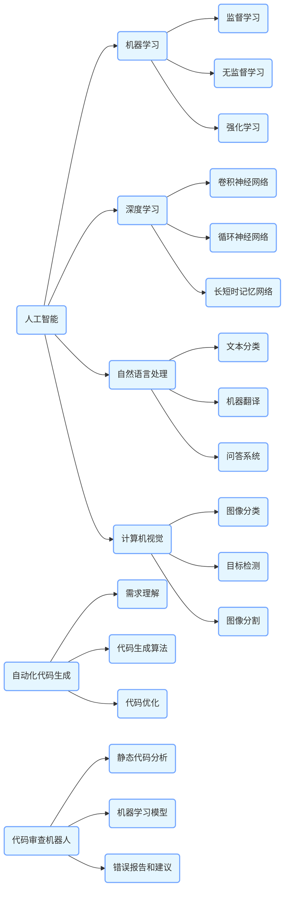

# 程序员如何应对AI带来的职场变革

> 关键词：程序员、AI、职场变革、应对策略、技能提升、职业发展

> 摘要：随着人工智能（AI）技术的迅猛发展，程序员的职场环境正经历着深刻的变革。本文深入探讨了AI给程序员带来的机遇与挑战，详细阐述了程序员应对职场变革所需掌握的核心概念、算法原理、数学模型等知识，并通过项目实战案例进行说明。同时，介绍了AI在实际应用场景中的表现，推荐了相关的学习资源、开发工具和论文著作。最后，总结了未来发展趋势与挑战，为程序员应对AI带来的职场变革提供了全面而深入的指导。

## 1. 背景介绍 
### 1.1 目的和范围
本文旨在帮助程序员全面了解AI带来的职场变革，并提供切实可行的应对策略。通过深入剖析AI对程序员职业的影响，涵盖从技术层面到职业发展层面的各个方面，为程序员在新的职场环境中找准定位、提升竞争力提供指引。范围涉及AI相关的核心概念、算法原理、实际应用场景，以及程序员在应对变革过程中所需的学习资源、开发工具等。

### 1.2 预期读者
本文主要面向广大程序员群体，包括初级程序员、有一定经验的中级程序员以及资深程序员。同时，对于关注科技行业发展、对程序员职业发展感兴趣的人员，如计算机专业学生、行业分析师等也具有一定的参考价值。

### 1.3 文档结构概述
本文将按照以下结构展开：首先介绍与AI和程序员职场变革相关的核心概念及它们之间的联系；接着深入讲解AI核心算法原理，并给出具体操作步骤；然后阐述相关的数学模型和公式，并举例说明；通过项目实战展示代码实现和详细解读；介绍AI在实际中的应用场景；推荐学习资源、开发工具和相关论文著作；最后总结未来发展趋势与挑战，并提供常见问题解答和扩展阅读参考资料。

### 1.4 术语表
#### 1.4.1 核心术语定义
- **人工智能（AI）**：是一门研究如何使计算机能够模拟人类智能的学科和技术领域，包括机器学习、深度学习、自然语言处理等多个分支。
- **机器学习（ML）**：是AI的一个重要分支，它让计算机通过数据学习模式和规律，从而能够进行预测和决策，而无需明确的编程指令。
- **深度学习（DL）**：是一种基于人工神经网络的机器学习技术，通过构建多层神经网络来学习数据的复杂特征和模式。
- **自动化代码生成**：指利用AI技术自动生成代码的过程，减少程序员手动编写代码的工作量。
- **代码审查机器人**：一种利用AI技术自动审查代码的工具，能够发现代码中的潜在问题和错误。

#### 1.4.2 相关概念解释
- **AI与程序员的关系**：AI既可以作为程序员的工具，帮助提高开发效率和质量，也可能在某些方面替代程序员的工作。例如，自动化代码生成工具可以快速生成一些基础代码，代码审查机器人可以自动检查代码的规范性和潜在错误。
- **职场变革**：指由于AI技术的发展，程序员的工作内容、技能要求、职业发展路径等方面发生的变化。例如，程序员需要掌握更多与AI相关的技能，工作重点可能从单纯的代码编写转向算法设计和模型调优等。

#### 1.4.3 缩略词列表
- **AI**：Artificial Intelligence（人工智能）
- **ML**：Machine Learning（机器学习）
- **DL**：Deep Learning（深度学习）
- **NLP**：Natural Language Processing（自然语言处理）
- **CV**：Computer Vision（计算机视觉）

## 2. 核心概念与联系 

### 核心概念原理
#### 人工智能（AI）
人工智能是一个广泛的领域，其目标是使计算机能够模拟人类的智能行为，如学习、推理、感知和决策。AI的实现主要依赖于各种算法和模型，其中机器学习和深度学习是当前最主流的方法。

机器学习通过让计算机从数据中学习模式和规律，从而实现对未知数据的预测和分类。例如，在垃圾邮件分类任务中，机器学习算法可以通过对大量邮件数据的学习，识别出垃圾邮件的特征，从而对新的邮件进行分类。

深度学习则是机器学习的一个子集，它通过构建多层神经网络来学习数据的复杂特征和模式。深度学习在图像识别、语音识别和自然语言处理等领域取得了巨大的成功。例如，在图像识别中，深度学习模型可以学习到图像中物体的特征，从而准确地识别出图像中的物体。

#### 自动化代码生成
自动化代码生成是利用AI技术自动生成代码的过程。它可以根据用户的需求和规范，自动生成符合要求的代码。自动化代码生成的实现主要依赖于自然语言处理和机器学习技术。例如，程序员可以使用自然语言描述代码的功能和需求，自动化代码生成工具可以将其转换为具体的代码。

#### 代码审查机器人
代码审查机器人是一种利用AI技术自动审查代码的工具。它可以检查代码的规范性、潜在错误和安全漏洞等。代码审查机器人的实现主要依赖于静态代码分析和机器学习技术。例如，它可以通过分析代码的语法和结构，发现代码中的潜在错误；通过学习大量的代码样本，识别出常见的安全漏洞。

### 架构的文本示意图
```plaintext
人工智能（AI）
|-- 机器学习（ML）
|   |-- 监督学习
|   |-- 无监督学习
|   |-- 强化学习
|-- 深度学习（DL）
|   |-- 卷积神经网络（CNN）
|   |-- 循环神经网络（RNN）
|   |-- 长短时记忆网络（LSTM）
|-- 自然语言处理（NLP）
|   |-- 文本分类
|   |-- 机器翻译
|   |-- 问答系统
|-- 计算机视觉（CV）
|   |-- 图像分类
|   |-- 目标检测
|   |-- 图像分割
自动化代码生成
|-- 需求理解
|-- 代码生成算法
|-- 代码优化
代码审查机器人
|-- 静态代码分析
|-- 机器学习模型
|-- 错误报告和建议
```

### Mermaid流程图


## 3. 核心算法原理 & 具体操作步骤 

### 机器学习算法 - 线性回归
#### 算法原理
线性回归是一种简单而常用的机器学习算法，用于预测连续数值的输出。它的基本思想是通过找到一条直线（在二维空间中）或超平面（在多维空间中），使得数据点到该直线或超平面的距离之和最小。

线性回归的数学模型可以表示为：

$$y = \theta_0 + \theta_1x_1 + \theta_2x_2 + \cdots + \theta_nx_n + \epsilon$$

其中，$y$ 是预测的输出值，$x_1, x_2, \cdots, x_n$ 是输入特征，$\theta_0, \theta_1, \cdots, \theta_n$ 是模型的参数，$\epsilon$ 是误差项。

线性回归的目标是通过最小化误差平方和来估计参数 $\theta$：

$$J(\theta) = \frac{1}{2m}\sum_{i=1}^{m}(h_{\theta}(x^{(i)}) - y^{(i)})^2$$

其中，$m$ 是样本数量，$h_{\theta}(x^{(i)})$ 是第 $i$ 个样本的预测值，$y^{(i)}$ 是第 $i$ 个样本的真实值。

#### Python代码实现
```python
import numpy as np
import matplotlib.pyplot as plt

# 生成一些示例数据
np.random.seed(0)
X = 2 * np.random.rand(100, 1)
y = 4 + 3 * X + np.random.randn(100, 1)

# 添加偏置项
X_b = np.c_[np.ones((100, 1)), X]

# 使用正规方程求解参数
theta_best = np.linalg.inv(X_b.T.dot(X_b)).dot(X_b.T).dot(y)

# 打印参数
print("参数 theta:", theta_best)

# 进行预测
X_new = np.array([[0], [2]])
X_new_b = np.c_[np.ones((2, 1)), X_new]
y_predict = X_new_b.dot(theta_best)

# 绘制数据和预测结果
plt.plot(X_new, y_predict, "r-", label="预测结果")
plt.plot(X, y, "b.")
plt.xlabel("$x_1$")
plt.ylabel("$y$")
plt.legend()
plt.show()
```

#### 具体操作步骤
1. **数据准备**：收集和整理输入特征 $X$ 和对应的输出值 $y$。
2. **添加偏置项**：为输入特征矩阵 $X$ 添加一列全为 1 的列，以表示偏置项 $\theta_0$。
3. **求解参数**：使用正规方程求解参数 $\theta$。
4. **进行预测**：使用求解得到的参数 $\theta$ 对新的输入数据进行预测。
5. **可视化结果**：将数据和预测结果绘制在图中，直观地观察模型的效果。

### 深度学习算法 - 简单的神经网络
#### 算法原理
神经网络是一种模仿人类神经系统的计算模型，由多个神经元组成。每个神经元接收输入信号，经过加权求和和激活函数处理后，输出一个信号。神经网络通过多层神经元的堆叠，能够学习到数据的复杂特征和模式。

一个简单的神经网络通常由输入层、隐藏层和输出层组成。输入层接收输入数据，隐藏层对输入数据进行特征提取和转换，输出层输出最终的预测结果。

神经网络的训练过程通常使用反向传播算法，通过不断调整神经元之间的权重，使得预测结果与真实结果之间的误差最小化。

#### Python代码实现
```python
import numpy as np

# 定义激活函数 - sigmoid
def sigmoid(x):
    return 1 / (1 + np.exp(-x))

# 定义 sigmoid 函数的导数
def sigmoid_derivative(x):
    return x * (1 - x)

# 输入数据集
X = np.array([[0, 0, 1],
              [0, 1, 1],
              [1, 0, 1],
              [1, 1, 1]])

# 输出数据集
y = np.array([[0], [1], [1], [0]])

# 设置随机种子，以便结果可重复
np.random.seed(1)

# 初始化权重
syn0 = 2 * np.random.random((3, 4)) - 1
syn1 = 2 * np.random.random((4, 1)) - 1

# 训练模型
for iter in range(60000):
    # 前向传播
    l0 = X
    l1 = sigmoid(np.dot(l0, syn0))
    l2 = sigmoid(np.dot(l1, syn1))

    # 计算误差
    l2_error = y - l2

    # 计算输出层的梯度
    l2_delta = l2_error * sigmoid_derivative(l2)

    # 计算隐藏层的误差
    l1_error = l2_delta.dot(syn1.T)

    # 计算隐藏层的梯度
    l1_delta = l1_error * sigmoid_derivative(l1)

    # 更新权重
    syn1 += l1.T.dot(l2_delta)
    syn0 += l0.T.dot(l1_delta)

# 打印最终预测结果
print("最终预测结果:")
print(l2)
```

#### 具体操作步骤
1. **定义激活函数**：选择合适的激活函数，如 sigmoid 函数，用于神经元的输出。
2. **准备数据**：准备输入数据集 $X$ 和输出数据集 $y$。
3. **初始化权重**：随机初始化神经网络各层之间的权重。
4. **前向传播**：将输入数据通过神经网络，计算各层的输出。
5. **计算误差**：计算预测结果与真实结果之间的误差。
6. **反向传播**：根据误差计算各层的梯度，并更新权重。
7. **重复训练**：重复步骤 4 - 6，直到误差达到满意的程度。
8. **进行预测**：使用训练好的神经网络对新的输入数据进行预测。

## 4. 数学模型和公式 & 详细讲解 & 举例说明 

### 线性回归的数学模型和公式
#### 数学模型
线性回归的数学模型可以表示为：

$$y = \theta_0 + \theta_1x_1 + \theta_2x_2 + \cdots + \theta_nx_n + \epsilon$$

其中，$y$ 是预测的输出值，$x_1, x_2, \cdots, x_n$ 是输入特征，$\theta_0, \theta_1, \cdots, \theta_n$ 是模型的参数，$\epsilon$ 是误差项。

#### 损失函数
线性回归的目标是通过最小化误差平方和来估计参数 $\theta$，误差平方和也称为损失函数，定义为：

$$J(\theta) = \frac{1}{2m}\sum_{i=1}^{m}(h_{\theta}(x^{(i)}) - y^{(i)})^2$$

其中，$m$ 是样本数量，$h_{\theta}(x^{(i)})$ 是第 $i$ 个样本的预测值，$y^{(i)}$ 是第 $i$ 个样本的真实值。

#### 正规方程
为了求解损失函数的最小值，可以使用正规方程：

$$\theta = (X^T X)^{-1} X^T y$$

其中，$X$ 是输入特征矩阵，$y$ 是输出向量。

#### 举例说明
假设我们有一个简单的数据集，包含两个特征 $x_1$ 和 $x_2$，以及对应的输出值 $y$：

| $x_1$ | $x_2$ | $y$ |
|-------|-------|-----|
| 1     | 2     | 3   |
| 2     | 3     | 5   |
| 3     | 4     | 7   |

首先，我们将数据集转换为矩阵形式：

$$X = \begin{bmatrix} 1 & 1 & 2 \\ 1 & 2 & 3 \\ 1 & 3 & 4 \end{bmatrix}, y = \begin{bmatrix} 3 \\ 5 \\ 7 \end{bmatrix}$$

然后，使用正规方程求解参数 $\theta$：

$$\theta = (X^T X)^{-1} X^T y = \begin{bmatrix} 1 \\ 2 \\ 0 \end{bmatrix}$$

因此，线性回归模型为：

$$y = 1 + 2x_1 + 0x_2$$

### 神经网络的数学模型和公式
#### 神经元模型
神经网络中的神经元可以用以下数学模型表示：

$$z = \sum_{i=1}^{n} w_i x_i + b$$

$$a = f(z)$$

其中，$x_1, x_2, \cdots, x_n$ 是输入信号，$w_1, w_2, \cdots, w_n$ 是权重，$b$ 是偏置，$z$ 是加权求和的结果，$f$ 是激活函数，$a$ 是神经元的输出。

#### 前向传播
神经网络的前向传播过程可以表示为：

$$z^{[l]} = W^{[l]} a^{[l-1]} + b^{[l]}$$

$$a^{[l]} = f(z^{[l]})$$

其中，$l$ 表示神经网络的层数，$W^{[l]}$ 是第 $l$ 层的权重矩阵，$b^{[l]}$ 是第 $l$ 层的偏置向量，$a^{[l]}$ 是第 $l$ 层的输出向量。

#### 损失函数
神经网络的损失函数通常使用交叉熵损失函数：

$$J(W, b) = -\frac{1}{m}\sum_{i=1}^{m}\sum_{k=1}^{K} y_k^{(i)} \log(a_k^{(i)})$$

其中，$m$ 是样本数量，$K$ 是输出类别的数量，$y_k^{(i)}$ 是第 $i$ 个样本的第 $k$ 个类别的真实标签，$a_k^{(i)}$ 是第 $i$ 个样本的第 $k$ 个类别的预测概率。

#### 反向传播
神经网络的反向传播过程用于计算损失函数对权重和偏置的梯度，以便更新权重和偏置。具体公式如下：

$$\delta^{[L]} = \nabla_{z^{[L]}} J = a^{[L]} - y$$

$$\delta^{[l]} = \left( (W^{[l+1]})^T \delta^{[l+1]} \right) \odot f'(z^{[l]})$$

$$\nabla_{W^{[l]}} J = \frac{1}{m} \delta^{[l]} (a^{[l-1]})^T$$

$$\nabla_{b^{[l]}} J = \frac{1}{m} \sum_{i=1}^{m} \delta^{[l](i)}$$

其中，$\delta^{[l]}$ 是第 $l$ 层的误差项，$\nabla_{W^{[l]}} J$ 是损失函数对第 $l$ 层权重矩阵的梯度，$\nabla_{b^{[l]}} J$ 是损失函数对第 $l$ 层偏置向量的梯度。

#### 举例说明
假设我们有一个简单的两层神经网络，输入层有 2 个神经元，隐藏层有 3 个神经元，输出层有 1 个神经元。输入数据为 $x = \begin{bmatrix} 0.5 \\ 0.3 \end{bmatrix}$，真实输出为 $y = 0.8$。

首先，我们随机初始化权重和偏置：

$$W^{[1]} = \begin{bmatrix} 0.1 & 0.2 \\ 0.3 & 0.4 \\ 0.5 & 0.6 \end{bmatrix}, b^{[1]} = \begin{bmatrix} 0.1 \\ 0.2 \\ 0.3 \end{bmatrix}$$

$$W^{[2]} = \begin{bmatrix} 0.7 & 0.8 & 0.9 \end{bmatrix}, b^{[2]} = \begin{bmatrix} 0.4 \end{bmatrix}$$

然后，进行前向传播：

$$z^{[1]} = W^{[1]} x + b^{[1]} = \begin{bmatrix} 0.1 \times 0.5 + 0.2 \times 0.3 + 0.1 \\ 0.3 \times 0.5 + 0.4 \times 0.3 + 0.2 \\ 0.5 \times 0.5 + 0.6 \times 0.3 + 0.3 \end{bmatrix} = \begin{bmatrix} 0.21 \\ 0.47 \\ 0.63 \end{bmatrix}$$

$$a^{[1]} = f(z^{[1]}) = \begin{bmatrix} \frac{1}{1 + e^{-0.21}} \\ \frac{1}{1 + e^{-0.47}} \\ \frac{1}{1 + e^{-0.63}} \end{bmatrix} = \begin{bmatrix} 0.55 \\ 0.61 \\ 0.65 \end{bmatrix}$$

$$z^{[2]} = W^{[2]} a^{[1]} + b^{[2]} = \begin{bmatrix} 0.7 \times 0.55 + 0.8 \times 0.61 + 0.9 \times 0.65 + 0.4 \end{bmatrix} = \begin{bmatrix} 1.62 \end{bmatrix}$$

$$a^{[2]} = f(z^{[2]}) = \begin{bmatrix} \frac{1}{1 + e^{-1.62}} \end{bmatrix} = \begin{bmatrix} 0.83 \end{bmatrix}$$

接着，计算损失函数：

$$J = -\frac{1}{1} \left( 0.8 \log(0.83) + (1 - 0.8) \log(1 - 0.83) \right) = 0.17$$

最后，进行反向传播：

$$\delta^{[2]} = a^{[2]} - y = \begin{bmatrix} 0.83 - 0.8 \end{bmatrix} = \begin{bmatrix} 0.03 \end{bmatrix}$$

$$\delta^{[1]} = \left( (W^{[2]})^T \delta^{[2]} \right) \odot f'(z^{[1]}) = \begin{bmatrix} 0.7 \times 0.03 \times 0.55 \times (1 - 0.55) \\ 0.8 \times 0.03 \times 0.61 \times (1 - 0.61) \\ 0.9 \times 0.03 \times 0.65 \times (1 - 0.65) \end{bmatrix} = \begin{bmatrix} 0.005 \\ 0.006 \\ 0.006 \end{bmatrix}$$

$$\nabla_{W^{[2]}} J = \frac{1}{1} \delta^{[2]} (a^{[1]})^T = \begin{bmatrix} 0.03 \times 0.55 & 0.03 \times 0.61 & 0.03 \times 0.65 \end{bmatrix} = \begin{bmatrix} 0.017 & 0.018 & 0.019 \end{bmatrix}$$

$$\nabla_{b^{[2]}} J = \frac{1}{1} \sum_{i=1}^{1} \delta^{[2](i)} = \begin{bmatrix} 0.03 \end{bmatrix}$$

$$\nabla_{W^{[1]}} J = \frac{1}{1} \delta^{[1]} x^T = \begin{bmatrix} 0.005 \times 0.5 & 0.005 \times 0.3 \\ 0.006 \times 0.5 & 0.006 \times 0.3 \\ 0.006 \times 0.5 & 0.006 \times 0.3 \end{bmatrix} = \begin{bmatrix} 0.002 & 0.001 \\ 0.003 & 0.002 \\ 0.003 & 0.002 \end{bmatrix}$$

$$\nabla_{b^{[1]}} J = \frac{1}{1} \sum_{i=1}^{1} \delta^{[1](i)} = \begin{bmatrix} 0.005 \\ 0.006 \\ 0.006 \end{bmatrix}$$

根据这些梯度，我们可以更新权重和偏置，不断迭代训练神经网络。

## 5. 项目实战：代码实际案例和详细解释说明 

### 5.1  开发环境搭建
#### 安装 Python
首先，需要安装 Python 环境。可以从 Python 官方网站（https://www.python.org/downloads/）下载适合自己操作系统的 Python 安装包，并按照安装向导进行安装。

#### 安装常用库
在 Python 环境中，我们需要安装一些常用的库，如 NumPy、Pandas、Matplotlib、Scikit-learn 等。可以使用以下命令进行安装：

```bash
pip install numpy pandas matplotlib scikit-learn
```

#### 安装深度学习框架
如果要进行深度学习相关的项目，还需要安装深度学习框架，如 TensorFlow 或 PyTorch。可以使用以下命令安装 TensorFlow：

```bash
pip install tensorflow
```

或者安装 PyTorch：

```bash
pip install torch torchvision
```

### 5.2  源代码详细实现和代码解读
#### 项目背景
我们要实现一个简单的手写数字识别项目，使用的数据集是 MNIST 数据集。MNIST 数据集包含 60,000 个训练样本和 10,000 个测试样本，每个样本是一个 28x28 的灰度图像，代表 0 - 9 之间的一个数字。

#### 代码实现
```python
import tensorflow as tf
from tensorflow.keras.datasets import mnist
from tensorflow.keras.models import Sequential
from tensorflow.keras.layers import Flatten, Dense
from tensorflow.keras.utils import to_categorical
import matplotlib.pyplot as plt

# 加载 MNIST 数据集
(train_images, train_labels), (test_images, test_labels) = mnist.load_data()

# 数据预处理
train_images = train_images / 255.0
test_images = test_images / 255.0

train_labels = to_categorical(train_labels)
test_labels = to_categorical(test_labels)

# 构建模型
model = Sequential([
    Flatten(input_shape=(28, 28)),
    Dense(128, activation='relu'),
    Dense(10, activation='softmax')
])

# 编译模型
model.compile(optimizer='adam',
              loss='categorical_crossentropy',
              metrics=['accuracy'])

# 训练模型
history = model.fit(train_images, train_labels, epochs=5, batch_size=64, validation_data=(test_images, test_labels))

# 评估模型
test_loss, test_acc = model.evaluate(test_images, test_labels)
print(f"测试集损失: {test_loss}, 测试集准确率: {test_acc}")

# 绘制训练过程中的损失和准确率曲线
plt.plot(history.history['accuracy'], label='训练准确率')
plt.plot(history.history['val_accuracy'], label='验证准确率')
plt.plot(history.history['loss'], label='训练损失')
plt.plot(history.history['val_loss'], label='验证损失')
plt.xlabel('Epoch')
plt.ylabel('准确率 / 损失')
plt.legend()
plt.show()
```

#### 代码解读
1. **数据加载**：使用 `mnist.load_data()` 函数加载 MNIST 数据集，将其分为训练集和测试集。
2. **数据预处理**：将图像像素值归一化到 0 - 1 之间，同时将标签进行 one-hot 编码。
3. **模型构建**：使用 `Sequential` 模型构建一个简单的神经网络，包含一个 Flatten 层、一个全连接层和一个输出层。
4. **模型编译**：指定优化器、损失函数和评估指标。
5. **模型训练**：使用 `fit` 方法对模型进行训练，指定训练数据、训练轮数和批次大小。
6. **模型评估**：使用 `evaluate` 方法对模型在测试集上的性能进行评估。
7. **可视化训练过程**：使用 Matplotlib 库绘制训练过程中的损失和准确率曲线。

### 5.3  代码解读与分析
#### 模型结构分析
- **Flatten 层**：将输入的 28x28 图像展平为一维向量，方便后续全连接层的处理。
- **Dense 层（隐藏层）**：包含 128 个神经元，使用 ReLU 激活函数。ReLU 激活函数可以引入非线性，增强模型的表达能力。
- **Dense 层（输出层）**：包含 10 个神经元，使用 Softmax 激活函数。Softmax 函数将输出转换为概率分布，每个神经元代表一个数字的预测概率。

#### 训练过程分析
- **优化器**：使用 Adam 优化器，它是一种自适应学习率的优化算法，能够在训练过程中自动调整学习率，提高训练效率。
- **损失函数**：使用交叉熵损失函数，适用于多分类问题。交叉熵损失函数能够衡量模型预测结果与真实标签之间的差异。
- **评估指标**：使用准确率作为评估指标，它表示模型预测正确的样本数占总样本数的比例。

#### 训练结果分析
通过绘制训练过程中的损失和准确率曲线，可以观察模型的训练情况。如果训练准确率和验证准确率都不断上升，且两者之间的差距较小，说明模型训练效果较好。如果验证准确率出现下降或波动较大，可能是模型过拟合或训练数据不足。

## 6. 实际应用场景 
### 自动化代码生成
在软件开发过程中，自动化代码生成可以大大提高开发效率。例如，在 Web 开发中，可以使用自动化代码生成工具根据数据库表结构自动生成数据库访问层的代码，减少手动编写代码的工作量。在移动应用开发中，也可以使用自动化代码生成工具生成界面布局和基本的业务逻辑代码。

### 代码审查和质量保证
代码审查机器人可以自动检查代码的规范性、潜在错误和安全漏洞。例如，它可以检查代码是否符合编码规范，是否存在空指针引用、数组越界等潜在错误，是否存在 SQL 注入、跨站脚本攻击等安全漏洞。代码审查机器人可以在代码提交前进行检查，及时发现问题并提供修改建议，提高代码质量。

### 智能编程助手
智能编程助手可以根据程序员的输入提供代码补全、错误提示和解决方案等功能。例如，当程序员输入一段代码时，智能编程助手可以根据上下文自动补全代码，提供相关的函数和类的使用建议。当代码出现错误时，智能编程助手可以分析错误信息，提供可能的解决方案。

### 数据科学和机器学习项目
在数据科学和机器学习项目中，AI 技术可以帮助程序员更高效地完成数据处理、模型训练和评估等任务。例如，使用自动化特征工程工具可以自动选择和转换特征，提高模型的性能。使用自动机器学习平台可以自动选择合适的模型和超参数，减少人工调参的工作量。

## 7. 工具和资源推荐
### 7.1 学习资源推荐
#### 7.1.1 书籍推荐
- 《机器学习》（周志华著）：这本书是机器学习领域的经典教材，全面介绍了机器学习的基本概念、算法和应用。
- 《深度学习》（Ian Goodfellow、Yoshua Bengio 和 Aaron Courville 著）：这本书是深度学习领域的权威著作，详细介绍了深度学习的原理、算法和实践。
- 《Python 数据分析实战》（Sebastian Raschka 著）：这本书介绍了如何使用 Python 进行数据分析和机器学习，包含了大量的实际案例和代码示例。

#### 7.1.2 在线课程
- Coursera 上的《机器学习》课程（Andrew Ng 教授）：这是一门非常经典的机器学习课程，讲解深入浅出，适合初学者。
- edX 上的《深度学习》课程（由多个知名教授联合授课）：该课程全面介绍了深度学习的各个方面，包括卷积神经网络、循环神经网络等。
- Kaggle 上的机器学习和数据分析教程：Kaggle 是一个数据科学竞赛平台，提供了丰富的机器学习和数据分析教程和案例。

#### 7.1.3 技术博客和网站
- Medium：Medium 上有很多关于 AI 和编程的优质博客文章，涵盖了最新的技术趋势和实践经验。
- Towards Data Science：这是一个专注于数据科学和机器学习的博客平台，有很多专业的文章和教程。
- GitHub：GitHub 上有很多开源的 AI 项目和代码库，可以学习他人的代码和经验。

### 7.2 开发工具框架推荐
#### 7.2.1 IDE和编辑器
- PyCharm：是一款专门为 Python 开发设计的集成开发环境，提供了丰富的代码编辑、调试和分析功能。
- Visual Studio Code：是一款轻量级的代码编辑器，支持多种编程语言，有大量的插件可以扩展功能。
- Jupyter Notebook：是一个交互式的编程环境，适合进行数据探索和模型实验，支持 Python、R 等多种编程语言。

#### 7.2.2 调试和性能分析工具
- TensorBoard：是 TensorFlow 提供的一个可视化工具，可以用于监控模型的训练过程、查看模型的结构和性能指标等。
- PyTorch Profiler：是 PyTorch 提供的一个性能分析工具，可以帮助开发者找出代码中的性能瓶颈。
- cProfile：是 Python 内置的一个性能分析工具，可以分析代码的运行时间和函数调用情况。

#### 7.2.3 相关框架和库
- TensorFlow：是一个开源的深度学习框架，由 Google 开发，具有广泛的应用和丰富的文档。
- PyTorch：是一个开源的深度学习框架，由 Facebook 开发，具有动态图的优势，适合快速开发和研究。
- Scikit-learn：是一个简单易用的机器学习库，提供了各种机器学习算法和工具，适合初学者。

### 7.3 相关论文著作推荐
#### 7.3.1 经典论文
- 《Gradient-based learning applied to document recognition》（Yann LeCun 等）：这篇论文介绍了卷积神经网络（CNN）的经典模型 LeNet，开创了深度学习在图像识别领域的应用。
- 《Long Short-Term Memory》（Sepp Hochreiter 和 Jürgen Schmidhuber）：这篇论文提出了长短时记忆网络（LSTM），解决了循环神经网络（RNN）中的梯度消失问题。
- 《Attention Is All You Need》（Ashish Vaswani 等）：这篇论文提出了 Transformer 模型，在自然语言处理领域取得了巨大的成功。

#### 7.3.2 最新研究成果
- arXiv 是一个预印本平台，上面有很多最新的 AI 研究成果和论文。可以关注其中与自己感兴趣的领域相关的论文。
- NeurIPS、ICML、CVPR 等顶级学术会议的论文集，这些会议收录了 AI 领域的最新研究成果和技术。

#### 7.3.3 应用案例分析
- 《AI in Practice: How 50 Successful Companies Used Artificial Intelligence to Solve Problems》（Thomas H. Davenport 和 Rajeev Ronanki 著）：这本书介绍了 50 个成功应用 AI 技术解决实际问题的案例，涵盖了各个行业。
- Kaggle 上的竞赛案例：Kaggle 上有很多真实的数据集和竞赛案例，可以学习他人在实际项目中如何应用 AI 技术。

## 8. 总结：未来发展趋势与挑战
### 未来发展趋势
#### AI 与编程的深度融合
未来，AI 将与编程更加深度融合，自动化代码生成、智能编程助手等工具将变得更加智能和强大。程序员可以借助这些工具提高开发效率和代码质量，将更多的精力放在业务逻辑和算法设计上。

#### 跨领域技能需求增加
随着 AI 技术的广泛应用，程序员需要具备跨领域的技能，如数据科学、机器学习、计算机视觉等。能够将 AI 技术应用到不同领域的程序员将更具竞争力。

#### 开源和协作开发的重要性
开源社区将继续在 AI 和编程领域发挥重要作用。程序员可以通过参与开源项目，学习他人的经验和技术，同时也可以为开源社区做出贡献。协作开发将变得更加普遍，程序员需要具备良好的团队协作能力。

### 挑战
#### 技术更新换代快
AI 技术发展迅速，新的算法和框架不断涌现。程序员需要不断学习和更新自己的知识，跟上技术的发展步伐。否则，可能会面临技术过时的风险。

#### 就业竞争加剧
随着 AI 技术的普及，越来越多的人开始学习编程和 AI 技术，就业竞争将变得更加激烈。程序员需要不断提升自己的技能和竞争力，才能在就业市场中脱颖而出。

#### 伦理和法律问题
AI 技术的应用也带来了一些伦理和法律问题，如数据隐私、算法偏见、人工智能的责任等。程序员需要了解相关的伦理和法律规定，确保自己的开发工作符合道德和法律要求。

## 9. 附录：常见问题与解答
### 问题 1：AI 会完全取代程序员吗？
答：目前来看，AI 不会完全取代程序员。虽然 AI 可以在某些方面辅助程序员工作，如自动化代码生成和代码审查，但编程不仅仅是代码编写，还涉及到业务逻辑理解、算法设计、系统架构等多个方面。程序员的创造力、逻辑思维和问题解决能力是 AI 难以替代的。

### 问题 2：程序员需要学习哪些 AI 相关的知识？
答：程序员可以学习机器学习、深度学习、自然语言处理等基础知识，掌握常见的算法和模型，如线性回归、神经网络、卷积神经网络等。同时，还可以学习相关的工具和框架，如 TensorFlow、PyTorch 等。

### 问题 3：如何提高自己在 AI 时代的竞争力？
答：可以通过以下几个方面提高竞争力：不断学习和更新知识，掌握最新的 AI 技术和编程技能；参与实际项目，积累实践经验；提高自己的跨领域能力，如数据科学、数学等；培养良好的团队协作能力和沟通能力。

### 问题 4：AI 技术对不同经验水平的程序员有什么影响？
答：对于初级程序员来说，AI 技术可以提供更多的学习和实践机会，帮助他们更快地掌握编程技能。但也可能面临就业竞争加剧的问题。对于有经验的程序员来说，AI 技术可以作为工具提高工作效率和质量，同时也需要不断学习和适应新的技术发展。

## 10. 扩展阅读 & 参考资料
### 扩展阅读
- 《AI Superpowers: China, Silicon Valley, and the New World Order》（Kai-Fu Lee 著）：这本书探讨了中美在 AI 领域的竞争和合作，以及 AI 对全球经济和社会的影响。
- 《The Master Algorithm: How the Quest for the Ultimate Learning Machine Will Remake Our World》（Pedro Domingos 著）：这本书介绍了机器学习的发展历程和未来趋势，以及寻找通用学习算法的探索。

### 参考资料
- TensorFlow 官方文档：https://www.tensorflow.org/api_docs
- PyTorch 官方文档：https://pytorch.org/docs/stable/index.html
- Scikit-learn 官方文档：https://scikit-learn.org/stable/documentation.html
- MNIST 数据集官网：http://yann.lecun.com/exdb/mnist/