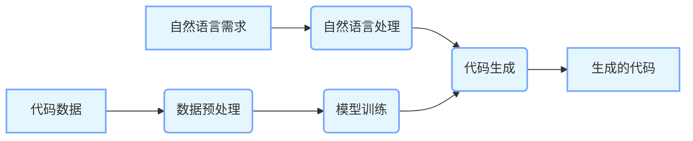

# 程序员如何适应AI驱动的编程工作环境变化研究

> 关键词：程序员、AI驱动编程、工作环境变化、适应策略、技术发展

> 摘要：随着人工智能技术的飞速发展，编程工作环境正经历着深刻的变革。AI驱动的编程工具和技术逐渐普及，为程序员带来了新的机遇和挑战。本文旨在深入研究程序员如何适应这种变化，通过分析背景信息、核心概念、算法原理、数学模型、实战案例等多个方面，为程序员提供全面的指导和建议。同时，探讨了实际应用场景、推荐了相关工具和资源，并对未来发展趋势与挑战进行了总结。

## 1. 背景介绍 
### 1.1 目的和范围
本研究的目的是帮助程序员更好地理解AI驱动的编程工作环境变化，并提供切实可行的适应策略。研究范围涵盖了AI在编程领域的主要应用、对程序员工作方式的影响、适应变化所需的技能和知识，以及未来可能的发展方向。

### 1.2 预期读者
本文主要面向广大程序员，尤其是那些希望在AI时代保持竞争力、提升自身编程能力的专业人士。同时，也可供软件企业的管理者、技术爱好者以及相关教育工作者参考。

### 1.3 文档结构概述
本文将按照以下结构展开：首先介绍背景信息，包括目的、预期读者和文档结构；接着阐述核心概念与联系，分析AI驱动编程的原理和架构；然后详细讲解核心算法原理和具体操作步骤，并通过数学模型和公式进行深入分析；之后通过项目实战案例展示如何在实际中应用这些技术；再探讨实际应用场景和推荐相关工具与资源；最后总结未来发展趋势与挑战，并提供常见问题解答和扩展阅读参考资料。

### 1.4 术语表
#### 1.4.1 核心术语定义
- **AI驱动编程**：指利用人工智能技术辅助或自动化编程过程的方法和实践，包括代码生成、代码审查、错误检测等。
- **机器学习**：是一门多领域交叉学科，涉及概率论、统计学、逼近论、凸分析、算法复杂度理论等多门学科。它专门研究计算机怎样模拟或实现人类的学习行为，以获取新的知识或技能，重新组织已有的知识结构使之不断改善自身的性能。
- **深度学习**：是机器学习的一个分支领域，它是一种基于对数据进行表征学习的方法。深度学习通过构建具有很多层的神经网络模型，自动从大量数据中学习特征和模式。
- **代码生成器**：一种AI工具，能够根据用户提供的需求描述自动生成代码。

#### 1.4.2 相关概念解释
- **自然语言处理（NLP）**：是人工智能的一个子领域，主要研究如何让计算机理解和处理人类语言。在编程中，NLP可用于将自然语言描述转换为代码。
- **自动化测试**：利用软件工具自动执行测试用例，验证软件的功能和性能。AI可以辅助自动化测试，提高测试效率和准确性。

#### 1.4.3 缩略词列表
- **AI**：Artificial Intelligence（人工智能）
- **ML**：Machine Learning（机器学习）
- **DL**：Deep Learning（深度学习）
- **NLP**：Natural Language Processing（自然语言处理）

## 2. 核心概念与联系 

### 2.1 AI驱动编程的核心概念原理
AI驱动编程的核心原理是利用机器学习和深度学习算法，对大量的代码数据进行学习和分析，从而实现代码的自动生成、优化和错误检测等功能。具体来说，主要包括以下几个方面：

#### 2.1.1 数据驱动的学习
AI系统通过学习大量的开源代码、项目文档和编程规范，掌握不同编程语言的语法、语义和编程模式。例如，通过对GitHub上的代码仓库进行分析，AI可以学习到不同类型项目的代码结构和实现方式。

#### 2.1.2 模型训练
使用机器学习和深度学习模型，如循环神经网络（RNN）、长短时记忆网络（LSTM）和Transformer等，对代码数据进行训练。这些模型可以学习到代码中的模式和规律，并根据输入的需求生成相应的代码。

#### 2.1.3 自然语言交互
借助自然语言处理技术，允许程序员使用自然语言描述需求，AI系统将其转换为代码。例如，程序员可以输入“创建一个简单的Web服务器”，AI代码生成器将生成相应的代码。

### 2.2 架构示意图
以下是一个简化的AI驱动编程系统的架构示意图：



### 2.3 核心概念之间的联系
数据是AI驱动编程的基础，通过对大量代码数据的学习和分析，训练出有效的模型。自然语言处理技术使得程序员可以更方便地与AI系统交互，将自然语言需求转化为代码。模型训练的结果直接影响代码生成的质量和准确性。代码生成器则是将训练好的模型和自然语言处理的结果结合起来，生成符合需求的代码。

## 3. 核心算法原理 & 具体操作步骤 

### 3.1 核心算法原理
#### 3.1.1 循环神经网络（RNN）
RNN是一种用于处理序列数据的神经网络，它可以捕捉序列中的时间依赖关系。在编程中，代码可以看作是一种序列数据，RNN可以学习到代码中的顺序和上下文信息。

以下是一个简单的RNN的Python实现：

```python
import numpy as np

class SimpleRNN:
    def __init__(self, input_size, hidden_size):
        self.input_size = input_size
        self.hidden_size = hidden_size
        self.Wxh = np.random.randn(hidden_size, input_size) * 0.01
        self.Whh = np.random.randn(hidden_size, hidden_size) * 0.01
        self.Why = np.random.randn(input_size, hidden_size) * 0.01
        self.bh = np.zeros((hidden_size, 1))
        self.by = np.zeros((input_size, 1))

    def forward(self, inputs):
        h = np.zeros((self.hidden_size, 1))
        for x in inputs:
            x = x.reshape(-1, 1)
            h = np.tanh(np.dot(self.Wxh, x) + np.dot(self.Whh, h) + self.bh)
            y = np.dot(self.Why, h) + self.by
        return y

# 示例使用
input_size = 10
hidden_size = 20
rnn = SimpleRNN(input_size, hidden_size)
inputs = [np.random.randn(input_size) for _ in range(5)]
output = rnn.forward(inputs)
print(output)
```

#### 3.1.2 长短时记忆网络（LSTM）
LSTM是RNN的一种改进版本，它解决了RNN在处理长序列时的梯度消失问题。LSTM通过引入门控机制，能够更好地捕捉序列中的长期依赖关系。

以下是一个简单的LSTM的Python实现：

```python
import numpy as np

class LSTM:
    def __init__(self, input_size, hidden_size):
        self.input_size = input_size
        self.hidden_size = hidden_size
        self.Wf = np.random.randn(hidden_size, input_size + hidden_size) * 0.01
        self.bf = np.zeros((hidden_size, 1))
        self.Wi = np.random.randn(hidden_size, input_size + hidden_size) * 0.01
        self.bi = np.zeros((hidden_size, 1))
        self.Wc = np.random.randn(hidden_size, input_size + hidden_size) * 0.01
        self.bc = np.zeros((hidden_size, 1))
        self.Wo = np.random.randn(hidden_size, input_size + hidden_size) * 0.01
        self.bo = np.zeros((hidden_size, 1))
        self.Wy = np.random.randn(input_size, hidden_size) * 0.01
        self.by = np.zeros((input_size, 1))

    def sigmoid(self, x):
        return 1 / (1 + np.exp(-x))

    def forward(self, inputs):
        h = np.zeros((self.hidden_size, 1))
        c = np.zeros((self.hidden_size, 1))
        for x in inputs:
            x = x.reshape(-1, 1)
            combined = np.vstack((h, x))
            f = self.sigmoid(np.dot(self.Wf, combined) + self.bf)
            i = self.sigmoid(np.dot(self.Wi, combined) + self.bi)
            c_tilde = np.tanh(np.dot(self.Wc, combined) + self.bc)
            c = f * c + i * c_tilde
            o = self.sigmoid(np.dot(self.Wo, combined) + self.bo)
            h = o * np.tanh(c)
            y = np.dot(self.Wy, h) + self.by
        return y

# 示例使用
input_size = 10
hidden_size = 20
lstm = LSTM(input_size, hidden_size)
inputs = [np.random.randn(input_size) for _ in range(5)]
output = lstm.forward(inputs)
print(output)
```

### 3.2 具体操作步骤
#### 3.2.1 数据收集和预处理
- 收集大量的代码数据，可以从开源代码库、项目文档等渠道获取。
- 对数据进行清洗和标注，去除噪声和无效信息，并为代码添加必要的标签。
- 将数据划分为训练集、验证集和测试集，用于模型的训练、评估和测试。

#### 3.2.2 模型选择和训练
- 根据任务需求选择合适的模型，如RNN、LSTM或Transformer等。
- 使用训练集对模型进行训练，调整模型的参数以最小化损失函数。
- 在验证集上评估模型的性能，根据评估结果调整模型的超参数。

#### 3.2.3 代码生成和优化
- 使用训练好的模型，根据自然语言需求生成代码。
- 对生成的代码进行优化和调试，确保代码的质量和正确性。
- 可以使用自动化测试工具对生成的代码进行测试，进一步提高代码的可靠性。

## 4. 数学模型和公式 & 详细讲解 & 举例说明 

### 4.1 损失函数
在模型训练过程中，需要定义一个损失函数来衡量模型预测结果与真实值之间的差异。常用的损失函数包括交叉熵损失和均方误差损失。

#### 4.1.1 交叉熵损失
交叉熵损失常用于分类问题，其公式为：

$$
H(p, q) = -\sum_{i=1}^{n} p_i \log(q_i)
$$

其中，$p$ 是真实概率分布，$q$ 是预测概率分布，$n$ 是类别数。

#### 4.1.2 均方误差损失
均方误差损失常用于回归问题，其公式为：

$$
MSE = \frac{1}{n} \sum_{i=1}^{n} (y_i - \hat{y}_i)^2
$$

其中，$y_i$ 是真实值，$\hat{y}_i$ 是预测值，$n$ 是样本数。

### 4.2 梯度下降算法
梯度下降算法是一种常用的优化算法，用于最小化损失函数。其基本思想是沿着损失函数的负梯度方向更新模型的参数。

梯度下降算法的更新公式为：

$$
\theta_{t+1} = \theta_t - \alpha \nabla J(\theta_t)
$$

其中，$\theta_t$ 是第 $t$ 次迭代时的模型参数，$\alpha$ 是学习率，$\nabla J(\theta_t)$ 是损失函数 $J$ 关于 $\theta_t$ 的梯度。

### 4.3 举例说明
假设我们有一个简单的线性回归问题，目标是预测房价。我们有一组训练数据 $(x_i, y_i)$，其中 $x_i$ 是房屋的特征（如面积、房间数等），$y_i$ 是房屋的真实价格。

我们的线性回归模型可以表示为：

$$
\hat{y}_i = \theta_0 + \theta_1 x_{i1} + \theta_2 x_{i2} + \cdots + \theta_n x_{in}
$$

其中，$\theta_0, \theta_1, \cdots, \theta_n$ 是模型的参数。

损失函数选择均方误差损失：

$$
J(\theta) = \frac{1}{2m} \sum_{i=1}^{m} (\hat{y}_i - y_i)^2
$$

其中，$m$ 是训练样本数。

使用梯度下降算法更新参数：

$$
\theta_j := \theta_j - \alpha \frac{1}{m} \sum_{i=1}^{m} (\hat{y}_i - y_i) x_{ij}
$$

以下是一个简单的Python实现：

```python
import numpy as np

# 生成一些示例数据
X = np.array([[1, 2], [2, 3], [3, 4]])
y = np.array([3, 5, 7])

# 初始化参数
theta = np.zeros(X.shape[1])

# 学习率
alpha = 0.01

# 迭代次数
num_iterations = 1000

# 梯度下降算法
for _ in range(num_iterations):
    h = np.dot(X, theta)
    error = h - y
    gradient = np.dot(X.T, error) / len(X)
    theta = theta - alpha * gradient

print("最终参数:", theta)
```

## 5. 项目实战：代码实际案例和详细解释说明 

### 5.1  开发环境搭建
#### 5.1.1 安装Python
首先，确保你已经安装了Python。可以从Python官方网站（https://www.python.org/downloads/）下载并安装适合你操作系统的Python版本。

#### 5.1.2 安装必要的库
使用pip安装以下必要的库：

```bash
pip install numpy pandas tensorflow torch scikit-learn
```

### 5.2  源代码详细实现和代码解读
#### 5.2.1 简单的代码生成器
以下是一个简单的基于RNN的代码生成器的实现：

```python
import numpy as np
import torch
import torch.nn as nn

# 定义RNN模型
class SimpleRNN(nn.Module):
    def __init__(self, input_size, hidden_size, output_size):
        super(SimpleRNN, self).__init__()
        self.hidden_size = hidden_size
        self.rnn = nn.RNN(input_size, hidden_size, batch_first=True)
        self.fc = nn.Linear(hidden_size, output_size)

    def forward(self, x):
        h0 = torch.zeros(1, x.size(0), self.hidden_size).to(x.device)
        out, _ = self.rnn(x, h0)
        out = self.fc(out[:, -1, :])
        return out

# 生成一些示例数据
input_size = 10
hidden_size = 20
output_size = 10
batch_size = 32
sequence_length = 5

x = torch.randn(batch_size, sequence_length, input_size)

# 初始化模型
model = SimpleRNN(input_size, hidden_size, output_size)

# 前向传播
output = model(x)
print(output.shape)
```

#### 5.2.2 代码解读
- `SimpleRNN` 类继承自 `nn.Module`，定义了一个简单的RNN模型。
- `__init__` 方法初始化模型的参数，包括输入大小、隐藏大小和输出大小。
- `forward` 方法定义了模型的前向传播过程，包括RNN层和全连接层。
- 生成示例数据并初始化模型，然后进行前向传播，输出结果的形状为 `(batch_size, output_size)`。

### 5.3  代码解读与分析
#### 5.3.1 模型结构分析
该代码生成器使用了一个简单的RNN模型，包括一个RNN层和一个全连接层。RNN层用于处理输入序列，捕捉序列中的时间依赖关系；全连接层用于将RNN层的输出映射到最终的输出空间。

#### 5.3.2 数据处理分析
输入数据的形状为 `(batch_size, sequence_length, input_size)`，表示一个批次中有 `batch_size` 个序列，每个序列的长度为 `sequence_length`，每个时间步的输入特征维度为 `input_size`。

#### 5.3.3 性能分析
由于使用的是简单的RNN模型，可能在处理长序列时存在梯度消失问题。可以考虑使用更复杂的模型，如LSTM或Transformer，来提高模型的性能。

## 6. 实际应用场景 
### 6.1 代码生成
AI驱动的代码生成器可以根据用户的自然语言描述自动生成代码，大大提高了编程效率。例如，在开发Web应用时，程序员可以输入“创建一个用户登录页面”，代码生成器将生成相应的HTML、CSS和JavaScript代码。

### 6.2 代码审查
AI可以帮助程序员进行代码审查，自动检测代码中的错误、潜在的安全漏洞和不符合编程规范的地方。例如，使用静态代码分析工具和机器学习模型，对代码进行全面的检查和评估。

### 6.3 自动化测试
利用AI技术可以实现自动化测试用例的生成和执行。AI可以根据代码的结构和功能，自动生成测试用例，并模拟不同的输入和场景，对代码进行测试。这可以提高测试的覆盖率和效率，减少人工测试的工作量。

### 6.4 智能编程助手
AI智能编程助手可以为程序员提供实时的代码建议、错误提示和解决方案。例如，当程序员在编写代码时遇到问题，智能编程助手可以根据上下文和历史数据，提供相关的代码片段和解释。

## 7. 工具和资源推荐
### 7.1 学习资源推荐
#### 7.1.1 书籍推荐
- 《深度学习》（Deep Learning），作者：Ian Goodfellow、Yoshua Bengio和Aaron Courville，这本书是深度学习领域的经典著作，全面介绍了深度学习的理论和实践。
- 《Python机器学习》（Python Machine Learning），作者：Sebastian Raschka和Vahid Mirjalili，本书详细介绍了使用Python进行机器学习的方法和技巧。
- 《动手学深度学习》（Dive into Deep Learning），作者：阿斯顿·张、李沐等，这是一本开源的深度学习教材，提供了丰富的代码示例和实践项目。

#### 7.2.2 在线课程
- Coursera上的“深度学习专项课程”（Deep Learning Specialization），由Andrew Ng教授授课，是学习深度学习的优质课程。
- edX上的“使用Python进行数据科学”（Data Science with Python），介绍了Python在数据科学中的应用。
- 哔哩哔哩（Bilibili）上有许多关于编程和人工智能的免费教程，可以根据自己的需求选择学习。

#### 7.2.3 技术博客和网站
- Medium：一个汇集了众多技术专家和开发者的博客平台，有很多关于AI和编程的优质文章。
- Towards Data Science：专注于数据科学和机器学习领域的博客，提供了最新的研究成果和实践经验。
- GitHub：是全球最大的开源代码托管平台，可以在上面找到许多优秀的开源项目和代码示例。

### 7.2 开发工具框架推荐
#### 7.2.1 IDE和编辑器
- PyCharm：是一款专业的Python集成开发环境，提供了丰富的功能和插件，适合Python开发。
- Visual Studio Code：是一款轻量级的代码编辑器，支持多种编程语言，具有强大的扩展功能。
- Jupyter Notebook：是一个交互式的编程环境，适合数据科学和机器学习的开发和实验。

#### 7.2.2 调试和性能分析工具
- PDB：Python自带的调试器，可以帮助程序员定位和解决代码中的问题。
- cProfile：Python的性能分析工具，可以分析代码的运行时间和资源消耗。
- TensorBoard：是TensorFlow的可视化工具，用于监控和分析深度学习模型的训练过程。

#### 7.2.3 相关框架和库
- TensorFlow：是一个开源的机器学习框架，广泛应用于深度学习领域。
- PyTorch：是另一个流行的深度学习框架，具有动态图和易于使用的特点。
- Scikit-learn：是一个用于机器学习的Python库，提供了丰富的算法和工具。

### 7.3 相关论文著作推荐
#### 7.3.1 经典论文
- “Attention Is All You Need”，介绍了Transformer模型，是自然语言处理领域的重要突破。
- “Generative Adversarial Nets”，提出了生成对抗网络（GAN），在图像生成和数据增强等方面有广泛应用。
- “Long Short-Term Memory”，详细介绍了LSTM模型的原理和应用。

#### 7.3.2 最新研究成果
可以关注顶级学术会议，如NeurIPS、ICML、CVPR等，了解AI和编程领域的最新研究动态。

#### 7.3.3 应用案例分析
一些知名企业和研究机构会发布关于AI在编程领域的应用案例，可以通过他们的官方网站或技术博客进行学习。

## 8. 总结：未来发展趋势与挑战
### 8.1 未来发展趋势
#### 8.1.1 更强大的代码生成能力
未来的AI代码生成器将能够处理更复杂的任务和需求，生成高质量、可维护的代码。同时，代码生成器将与更多的编程语言和框架兼容，支持跨平台开发。

#### 8.1.2 智能编程生态系统的形成
AI将与编程工具、开发环境和代码管理系统深度集成，形成一个智能编程生态系统。在这个生态系统中，程序员可以更高效地进行开发、测试和部署。

#### 8.1.3 个性化的编程辅助
AI将根据程序员的个人习惯、技能水平和项目需求，提供个性化的编程建议和支持。例如，为新手程序员提供更多的基础教程和代码示例，为高级程序员提供更高级的优化建议。

### 8.2 挑战
#### 8.2.1 数据安全和隐私问题
AI驱动的编程需要大量的代码数据进行训练，这些数据可能包含敏感信息。因此，如何保证数据的安全和隐私是一个重要的挑战。

#### 8.2.2 模型的可解释性
深度学习模型通常是黑盒模型，难以解释其决策过程和输出结果。在编程领域，这可能会导致程序员对生成的代码缺乏信任，需要提高模型的可解释性。

#### 8.2.3 人类程序员的角色转变
随着AI在编程领域的应用越来越广泛，人类程序员的角色将发生转变。程序员需要具备更多的AI和机器学习知识，能够与AI系统进行有效的协作。

## 9. 附录：常见问题与解答
### 9.1 AI会取代程序员吗？
AI不会完全取代程序员，但会改变程序员的工作方式。AI可以帮助程序员提高编程效率、减少重复劳动，但在创意设计、问题解决和系统架构等方面，人类程序员仍然具有不可替代的优势。

### 9.2 学习AI编程需要具备哪些基础知识？
学习AI编程需要具备一定的数学基础，如线性代数、概率论和统计学。同时，还需要掌握一门编程语言，如Python，以及相关的机器学习和深度学习框架。

### 9.3 如何选择适合的AI编程工具和框架？
选择适合的AI编程工具和框架需要考虑多个因素，如项目需求、个人技能水平和团队协作等。可以根据自己的需求和喜好进行选择，并参考相关的文档和社区评价。

### 9.4 如何提高AI编程的能力？
提高AI编程能力需要不断学习和实践。可以通过阅读相关的书籍和论文、参加在线课程、参与开源项目等方式来提升自己的知识和技能。同时，要注重实践，多做一些实际的项目，积累经验。

## 10. 扩展阅读 & 参考资料
### 10.1 扩展阅读
- 《人工智能：现代方法》（Artificial Intelligence: A Modern Approach），作者：Stuart Russell和Peter Norvig，是人工智能领域的经典教材。
- 《代码大全》（Code Complete），作者：Steve McConnell，介绍了软件开发的最佳实践和方法。
- 《算法导论》（Introduction to Algorithms），作者：Thomas H. Cormen等，是算法领域的权威著作。

### 10.2 参考资料
- 相关的学术论文和研究报告，可以通过学术数据库如IEEE Xplore、ACM Digital Library等获取。
- 各大开源项目的官方文档和代码仓库，如TensorFlow、PyTorch等。
- 行业博客和技术论坛，如Stack Overflow、Reddit等，是获取技术信息和交流经验的好地方。