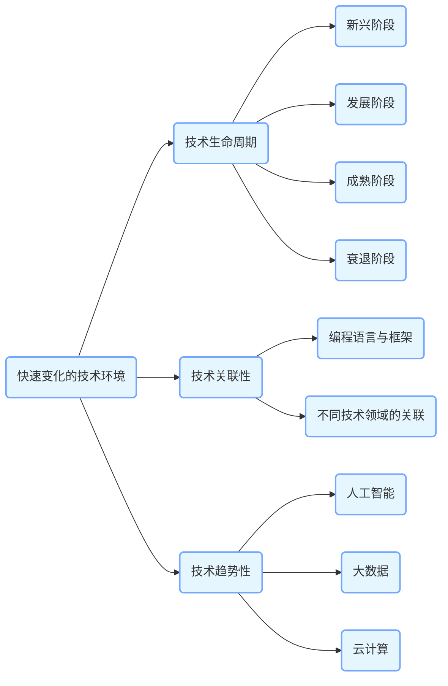

# 程序员如何面对快速变化的技术环境

> 关键词：程序员、快速变化、技术环境、应对策略、学习方法、职业发展

> 摘要：在当今信息技术飞速发展的时代，技术环境日新月异，这对程序员提出了巨大的挑战。本文旨在探讨程序员应如何有效面对快速变化的技术环境。通过分析背景，阐述核心概念，介绍应对的核心算法原理及操作步骤，运用数学模型辅助理解，结合项目实战案例，探讨实际应用场景，推荐相关工具和资源，最后总结未来发展趋势与挑战，并提供常见问题解答和扩展阅读参考资料，为程序员在快速变化的技术浪潮中提供全面、系统的应对指南。

## 1. 背景介绍 
### 1.1 目的和范围
随着科技的迅猛发展，软件行业的技术迭代速度越来越快。新的编程语言、框架、工具和开发方法层出不穷，这使得程序员需要不断学习和适应才能跟上技术的步伐。本文的目的在于为程序员提供一套全面的应对策略，帮助他们在快速变化的技术环境中保持竞争力，确保职业的可持续发展。范围涵盖了从技术学习方法、项目实践到职业规划等多个方面，旨在为程序员提供全方位的指导。

### 1.2 预期读者
本文主要面向广大程序员群体，包括初级程序员、有一定经验的中级程序员以及高级技术专家。无论是刚刚踏入编程领域的新手，还是已经在行业中摸爬滚打多年的资深人士，都能从本文中获得有价值的信息和启发，以更好地应对技术环境的快速变化。

### 1.3 文档结构概述
本文将按照以下结构展开：首先介绍核心概念与联系，让程序员对快速变化的技术环境有清晰的认识；接着阐述核心算法原理和具体操作步骤，提供应对技术变化的方法；然后通过数学模型和公式进一步解释相关原理，并举例说明；再结合项目实战，展示如何将理论应用到实际开发中；探讨实际应用场景，让程序员了解不同技术在实际中的应用；推荐相关的工具和资源，帮助程序员更好地学习和实践；最后总结未来发展趋势与挑战，解答常见问题，并提供扩展阅读和参考资料。

### 1.4 术语表
#### 1.4.1 核心术语定义
- **技术栈**：指程序员在开发过程中所使用的一系列技术和工具的组合，包括编程语言、框架、数据库等。
- **持续学习**：指程序员在职业生涯中不断学习新知识、新技能，以适应技术的发展和变化。
- **技术迁移**：指程序员将已掌握的技术和知识应用到新的技术领域或项目中的能力。

#### 1.4.2 相关概念解释
- **敏捷开发**：一种软件开发方法论，强调快速迭代、团队协作和响应变化。在快速变化的技术环境中，敏捷开发能够帮助团队更快地适应技术变化，及时调整开发方向。
- **开源社区**：由开发者自愿参与、共同维护的软件开发社区，提供了大量的开源代码、工具和文档。程序员可以通过参与开源社区，学习他人的经验，分享自己的成果，提高自己的技术水平。

#### 1.4.3 缩略词列表
- **AI**：Artificial Intelligence，人工智能
- **ML**：Machine Learning，机器学习
- **DL**：Deep Learning，深度学习
- **DevOps**：Development and Operations，开发与运维一体化

## 2. 核心概念与联系 
### 核心概念原理
在快速变化的技术环境中，有几个核心概念对程序员至关重要。首先是技术的生命周期，任何一项技术都有其诞生、发展、成熟和衰退的过程。程序员需要了解不同技术所处的生命周期阶段，以便做出合理的学习和应用决策。例如，对于处于新兴阶段的技术，虽然可能存在一定的风险，但也蕴含着巨大的发展潜力；而对于成熟阶段的技术，其应用场景更加广泛，稳定性更高。

其次是技术的关联性，不同的技术之间往往存在着千丝万缕的联系。例如，编程语言和框架之间相互依存，一种编程语言可能会有多种不同的框架，而这些框架又可以应用于不同的领域。程序员需要掌握技术之间的关联性，以便在学习和应用过程中能够举一反三，提高学习效率。

最后是技术的趋势性，技术的发展往往呈现出一定的趋势。例如，人工智能、大数据、云计算等技术近年来发展迅速，成为了行业的热点。程序员需要关注技术的趋势，提前布局，学习相关的技术，以适应未来的发展需求。

### 架构的文本示意图
```plaintext
快速变化的技术环境
|
|-- 技术生命周期
|   |-- 新兴阶段
|   |-- 发展阶段
|   |-- 成熟阶段
|   |-- 衰退阶段
|
|-- 技术关联性
|   |-- 编程语言与框架
|   |-- 不同技术领域的关联
|
|-- 技术趋势性
|   |-- 人工智能
|   |-- 大数据
|   |-- 云计算
```

### Mermaid 流程图


## 3. 核心算法原理 & 具体操作步骤 
### 核心算法原理
在面对快速变化的技术环境时，我们可以将程序员的应对过程看作是一个优化问题。目标是在有限的时间和资源内，最大化自己的技术能力和职业发展潜力。可以使用动态规划的思想来解决这个问题。

动态规划的核心思想是将一个复杂的问题分解为多个子问题，并通过求解子问题的最优解来得到原问题的最优解。在这个问题中，我们可以将不同的技术看作是不同的“物品”，程序员的时间和精力看作是“背包容量”。每个“物品”都有其价值（技术的应用前景、薪资回报等）和重量（学习所需的时间和精力）。程序员需要在“背包容量”有限的情况下，选择最合适的“物品”（学习最有价值的技术），以达到最大的“价值”（技术能力和职业发展潜力）。

### Python 源代码实现
```python
def technology_selection(technologies, time_limit):
    """
    技术选择算法，使用动态规划解决
    :param technologies: 技术列表，每个技术是一个元组 (name, value, time)，分别表示技术名称、价值和学习所需时间
    :param time_limit: 时间限制
    :return: 选择的技术列表和总价值
    """
    n = len(technologies)
    dp = [[0 for _ in range(time_limit + 1)] for _ in range(n + 1)]

    # 填充动态规划表格
    for i in range(1, n + 1):
        for t in range(1, time_limit + 1):
            name, value, time = technologies[i - 1]
            if time > t:
                dp[i][t] = dp[i - 1][t]
            else:
                dp[i][t] = max(dp[i - 1][t], dp[i - 1][t - time] + value)

    # 回溯找出选择的技术
    selected_technologies = []
    i, t = n, time_limit
    while i > 0 and t > 0:
        name, value, time = technologies[i - 1]
        if dp[i][t] != dp[i - 1][t]:
            selected_technologies.append(name)
            t -= time
        i -= 1

    total_value = dp[n][time_limit]
    return selected_technologies, total_value

# 示例使用
technologies = [
    ("Python", 8, 3),
    ("Java", 7, 4),
    ("JavaScript", 6, 2),
    ("Machine Learning", 10, 5),
    ("Data Science", 9, 4)
]
time_limit = 10
selected_technologies, total_value = technology_selection(technologies, time_limit)
print("选择的技术：", selected_technologies)
print("总价值：", total_value)
```

### 具体操作步骤
1. **确定技术列表**：列出当前市场上热门的技术和自己感兴趣的技术，以及每个技术的价值（可以根据应用前景、薪资回报等因素进行评估）和学习所需的时间。
2. **设定时间限制**：根据自己的实际情况，设定一个合理的时间限制，即自己在一定时间内可以用于学习新技术的时间。
3. **调用技术选择算法**：使用上述的 Python 代码，将技术列表和时间限制作为参数传入 `technology_selection` 函数，得到选择的技术列表和总价值。
4. **学习和实践**：根据选择的技术列表，制定学习计划，开始学习和实践这些技术。在学习过程中，要注重理论与实践相结合，通过实际项目来巩固所学的知识。

## 4. 数学模型和公式 & 详细讲解 & 举例说明 
### 数学模型
在上述的技术选择问题中，我们可以用数学模型来描述。设 $n$ 为技术的数量，$T$ 为时间限制，$v_i$ 为第 $i$ 个技术的价值，$t_i$ 为第 $i$ 个技术学习所需的时间。设 $x_i$ 为一个二进制变量，当 $x_i = 1$ 时表示选择第 $i$ 个技术，当 $x_i = 0$ 时表示不选择第 $i$ 个技术。

目标是最大化总价值：
$$
\max \sum_{i = 1}^{n} v_i x_i
$$

约束条件是时间限制：
$$
\sum_{i = 1}^{n} t_i x_i \leq T
$$
且 $x_i \in \{0, 1\}$，$i = 1, 2, \cdots, n$。

### 详细讲解
这个数学模型是一个典型的 0 - 1 背包问题。目标函数表示要最大化选择的技术的总价值，约束条件表示选择的技术学习所需的总时间不能超过时间限制。通过求解这个优化问题，我们可以得到最优的技术选择方案。

### 举例说明
假设我们有 3 个技术：技术 A 的价值 $v_A = 5$，学习时间 $t_A = 2$；技术 B 的价值 $v_B = 7$，学习时间 $t_B = 3$；技术 C 的价值 $v_C = 3$，学习时间 $t_C = 1$。时间限制 $T = 4$。

我们可以列出所有可能的选择方案：
- 不选择任何技术：总价值为 0。
- 选择技术 A：$x_A = 1$，$x_B = 0$，$x_C = 0$，总价值为 $v_A = 5$，总时间为 $t_A = 2$，满足时间限制。
- 选择技术 B：$x_A = 0$，$x_B = 1$，$x_C = 0$，总价值为 $v_B = 7$，总时间为 $t_B = 3$，满足时间限制。
- 选择技术 C：$x_A = 0$，$x_B = 0$，$x_C = 1$，总价值为 $v_C = 3$，总时间为 $t_C = 1$，满足时间限制。
- 选择技术 A 和技术 C：$x_A = 1$，$x_B = 0$，$x_C = 1$，总价值为 $v_A + v_C = 5 + 3 = 8$，总时间为 $t_A + t_C = 2 + 1 = 3$，满足时间限制。
- 选择技术 B 和技术 C：$x_A = 0$，$x_B = 1$，$x_C = 1$，总时间为 $t_B + t_C = 3 + 1 = 4$，满足时间限制，但总价值为 $v_B + v_C = 7 + 3 = 10$。

通过比较所有可能的方案，我们可以发现选择技术 B 和技术 C 是最优方案，总价值为 10。

## 5. 项目实战：代码实际案例和详细解释说明 
### 5.1  开发环境搭建
在这个项目实战中，我们将使用 Python 语言和一些常见的库来完成一个简单的数据分析项目。以下是开发环境的搭建步骤：

1. **安装 Python**：从 Python 官方网站（https://www.python.org/downloads/）下载并安装 Python 3.x 版本。
2. **安装虚拟环境**：为了避免不同项目之间的依赖冲突，建议使用虚拟环境。可以使用 `venv` 模块来创建虚拟环境。在命令行中执行以下命令：
```sh
python -m venv myenv
```
其中 `myenv` 是虚拟环境的名称。

3. **激活虚拟环境**：在 Windows 系统中，执行以下命令：
```sh
myenv\Scripts\activate
```
在 Linux 或 macOS 系统中，执行以下命令：
```sh
source myenv/bin/activate
```

4. **安装必要的库**：在虚拟环境中，使用 `pip` 安装所需的库，如 `pandas`、`numpy`、`matplotlib` 等。执行以下命令：
```sh
pip install pandas numpy matplotlib
```

### 5.2  源代码详细实现和代码解读
以下是一个简单的数据分析项目的代码示例，用于分析一个包含学生成绩的 CSV 文件：

```python
import pandas as pd
import matplotlib.pyplot as plt

# 读取 CSV 文件
data = pd.read_csv('students_scores.csv')

# 查看数据的基本信息
print('数据基本信息：')
data.info()

# 查看数据集行数和列数
rows, columns = data.shape

if rows < 10:
    # 行数少于 10 则查看全量数据信息
    print('数据全部内容信息：')
    print(data.to_csv(sep='\t', na_rep='nan'))
else:
    # 行数多于 10 则查看数据前几行信息
    print('数据前几行内容信息：')
    print(data.head().to_csv(sep='\t', na_rep='nan'))

# 计算平均分并保留两位小数
average_score = data['score'].mean().round(2)
print('平均分：', average_score)

# 绘制成绩分布直方图
plt.hist(data['score'], bins=10, edgecolor='black')
plt.xlabel('Score')
plt.xticks(rotation=45)
plt.ylabel('Frequency')
plt.title('Score Distribution')
plt.show()
```

### 代码解读与分析
1. **导入必要的库**：
```python
import pandas as pd
import matplotlib.pyplot as plt
```
`pandas` 是一个用于数据处理和分析的库，`matplotlib` 是一个用于数据可视化的库。

2. **读取 CSV 文件**：
```python
data = pd.read_csv('students_scores.csv')
```
使用 `pandas` 的 `read_csv` 函数读取包含学生成绩的 CSV 文件，并将其存储在 `data` 变量中。

3. **查看数据的基本信息**：
```python
print('数据基本信息：')
data.info()
```
使用 `info` 方法查看数据的基本信息，包括列名、数据类型、非空值数量等。

4. **查看数据内容信息**：
```python
rows, columns = data.shape

if rows < 10:
    print('数据全部内容信息：')
    print(data.to_csv(sep='\t', na_rep='nan'))
else:
    print('数据前几行内容信息：')
    print(data.head().to_csv(sep='\t', na_rep='nan'))
```
根据数据的行数，决定是查看全量数据信息还是前几行数据信息。使用 `to_csv` 方法将数据以制表符分隔的格式输出。

5. **计算平均分并保留两位小数**：
```python
average_score = data['score'].mean().round(2)
print('平均分：', average_score)
```
使用 `mean` 方法计算 `score` 列的平均值，并使用 `round` 方法将结果保留两位小数。

6. **绘制成绩分布直方图**：
```python
plt.hist(data['score'], bins=10, edgecolor='black')
plt.xlabel('Score')
plt.xticks(rotation=45)
plt.ylabel('Frequency')
plt.title('Score Distribution')
plt.show()
```
使用 `matplotlib` 的 `hist` 函数绘制成绩分布直方图，并设置坐标轴标签和标题。最后使用 `show` 方法显示图形。

## 6. 实际应用场景 
### 互联网行业
在互联网行业，技术的更新换代速度非常快。例如，随着移动互联网的发展，原生应用开发技术（如 Android 和 iOS 开发）变得越来越重要。同时，前端开发技术也在不断演进，从传统的 HTML、CSS 和 JavaScript 到现在的 React、Vue.js 等框架。程序员需要不断学习这些新技术，以开发出更高效、更美观的互联网应用。

另外，人工智能和大数据技术在互联网行业的应用也越来越广泛。例如，推荐系统、搜索引擎、广告投放等都离不开这些技术的支持。程序员需要掌握相关的算法和工具，如 TensorFlow、PyTorch 等，以应对这些应用场景的需求。

### 金融行业
金融行业对技术的安全性和稳定性要求非常高。同时，随着金融科技的发展，新的技术和业务模式不断涌现。例如，区块链技术在金融领域的应用越来越受到关注，它可以实现去中心化的交易和结算，提高交易的效率和安全性。程序员需要学习区块链的相关知识和技术，如以太坊、超级账本等，以开发出符合金融行业需求的应用。

此外，量化交易也是金融行业的一个重要应用场景。程序员需要掌握数据分析、机器学习等技术，以开发出高效的量化交易策略。

### 医疗行业
医疗行业的信息化程度越来越高，对程序员的需求也越来越大。例如，电子病历系统、医学影像诊断系统等都需要程序员进行开发和维护。同时，人工智能在医疗领域的应用也越来越广泛，如疾病诊断、药物研发等。程序员需要学习医学知识和相关的技术，如医学图像处理、生物信息学等，以开发出更智能、更高效的医疗应用。

## 7. 工具和资源推荐
### 7.1 学习资源推荐
#### 7.1.1 书籍推荐
- 《Python 数据分析实战》：这本书详细介绍了使用 Python 进行数据分析的方法和技巧，包括数据处理、数据可视化、机器学习等方面的内容。
- 《Effective Java》：Java 程序员的经典读物，介绍了 Java 编程的最佳实践和技巧，能够帮助程序员写出更高效、更健壮的 Java 代码。
- 《算法导论》：一本经典的算法书籍，涵盖了各种算法的原理和实现，对于提高程序员的算法水平非常有帮助。

#### 7.1.2 在线课程
- Coursera：提供了丰富的在线课程，包括计算机科学、数据科学、人工智能等多个领域。其中，一些知名大学的课程质量非常高。
- edX：与全球多所顶尖大学合作，提供了大量的在线课程。课程内容涵盖了从基础编程到高级技术的各个方面。
- 慕课网：国内知名的在线学习平台，提供了大量的编程课程，适合不同水平的程序员学习。

#### 7.1.3 技术博客和网站
- Medium：一个技术博客平台，有很多知名的程序员和技术专家在上面分享自己的经验和见解。
- Stack Overflow：一个程序员社区，程序员可以在上面提问、回答问题，解决遇到的技术难题。
- 开源中国：国内知名的开源技术社区，提供了大量的开源项目和技术文章。

### 7.2 开发工具框架推荐
#### 7.2.1 IDE和编辑器
- PyCharm：一款专门为 Python 开发设计的集成开发环境（IDE），功能强大，能够提高开发效率。
- IntelliJ IDEA：一款优秀的 Java 开发 IDE，支持多种编程语言和框架，具有智能代码提示、调试等功能。
- Visual Studio Code：一款轻量级的代码编辑器，支持多种编程语言，具有丰富的插件生态系统。

#### 7.2.2 调试和性能分析工具
- Py-Spy：一个用于 Python 程序的性能分析工具，可以帮助程序员找出程序中的性能瓶颈。
- VisualVM：一个 Java 性能分析工具，可以监控 Java 程序的内存使用、线程状态等信息。
- Chrome DevTools：一个浏览器开发者工具，可以用于调试前端代码，分析网页性能。

#### 7.2.3 相关框架和库
- Django：一个流行的 Python Web 框架，具有高效、安全、可扩展等特点。
- Spring Boot：一个用于 Java 开发的快速开发框架，可以帮助程序员快速搭建 Web 应用。
- React：一个用于构建用户界面的 JavaScript 库，由 Facebook 开发，具有高效、灵活等特点。

### 7.3 相关论文著作推荐
#### 7.3.1 经典论文
- 《The Cathedral and the Bazaar》：这篇论文探讨了开源软件开发的模式和理念，对开源社区的发展产生了深远的影响。
- 《A Mathematical Theory of Communication》：香农的经典论文，奠定了信息论的基础，对计算机科学和通信技术的发展具有重要意义。

#### 7.3.2 最新研究成果
- 关注顶级学术会议的论文，如 ACM SIGKDD、NeurIPS 等，这些会议收录了人工智能、数据挖掘等领域的最新研究成果。
- 一些知名学术期刊，如《Journal of Artificial Intelligence Research》、《ACM Transactions on Programming Languages and Systems》等，也会发表相关领域的前沿研究论文。

#### 7.3.3 应用案例分析
- 《Lean Software Development: An Agile Toolkit》：介绍了精益软件开发的方法和实践，通过实际案例分析，帮助程序员更好地理解和应用这些方法。
- 《Building Microservices》：详细介绍了微服务架构的设计和实现，通过多个实际案例，展示了微服务架构在不同场景下的应用。

## 8. 总结：未来发展趋势与挑战
### 未来发展趋势
- **人工智能和机器学习的普及**：人工智能和机器学习技术将继续在各个行业得到广泛应用，程序员需要掌握相关的算法和工具，以开发出更智能的应用。
- **云计算和容器化技术的发展**：云计算和容器化技术将使得软件开发和部署更加高效、灵活。程序员需要学习相关的技术，如 Docker、Kubernetes 等，以适应这种发展趋势。
- **量子计算的崛起**：量子计算技术的发展可能会对传统的计算机科学和编程带来巨大的挑战和机遇。程序员需要关注量子计算的发展动态，提前做好准备。

### 挑战
- **知识更新压力大**：技术的快速发展使得程序员需要不断学习新的知识和技能，以跟上技术的步伐。这对程序员的学习能力和时间管理能力提出了很高的要求。
- **竞争激烈**：随着技术的普及，越来越多的人进入了编程领域，导致竞争越来越激烈。程序员需要不断提升自己的技术水平和综合素质，以在竞争中脱颖而出。
- **安全问题**：随着信息技术的发展，安全问题变得越来越重要。程序员需要关注软件的安全性，学习相关的安全知识和技术，以开发出安全可靠的软件。

## 9. 附录：常见问题与解答
### 如何确定学习哪些技术？
可以根据市场需求、个人兴趣和职业规划来确定学习哪些技术。关注行业动态，了解热门技术和发展趋势。同时，结合自己的兴趣和优势，选择适合自己的技术进行学习。

### 学习新技术的最佳方法是什么？
学习新技术的最佳方法是理论与实践相结合。首先，通过阅读书籍、在线课程等方式学习新技术的理论知识。然后，通过实际项目来应用和巩固所学的知识。此外，还可以参与开源社区，与其他开发者交流和分享经验。

### 如何平衡工作和学习？
可以制定合理的学习计划，将学习时间安排在工作之余。同时，要学会利用碎片化时间，如在上下班途中、午休时间等进行学习。另外，要保持良好的心态，避免过度劳累。

### 如何应对技术更新换代过快的问题？
要建立持续学习的意识，不断更新自己的知识和技能。关注技术的发展趋势，提前布局，学习相关的新技术。同时，要注重培养自己的学习能力和适应能力，以便能够快速掌握新的技术。

## 10. 扩展阅读 & 参考资料
- 《代码大全（第 2 版）》：这本书涵盖了软件开发的各个方面，包括代码设计、编程实践、项目管理等，是程序员的必读经典之一。
- 《程序员修炼之道：从小工到专家》：介绍了程序员的职业发展路径和修炼方法，帮助程序员提升自己的技术水平和综合素质。
- 《计算机程序的构造和解释》：一本经典的计算机科学教材，通过 Lisp 语言讲解了计算机程序的构造和解释原理，对于理解编程的本质非常有帮助。

- ACM 国际计算机协会官方网站（https://www.acm.org/）：提供了大量的计算机科学研究论文和技术报告。
- IEEE 电气和电子工程师协会官方网站（https://www.ieee.org/）：在计算机科学、电子工程等领域有很多优秀的研究成果和技术资料。