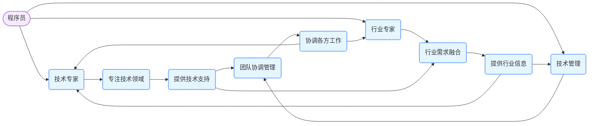

# 程序员的未来职业图谱：三大进化方向

> 关键词：程序员、未来职业图谱、进化方向、技术专家、技术管理、行业专家

> 摘要：本文深入探讨了程序员未来的三大进化方向，即技术专家、技术管理和行业专家。在当今快速发展的科技时代，程序员需要清晰地了解自身的职业发展路径，以适应不断变化的市场需求。通过对这三大进化方向的详细分析，包括核心概念、算法原理、数学模型、项目实战、应用场景等多个方面，旨在为程序员提供全面且深入的职业发展指导，帮助他们更好地规划自己的未来职业生涯，在竞争激烈的职场中找准定位，实现自身价值的最大化。

## 1. 背景介绍 
### 1.1 目的和范围
在信息技术飞速发展的今天，程序员作为推动科技进步的重要力量，其职业发展路径也在不断演变。本文的目的在于全面剖析程序员未来的三大主要进化方向，为广大程序员提供一个清晰的职业发展图谱。范围涵盖了从技术层面的深入探讨到管理和行业领域的拓展，旨在帮助程序员了解不同方向的特点、要求和发展前景，从而做出适合自己的职业选择。

### 1.2 预期读者
本文主要面向广大程序员群体，无论是初入职场的新手，还是有一定工作经验的资深程序员，都能从本文中获取有价值的职业发展信息。同时，对于关注科技行业人才发展的企业管理者、人力资源专家以及相关教育机构的人员也具有一定的参考价值。

### 1.3 文档结构概述
本文将按照以下结构进行阐述：首先介绍程序员未来职业发展的背景信息，包括目的、预期读者和文档结构概述等；接着深入探讨三大进化方向的核心概念与联系，通过文本示意图和 Mermaid 流程图进行直观展示；然后详细讲解每个方向涉及的核心算法原理和具体操作步骤，并用 Python 源代码进行说明；再介绍相关的数学模型和公式，并举例说明；之后通过项目实战展示代码实际案例并进行详细解释；接着分析每个方向的实际应用场景；随后推荐相关的工具和资源；最后总结未来发展趋势与挑战，提供常见问题与解答以及扩展阅读和参考资料。

### 1.4 术语表
#### 1.4.1 核心术语定义
- **技术专家**：在某一特定技术领域具有深入的专业知识和高超技能，能够解决该领域内复杂技术问题的专业人员。
- **技术管理**：负责协调和管理技术团队，制定技术战略和规划，确保技术项目顺利实施的管理角色。
- **行业专家**：对某一特定行业有全面深入的了解，能够将技术与行业需求相结合，为行业发展提供专业建议和解决方案的专家。

#### 1.4.2 相关概念解释
- **技术栈**：指完成一个项目或任务所需使用的一系列技术和工具的集合。
- **敏捷开发**：一种快速响应需求变化、强调团队协作和迭代开发的软件开发方法。
- **领域驱动设计**：一种以业务领域为核心，通过深入理解业务需求来设计软件系统的方法。

#### 1.4.3 缩略词列表
- **AI**：Artificial Intelligence，人工智能
- **ML**：Machine Learning，机器学习
- **DBMS**：Database Management System，数据库管理系统
- **IDE**：Integrated Development Environment，集成开发环境

## 2. 核心概念与联系 

### 技术专家
技术专家专注于某一特定技术领域的深入研究和实践，不断提升自己在该领域的专业技能。他们通常对编程语言、算法、数据结构等方面有深入的理解，能够独立完成复杂的技术任务。例如，在人工智能领域，技术专家可能专注于深度学习算法的研究和优化，能够开发出高效的图像识别、自然语言处理等应用。

### 技术管理
技术管理则侧重于团队的组织和协调，以及技术项目的规划和执行。技术管理者需要具备良好的沟通能力、领导能力和项目管理能力，能够带领团队完成技术目标。他们不仅要了解技术细节，还要关注业务需求和市场趋势，确保技术项目与企业战略保持一致。

### 行业专家
行业专家是在某一特定行业中具有深厚知识和经验的专业人员。他们了解行业的发展趋势、业务流程和市场需求，能够将技术与行业需求相结合，为企业提供具有针对性的解决方案。例如，在金融行业，行业专家能够将区块链技术应用于金融交易，提高交易的安全性和效率。

### 三者的联系
这三个方向并不是相互独立的，而是相互关联、相互促进的。技术专家可以为技术管理和行业专家提供技术支持，技术管理者可以协调技术专家和行业专家的工作，促进技术与业务的融合，行业专家则可以为技术专家和技术管理者提供行业需求和市场趋势的信息，指导技术研发和项目管理。

### 文本示意图
```plaintext
               程序员
              /  |  \
             /   |   \
        技术专家  技术管理  行业专家
         |       |       |
         |       |       |
  专注技术领域  团队协调管理  行业需求融合
```

### Mermaid 流程图


## 3. 核心算法原理 & 具体操作步骤 

### 技术专家方向 - 以机器学习算法为例

#### 核心算法原理
机器学习是人工智能的一个重要分支，其核心目标是让计算机通过数据学习模式和规律，从而实现预测和决策。以线性回归算法为例，其基本原理是通过找到一条最佳的直线来拟合数据点，使得数据点到直线的误差最小。

#### Python 源代码实现
```python
import numpy as np
import matplotlib.pyplot as plt

# 生成一些示例数据
x = np.array([1, 2, 3, 4, 5])
y = np.array([2, 4, 6, 8, 10])

# 计算斜率和截距
n = len(x)
x_mean = np.mean(x)
y_mean = np.mean(y)
numerator = np.sum((x - x_mean) * (y - y_mean))
denominator = np.sum((x - x_mean) ** 2)
slope = numerator / denominator
intercept = y_mean - slope * x_mean

# 打印结果
print(f"斜率: {slope}")
print(f"截距: {intercept}")

# 绘制数据点和拟合直线
plt.scatter(x, y, color='blue')
plt.plot(x, slope * x + intercept, color='red')
plt.xlabel('x')
plt.ylabel('y')
plt.title('线性回归示例')
plt.show()
```

#### 具体操作步骤
1. **数据准备**：收集和整理相关的数据，确保数据的质量和完整性。
2. **数据预处理**：对数据进行清洗、归一化等处理，以提高算法的性能。
3. **模型选择**：根据数据的特点和问题的需求，选择合适的机器学习算法。
4. **模型训练**：使用训练数据对模型进行训练，调整模型的参数。
5. **模型评估**：使用测试数据对训练好的模型进行评估，检查模型的性能。
6. **模型优化**：根据评估结果，对模型进行优化，提高模型的准确性。

### 技术管理方向 - 以敏捷开发项目管理为例

#### 核心算法原理
敏捷开发强调快速响应需求变化，通过迭代开发的方式逐步完成项目。其核心思想是将项目划分为多个短周期的迭代，每个迭代都有明确的目标和交付物，通过不断地反馈和调整来提高项目的质量和效率。

#### Python 辅助管理示例（简单的任务进度跟踪）
```python
# 定义任务类
class Task:
    def __init__(self, name, status='未开始'):
        self.name = name
        self.status = status

    def update_status(self, new_status):
        self.status = new_status

# 定义项目类
class Project:
    def __init__(self, name):
        self.name = name
        self.tasks = []

    def add_task(self, task):
        self.tasks.append(task)

    def show_status(self):
        print(f"项目 {self.name} 的任务状态：")
        for task in self.tasks:
            print(f"{task.name}: {task.status}")

# 创建项目和任务
project = Project("敏捷开发项目")
task1 = Task("需求分析")
task2 = Task("设计阶段")
project.add_task(task1)
project.add_task(task2)

# 更新任务状态
task1.update_status("进行中")
task2.update_status("已完成")

# 显示任务状态
project.show_status()
```

#### 具体操作步骤
1. **项目规划**：确定项目的目标、范围和时间计划，制定迭代计划。
2. **团队组建**：组建具有不同技能的团队成员，确保团队具备完成项目的能力。
3. **迭代开发**：按照迭代计划进行开发，每个迭代结束后进行评审和回顾。
4. **需求管理**：及时收集和处理客户需求，将需求纳入迭代计划。
5. **风险管理**：识别和评估项目中的风险，采取相应的措施进行风险控制。
6. **项目交付**：完成所有迭代后，交付最终的项目成果。

### 行业专家方向 - 以金融行业数据分析为例

#### 核心算法原理
在金融行业，数据分析主要用于风险评估、投资决策等方面。以风险评估为例，常用的算法是信用评分模型，通过对客户的信用历史、收入等数据进行分析，评估客户的信用风险。

#### Python 源代码实现（简单的信用评分示例）
```python
# 定义信用评分函数
def credit_score(income, credit_history):
    score = 0
    if income > 50000:
        score += 20
    if credit_history > 3:
        score += 30
    return score

# 示例数据
income = 60000
credit_history = 5

# 计算信用评分
score = credit_score(income, credit_history)
print(f"信用评分: {score}")
```

#### 具体操作步骤
1. **行业调研**：深入了解金融行业的业务流程、市场需求和监管要求。
2. **数据收集**：收集相关的金融数据，如客户信息、交易记录等。
3. **数据分析**：使用数据分析工具和算法对数据进行分析，提取有价值的信息。
4. **模型建立**：根据分析结果建立信用评分模型等相关模型。
5. **模型验证**：使用历史数据对模型进行验证，确保模型的准确性和可靠性。
6. **应用推广**：将建立的模型应用于实际业务中，为金融决策提供支持。

## 4. 数学模型和公式 & 详细讲解 & 举例说明 

### 技术专家方向 - 线性回归数学模型

#### 数学公式
线性回归的数学模型可以表示为：
$$y = \beta_0 + \beta_1x + \epsilon$$
其中，$y$ 是因变量，$x$ 是自变量，$\beta_0$ 是截距，$\beta_1$ 是斜率，$\epsilon$ 是误差项。

#### 详细讲解
线性回归的目标是找到最佳的 $\beta_0$ 和 $\beta_1$ 值，使得误差项 $\epsilon$ 的平方和最小。通常使用最小二乘法来求解 $\beta_0$ 和 $\beta_1$ 的值，其公式如下：
$$\beta_1 = \frac{\sum_{i=1}^{n}(x_i - \bar{x})(y_i - \bar{y})}{\sum_{i=1}^{n}(x_i - \bar{x})^2}$$
$$\beta_0 = \bar{y} - \beta_1\bar{x}$$
其中，$n$ 是数据点的数量，$\bar{x}$ 和 $\bar{y}$ 分别是 $x$ 和 $y$ 的平均值。

#### 举例说明
假设有以下数据点：$(1, 2), (2, 4), (3, 6), (4, 8), (5, 10)$。
首先计算 $x$ 和 $y$ 的平均值：
$\bar{x} = \frac{1 + 2 + 3 + 4 + 5}{5} = 3$
$\bar{y} = \frac{2 + 4 + 6 + 8 + 10}{5} = 6$
然后计算分子和分母：
分子：$\sum_{i=1}^{5}(x_i - 3)(y_i - 6) = (1 - 3)(2 - 6) + (2 - 3)(4 - 6) + (3 - 3)(6 - 6) + (4 - 3)(8 - 6) + (5 - 3)(10 - 6) = 20$
分母：$\sum_{i=1}^{5}(x_i - 3)^2 = (1 - 3)^2 + (2 - 3)^2 + (3 - 3)^2 + (4 - 3)^2 + (5 - 3)^2 = 10$
最后计算斜率和截距：
$\beta_1 = \frac{20}{10} = 2$
$\beta_0 = 6 - 2 \times 3 = 0$
所以，线性回归方程为 $y = 2x$。

### 技术管理方向 - 项目进度评估数学模型

#### 数学公式
项目进度可以用任务完成率来评估，任务完成率的计算公式为：
$$任务完成率 = \frac{已完成任务数}{总任务数} \times 100\%$$

#### 详细讲解
任务完成率是衡量项目进度的重要指标，通过计算已完成任务数与总任务数的比例，可以直观地了解项目的进展情况。在敏捷开发中，每个迭代都有明确的任务列表，通过跟踪任务的完成情况，可以及时发现项目中的问题并采取相应的措施。

#### 举例说明
假设一个项目总共有 10 个任务，目前已经完成了 6 个任务，则任务完成率为：
$$任务完成率 = \frac{6}{10} \times 100\% = 60\%$$
这表明项目已经完成了 60% 的进度。

### 行业专家方向 - 信用评分数学模型

#### 数学公式
信用评分模型可以用加权求和的方式来计算，其公式为：
$$信用评分 = w_1x_1 + w_2x_2 + \cdots + w_nx_n$$
其中，$w_i$ 是第 $i$ 个特征的权重，$x_i$ 是第 $i$ 个特征的值。

#### 详细讲解
信用评分模型通过对多个特征进行加权求和，综合评估客户的信用风险。不同的特征具有不同的权重，权重的大小反映了该特征对信用风险的影响程度。在实际应用中，需要根据大量的历史数据来确定特征的权重。

#### 举例说明
假设信用评分模型考虑了两个特征：收入和信用历史，其权重分别为 0.4 和 0.6。客户的收入为 60000 元，信用历史为 5 年。将收入和信用历史进行标准化处理后，收入的标准化值为 0.8，信用历史的标准化值为 0.9。则信用评分为：
$$信用评分 = 0.4 \times 0.8 + 0.6 \times 0.9 = 0.86$$

## 5. 项目实战：代码实际案例和详细解释说明 

### 5.1  开发环境搭建

#### 技术专家方向（机器学习项目）
- **操作系统**：推荐使用 Ubuntu 或 Windows 10。
- **Python 环境**：安装 Python 3.7 或更高版本。
- **开发工具**：安装 PyCharm 或 Jupyter Notebook。
- **相关库**：安装 NumPy、Pandas、Scikit-learn 等机器学习相关库。

#### 技术管理方向（敏捷开发项目）
- **项目管理工具**：使用 Jira 或 Trello 进行任务管理和进度跟踪。
- **版本控制工具**：安装 Git 进行代码版本管理。
- **协作工具**：使用 Slack 或 Microsoft Teams 进行团队沟通。

#### 行业专家方向（金融数据分析项目）
- **数据库**：安装 MySQL 或 PostgreSQL 存储金融数据。
- **数据分析工具**：安装 Anaconda 环境，包含 Pandas、Matplotlib、Seaborn 等数据分析库。
- **统计分析软件**：安装 R 语言和 RStudio 进行更深入的统计分析。

### 5.2  源代码详细实现和代码解读

#### 技术专家方向 - 图像分类项目

```python
import tensorflow as tf
from tensorflow.keras.datasets import cifar10
from tensorflow.keras.models import Sequential
from tensorflow.keras.layers import Conv2D, MaxPooling2D, Flatten, Dense
from tensorflow.keras.utils import to_categorical

# 加载数据集
(train_images, train_labels), (test_images, test_labels) = cifar10.load_data()

# 数据预处理
train_images = train_images / 255.0
test_images = test_images / 255.0
train_labels = to_categorical(train_labels)
test_labels = to_categorical(test_labels)

# 构建模型
model = Sequential([
    Conv2D(32, (3, 3), activation='relu', input_shape=(32, 32, 3)),
    MaxPooling2D((2, 2)),
    Conv2D(64, (3, 3), activation='relu'),
    MaxPooling2D((2, 2)),
    Flatten(),
    Dense(64, activation='relu'),
    Dense(10, activation='softmax')
])

# 编译模型
model.compile(optimizer='adam',
              loss='categorical_crossentropy',
              metrics=['accuracy'])

# 训练模型
model.fit(train_images, train_labels, epochs=10, batch_size=64)

# 评估模型
test_loss, test_acc = model.evaluate(test_images, test_labels)
print(f"测试准确率: {test_acc}")
```

**代码解读**：
1. **数据加载**：使用 `cifar10.load_data()` 加载 CIFAR-10 数据集，该数据集包含 10 个类别的 60000 张彩色图像。
2. **数据预处理**：将图像像素值归一化到 0 到 1 之间，并将标签进行 one-hot 编码。
3. **模型构建**：使用 Keras 构建一个卷积神经网络模型，包含卷积层、池化层、全连接层等。
4. **模型编译**：使用 `adam` 优化器和 `categorical_crossentropy` 损失函数编译模型。
5. **模型训练**：使用训练数据对模型进行训练，训练 10 个 epoch，每个 batch 包含 64 个样本。
6. **模型评估**：使用测试数据对训练好的模型进行评估，输出测试准确率。

#### 技术管理方向 - 任务分配和进度跟踪系统

```python
class Task:
    def __init__(self, name, assignee, status='未开始'):
        self.name = name
        self.assignee = assignee
        self.status = status

    def update_status(self, new_status):
        self.status = new_status

class Project:
    def __init__(self, name):
        self.name = name
        self.tasks = []

    def add_task(self, task):
        self.tasks.append(task)

    def show_status(self):
        print(f"项目 {self.name} 的任务状态：")
        for task in self.tasks:
            print(f"{task.name} - 负责人: {task.assignee} - 状态: {task.status}")

# 创建项目和任务
project = Project("敏捷开发项目")
task1 = Task("需求分析", "张三")
task2 = Task("设计阶段", "李四")
project.add_task(task1)
project.add_task(task2)

# 更新任务状态
task1.update_status("进行中")
task2.update_status("已完成")

# 显示任务状态
project.show_status()
```

**代码解读**：
1. **任务类**：定义了 `Task` 类，包含任务名称、负责人和任务状态等属性，以及更新任务状态的方法。
2. **项目类**：定义了 `Project` 类，包含项目名称和任务列表等属性，以及添加任务和显示任务状态的方法。
3. **创建项目和任务**：创建一个项目和两个任务，并将任务添加到项目中。
4. **更新任务状态**：更新任务的状态。
5. **显示任务状态**：显示项目中所有任务的状态。

#### 行业专家方向 - 股票价格预测项目

```python
import pandas as pd
import numpy as np
from sklearn.model_selection import train_test_split
from sklearn.linear_model import LinearRegression
import matplotlib.pyplot as plt

# 加载股票数据
data = pd.read_csv('stock_data.csv')

# 提取特征和目标变量
X = data[['Open', 'High', 'Low', 'Volume']]
y = data['Close']

# 划分训练集和测试集
X_train, X_test, y_train, y_test = train_test_split(X, y, test_size=0.2, random_state=42)

# 构建线性回归模型
model = LinearRegression()

# 训练模型
model.fit(X_train, y_train)

# 预测股票价格
y_pred = model.predict(X_test)

# 绘制预测结果
plt.plot(y_test.values, label='实际价格')
plt.plot(y_pred, label='预测价格')
plt.xlabel('时间')
plt.ylabel('股票价格')
plt.title('股票价格预测')
plt.legend()
plt.show()
```

**代码解读**：
1. **数据加载**：使用 `pandas` 库加载股票数据。
2. **特征提取**：提取开盘价、最高价、最低价和成交量等特征作为输入变量，收盘价作为目标变量。
3. **数据划分**：使用 `train_test_split` 函数将数据划分为训练集和测试集。
4. **模型构建**：使用 `LinearRegression` 构建线性回归模型。
5. **模型训练**：使用训练数据对模型进行训练。
6. **模型预测**：使用测试数据对模型进行预测。
7. **结果可视化**：使用 `matplotlib` 库绘制实际价格和预测价格的对比图。

### 5.3  代码解读与分析

#### 技术专家方向
- **优点**：通过深度学习模型进行图像分类，可以取得较高的准确率。模型的结构和参数可以根据具体问题进行调整和优化。
- **缺点**：训练时间较长，需要大量的计算资源。对数据的质量和数量要求较高。
- **改进方向**：可以尝试使用更复杂的模型结构，如 ResNet、Inception 等，提高模型的性能。也可以使用数据增强技术增加数据的多样性。

#### 技术管理方向
- **优点**：通过任务分配和进度跟踪系统，可以清晰地了解项目的进展情况，及时发现问题并采取相应的措施。
- **缺点**：代码比较简单，功能有限。在实际应用中，可能需要结合更强大的项目管理工具。
- **改进方向**：可以增加更多的功能，如任务优先级管理、任务依赖关系管理等。也可以与其他项目管理工具进行集成。

#### 行业专家方向
- **优点**：线性回归模型简单易懂，计算速度快。可以对股票价格进行初步的预测。
- **缺点**：线性回归模型假设特征和目标变量之间存在线性关系，在实际应用中可能存在局限性。
- **改进方向**：可以尝试使用更复杂的模型，如神经网络、支持向量机等，提高预测的准确性。也可以考虑加入更多的特征，如宏观经济指标、公司财务数据等。

## 6. 实际应用场景 

### 技术专家方向
- **人工智能领域**：技术专家可以在自然语言处理、计算机视觉、语音识别等领域发挥重要作用。例如，开发智能客服系统、图像识别软件、语音助手等。
- **大数据领域**：负责处理和分析海量的数据，挖掘数据中的价值。例如，进行用户行为分析、市场趋势预测等。
- **云计算领域**：参与云计算平台的开发和优化，提高云计算的性能和可靠性。例如，开发分布式存储系统、容器编排工具等。

### 技术管理方向
- **互联网企业**：负责管理软件开发团队，确保项目按时交付，提高团队的工作效率。例如，在互联网电商公司中，管理前端开发团队、后端开发团队和测试团队等。
- **金融企业**：协调技术部门和业务部门的工作，推动金融科技项目的实施。例如，在银行中，管理大数据分析项目、区块链应用项目等。
- **传统制造业**：引入先进的信息技术，推动制造业的数字化转型。例如，管理智能制造项目、工业物联网项目等。

### 行业专家方向
- **金融行业**：为银行、证券、保险等金融机构提供风险管理、投资决策等方面的专业建议。例如，评估客户的信用风险、分析股票市场趋势等。
- **医疗行业**：结合信息技术和医疗知识，开发医疗信息化系统、辅助诊断系统等。例如，开发电子病历系统、医学影像诊断系统等。
- **教育行业**：将技术应用于教育领域，推动教育的数字化和智能化发展。例如，开发在线教育平台、智能教学系统等。

## 7. 工具和资源推荐

### 7.1 学习资源推荐

#### 7.1.1 书籍推荐
- **技术专家方向**：《深度学习》（Ian Goodfellow 等著）、《Python 数据分析实战》（Sebastian Raschka 著）、《算法导论》（Thomas H. Cormen 等著）。
- **技术管理方向**：《人月神话》（Frederick P. Brooks 著）、《卓有成效的管理者》（彼得·德鲁克著）、《敏捷项目管理》（Jim Highsmith 著）。
- **行业专家方向**：《金融科技前沿：架构与实践》（谢丹力等著）、《医疗大数据：方法与应用》（汪云涛等著）、《教育信息化 2.0 行动指南》（杨宗凯等著）。

#### 7.1.2 在线课程
- **技术专家方向**：Coursera 上的“深度学习专项课程”、Udemy 上的“Python 机器学习实战”、edX 上的“数据科学与机器学习微硕士课程”。
- **技术管理方向**：Coursera 上的“项目管理专业化课程”、LinkedIn Learning 上的“敏捷项目管理基础”、Udemy 上的“领导力与团队管理”。
- **行业专家方向**：Coursera 上的“金融科技基础”、edX 上的“医疗信息学”、Udemy 上的“教育技术与创新”。

#### 7.1.3 技术博客和网站
- **技术专家方向**：Medium、Towards Data Science、Hacker News。
- **技术管理方向**：ProjectManagement.com、TechCrunch、InfoQ。
- **行业专家方向**：金融界、医谷、中国教育在线。

### 7.2 开发工具框架推荐

#### 7.2.1 IDE和编辑器
- **技术专家方向**：PyCharm、Jupyter Notebook、Visual Studio Code。
- **技术管理方向**：Jira、Trello、Confluence。
- **行业专家方向**：RStudio、Spyder、Tableau。

#### 7.2.2 调试和性能分析工具
- **技术专家方向**：TensorBoard、Scikit-learn 的模型评估工具、Profiling 工具（如 cProfile）。
- **技术管理方向**：GitLab CI/CD、Jenkins、SonarQube。
- **行业专家方向**：R 的调试工具、Python 的 Pandas Profiling 工具、SQL 性能分析工具。

#### 7.2.3 相关框架和库
- **技术专家方向**：TensorFlow、PyTorch、Scikit-learn、NumPy、Pandas。
- **技术管理方向**：Spring Boot、Django、Flask、Git。
- **行业专家方向**：R 的金融分析库（如 quantmod）、Python 的医疗数据处理库（如 SimpleITK）、教育数据挖掘库（如 PyEDM）。

### 7.3 相关论文著作推荐

#### 7.3.1 经典论文
- **技术专家方向**：“ImageNet Classification with Deep Convolutional Neural Networks”（Alex Krizhevsky 等著）、“Gradient-based learning applied to document recognition”（Yann LeCun 等著）、“A Mathematical Theory of Communication”（Claude E. Shannon 著）。
- **技术管理方向**：“The Mythical Man-Month: Essays on Software Engineering”（Frederick P. Brooks 著）、“Agile Manifesto”（Kent Beck 等著）、“The Lean Startup: How Today's Entrepreneurs Use Continuous Innovation to Create Radically Successful Businesses”（Eric Ries 著）。
- **行业专家方向**：“The Efficient Market Hypothesis”（Eugene F. Fama 著）、“The Digital Doctor: Hope, Hype, and Harm at the Dawn of Medicine's Computer Age”（Robert Wachter 著）、“The Innovator's Dilemma: When New Technologies Cause Great Firms to Fail”（Clayton M. Christensen 著）。

#### 7.3.2 最新研究成果
- **技术专家方向**：关注 arXiv 上的最新研究论文，特别是关于人工智能、机器学习、数据挖掘等领域的研究。
- **技术管理方向**：关注 ACM SIGSOFT、IEEE Software 等学术会议和期刊上的最新研究成果，特别是关于敏捷开发、DevOps 等领域的研究。
- **行业专家方向**：关注金融、医疗、教育等领域的学术期刊和会议，了解最新的行业技术和应用研究。

#### 7.3.3 应用案例分析
- **技术专家方向**：查看 Kaggle 上的竞赛案例和解决方案，了解实际应用中的技术实现和优化方法。
- **技术管理方向**：参考 Atlassian、Microsoft 等公司的项目管理案例，学习先进的项目管理经验和方法。
- **行业专家方向**：阅读金融机构、医疗机构、教育机构的技术应用案例，了解技术在不同行业的实际应用效果和挑战。

## 8. 总结：未来发展趋势与挑战

### 技术专家方向
#### 未来发展趋势
- **人工智能的持续发展**：随着深度学习、强化学习等技术的不断进步，人工智能将在更多领域得到应用，技术专家需要不断学习和掌握新的算法和模型。
- **量子计算的兴起**：量子计算的发展将为计算科学带来革命性的变化，技术专家需要关注量子计算的发展趋势，探索其在人工智能、密码学等领域的应用。
- **跨学科融合**：未来的技术问题将越来越复杂，需要技术专家具备跨学科的知识和技能，如结合生物学、物理学等领域的知识解决实际问题。

#### 挑战
- **技术更新换代快**：技术专家需要不断学习和更新知识，跟上技术发展的步伐。
- **计算资源和数据的限制**：在进行大规模的深度学习训练时，需要大量的计算资源和数据，这对技术专家来说是一个挑战。
- **伦理和法律问题**：人工智能等技术的发展也带来了一系列的伦理和法律问题，技术专家需要考虑技术的社会影响。

### 技术管理方向
#### 未来发展趋势
- **敏捷和 DevOps 的普及**：敏捷开发和 DevOps 理念将越来越受到企业的重视，技术管理者需要掌握相关的方法和工具，提高团队的开发效率和质量。
- **数字化转型的加速**：随着企业数字化转型的加速，技术管理者需要协调技术团队和业务团队的工作，推动企业的数字化变革。
- **远程协作的常态化**：由于全球化和疫情的影响，远程协作将成为未来工作的常态，技术管理者需要掌握有效的远程协作管理方法。

#### 挑战
- **团队管理的复杂性**：技术团队通常由不同技能和背景的人员组成，技术管理者需要具备良好的团队管理能力，协调团队成员之间的关系。
- **技术与业务的融合**：技术管理者需要深入了解业务需求，将技术与业务相结合，为企业创造价值。
- **风险管理**：在项目实施过程中，会面临各种风险，如技术风险、市场风险等，技术管理者需要具备风险管理能力，及时识别和应对风险。

### 行业专家方向
#### 未来发展趋势
- **行业数字化转型的深入**：各个行业都在加速数字化转型，行业专家需要将技术与行业需求相结合，推动行业的创新和发展。
- **数据驱动的决策**：随着大数据和人工智能的发展，行业专家需要利用数据进行决策，提高决策的科学性和准确性。
- **跨行业合作的增加**：未来不同行业之间的合作将越来越频繁，行业专家需要具备跨行业的沟通和协作能力。

#### 挑战
- **行业知识的更新**：行业专家需要不断学习和了解行业的最新动态和发展趋势，保持对行业的敏锐洞察力。
- **技术应用的复杂性**：将技术应用于行业中需要考虑行业的特点和需求，行业专家需要具备技术应用和创新能力。
- **竞争压力的增大**：随着行业数字化转型的加速，行业内的竞争也将越来越激烈，行业专家需要不断提升自己的竞争力。

## 9. 附录：常见问题与解答

### 技术专家方向
#### 问题 1：如何选择适合自己的技术领域？
**解答**：可以根据自己的兴趣、专业背景和市场需求来选择。首先，考虑自己对哪些技术领域感兴趣，因为兴趣是最好的老师。其次，结合自己的专业背景，选择与自己专业相关的技术领域可以更容易上手。最后，关注市场需求，选择有发展前景的技术领域，如人工智能、大数据等。

#### 问题 2：如何提高自己的技术水平？
**解答**：可以通过学习专业书籍、在线课程、参加培训和实践项目等方式来提高自己的技术水平。同时，要积极参与开源项目和技术社区，与其他技术人员交流和分享经验。

### 技术管理方向
#### 问题 1：如何有效地管理技术团队？
**解答**：首先，要建立明确的团队目标和分工，让团队成员清楚自己的工作职责和目标。其次，要加强团队沟通和协作，建立良好的团队氛围。此外，要关注团队成员的发展，提供培训和晋升机会，激励团队成员的积极性和创造力。

#### 问题 2：如何协调技术团队和业务团队的关系？
**解答**：要加强沟通和理解，技术管理者需要深入了解业务需求，将技术与业务相结合。同时，要建立有效的沟通机制，及时解决技术团队和业务团队之间的矛盾和问题。

### 行业专家方向
#### 问题 1：如何快速了解一个行业？
**解答**：可以通过阅读行业报告、新闻资讯、参加行业会议等方式来了解行业的基本情况和发展趋势。同时，要与行业内的专家和从业者交流，获取第一手的行业信息。

#### 问题 2：如何将技术应用于行业中？
**解答**：首先，要深入了解行业的需求和痛点，找到技术与行业的结合点。然后，进行技术选型和方案设计，选择适合行业需求的技术和方案。最后，进行试点和推广，逐步将技术应用于整个行业。

## 10. 扩展阅读 & 参考资料

### 扩展阅读
- 《浪潮之巅》（吴军著）：介绍了科技行业的发展历程和巨头公司的兴衰，对了解科技行业的发展趋势有很大帮助。
- 《智能时代》（吴军著）：探讨了人工智能对社会和经济的影响，以及未来的发展趋势。
- 《创新者的解答》（克莱顿·克里斯坦森等著）：提供了企业创新和转型的方法和策略，对技术管理者和行业专家有一定的参考价值。

### 参考资料
- 相关学术论文和研究报告，如 IEEE 、ACM 等学术组织发表的论文。
- 行业标准和规范，如金融行业的监管要求、医疗行业的安全标准等。
- 企业的官方文档和技术博客，如 Google、Microsoft 等公司的技术博客。