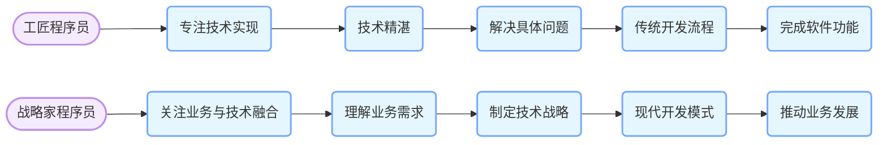

# 程序员的未来：从工匠到战略家

> 关键词：程序员未来、工匠、战略家、技术转型、行业趋势

> 摘要：本文探讨了程序员职业发展的未来趋势，即从传统的工匠角色向战略家角色转变。通过分析背景、阐述核心概念、讲解算法原理、结合数学模型、展示项目实战案例、介绍实际应用场景、推荐工具和资源等方面，深入剖析了这一转变的必要性和实现途径。同时，对未来发展趋势与挑战进行了总结，并提供了常见问题解答和扩展阅读参考资料，旨在为程序员的职业发展提供全面且深入的指导。

## 1. 背景介绍 

### 1.1 目的和范围
本文旨在深入探讨程序员未来从工匠到战略家这一职业转变的相关问题。通过全面分析这一转变的背景、核心概念、技术原理以及实际应用等方面，为广大程序员提供清晰的职业发展方向和指导。范围涵盖了从理论层面的概念阐述到实际项目中的具体操作，以及对未来发展趋势的预测和应对挑战的建议。

### 1.2 预期读者
本文的预期读者主要包括广大程序员群体，无论是初入职场的新手程序员，还是有一定经验的资深开发者，都能从本文中获得关于职业发展的有益启示。同时，对于软件行业的管理者、人力资源专家以及关注科技行业发展的人士也具有一定的参考价值。

### 1.3 文档结构概述
本文将按照以下结构展开：首先介绍背景信息，包括目的、预期读者和文档结构概述等；接着阐述核心概念与联系，通过文本示意图和 Mermaid 流程图展示相关原理；然后讲解核心算法原理和具体操作步骤，并结合 Python 源代码进行详细阐述；之后介绍数学模型和公式，并举例说明；再通过项目实战案例展示代码的实际应用和详细解释；接着探讨实际应用场景；随后推荐相关的工具和资源；最后总结未来发展趋势与挑战，提供常见问题解答和扩展阅读参考资料。

### 1.4 术语表
#### 1.4.1 核心术语定义
- **工匠程序员**：指专注于具体的编码工作，熟练掌握各种编程技术和工具，以实现软件功能为主要目标的程序员。他们通常在某个特定的技术领域有深入的了解和丰富的实践经验，能够高效地完成代码编写和调试任务。
- **战略家程序员**：不仅仅局限于技术实现，更注重从宏观层面思考问题，能够理解业务需求，制定技术战略，为企业的发展提供技术方向和决策支持。他们具备跨领域的知识和技能，能够将技术与业务紧密结合，推动企业的创新和发展。
- **技术转型**：指程序员从传统的工匠角色向战略家角色转变的过程，包括知识结构的更新、思维方式的转变和技能的提升等方面。

#### 1.4.2 相关概念解释
- **业务理解**：指程序员对所在行业的业务模式、市场需求和竞争态势有深入的了解，能够将技术解决方案与业务目标相结合，为企业创造更大的价值。
- **技术战略**：是企业为了实现其业务目标而制定的技术发展规划，包括技术选型、技术架构设计、技术创新等方面。战略家程序员需要参与制定和执行技术战略，确保技术与业务的协同发展。
- **跨领域合作**：在现代软件开发中，往往需要不同专业背景的人员协同工作，如程序员、设计师、产品经理等。战略家程序员需要具备良好的沟通和协作能力，能够与不同领域的人员进行有效的合作，共同推动项目的进展。

#### 1.4.3 缩略词列表
- **AI**：Artificial Intelligence，人工智能
- **ML**：Machine Learning，机器学习
- **DevOps**：Development and Operations，开发与运维一体化
- **MVP**：Minimum Viable Product，最小可行产品

## 2. 核心概念与联系 

### 核心概念原理
传统的工匠程序员主要关注技术细节，他们凭借精湛的编程技艺完成软件的开发工作。例如，在开发一个电商网站时，工匠程序员会专注于实现商品展示、购物车、订单处理等具体功能的代码编写。他们的优势在于技术的熟练度和解决具体问题的能力，但往往缺乏对业务整体的理解和战略规划能力。

而战略家程序员则站在更高的层面思考问题。他们不仅要掌握技术，还要深入了解业务需求和市场趋势。以电商网站为例，战略家程序员会考虑如何通过技术手段提升用户体验，增加用户粘性和转化率；如何与竞争对手进行差异化竞争；如何利用新技术推动业务创新等。他们能够制定技术战略，协调团队资源，确保技术方案与业务目标相一致。

### 架构的文本示意图
```plaintext
工匠程序员：专注技术实现
           |
           | 技术精湛，解决具体问题能力强
           |
           v
传统软件开发流程：需求分析 - 设计 - 编码 - 测试 - 部署

战略家程序员：关注业务与技术融合
           |
           | 理解业务需求，制定技术战略
           |
           v
现代软件开发模式：业务洞察 - 技术规划 - 敏捷开发 - 持续交付 - 业务创新
```

### Mermaid 流程图


从这个流程图可以看出，工匠程序员和战略家程序员在工作重点和最终目标上存在明显差异。工匠程序员主要通过技术实现完成软件功能，而战略家程序员则通过业务与技术的融合推动业务的发展。

## 3. 核心算法原理 & 具体操作步骤 

### 算法原理讲解
在从工匠程序员向战略家程序员转变的过程中，涉及到一些关键的算法和思维方式。其中，决策树算法可以帮助我们在面对复杂的业务场景时做出合理的决策。

决策树是一种基于树结构进行决策的算法，它通过对数据的分析和学习，构建一棵决策树，每个内部节点表示一个属性上的测试，每个分支表示一个测试输出，每个叶节点表示一个类别或值。

以下是一个简单的 Python 实现决策树算法的示例：

```python
import numpy as np
from sklearn.datasets import load_iris
from sklearn.model_selection import train_test_split
from sklearn.tree import DecisionTreeClassifier
from sklearn.metrics import accuracy_score

# 加载鸢尾花数据集
iris = load_iris()
X = iris.data
y = iris.target

# 划分训练集和测试集
X_train, X_test, y_train, y_test = train_test_split(X, y, test_size=0.3, random_state=42)

# 创建决策树分类器
clf = DecisionTreeClassifier()

# 训练模型
clf.fit(X_train, y_train)

# 预测
y_pred = clf.predict(X_test)

# 计算准确率
accuracy = accuracy_score(y_test, y_pred)
print(f"Accuracy: {accuracy}")
```

### 具体操作步骤
1. **数据准备**：首先，我们需要收集和整理与业务相关的数据。例如，在电商业务中，可能需要收集用户的购买记录、浏览行为、评价信息等数据。然后对数据进行清洗和预处理，去除噪声和缺失值，将数据转换为适合算法处理的格式。
2. **模型选择**：根据业务需求和数据特点选择合适的算法模型。除了决策树算法，还可以考虑使用机器学习中的其他算法，如神经网络、支持向量机等。在选择模型时，需要考虑模型的复杂度、可解释性和性能等因素。
3. **模型训练**：将准备好的数据划分为训练集和测试集，使用训练集对选择的模型进行训练。在训练过程中，调整模型的参数，以提高模型的性能。
4. **模型评估**：使用测试集对训练好的模型进行评估，计算模型的准确率、召回率、F1 值等指标，评估模型的性能。如果模型的性能不理想，可以调整模型的参数或选择其他模型进行重新训练。
5. **决策应用**：将训练好的模型应用到实际业务中，根据模型的预测结果做出决策。例如，在电商推荐系统中，根据用户的行为数据预测用户可能感兴趣的商品，向用户推荐相关商品。

通过以上步骤，我们可以利用算法模型对业务数据进行分析和预测，为战略决策提供支持。

## 4. 数学模型和公式 & 详细讲解 & 举例说明 

### 决策树的信息熵公式
在决策树算法中，信息熵是一个重要的概念，用于衡量数据的不确定性。信息熵的计算公式如下：

$$H(X) = -\sum_{i=1}^{n} p(x_i) \log_2 p(x_i)$$

其中，$X$ 是一个随机变量，$p(x_i)$ 是 $X$ 取值为 $x_i$ 的概率，$n$ 是 $X$ 可能取值的个数。

### 详细讲解
信息熵的值越大，表示数据的不确定性越大；信息熵的值越小，表示数据的不确定性越小。在决策树的构建过程中，我们希望通过选择合适的属性进行划分，使得划分后的子集的信息熵尽可能小，从而提高决策树的分类性能。

### 举例说明
假设我们有一个数据集，包含 10 个样本，其中 6 个样本属于类别 A，4 个样本属于类别 B。则该数据集的信息熵为：

$$H(X) = -\left(\frac{6}{10} \log_2 \frac{6}{10} + \frac{4}{10} \log_2 \frac{4}{10}\right) \approx 0.971$$

如果我们根据某个属性将数据集划分为两个子集，子集 1 包含 3 个类别 A 的样本和 1 个类别 B 的样本，子集 2 包含 3 个类别 A 的样本和 3 个类别 B 的样本。则子集 1 的信息熵为：

$$H(X_1) = -\left(\frac{3}{4} \log_2 \frac{3}{4} + \frac{1}{4} \log_2 \frac{1}{4}\right) \approx 0.811$$

子集 2 的信息熵为：

$$H(X_2) = -\left(\frac{3}{6} \log_2 \frac{3}{6} + \frac{3}{6} \log_2 \frac{3}{6}\right) = 1$$

我们可以计算划分后的加权信息熵：

$$H_{split}(X) = \frac{4}{10} H(X_1) + \frac{6}{10} H(X_2) \approx 0.925$$

可以看到，划分后的加权信息熵比划分前的信息熵小，说明这次划分使得数据的不确定性降低了，是一个有效的划分。

### 基尼不纯度公式
除了信息熵，基尼不纯度也是决策树中常用的一个指标，用于衡量数据的不纯度。基尼不纯度的计算公式如下：

$$Gini(X) = 1 - \sum_{i=1}^{n} p(x_i)^2$$

其中，$X$ 是一个随机变量，$p(x_i)$ 是 $X$ 取值为 $x_i$ 的概率，$n$ 是 $X$ 可能取值的个数。

### 详细讲解
基尼不纯度的值越大，表示数据的不纯度越高；基尼不纯度的值越小，表示数据的不纯度越低。在决策树的构建过程中，我们也可以选择基尼不纯度最小的属性进行划分。

### 举例说明
对于上述数据集，其基尼不纯度为：

$$Gini(X) = 1 - \left(\left(\frac{6}{10}\right)^2 + \left(\frac{4}{10}\right)^2\right) = 0.48$$

同样，我们可以计算划分后的子集的基尼不纯度，并选择基尼不纯度最小的划分方式。

## 5. 项目实战：代码实际案例和详细解释说明 

### 5.1 开发环境搭建
- **操作系统**：选择适合开发的操作系统，如 Windows、Linux 或 macOS。
- **Python 环境**：安装 Python 3.x 版本，可以从 Python 官方网站（https://www.python.org/downloads/）下载安装包进行安装。
- **开发工具**：推荐使用 PyCharm 作为开发工具，它是一款功能强大的 Python 集成开发环境（IDE），可以提高开发效率。也可以使用 Visual Studio Code 等轻量级编辑器。
- **相关库的安装**：在命令行中使用以下命令安装所需的库：
```sh
pip install numpy pandas scikit-learn matplotlib
```

### 5.2 源代码详细实现和代码解读
以下是一个简单的电商用户购买预测项目的代码示例：

```python
import pandas as pd
from sklearn.model_selection import train_test_split
from sklearn.ensemble import RandomForestClassifier
from sklearn.metrics import accuracy_score

# 加载数据集
data = pd.read_csv('ecommerce_data.csv')

# 数据预处理
# 假设数据集中包含用户的年龄、性别、浏览时间、购买金额等特征
X = data[['age', 'gender', 'browse_time', 'purchase_amount']]
y = data['purchase']

# 处理分类特征
X = pd.get_dummies(X, columns=['gender'])

# 划分训练集和测试集
X_train, X_test, y_train, y_test = train_test_split(X, y, test_size=0.2, random_state=42)

# 创建随机森林分类器
clf = RandomForestClassifier(n_estimators=100, random_state=42)

# 训练模型
clf.fit(X_train, y_train)

# 预测
y_pred = clf.predict(X_test)

# 计算准确率
accuracy = accuracy_score(y_test, y_pred)
print(f"Accuracy: {accuracy}")
```

### 代码解读与分析
1. **数据加载**：使用 `pandas` 库的 `read_csv` 函数加载电商数据集。
2. **数据预处理**：选择相关的特征作为输入特征 `X`，将目标变量 `purchase` 作为输出 `y`。对于分类特征 `gender`，使用 `pd.get_dummies` 函数进行独热编码，将其转换为数值特征。
3. **数据集划分**：使用 `train_test_split` 函数将数据集划分为训练集和测试集，测试集占比为 20%。
4. **模型创建**：创建一个随机森林分类器，设置树的数量为 100。
5. **模型训练**：使用训练集对随机森林分类器进行训练。
6. **模型预测**：使用训练好的模型对测试集进行预测。
7. **模型评估**：使用 `accuracy_score` 函数计算模型的准确率。

通过这个项目实战，我们可以看到如何将机器学习算法应用到实际业务中，预测用户的购买行为。作为战略家程序员，我们可以根据模型的预测结果制定营销策略，提高用户的购买转化率。

## 6. 实际应用场景 
### 产品规划与创新
战略家程序员可以利用技术和业务知识，参与产品的规划和创新。例如，在开发一款社交应用时，通过分析用户数据和市场趋势，提出新的功能和特性建议，如增加短视频分享、实时互动等功能，以满足用户的需求，提高产品的竞争力。

### 业务流程优化
通过对企业业务流程的深入了解，战略家程序员可以利用技术手段对业务流程进行优化。例如，在物流企业中，通过开发智能调度系统，根据订单信息、车辆位置和路况等因素，实时优化配送路线，提高配送效率，降低成本。

### 市场趋势预测
利用数据分析和机器学习算法，战略家程序员可以对市场趋势进行预测。例如，在金融领域，通过分析历史数据和市场动态，预测股票价格的走势，为投资决策提供支持。

### 跨部门协作与沟通
战略家程序员需要与不同部门的人员进行有效的协作和沟通。例如，与市场营销部门合作，根据用户需求和市场反馈，制定产品推广策略；与运营部门合作，优化系统性能，提高用户体验。

### 技术战略制定
根据企业的业务目标和市场趋势，战略家程序员可以制定技术战略。例如，确定企业的技术选型、技术架构和技术发展方向，确保技术与业务的协同发展。

## 7. 工具和资源推荐
### 7.1 学习资源推荐
#### 7.1.1 书籍推荐
- 《Effective Java》：这本书是 Java 编程的经典之作，介绍了 Java 编程的最佳实践和设计模式，对于提高程序员的编程水平有很大帮助。
- 《Clean Code》：强调编写整洁代码的重要性，提供了一系列编写高质量代码的原则和方法，有助于培养良好的编程习惯。
- 《The Lean Startup》：介绍了精益创业的理念和方法，对于理解业务模式和创业过程有很大帮助，适合战略家程序员学习。
- 《Artificial Intelligence: A Modern Approach》：人工智能领域的经典教材，全面介绍了人工智能的基本概念、算法和应用，对于想要深入学习人工智能的程序员来说是一本很好的参考书。

#### 7.1.2 在线课程
- Coursera 上的 “Machine Learning” 课程：由 Andrew Ng 教授主讲，是机器学习领域的经典课程，涵盖了机器学习的基本概念、算法和实践应用。
- edX 上的 “Introduction to Artificial Intelligence” 课程：由麻省理工学院（MIT）提供，介绍了人工智能的基本原理和技术，包括搜索算法、知识表示、机器学习等方面。
- Udemy 上的 “Full Stack Web Development with React and Node.js” 课程：适合想要学习全栈开发的程序员，课程涵盖了前端 React 框架和后端 Node.js 的开发。

#### 7.1.3 技术博客和网站
- Medium：是一个知名的技术博客平台，上面有很多优秀的技术文章和经验分享，涵盖了各种技术领域。
- Stack Overflow：是程序员的问答社区，上面有大量的技术问题和解决方案，可以帮助程序员解决遇到的技术难题。
- Hacker News：是一个关注科技和创业的社区，上面有很多关于最新技术趋势和创业动态的讨论。

### 7.2 开发工具框架推荐
#### 7.2.1 IDE和编辑器
- PyCharm：是一款专门为 Python 开发设计的集成开发环境，具有代码自动补全、调试、版本控制等功能，提高开发效率。
- Visual Studio Code：是一款轻量级的代码编辑器，支持多种编程语言，具有丰富的插件生态系统，可以根据需要进行扩展。
- IntelliJ IDEA：是一款功能强大的 Java 集成开发环境，适用于大型 Java 项目的开发。

#### 7.2.2 调试和性能分析工具
- PySnooper：是一个 Python 调试工具，可以自动记录函数的调用过程和变量的值，方便调试代码。
- Profiler：Python 内置的性能分析工具，可以分析代码的执行时间和内存使用情况，帮助优化代码性能。
- Chrome DevTools：是 Chrome 浏览器自带的开发工具，可用于调试前端代码、分析性能和优化网页加载速度。

#### 7.2.3 相关框架和库
- Django：是一个高级 Python Web 框架，具有快速开发、安全稳定等特点，适合开发大型 Web 应用。
- Flask：是一个轻量级的 Python Web 框架，简单易用，适合快速搭建小型 Web 应用。
- TensorFlow：是一个开源的机器学习框架，广泛应用于深度学习领域，提供了丰富的工具和库，方便开发机器学习模型。

### 7.3 相关论文著作推荐
#### 7.3.1 经典论文
- “A Mathematical Theory of Communication”：由 Claude E. Shannon 发表，奠定了信息论的基础，对于理解数据的传输和处理有重要意义。
- “Learning Representations by Back-propagating Errors”：由 David E. Rumelhart、Geoffrey E. Hinton 和 Ronald J. Williams 发表，介绍了反向传播算法，是神经网络领域的经典论文。
- “The PageRank Citation Ranking: Bringing Order to the Web”：由 Sergey Brin 和 Larry Page 发表，介绍了 PageRank 算法，是搜索引擎领域的重要成果。

#### 7.3.2 最新研究成果
- 关注顶级学术会议如 NeurIPS（神经信息处理系统大会）、ICML（国际机器学习会议）、CVPR（计算机视觉与模式识别会议）等的最新研究成果，了解机器学习、计算机视觉等领域的最新发展动态。
- 阅读知名学术期刊如 Journal of Artificial Intelligence Research（JAIR）、Artificial Intelligence 等的论文，获取高质量的研究成果。

#### 7.3.3 应用案例分析
- 分析一些成功的科技公司的技术应用案例，如 Google 的搜索引擎技术、Amazon 的电商推荐系统、Netflix 的视频推荐算法等，学习它们的技术实现和业务模式。
- 关注行业报告和研究机构发布的案例分析，了解不同行业的技术应用趋势和最佳实践。

## 8. 总结：未来发展趋势与挑战
### 未来发展趋势
- **技术融合**：未来，各种技术将进一步融合，如人工智能与物联网、区块链与大数据等。战略家程序员需要具备跨领域的知识和技能，能够将不同的技术应用到实际业务中，创造出更具创新性的解决方案。
- **智能化发展**：随着人工智能技术的不断发展，软件系统将越来越智能化。战略家程序员需要关注人工智能的最新发展动态，将人工智能技术应用到软件的开发和优化中，提高软件的智能水平和用户体验。
- **业务导向**：未来的软件开发将更加注重业务导向，战略家程序员需要深入了解业务需求，将技术与业务紧密结合，为企业提供更具价值的解决方案。
- **可持续发展**：随着环保意识的增强，软件行业也将越来越注重可持续发展。战略家程序员需要考虑软件系统的能耗、资源利用等问题，开发出更加环保和可持续的软件产品。

### 挑战
- **知识更新压力**：技术发展日新月异，战略家程序员需要不断学习和更新知识，跟上技术发展的步伐。这需要投入大量的时间和精力，对程序员的学习能力和自我驱动力提出了很高的要求。
- **跨领域协作困难**：在跨领域合作中，不同专业背景的人员可能存在沟通障碍和理解差异，战略家程序员需要具备良好的沟通和协作能力，能够协调不同领域的人员共同完成项目。
- **业务理解难度**：深入理解业务需求需要一定的行业经验和商业洞察力，对于一些缺乏业务经验的程序员来说，理解业务需求并将其转化为技术方案是一个挑战。
- **伦理和法律问题**：随着技术的发展，人工智能、大数据等技术带来了一系列伦理和法律问题，如隐私保护、算法偏见等。战略家程序员需要关注这些问题，确保技术的应用符合伦理和法律规范。

## 9. 附录：常见问题与解答
### 问题 1：如何从工匠程序员转变为战略家程序员？
解答：要实现从工匠程序员到战略家程序员的转变，需要从以下几个方面入手：一是学习业务知识，了解所在行业的业务模式、市场需求和竞争态势；二是培养战略思维，学会从宏观层面思考问题，制定技术战略；三是提升沟通和协作能力，与不同部门的人员进行有效的合作；四是关注技术发展趋势，不断学习和掌握新的技术。

### 问题 2：成为战略家程序员需要掌握哪些技能？
解答：除了编程技能外，战略家程序员还需要掌握以下技能：业务分析能力，能够理解业务需求并将其转化为技术方案；数据分析能力，能够运用数据分析工具和算法对业务数据进行分析和预测；项目管理能力，能够有效地组织和管理项目团队，确保项目按时交付；沟通和协作能力，能够与不同领域的人员进行良好的沟通和协作。

### 问题 3：战略家程序员在企业中的角色和职责是什么？
解答：战略家程序员在企业中扮演着重要的角色，他们不仅要负责技术的实现，还要参与企业的战略规划和决策。具体职责包括：制定技术战略，确保技术与业务目标相一致；协调团队资源，推动项目的顺利进行；分析业务数据，为企业的决策提供支持；关注技术发展趋势，为企业引入新的技术和创新模式。

### 问题 4：如何提高自己的战略思维能力？
解答：提高战略思维能力可以从以下几个方面入手：一是多阅读商业和管理方面的书籍和文章，了解企业战略规划的方法和案例；二是关注行业动态和市场趋势，分析竞争对手的策略和行动；三是参与企业的战略规划和决策过程，积累实践经验；四是培养自己的全局观和前瞻性思维，学会从长远和整体的角度思考问题。

## 10. 扩展阅读 & 参考资料
### 扩展阅读
- 《The Innovator's Dilemma》：这本书探讨了创新者面临的困境和挑战，对于理解企业创新和技术变革有很大帮助。
- 《Zero to One》：由 Peter Thiel 所著，介绍了从 0 到 1 的创业理念和方法，适合想要创业或参与创新项目的程序员阅读。
- 《The 7 Habits of Highly Effective People》：这本书介绍了高效人士的七个习惯，对于提高个人的综合素质和工作效率有很大帮助。

### 参考资料
- 各技术官方文档，如 Python 官方文档、TensorFlow 官方文档等，是学习和使用相关技术的重要参考资料。
- 学术数据库，如 IEEE Xplore、ACM Digital Library 等，提供了大量的学术论文和研究成果。
- 行业报告和研究机构发布的资料，如 Gartner、IDC 等发布的行业报告，有助于了解行业的发展趋势和市场动态。