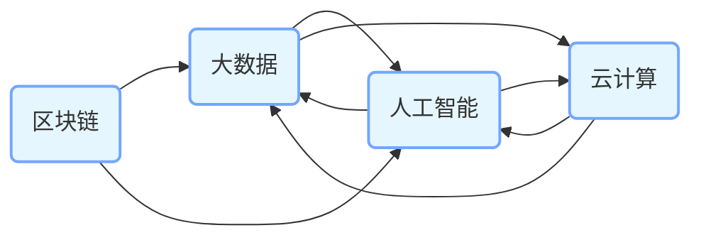

# 程序员的生存与发展：新技能与新机遇

> 关键词：程序员、生存发展、新技能、新机遇、技术趋势

> 摘要：本文聚焦于程序员的生存与发展，深入探讨在当今快速变化的技术环境下程序员所需掌握的新技能以及面临的新机遇。通过分析背景信息，阐述核心概念与联系，详细讲解核心算法原理与操作步骤，结合数学模型进行说明，并给出项目实战案例。同时，介绍实际应用场景，推荐相关工具和资源，最后总结未来发展趋势与挑战，为程序员的职业发展提供全面且有深度的参考。

## 1. 背景介绍 
### 1.1 目的和范围
在科技飞速发展的时代，软件行业正经历着前所未有的变革。新的技术层出不穷，如人工智能、大数据、区块链等，这些技术不仅改变了软件开发的方式，也对程序员的技能和能力提出了新的要求。本文的目的在于帮助程序员了解当前技术发展的趋势，明确为了在行业中生存和发展所需掌握的新技能，以及如何抓住随之而来的新机遇。范围涵盖了多个热门技术领域，包括但不限于人工智能、大数据、云计算、区块链等，同时探讨了这些技术在不同行业的应用和发展前景。

### 1.2 预期读者
本文主要面向广大程序员群体，包括初入职场的新手程序员、有一定经验的中级程序员以及寻求技术突破和职业转型的高级程序员。此外，对于软件行业的管理者、招聘人员以及对技术发展趋势感兴趣的人士也具有一定的参考价值。

### 1.3 文档结构概述
本文将按照以下结构进行组织：首先介绍核心概念与联系，帮助读者建立对相关技术的基本认识；接着详细讲解核心算法原理和具体操作步骤，通过Python代码进行示例；然后引入数学模型和公式，对相关技术进行深入分析；之后给出项目实战案例，包括开发环境搭建、源代码实现和代码解读；再介绍实际应用场景，展示这些技术的实际价值；推荐相关的工具和资源，为读者提供学习和实践的途径；最后总结未来发展趋势与挑战，并提供常见问题解答和扩展阅读参考资料。

### 1.4 术语表
#### 1.4.1 核心术语定义
- **人工智能（Artificial Intelligence，AI）**：是一门研究如何使计算机系统能够模拟人类智能的学科，包括机器学习、深度学习、自然语言处理等多个领域。
- **大数据（Big Data）**：指无法在一定时间范围内用常规软件工具进行捕捉、管理和处理的数据集合，具有大量（Volume）、高速（Velocity）、多样（Variety）、低价值密度（Veracity）等特点。
- **云计算（Cloud Computing）**：是一种基于互联网的计算方式，通过将计算资源（如服务器、存储、软件等）提供给用户，实现按需使用和付费。
- **区块链（Blockchain）**：是一种分布式账本技术，通过密码学方法确保数据的不可篡改和可追溯性，广泛应用于数字货币、金融交易等领域。
- **机器学习（Machine Learning，ML）**：是人工智能的一个分支，通过让计算机从数据中学习模式和规律，从而实现预测和决策的能力。
- **深度学习（Deep Learning，DL）**：是机器学习的一个子领域，基于人工神经网络，通过构建多层神经网络来学习数据的深层次特征。

#### 1.4.2 相关概念解释
- **数据挖掘（Data Mining）**：从大量数据中发现有价值的信息和知识的过程，通常使用机器学习和统计分析方法。
- **物联网（Internet of Things，IoT）**：将各种物理设备通过互联网连接起来，实现数据的传输和交互，从而实现智能化的管理和控制。
- **容器化技术（Containerization）**：将应用程序及其依赖项打包成一个独立的容器，实现应用的快速部署和隔离。
- **微服务架构（Microservices Architecture）**：将一个大型应用拆分成多个小型、自治的服务，每个服务可以独立开发、部署和维护。

#### 1.4.3 缩略词列表
- **AI**：Artificial Intelligence（人工智能）
- **ML**：Machine Learning（机器学习）
- **DL**：Deep Learning（深度学习）
- **NLP**：Natural Language Processing（自然语言处理）
- **IoT**：Internet of Things（物联网）
- **API**：Application Programming Interface（应用程序编程接口）
- **SDK**：Software Development Kit（软件开发工具包）

## 2. 核心概念与联系 

### 核心概念原理和架构的文本示意图

在当今的技术生态中，人工智能、大数据、云计算和区块链等核心技术相互关联、相互促进，共同构成了一个复杂而又充满活力的技术体系。以下是这些核心概念的简要原理和它们之间的联系：

- **人工智能**：通过模拟人类的智能行为，让计算机能够自主地学习、推理和决策。其核心是机器学习和深度学习算法，通过大量的数据训练模型，使模型能够对新的数据进行预测和分类。
- **大数据**：为人工智能提供了丰富的数据资源。大数据技术包括数据采集、存储、处理和分析等环节，通过对海量数据的挖掘和分析，发现其中的规律和价值。
- **云计算**：为大数据和人工智能提供了强大的计算资源和存储能力。云计算平台可以根据用户的需求动态分配计算资源，降低了企业和开发者的成本。
- **区块链**：为数据的安全和可信提供了保障。区块链的分布式账本技术可以确保数据的不可篡改和可追溯性，在金融、医疗等领域具有广泛的应用前景。

它们之间的关系可以用以下示意图表示：

大数据为人工智能提供数据支持，人工智能通过对大数据的分析和处理发现价值；云计算为大数据和人工智能提供计算和存储资源；区块链则为大数据和人工智能的数据安全和可信提供保障。

### Mermaid 流程图



这个流程图清晰地展示了大数据、人工智能、云计算和区块链之间的相互关系。大数据和人工智能相互促进，共同发展；云计算为大数据和人工智能提供支持；区块链则为大数据和人工智能的数据安全提供保障。

## 3. 核心算法原理 & 具体操作步骤 

### 机器学习中的线性回归算法原理及Python实现

#### 算法原理
线性回归是一种基本的机器学习算法，用于建立自变量和因变量之间的线性关系。其基本模型可以表示为：

$$y = \theta_0 + \theta_1x_1 + \theta_2x_2 + \cdots + \theta_nx_n$$

其中，$y$ 是因变量，$x_1, x_2, \cdots, x_n$ 是自变量，$\theta_0, \theta_1, \cdots, \theta_n$ 是模型的参数。线性回归的目标是通过最小化预测值和真实值之间的误差来确定最优的参数 $\theta$。常用的误差度量方法是均方误差（Mean Squared Error，MSE）：

$$MSE = \frac{1}{m} \sum_{i=1}^{m} (y^{(i)} - \hat{y}^{(i)})^2$$

其中，$m$ 是样本数量，$y^{(i)}$ 是第 $i$ 个样本的真实值，$\hat{y}^{(i)}$ 是第 $i$ 个样本的预测值。

#### 具体操作步骤
1. **数据准备**：收集和整理数据集，将其分为训练集和测试集。
2. **模型训练**：使用训练集数据来训练线性回归模型，通过最小化均方误差来确定模型的参数。
3. **模型评估**：使用测试集数据来评估模型的性能，计算均方误差等指标。
4. **模型预测**：使用训练好的模型对新的数据进行预测。

#### Python代码实现

```python
import numpy as np
from sklearn.model_selection import train_test_split
from sklearn.linear_model import LinearRegression
from sklearn.metrics import mean_squared_error

# 生成示例数据
np.random.seed(0)
X = 2 * np.random.rand(100, 1)
y = 4 + 3 * X + np.random.randn(100, 1)

# 划分训练集和测试集
X_train, X_test, y_train, y_test = train_test_split(X, y, test_size=0.2, random_state=42)

# 创建线性回归模型
model = LinearRegression()

# 模型训练
model.fit(X_train, y_train)

# 模型预测
y_pred = model.predict(X_test)

# 模型评估
mse = mean_squared_error(y_test, y_pred)
print(f"均方误差: {mse}")

# 输出模型参数
print(f"截距: {model.intercept_}")
print(f"系数: {model.coef_}")
```

### 深度学习中的神经网络算法原理及Python实现

#### 算法原理
神经网络是一种模仿人类神经系统的计算模型，由多个神经元组成。每个神经元接收输入信号，经过加权求和和激活函数处理后输出结果。神经网络通常由输入层、隐藏层和输出层组成。

在训练神经网络时，通常使用反向传播算法来更新模型的参数。反向传播算法通过计算损失函数对模型参数的梯度，然后使用梯度下降法来更新参数，以最小化损失函数。

#### 具体操作步骤
1. **数据准备**：收集和整理数据集，将其分为训练集和测试集。对数据进行预处理，如归一化、标准化等。
2. **模型构建**：定义神经网络的结构，包括输入层、隐藏层和输出层的神经元数量，以及激活函数的选择。
3. **模型编译**：选择损失函数、优化器和评估指标。
4. **模型训练**：使用训练集数据来训练神经网络，通过多次迭代更新模型的参数。
5. **模型评估**：使用测试集数据来评估模型的性能，计算损失函数和评估指标。
6. **模型预测**：使用训练好的模型对新的数据进行预测。

#### Python代码实现

```python
import numpy as np
from tensorflow.keras.models import Sequential
from tensorflow.keras.layers import Dense
from sklearn.model_selection import train_test_split
from sklearn.datasets import make_regression

# 生成示例数据
X, y = make_regression(n_samples=1000, n_features=10, noise=0.1, random_state=42)
y = y.reshape(-1, 1)

# 划分训练集和测试集
X_train, X_test, y_train, y_test = train_test_split(X, y, test_size=0.2, random_state=42)

# 构建神经网络模型
model = Sequential()
model.add(Dense(64, activation='relu', input_shape=(10,)))
model.add(Dense(32, activation='relu'))
model.add(Dense(1))

# 编译模型
model.compile(optimizer='adam', loss='mse')

# 训练模型
model.fit(X_train, y_train, epochs=50, batch_size=32, validation_data=(X_test, y_test))

# 评估模型
loss = model.evaluate(X_test, y_test)
print(f"损失函数值: {loss}")

# 模型预测
y_pred = model.predict(X_test)
```

## 4. 数学模型和公式 & 详细讲解 & 举例说明 

### 线性回归的数学模型和公式

#### 最小二乘法求解参数
在线性回归中，我们的目标是最小化均方误差 $MSE$。为了求解最优的参数 $\theta$，可以使用最小二乘法。最小二乘法的原理是通过对 $MSE$ 关于 $\theta$ 求偏导数，并令偏导数等于零，得到一组方程组，解这个方程组即可得到最优的参数 $\theta$。

对于简单线性回归（只有一个自变量），模型可以表示为 $y = \theta_0 + \theta_1x$。均方误差为：

$$MSE = \frac{1}{m} \sum_{i=1}^{m} (y^{(i)} - (\theta_0 + \theta_1x^{(i)}))^2$$

分别对 $\theta_0$ 和 $\theta_1$ 求偏导数，并令偏导数等于零：

$$\frac{\partial MSE}{\partial \theta_0} = -\frac{2}{m} \sum_{i=1}^{m} (y^{(i)} - (\theta_0 + \theta_1x^{(i)})) = 0$$

$$\frac{\partial MSE}{\partial \theta_1} = -\frac{2}{m} \sum_{i=1}^{m} x^{(i)}(y^{(i)} - (\theta_0 + \theta_1x^{(i)})) = 0$$

解这两个方程组可以得到：

$$\theta_1 = \frac{\sum_{i=1}^{m} (x^{(i)} - \bar{x})(y^{(i)} - \bar{y})}{\sum_{i=1}^{m} (x^{(i)} - \bar{x})^2}$$

$$\theta_0 = \bar{y} - \theta_1\bar{x}$$

其中，$\bar{x}$ 和 $\bar{y}$ 分别是 $x$ 和 $y$ 的均值。

#### 举例说明
假设有以下数据集：

| $x$ | $y$ |
| --- | --- |
| 1 | 2 |
| 2 | 4 |
| 3 | 6 |
| 4 | 8 |

首先计算均值：

$$\bar{x} = \frac{1 + 2 + 3 + 4}{4} = 2.5$$

$$\bar{y} = \frac{2 + 4 + 6 + 8}{4} = 5$$

然后计算 $\theta_1$：

$$\sum_{i=1}^{4} (x^{(i)} - \bar{x})(y^{(i)} - \bar{y}) = (1 - 2.5)(2 - 5) + (2 - 2.5)(4 - 5) + (3 - 2.5)(6 - 5) + (4 - 2.5)(8 - 5) = 10$$

$$\sum_{i=1}^{4} (x^{(i)} - \bar{x})^2 = (1 - 2.5)^2 + (2 - 2.5)^2 + (3 - 2.5)^2 + (4 - 2.5)^2 = 5$$

$$\theta_1 = \frac{10}{5} = 2$$

最后计算 $\theta_0$：

$$\theta_0 = 5 - 2 \times 2.5 = 0$$

所以，线性回归模型为 $y = 2x$。

### 神经网络的数学模型和公式

#### 神经元的数学模型
神经网络中的神经元可以用以下数学模型表示：

$$z = \sum_{i=1}^{n} w_ix_i + b$$

$$a = f(z)$$

其中，$x_1, x_2, \cdots, x_n$ 是输入信号，$w_1, w_2, \cdots, w_n$ 是权重，$b$ 是偏置，$z$ 是加权求和的结果，$f$ 是激活函数，$a$ 是神经元的输出。

#### 激活函数
常见的激活函数有：

- **Sigmoid函数**：

$$f(z) = \frac{1}{1 + e^{-z}}$$

Sigmoid函数的输出范围是 $(0, 1)$，可以将输入映射到一个概率值。

- **ReLU函数**：

$$f(z) = \max(0, z)$$

ReLU函数在 $z > 0$ 时输出 $z$，在 $z \leq 0$ 时输出 $0$，具有计算简单、收敛速度快等优点。

#### 反向传播算法
反向传播算法是训练神经网络的核心算法，其基本思想是通过计算损失函数对模型参数的梯度，然后使用梯度下降法来更新参数。

假设损失函数为 $L$，模型的参数为 $W$ 和 $b$，则参数的更新公式为：

$$W = W - \alpha \frac{\partial L}{\partial W}$$

$$b = b - \alpha \frac{\partial L}{\partial b}$$

其中，$\alpha$ 是学习率，控制参数更新的步长。

#### 举例说明
假设有一个简单的两层神经网络，输入层有2个神经元，隐藏层有3个神经元，输出层有1个神经元。输入数据为 $x = [x_1, x_2]$，隐藏层的权重矩阵为 $W_1$，偏置向量为 $b_1$，输出层的权重矩阵为 $W_2$，偏置向量为 $b_2$。

首先计算隐藏层的输出：

$$z_1 = W_1x + b_1$$

$$a_1 = f(z_1)$$

然后计算输出层的输出：

$$z_2 = W_2a_1 + b_2$$

$$a_2 = f(z_2)$$

假设损失函数为均方误差：

$$L = \frac{1}{2}(y - a_2)^2$$

通过反向传播算法计算损失函数对 $W_1$、$b_1$、$W_2$ 和 $b_2$ 的梯度，然后更新参数。

## 5. 项目实战：代码实际案例和详细解释说明 

### 5.1  开发环境搭建

#### 安装Python
首先需要安装Python编程语言。可以从Python官方网站（https://www.python.org/downloads/）下载适合自己操作系统的Python安装包，并按照安装向导进行安装。

#### 安装必要的库
在本项目中，我们将使用一些常见的Python库，如NumPy、Pandas、Scikit-learn、TensorFlow等。可以使用以下命令来安装这些库：

```sh
pip install numpy pandas scikit-learn tensorflow
```

#### 选择开发工具
可以选择使用Jupyter Notebook、PyCharm等开发工具。Jupyter Notebook是一个交互式的开发环境，适合进行数据分析和模型实验；PyCharm是一个功能强大的Python集成开发环境，适合进行大型项目的开发。

### 5.2  源代码详细实现和代码解读

#### 项目背景
我们将实现一个简单的手写数字识别项目，使用MNIST数据集。MNIST数据集包含了60000张训练图像和10000张测试图像，每张图像都是28x28像素的灰度图像，代表了0-9之间的一个数字。

#### 代码实现

```python
import numpy as np
import tensorflow as tf
from tensorflow.keras.datasets import mnist
from tensorflow.keras.models import Sequential
from tensorflow.keras.layers import Dense, Flatten
from tensorflow.keras.utils import to_categorical
import matplotlib.pyplot as plt

# 加载MNIST数据集
(train_images, train_labels), (test_images, test_labels) = mnist.load_data()

# 数据预处理
train_images = train_images / 255.0
test_images = test_images / 255.0

train_labels = to_categorical(train_labels)
test_labels = to_categorical(test_labels)

# 构建神经网络模型
model = Sequential()
model.add(Flatten(input_shape=(28, 28)))
model.add(Dense(128, activation='relu'))
model.add(Dense(10, activation='softmax'))

# 编译模型
model.compile(optimizer='adam',
              loss='categorical_crossentropy',
              metrics=['accuracy'])

# 训练模型
history = model.fit(train_images, train_labels, epochs=5, batch_size=64, validation_data=(test_images, test_labels))

# 评估模型
test_loss, test_acc = model.evaluate(test_images, test_labels)
print(f"测试集损失: {test_loss}")
print(f"测试集准确率: {test_acc}")

# 可视化训练过程
plt.plot(history.history['accuracy'])
plt.plot(history.history['val_accuracy'])
plt.title('Model accuracy')
plt.ylabel('Accuracy')
plt.xlabel('Epoch')
plt.legend(['Train', 'Test'], loc='upper left')
plt.show()

plt.plot(history.history['loss'])
plt.plot(history.history['val_loss'])
plt.title('Model loss')
plt.ylabel('Loss')
plt.xlabel('Epoch')
plt.legend(['Train', 'Test'], loc='upper left')
plt.show()
```

#### 代码解读
1. **数据加载**：使用 `mnist.load_data()` 函数加载MNIST数据集，将其分为训练集和测试集。
2. **数据预处理**：将图像数据归一化到0-1之间，将标签数据进行one-hot编码。
3. **模型构建**：使用 `Sequential` 模型构建一个简单的神经网络，包括一个Flatten层、一个全连接层和一个输出层。
4. **模型编译**：选择优化器、损失函数和评估指标。
5. **模型训练**：使用 `fit` 方法训练模型，指定训练数据、训练轮数和批次大小。
6. **模型评估**：使用 `evaluate` 方法评估模型在测试集上的性能。
7. **可视化训练过程**：使用 `matplotlib` 库绘制训练过程中的准确率和损失曲线。

### 5.3  代码解读与分析

#### 数据预处理的重要性
数据预处理是机器学习项目中非常重要的一步。在本项目中，将图像数据归一化到0-1之间可以加快模型的收敛速度，提高模型的稳定性。将标签数据进行one-hot编码可以方便使用分类损失函数进行训练。

#### 模型结构的选择
本项目中使用的神经网络结构是一个简单的全连接神经网络。Flatten层将28x28的图像数据展平为一维向量，全连接层用于学习数据的特征，输出层使用softmax激活函数输出每个类别的概率。

#### 训练过程的监控
通过可视化训练过程中的准确率和损失曲线，可以及时发现模型是否过拟合或欠拟合。如果训练集的准确率远高于测试集的准确率，可能存在过拟合问题；如果训练集和测试集的准确率都很低，可能存在欠拟合问题。

## 6. 实际应用场景 

### 人工智能在医疗领域的应用
- **疾病诊断**：通过对大量的医学影像（如X光、CT、MRI等）和临床数据进行分析，人工智能可以辅助医生进行疾病的诊断和预测。例如，使用深度学习算法可以检测肺部结节、乳腺癌等疾病，提高诊断的准确性和效率。
- **药物研发**：人工智能可以帮助筛选药物靶点、预测药物的疗效和副作用，加速药物研发的进程。例如，使用机器学习算法可以对大量的化合物进行虚拟筛选，找出具有潜在治疗价值的化合物。
- **智能健康管理**：通过可穿戴设备和移动医疗应用收集用户的健康数据，人工智能可以为用户提供个性化的健康建议和预警。例如，根据用户的运动、睡眠、饮食等数据，推荐适合的运动计划和饮食方案。

### 大数据在金融领域的应用
- **风险评估**：金融机构可以通过分析大量的客户数据、市场数据和宏观经济数据，使用大数据技术进行风险评估和预测。例如，使用信用评分模型对客户的信用风险进行评估，为贷款审批提供依据。
- **市场趋势分析**：通过对金融市场的交易数据、新闻资讯等进行实时分析，大数据可以帮助投资者了解市场趋势，做出更明智的投资决策。例如，使用文本挖掘技术对新闻文章进行情感分析，预测股票市场的走势。
- **反欺诈检测**：金融机构可以通过分析交易数据和用户行为数据，使用大数据技术检测欺诈行为。例如，通过分析用户的交易模式和地理位置信息，识别异常交易，及时采取措施防范欺诈风险。

### 云计算在企业数字化转型中的应用
- **降低成本**：企业可以通过使用云计算服务，将计算资源和存储资源外包给云服务提供商，降低硬件采购和维护成本。例如，中小企业可以使用云服务器来运行企业应用，无需购买昂贵的服务器设备。
- **提高灵活性**：云计算服务可以根据企业的需求动态分配计算资源，提高企业的灵活性和响应速度。例如，企业在业务高峰期可以增加计算资源，在业务低谷期可以减少计算资源，降低成本。
- **加速创新**：云计算提供了丰富的开发工具和平台，企业可以利用这些工具和平台快速开发和部署新的应用和服务，加速创新进程。例如，企业可以使用云计算平台上的机器学习服务来开发智能客服系统。

### 区块链在供应链管理中的应用
- **提高透明度**：区块链的分布式账本技术可以记录供应链中的每一个环节，包括原材料采购、生产加工、物流运输、销售等，提高供应链的透明度和可追溯性。例如，消费者可以通过扫描产品上的二维码，查看产品的来源和生产过程。
- **增强信任**：区块链的不可篡改和可追溯性可以保证供应链中的数据真实可靠，增强供应链各参与方之间的信任。例如，供应商可以通过区块链证明自己的产品质量和合规性，降低采购方的风险。
- **优化流程**：区块链可以实现供应链中的智能合约，自动执行合同条款，提高供应链的效率和自动化程度。例如，当货物到达指定地点时，智能合约可以自动触发付款流程，减少人工干预。

## 7. 工具和资源推荐
### 7.1 学习资源推荐
#### 7.1.1 书籍推荐
- 《Python机器学习》（Sebastian Raschka著）：这本书详细介绍了Python在机器学习中的应用，包括各种机器学习算法的原理和实现，适合初学者入门。
- 《深度学习》（Ian Goodfellow、Yoshua Bengio和Aaron Courville著）：这是深度学习领域的经典教材，全面介绍了深度学习的理论和实践，适合有一定基础的读者深入学习。
- 《数据挖掘：概念与技术》（Jiawei Han、Jian Pei和Jianying Yin著）：这本书系统地介绍了数据挖掘的基本概念、算法和应用，是数据挖掘领域的权威著作。

#### 7.1.2 在线课程
- Coursera上的“机器学习”课程（Andrew Ng教授主讲）：这是一门非常经典的机器学习课程，由斯坦福大学的Andrew Ng教授主讲，课程内容涵盖了机器学习的基本概念、算法和应用，适合初学者学习。
- edX上的“深度学习基础”课程（deeplearning.ai提供）：这门课程由深度学习领域的知名学者提供，系统地介绍了深度学习的基本概念、算法和实践，适合有一定基础的读者深入学习。
- 阿里云大学上的“大数据分析与挖掘”课程：这门课程介绍了大数据分析和挖掘的基本概念、技术和工具，通过实际案例让学员掌握大数据分析和挖掘的方法和技巧。

#### 7.1.3 技术博客和网站
- Medium：这是一个技术博客平台，上面有很多关于人工智能、大数据、云计算等领域的优质文章，作者来自世界各地的技术专家和从业者。
- Towards Data Science：这是一个专注于数据科学和机器学习的技术博客，上面有很多关于数据科学和机器学习的教程、案例和研究成果。
- 开源中国：这是一个国内知名的开源技术社区，上面有很多关于软件开发、开源项目、技术趋势等方面的文章和资讯。

### 7.2 开发工具框架推荐
#### 7.2.1 IDE和编辑器
- PyCharm：这是一个功能强大的Python集成开发环境，提供了代码编辑、调试、版本控制等功能，适合进行大型Python项目的开发。
- Jupyter Notebook：这是一个交互式的开发环境，适合进行数据分析和模型实验。可以在浏览器中编写代码、运行代码、查看结果，并且可以将代码、文本、图表等内容整合在一起，形成一个可分享的文档。
- Visual Studio Code：这是一个轻量级的代码编辑器，支持多种编程语言和插件，具有丰富的扩展功能。可以安装Python相关的插件，进行Python代码的开发和调试。

#### 7.2.2 调试和性能分析工具
- Py-Spy：这是一个用于Python代码性能分析的工具，可以实时查看Python代码的CPU使用率和函数调用情况，帮助开发者找出性能瓶颈。
- TensorBoard：这是TensorFlow提供的一个可视化工具，可以用于可视化训练过程中的损失函数、准确率、模型结构等信息，帮助开发者监控和调试模型。
- Memory Profiler：这是一个用于Python代码内存分析的工具，可以查看Python代码的内存使用情况，帮助开发者找出内存泄漏问题。

#### 7.2.3 相关框架和库
- TensorFlow：这是一个开源的机器学习框架，由Google开发和维护。提供了丰富的深度学习模型和工具，支持GPU加速，广泛应用于图像识别、自然语言处理等领域。
- PyTorch：这是一个开源的深度学习框架，由Facebook开发和维护。具有动态图机制，易于使用和调试，广泛应用于学术界和工业界。
- Scikit-learn：这是一个开源的机器学习库，提供了丰富的机器学习算法和工具，包括分类、回归、聚类等算法，适合初学者入门。

### 7.3 相关论文著作推荐
#### 7.3.1 经典论文
- 《Gradient-Based Learning Applied to Document Recognition》（Yann LeCun、Léon Bottou、Yoshua Bengio和Patrick Haffner著）：这篇论文介绍了卷积神经网络（CNN）在手写数字识别中的应用，是CNN领域的经典论文。
- 《ImageNet Classification with Deep Convolutional Neural Networks》（Alex Krizhevsky、Ilya Sutskever和Geoffrey E. Hinton著）：这篇论文介绍了AlexNet，一种深度卷积神经网络，在ImageNet图像分类竞赛中取得了优异的成绩，推动了深度学习在计算机视觉领域的发展。
- 《Attention Is All You Need》（Ashish Vaswani、Noam Shazeer、Niki Parmar等著）：这篇论文介绍了Transformer模型，一种基于注意力机制的神经网络模型，在自然语言处理领域取得了巨大的成功。

#### 7.3.2 最新研究成果
- 《Generative Adversarial Networks》（Ian J. Goodfellow、Jean Pouget-Abadie、Mehdi Mirza等著）：这篇论文介绍了生成对抗网络（GAN），一种用于生成数据的神经网络模型，在图像生成、文本生成等领域具有广泛的应用前景。
- 《BERT: Pre-training of Deep Bidirectional Transformers for Language Understanding》（Jacob Devlin、Ming-Wei Chang、Kenton Lee等著）：这篇论文介绍了BERT模型，一种基于Transformer的预训练语言模型，在自然语言处理任务中取得了优异的成绩。
- 《Self-Supervised Learning: Generative or Contrastive》（Yonglong Tian、Chen Sun、Benny A. Pollack等著）：这篇论文探讨了自监督学习中的生成式和对比式方法，为自监督学习的研究提供了新的思路。

#### 7.3.3 应用案例分析
- 《The Application of Machine Learning in Healthcare: A Review》（Nada Abu-Hanna、Kees van der Werf、Sander B. van der Zwaag等著）：这篇论文综述了机器学习在医疗领域的应用，包括疾病诊断、药物研发、健康管理等方面，为医疗领域的从业者提供了参考。
- 《Big Data Analytics in Finance: A Review》（Girish K. Patil、Shivakumar S. Badiger、Ravindra P. Patil等著）：这篇论文综述了大数据分析在金融领域的应用，包括风险评估、市场趋势分析、反欺诈检测等方面，为金融领域的从业者提供了参考。
- 《Blockchain Technology in Supply Chain Management: A Review》（Ravi B. Pandey、Shashank Shekhar、R. K. Shukla等著）：这篇论文综述了区块链技术在供应链管理中的应用，包括提高透明度、增强信任、优化流程等方面，为供应链管理领域的从业者提供了参考。

## 8. 总结：未来发展趋势与挑战

### 未来发展趋势
- **人工智能与其他技术的融合**：人工智能将与大数据、云计算、物联网等技术深度融合，创造出更加智能、高效的应用场景。例如，人工智能与物联网的结合可以实现智能城市、智能家居等应用；人工智能与大数据的结合可以实现精准营销、个性化推荐等应用。
- **人工智能的普及和应用拓展**：随着人工智能技术的不断发展和成熟，人工智能将越来越普及，应用场景也将不断拓展。例如，人工智能将在教育、交通、能源等领域得到广泛应用，为人们的生活和工作带来更多的便利。
- **量子计算对人工智能的推动**：量子计算具有强大的计算能力，可以加速人工智能算法的训练和推理过程。随着量子计算技术的不断发展，量子计算将为人工智能的发展带来新的机遇。

### 挑战
- **数据隐私和安全问题**：随着人工智能和大数据的发展，数据的隐私和安全问题越来越受到关注。如何保护用户的数据隐私，防止数据泄露和滥用，是一个亟待解决的问题。
- **算法偏见和不公平性**：人工智能算法是基于数据进行训练的，如果数据存在偏见，那么算法也会产生偏见。如何避免算法偏见和不公平性，保证算法的公正性和客观性，是一个重要的挑战。
- **人才短缺问题**：人工智能、大数据等领域的发展需要大量的专业人才，但是目前相关领域的人才短缺问题比较严重。如何培养和吸引更多的专业人才，是推动行业发展的关键。

## 9. 附录：常见问题与解答

### 如何选择适合自己的学习资源？
选择学习资源时，需要考虑自己的学习目标、学习基础和学习风格。如果是初学者，可以选择一些入门级的书籍和在线课程，如《Python机器学习》和Coursera上的“机器学习”课程；如果有一定的基础，可以选择一些深入的书籍和研究论文，如《深度学习》和相关的经典论文。同时，也可以根据自己的学习风格选择适合自己的学习资源，如喜欢交互式学习的可以选择Jupyter Notebook，喜欢系统学习的可以选择书籍。

### 如何提高自己的编程能力？
提高编程能力需要不断地实践和学习。可以通过做项目、参加竞赛等方式来提高自己的实践能力；可以通过阅读优秀的代码、学习编程规范等方式来提高自己的编程水平。同时，也需要不断地学习新的知识和技术，保持对技术的敏感度。

### 如何解决数据隐私和安全问题？
解决数据隐私和安全问题需要从多个方面入手。首先，需要加强数据保护法律法规的制定和执行，明确数据所有者和使用者的权利和义务；其次，需要采用先进的技术手段，如加密技术、访问控制技术等，保护数据的隐私和安全；最后，需要加强用户的安全意识教育，提高用户的安全防范能力。

### 如何避免算法偏见和不公平性？
避免算法偏见和不公平性需要从数据和算法两个方面入手。在数据方面，需要保证数据的多样性和代表性，避免使用有偏见的数据进行训练；在算法方面，需要采用公平性评估指标和算法优化方法，对算法进行公平性评估和优化。

## 10. 扩展阅读 & 参考资料

### 扩展阅读
- 《人工智能时代：人类的未来与挑战》（李开复、王咏刚著）：这本书介绍了人工智能的发展历程、技术原理和应用场景，探讨了人工智能对人类社会的影响和挑战。
- 《大数据时代：生活、工作与思维的大变革》（维克托·迈尔 - 舍恩伯格、肯尼斯·库克耶著）：这本书介绍了大数据的概念、特点和应用，探讨了大数据对人类社会的影响和变革。
- 《区块链：技术驱动金融》（阿尔文德·纳拉亚南、约什·贝努、爱德华·费尔顿等著）：这本书介绍了区块链的技术原理、应用场景和发展趋势，探讨了区块链对金融领域的影响和变革。

### 参考资料
- Python官方文档（https://docs.python.org/）
- TensorFlow官方文档（https://www.tensorflow.org/）
- PyTorch官方文档（https://pytorch.org/）
- Scikit-learn官方文档（https://scikit-learn.org/）
- Coursera官方网站（https://www.coursera.org/）
- edX官方网站（https://www.edx.org/）
- 阿里云大学官方网站（https://edu.aliyun.com/）