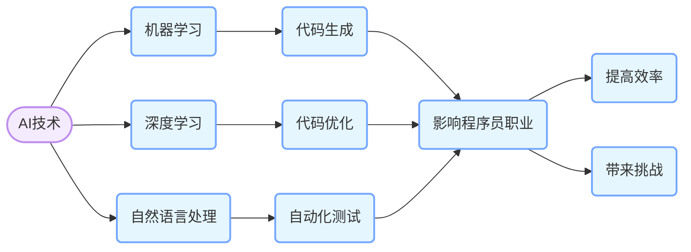

# 程序员的职业焦虑：如何应对AI带来的挑战？

> 关键词：程序员、职业焦虑、AI挑战、应对策略、技术转型、职业发展、技能提升

> 摘要：随着人工智能（AI）技术的飞速发展，程序员群体面临着前所未有的职业焦虑。AI在代码生成、自动化测试等多个领域展现出强大的能力，这让程序员担忧自己的工作是否会被取代。本文旨在深入探讨程序员面临的AI挑战，剖析焦虑产生的根源，详细阐述核心概念与联系，介绍相关算法原理及操作步骤，通过数学模型分析其影响，结合项目实战案例给出具体应对措施，探讨实际应用场景，推荐学习资源、开发工具及相关论文著作，最后总结未来发展趋势与挑战，并提供常见问题解答和参考资料，帮助程序员有效应对AI带来的挑战，实现职业的可持续发展。

## 1. 背景介绍 
### 1.1 目的和范围
本文章的目的在于全面分析AI给程序员带来的挑战以及由此产生的职业焦虑，并为程序员提供切实可行的应对策略。范围涵盖了AI对程序员职业的各个方面的影响，包括但不限于工作内容、技能需求、职业发展路径等，同时探讨了从技术层面到职业规划层面的应对方法。

### 1.2 预期读者
本文预期读者主要为广大程序员群体，包括初入职场的新手程序员、有一定经验的中级程序员以及资深的高级程序员。同时，对于关注IT行业发展、对程序员职业发展感兴趣的相关人员，如技术管理者、行业研究者等也具有一定的参考价值。

### 1.3 文档结构概述
本文将按照以下结构展开：首先介绍背景信息，包括目的、预期读者和文档结构概述等；接着阐述核心概念与联系，帮助读者理解AI与程序员职业的相关原理和关系；然后详细讲解核心算法原理及具体操作步骤，并通过数学模型进行分析；之后通过项目实战案例展示应对AI挑战的具体方法；再探讨AI在实际应用场景中的影响；推荐相关的学习资源、开发工具和论文著作；最后总结未来发展趋势与挑战，提供常见问题解答和参考资料。

### 1.4 术语表
#### 1.4.1 核心术语定义
- **人工智能（AI）**：是一门研究如何使计算机能够模拟人类智能的学科，包括机器学习、深度学习、自然语言处理等多个领域，旨在让计算机能够像人类一样感知、学习、推理和决策。
- **程序员**：是指从事程序开发、维护的专业人员，通过编写代码来实现各种软件系统的功能。
- **职业焦虑**：是指个体在职业发展过程中，由于面临各种不确定性和压力而产生的担忧、不安等负面情绪。

#### 1.4.2 相关概念解释
- **代码生成AI**：是一种基于人工智能技术的工具，能够根据用户的需求自动生成代码。它通常利用机器学习算法对大量的代码数据进行学习，从而掌握代码的语法结构和逻辑模式，实现代码的自动生成。
- **自动化测试**：是指使用软件工具来自动执行测试用例，验证软件系统是否满足规定的需求。自动化测试可以提高测试效率，减少人为错误。

#### 1.4.3 缩略词列表
- **AI**：Artificial Intelligence（人工智能）
- **ML**：Machine Learning（机器学习）
- **DL**：Deep Learning（深度学习）
- **NLP**：Natural Language Processing（自然语言处理）

## 2. 核心概念与联系 

### 2.1 AI与程序员职业的核心概念
AI作为一种新兴的技术，其核心在于模拟人类的智能行为。它通过机器学习、深度学习等算法，让计算机能够从大量的数据中学习规律，从而实现对未知数据的预测和决策。在软件开发领域，AI的应用主要体现在代码生成、代码优化、自动化测试等方面。

程序员的主要职责是编写、调试和维护代码，实现软件系统的各种功能。他们需要具备扎实的编程基础、良好的逻辑思维能力和解决问题的能力。

### 2.2 两者之间的联系
AI的发展对程序员的职业产生了深远的影响。一方面，AI技术可以辅助程序员提高工作效率，例如代码生成工具可以快速生成一些基础的代码框架，减少程序员的重复劳动；自动化测试工具可以快速发现代码中的缺陷，提高软件质量。另一方面，AI的发展也给程序员带来了挑战，例如一些简单的编程任务可能会被AI自动完成，这可能导致部分程序员的工作岗位受到威胁。

### 2.3 文本示意图
AI与程序员职业的关系可以用以下示意图表示：

AI技术（机器学习、深度学习、自然语言处理等） -> 应用于软件开发（代码生成、代码优化、自动化测试等） -> 影响程序员职业（提高效率、带来挑战）

### 2.4 Mermaid流程图


## 3. 核心算法原理 & 具体操作步骤 

### 3.1 代码生成AI的算法原理
代码生成AI通常基于深度学习中的循环神经网络（RNN）或其变体，如长短期记忆网络（LSTM）和门控循环单元（GRU）。这些网络能够处理序列数据，对于代码这种具有一定顺序和结构的文本数据非常适用。

下面是一个简单的基于LSTM的代码生成AI的Python实现示例：

```python
import numpy as np
import tensorflow as tf
from tensorflow.keras.models import Sequential
from tensorflow.keras.layers import LSTM, Dense

# 假设我们有一些代码数据
code_data = "print('Hello, World!')\nif True:\n    print('This is a test.')"
# 构建字符映射表
chars = sorted(list(set(code_data)))
char_to_idx = {char: idx for idx, char in enumerate(chars)}
idx_to_char = {idx: char for idx, char in enumerate(chars)}

# 准备训练数据
sequence_length = 10
input_sequences = []
target_sequences = []
for i in range(len(code_data) - sequence_length):
    input_seq = code_data[i:i + sequence_length]
    target_seq = code_data[i + sequence_length]
    input_sequences.append([char_to_idx[char] for char in input_seq])
    target_sequences.append(char_to_idx[target_seq])

input_sequences = np.array(input_sequences)
target_sequences = np.array(target_sequences)

# 构建LSTM模型
model = Sequential()
model.add(LSTM(128, input_shape=(sequence_length, 1)))
model.add(Dense(len(chars), activation='softmax'))

# 编译模型
model.compile(loss='sparse_categorical_crossentropy', optimizer='adam')

# 训练模型
model.fit(input_sequences.reshape(-1, sequence_length, 1), target_sequences, epochs=100)

# 生成代码
start_sequence = code_data[:sequence_length]
generated_code = start_sequence
for _ in range(100):
    input_seq = np.array([[char_to_idx[char] for char in start_sequence]])
    input_seq = input_seq.reshape(-1, sequence_length, 1)
    predicted_idx = np.argmax(model.predict(input_seq))
    predicted_char = idx_to_char[predicted_idx]
    generated_code += predicted_char
    start_sequence = start_sequence[1:] + predicted_char

print(generated_code)
```

### 3.2 具体操作步骤
1. **数据准备**：收集大量的代码数据，并进行预处理，包括去除噪声、分词等操作。
2. **构建字符映射表**：将代码中的每个字符映射为一个整数，方便模型处理。
3. **准备训练数据**：将代码数据划分为输入序列和目标序列，输入序列是一段长度固定的代码，目标序列是输入序列后面的一个字符。
4. **构建模型**：使用LSTM或其他适合处理序列数据的模型，定义模型的结构和参数。
5. **编译模型**：选择合适的损失函数和优化器，对模型进行编译。
6. **训练模型**：将准备好的训练数据输入到模型中，进行训练。
7. **生成代码**：选择一个起始序列，使用训练好的模型预测下一个字符，不断重复这个过程，直到生成足够长的代码。

## 4. 数学模型和公式 & 详细讲解 & 举例说明 

### 4.1 损失函数
在代码生成AI中，常用的损失函数是交叉熵损失函数。交叉熵损失函数用于衡量模型预测的概率分布与真实概率分布之间的差异。对于多分类问题，交叉熵损失函数的公式为：

$$L = -\sum_{i=1}^{C} y_i \log(p_i)$$

其中，$C$ 是类别数，$y_i$ 是真实标签的第 $i$ 个分量（通常为0或1），$p_i$ 是模型预测的第 $i$ 个类别的概率。

### 4.2 详细讲解
交叉熵损失函数的原理是，当模型预测的概率分布与真实概率分布越接近时，损失函数的值越小；反之，损失函数的值越大。在训练模型时，我们的目标是最小化损失函数，从而使模型的预测结果尽可能接近真实结果。

### 4.3 举例说明
假设我们有一个三分类问题，真实标签为 $y = [1, 0, 0]$，模型预测的概率分布为 $p = [0.8, 0.1, 0.1]$。则交叉熵损失函数的值为：

$$L = -(1 \times \log(0.8) + 0 \times \log(0.1) + 0 \times \log(0.1)) \approx 0.223$$

如果模型预测的概率分布为 $p = [0.2, 0.4, 0.4]$，则交叉熵损失函数的值为：

$$L = -(1 \times \log(0.2) + 0 \times \log(0.4) + 0 \times \log(0.4)) \approx 1.609$$

可以看到，当模型预测的概率分布与真实概率分布越接近时，损失函数的值越小。

## 5. 项目实战：代码实际案例和详细解释说明 

### 5.1  开发环境搭建
1. **安装Python**：从Python官方网站（https://www.python.org/downloads/）下载并安装Python 3.x版本。
2. **安装深度学习框架**：推荐使用TensorFlow或PyTorch。可以使用pip命令进行安装，例如：
```sh
pip install tensorflow
```
3. **安装其他依赖库**：根据项目需求，安装其他必要的依赖库，如numpy、matplotlib等。

### 5.2  源代码详细实现和代码解读
下面是一个使用Python和TensorFlow实现的简单的图像分类项目示例：

```python
import tensorflow as tf
from tensorflow.keras.datasets import mnist
from tensorflow.keras.models import Sequential
from tensorflow.keras.layers import Flatten, Dense

# 加载MNIST数据集
(train_images, train_labels), (test_images, test_labels) = mnist.load_data()

# 数据预处理
train_images = train_images / 255.0
test_images = test_images / 255.0

# 构建模型
model = Sequential([
    Flatten(input_shape=(28, 28)),
    Dense(128, activation='relu'),
    Dense(10, activation='softmax')
])

# 编译模型
model.compile(optimizer='adam',
              loss='sparse_categorical_crossentropy',
              metrics=['accuracy'])

# 训练模型
model.fit(train_images, train_labels, epochs=5)

# 评估模型
test_loss, test_acc = model.evaluate(test_images, test_labels)
print(f"Test accuracy: {test_acc}")
```

### 5.3  代码解读与分析
1. **数据加载**：使用`mnist.load_data()`函数加载MNIST数据集，该数据集包含手写数字图像和对应的标签。
2. **数据预处理**：将图像数据的像素值归一化到0到1之间，这有助于模型的训练。
3. **模型构建**：使用`Sequential`模型构建一个简单的神经网络，包含一个Flatten层、一个全连接层和一个输出层。
4. **模型编译**：选择`adam`优化器和`sparse_categorical_crossentropy`损失函数，同时设置评估指标为准确率。
5. **模型训练**：使用`fit`方法对模型进行训练，指定训练数据和训练轮数。
6. **模型评估**：使用`evaluate`方法对模型进行评估，计算测试集上的损失和准确率。

## 6. 实际应用场景 
### 6.1 代码生成
AI代码生成工具可以帮助程序员快速生成一些基础的代码框架，例如函数定义、类结构等。这可以减少程序员的重复劳动，提高开发效率。

### 6.2 代码优化
AI可以分析代码的性能瓶颈，并提供优化建议。例如，通过分析代码的时间复杂度和空间复杂度，AI可以建议使用更高效的算法或数据结构。

### 6.3 自动化测试
AI可以自动生成测试用例，并执行测试任务。这可以提高测试效率，减少人为错误。

### 6.4 智能辅助编程
AI可以作为智能助手，帮助程序员解决编程过程中遇到的问题。例如，当程序员输入一段代码时，AI可以提供相关的代码示例、错误提示和解决方案。

## 7. 工具和资源推荐
### 7.1 学习资源推荐
#### 7.1.1 书籍推荐
- 《深度学习》（Deep Learning）：由Ian Goodfellow、Yoshua Bengio和Aaron Courville合著，是深度学习领域的经典教材。
- 《Python深度学习》（Deep Learning with Python）：由Francois Chollet编写，介绍了如何使用Python和Keras进行深度学习开发。
- 《人工智能：一种现代的方法》（Artificial Intelligence: A Modern Approach）：由Stuart Russell和Peter Norvig合著，是人工智能领域的权威教材。

#### 7.1.2 在线课程
- Coursera上的“深度学习专项课程”（Deep Learning Specialization）：由Andrew Ng教授授课，涵盖了深度学习的各个方面。
- edX上的“人工智能基础”（Fundamentals of Artificial Intelligence）：介绍了人工智能的基本概念和算法。
- Udemy上的“Python编程入门”（Python Programming for Beginners）：适合初学者学习Python编程。

#### 7.1.3 技术博客和网站
- Medium：是一个技术博客平台，有很多关于AI和编程的优质文章。
- Towards Data Science：专注于数据科学和机器学习领域的技术博客。
- Stack Overflow：是一个程序员社区，提供了大量的编程问题解决方案。

### 7.2 开发工具框架推荐
#### 7.2.1 IDE和编辑器
- PyCharm：是一款专门为Python开发设计的集成开发环境，具有强大的代码编辑、调试和代码分析功能。
- Visual Studio Code：是一款轻量级的代码编辑器，支持多种编程语言，并且有丰富的插件生态系统。
- Jupyter Notebook：是一个交互式的开发环境，适合进行数据探索和模型训练。

#### 7.2.2 调试和性能分析工具
- PDB：是Python自带的调试器，可以帮助程序员定位代码中的错误。
- TensorBoard：是TensorFlow的可视化工具，可以帮助程序员分析模型的训练过程和性能。
- cProfile：是Python的性能分析工具，可以帮助程序员找出代码中的性能瓶颈。

#### 7.2.3 相关框架和库
- TensorFlow：是一个开源的深度学习框架，广泛应用于图像识别、自然语言处理等领域。
- PyTorch：是另一个流行的深度学习框架，具有动态图和易于使用的特点。
- Scikit-learn：是一个机器学习库，提供了丰富的机器学习算法和工具。

### 7.3 相关论文著作推荐
#### 7.3.1 经典论文
- “Gradient-Based Learning Applied to Document Recognition”：由Yann LeCun等人发表，介绍了卷积神经网络（CNN）在手写数字识别中的应用。
- “Attention Is All You Need”：由Ashish Vaswani等人发表，提出了Transformer架构，是自然语言处理领域的重要突破。
- “Generative Adversarial Nets”：由Ian Goodfellow等人发表，介绍了生成对抗网络（GAN）的基本原理和应用。

#### 7.3.2 最新研究成果
- 关注顶级学术会议，如NeurIPS、ICML、CVPR等，这些会议上会发表很多关于AI的最新研究成果。
- 阅读知名学术期刊，如Journal of Artificial Intelligence Research（JAIR）、Artificial Intelligence等。

#### 7.3.3 应用案例分析
- 一些知名科技公司的博客，如Google AI Blog、Facebook AI Research等，会分享他们在AI领域的应用案例和实践经验。
- 行业报告和白皮书，如麦肯锡、Gartner等机构发布的关于AI应用的报告。

## 8. 总结：未来发展趋势与挑战
### 8.1 未来发展趋势
- **AI与编程的深度融合**：未来，AI将更加深入地融入到编程的各个环节，从代码生成到代码优化，再到软件测试和维护，都将离不开AI的支持。
- **低代码和无代码开发**：随着AI技术的发展，低代码和无代码开发平台将越来越普及，这将降低编程的门槛，让更多的人能够参与到软件开发中来。
- **智能编程助手的普及**：智能编程助手将成为程序员的得力助手，帮助他们更高效地编写代码、解决问题。

### 8.2 挑战
- **技能更新压力**：程序员需要不断学习新的技术和知识，以适应AI时代的发展。这对程序员的学习能力和自我提升能力提出了更高的要求。
- **职业竞争加剧**：随着AI技术的普及，编程工作的门槛可能会降低，这将导致职业竞争加剧。程序员需要不断提升自己的核心竞争力，才能在激烈的竞争中脱颖而出。
- **伦理和法律问题**：AI的发展也带来了一系列伦理和法律问题，如数据隐私、算法偏见等。程序员需要关注这些问题，并在开发过程中遵守相关的伦理和法律规范。

## 9. 附录：常见问题与解答
### 9.1 AI会完全取代程序员吗？
不会。虽然AI在某些方面可以辅助程序员提高工作效率，但编程不仅仅是代码的编写，还涉及到需求分析、系统设计、架构规划等多个环节，这些都需要程序员的专业知识和经验。此外，程序员还需要具备创造力、沟通能力和团队协作能力等软技能，这些都是AI无法替代的。

### 9.2 程序员应该如何应对AI带来的挑战？
程序员可以从以下几个方面应对AI带来的挑战：
- **学习新技能**：不断学习AI相关的技术和知识，如机器学习、深度学习等，提升自己的技术水平。
- **培养软技能**：注重培养自己的沟通能力、团队协作能力和创造力等软技能，提高自己的综合素质。
- **关注行业动态**：及时了解行业的最新发展趋势和技术动态，调整自己的职业规划。
- **参与开源项目**：通过参与开源项目，积累实践经验，拓展人脉资源。

### 9.3 低代码和无代码开发平台会对程序员产生什么影响？
低代码和无代码开发平台可以降低编程的门槛，让更多的人能够参与到软件开发中来。对于一些简单的应用开发，低代码和无代码开发平台可以提高开发效率。但对于复杂的、定制化的软件开发，仍然需要程序员的专业知识和技能。因此，低代码和无代码开发平台不会完全取代程序员，而是会促使程序员向更高层次的技术方向发展。

## 10. 扩展阅读 & 参考资料
### 10.1 扩展阅读
- 《创新者的窘境》（The Innovator's Dilemma）：由Clayton Christensen著，探讨了技术创新对企业和行业的影响。
- 《人类简史：从动物到上帝》（Sapiens: A Brief History of Humankind）：由Yuval Noah Harari著，从人类历史的角度探讨了技术发展对人类社会的影响。

### 10.2 参考资料
- 相关的学术论文和研究报告，如IEEE、ACM等学术组织发表的论文。
- 行业资讯网站和博客，如TechCrunch、The Verge等。
- 编程语言和框架的官方文档，如Python官方文档、TensorFlow官方文档等。