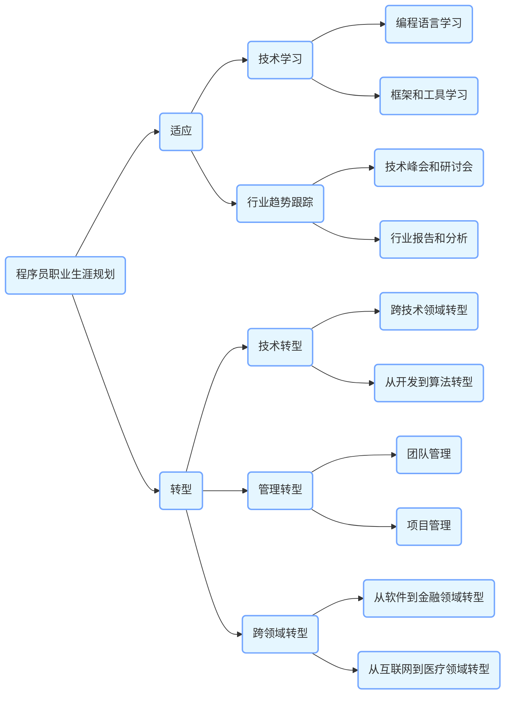

# 程序员的职业生涯规划：适应与转型

> 关键词：程序员、职业生涯规划、适应、转型、技术发展

> 摘要：本文围绕程序员的职业生涯规划展开，重点探讨适应与转型这两个关键方面。通过分析程序员职业发展的背景，阐述核心概念及联系，深入讲解相关算法原理和操作步骤，运用数学模型进行分析，结合实际项目案例，介绍实际应用场景，推荐学习工具和资源，最后总结未来发展趋势与挑战，并提供常见问题解答和扩展阅读资料。旨在帮助程序员更好地规划自己的职业生涯，应对不断变化的技术环境和市场需求。

## 1. 背景介绍 
### 1.1 目的和范围
随着信息技术的飞速发展，软件行业呈现出日新月异的变化。程序员作为软件行业的核心力量，其职业生涯面临着诸多挑战和机遇。本文的目的在于为程序员提供全面、系统的职业生涯规划指导，帮助他们适应技术的快速更新和市场需求的变化，顺利实现职业转型。范围涵盖了程序员从初级到高级各个阶段的职业发展，包括技术能力提升、管理角色转变、跨领域转型等方面。

### 1.2 预期读者
本文主要面向广大程序员群体，包括初入职场的新手程序员、有一定工作经验的中级程序员以及寻求职业突破的高级程序员。同时，也可供软件企业的人力资源管理者、技术管理者以及对程序员职业发展感兴趣的相关人士参考。

### 1.3 文档结构概述
本文将按照以下结构进行阐述：首先介绍核心概念与联系，明确程序员职业生涯规划中适应与转型的具体含义和相互关系；接着讲解核心算法原理和具体操作步骤，为程序员提供实用的规划方法；然后运用数学模型和公式进行深入分析，并举例说明；通过项目实战案例，详细展示规划方法的实际应用；介绍实际应用场景，让读者了解不同阶段的职业规划策略；推荐相关的工具和资源，帮助程序员提升学习和工作效率；最后总结未来发展趋势与挑战，为程序员的职业发展提供前瞻性的指导，并提供常见问题解答和扩展阅读资料。

### 1.4 术语表
#### 1.4.1 核心术语定义
- **职业生涯规划**：指个人根据自身的兴趣、能力和职业目标，结合所处的社会环境和职业环境，制定的一系列职业发展计划和策略。
- **适应**：在程序员职业生涯中，适应主要指程序员能够跟上技术发展的步伐，不断学习和掌握新的技术知识和技能，以满足工作的需求。
- **转型**：指程序员从一种职业状态转变为另一种职业状态，包括技术方向的转型、管理角色的转型、跨领域的转型等。

#### 1.4.2 相关概念解释
- **技术栈**：指程序员在开发过程中所使用的一系列技术工具和框架的集合，如前端开发中的 HTML、CSS、JavaScript 等，后端开发中的 Python、Java、Node.js 等。
- **职业锚**：是指个人在职业发展过程中所形成的一种稳定的职业定位和价值观，它决定了个人对职业的选择和追求。

#### 1.4.3 缩略词列表
- **AI**：Artificial Intelligence，人工智能
- **ML**：Machine Learning，机器学习
- **DL**：Deep Learning，深度学习
- **DevOps**：Development and Operations，开发与运维一体化

## 2. 核心概念与联系 

### 核心概念原理
程序员的职业生涯规划可以看作是一个动态的过程，其中适应和转型是两个关键的环节。适应是基础，它要求程序员不断学习和更新自己的知识和技能，以适应技术的发展和市场的需求。转型则是在适应的基础上，根据自身的职业目标和发展需求，对职业方向进行调整和转变。

适应的原理在于不断学习和积累知识，通过参加培训、阅读技术书籍和文章、参与开源项目等方式，保持对新技术的敏感度和学习能力。转型的原理则是基于对自身优势和劣势的分析，结合市场趋势和行业需求，选择合适的转型方向，并制定相应的转型计划。

### 架构的文本示意图
```plaintext
程序员职业生涯规划
|-- 适应
|   |-- 技术学习
|   |   |-- 编程语言学习
|   |   |-- 框架和工具学习
|   |-- 行业趋势跟踪
|   |   |-- 技术峰会和研讨会
|   |   |-- 行业报告和分析
|-- 转型
|   |-- 技术转型
|   |   |-- 跨技术领域转型
|   |   |-- 从开发到算法转型
|   |-- 管理转型
|   |   |-- 团队管理
|   |   |-- 项目管理
|   |-- 跨领域转型
|   |   |-- 从软件到金融领域转型
|   |   |-- 从互联网到医疗领域转型
```

### Mermaid 流程图


## 3. 核心算法原理 & 具体操作步骤 

### 核心算法原理
我们可以将程序员的职业生涯规划看作是一个优化问题，目标是最大化职业满意度和职业发展前景。为了实现这个目标，我们需要考虑多个因素，如技术能力、市场需求、个人兴趣等。

可以使用以下公式来表示职业满意度 $S$：

$S = w_1 \times T + w_2 \times M + w_3 \times I$

其中，$T$ 表示技术能力得分，$M$ 表示市场需求得分，$I$ 表示个人兴趣得分，$w_1$、$w_2$、$w_3$ 分别是这三个因素的权重，且 $w_1 + w_2 + w_3 = 1$。

### 具体操作步骤
#### 步骤 1：自我评估
使用 Python 代码实现自我评估，计算技术能力得分、市场需求得分和个人兴趣得分。

```python
# 技术能力得分
def technical_ability_score():
    # 假设这里根据掌握的编程语言数量和熟练度进行评分
    programming_languages = ['Python', 'Java', 'C++']
    proficiency = [8, 7, 6]  # 熟练度评分，满分 10 分
    score = sum(proficiency) / len(programming_languages)
    return score

# 市场需求得分
def market_demand_score():
    # 假设这里根据热门技术的市场需求进行评分
    hot_technologies = ['AI', 'ML', 'DL']
    known_technologies = ['AI']
    score = len(known_technologies) / len(hot_technologies) * 10
    return score

# 个人兴趣得分
def personal_interest_score():
    # 假设这里根据个人对不同技术方向的兴趣程度进行评分
    interests = {'Web Development': 7, 'Data Science': 8, 'Mobile Development': 6}
    max_score = max(interests.values())
    return max_score

# 计算综合得分
w1 = 0.4
w2 = 0.3
w3 = 0.3
T = technical_ability_score()
M = market_demand_score()
I = personal_interest_score()
S = w1 * T + w2 * M + w3 * I

print(f"技术能力得分: {T}")
print(f"市场需求得分: {M}")
print(f"个人兴趣得分: {I}")
print(f"综合得分: {S}")
```

#### 步骤 2：制定目标
根据综合得分和个人情况，制定短期和长期职业目标。例如，如果综合得分较高且对某个技术方向有浓厚兴趣，可以设定在该方向深入发展的目标；如果综合得分较低，可以设定提升技术能力和了解市场需求的目标。

#### 步骤 3：制定计划
根据目标制定具体的行动计划，包括学习计划、项目实践计划等。例如，如果目标是提升 Python 编程能力，可以制定每周学习一定时间的 Python 课程、完成相关项目的计划。

#### 步骤 4：执行和调整
按照计划执行，并定期进行评估和调整。如果发现某个计划不适合自己或市场情况发生变化，及时调整计划。

## 4. 数学模型和公式 & 详细讲解 & 举例说明 

### 数学模型
在程序员的职业生涯规划中，我们可以使用马尔可夫决策过程（MDP）来描述职业状态的转移和决策过程。马尔可夫决策过程由状态集合 $S$、动作集合 $A$、状态转移概率 $P(s'|s,a)$、奖励函数 $R(s,a)$ 组成。

状态 $s \in S$ 表示程序员在职业生涯中的不同状态，如初级程序员、中级程序员、高级程序员等。动作 $a \in A$ 表示程序员可以采取的决策，如学习新技术、参与项目、转型等。状态转移概率 $P(s'|s,a)$ 表示在状态 $s$ 采取动作 $a$ 后转移到状态 $s'$ 的概率。奖励函数 $R(s,a)$ 表示在状态 $s$ 采取动作 $a$ 所获得的奖励。

### 公式
程序员的目标是最大化长期累积奖励，即：

$V(s) = \max_{a \in A} \sum_{s' \in S} P(s'|s,a) [R(s,a) + \gamma V(s')]$

其中，$V(s)$ 表示状态 $s$ 的价值，$\gamma$ 是折扣因子，用于平衡短期和长期奖励。

### 详细讲解
这个公式的含义是，在每个状态 $s$ 下，程序员选择一个动作 $a$ 使得长期累积奖励最大。长期累积奖励包括当前动作的奖励 $R(s,a)$ 和未来状态的价值 $V(s')$ 的加权和，折扣因子 $\gamma$ 表示对未来奖励的重视程度。

### 举例说明
假设程序员处于初级程序员状态 $s_1$，可以采取的动作有学习新技术 $a_1$ 和参与项目 $a_2$。学习新技术后有 70% 的概率转移到中级程序员状态 $s_2$，30% 的概率仍然处于初级程序员状态 $s_1$；参与项目后有 60% 的概率转移到中级程序员状态 $s_2$，40% 的概率仍然处于初级程序员状态 $s_1$。学习新技术的奖励为 5，参与项目的奖励为 3。折扣因子 $\gamma = 0.9$。

中级程序员状态 $s_2$ 的价值 $V(s_2) = 10$，初级程序员状态 $s_1$ 的价值 $V(s_1)$ 可以通过以下计算得到：

对于动作 $a_1$：

$\sum_{s' \in S} P(s'|s_1,a_1) [R(s_1,a_1) + \gamma V(s')] = 0.7 \times (5 + 0.9 \times 10) + 0.3 \times (5 + 0.9 \times V(s_1))$

对于动作 $a_2$：

$\sum_{s' \in S} P(s'|s_1,a_2) [R(s_1,a_2) + \gamma V(s')] = 0.6 \times (3 + 0.9 \times 10) + 0.4 \times (3 + 0.9 \times V(s_1))$

通过比较这两个值，选择使得值最大的动作，即为当前状态下的最优决策。

## 5. 项目实战：代码实际案例和详细解释说明 

### 5.1  开发环境搭建
假设我们要开发一个简单的职业规划工具，使用 Python 和 Flask 框架。以下是开发环境搭建的步骤：

#### 步骤 1：安装 Python
从 Python 官方网站（https://www.python.org/downloads/）下载并安装 Python 3.x 版本。

#### 步骤 2：创建虚拟环境
打开命令行工具，进入项目目录，执行以下命令创建虚拟环境：

```bash
python -m venv venv
```

#### 步骤 3：激活虚拟环境
在 Windows 上，执行以下命令激活虚拟环境：

```bash
venv\Scripts\activate
```

在 Linux 或 macOS 上，执行以下命令激活虚拟环境：

```bash
source venv/bin/activate
```

#### 步骤 4：安装 Flask
在激活的虚拟环境中，执行以下命令安装 Flask：

```bash
pip install flask
```

### 5.2  源代码详细实现和代码解读
以下是一个简单的 Flask 应用，用于实现职业规划工具的基本功能：

```python
from flask import Flask, request, jsonify

app = Flask(__name__)

# 技术能力得分
def technical_ability_score(programming_languages, proficiency):
    score = sum(proficiency) / len(programming_languages)
    return score

# 市场需求得分
def market_demand_score(hot_technologies, known_technologies):
    score = len(known_technologies) / len(hot_technologies) * 10
    return score

# 个人兴趣得分
def personal_interest_score(interests):
    max_score = max(interests.values())
    return max_score

# 计算综合得分
def calculate_score(programming_languages, proficiency, hot_technologies, known_technologies, interests):
    w1 = 0.4
    w2 = 0.3
    w3 = 0.3
    T = technical_ability_score(programming_languages, proficiency)
    M = market_demand_score(hot_technologies, known_technologies)
    I = personal_interest_score(interests)
    S = w1 * T + w2 * M + w3 * I
    return S

@app.route('/career-planning', methods=['POST'])
def career_planning():
    data = request.get_json()
    programming_languages = data.get('programming_languages')
    proficiency = data.get('proficiency')
    hot_technologies = data.get('hot_technologies')
    known_technologies = data.get('known_technologies')
    interests = data.get('interests')

    score = calculate_score(programming_languages, proficiency, hot_technologies, known_technologies, interests)
    result = {
        'score': score
    }
    return jsonify(result)

if __name__ == '__main__':
    app.run(debug=True)
```

### 代码解读与分析
- **技术能力得分函数**：`technical_ability_score` 函数根据程序员掌握的编程语言数量和熟练度计算技术能力得分。
- **市场需求得分函数**：`market_demand_score` 函数根据热门技术和程序员已知的技术计算市场需求得分。
- **个人兴趣得分函数**：`personal_interest_score` 函数根据程序员对不同技术方向的兴趣程度计算个人兴趣得分。
- **综合得分计算函数**：`calculate_score` 函数根据上述三个得分和权重计算综合得分。
- **Flask 路由**：`/career-planning` 路由接收用户提交的职业信息，调用 `calculate_score` 函数计算综合得分，并返回结果。

## 6. 实际应用场景 
### 初级程序员
初级程序员通常处于职业生涯的起步阶段，主要任务是学习基础知识和提升技术能力。在这个阶段，适应的重点是掌握编程语言和常用的开发工具，了解软件开发的基本流程。可以通过参加培训课程、阅读技术书籍和文章、参与开源项目等方式来提升自己。

如果初级程序员发现自己对某个特定领域有浓厚兴趣，如人工智能、移动开发等，可以考虑在这个领域进行深入学习和实践，为未来的转型做好准备。

### 中级程序员
中级程序员已经具备了一定的技术能力和项目经验，此时适应的重点是跟上技术发展的步伐，学习新的框架和工具，提升自己的解决问题的能力。可以通过参加技术峰会、研讨会等活动，了解行业最新动态。

转型方面，中级程序员可以考虑向技术专家、技术主管或项目经理等方向转型。如果想成为技术专家，需要在某个技术领域深入研究，发表技术文章和开源项目；如果想成为技术主管或项目经理，需要学习团队管理和项目管理知识。

### 高级程序员
高级程序员通常在技术领域有深厚的造诣，适应的重点是关注行业趋势和技术创新，参与技术标准的制定和技术方案的设计。

转型方面，高级程序员可以向技术总监、CTO 等管理角色转型，或者跨领域转型到金融、医疗等行业。跨领域转型需要学习相关行业的业务知识和法律法规，同时结合自己的技术优势，为行业带来创新解决方案。

## 7. 工具和资源推荐
### 7.1 学习资源推荐
#### 7.1.1 书籍推荐
- 《代码大全》：这本书是软件开发的经典之作，涵盖了软件开发的各个方面，包括代码设计、编码规范、测试等，对于提升程序员的编程能力和软件质量有很大帮助。
- 《算法导论》：是算法领域的权威书籍，介绍了各种经典算法和数据结构，对于想深入学习算法的程序员来说是必备的参考书。
- 《Python 数据分析实战》：适合想学习 Python 数据分析的程序员，通过实际案例介绍了 Python 在数据分析领域的应用。

#### 7.1.2 在线课程
- Coursera：提供了大量的计算机科学和编程相关的在线课程，包括人工智能、机器学习、数据分析等领域，课程由全球知名高校和机构的教授授课。
- edX：也是一个知名的在线学习平台，提供了丰富的技术课程，如软件开发、网络安全等。
- 慕课网：国内知名的在线编程学习平台，提供了各种编程语言和框架的课程，适合初学者和有一定基础的程序员。

#### 7.1.3 技术博客和网站
- Medium：是一个开放的写作平台，有很多技术专家和开发者在上面分享自己的经验和见解，涵盖了各种技术领域。
- Stack Overflow：是程序员的问答社区，当遇到编程问题时，可以在上面搜索解决方案，也可以向其他开发者请教。
- InfoQ：提供了最新的技术资讯和行业动态，对于了解技术趋势和行业发展有很大帮助。

### 7.2 开发工具框架推荐
#### 7.2.1 IDE和编辑器
- Visual Studio Code：是一款轻量级的代码编辑器，支持多种编程语言和框架，具有丰富的插件生态系统，方便程序员进行开发。
- PyCharm：是专门为 Python 开发设计的集成开发环境，提供了代码自动补全、调试、版本控制等功能，提高了 Python 开发的效率。
- IntelliJ IDEA：是一款功能强大的 Java 集成开发环境，广泛应用于 Java 开发领域，支持多种框架和插件。

#### 7.2.2 调试和性能分析工具
- Chrome DevTools：是 Chrome 浏览器自带的调试工具，可用于调试前端代码，包括 HTML、CSS、JavaScript 等，还可以进行性能分析和网络监测。
- Py-Spy：是一个 Python 性能分析工具，可以实时监测 Python 程序的性能，找出性能瓶颈。
- VisualVM：是一个 Java 性能分析工具，可用于监测 Java 应用程序的内存使用、线程状态等，帮助开发者优化 Java 程序的性能。

#### 7.2.3 相关框架和库
- Django：是一个高级 Python Web 框架，提供了丰富的功能和工具，如数据库管理、用户认证、表单处理等，适合快速开发 Web 应用。
- React：是一个用于构建用户界面的 JavaScript 库，由 Facebook 开发，具有高效、灵活的特点，广泛应用于前端开发领域。
- TensorFlow：是一个开源的机器学习框架，由 Google 开发，提供了丰富的机器学习算法和工具，可用于开发人工智能和机器学习应用。

### 7.3 相关论文著作推荐
#### 7.3.1 经典论文
- 《A Mathematical Theory of Communication》：香农的这篇论文奠定了信息论的基础，对于理解信息的传输和处理有重要意义。
- 《The Structure of Scientific Revolutions》：虽然不是专门的技术论文，但对于理解技术发展的规律和范式转换有很大帮助。
- 《The Cathedral and the Bazaar》：探讨了开源软件的开发模式，对于理解开源社区和开源项目的运作有重要启示。

#### 7.3.2 最新研究成果
- arXiv：是一个预印本平台，提供了大量的最新研究成果，包括计算机科学、物理学、数学等领域的论文。
- ACM Digital Library：是计算机协会的数字图书馆，收录了计算机科学领域的各种研究论文、会议记录等，是获取最新研究成果的重要来源。
- IEEE Xplore：是电气和电子工程师协会的数字图书馆，提供了电子工程、计算机科学等领域的研究论文和技术报告。

#### 7.3.3 应用案例分析
- 《Lean Software Development: An Agile Toolkit》：介绍了精益软件开发的方法和工具，通过实际案例分析了如何提高软件开发的效率和质量。
- 《Building Microservices》：探讨了微服务架构的设计和实现，通过实际案例分析了微服务架构在不同场景下的应用。
- 《Designing Data-Intensive Applications》：通过实际案例分析了数据密集型应用的设计和开发，包括数据存储、数据处理、数据传输等方面。

## 8. 总结：未来发展趋势与挑战
### 未来发展趋势
- **人工智能和机器学习的广泛应用**：随着人工智能和机器学习技术的不断发展，越来越多的领域将应用这些技术，如医疗、金融、交通等。程序员需要学习和掌握相关技术，以适应市场需求。
- **云计算和大数据的普及**：云计算和大数据技术为企业提供了更高效、更灵活的计算和存储解决方案。程序员需要了解云计算和大数据平台的使用，如 Amazon Web Services、Microsoft Azure、Google Cloud Platform 等。
- **物联网的兴起**：物联网将各种设备连接起来，实现数据的共享和交互。程序员需要学习物联网相关的技术，如传感器技术、通信协议、数据分析等。
- **低代码和无代码开发的发展**：低代码和无代码开发平台的出现，使得非专业程序员也能够开发应用程序。程序员需要关注这一趋势，学习如何使用低代码和无代码开发平台，提高开发效率。

### 挑战
- **技术更新换代快**：信息技术的发展日新月异，新的技术和框架不断涌现。程序员需要不断学习和更新自己的知识和技能，以跟上技术发展的步伐。
- **竞争激烈**：随着软件行业的发展，程序员的数量不断增加，竞争也越来越激烈。程序员需要不断提升自己的竞争力，如提高技术能力、积累项目经验、提升沟通能力等。
- **跨领域知识需求增加**：未来的软件开发需要涉及多个领域的知识，如金融、医疗、法律等。程序员需要学习相关领域的知识，以满足跨领域项目的需求。

## 9. 附录：常见问题与解答
### 问题 1：如何确定自己的职业转型方向？
解答：可以从以下几个方面考虑：个人兴趣、技术能力、市场需求。首先，明确自己对哪些领域感兴趣，兴趣是最好的老师；然后，评估自己的技术能力，选择与自己技术能力相匹配的转型方向；最后，了解市场需求，选择有发展前景的领域。

### 问题 2：转型需要多长时间？
解答：转型所需的时间因人而异，取决于转型的难度和个人的学习能力。一般来说，技术转型可能需要几个月到一年的时间，跨领域转型可能需要一年以上的时间。在转型过程中，需要制定合理的学习计划，并坚持执行。

### 问题 3：如何平衡工作和学习？
解答：可以制定合理的时间计划，将工作和学习时间分开。例如，在工作日的晚上和周末安排学习时间，保证每天有一定的学习时间。同时，要提高学习效率，选择适合自己的学习方法。

### 问题 4：转型后薪资会有提升吗？
解答：转型后薪资是否会提升取决于多个因素，如转型的方向、个人的能力和经验等。如果转型到一个有发展前景、需求旺盛的领域，并且个人能够快速适应新的工作环境和要求，薪资可能会有一定的提升。但需要注意的是，薪资提升不是转型的唯一目的，更重要的是实现职业发展和个人成长。

## 10. 扩展阅读 & 参考资料
### 扩展阅读
- 《软技能：代码之外的生存指南》：这本书介绍了程序员在职业生涯中需要具备的软技能，如沟通能力、时间管理能力、职业规划能力等。
- 《程序员修炼之道：从小工到专家》：强调了程序员在职业生涯中需要不断学习和提升自己的能力，成为一名优秀的程序员。
- 《重来》：探讨了创业和软件开发的理念和方法，对于想在职业生涯中有所突破的程序员有一定的启示。

### 参考资料
- 《计算机程序的构造和解释》
- 《算法艺术与信息学竞赛》
- 《Effective Java》
- 《Python 核心编程》
- 《JavaScript 高级程序设计》

以上文章围绕程序员的职业生涯规划展开，从多个方面进行了深入分析和探讨，希望能为程序员的职业发展提供有价值的参考。