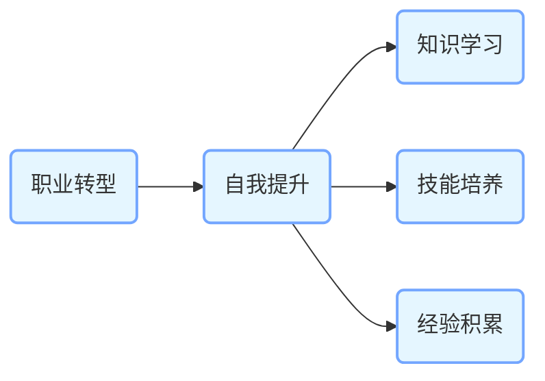

# 程序员的职业转型与自我提升

> 关键词：程序员、职业转型、自我提升、技术发展、职业规划

> 摘要：本文聚焦于程序员的职业转型与自我提升这一关键话题。随着信息技术的飞速发展，程序员面临着不断变化的技术环境和职业需求。文章深入探讨了程序员职业转型的背景、核心概念、转型所需的算法与步骤、涉及的数学模型，通过项目实战展示转型过程中的实际操作，分析实际应用场景，推荐相关的工具和资源，总结未来发展趋势与挑战，并提供常见问题解答和参考资料，旨在为程序员的职业发展提供全面且实用的指导。

## 1. 背景介绍 
### 1.1 目的和范围
在当今科技飞速发展的时代，软件行业的技术更新换代日新月异。新的编程语言、开发框架和技术理念不断涌现，这对程序员的职业发展产生了深远的影响。本文章的目的在于为广大程序员提供全面且深入的职业转型与自我提升的指导，帮助他们更好地适应技术变革和市场需求。

文章的范围涵盖了程序员职业转型的各个方面，包括转型的原因、转型的方向、所需的技能和知识、转型过程中的步骤和方法，以及自我提升的途径和策略。同时，还会结合实际案例和数学模型进行分析，使读者能够更加直观地理解和应用相关的理论和方法。

### 1.2 预期读者
本文的预期读者主要是广大程序员群体，包括初入职场的新手程序员、有一定工作经验的中级程序员以及资深的高级程序员。无论是希望在现有技术领域深入发展的程序员，还是考虑向其他领域转型的程序员，都能从本文中获得有价值的信息和启示。此外，对于关注软件行业发展和程序员职业发展的相关人士，如人力资源管理者、行业分析师等，本文也具有一定的参考价值。

### 1.3 文档结构概述
本文将按照以下结构进行阐述：
1. **背景介绍**：介绍文章的目的、范围、预期读者和文档结构概述，以及相关术语的定义和解释。
2. **核心概念与联系**：阐述程序员职业转型和自我提升的核心概念，以及它们之间的联系，并通过文本示意图和 Mermaid 流程图进行展示。
3. **核心算法原理 & 具体操作步骤**：介绍程序员职业转型和自我提升的核心算法原理，并使用 Python 源代码详细阐述具体操作步骤。
4. **数学模型和公式 & 详细讲解 & 举例说明**：引入相关的数学模型和公式，详细讲解其原理，并通过具体例子进行说明。
5. **项目实战：代码实际案例和详细解释说明**：通过实际项目案例，展示程序员职业转型和自我提升的具体实现过程，并对代码进行详细解读和分析。
6. **实际应用场景**：分析程序员职业转型和自我提升在不同实际场景中的应用。
7. **工具和资源推荐**：推荐学习资源、开发工具框架和相关论文著作，帮助程序员更好地进行职业转型和自我提升。
8. **总结：未来发展趋势与挑战**：总结程序员职业转型和自我提升的未来发展趋势，并分析面临的挑战。
9. **附录：常见问题与解答**：解答程序员在职业转型和自我提升过程中常见的问题。
10. **扩展阅读 & 参考资料**：提供相关的扩展阅读材料和参考资料，供读者进一步深入学习。

### 1.4 术语表
#### 1.4.1 核心术语定义
- **职业转型**：指程序员从一种技术领域、工作角色或职业方向转换到另一种的过程。例如，从传统的 Web 开发转型到人工智能领域的开发。
- **自我提升**：程序员通过学习新知识、掌握新技能、积累经验等方式，不断提高自己的专业能力和综合素质。
- **技术栈**：指程序员在开发过程中所使用的一系列技术和工具的集合，包括编程语言、开发框架、数据库等。

#### 1.4.2 相关概念解释
- **技术迭代**：随着科技的发展，软件行业的技术不断更新和演进，新的技术不断涌现，旧的技术逐渐被淘汰。程序员需要不断学习和适应技术迭代，以保持自己的竞争力。
- **职业发展路径**：指程序员在职业生涯中可能经历的不同阶段和方向，包括技术专家、技术管理、产品管理等。不同的职业发展路径需要不同的技能和知识。

#### 1.4.3 缩略词列表
- **AI**：Artificial Intelligence，人工智能
- **ML**：Machine Learning，机器学习
- **DL**：Deep Learning，深度学习
- **Web**：World Wide Web，万维网

## 2. 核心概念与联系 

### 核心概念原理
程序员的职业转型和自我提升是紧密相关的两个概念。职业转型是指程序员在职业生涯中，由于各种原因，从一个技术领域、工作角色或职业方向转换到另一个领域、角色或方向的过程。职业转型可能是由于个人兴趣的变化、市场需求的变化、技术发展的趋势等因素引起的。

自我提升则是指程序员通过不断学习新知识、掌握新技能、积累经验等方式，提高自己的专业能力和综合素质。自我提升是职业转型的基础，只有不断提升自己的能力，才能更好地适应职业转型的需求。同时，职业转型也为自我提升提供了新的机会和挑战，促使程序员不断学习和成长。

### 架构的文本示意图
```plaintext
           职业转型
              |
              |  依赖于
              |
       自我提升
              |
              |  包含
              |
    知识学习  -  技能培养  -  经验积累
```

### Mermaid 流程图


## 3. 核心算法原理 & 具体操作步骤 

### 核心算法原理
我们可以将程序员的职业转型和自我提升过程看作一个优化问题。目标是在给定的时间和资源限制下，最大化程序员的职业价值。职业价值可以通过多个指标来衡量，如薪资、职业满意度、职业发展潜力等。

为了实现这个目标，我们可以采用以下算法步骤：
1. **目标设定**：明确自己的职业转型目标和自我提升目标。
2. **现状评估**：评估自己当前的技术水平、知识储备、技能能力和经验。
3. **差距分析**：分析自己当前状态与目标之间的差距。
4. **计划制定**：根据差距分析的结果，制定详细的学习计划和职业发展计划。
5. **执行计划**：按照计划进行学习和实践，不断提升自己的能力。
6. **反馈调整**：定期评估自己的进展情况，根据反馈调整计划。

### 具体操作步骤（Python 源代码实现）
```python
# 定义目标类
class Goal:
    def __init__(self, career_transition_goal, self_improvement_goal):
        self.career_transition_goal = career_transition_goal
        self.self_improvement_goal = self_improvement_goal

# 定义现状评估类
class CurrentStatus:
    def __init__(self, technical_level, knowledge_reserve, skill_ability, experience):
        self.technical_level = technical_level
        self.knowledge_reserve = knowledge_reserve
        self.skill_ability = skill_ability
        self.experience = experience

# 定义差距分析类
class GapAnalysis:
    def __init__(self, current_status, goal):
        self.current_status = current_status
        self.goal = goal

    def analyze_gap(self):
        technical_gap = self.goal.career_transition_goal['technical_level'] - self.current_status.technical_level
        knowledge_gap = self.goal.self_improvement_goal['knowledge_reserve'] - self.current_status.knowledge_reserve
        skill_gap = self.goal.self_improvement_goal['skill_ability'] - self.current_status.skill_ability
        experience_gap = self.goal.career_transition_goal['experience'] - self.current_status.experience
        return {
            'technical_gap': technical_gap,
            'knowledge_gap': knowledge_gap,
            'skill_gap': skill_gap,
            'experience_gap': experience_gap
        }

# 定义计划制定类
class PlanCreation:
    def __init__(self, gap_analysis):
        self.gap_analysis = gap_analysis

    def create_plan(self):
        learning_plan = []
        if self.gap_analysis['technical_gap'] > 0:
            learning_plan.append(f"学习新的技术，提升技术水平 {self.gap_analysis['technical_gap']} 个等级")
        if self.gap_analysis['knowledge_gap'] > 0:
            learning_plan.append(f"学习相关知识，补充知识储备 {self.gap_analysis['knowledge_gap']} 个单位")
        if self.gap_analysis['skill_gap'] > 0:
            learning_plan.append(f"练习相关技能，提高技能能力 {self.gap_analysis['skill_gap']} 个等级")
        if self.gap_analysis['experience_gap'] > 0:
            learning_plan.append(f"参与相关项目，积累经验 {self.gap_analysis['experience_gap']} 年")
        return learning_plan

# 示例使用
# 设定目标
career_transition_goal = {
    'technical_level': 8,
    'experience': 5
}
self_improvement_goal = {
    'knowledge_reserve': 7,
    'skill_ability': 7
}
goal = Goal(career_transition_goal, self_improvement_goal)

# 评估现状
current_status = CurrentStatus(5, 4, 4, 2)

# 进行差距分析
gap_analysis = GapAnalysis(current_status, goal)
gap = gap_analysis.analyze_gap()

# 制定计划
plan_creation = PlanCreation(gap)
learning_plan = plan_creation.create_plan()

print("差距分析结果:", gap)
print("学习计划:", learning_plan)
```
### 代码解释
1. **Goal 类**：用于存储职业转型目标和自我提升目标。
2. **CurrentStatus 类**：用于存储当前的技术水平、知识储备、技能能力和经验。
3. **GapAnalysis 类**：用于分析当前状态与目标之间的差距。
4. **PlanCreation 类**：根据差距分析的结果，制定详细的学习计划。
5. **示例使用**：创建目标、评估现状、进行差距分析并制定学习计划，最后打印出差距分析结果和学习计划。

## 4. 数学模型和公式 & 详细讲解 & 举例说明 

### 数学模型
我们可以将程序员的职业价值 $V$ 看作一个多元函数，其自变量包括技术水平 $T$、知识储备 $K$、技能能力 $S$ 和经验 $E$，即：
$$V = f(T, K, S, E)$$

为了简化模型，我们假设职业价值是这些自变量的线性组合，即：
$$V = aT + bK + cS + dE$$
其中，$a$、$b$、$c$、$d$ 是权重系数，分别表示技术水平、知识储备、技能能力和经验对职业价值的影响程度。

### 详细讲解
权重系数 $a$、$b$、$c$、$d$ 的取值取决于具体的职业领域和市场需求。例如，在人工智能领域，技术水平和知识储备的权重可能相对较高；而在软件开发领域，技能能力和经验的权重可能相对较高。

在职业转型和自我提升的过程中，我们的目标是通过调整自变量 $T$、$K$、$S$、$E$ 的值，最大化职业价值 $V$。

### 举例说明
假设在某个职业领域中，权重系数 $a = 0.3$，$b = 0.2$，$c = 0.3$，$d = 0.2$。程序员 A 当前的技术水平 $T = 5$，知识储备 $K = 4$，技能能力 $S = 4$，经验 $E = 2$。则程序员 A 的职业价值为：
$$V_A = 0.3 \times 5 + 0.2 \times 4 + 0.3 \times 4 + 0.2 \times 2$$
$$V_A = 1.5 + 0.8 + 1.2 + 0.4$$
$$V_A = 3.9$$

如果程序员 A 经过一段时间的学习和实践，技术水平提升到 $T = 6$，知识储备提升到 $K = 5$，技能能力提升到 $S = 5$，经验增加到 $E = 3$。则此时程序员 A 的职业价值为：
$$V_A' = 0.3 \times 6 + 0.2 \times 5 + 0.3 \times 5 + 0.2 \times 3$$
$$V_A' = 1.8 + 1 + 1.5 + 0.6$$
$$V_A' = 4.9$$

通过这个例子可以看出，随着技术水平、知识储备、技能能力和经验的提升，程序员的职业价值也得到了提高。

## 5. 项目实战：代码实际案例和详细解释说明 

### 5.1  开发环境搭建
假设我们要进行一个从传统 Web 开发转型到人工智能领域的项目实战。以下是开发环境的搭建步骤：
1. **操作系统**：选择适合开发的操作系统，如 Ubuntu 或 Windows 10。
2. **编程语言**：安装 Python 3.x 版本。可以从 Python 官方网站下载安装包进行安装。
3. **开发工具**：安装 PyCharm 或 Visual Studio Code 作为集成开发环境（IDE）。
4. **深度学习框架**：安装 TensorFlow 或 PyTorch 深度学习框架。可以使用以下命令进行安装：
    - **TensorFlow**：`pip install tensorflow`
    - **PyTorch**：根据自己的 CUDA 版本选择合适的安装命令，具体可以参考 PyTorch 官方网站。
5. **数据集**：选择合适的数据集，如 MNIST 手写数字数据集、CIFAR - 10 图像数据集等。可以使用 Python 的 `torchvision` 或 `tensorflow.keras.datasets` 库来下载和加载数据集。

### 5.2  源代码详细实现和代码解读
以下是一个使用 PyTorch 实现简单的手写数字识别的代码示例：
```python
import torch
import torch.nn as nn
import torch.optim as optim
from torchvision import datasets, transforms
from torch.utils.data import DataLoader

# 定义超参数
batch_size = 64
learning_rate = 0.001
epochs = 10

# 数据预处理
transform = transforms.Compose([
    transforms.ToTensor(),
    transforms.Normalize((0.1307,), (0.3081,))
])

# 加载数据集
train_dataset = datasets.MNIST(root='./data', train=True,
                               download=True, transform=transform)
test_dataset = datasets.MNIST(root='./data', train=False,
                              download=True, transform=transform)

# 创建数据加载器
train_loader = DataLoader(train_dataset, batch_size=batch_size, shuffle=True)
test_loader = DataLoader(test_dataset, batch_size=batch_size, shuffle=False)

# 定义神经网络模型
class SimpleNet(nn.Module):
    def __init__(self):
        super(SimpleNet, self).__init__()
        self.fc1 = nn.Linear(28 * 28, 128)
        self.fc2 = nn.Linear(128, 64)
        self.fc3 = nn.Linear(64, 10)

    def forward(self, x):
        x = x.view(-1, 28 * 28)
        x = torch.relu(self.fc1(x))
        x = torch.relu(self.fc2(x))
        x = self.fc3(x)
        return x

# 初始化模型、损失函数和优化器
model = SimpleNet()
criterion = nn.CrossEntropyLoss()
optimizer = optim.Adam(model.parameters(), lr=learning_rate)

# 训练模型
for epoch in range(epochs):
    model.train()
    running_loss = 0.0
    for batch_idx, (data, target) in enumerate(train_loader):
        optimizer.zero_grad()
        output = model(data)
        loss = criterion(output, target)
        loss.backward()
        optimizer.step()
        running_loss += loss.item()
    print(f'Epoch {epoch + 1}, Loss: {running_loss / len(train_loader)}')

# 测试模型
model.eval()
correct = 0
total = 0
with torch.no_grad():
    for data, target in test_loader:
        output = model(data)
        _, predicted = torch.max(output.data, 1)
        total += target.size(0)
        correct += (predicted == target).sum().item()

print(f'Test Accuracy: {100 * correct / total}%')
```
### 代码解读
1. **数据预处理**：使用 `transforms.Compose` 定义数据预处理的步骤，包括将图像转换为张量和归一化处理。
2. **数据集加载**：使用 `datasets.MNIST` 加载 MNIST 手写数字数据集，并使用 `DataLoader` 创建数据加载器。
3. **神经网络模型定义**：定义一个简单的全连接神经网络模型 `SimpleNet`，包含三个全连接层。
4. **模型训练**：使用交叉熵损失函数 `nn.CrossEntropyLoss` 和 Adam 优化器 `optim.Adam` 进行模型训练。
5. **模型测试**：在测试集上评估模型的准确率。

### 5.3  代码解读与分析
通过这个项目实战，我们可以看到从传统 Web 开发转型到人工智能领域的具体实现过程。在这个过程中，我们需要学习新的编程语言（Python）、新的深度学习框架（PyTorch）和新的算法（神经网络）。

代码的核心部分是神经网络模型的定义和训练过程。通过定义一个简单的全连接神经网络，并使用交叉熵损失函数和 Adam 优化器进行训练，我们可以实现对手写数字的识别。

在实际的职业转型过程中，我们可以通过类似的项目实战来不断提升自己的能力，积累相关的经验，从而更好地适应新的职业领域。

## 6. 实际应用场景 
### 传统软件开发到大数据分析的转型
在当今数字化时代，大量的数据被产生和收集。传统软件开发程序员可以转型为大数据分析师，利用数据挖掘和分析技术，从海量数据中提取有价值的信息。例如，在电商行业，大数据分析师可以通过分析用户的购买行为、浏览记录等数据，为企业提供精准的营销策略建议，提高企业的销售额和用户满意度。

### Web 开发到移动应用开发的转型
随着智能手机的普及，移动应用市场需求不断增长。Web 开发程序员可以转型为移动应用开发程序员，开发各种类型的移动应用，如社交应用、游戏应用、生活服务应用等。例如，开发一款美食推荐的移动应用，为用户提供附近的美食店铺信息和用户评价，方便用户选择就餐地点。

### 软件测试到质量保障工程师的转型
软件测试不仅仅是发现软件中的缺陷，更重要的是要保障软件的质量。软件测试人员可以转型为质量保障工程师，参与整个软件开发生命周期的质量控制，包括需求分析、设计评审、代码审查等环节。例如，在一个大型的企业级软件项目中，质量保障工程师可以通过制定严格的质量标准和流程，确保软件的高质量交付。

### 程序员到技术管理的转型
当程序员积累了一定的技术经验和项目管理经验后，可以考虑转型为技术管理岗位，如技术经理、项目经理等。技术管理人员需要具备良好的沟通能力、团队协作能力和项目管理能力，负责带领团队完成项目开发任务，制定技术发展战略等。例如，在一个互联网公司中，技术经理需要协调不同部门之间的工作，确保项目按时、按质量要求完成。

## 7. 工具和资源推荐
### 7.1 学习资源推荐
#### 7.1.1 书籍推荐
- **《Python 深度学习》**：作者 Francois Chollet，这本书详细介绍了使用 Python 和 Keras 进行深度学习的方法和技巧，适合想要学习深度学习的程序员。
- **《算法导论》**：作者 Thomas H. Cormen 等，这是一本经典的算法书籍，涵盖了各种算法的原理、实现和分析，对于提升程序员的算法能力有很大帮助。
- **《代码大全》**：作者 Steve McConnell，这本书是软件开发的经典著作，介绍了软件开发的各个方面，包括代码编写、设计模式、项目管理等，对于提高程序员的软件开发水平有很大的指导作用。

#### 7.1.2 在线课程
- **Coursera**：提供了丰富的计算机科学和编程相关的在线课程，如 Andrew Ng 的《机器学习》课程，深受广大学习者的喜爱。
- **Udemy**：有很多高质量的编程和技术课程，课程内容涵盖了各种编程语言、开发框架和技术领域。
- **中国大学 MOOC**：国内的在线课程平台，提供了许多高校的优质计算机课程，适合国内程序员学习。

#### 7.1.3 技术博客和网站
- **Medium**：一个开放的技术博客平台，有很多技术专家和开发者分享自己的技术经验和见解。
- **Stack Overflow**：一个程序员社区，开发者可以在上面提问、回答问题，解决遇到的技术难题。
- **InfoQ**：专注于软件开发和互联网技术的资讯平台，提供了最新的技术趋势和行业动态。

### 7.2 开发工具框架推荐
#### 7.2.1 IDE和编辑器
- **PyCharm**：专门为 Python 开发设计的集成开发环境，具有强大的代码编辑、调试和智能提示功能。
- **Visual Studio Code**：一款轻量级的开源代码编辑器，支持多种编程语言，有丰富的插件扩展功能。
- **IntelliJ IDEA**：一款功能强大的 Java 开发集成环境，也支持其他编程语言的开发。

#### 7.2.2 调试和性能分析工具
- **pdb**：Python 自带的调试工具，可以帮助程序员定位和解决代码中的问题。
- **Py-Spy**：一个用于分析 Python 程序性能的工具，可以找出程序中的性能瓶颈。
- **Chrome DevTools**：用于调试和分析 Web 应用程序的工具，提供了强大的调试、性能分析和网络监测功能。

#### 7.2.3 相关框架和库
- **TensorFlow**：一个开源的深度学习框架，广泛应用于人工智能领域。
- **Django**：一个高级的 Python Web 开发框架，具有高效、安全和可扩展的特点。
- **React**：一个用于构建用户界面的 JavaScript 库，在前端开发中应用广泛。

### 7.3 相关论文著作推荐
#### 7.3.1 经典论文
- **《A Mathematical Theory of Communication》**：作者 Claude E. Shannon，这是信息论领域的经典论文，奠定了现代通信理论的基础。
- **《Gradient-Based Learning Applied to Document Recognition》**：作者 Yann LeCun 等，介绍了卷积神经网络在文档识别中的应用，对深度学习的发展产生了重要影响。
- **《MapReduce: Simplified Data Processing on Large Clusters》**：作者 Jeffrey Dean 和 Sanjay Ghemawat，介绍了 MapReduce 编程模型，为大数据处理提供了一种简单而高效的方法。

#### 7.3.2 最新研究成果
- **arXiv**：一个预印本平台，提供了最新的计算机科学和人工智能领域的研究论文。
- **ACM Digital Library**：计算机协会的数字图书馆，收录了大量的计算机科学领域的研究论文和会议记录。
- **IEEE Xplore**：电气和电子工程师协会的数字图书馆，提供了电气、电子、计算机科学等领域的最新研究成果。

#### 7.3.3 应用案例分析
- **Kaggle**：一个数据科学竞赛平台，上面有很多实际的数据分析和机器学习项目案例，可以学习到不同领域的应用案例和解决方案。
- **GitHub**：一个开源代码托管平台，有很多优秀的开源项目和应用案例，可以参考和学习其他开发者的代码实现。

## 8. 总结：未来发展趋势与挑战
### 未来发展趋势
- **人工智能和机器学习的广泛应用**：随着人工智能和机器学习技术的不断发展，它们将在各个领域得到更广泛的应用。程序员需要学习和掌握相关的技术，以适应这一发展趋势。
- **云计算和边缘计算的兴起**：云计算和边缘计算技术的发展，将改变软件开发和部署的方式。程序员需要了解和掌握云计算和边缘计算的相关技术，如容器化技术、编排工具等。
- **软件开源化和社区化**：开源软件的发展越来越迅速，越来越多的软件项目采用开源的方式进行开发。程序员需要积极参与开源社区，与其他开发者交流和合作，共同推动软件技术的发展。
- **跨领域融合**：未来的软件发展将更加注重跨领域的融合，如软件与生物医学、金融、教育等领域的融合。程序员需要具备跨领域的知识和技能，以满足不同领域的需求。

### 挑战
- **技术更新换代快**：软件行业的技术更新换代非常快，程序员需要不断学习和掌握新的技术，以保持自己的竞争力。这对程序员的学习能力和适应能力提出了很高的要求。
- **竞争压力大**：随着软件行业的发展，越来越多的人选择从事程序员职业，导致竞争压力越来越大。程序员需要不断提升自己的能力和综合素质，才能在激烈的竞争中脱颖而出。
- **职业转型困难**：从一个技术领域转型到另一个技术领域，需要程序员学习新的知识和技能，积累新的经验。这是一个漫长而困难的过程，需要程序员有足够的毅力和决心。
- **工作压力大**：程序员的工作通常需要长时间的坐着，面对电脑屏幕，容易导致身体疲劳和健康问题。同时，项目的交付期限和客户的需求也会给程序员带来很大的工作压力。

## 9. 附录：常见问题与解答
### 问题 1：我已经有多年的编程经验，但是对当前的技术发展趋势不太了解，该如何转型？
解答：首先，要保持学习的热情和积极性，关注行业的最新动态和技术发展趋势。可以通过阅读技术博客、参加技术会议、在线课程等方式来学习新的知识和技能。其次，可以从自己熟悉的领域入手，逐步拓展到相关的新兴领域。例如，如果你是一个 Web 开发程序员，可以先学习一些前端框架和技术，然后再逐步深入到人工智能、大数据等领域。最后，要勇于实践，通过参与实际项目来积累经验，提升自己的能力。

### 问题 2：我想转型到人工智能领域，但是没有相关的数学基础，该怎么办？
解答：人工智能领域确实需要一定的数学基础，如线性代数、概率论、统计学等。如果你没有相关的数学基础，可以先学习一些基础的数学知识。可以通过在线课程、书籍等方式进行学习。同时，在学习人工智能技术的过程中，也可以结合实际案例来理解和应用数学知识。不需要一开始就掌握非常高深的数学理论，而是要逐步积累和提高。

### 问题 3：职业转型需要多长时间？
解答：职业转型的时间因人而异，取决于多个因素，如转型的目标领域、个人的学习能力和努力程度、现有的知识和技能储备等。一般来说，从一个领域转型到另一个领域可能需要几个月到几年的时间。在转型过程中，要制定合理的学习计划和目标，保持耐心和毅力，逐步实现自己的转型目标。

### 问题 4：自我提升的方法有哪些？
解答：自我提升的方法有很多，以下是一些常见的方法：
- **学习新知识**：通过阅读书籍、在线课程、参加培训等方式学习新的知识和技能。
- **实践项目**：参与实际项目，积累实践经验，提高自己的解决问题的能力。
- **交流合作**：与其他开发者交流和合作，分享经验和见解，学习他人的长处。
- **反思总结**：定期对自己的工作和学习进行反思和总结，发现自己的不足之处，并及时改进。

## 10. 扩展阅读 & 参考资料
### 扩展阅读
- **《人类简史：从动物到上帝》**：作者尤瓦尔·赫拉利，这本书从宏观的角度介绍了人类的发展历程，对于理解科技发展对人类社会的影响有很大的帮助。
- **《创新者的窘境》**：作者克莱顿·克里斯坦森，探讨了企业在面对技术创新时所面临的挑战和机遇，对于程序员了解行业发展趋势和企业战略有一定的启示作用。
- **《软技能：代码之外的生存指南》**：作者 John Sonmez，介绍了程序员在职业生涯中需要具备的软技能，如沟通能力、团队协作能力、时间管理能力等。

### 参考资料
- **Python 官方文档**：https://docs.python.org/
- **PyTorch 官方文档**：https://pytorch.org/docs/stable/index.html
- **TensorFlow 官方文档**：https://www.tensorflow.org/api_docs
- **Django 官方文档**：https://docs.djangoproject.com/
- **React 官方文档**：https://reactjs.org/docs/getting-started.html