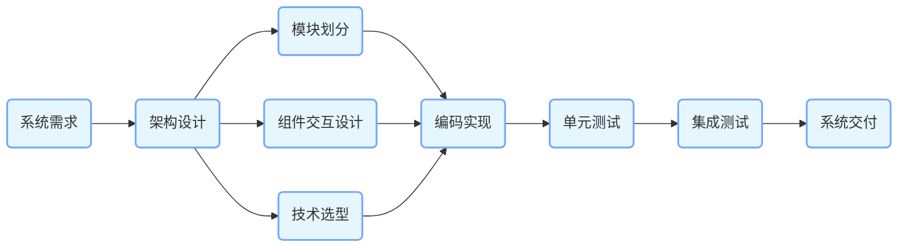

# 程序员的职业转型：从编码到架构

> 关键词：程序员、职业转型、编码、架构、软件架构师、技术成长、职业发展

> 摘要：本文聚焦于程序员从编码角色向架构师角色的职业转型。首先介绍了转型的背景信息，包括目的、预期读者等。接着阐述了编码和架构相关的核心概念及联系，深入讲解了架构设计的核心算法原理与具体操作步骤，借助数学模型和公式对架构设计进行剖析并举例说明。通过项目实战展示转型过程中如何进行代码实现和架构设计，分析了实际应用场景。还推荐了有助于转型的工具和资源，最后总结了未来发展趋势与挑战，提供常见问题解答及参考资料，旨在为程序员的职业转型提供全面且深入的指导。

## 1. 背景介绍 
### 1.1 目的和范围
在当今快速发展的软件行业中，程序员的职业发展路径多样，从编码到架构的转型是许多有抱负的程序员的目标。本文的目的在于为正考虑或已经踏上从编码角色向架构师角色转型之旅的程序员提供全面且深入的指导。范围涵盖了从基本概念的讲解，到具体算法和操作步骤的阐述，再到实际项目的应用案例分析，以及相关工具和资源的推荐，力求为转型者提供一站式的知识和实践支持。

### 1.2 预期读者
本文主要面向有一定编程经验，渴望在职业生涯中实现从程序员到软件架构师转型的专业人士。同时，对于软件行业的管理者、技术爱好者以及相关专业的学生，了解这一转型过程也有助于他们更好地理解软件开发生命周期中不同角色的职责和技能要求。

### 1.3 文档结构概述
本文将按照以下结构展开：首先介绍编码和架构相关的核心概念与联系，让读者对转型涉及的关键领域有清晰的认识；接着深入讲解架构设计的核心算法原理和具体操作步骤，并通过Python代码进行详细阐述；然后介绍架构设计中涉及的数学模型和公式，结合具体例子加深理解；通过项目实战部分展示在实际项目中如何进行架构设计和代码实现；分析架构师角色在不同场景下的实际应用；推荐有助于转型的学习资源、开发工具和相关论文著作；最后总结未来发展趋势与挑战，提供常见问题解答和扩展阅读参考资料。

### 1.4 术语表
#### 1.4.1 核心术语定义
- **程序员**：负责编写、测试和维护计算机程序的专业人员，主要关注代码的实现细节。
- **软件架构师**：负责设计软件系统的整体结构和框架，包括系统的模块划分、组件交互、技术选型等，确保系统的可扩展性、可维护性和性能等指标。
- **编码**：使用特定的编程语言将软件需求转化为计算机可执行的代码的过程。
- **架构设计**：对软件系统的整体结构和组织进行规划和设计，确定系统的各个组成部分及其相互关系。

#### 1.4.2 相关概念解释
- **模块化设计**：将软件系统划分为多个独立的模块，每个模块具有特定的功能和职责，模块之间通过接口进行交互。模块化设计有助于提高系统的可维护性和可扩展性。
- **分层架构**：将软件系统按照功能划分为不同的层次，每层具有特定的职责和功能，层与层之间通过接口进行通信。常见的分层架构包括表示层、业务逻辑层和数据访问层。
- **微服务架构**：一种将软件系统拆分为多个小型、自治的服务的架构模式，每个服务可以独立开发、部署和扩展。微服务架构有助于提高系统的灵活性和可伸缩性。

#### 1.4.3 缩略词列表
- **API**：Application Programming Interface，应用程序编程接口，用于不同软件组件之间的通信。
- **MVC**：Model - View - Controller，模型 - 视图 - 控制器，一种常见的软件设计模式，用于分离业务逻辑、数据和用户界面。
- **REST**：Representational State Transfer，表述性状态转移，一种设计和实现网络服务的架构风格。

## 2. 核心概念与联系 
### 编码与架构的核心概念
编码是软件开发过程中最基础的活动，程序员使用编程语言（如Python、Java、C++等）将软件需求转化为具体的代码实现。编码的重点在于实现功能的正确性、效率和可读性，需要掌握编程语言的语法、数据结构、算法等知识。

架构设计则是从更高的层面来规划软件系统的整体结构和组织。架构师需要考虑系统的性能、可扩展性、可维护性、安全性等多个方面的因素，选择合适的技术和设计模式，将系统划分为不同的模块和组件，并定义它们之间的交互方式。

### 编码与架构的联系
编码和架构是软件开发过程中紧密相关的两个环节。架构设计为编码提供了指导和框架，它规定了代码的组织结构和模块划分，使得程序员能够在一个统一的架构下进行代码实现。同时，编码过程中发现的问题和经验也可以反馈给架构师，促使架构的优化和改进。

### 核心概念原理和架构的文本示意图
```plaintext
软件系统
|-- 架构设计
|   |-- 系统需求分析
|   |-- 模块划分
|   |-- 组件交互设计
|   |-- 技术选型
|-- 编码实现
|   |-- 功能模块编码
|   |-- 单元测试
|   |-- 集成测试
```

### Mermaid 流程图


## 3. 核心算法原理 & 具体操作步骤 
### 架构设计中的核心算法原理
在架构设计中，有许多算法和技术用于解决不同的问题，例如负载均衡算法、缓存算法、数据库索引优化算法等。这里以负载均衡算法中的轮询算法为例进行详细讲解。

轮询算法是一种简单而常用的负载均衡算法，它按照顺序依次将请求分配到多个服务器上。其基本思想是维护一个服务器列表，每次有新的请求到来时，就将请求分配给列表中的下一个服务器，当到达列表末尾时，再从头开始。

### Python 源代码实现轮询算法
```python
class RoundRobinLoadBalancer:
    def __init__(self, servers):
        self.servers = servers
        self.index = 0

    def get_server(self):
        server = self.servers[self.index]
        self.index = (self.index + 1) % len(self.servers)
        return server

# 示例使用
servers = ["server1.example.com", "server2.example.com", "server3.example.com"]
load_balancer = RoundRobinLoadBalancer(servers)

# 模拟 5 次请求
for _ in range(5):
    print(load_balancer.get_server())
```

### 具体操作步骤
1. **需求分析**：首先要明确软件系统的功能需求、性能需求、可扩展性需求等。例如，如果系统需要处理大量的并发请求，就需要考虑使用负载均衡技术。
2. **架构选型**：根据需求分析的结果，选择合适的架构模式，如分层架构、微服务架构等。例如，如果系统的业务逻辑复杂且需要快速迭代开发，微服务架构可能是一个不错的选择。
3. **模块划分**：将系统划分为多个功能模块，每个模块具有明确的职责和功能。例如，一个电商系统可以划分为用户模块、商品模块、订单模块等。
4. **组件交互设计**：定义模块之间的交互方式和接口。例如，不同模块之间可以通过API进行通信。
5. **技术选型**：选择合适的技术和工具来实现架构设计。例如，选择合适的编程语言、数据库、框架等。
6. **编码实现**：按照架构设计的要求进行代码实现，确保代码的质量和可读性。
7. **测试和优化**：对系统进行单元测试、集成测试和性能测试，发现并解决问题，对架构进行优化。

## 4. 数学模型和公式 & 详细讲解 & 举例说明 
### 架构设计中的数学模型
在架构设计中，有许多数学模型和公式用于评估系统的性能、可扩展性等指标。例如，排队论模型可以用于分析系统的并发性能，Amdahl定律可以用于评估系统的并行性能。

### Amdahl 定律
Amdahl定律是由计算机科学家Gene Amdahl提出的，用于评估并行计算系统的加速比。加速比 $S$ 定义为串行执行时间 $T_{serial}$ 与并行执行时间 $T_{parallel}$ 的比值：

$$S = \frac{T_{serial}}{T_{parallel}}$$

Amdahl定律给出了加速比的上限，其公式为：

$$S = \frac{1}{(1 - P)+\frac{P}{N}}$$

其中，$P$ 是系统中可并行化的部分所占的比例，$N$ 是处理器的数量。

### 详细讲解
从Amdahl定律的公式可以看出，加速比 $S$ 受到可并行化部分的比例 $P$ 和处理器数量 $N$ 的影响。当 $P$ 固定时，随着 $N$ 的增加，加速比会逐渐趋近于 $\frac{1}{1 - P}$。这意味着，如果系统中可并行化的部分比例较低，即使增加处理器数量，加速比也不会有太大的提升。

### 举例说明
假设一个系统的可并行化部分比例 $P = 0.8$，即80%的代码可以并行执行，20%的代码必须串行执行。当使用2个处理器时，加速比为：

$$S = \frac{1}{(1 - 0.8)+\frac{0.8}{2}}=\frac{1}{0.2 + 0.4}=\frac{1}{0.6}\approx1.67$$

当使用4个处理器时，加速比为：

$$S = \frac{1}{(1 - 0.8)+\frac{0.8}{4}}=\frac{1}{0.2 + 0.2}=\frac{1}{0.4}=2.5$$

当使用8个处理器时，加速比为：

$$S = \frac{1}{(1 - 0.8)+\frac{0.8}{8}}=\frac{1}{0.2 + 0.1}=\frac{1}{0.3}\approx3.33$$

可以看出，随着处理器数量的增加，加速比逐渐增加，但增加的幅度逐渐减小。

## 5. 项目实战：代码实际案例和详细解释说明 
### 5.1  开发环境搭建
假设我们要开发一个简单的电商系统，使用Python和Flask框架。以下是开发环境的搭建步骤：

1. **安装Python**：从Python官方网站（https://www.python.org/downloads/）下载并安装Python 3.x版本。
2. **创建虚拟环境**：打开命令行工具，进入项目目录，执行以下命令创建虚拟环境：
```bash
python -m venv myenv
```
3. **激活虚拟环境**：在Windows系统上，执行以下命令激活虚拟环境：
```bash
myenv\Scripts\activate
```
在Linux或Mac系统上，执行以下命令激活虚拟环境：
```bash
source myenv/bin/activate
```
4. **安装Flask框架**：在激活的虚拟环境中，执行以下命令安装Flask框架：
```bash
pip install flask
```

### 5.2  源代码详细实现和代码解读
以下是一个简单的电商系统的Flask应用示例：

```python
from flask import Flask, jsonify

app = Flask(__name__)

# 模拟商品数据
products = [
    {"id": 1, "name": "iPhone 14", "price": 999.99},
    {"id": 2, "name": "MacBook Pro", "price": 1999.99},
    {"id": 3, "name": "iPad Air", "price": 599.99}
]

# 获取所有商品
@app.route('/products', methods=['GET'])
def get_products():
    return jsonify(products)

# 根据ID获取商品
@app.route('/products/<int:product_id>', methods=['GET'])
def get_product(product_id):
    product = next((p for p in products if p["id"] == product_id), None)
    if product:
        return jsonify(product)
    else:
        return jsonify({"message": "Product not found"}), 404

if __name__ == '__main__':
    app.run(debug=True)
```

### 代码解读与分析
1. **导入Flask库**：`from flask import Flask, jsonify` 导入Flask框架和用于返回JSON数据的 `jsonify` 函数。
2. **创建Flask应用实例**：`app = Flask(__name__)` 创建一个Flask应用实例。
3. **模拟商品数据**：`products` 列表用于存储商品信息，每个商品是一个字典，包含 `id`、`name` 和 `price` 三个字段。
4. **定义路由**：
    - `/products` 路由用于获取所有商品信息，使用 `GET` 请求方法，返回商品列表的JSON数据。
    - `/products/<int:product_id>` 路由用于根据商品ID获取单个商品信息，使用 `GET` 请求方法。如果找到对应的商品，则返回商品的JSON数据；否则返回错误信息和404状态码。
5. **运行应用**：`app.run(debug=True)` 启动Flask应用，并开启调试模式。

### 架构设计分析
在这个简单的电商系统中，我们可以采用分层架构进行设计。可以将系统划分为表示层、业务逻辑层和数据访问层。

- **表示层**：负责处理用户请求和返回响应，这里使用Flask框架实现路由和视图函数。
- **业务逻辑层**：负责处理业务逻辑，例如商品的查询、添加、删除等操作。在这个示例中，业务逻辑比较简单，直接在视图函数中实现。
- **数据访问层**：负责与数据库进行交互，这里使用模拟数据代替数据库。在实际项目中，可以使用SQLAlchemy等ORM框架来实现数据访问层。

## 6. 实际应用场景 
### 互联网应用
在互联网应用中，如电商平台、社交网络、在线游戏等，软件架构师需要设计高并发、高可扩展性的系统架构。例如，电商平台在促销活动期间会面临大量的用户请求，需要采用分布式架构、缓存技术、负载均衡等手段来确保系统的性能和稳定性。

### 企业级应用
企业级应用通常需要处理复杂的业务逻辑和大量的数据，软件架构师需要设计安全可靠、易于维护的系统架构。例如，企业资源规划（ERP）系统需要集成多个业务部门的信息，需要采用分层架构、微服务架构等模式来实现系统的模块化和可扩展性。

### 移动应用
移动应用需要考虑设备的性能和网络环境，软件架构师需要设计轻量级、高效的系统架构。例如，移动支付应用需要保证交易的安全性和及时性，需要采用加密技术、消息队列等手段来实现系统的高可用性。

## 7. 工具和资源推荐
### 7.1 学习资源推荐
#### 7.1.1 书籍推荐
- 《软件架构设计：程序员向架构师转型必备》：本书详细介绍了软件架构设计的基本概念、方法和实践，适合想要从程序员转型为架构师的读者阅读。
- 《大型网站技术架构：核心原理与案例分析》：通过实际案例分析，介绍了大型网站的技术架构和设计思路，对架构师的实践能力提升有很大帮助。
- 《代码大全（第2版）》：虽然主要是关于编码的书籍，但其中关于软件设计和架构的部分也非常有价值，有助于程序员培养良好的架构思维。

#### 7.1.2 在线课程
- Coursera上的“Software Architecture and Design”课程：由知名高校的教授授课，系统地介绍了软件架构设计的理论和实践。
- edX上的“Cloud Computing and Big Data”课程：介绍了云计算和大数据相关的技术和架构，对于架构师了解新兴技术有很大帮助。
- 慕课网上的“Java架构师成长之路”课程：针对Java开发人员，详细介绍了从程序员到架构师的成长路径和技术要点。

#### 7.1.3 技术博客和网站
- InfoQ：提供了丰富的技术文章和资讯，涵盖了软件架构、云计算、大数据等多个领域。
- 开源中国：国内知名的开源技术社区，有很多关于软件架构和开发的技术文章和案例分享。
- 架构师之路：专注于软件架构领域的技术博客，提供了很多实用的架构设计案例和经验分享。

### 7.2 开发工具框架推荐
#### 7.2.1 IDE和编辑器
- IntelliJ IDEA：功能强大的Java集成开发环境，支持代码编辑、调试、重构等多种功能，对于Java架构师来说是一个很好的选择。
- PyCharm：专门为Python开发设计的集成开发环境，支持代码自动补全、调试、版本控制等功能，适合Python架构师使用。
- Visual Studio Code：轻量级的代码编辑器，支持多种编程语言和插件扩展，具有良好的可定制性。

#### 7.2.2 调试和性能分析工具
- JProfiler：用于Java应用程序的性能分析工具，可以帮助架构师找出性能瓶颈和内存泄漏问题。
- Py-Spy：用于Python应用程序的性能分析工具，能够实时分析Python代码的执行情况。
- New Relic：一款全栈性能监控工具，支持多种编程语言和框架，可以帮助架构师监控应用程序的性能和健康状况。

#### 7.2.3 相关框架和库
- Spring Framework：Java开发中最流行的框架之一，提供了IoC、AOP等功能，有助于实现分层架构和模块化设计。
- Django：Python开发中常用的Web框架，具有快速开发、安全可靠等特点，适合开发企业级应用。
- Docker：用于容器化应用的开源平台，可以帮助架构师实现应用的快速部署和资源隔离。

### 7.3 相关论文著作推荐
#### 7.3.1 经典论文
- “A Rational Design Process: How and Why to Fake It” by David L. Parnas：提出了软件设计的模块化原则，对软件架构设计产生了深远影响。
- “Patterns for Fault - Tolerant Software” by Michael D. Ernst：介绍了软件容错设计的模式和方法，对于提高系统的可靠性有重要意义。
- “The Cathedral and the Bazaar” by Eric S. Raymond：探讨了开源软件的开发模式和文化，对于理解软件架构的发展趋势有帮助。

#### 7.3.2 最新研究成果
- 关注ACM SIGSOFT、IEEE Software等学术会议和期刊，了解软件架构领域的最新研究成果和技术趋势。
- 一些知名高校和研究机构的研究报告，如麻省理工学院、斯坦福大学等的相关研究。

#### 7.3.3 应用案例分析
- 《企业IT架构转型之道：阿里巴巴中台战略思想与架构实战》：介绍了阿里巴巴的中台战略和架构实践，对于企业级架构设计有很大的借鉴意义。
- 《Netflix Tech Blog》：Netflix公司的技术博客，分享了很多关于大规模分布式系统架构设计和优化的实践经验。

## 8. 总结：未来发展趋势与挑战
### 未来发展趋势
- **云原生架构**：随着云计算技术的发展，云原生架构将成为未来软件架构的主流。云原生架构包括容器、微服务、DevOps等技术，能够实现应用的快速部署、弹性伸缩和高效管理。
- **人工智能与机器学习融合**：人工智能和机器学习技术将越来越多地应用于软件系统中，软件架构师需要设计能够支持这些技术的架构，例如分布式训练平台、实时推理引擎等。
- **低代码/无代码开发**：低代码/无代码开发平台的出现将改变软件开发的模式，软件架构师需要设计能够与这些平台集成的架构，提高开发效率和降低成本。

### 挑战
- **技术更新换代快**：软件行业的技术更新换代非常快，软件架构师需要不断学习和掌握新的技术，以适应市场的需求。
- **系统复杂性增加**：随着软件系统的功能越来越复杂，架构设计的难度也越来越大。软件架构师需要在保证系统性能和可维护性的前提下，应对系统的复杂性。
- **安全和隐私问题**：随着数据泄露和网络攻击事件的不断增加，软件架构师需要在架构设计中充分考虑安全和隐私问题，确保系统的安全性和可靠性。

## 9. 附录：常见问题与解答
### 问题1：从程序员转型为架构师需要具备哪些技能？
答：需要具备扎实的编程基础、良好的系统分析和设计能力、掌握多种架构模式和技术、具备团队协作和沟通能力等。

### 问题2：如何提升自己的架构设计能力？
答：可以通过学习相关的书籍和课程、参与实际项目、阅读优秀的架构设计案例、与其他架构师交流等方式来提升自己的架构设计能力。

### 问题3：架构师需要了解数据库知识吗？
答：需要。数据库是软件系统的重要组成部分，架构师需要了解数据库的原理、设计和优化方法，以便在架构设计中选择合适的数据库和进行数据访问层的设计。

### 问题4：架构师和项目经理有什么区别？
答：架构师主要负责软件系统的架构设计，关注系统的技术实现和性能指标；项目经理主要负责项目的管理和协调，关注项目的进度、成本和质量。

## 10. 扩展阅读 & 参考资料
- 《设计模式：可复用面向对象软件的基础》，Erich Gamma等著
- 《Effective Java》，Joshua Bloch著
- 维基百科相关词条：Software architecture、Programmer等
- 各技术社区论坛的相关讨论和分享，如Stack Overflow、GitHub等。