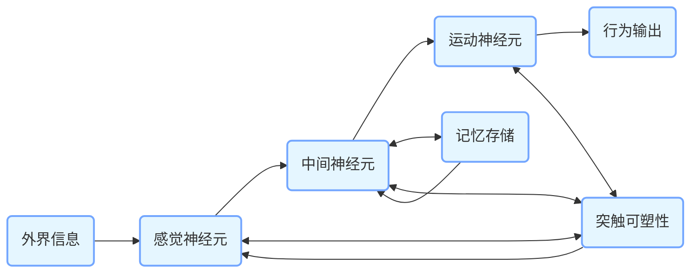

# 类脑计算模型:融合神经科学与AI的新思路

> 关键词：类脑计算模型、神经科学、人工智能、脑启发、计算架构、神经形态工程、认知计算

> 摘要：本文深入探讨了类脑计算模型这一融合神经科学与人工智能的新思路。首先介绍了类脑计算模型提出的背景和相关基本概念，包括其目的、预期读者、文档结构及术语解释。接着阐述了类脑计算模型的核心概念与联系，通过文本示意图和Mermaid流程图进行清晰展示。详细讲解了核心算法原理和具体操作步骤，结合Python源代码进行分析。同时给出了相关的数学模型和公式，并举例说明。通过项目实战展示了类脑计算模型的代码实现和解读。探讨了其实际应用场景，推荐了相关的学习资源、开发工具框架和论文著作。最后总结了类脑计算模型的未来发展趋势与挑战，还提供了常见问题解答和扩展阅读参考资料，旨在全面深入地介绍类脑计算模型这一前沿领域。

## 1. 背景介绍 
### 1.1 目的和范围
随着人工智能的快速发展，传统的计算架构在处理复杂认知任务时面临着效率低下、能耗过高等问题。类脑计算模型旨在借鉴神经科学中大脑的工作原理，开发出更加高效、智能且具有生物合理性的计算系统。本文章的范围涵盖了类脑计算模型的基本概念、核心算法、数学模型、实际应用等多个方面，旨在为读者全面深入地介绍这一领域的知识和技术。

### 1.2 预期读者
本文预期读者包括对人工智能、神经科学、计算机科学等领域感兴趣的科研人员、工程师、学生以及相关领域的爱好者。无论是希望深入研究类脑计算模型的专业人士，还是初步接触该领域希望了解相关知识的初学者，都能从本文中获得有价值的信息。

### 1.3 文档结构概述
本文首先介绍类脑计算模型的背景知识，包括目的、预期读者等内容。接着阐述核心概念与联系，通过示意图和流程图帮助读者理解。然后详细讲解核心算法原理和具体操作步骤，结合Python代码进行说明。随后给出数学模型和公式，并举例分析。通过项目实战展示代码实现和解读。探讨实际应用场景，推荐相关的学习资源、开发工具和论文著作。最后总结未来发展趋势与挑战，提供常见问题解答和扩展阅读参考资料。

### 1.4 术语表
#### 1.4.1 核心术语定义
- **类脑计算模型**：模仿大脑神经系统的结构和功能，构建的具有生物启发式的计算模型，旨在实现高效的信息处理和智能行为。
- **神经科学**：研究神经系统的结构、功能、发育、病理等方面的科学领域。
- **人工智能**：使计算机系统能够执行通常需要人类智能才能完成的任务的技术和学科。
- **神经形态工程**：结合神经科学和工程学，设计和开发模拟生物神经系统的硬件和软件系统的学科。
- **认知计算**：旨在模拟人类认知过程，如感知、学习、推理、决策等的计算方法和技术。

#### 1.4.2 相关概念解释
- **突触可塑性**：神经元之间突触连接强度的可调节性，是大脑学习和记忆的重要机制。
- **神经元模型**：用于描述神经元行为和功能的数学或计算模型，如Hodgkin - Huxley模型、Leaky Integrate - and - Fire模型等。
- **神经编码**：神经元如何将外界信息编码为电活动模式的方式，如速率编码、时间编码等。

#### 1.4.3 缩略词列表
- **ANN**：Artificial Neural Network，人工神经网络
- **SNN**：Spiking Neural Network，脉冲神经网络
- **CMOS**：Complementary Metal - Oxide - Semiconductor，互补金属氧化物半导体

## 2. 核心概念与联系 
类脑计算模型的核心在于融合神经科学和人工智能的思想，借鉴大脑的神经结构和信息处理机制来构建更加智能和高效的计算系统。

### 文本示意图
大脑是一个高度复杂的生物系统，由大量的神经元通过突触相互连接而成。神经元之间通过电信号和化学信号进行信息传递和处理。在类脑计算模型中，我们模仿大脑的这种结构和功能，构建人工神经元和突触连接，形成一个计算网络。

人工神经元接收输入信号，对其进行处理后产生输出信号。突触连接则负责调节神经元之间的信号传递强度。通过不断调整突触连接的强度，类脑计算模型可以实现学习和适应的能力，类似于大脑的学习和记忆机制。

### Mermaid 流程图

这个流程图展示了类脑计算模型中信息处理的基本过程。外界信息首先被感觉神经元接收，然后通过中间神经元进行处理和传递，最后由运动神经元产生行为输出。同时，中间神经元与记忆存储模块相互作用，实现学习和记忆功能。突触可塑性机制则对神经元之间的连接强度进行调节，影响整个信息处理过程。

## 3. 核心算法原理 & 具体操作步骤 
### 核心算法原理
类脑计算模型中常用的一种算法是基于脉冲神经网络（SNN）的算法。脉冲神经网络是一种更加接近生物神经元行为的人工神经网络模型，它的神经元以脉冲的形式传递信息。

#### Leaky Integrate - and - Fire（LIF）神经元模型
LIF模型是一种简单而常用的神经元模型，其基本思想是神经元接收输入电流，对其进行积分，当积分值超过阈值时，神经元产生一个脉冲，然后积分值重置。

以下是LIF模型的Python实现：
```python
import numpy as np
import matplotlib.pyplot as plt

# LIF神经元参数
tau = 10.0  # 时间常数
R = 10.0  # 膜电阻
V_th = 1.0  # 阈值电压
V_reset = 0.0  # 重置电压

# 模拟时间参数
T = 100.0  # 总模拟时间
dt = 0.1  # 时间步长
t = np.arange(0, T, dt)

# 输入电流
I = np.zeros_like(t)
I[200:800] = 0.2  # 在20ms到80ms之间施加输入电流

# 初始化电压
V = np.zeros_like(t)
V[0] = V_reset

# 模拟LIF神经元
spikes = []
for i in range(1, len(t)):
    dV = (-V[i - 1] + R * I[i - 1]) / tau * dt
    V[i] = V[i - 1] + dV
    if V[i] >= V_th:
        V[i] = V_reset
        spikes.append(t[i])

# 绘制结果
plt.figure(figsize=(12, 6))
plt.subplot(2, 1, 1)
plt.plot(t, I, label='Input Current')
plt.xlabel('Time (ms)')
plt.ylabel('Current (A)')
plt.legend()

plt.subplot(2, 1, 2)
plt.plot(t, V, label='Membrane Voltage')
for spike_time in spikes:
    plt.axvline(x=spike_time, color='r', linestyle='--', label='Spike' if spike_time == spikes[0] else "")
plt.xlabel('Time (ms)')
plt.ylabel('Voltage (V)')
plt.legend()

plt.show()
```
### 具体操作步骤
1. **参数设置**：设置LIF神经元的参数，如时间常数 `tau`、膜电阻 `R`、阈值电压 `V_th` 和重置电压 `V_reset`。同时设置模拟时间参数，如总模拟时间 `T` 和时间步长 `dt`。
2. **输入电流定义**：定义输入电流随时间的变化，例如在某个时间段内施加恒定电流。
3. **电压初始化**：将神经元的初始膜电压设置为重置电压。
4. **模拟过程**：在每个时间步长内，根据LIF模型的微分方程计算膜电压的变化，并更新膜电压。如果膜电压超过阈值，则产生一个脉冲，将膜电压重置为重置电压，并记录脉冲时间。
5. **结果可视化**：绘制输入电流和膜电压随时间的变化曲线，并标记出脉冲时间。

## 4. 数学模型和公式 & 详细讲解 & 举例说明 
### LIF神经元模型的数学公式
LIF神经元模型的动态行为可以用以下一阶线性微分方程描述：
$$
\tau \frac{dV(t)}{dt} = -V(t) + R I(t)
$$
其中，$V(t)$ 是神经元在时间 $t$ 的膜电压，$\tau$ 是时间常数，$R$ 是膜电阻，$I(t)$ 是输入电流。

当膜电压 $V(t)$ 超过阈值电压 $V_{th}$ 时，神经元产生一个脉冲，然后膜电压重置为重置电压 $V_{reset}$：
$$
V(t) = 
\begin{cases}
V_{reset}, & \text{if } V(t) \geq V_{th} \\
\text{由上述微分方程计算}, & \text{otherwise}
\end{cases}
$$

### 详细讲解
- **时间常数 $\tau$**：时间常数 $\tau$ 决定了神经元膜电压的变化速度。$\tau$ 越大，膜电压的变化越缓慢，神经元对输入信号的响应越迟钝；$\tau$ 越小，膜电压的变化越迅速，神经元对输入信号的响应越灵敏。
- **膜电阻 $R$**：膜电阻 $R$ 反映了神经元膜对电流的阻碍作用。$R$ 越大，相同输入电流下产生的膜电压变化越大；$R$ 越小，膜电压变化越小。
- **阈值电压 $V_{th}$**：阈值电压 $V_{th}$ 是神经元产生脉冲的临界电压。只有当膜电压超过阈值电压时，神经元才会产生脉冲。
- **重置电压 $V_{reset}$**：重置电压 $V_{reset}$ 是神经元产生脉冲后膜电压恢复到的初始值。

### 举例说明
假设 $\tau = 10$ ms，$R = 10$ $\Omega$，$V_{th} = 1$ V，$V_{reset} = 0$ V，输入电流 $I(t)$ 在 $20$ ms 到 $80$ ms 之间为 $0.2$ A，其他时间为 $0$ A。

在 $t = 0$ 时，$V(0) = V_{reset} = 0$ V。在 $20$ ms 到 $80$ ms 之间，输入电流 $I(t) = 0.2$ A，根据LIF模型的微分方程，膜电压 $V(t)$ 开始上升。当 $V(t)$ 超过阈值电压 $V_{th} = 1$ V 时，神经元产生一个脉冲，膜电压重置为 $V_{reset} = 0$ V，然后继续根据输入电流进行积分。在 $80$ ms 之后，输入电流 $I(t) = 0$ A，膜电压逐渐衰减到 $0$ V。

## 5. 项目实战：代码实际案例和详细解释说明 
### 5.1  开发环境搭建
为了实现类脑计算模型的项目实战，我们需要搭建一个Python开发环境。以下是具体步骤：

1. **安装Python**：访问Python官方网站（https://www.python.org/downloads/），下载并安装适合你操作系统的Python版本。建议安装Python 3.6及以上版本。
2. **安装依赖库**：我们需要安装一些常用的Python库，如 `numpy`、`matplotlib` 等。可以使用 `pip` 命令进行安装：
```sh
pip install numpy matplotlib
```

### 5.2  源代码详细实现和代码解读
以下是一个简单的类脑计算模型项目实战代码，实现了一个简单的脉冲神经网络，用于模式识别任务。

```python
import numpy as np
import matplotlib.pyplot as plt

# 定义LIF神经元类
class LIFNeuron:
    def __init__(self, tau=10.0, R=10.0, V_th=1.0, V_reset=0.0):
        self.tau = tau
        self.R = R
        self.V_th = V_th
        self.V_reset = V_reset
        self.V = V_reset

    def update(self, I, dt):
        dV = (-self.V + self.R * I) / self.tau * dt
        self.V += dV
        if self.V >= self.V_th:
            spike = 1
            self.V = self.V_reset
        else:
            spike = 0
        return spike

# 定义脉冲神经网络类
class SNN:
    def __init__(self, num_inputs, num_neurons, dt=0.1):
        self.num_inputs = num_inputs
        self.num_neurons = num_neurons
        self.dt = dt
        self.neurons = [LIFNeuron() for _ in range(num_neurons)]
        self.weights = np.random.rand(num_neurons, num_inputs)

    def forward(self, inputs, T):
        spikes = np.zeros((self.num_neurons, int(T / self.dt)))
        for t in range(int(T / self.dt)):
            for i in range(self.num_neurons):
                I = np.dot(self.weights[i], inputs)
                spike = self.neurons[i].update(I, self.dt)
                spikes[i, t] = spike
        return spikes

# 生成输入模式
num_inputs = 10
input_pattern = np.random.randint(0, 2, num_inputs)

# 创建脉冲神经网络
num_neurons = 5
snn = SNN(num_inputs, num_neurons)

# 模拟网络
T = 100.0
spikes = snn.forward(input_pattern, T)

# 绘制结果
plt.figure(figsize=(12, 6))
for i in range(num_neurons):
    spike_times = np.where(spikes[i])[0] * snn.dt
    plt.plot(spike_times, np.ones_like(spike_times) * i, '|', markersize=10)
plt.xlabel('Time (ms)')
plt.ylabel('Neuron Index')
plt.title('Spike Raster Plot')
plt.show()
```

### 5.3  代码解读与分析
- **LIFNeuron类**：该类实现了LIF神经元的基本功能。`__init__` 方法用于初始化神经元的参数，如时间常数 `tau`、膜电阻 `R`、阈值电压 `V_th` 和重置电压 `V_reset`，并将初始膜电压设置为重置电压。`update` 方法根据输入电流 `I` 和时间步长 `dt` 更新膜电压，并判断是否产生脉冲。
- **SNN类**：该类实现了一个简单的脉冲神经网络。`__init__` 方法用于初始化网络的参数，包括输入神经元数量 `num_inputs`、隐藏神经元数量 `num_neurons` 和时间步长 `dt`，并随机初始化神经元和突触权重。`forward` 方法用于模拟网络的前向传播过程，根据输入模式 `inputs` 和模拟时间 `T` 计算每个神经元的脉冲输出。
- **主程序**：首先生成一个随机的输入模式，然后创建一个脉冲神经网络，调用 `forward` 方法进行模拟，最后绘制脉冲光栅图展示神经元的脉冲输出。

## 6. 实际应用场景 
### 智能机器人
类脑计算模型可以应用于智能机器人的设计中，使机器人能够更加智能地感知环境、学习和决策。例如，通过模仿大脑的视觉处理机制，机器人可以更准确地识别物体和场景；通过模仿大脑的运动控制机制，机器人可以实现更加灵活和高效的运动。

### 医疗诊断
在医疗诊断领域，类脑计算模型可以帮助医生分析医学图像、诊断疾病。例如，通过构建类脑计算模型来处理X光、CT等医学图像，能够更准确地检测出病变和疾病，提高诊断的准确性和效率。

### 金融风险预测
类脑计算模型可以用于金融风险预测，通过学习历史金融数据中的模式和规律，预测市场趋势和风险。例如，模仿大脑的学习和记忆机制，对股票价格、利率等金融数据进行分析和预测，帮助投资者做出更明智的决策。

### 智能家居
在智能家居系统中，类脑计算模型可以实现智能设备的自适应控制和交互。例如，根据用户的行为习惯和环境变化，自动调节灯光、温度、家电等设备的运行状态，提高家居的舒适度和能源效率。

## 7. 工具和资源推荐
### 7.1 学习资源推荐
#### 7.1.1 书籍推荐
- 《Neural Networks and Deep Learning》：这本书详细介绍了神经网络和深度学习的基本原理和算法，是学习类脑计算模型的重要参考书籍。
- 《Theoretical Neuroscience: Computational and Mathematical Modeling of Neural Systems》：该书从理论角度深入探讨了神经系统的计算和数学建模，对于理解类脑计算模型的生物学基础非常有帮助。

#### 7.1.2 在线课程
- Coursera上的“Neural Networks and Deep Learning”课程：由深度学习领域的知名专家Andrew Ng教授授课，系统地介绍了神经网络和深度学习的知识。
- edX上的“Computational Neuroscience”课程：该课程涵盖了计算神经科学的基本概念和方法，有助于学习类脑计算模型的相关知识。

#### 7.1.3 技术博客和网站
- Medium上的“Towards Data Science”：该博客上有很多关于人工智能、机器学习和类脑计算模型的技术文章和案例分析。
- arXiv（https://arxiv.org/）：一个预印本平台，提供了大量关于类脑计算模型的最新研究论文。

### 7.2 开发工具框架推荐
#### 7.2.1 IDE和编辑器
- PyCharm：一款功能强大的Python集成开发环境，提供了代码编辑、调试、版本控制等功能，适合开发类脑计算模型的Python代码。
- Jupyter Notebook：一个交互式的开发环境，支持Python、R等多种编程语言，方便进行代码实验和可视化展示。

#### 7.2.2 调试和性能分析工具
- TensorBoard：一个用于可视化和分析深度学习模型训练过程的工具，可以帮助用户监测模型的性能和训练进度。
- cProfile：Python内置的性能分析工具，可以帮助用户找出代码中的性能瓶颈。

#### 7.2.3 相关框架和库
- PyTorch：一个开源的深度学习框架，提供了丰富的神经网络层和优化算法，支持脉冲神经网络的开发。
- Brian2：一个用于模拟脉冲神经网络的Python库，提供了简单易用的API，方便用户构建和模拟类脑计算模型。

### 7.3 相关论文著作推荐
#### 7.3.1 经典论文
- Hodgkin, A. L., & Huxley, A. F. (1952). A quantitative description of membrane current and its application to conduction and excitation in nerve. The Journal of physiology, 117(4), 500 - 544. 该论文提出了Hodgkin - Huxley模型，是神经科学领域的经典之作。
- Hopfield, J. J. (1982). Neural networks and physical systems with emergent collective computational abilities. Proceedings of the national academy of sciences, 79(8), 2554 - 2558. 该论文提出了Hopfield神经网络模型，对类脑计算模型的发展产生了重要影响。

#### 7.3.2 最新研究成果
- 可以关注NeurIPS、ICML、CVPR等顶级学术会议上关于类脑计算模型的最新研究论文，了解该领域的前沿动态。

#### 7.3.3 应用案例分析
- 一些实际应用领域的研究论文，如智能机器人、医疗诊断等领域中类脑计算模型的应用案例分析，可以帮助读者更好地理解类脑计算模型的实际应用效果。

## 8. 总结：未来发展趋势与挑战
### 未来发展趋势
- **硬件与软件的深度融合**：未来类脑计算模型将更加注重硬件与软件的协同设计，开发出专门的类脑计算芯片，实现高效的类脑计算系统。
- **多学科交叉融合**：类脑计算模型将进一步与神经科学、计算机科学、数学、物理学等多学科进行交叉融合，推动该领域的创新发展。
- **应用领域的拓展**：类脑计算模型将在更多领域得到应用，如智能交通、能源管理、环境保护等，为解决复杂的实际问题提供新的思路和方法。

### 挑战
- **生物机制的理解**：目前我们对大脑的工作机制还存在很多未知，如何更深入地理解生物神经系统的原理，是类脑计算模型发展的关键挑战之一。
- **计算资源的限制**：类脑计算模型通常需要大量的计算资源，如何在有限的计算资源下实现高效的类脑计算，是一个亟待解决的问题。
- **伦理和社会问题**：随着类脑计算模型的发展，可能会带来一些伦理和社会问题，如隐私保护、人工智能的道德责任等，需要我们认真对待和解决。

## 9. 附录：常见问题与解答
### 类脑计算模型与传统人工智能模型有什么区别？
类脑计算模型借鉴了大脑的神经结构和信息处理机制，更加注重生物合理性和神经生物学原理。而传统人工智能模型，如人工神经网络，主要基于数学和统计学原理，对生物神经系统的模拟相对较浅。

### 类脑计算模型的实现难度大吗？
类脑计算模型的实现难度相对较大。一方面，需要深入理解神经科学的知识，掌握大脑的工作机制；另一方面，需要具备较强的计算机科学和数学基础，能够开发出高效的计算算法和模型。

### 类脑计算模型在实际应用中有哪些优势？
类脑计算模型在处理复杂认知任务时具有更高的效率和智能性，能够更好地适应环境变化。同时，类脑计算模型具有更低的能耗，更符合可持续发展的要求。

## 10. 扩展阅读 & 参考资料
- Dayan, P., & Abbott, L. F. (2001). Theoretical neuroscience: computational and mathematical modeling of neural systems. MIT press.
- Goodfellow, I. J., Bengio, Y., & Courville, A. (2016). Deep learning. MIT press.
- https://www.nature.com/
- https://science.sciencemag.org/